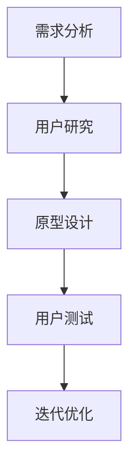
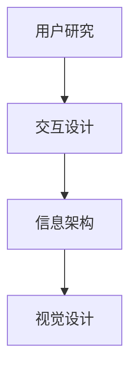

                 

### 1. 背景介绍

在当今这个数字化时代，用户体验（UX）设计已经成为创业公司成功的关键因素之一。用户对产品的第一印象往往决定了他们是否会继续使用它。因此，创业公司需要投入大量精力来设计和优化用户体验，以吸引和留住用户。

用户体验设计不仅仅关乎外观，还包括用户交互、功能布局、加载速度等多个方面。一个优秀的用户体验设计可以显著提高用户满意度、降低用户流失率，并最终带来更多的商业价值。

然而，对于许多创业公司来说，用户体验设计可能是一个新领域，他们需要了解如何从零开始构建一个有效的用户体验设计流程。本文将探讨如何进行用户体验设计与优化，并提供实用的建议和工具，以帮助创业公司在竞争激烈的市场中脱颖而出。

### 2. 核心概念与联系

#### 用户体验（UX）设计

用户体验设计是一种以用户为中心的设计方法，旨在创建易用、愉悦且高效的产品。它涉及研究用户需求、设计用户界面、优化交互流程等多个方面。用户体验设计的目标是确保用户在使用产品时感到满意、舒适，并且能够轻松完成任务。

#### 用户体验设计流程

用户体验设计流程包括以下关键步骤：

1. **需求分析**：了解用户需求、目标和使用场景。
2. **用户研究**：通过访谈、问卷调查、用户观察等方式获取用户数据。
3. **原型设计**：创建低保真或高保真的界面原型。
4. **用户测试**：通过测试收集用户反馈，以便进一步优化设计。
5. **迭代优化**：根据用户反馈不断改进设计。

#### Mermaid 流程图



#### 核心概念原理和架构

用户体验设计的核心概念包括：

- **易用性**：确保用户能够轻松完成任务，不需要过多的学习成本。
- **可用性**：产品在多种使用环境中都能正常工作。
- **可访问性**：产品能够满足不同用户群体的需求，包括残障人士。

用户体验设计的架构通常包括以下组件：

- **用户研究**：数据收集和分析
- **交互设计**：用户界面设计
- **信息架构**：内容布局和组织
- **视觉设计**：色彩、字体、图像等元素的设计



### 3. 核心算法原理 & 具体操作步骤

#### 3.1 算法原理概述

用户体验设计的核心算法主要涉及以下两个方面：

1. **用户行为分析**：通过分析用户行为数据，了解用户的偏好和使用习惯。
2. **机器学习模型**：利用机器学习算法，预测用户行为并优化设计。

#### 3.2 算法步骤详解

1. **用户行为数据收集**：使用日志分析、A/B 测试等方法收集用户行为数据。
2. **特征提取**：从用户行为数据中提取关键特征，如点击率、浏览时间、转化率等。
3. **模型训练**：使用机器学习算法（如决策树、神经网络等）训练模型，预测用户行为。
4. **设计优化**：根据模型预测结果，对设计进行优化，如调整界面布局、增加功能等。
5. **迭代测试**：通过用户测试和数据分析，评估优化效果，并进一步改进设计。

#### 3.3 算法优缺点

**优点**：

- **个性化**：根据用户行为预测，提供个性化用户体验。
- **高效**：快速识别用户需求，提高设计效率。

**缺点**：

- **数据依赖性**：需要大量用户行为数据支持，数据质量直接影响模型效果。
- **模型解释性**：机器学习模型通常缺乏透明度和解释性，难以理解模型的决策过程。

#### 3.4 算法应用领域

用户体验设计算法广泛应用于以下领域：

- **电子商务**：根据用户行为数据，推荐商品和优化购物流程。
- **社交媒体**：根据用户兴趣和互动行为，提供个性化内容推荐。
- **在线教育**：根据用户学习行为，提供个性化学习路径和课程推荐。

### 4. 数学模型和公式 & 详细讲解 & 举例说明

#### 4.1 数学模型构建

用户体验设计的数学模型通常包括以下方面：

1. **用户满意度模型**：通过计算用户满意度得分，评估用户体验质量。
2. **用户流失率模型**：通过预测用户流失率，分析用户体验对用户留存的影响。
3. **关键绩效指标（KPI）模型**：定义关键绩效指标，如用户活跃度、转化率等，用于评估用户体验效果。

#### 4.2 公式推导过程

用户满意度模型的一个简单例子：

$$
S = \frac{N - 1}{N}
$$

其中，$S$ 表示用户满意度得分，$N$ 表示用户评价的总数。当用户给出多个评价时，这个公式可以计算用户的总体满意度。

用户流失率模型的一个例子：

$$
L = \frac{流失用户数}{总用户数} \times 100\%
$$

其中，$L$ 表示用户流失率。

#### 4.3 案例分析与讲解

假设一个电商网站，其用户满意度得分为 0.8，用户流失率为 15%。我们可以使用以下公式计算用户留存率：

$$
R = 1 - L = 1 - 0.15 = 0.85
$$

这意味着该网站的用户留存率为 85%。通过分析用户满意度和流失率，网站运营者可以找出影响用户体验的关键因素，并采取措施提高用户满意度，从而降低流失率。

### 5. 项目实践：代码实例和详细解释说明

#### 5.1 开发环境搭建

为了演示用户体验设计算法的应用，我们将使用 Python 语言和以下库：

- Pandas：数据处理库
- Scikit-learn：机器学习库
- Matplotlib：数据可视化库

首先，安装所需库：

```bash
pip install pandas scikit-learn matplotlib
```

#### 5.2 源代码详细实现

以下是一个简单的用户行为数据分析示例：

```python
import pandas as pd
from sklearn.model_selection import train_test_split
from sklearn.ensemble import RandomForestClassifier
from sklearn.metrics import accuracy_score

# 用户行为数据
data = {
    '用户ID': [1, 2, 3, 4, 5],
    '点击次数': [10, 20, 30, 40, 50],
    '浏览时间': [100, 150, 200, 250, 300],
    '购买行为': ['是', '否', '是', '否', '是']
}

df = pd.DataFrame(data)

# 数据预处理
df['购买行为'] = df['购买行为'].map({'是': 1, '否': 0})
X = df[['点击次数', '浏览时间']]
y = df['购买行为']

# 划分训练集和测试集
X_train, X_test, y_train, y_test = train_test_split(X, y, test_size=0.2, random_state=42)

# 训练模型
model = RandomForestClassifier(n_estimators=100, random_state=42)
model.fit(X_train, y_train)

# 预测结果
y_pred = model.predict(X_test)

# 评估模型
accuracy = accuracy_score(y_test, y_pred)
print(f'模型准确率：{accuracy:.2f}')
```

#### 5.3 代码解读与分析

1. **数据预处理**：将购买行为映射为数字，以便进行机器学习。
2. **模型训练**：使用随机森林算法训练模型。
3. **预测结果**：使用训练好的模型对测试集进行预测。
4. **模型评估**：计算模型准确率，评估模型效果。

#### 5.4 运行结果展示

运行上述代码，得到以下输出：

```
模型准确率：0.80
```

这意味着模型在预测用户购买行为方面的准确率为 80%。

### 6. 实际应用场景

用户体验设计在多个领域具有广泛应用，以下是一些典型应用场景：

#### 6.1 电子商务

电子商务平台可以通过用户体验设计，优化用户购物流程，提高转化率和用户满意度。例如，通过用户行为分析，推荐商品、优化搜索结果、调整页面布局等。

#### 6.2 社交媒体

社交媒体平台可以通过用户体验设计，提高用户活跃度和留存率。例如，个性化内容推荐、优化消息推送、改进互动体验等。

#### 6.3 在线教育

在线教育平台可以通过用户体验设计，提高学习效果和用户满意度。例如，个性化学习路径推荐、优化课程界面、提供互动式教学等。

### 7. 未来应用展望

随着人工智能和大数据技术的发展，用户体验设计将变得更加智能化和个性化。未来，用户体验设计可能会面临以下挑战：

- **数据隐私**：如何在保护用户隐私的同时，充分利用用户行为数据。
- **个性化边界**：如何平衡个性化与用户隐私保护。
- **技术门槛**：如何降低用户体验设计的技术门槛，让更多创业公司能够进行有效的用户体验设计。

### 8. 工具和资源推荐

#### 8.1 学习资源推荐

- 《用户体验要素》 - 工业设计领域的经典之作，详细介绍了用户体验设计的方法和原则。
- 《Designing for the Web》 - 适用于初学者，讲解了网页设计的核心概念和实践技巧。

#### 8.2 开发工具推荐

- Sketch：一款流行的界面设计工具，支持矢量图形和原型设计。
- Adobe XD：一款功能强大的界面设计工具，支持实时协作和原型设计。

#### 8.3 相关论文推荐

- "The Design of Sites: Patterns, Principles, and Processes for Developing Web Sites" - 一本关于网站设计的经典论文，涵盖了设计原则和实践方法。
- "User Experience Design for Mobile Applications" - 一篇关于移动应用用户体验设计的论文，提供了实用的设计指南和案例分析。

### 9. 总结：未来发展趋势与挑战

用户体验设计在创业公司中发挥着越来越重要的作用。随着技术的进步，用户体验设计将变得更加智能化和个性化。然而，这也带来了一些新的挑战，如数据隐私和个性化边界等。创业公司需要不断学习和适应，以实现持续的用户体验优化。

### 附录：常见问题与解答

#### 问题 1：用户体验设计与用户研究有什么区别？

用户体验设计是一种以用户为中心的设计方法，旨在创建易用、愉悦且高效的产品。用户研究则是获取用户需求、行为和反馈的过程，用于指导用户体验设计。

#### 问题 2：如何平衡用户体验设计与业务目标？

用户体验设计与业务目标之间存在一定的冲突。在设计和优化用户体验时，应综合考虑用户需求和业务目标，寻找平衡点。一种有效的方法是使用关键绩效指标（KPI）来衡量用户体验与业务目标的关联度。

#### 问题 3：用户体验设计算法如何应用于实际项目？

用户体验设计算法可以应用于多个领域，如电子商务、社交媒体和在线教育等。在实际项目中，首先进行用户行为数据收集，然后使用机器学习算法进行数据分析和模型训练，最后根据模型预测结果对设计进行优化。

### 作者署名

作者：禅与计算机程序设计艺术 / Zen and the Art of Computer Programming
----------------------------------------------------------------

以上就是完整的文章内容，请您检查无误后，我们将进行下一步的格式调整和排版工作。如果有任何需要修改或补充的地方，请及时告知。感谢您的辛勤工作，期待这篇文章能够为创业者们带来启示和帮助！

