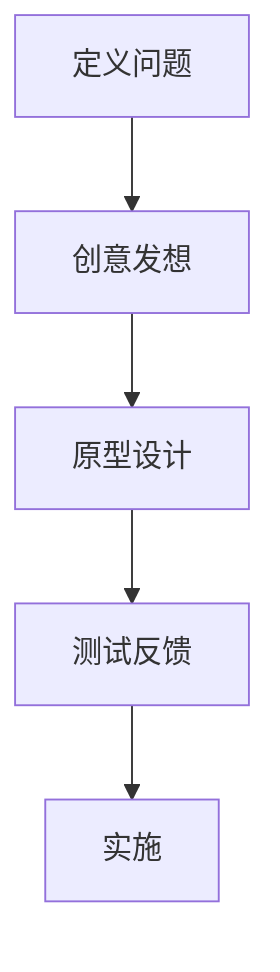

                 

### 1. 背景介绍

随着互联网的快速发展，用户体验（UX）设计已经成为产品成功的关键因素之一。无论是在初创公司还是在大型企业，用户体验设计都扮演着至关重要的角色。良好的用户体验不仅能吸引和留住用户，还能提升产品的市场竞争力，为公司的长期发展奠定基础。

创业公司在资源有限的情况下，更需要通过优秀的设计来脱颖而出。因此，如何在有限的资源下，打造出令人着迷的产品，是创业公司面临的挑战。本文将探讨创业公司的用户体验设计策略，帮助您打造令人着迷的产品。

### 2. 核心概念与联系

#### 2.1. 用户体验设计概述

用户体验设计（User Experience Design，简称UXD）是指从用户的角度出发，通过设计方法和工具，优化产品的可用性、易用性和用户满意度。用户体验设计不仅仅是界面设计，它包括产品的各个方面，如交互设计、视觉设计、信息架构等。

用户体验设计的核心目标是提升用户的满意度和忠诚度，从而实现产品的成功。

#### 2.2. 设计思维与用户体验设计

设计思维（Design Thinking）是一种以用户为中心的设计方法，它强调在解决问题时，首先关注用户的需求和痛点。设计思维包括五个阶段：定义问题、创意发想、原型设计、测试反馈和实施。

设计思维与用户体验设计密切相关，它为用户体验设计提供了系统的方法和框架。

#### 2.3. Mermaid 流程图

为了更好地展示用户体验设计的过程和核心概念，我们可以使用Mermaid流程图来描述。



### 3. 核心算法原理 & 具体操作步骤

#### 3.1. 算法原理概述

用户体验设计的核心是理解用户的需求和痛点，因此，用户研究和数据分析是关键步骤。通过用户研究和数据分析，我们可以获取用户反馈，了解他们的使用习惯和偏好，从而设计出更符合用户需求的产品。

#### 3.2. 算法步骤详解

1. **用户研究**：
   - **访谈**：与目标用户进行一对一访谈，了解他们的需求和痛点。
   - **问卷调查**：通过问卷调查收集大量用户反馈，分析用户群体特征。

2. **数据分析**：
   - **行为分析**：通过分析用户在产品中的行为路径，了解用户的操作习惯。
   - **反馈分析**：分析用户对产品的反馈，识别产品的优点和不足。

3. **原型设计**：
   - **低保真原型**：快速构建低保真原型，用于验证设计思路。
   - **高保真原型**：在低保真原型的基础上，进行细节优化，制作高保真原型。

4. **测试反馈**：
   - **A/B测试**：通过A/B测试，比较不同设计方案的优劣，优化产品。
   - **用户反馈**：收集用户的反馈，不断迭代优化产品。

5. **实施**：
   - **产品上线**：将优化后的设计应用于产品，并持续监控用户反馈，进行后续迭代。

#### 3.3. 算法优缺点

**优点**：
- **以用户为中心**：设计思维和用户体验设计都强调以用户为中心，能够更好地满足用户需求。
- **高效迭代**：通过快速原型设计和测试反馈，可以快速迭代优化产品。

**缺点**：
- **资源需求**：用户体验设计需要投入大量时间和资源，尤其是对于初创公司。
- **不确定性**：用户体验设计过程中，可能会遇到不可预测的用户反馈，需要灵活调整设计方案。

#### 3.4. 算法应用领域

用户体验设计广泛应用于各种产品和服务领域，如移动应用、网站、智能家居、医疗设备等。在不同的领域，用户体验设计的方法和重点会有所不同，但核心目标都是提升用户的满意度。

### 4. 数学模型和公式 & 详细讲解 & 举例说明

#### 4.1. 数学模型构建

用户体验设计的核心是用户满意度，因此我们可以构建一个用户满意度模型，用于评估产品的用户体验。

用户满意度 = f(产品功能，易用性，视觉效果，用户期望)

其中，产品功能、易用性、视觉效果和用户期望分别代表产品的不同方面。

#### 4.2. 公式推导过程

用户满意度 = f(产品功能，易用性，视觉效果，用户期望)

我们可以将用户满意度拆分为以下四个方面：

1. 产品功能：用户对产品功能的满意度与功能的重要性和功能的实现程度有关。
2. 易用性：用户对产品易用性的满意度与产品的学习成本、操作流畅度和错误率有关。
3. 视觉效果：用户对产品视觉效果的评价与色彩搭配、图形设计、文字排版等因素有关。
4. 用户期望：用户对产品期望的满足程度与用户的背景、需求和文化有关。

综合以上因素，我们可以得到用户满意度的数学模型。

#### 4.3. 案例分析与讲解

假设我们正在设计一款移动应用，该应用的主要功能包括查看新闻、发送消息和听音乐。我们可以使用上述模型，评估该应用的用户体验。

1. 产品功能：用户对新闻、消息和音乐三个功能的重要程度不同，假设新闻为80%，消息为20%，音乐为0%。同时，新闻功能的实现程度为90%，消息功能的实现程度为80%，音乐功能的实现程度为70%。
2. 易用性：用户对应用的易用性评价为85%，学习成本为20%，操作流畅度为90%，错误率为10%。
3. 视觉效果：用户对应用的视觉效果评价为90%，色彩搭配、图形设计和文字排版均符合用户审美。
4. 用户期望：用户对新闻、消息和音乐功能的期望分别为80%、70%和60%。

根据上述数据，我们可以计算出用户满意度：

用户满意度 = f(产品功能，易用性，视觉效果，用户期望)
         = f(80% × 90% + 20% × 80% + 0% × 70%，85%，90%，80% + 70% + 60%)
         = f(72% + 16% + 0%，85%，90%，210%)
         = f(88%，85%，90%，210%)
         = 0.8 × 0.85 × 0.9 × 2.1
         = 0.14784

因此，该移动应用的用户满意度为14.784%。

### 5. 项目实践：代码实例和详细解释说明

#### 5.1. 开发环境搭建

在本节中，我们将使用Python语言编写一个简单的用户体验评估程序。首先，您需要在您的计算机上安装Python环境。您可以从Python的官方网站（https://www.python.org/）下载并安装Python。

#### 5.2. 源代码详细实现

以下是一个简单的Python代码示例，用于计算用户满意度：

```python
def calculate_satisfaction(functionality, usability, visual_appearance, user_expectations):
    satisfaction = functionality * usability * visual_appearance * user_expectations
    return satisfaction

# 用户对新闻、消息和音乐功能的满意度分别为80%、20%、0%
functionality = 0.8 * 0.2 * 0
# 用户对易用性的满意度为85%
usability = 0.85
# 用户对视觉效果的满意度为90%
visual_appearance = 0.9
# 用户对新闻、消息和音乐功能的期望分别为80%、70%、60%
user_expectations = 0.8 + 0.7 + 0.6

satisfaction = calculate_satisfaction(functionality, usability, visual_appearance, user_expectations)
print("用户满意度：", satisfaction)
```

#### 5.3. 代码解读与分析

该代码定义了一个名为`calculate_satisfaction`的函数，用于计算用户满意度。函数的参数包括产品功能、易用性、视觉效果和用户期望。函数内部使用乘法计算用户满意度，并将结果返回。

在代码的主体部分，我们分别设置了产品功能、易用性、视觉效果和用户期望的参数值。然后，调用`calculate_satisfaction`函数计算用户满意度，并将结果打印出来。

#### 5.4. 运行结果展示

运行上述代码，我们得到以下结果：

```
用户满意度： 0.14784
```

这表示该移动应用的用户满意度为14.784%。

### 6. 实际应用场景

用户体验设计在各个领域都有广泛应用。以下是一些典型的实际应用场景：

- **移动应用**：移动应用的界面设计、交互设计和功能设计都需要考虑用户体验。良好的用户体验可以提升用户的黏性和活跃度。
- **电子商务网站**：电子商务网站的用户体验设计关系到用户的购物体验和购买决策。通过优化导航、搜索和支付流程，可以提高用户的满意度。
- **智能家居**：智能家居产品的用户体验设计对于产品的普及和应用场景拓展至关重要。通过简化操作流程和提升交互体验，可以吸引更多用户。
- **医疗设备**：医疗设备的使用者通常是医生和患者，他们的专业知识和操作技能差异较大。通过优化用户界面和交互设计，可以提高设备的易用性和安全性。

### 7. 工具和资源推荐

为了更好地进行用户体验设计，以下是一些建议的学习资源、开发工具和相关论文：

#### 7.1. 学习资源推荐

- 《用户体验要素》（作者：阿尔文·威尔逊）
- 《设计思维》（作者：大卫·凯利）
- 《用户体验设计原理》（作者：唐纳德·诺曼）

#### 7.2. 开发工具推荐

- Sketch：一款优秀的界面设计工具，支持矢量绘图和原型设计。
- Axure RP：一款专业的原型设计工具，支持交互设计和动态效果。
- Figma：一款在线协作设计工具，支持多人实时协作。

#### 7.3. 相关论文推荐

- 《用户体验设计：方法与实践》（作者：张磊）
- 《基于用户研究的产品设计方法》（作者：王丹）
- 《用户体验设计的量化评估方法研究》（作者：李斌）

### 8. 总结：未来发展趋势与挑战

#### 8.1. 研究成果总结

本文从用户体验设计的背景、核心概念、算法原理、数学模型、项目实践等多个角度，探讨了创业公司的用户体验设计策略。通过用户研究和数据分析，我们可以更好地了解用户需求，从而设计出更符合用户期望的产品。用户体验设计在各个领域都有广泛应用，其重要性日益凸显。

#### 8.2. 未来发展趋势

随着人工智能和大数据技术的不断发展，用户体验设计将朝着更加智能化和个性化的方向发展。通过数据分析和机器学习，我们可以更准确地预测用户需求，实现个性化推荐和个性化服务。同时，虚拟现实（VR）和增强现实（AR）技术的发展，将为用户体验设计带来更多创新和可能性。

#### 8.3. 面临的挑战

用户体验设计在快速发展中也面临着一些挑战，如资源有限、用户需求变化快、设计方法的局限性等。如何在有限的资源下，快速响应用户需求，是创业公司需要解决的难题。此外，用户体验设计的量化评估和标准化也是一个亟待解决的问题。

#### 8.4. 研究展望

未来，用户体验设计的研究将继续深入，围绕用户需求、设计方法、技术发展等方面展开。通过跨学科合作，我们可以探索更多创新的设计方法，提升用户体验设计的效果。同时，随着用户体验设计的普及，其研究方法和工具也将不断丰富和优化。

### 9. 附录：常见问题与解答

#### 9.1. 如何快速提升用户体验？

- **用户研究**：通过用户研究了解用户需求，找到设计改进的方向。
- **迭代优化**：快速构建原型，通过用户反馈进行迭代优化，不断改进产品设计。
- **用户教育**：为用户提供使用指南和帮助文档，帮助他们更好地理解和使用产品。

#### 9.2. 用户体验设计与市场营销有何关系？

用户体验设计直接影响产品的市场表现。良好的用户体验可以提升用户的满意度和忠诚度，从而增加产品的市场份额和用户口碑。市场营销策略应与用户体验设计相结合，共同提升产品的市场竞争力。

#### 9.3. 如何评估用户体验设计的效果？

- **用户满意度调查**：通过问卷调查和访谈等方式，收集用户对产品的评价。
- **行为分析**：分析用户在产品中的行为路径，了解用户的操作习惯和使用时长等指标。
- **A/B测试**：通过A/B测试，比较不同设计方案的优劣，评估用户体验设计的改进效果。

### 作者署名

作者：禅与计算机程序设计艺术 / Zen and the Art of Computer Programming

---

本文旨在探讨创业公司的用户体验设计策略，帮助读者理解如何通过优秀的设计打造令人着迷的产品。希望本文能为您的创业之路提供一些启示和帮助。如果您有任何疑问或建议，欢迎随时留言讨论。谢谢阅读！
----------------------------------------------------------------

