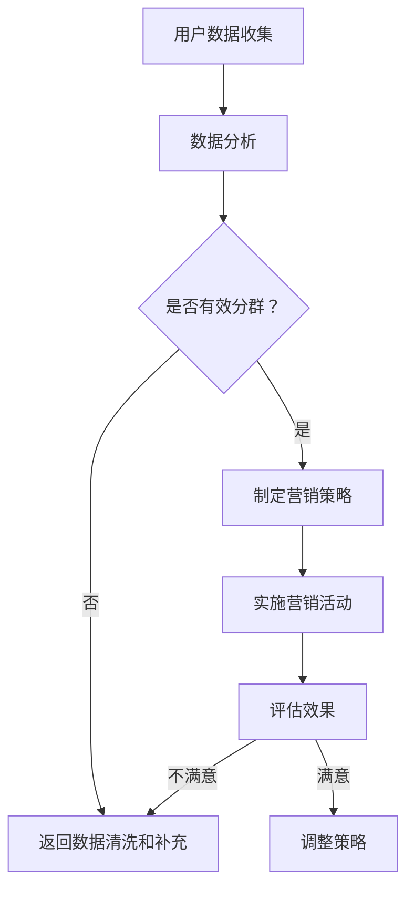

                 

关键词：用户分群、营销策略、数据分析、客户行为、个性化推广、市场细分

> 摘要：本文将探讨创业公司如何通过用户分群策略，结合数据分析，实现精准营销，提升用户转化率和品牌忠诚度。文章将从用户分群的核心概念、算法原理、数学模型、应用实践以及未来展望等多个角度，为创业公司提供一套完整的用户分群营销策略。

## 1. 背景介绍

在互联网时代，用户数据的爆炸性增长为营销策略的精细化提供了可能。对于创业公司来说，如何高效地利用这些数据，挖掘潜在用户，提高用户转化率，成为企业生存和发展的关键。用户分群作为一种有效的营销手段，通过对用户进行细分，能够帮助企业更好地了解用户需求，实现个性化推广。

### 1.1 创业公司的挑战

- **市场竞争力**：初创企业在市场中通常面临激烈竞争，需要通过独特策略脱颖而出。
- **资源有限**：创业公司在资金、人力资源等方面往往有限，需要高效利用资源。
- **用户需求多样**：用户需求多样且不断变化，如何满足这些需求是创业公司的一大挑战。

### 1.2 用户分群的重要性

- **精准定位**：通过用户分群，企业能够更精准地定位目标用户，提高营销效果。
- **资源优化**：有针对性地进行营销活动，减少资源浪费。
- **提高转化率**：针对用户特点制定个性化营销策略，提高用户转化率。

## 2. 核心概念与联系

在探讨用户分群策略之前，我们需要了解一些核心概念和它们之间的关系。

### 2.1 用户分群的概念

用户分群是指将用户按照一定的标准进行分类，从而形成不同的用户群体。这些标准可以是用户的年龄、性别、地理位置、消费习惯、兴趣爱好等。

### 2.2 数据分析

数据分析是通过统计方法和算法，从大量数据中提取有价值的信息，为决策提供支持。在用户分群中，数据分析起着至关重要的作用，它可以帮助企业理解用户行为，发现潜在需求。

### 2.3 营销策略

营销策略是企业为达成营销目标所制定的一系列行动方案。用户分群策略是营销策略中的一个重要组成部分，它决定了企业如何针对不同用户群体进行推广。

### 2.4 Mermaid 流程图

下面是用户分群策略的一个简化版 Mermaid 流程图：



## 3. 核心算法原理 & 具体操作步骤

### 3.1 算法原理概述

用户分群算法的核心原理是基于用户特征和行为数据，利用机器学习和统计方法对用户进行分类。常见的用户分群算法有 K-means、基于规则的聚类算法、关联规则挖掘等。

### 3.2 算法步骤详解

1. **数据收集**：收集用户的基本信息和行为数据，如性别、年龄、地域、购买历史、访问记录等。
2. **数据预处理**：清洗数据，处理缺失值和异常值，对数据进行标准化或归一化。
3. **特征选择**：根据业务需求选择对用户分群有帮助的特征。
4. **算法选择**：根据数据特征选择合适的用户分群算法，如 K-means、基于规则的聚类算法等。
5. **模型训练**：使用选定的算法对数据进行聚类，得到不同的用户群体。
6. **结果评估**：评估聚类效果，如内部凝聚度、用户区分度等。
7. **策略制定**：根据聚类结果，针对不同用户群体制定相应的营销策略。

### 3.3 算法优缺点

- **K-means算法**：优点是计算速度快，聚类效果好；缺点是容易陷入局部最优解，对初始值敏感。
- **基于规则的聚类算法**：优点是容易理解，对初始值不敏感；缺点是聚类效果较差，规则制定复杂。

### 3.4 算法应用领域

用户分群算法在多个领域有广泛应用，如电子商务、社交媒体、金融保险等。通过用户分群，企业可以更精准地满足用户需求，提高用户满意度，增加销售额。

## 4. 数学模型和公式 & 详细讲解 & 举例说明

### 4.1 数学模型构建

用户分群的核心在于对用户特征进行量化，从而构建一个数学模型。常见的数学模型包括：

- **用户行为模型**：基于用户的历史行为数据，如点击、购买、搜索等，使用统计方法构建模型。
- **用户兴趣模型**：基于用户的兴趣爱好，如阅读、观看、评论等，使用文本挖掘和机器学习方法构建模型。

### 4.2 公式推导过程

以用户行为模型为例，其基本公式为：

$$
f(x) = w_1x_1 + w_2x_2 + ... + w_nx_n
$$

其中，$x_1, x_2, ..., x_n$ 为用户行为特征，$w_1, w_2, ..., w_n$ 为特征权重。

### 4.3 案例分析与讲解

假设有一个电子商务平台，用户行为数据包括浏览量、购买量、评论数量等。我们使用 K-means 算法进行用户分群，并构建用户行为模型。

1. **数据预处理**：对数据进行标准化处理，使其处于同一量级。
2. **特征选择**：选择对用户分群有帮助的特征，如浏览量、购买量等。
3. **模型训练**：使用 K-means 算法进行聚类，得到不同用户群体。
4. **结果评估**：计算聚类效果，如内部凝聚度、用户区分度等。

通过上述步骤，我们得到三个用户群体，针对不同群体，制定相应的营销策略。

## 5. 项目实践：代码实例和详细解释说明

### 5.1 开发环境搭建

我们使用 Python 作为开发语言，安装必要的库，如 NumPy、Pandas、Scikit-learn 等。

### 5.2 源代码详细实现

以下是使用 K-means 算法进行用户分群的 Python 代码实例：

```python
import numpy as np
import pandas as pd
from sklearn.cluster import KMeans
from sklearn.preprocessing import StandardScaler

# 数据加载
data = pd.read_csv('user_data.csv')
X = data[['browse_count', 'purchase_count', 'review_count']]

# 数据预处理
scaler = StandardScaler()
X_scaled = scaler.fit_transform(X)

# K-means 聚类
kmeans = KMeans(n_clusters=3, random_state=42)
clusters = kmeans.fit_predict(X_scaled)

# 结果分析
data['cluster'] = clusters
data.groupby('cluster').describe()
```

### 5.3 代码解读与分析

上述代码首先加载用户行为数据，然后进行数据预处理，包括特征选择和标准化处理。接着使用 K-means 算法进行聚类，最后对聚类结果进行分析。

### 5.4 运行结果展示

运行上述代码后，我们得到三个用户群体，针对不同群体，可以制定相应的营销策略。

## 6. 实际应用场景

用户分群策略在多个领域有广泛应用，以下是一些实际应用场景：

- **电子商务**：根据用户购买行为，为不同用户群体推荐相关商品。
- **社交媒体**：根据用户兴趣和行为，为用户提供个性化内容。
- **金融保险**：根据用户风险偏好，为用户提供相应的金融产品。

## 7. 未来应用展望

随着大数据和人工智能技术的发展，用户分群策略将更加智能化、个性化。未来，用户分群将不仅基于历史数据，还将结合实时数据，通过深度学习、自然语言处理等技术，实现更高层次的个性化营销。

## 8. 工具和资源推荐

### 8.1 学习资源推荐

- 《Python数据分析基础教程》
- 《机器学习实战》
- 《用户画像：大数据时代的新商业革命》

### 8.2 开发工具推荐

- Python
- Jupyter Notebook
- Matplotlib

### 8.3 相关论文推荐

- "User Segmentation using Machine Learning Techniques" by M. Chiang et al.
- "Clustering of User Behavior for Personalized Web Search" by J. Liu et al.

## 9. 总结：未来发展趋势与挑战

用户分群策略在营销领域具有巨大潜力，但随着数据量和复杂度的增加，也面临着一系列挑战，如数据隐私保护、算法透明度等。未来，我们需要在技术、伦理、法规等多方面进行探索和平衡，以实现更智能、更高效的用户分群策略。

## 10. 附录：常见问题与解答

### 10.1 什么是用户分群？

用户分群是指将用户按照一定的标准进行分类，形成不同的用户群体。

### 10.2 用户分群算法有哪些？

常见的用户分群算法包括 K-means、基于规则的聚类算法、关联规则挖掘等。

### 10.3 用户分群在哪些领域有应用？

用户分群在电子商务、社交媒体、金融保险等多个领域有广泛应用。

### 10.4 用户分群如何实现个性化营销？

通过分析用户分群结果，针对不同用户群体制定相应的营销策略，实现个性化推广。

### 10.5 用户分群面临哪些挑战？

用户分群面临数据隐私保护、算法透明度、计算复杂度等挑战。

---

作者：禅与计算机程序设计艺术 / Zen and the Art of Computer Programming

