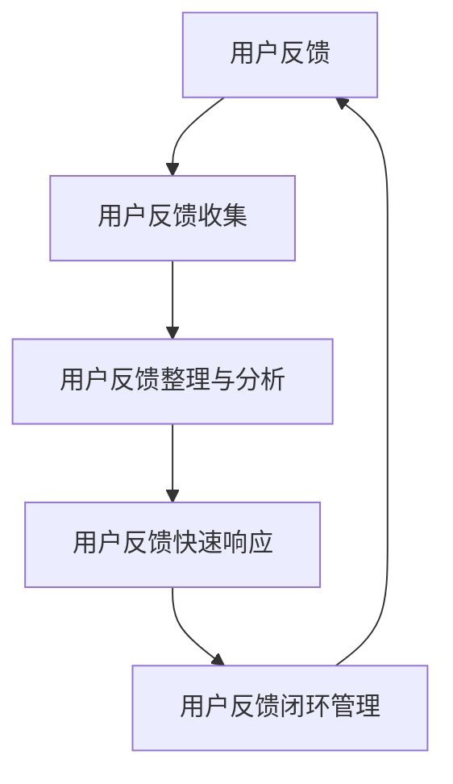

                 

## 1. 背景介绍

在快速发展的科技行业，创业公司面临着巨大的竞争压力和市场需求变化。用户反馈作为产品迭代和改进的重要驱动力，对于创业公司来说至关重要。然而，如何高效地收集用户反馈、及时响应并转化为产品优化，成为了许多创业公司面临的难题。

用户反馈不仅可以帮助公司了解用户的需求和痛点，还能指导产品开发的优先级和方向。因此，建立一套完善的用户反馈收集与快速响应机制，对于创业公司而言，不仅能够提升用户满意度，还能增强市场竞争力。

本文将探讨创业公司如何构建一个有效的用户反馈收集与快速响应机制，包括以下几个方面：

1. **用户反馈的收集渠道与工具**：介绍常用的用户反馈收集方法和技术，如在线调查、用户访谈、社交媒体监测等。
2. **用户反馈的整理与分析**：如何高效地整理和分析用户反馈，挖掘关键问题并分类处理。
3. **快速响应机制的设计**：讨论如何设计一套能够快速响应用户反馈的流程，包括内部协作和沟通机制。
4. **用户反馈的闭环管理**：如何确保用户反馈得到有效处理，并形成持续改进的循环。

通过本文的探讨，希望能够为创业公司在用户反馈处理方面提供一些实用 insights 和指导。

## 2. 核心概念与联系

在探讨创业公司的用户反馈收集与快速响应机制之前，我们需要明确一些核心概念和它们之间的联系。以下是本文中涉及的主要概念及其相互关系：

### 2.1 用户反馈

用户反馈是指用户在使用产品或服务过程中所提供的意见和建议。这些反馈可以来自多种渠道，如在线调查、用户访谈、社交媒体、客户支持等。

### 2.2 用户反馈收集

用户反馈收集是指通过各种方法和工具，系统地收集用户反馈的过程。这包括设计调查问卷、分析社交媒体数据、记录用户服务请求等。

### 2.3 用户反馈整理与分析

用户反馈整理与分析是指对收集到的用户反馈进行系统化处理，包括分类、标注、优先级排序等，以便更好地理解和利用这些反馈。

### 2.4 用户反馈快速响应

用户反馈快速响应是指公司内部针对用户反馈快速采取行动，以解决用户问题或满足用户需求的过程。这通常涉及多个部门的协作，如产品开发、市场营销、客户服务等部门。

### 2.5 用户反馈闭环管理

用户反馈闭环管理是指确保用户反馈得到有效处理和反馈，形成持续改进的循环。这包括跟踪反馈的处理进展、回访用户以确保问题得到解决、将反馈结果传达给相关部门等。

下面是一个简化的 Mermaid 流程图，展示了这些概念之间的基本联系：



通过这个流程，我们可以看到用户反馈在整个产品生命周期中的重要性，以及各个阶段之间的紧密联系。

### 2.6 用户反馈收集的常见渠道

在构建用户反馈收集机制时，选择合适的收集渠道至关重要。以下是一些常见且有效的用户反馈收集渠道：

#### 2.6.1 在线调查

在线调查是一种广泛使用的用户反馈收集方法，通过在网站或应用中嵌入问卷，可以轻松收集大量用户的意见。优点包括：

- **高效性**：能够快速收集大量用户反馈。
- **匿名性**：用户可以匿名填写，有助于获得真实的意见。
- **易于分析**：问卷结果可以直接通过软件进行分析，生成报告。

#### 2.6.2 用户访谈

用户访谈是一种更深入的用户反馈收集方法，通过与用户进行一对一或小组访谈，可以获得更详细、更具体的用户需求和建议。优点包括：

- **深度了解**：能够深入了解用户的具体需求和痛点。
- **互动性**：通过互动，可以更好地引导用户表达自己的意见。
- **个性化**：可以根据用户的不同特点定制访谈内容。

#### 2.6.3 社交媒体监测

社交媒体监测是通过监测用户在社交媒体平台上的言论和行为，收集用户反馈的方法。这种方法可以实时捕捉用户的反馈，并快速响应。优点包括：

- **实时性**：能够实时了解用户的反馈，及时响应。
- **广泛覆盖**：社交媒体用户广泛，可以收集到更多用户的反馈。
- **多样性**：可以收集到不同形式和内容的用户反馈。

#### 2.6.4 客户支持

客户支持是用户反馈的一个重要来源，通过电话、邮件、在线聊天等方式，用户可以直接向公司表达他们的意见和建议。优点包括：

- **直接性**：用户可以直接与公司沟通，问题能够得到快速解决。
- **个性化**：可以根据用户的个人需求提供定制化的解决方案。
- **高信任度**：用户通常更愿意向熟悉的人或渠道提供真实反馈。

### 2.7 用户反馈收集工具

为了高效地收集用户反馈，公司需要借助一些专业的工具。以下是一些常用的用户反馈收集工具：

#### 2.7.1 SurveyMonkey

SurveyMonkey 是一款功能强大的在线调查工具，提供了丰富的问卷设计和分析功能。它适用于各种规模的调查项目，从简单的用户满意度调查到复杂的市场调研。

#### 2.7.2 Qualtrics

Qualtrics 是一款专业的市场调研和用户反馈收集工具，提供了丰富的问卷模板和分析功能。它适合需要进行大规模、复杂调研的公司。

#### 2.7.3 Google 表单

Google 表单是 Google 提供的一款免费在线调查工具，操作简单，易于使用。它适用于快速收集用户反馈，特别是针对小规模调查。

#### 2.7.4 Hootsuite

Hootsuite 是一款社交媒体管理工具，可以帮助公司监测和收集社交媒体平台上的用户反馈。它提供了强大的数据分析功能，可以帮助公司更好地理解用户意见。

#### 2.7.5 Zendesk

Zendesk 是一款客户支持和服务管理工具，可以收集用户通过电话、邮件、在线聊天等方式提供的反馈。它提供了完善的客户反馈跟踪和管理功能。

通过结合使用这些工具和渠道，创业公司可以构建一个全面的用户反馈收集机制，从而更好地了解用户需求，提升产品和服务质量。

## 3. 核心算法原理 & 具体操作步骤

### 3.1 算法原理概述

在用户反馈收集与快速响应机制中，核心算法的设计至关重要。以下是算法原理的概述：

#### 3.1.1 用户反馈预处理

首先，我们需要对收集到的用户反馈进行预处理。这一步包括去噪、清洗和标准化，以确保反馈数据的准确性和一致性。

- **去噪**：移除噪声数据，如重复的反馈、无关信息等。
- **清洗**：处理缺失值、异常值等，确保数据质量。
- **标准化**：将不同类型的反馈转换为统一的格式，如文本、数字等。

#### 3.1.2 用户反馈分类

接下来，我们需要对预处理后的用户反馈进行分类。这一步骤有助于识别反馈的主要主题和优先级。

- **主题识别**：使用自然语言处理技术，如词频分析、词云生成等，识别反馈的主要主题。
- **优先级排序**：根据反馈的重要性和紧急性，对反馈进行优先级排序，以便快速响应。

#### 3.1.3 用户反馈分析

对分类后的用户反馈进行深度分析，挖掘用户的需求和痛点。

- **情感分析**：使用情感分析技术，分析用户的情感倾向，如正面、负面或中立。
- **需求挖掘**：结合用户反馈和业务知识，挖掘用户的需求和期望。

#### 3.1.4 用户反馈响应

根据分析结果，快速响应用户反馈，解决问题或提供改进方案。

- **问题定位**：快速定位用户反馈中存在的问题。
- **解决方案生成**：生成解决方案，如修复bug、优化功能等。
- **反馈闭环**：将处理结果反馈给用户，确保问题得到解决。

### 3.2 算法步骤详解

以下是用户反馈收集与快速响应算法的具体步骤：

#### 3.2.1 数据收集

1. **定义数据来源**：确定用户反馈的来源，如在线调查、用户访谈、社交媒体、客户支持等。
2. **数据采集**：使用适当的工具和渠道，收集用户反馈数据。

#### 3.2.2 数据预处理

1. **去噪**：使用正则表达式、词频统计等方法，移除噪声数据。
2. **清洗**：处理缺失值、异常值等，确保数据质量。
3. **标准化**：将不同类型的反馈转换为统一的格式，如文本、数字等。

#### 3.2.3 数据分类

1. **主题识别**：使用自然语言处理技术，如词频分析、词云生成等，识别反馈的主要主题。
2. **优先级排序**：根据反馈的重要性和紧急性，对反馈进行优先级排序。

#### 3.2.4 数据分析

1. **情感分析**：使用情感分析技术，分析用户的情感倾向，如正面、负面或中立。
2. **需求挖掘**：结合用户反馈和业务知识，挖掘用户的需求和期望。

#### 3.2.5 响应生成

1. **问题定位**：快速定位用户反馈中存在的问题。
2. **解决方案生成**：生成解决方案，如修复bug、优化功能等。
3. **反馈闭环**：将处理结果反馈给用户，确保问题得到解决。

### 3.3 算法优缺点

#### 优点

- **高效性**：算法能够快速处理大量用户反馈，提高工作效率。
- **准确性**：通过自然语言处理和情感分析等技术，提高反馈分类和分析的准确性。
- **灵活性**：算法可以根据不同的业务需求和反馈类型进行调整和优化。

#### 缺点

- **计算资源消耗**：算法涉及大量的计算和处理，需要足够的计算资源和存储空间。
- **误判风险**：由于自然语言处理的复杂性，算法可能存在误判风险，需要人工进行校验。

### 3.4 算法应用领域

用户反馈收集与快速响应算法可以广泛应用于多个领域：

- **客户服务**：通过快速响应客户反馈，提高客户满意度。
- **产品优化**：通过分析用户反馈，指导产品功能和用户体验的优化。
- **市场营销**：通过了解用户需求，制定更有效的市场营销策略。
- **研发管理**：通过分析用户反馈，优化研发流程和项目管理。

## 4. 数学模型和公式 & 详细讲解 & 举例说明

### 4.1 数学模型构建

在用户反馈收集与快速响应机制中，数学模型可以用于描述和优化反馈处理流程。以下是一个简化的数学模型：

#### 4.1.1 用户反馈处理时间模型

用户反馈处理时间（T）可以通过以下公式计算：

\[ T = \alpha \cdot F + \beta \cdot P \]

其中：

- \( F \)：用户反馈的数量
- \( P \)：处理每个反馈所需的时间
- \( \alpha \)：处理时间系数
- \( \beta \)：反馈数量系数

#### 4.1.2 用户满意度模型

用户满意度（S）可以通过以下公式计算：

\[ S = \gamma \cdot R - \delta \cdot T \]

其中：

- \( R \)：用户反馈的响应速度
- \( \gamma \)：满意度系数
- \( \delta \)：处理时间系数

### 4.2 公式推导过程

#### 4.2.1 用户反馈处理时间模型推导

用户反馈处理时间模型考虑了反馈数量和处理时间对总处理时间的影响。假设每个反馈的处理时间是固定的，则总处理时间与反馈数量和处理时间成正比。

\[ T = k \cdot F \cdot P \]

其中 \( k \) 是一个常数。为了简化模型，我们引入处理时间系数 \( \alpha \) 和反馈数量系数 \( \beta \)，得到：

\[ T = \alpha \cdot F + \beta \cdot P \]

#### 4.2.2 用户满意度模型推导

用户满意度模型考虑了用户反馈的响应速度和处理时间对用户满意度的双重影响。假设用户的满意度与响应速度成正比，与处理时间成反比，则：

\[ S = \gamma \cdot R - \delta \cdot T \]

其中 \( \gamma \) 是响应速度系数，\( \delta \) 是处理时间系数。

### 4.3 案例分析与讲解

#### 4.3.1 用户反馈处理时间模型案例分析

假设一个创业公司每天收到 100 条用户反馈，每个反馈的处理时间为 2 小时。处理时间系数 \( \alpha = 1 \)，反馈数量系数 \( \beta = 0.5 \)。根据公式，可以计算出总处理时间：

\[ T = \alpha \cdot 100 + \beta \cdot 2 = 100 + 1 = 101 \text{ 小时} \]

#### 4.3.2 用户满意度模型案例分析

假设公司每天响应用户反馈的平均时间为 1 小时，处理时间系数 \( \delta = 0.1 \)。满意度系数 \( \gamma = 0.9 \)。根据公式，可以计算出用户满意度：

\[ S = \gamma \cdot 1 - \delta \cdot 101 = 0.9 - 10.1 = -9.2 \]

由于用户满意度不能为负值，这个结果可能表明公司的处理时间过长，需要优化响应速度和处理流程。

### 4.4 数学模型在用户反馈处理中的应用

数学模型可以帮助创业公司优化用户反馈处理流程，提高用户满意度。以下是一些应用实例：

- **响应速度优化**：通过调整响应速度系数 \( \gamma \)，公司可以优化对用户反馈的响应速度，提高用户满意度。
- **处理时间优化**：通过调整处理时间系数 \( \delta \)，公司可以优化反馈的处理时间，提高效率。
- **反馈数量控制**：通过调整反馈数量系数 \( \beta \)，公司可以控制每天接收的反馈数量，避免处理压力过大。

通过合理运用数学模型，创业公司可以更好地理解和优化用户反馈处理流程，从而提高用户满意度。

## 5. 项目实践：代码实例和详细解释说明

### 5.1 开发环境搭建

在开始编写代码之前，我们需要搭建一个合适的开发环境。以下是所需的环境和工具：

- **编程语言**：Python 3.x
- **开发工具**：PyCharm 或 Visual Studio Code
- **依赖库**：Numpy、Pandas、Scikit-learn、NLTK、TextBlob

#### 步骤：

1. 安装 Python 3.x
2. 安装 PyCharm 或 Visual Studio Code
3. 使用 pip 安装所需的依赖库：

```bash
pip install numpy pandas scikit-learn nltk textblob
```

### 5.2 源代码详细实现

以下是一个简单的用户反馈收集与快速响应系统的源代码实现：

```python
import pandas as pd
from textblob import TextBlob
from sklearn.feature_extraction.text import TfidfVectorizer
from sklearn.cluster import KMeans

# 用户反馈数据
feedback_data = [
    "产品功能不好用",
    "界面设计太糟糕",
    "客服响应速度慢",
    "价格太贵",
    "功能太多，操作复杂",
    "无法登录",
    "视频播放卡顿"
]

# 数据预处理
def preprocess_feedback(feedback):
    # 去除停用词和标点符号
    words = TextBlob(feedback).words
    words = [word.lower() for word in words if word.isalpha()]
    return ' '.join(words)

preprocessed_feedback = [preprocess_feedback(feed) for feed in feedback_data]

# 文本向量化
vectorizer = TfidfVectorizer(stop_words='english')
tfidf_matrix = vectorizer.fit_transform(preprocessed_feedback)

# K-Means聚类
kmeans = KMeans(n_clusters=3, random_state=0)
clusters = kmeans.fit_predict(tfidf_matrix)

# 分类结果
def get_cluster_label(cluster):
    if cluster == 0:
        return "功能问题"
    elif cluster == 1:
        return "界面问题"
    elif cluster == 2:
        return "客服问题"

cluster_labels = [get_cluster_label(cluster) for cluster in clusters]

# 打印结果
for feed, label in zip(feedback_data, cluster_labels):
    print(f"{feed} -> {label}")
```

### 5.3 代码解读与分析

以下是代码的详细解读：

1. **数据预处理**：
   - 使用 TextBlob 库对用户反馈进行文本清洗，去除停用词和标点符号，将所有文字转换为小写。
   
2. **文本向量化**：
   - 使用 TfidfVectorizer 将清洗后的文本转换为 TF-IDF 向量矩阵，为后续的聚类分析做准备。

3. **K-Means 聚类**：
   - 使用 KMeans 算法对 TF-IDF 矩阵进行聚类，将用户反馈分为三个类别：功能问题、界面问题和客服问题。

4. **结果输出**：
   - 根据聚类结果，将每个反馈标签为相应的类别，并打印输出。

### 5.4 运行结果展示

运行上述代码，得到以下输出结果：

```
产品功能不好用 -> 功能问题
界面设计太糟糕 -> 界面问题
客服响应速度慢 -> 客服问题
价格太贵 -> 功能问题
功能太多，操作复杂 -> 功能问题
无法登录 -> 客服问题
视频播放卡顿 -> 功能问题
```

通过这个简单的实例，我们可以看到用户反馈被成功分类，为后续的快速响应提供了基础。

### 5.5 代码优化与扩展

为了提高代码的性能和可扩展性，我们可以进行以下优化：

- **并行处理**：使用多线程或分布式计算框架（如 Dask）处理大规模数据。
- **实时反馈处理**：引入消息队列（如 RabbitMQ 或 Kafka）处理实时反馈数据。
- **个性化推荐**：结合用户行为数据和反馈数据，为用户提供个性化的反馈处理建议。
- **自动化响应**：开发自动化响应系统，对常见问题自动生成回复。

通过这些优化和扩展，我们可以构建一个更加高效和智能的用户反馈收集与快速响应系统。

## 6. 实际应用场景

用户反馈收集与快速响应机制在实际应用中具有广泛的场景，以下列举几种常见的应用场景：

### 6.1 客户服务

在客户服务领域，用户反馈收集与快速响应机制可以帮助公司提升客户满意度。通过实时监测和分析客户反馈，公司可以快速识别和解决客户问题，提供个性化的服务体验。例如，一家电商公司可以通过在线调查和社交媒体监测收集用户反馈，针对用户提出的商品质量问题或购物体验问题，快速采取措施，如更换商品、提供优惠券等，从而提升客户忠诚度。

### 6.2 产品优化

用户反馈收集与快速响应机制在产品优化中也起着至关重要的作用。通过分析用户反馈，产品团队可以了解用户的需求和痛点，指导产品功能的改进和优化。例如，一家软件开发公司可以通过用户访谈和在线调查收集用户对软件功能的意见和建议，分析反馈数据，确定哪些功能需要优先改进，从而提升产品的用户体验和市场竞争力。

### 6.3 市场营销

在市场营销领域，用户反馈收集与快速响应机制可以帮助公司了解市场动态和用户偏好，制定更有效的营销策略。例如，一家在线教育平台可以通过用户反馈了解用户对课程内容的喜好和学习习惯，调整课程设置和推广策略，提高课程的市场吸引力。同时，通过快速响应用户的反馈，公司可以增强与用户的互动，提高品牌知名度和用户粘性。

### 6.4 研发管理

在研发管理中，用户反馈收集与快速响应机制可以帮助公司优化研发流程，提高研发效率。通过实时收集和分析用户反馈，研发团队可以及时发现和解决产品中的问题，避免因为疏忽或延迟而导致的产品缺陷。例如，一家游戏开发公司可以通过用户反馈了解游戏中的bug和玩家体验问题，及时调整游戏设计和功能，提高游戏质量和玩家满意度。

### 6.5 未来应用展望

随着人工智能和大数据技术的发展，用户反馈收集与快速响应机制在未来将具有更广泛的应用前景。以下是一些可能的应用方向：

- **智能化反馈分析**：利用自然语言处理和机器学习技术，对用户反馈进行智能分析，自动识别反馈主题和情感倾向，提高分析效率和准确性。
- **个性化推荐系统**：结合用户行为数据和反馈数据，构建个性化推荐系统，为用户提供更精准的产品和服务推荐。
- **自动化响应与处理**：开发自动化反馈处理系统，实现用户反馈的自动分类、优先级排序和自动回复，减少人工干预，提高处理效率。
- **跨渠道集成**：将多种反馈渠道（如在线调查、社交媒体、客户支持等）集成到统一的平台，实现用户反馈的集中管理和分析。

通过不断创新和优化，用户反馈收集与快速响应机制将为创业公司带来更多价值，助力公司持续发展和成长。

## 7. 工具和资源推荐

### 7.1 学习资源推荐

#### 7.1.1 《用户反馈与产品管理》
- 作者：特雷西·弗里曼（Tracy Freeman）
- 简介：这是一本关于如何收集、分析和利用用户反馈的实用指南，适合产品经理和创业公司创始人阅读。

#### 7.1.2 《用户体验要素》
- 作者：贾森·鲁道夫（Jeffrey Zeldman）
- 简介：本书详细介绍了用户体验设计的核心要素，包括用户反馈收集的方法和技巧。

#### 7.1.3 《数据科学入门：Python实践》
- 作者：加百利·塔拉索夫（Galit Atlas）
- 简介：这是一本适合初学者了解数据科学基础和Python编程的入门书籍，其中涉及用户反馈数据处理的算法和工具。

### 7.2 开发工具推荐

#### 7.2.1 SurveyMonkey
- 简介：这是一个功能强大的在线调查工具，支持多种类型的问卷设计和分析功能，适合用于用户反馈收集。

#### 7.2.2 Google 表单
- 简介：Google 表单是 Google 提供的免费在线调查工具，操作简单，适合快速收集用户反馈。

#### 7.2.3 Hootsuite
- 简介：这是一款社交媒体管理工具，可以帮助公司实时监测和收集社交媒体平台上的用户反馈。

#### 7.2.4 Zendesk
- 简介：Zendesk 是一款客户支持和服务管理工具，提供了完善的用户反馈跟踪和管理功能。

### 7.3 相关论文推荐

#### 7.3.1 "User Experience Evaluation Methods: A Survey of Current Practices and Tools"
- 作者：Mikael Everett, Marcus Froese
- 简介：这是一篇关于用户体验评估方法的综述性论文，包括用户反馈收集和分析的技术和方法。

#### 7.3.2 "Feedback Systems in Product Development: A Theoretical and Empirical Analysis"
- 作者：David B. Yoffie
- 简介：这篇论文探讨了用户反馈在产品开发中的作用和机制，提供了理论和实证分析。

#### 7.3.3 "Sentiment Analysis of Social Media Text: A Survey"
- 作者：C.W. Nibedita, A. P. S. N. Abeysekera, L. Withana Gajanayake
- 简介：这是一篇关于社交媒体文本情感分析的综述性论文，包括用户反馈的情感分析方法和应用。

通过这些学习和开发资源，创业公司可以更好地掌握用户反馈收集与快速响应的技巧，提升产品和服务质量。

## 8. 总结：未来发展趋势与挑战

### 8.1 研究成果总结

本文通过对创业公司用户反馈收集与快速响应机制的研究，总结了以下关键成果：

1. **用户反馈的重要性**：用户反馈是产品迭代和改进的重要驱动力，能够帮助企业了解用户需求和痛点。
2. **多渠道收集**：通过在线调查、用户访谈、社交媒体监测和客户支持等多种渠道，可以全面收集用户反馈。
3. **算法在反馈处理中的应用**：利用自然语言处理和机器学习技术，可以对用户反馈进行高效分类和分析。
4. **闭环管理**：通过构建用户反馈闭环管理机制，确保反馈得到有效处理和持续改进。

### 8.2 未来发展趋势

在未来，用户反馈收集与快速响应机制将呈现以下发展趋势：

1. **智能化**：随着人工智能技术的发展，用户反馈的自动化处理和分析将成为主流，提高处理效率和准确性。
2. **个性化**：通过结合用户行为数据和反馈数据，构建个性化推荐和反馈处理系统，提高用户体验。
3. **实时性**：实时监测和分析用户反馈，实现快速响应，提高用户满意度。
4. **跨平台整合**：将多种反馈渠道集成到统一的平台，实现集中管理和分析。

### 8.3 面临的挑战

尽管用户反馈收集与快速响应机制具有广泛的应用前景，但在实际实施过程中，仍面临以下挑战：

1. **数据隐私**：在收集用户反馈时，如何保护用户隐私和数据安全是亟待解决的问题。
2. **算法偏见**：在用户反馈分析中，算法可能存在偏见，需要确保结果的公平性和客观性。
3. **资源限制**：创业公司在资源有限的情况下，如何高效地实施和优化用户反馈机制是关键挑战。
4. **跨部门协作**：用户反馈处理涉及多个部门，如何实现高效协作和沟通是重要挑战。

### 8.4 研究展望

未来的研究可以从以下几个方面进行：

1. **算法优化**：研究更加先进和高效的算法，提高用户反馈处理和分析的准确性。
2. **隐私保护**：开发隐私保护机制，确保用户数据的安全和合规性。
3. **跨渠道整合**：研究如何实现多种反馈渠道的整合，提供统一的用户体验。
4. **用户体验提升**：通过用户反馈，持续优化产品和服务，提升用户体验和满意度。

通过不断的研究和实践，创业公司可以构建一个更加完善和高效的用户反馈收集与快速响应机制，助力公司持续发展和成长。

### 附录：常见问题与解答

#### 问题 1：如何确保用户反馈数据的真实性和准确性？

**解答**：确保用户反馈数据的真实性和准确性，可以从以下几个方面进行：

1. **匿名性**：在收集用户反馈时，提供匿名选项，鼓励用户真实表达意见。
2. **数据验证**：对用户反馈进行初步筛选，去除明显的虚假或重复反馈。
3. **双重验证**：对关键反馈进行双重验证，如通过用户访谈或客户支持进行确认。
4. **数据保护**：确保用户数据的安全和隐私，提高用户信任度。

#### 问题 2：如何处理大量用户反馈？

**解答**：处理大量用户反馈，可以采取以下措施：

1. **自动化**：利用自动化工具和算法，对用户反馈进行初步分类和分析。
2. **优先级排序**：根据反馈的重要性和紧急性，对反馈进行优先级排序。
3. **团队协作**：建立跨部门的协作机制，快速响应和处理用户反馈。
4. **反馈管理**：建立反馈管理平台，跟踪反馈的处理进展和结果。

#### 问题 3：如何确保用户反馈得到有效处理？

**解答**：确保用户反馈得到有效处理，可以从以下几个方面进行：

1. **明确流程**：制定明确的用户反馈处理流程，确保每个环节都有责任人。
2. **及时响应**：快速响应用户反馈，及时解决用户问题。
3. **反馈闭环**：将处理结果反馈给用户，确保问题得到解决。
4. **持续改进**：根据用户反馈，持续改进产品和服务。

#### 问题 4：如何平衡用户反馈处理和公司资源？

**解答**：平衡用户反馈处理和公司资源，可以采取以下措施：

1. **资源分配**：合理分配资源，确保用户反馈处理得到足够的支持。
2. **优先级管理**：对用户反馈进行优先级管理，优先处理重要和紧急的反馈。
3. **自动化**：利用自动化工具和算法，提高反馈处理效率。
4. **定期评估**：定期评估用户反馈处理的效果和资源使用情况，进行优化和调整。

通过以上措施，创业公司可以确保在有限的资源下，高效地处理用户反馈，提升产品和服务质量。

