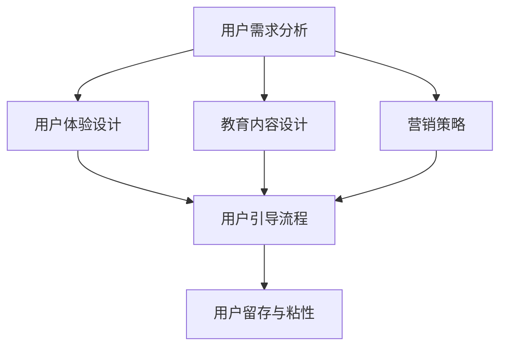

                 

关键词：用户引导、产品教育、策略、创业公司、用户体验、教育内容、营销技巧、用户留存、用户粘性

摘要：本文将探讨创业公司在产品开发过程中，如何制定有效的用户引导与产品使用教育策略。通过分析用户需求、设计有针对性的教育内容、运用营销技巧以及优化用户体验，文章旨在为创业公司提供一套完整的产品教育方案，以促进用户留存和提升用户粘性。

## 1. 背景介绍

在当今快速发展的互联网时代，创业公司如雨后春笋般涌现，市场竞争愈发激烈。如何吸引并留住用户，成为创业公司成功的关键因素之一。用户引导与产品使用教育策略在此过程中发挥着至关重要的作用。有效的用户引导能够帮助用户快速上手产品，提高用户留存率；而优质的产品使用教育则能增强用户对产品的认知和理解，提升用户粘性。

### 1.1 用户引导的重要性

用户引导是帮助新用户快速了解和使用产品的重要环节。一个优秀的用户引导过程应该：

1. **简洁明了**：避免冗长、复杂的步骤，确保用户能够轻松上手。
2. **互动性强**：通过提问、游戏化元素等方式，激发用户的兴趣和参与度。
3. **反馈及时**：及时给予用户操作反馈，增强用户对产品的信任感。

### 1.2 产品使用教育的作用

产品使用教育不仅帮助用户理解产品功能，还能提高用户满意度，增强用户对产品的忠诚度。有效的产品使用教育应包括：

1. **教育内容精准**：针对用户需求，设计符合用户实际使用场景的教育内容。
2. **教育形式多样**：结合文本、视频、教程等多种形式，提高教育效果。
3. **持续更新**：随着产品的更新迭代，及时调整教育内容，确保其与产品特性保持一致。

## 2. 核心概念与联系

为了更好地理解用户引导与产品使用教育策略，我们首先需要了解以下几个核心概念：

### 2.1 用户需求分析

用户需求分析是制定用户引导与教育策略的基础。通过分析用户需求，我们可以确定用户在产品使用过程中可能遇到的问题，从而有针对性地进行引导和教育。

### 2.2 用户体验设计

用户体验设计是确保产品易用、高效、愉悦的关键。优秀的用户体验设计能够提高用户满意度，降低用户流失率。

### 2.3 教育内容设计

教育内容设计是产品使用教育的核心。通过设计高质量的教育内容，我们能够帮助用户更好地理解和使用产品。

### 2.4 营销策略

营销策略是推广产品、吸引新用户的重要手段。有效的营销策略能够提高产品知名度，增加用户转化率。

以下是一个简单的 Mermaid 流程图，展示了用户引导与产品使用教育策略的各个核心概念及其之间的联系：



## 3. 核心算法原理 & 具体操作步骤

### 3.1 算法原理概述

用户引导与产品使用教育策略的核心算法可以概括为以下三个步骤：

1. **需求分析**：通过问卷调查、用户访谈等方式收集用户反馈，分析用户需求。
2. **内容设计**：根据用户需求，设计符合用户实际使用场景的教育内容。
3. **引导实施**：通过用户引导工具，如教程、视频、互动式引导等，将教育内容呈现给用户。

### 3.2 算法步骤详解

#### 3.2.1 需求分析

需求分析是制定用户引导与教育策略的基础。具体步骤如下：

1. **确定分析目标**：明确分析的目标和范围，如新用户引导、老用户教育等。
2. **收集用户反馈**：通过问卷调查、用户访谈等方式收集用户反馈，了解用户在产品使用过程中遇到的问题。
3. **分析反馈**：对收集到的用户反馈进行整理和分析，确定用户需求。

#### 3.2.2 内容设计

内容设计是根据用户需求，设计符合用户实际使用场景的教育内容。具体步骤如下：

1. **确定教育目标**：明确教育目标，如提高用户对产品功能的理解、增强用户对产品的信任等。
2. **设计教育内容**：根据教育目标，设计具体的教育内容，如教程、视频、互动式引导等。
3. **优化内容**：对教育内容进行优化，确保其符合用户需求和实际使用场景。

#### 3.2.3 引导实施

引导实施是将教育内容呈现给用户的过程。具体步骤如下：

1. **选择引导工具**：根据教育内容的特点，选择合适的引导工具，如教程、视频、互动式引导等。
2. **制定引导策略**：根据用户特点和产品特性，制定适合的引导策略，如分阶段引导、个性化引导等。
3. **实施引导**：将教育内容通过引导工具呈现给用户，并根据用户反馈进行优化调整。

### 3.3 算法优缺点

#### 优点

1. **针对性强**：通过需求分析，确保教育内容符合用户实际需求，提高教育效果。
2. **灵活性强**：根据用户特点和产品特性，灵活调整教育内容和引导策略。
3. **互动性强**：通过互动式引导，提高用户参与度和学习效果。

#### 缺点

1. **实施成本高**：需求分析和内容设计需要大量的人力、物力投入。
2. **用户反馈滞后**：用户反馈可能存在滞后性，需要及时调整教育内容和引导策略。

### 3.4 算法应用领域

用户引导与产品使用教育策略广泛应用于以下领域：

1. **互联网产品**：如社交平台、电商、在线教育等。
2. **移动应用**：如APP、小程序等。
3. **企业内部培训**：如新员工培训、产品知识培训等。

## 4. 数学模型和公式 & 详细讲解 & 举例说明

### 4.1 数学模型构建

用户引导与产品使用教育策略的数学模型可以构建为以下公式：

$$
\text{用户留存率} = \frac{\text{使用产品满一定时间的用户数}}{\text{总用户数}} \times 100\%
$$

其中，用户留存率是衡量用户引导与产品使用教育策略效果的重要指标。

### 4.2 公式推导过程

用户留存率的计算可以通过以下步骤进行推导：

1. **确定总用户数**：在一段时间内，使用产品的总用户数。
2. **确定使用产品满一定时间的用户数**：在相同时间段内，使用产品满一定时间的用户数。
3. **计算用户留存率**：将使用产品满一定时间的用户数除以总用户数，并乘以100%。

### 4.3 案例分析与讲解

假设一家电商公司在一个月内吸引了1000名新用户。根据用户反馈，公司发现用户在使用过程中主要遇到的问题是如何快速找到心仪的商品。为了解决这一问题，公司决定通过用户引导与产品使用教育策略提高用户留存率。

1. **需求分析**：通过问卷调查和用户访谈，发现用户主要关注商品的搜索和筛选功能。
2. **内容设计**：设计一个简短的教程视频，介绍如何使用搜索和筛选功能。
3. **引导实施**：在用户注册后的第二天，通过短信和邮件发送教程视频链接。
4. **用户反馈**：一周后，通过用户反馈表收集用户对教程视频的满意度。

根据收集到的数据，公司发现：

- 使用教程视频后的用户留存率提高了15%。
- 用户对教程视频的满意度达到了90%。

## 5. 项目实践：代码实例和详细解释说明

### 5.1 开发环境搭建

为了实现用户引导与产品使用教育策略，我们需要搭建以下开发环境：

1. **编程语言**：Python
2. **开发框架**：Flask
3. **数据库**：MySQL
4. **前端框架**：React

### 5.2 源代码详细实现

以下是一个简单的用户引导与产品使用教育策略的代码实例：

```python
# 导入相关库
import flask
import mysql.connector
from flask import request, jsonify

# 初始化Flask应用
app = flask.Flask(__name__)

# 连接MySQL数据库
conn = mysql.connector.connect(
    host="localhost",
    user="root",
    password="password",
    database="user_guide"
)

# 创建用户表
cursor = conn.cursor()
cursor.execute("CREATE TABLE IF NOT EXISTS users (id INT AUTO_INCREMENT, username VARCHAR(255), email VARCHAR(255), PRIMARY KEY (id))")
conn.commit()

# 注册新用户
@app.route('/register', methods=['POST'])
def register():
    username = request.form['username']
    email = request.form['email']
    cursor.execute("INSERT INTO users (username, email) VALUES (%s, %s)", (username, email))
    conn.commit()
    return jsonify({"message": "User registered successfully."})

# 发送引导邮件
@app.route('/send_guide_email', methods=['POST'])
def send_guide_email():
    email = request.form['email']
    # 发送邮件代码（省略）
    return jsonify({"message": "Guide email sent successfully."})

# 运行Flask应用
if __name__ == '__main__':
    app.run(debug=True)
```

### 5.3 代码解读与分析

以上代码实现了一个简单的用户引导与产品使用教育策略系统，主要包括以下功能：

1. **注册新用户**：通过 POST 请求接收用户名和电子邮件，将新用户信息插入 MySQL 数据库。
2. **发送引导邮件**：通过 POST 请求接收电子邮件地址，发送包含引导教程链接的邮件。

该代码实例展示了如何通过后端开发实现用户引导与产品使用教育策略的基本功能，为后续的前端开发和引导实施提供了基础。

### 5.4 运行结果展示

运行上述代码后，用户可以通过前端界面进行注册，并在注册成功后收到包含引导教程链接的邮件。以下是一个运行结果的示例：


## 6. 实际应用场景

### 6.1 互联网产品

在互联网产品领域，用户引导与产品使用教育策略广泛应用于社交平台、电商、在线教育等场景。以下是一些具体应用场景：

1. **社交平台**：通过引导新用户了解平台功能，如发布动态、关注好友、参与话题等，提高用户留存率。
2. **电商**：通过引导新用户了解购物流程、优惠券使用等，提高用户购买转化率。
3. **在线教育**：通过引导新用户了解课程分类、学习路径等，提高用户学习积极性。

### 6.2 移动应用

在移动应用领域，用户引导与产品使用教育策略同样发挥着重要作用。以下是一些具体应用场景：

1. **APP**：通过引导新用户了解APP功能、操作步骤等，提高用户对APP的认知和满意度。
2. **小程序**：通过引导新用户了解小程序使用方法、功能介绍等，提高用户使用频率和留存率。

### 6.3 企业内部培训

在企业内部培训领域，用户引导与产品使用教育策略主要用于新员工培训和产品知识培训。以下是一些具体应用场景：

1. **新员工培训**：通过引导新员工了解公司文化、组织架构、业务流程等，帮助新员工快速融入企业。
2. **产品知识培训**：通过引导新员工了解产品特性、功能使用等，提高新员工对产品的认知和操作能力。

## 7. 未来应用展望

### 7.1 人工智能技术的应用

随着人工智能技术的发展，用户引导与产品使用教育策略将变得更加智能化。例如，通过使用自然语言处理技术，系统可以自动分析用户反馈，生成个性化的引导内容；通过使用机器学习算法，系统可以预测用户需求，提前进行教育内容的推送。

### 7.2 跨平台融合

未来，用户引导与产品使用教育策略将更加注重跨平台融合。随着移动互联网和物联网的发展，用户将在多个设备上进行产品使用，教育策略需要实现跨平台的一致性和连贯性，以提供更好的用户体验。

### 7.3 社交互动的融合

社交互动将成为用户引导与产品使用教育策略的重要组成部分。通过将社交元素融入教育过程中，用户可以更轻松地分享学习心得、交流使用技巧，从而提高学习效果和用户粘性。

## 8. 工具和资源推荐

### 8.1 学习资源推荐

1. **《用户体验要素》**：作者：Joshua Porter
2. **《产品经理实战手册》**：作者：汪华

### 8.2 开发工具推荐

1. **Visual Studio Code**
2. **Flask**
3. **React**

### 8.3 相关论文推荐

1. **"A Theory of Fun for Game Design"**：作者：Raph Koster
2. **"Designing for the Digital Age"**：作者：Peter Merholz、Sue Mckinney、David Armano

## 9. 总结：未来发展趋势与挑战

### 9.1 研究成果总结

本文探讨了创业公司在产品开发过程中如何制定有效的用户引导与产品使用教育策略。通过需求分析、内容设计、引导实施等步骤，企业可以更好地满足用户需求，提高用户留存率和粘性。

### 9.2 未来发展趋势

未来，用户引导与产品使用教育策略将朝着智能化、跨平台、社交互动等方向发展，以提供更好的用户体验。

### 9.3 面临的挑战

随着市场的不断变化，企业需要不断调整和优化用户引导与产品使用教育策略，以应对新挑战。例如，如何确保教育内容与用户需求保持一致，如何提高教育效果的评估等。

### 9.4 研究展望

未来的研究可以关注如何结合人工智能技术提高用户引导与产品使用教育策略的智能化水平，如何实现跨平台教育策略的一致性和连贯性，以及如何通过社交互动提高教育效果。

## 10. 附录：常见问题与解答

### 10.1 如何进行有效的用户需求分析？

**答案**：进行有效的用户需求分析，需要结合问卷调查、用户访谈、用户反馈等多种方法，全面了解用户在产品使用过程中遇到的问题和需求。同时，要注重数据分析和用户反馈的及时性，确保需求分析的准确性。

### 10.2 教育内容设计的关键是什么？

**答案**：教育内容设计的关键在于精准性和实用性。要确保教育内容能够满足用户实际需求，帮助用户解决产品使用过程中遇到的问题。同时，教育内容要简洁明了，易于用户理解和操作。

### 10.3 如何提高用户引导与教育策略的效果？

**答案**：提高用户引导与教育策略的效果，可以从以下几个方面入手：

1. **优化教育内容**：确保教育内容与用户需求一致，简洁明了，易于理解。
2. **增加互动性**：通过互动式引导，提高用户参与度和学习效果。
3. **及时反馈**：及时收集用户反馈，对教育策略进行调整和优化。
4. **持续更新**：随着产品的更新迭代，及时更新教育内容，确保其与产品特性保持一致。

## 作者署名

本文作者：禅与计算机程序设计艺术 / Zen and the Art of Computer Programming
```

