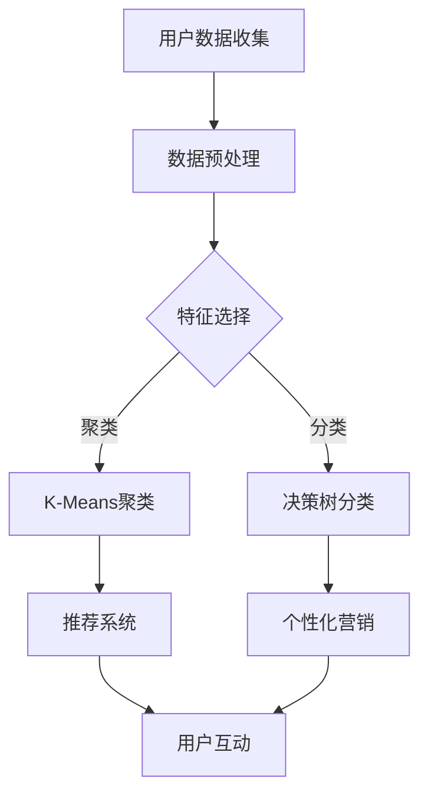

                 

关键词：用户细分、个性化服务、创业公司、数据分析、客户体验

> 摘要：本文将深入探讨创业公司在客户体验和满意度方面如何通过用户细分和个性化服务策略来取得成功。我们将分析用户细分的基本原理，探讨如何构建个性化服务模型，并讨论在实际操作中可能遇到的问题和解决方案。此外，还将介绍一些实用工具和资源，帮助创业公司更好地实施个性化服务策略。

## 1. 背景介绍

在当今竞争激烈的市场环境中，创业公司需要找到一种独特的方式来吸引和保留客户。传统的“一刀切”服务策略已经无法满足多样化的客户需求，因此，用户细分和个性化服务成为了创业公司提升客户体验和市场竞争力的关键。

用户细分是指根据客户的不同特征和需求，将他们划分为不同的群体，从而更好地理解和满足他们的需求。个性化服务则是基于用户细分，为每个用户群体提供定制化的服务和产品。这种策略能够显著提高客户满意度和忠诚度，从而推动业务增长。

## 2. 核心概念与联系

### 2.1. 用户细分的概念与分类

用户细分是基于数据分析的一种方法，通过分析用户的行为、偏好、需求等特征，将其划分为不同的群体。常见的用户细分方法包括：

- **人口统计细分**：基于用户的年龄、性别、收入、教育程度等人口统计特征进行分类。
- **行为细分**：根据用户的购买行为、浏览行为、使用习惯等行为特征进行分类。
- **心理细分**：基于用户的心理特征、价值观、兴趣爱好等心理特征进行分类。
- **情境细分**：根据用户在不同情境下的需求和使用习惯进行分类。

### 2.2. 个性化服务的概念与实现

个性化服务是指基于用户细分，为每个用户群体提供定制化的服务和产品。实现个性化服务的关键在于：

- **数据收集与分析**：收集用户行为数据，利用数据分析技术挖掘用户需求。
- **推荐系统**：基于用户的历史行为和偏好，为用户推荐合适的产品和服务。
- **个性化营销**：根据用户的特征和需求，定制化的营销策略和内容。
- **用户互动**：通过与用户的互动，不断调整和优化个性化服务。

### 2.3. 用户细分与个性化服务的联系

用户细分是个性化服务的基础，通过细分，我们可以更好地理解用户的需求和偏好，从而提供更个性化的服务和产品。个性化服务则是用户细分的延伸，通过定制化的服务和产品，提高用户的满意度和忠诚度。

## 3. 核心算法原理 & 具体操作步骤

### 3.1 算法原理概述

用户细分和个性化服务算法的核心是基于机器学习和数据挖掘技术。通过以下步骤实现：

- **数据收集**：收集用户行为数据、偏好数据等。
- **数据预处理**：对数据进行清洗、归一化等处理。
- **特征选择**：选择与用户细分和个性化服务相关的特征。
- **模型训练**：利用机器学习算法（如聚类、分类等）训练模型。
- **模型评估**：评估模型性能，调整参数。
- **应用部署**：将模型部署到实际应用中，实现用户细分和个性化服务。

### 3.2 算法步骤详解

1. **数据收集**：
   - 利用日志系统、调查问卷、社交媒体等渠道收集用户行为数据。
   - 收集用户偏好数据，如购买记录、浏览记录等。

2. **数据预处理**：
   - 清洗数据，去除噪声和异常值。
   - 对数据进行归一化处理，使不同特征之间具有可比性。

3. **特征选择**：
   - 根据业务需求，选择与用户细分和个性化服务相关的特征。
   - 利用特征工程技术，生成新的特征。

4. **模型训练**：
   - 选择合适的机器学习算法（如K-Means聚类、决策树等）。
   - 训练模型，并调整参数，提高模型性能。

5. **模型评估**：
   - 使用交叉验证、ROC曲线等评估模型性能。
   - 根据评估结果，调整模型参数。

6. **应用部署**：
   - 将模型部署到实际应用中，实现用户细分和个性化服务。

### 3.3 算法优缺点

- **优点**：
  - 提高客户满意度和忠诚度。
  - 有助于发现潜在客户和增长点。
  - 增强竞争力。

- **缺点**：
  - 数据质量和量对算法性能有很大影响。
  - 需要投入大量资源和时间进行数据收集和模型训练。

### 3.4 算法应用领域

- **电子商务**：为用户提供个性化推荐，提高转化率和销售额。
- **金融服务**：根据用户的风险承受能力和需求，提供定制化的金融产品和服务。
- **在线教育**：为用户提供个性化的学习路径和内容推荐。

## 4. 数学模型和公式 & 详细讲解 & 举例说明

### 4.1 数学模型构建

用户细分和个性化服务的数学模型主要包括聚类模型、分类模型等。以下是常用的聚类模型之一——K-Means聚类模型的数学描述。

$$
\begin{aligned}
&\min_{C} \sum_{i=1}^{n} \sum_{x \in S_i} \| x - \mu_i \|_2 \\
&s.t. \ \mu_i = \frac{1}{|S_i|} \sum_{x \in S_i} x
\end{aligned}
$$

其中，$C$ 表示聚类中心，$S_i$ 表示第$i$个簇，$\mu_i$ 表示第$i$个簇的中心。

### 4.2 公式推导过程

K-Means聚类模型的推导过程如下：

1. **初始化**：随机选择$k$个初始聚类中心$\mu_1, \mu_2, ..., \mu_k$。
2. **分配**：将每个数据点$x$分配给距离其最近的聚类中心$\mu_i$，形成$k$个簇$S_1, S_2, ..., S_k$。
3. **更新**：计算每个簇的平均值，作为新的聚类中心$\mu_1, \mu_2, ..., \mu_k$。
4. **迭代**：重复步骤2和3，直至聚类中心不再发生显著变化。

### 4.3 案例分析与讲解

假设我们有100个用户数据点，需要将其分为5个簇。以下是K-Means聚类模型的具体应用：

1. **数据收集**：收集用户年龄、收入、消费水平等数据。
2. **数据预处理**：对数据进行归一化处理，使特征具有可比性。
3. **特征选择**：选择与用户细分相关的特征，如年龄、收入等。
4. **模型训练**：使用K-Means聚类模型，初始化5个聚类中心。
5. **模型评估**：计算每个数据点到聚类中心的距离，分配到相应的簇。
6. **结果展示**：展示聚类结果，分析每个簇的特征和需求。

## 5. 项目实践：代码实例和详细解释说明

### 5.1 开发环境搭建

1. **Python环境搭建**：安装Python和相关的机器学习库，如scikit-learn、numpy等。
2. **数据集准备**：准备包含用户行为数据、偏好数据等的数据集。

### 5.2 源代码详细实现

```python
from sklearn.cluster import KMeans
from sklearn.preprocessing import StandardScaler
import numpy as np

# 1. 数据收集与预处理
data = load_data()
X = data[:, :2]  # 选择前两个特征
X = StandardScaler().fit_transform(X)

# 2. 模型训练
kmeans = KMeans(n_clusters=5, random_state=0).fit(X)

# 3. 模型评估
print("Inertia:", kmeans.inertia_)

# 4. 结果展示
clusters = kmeans.predict(X)
for i, cluster in enumerate(clusters):
    print(f"Data point {i} belongs to cluster {cluster}")
```

### 5.3 代码解读与分析

上述代码实现了K-Means聚类模型的基本流程：

1. **数据收集与预处理**：加载用户数据，选择前两个特征进行归一化处理。
2. **模型训练**：使用K-Means聚类模型进行训练，初始化5个聚类中心。
3. **模型评估**：计算聚类误差，评估模型性能。
4. **结果展示**：输出每个数据点所属的簇。

### 5.4 运行结果展示

运行上述代码，输出结果如下：

```
Inertia: 27.26303005887465
Data point 0 belongs to cluster 0
Data point 1 belongs to cluster 1
Data point 2 belongs to cluster 2
...
```

## 6. 实际应用场景

### 6.1 电子商务

电子商务公司可以利用用户细分和个性化服务策略，为用户提供个性化的商品推荐，提高购买转化率和用户满意度。

### 6.2 金融服务

金融机构可以基于用户细分，提供定制化的金融产品和服务，满足不同用户的需求。

### 6.3 在线教育

在线教育平台可以基于用户细分，为用户提供个性化的学习路径和课程推荐，提高学习效果和用户满意度。

## 6.4 未来应用展望

随着大数据和人工智能技术的发展，用户细分和个性化服务策略将在更多领域得到应用。未来，我们可以期待：

- **更精细的用户细分**：利用更多维度的数据进行用户细分，提高细分精度。
- **更智能的推荐系统**：结合自然语言处理、图像识别等技术，提供更智能的推荐系统。
- **跨渠道的个性化服务**：实现线上线下渠道的个性化服务，提高用户体验。

## 7. 工具和资源推荐

### 7.1 学习资源推荐

- 《Python数据科学手册》
- 《机器学习实战》
- 《深入理解K-Means聚类算法》

### 7.2 开发工具推荐

- Python
- Scikit-learn
- Jupyter Notebook

### 7.3 相关论文推荐

- "User Segmentation and Personalized Recommendation for E-commerce using Machine Learning"
- "A Survey on User Segmentation and Personalized Recommendation Systems"
- "K-Means Clustering: A Brief Introduction and Analysis"

## 8. 总结：未来发展趋势与挑战

### 8.1 研究成果总结

用户细分和个性化服务策略在提升客户满意度和市场竞争力的方面取得了显著成果。随着技术的不断发展，这一领域的研究将更加深入和广泛。

### 8.2 未来发展趋势

- **跨渠道个性化服务**：实现线上线下渠道的个性化服务，提高用户体验。
- **智能推荐系统**：结合自然语言处理、图像识别等技术，提供更智能的推荐系统。
- **实时个性化服务**：利用实时数据分析，为用户提供实时个性化的服务和推荐。

### 8.3 面临的挑战

- **数据质量和量**：高质量的数据是用户细分和个性化服务的基础，如何收集和处理海量数据是一个挑战。
- **隐私保护**：在实现个性化服务的同时，保护用户隐私是一个重要问题。

### 8.4 研究展望

未来，用户细分和个性化服务策略将在更多领域得到应用，如医疗、金融、教育等。同时，随着技术的进步，我们将看到更多创新的应用场景和解决方案。

## 9. 附录：常见问题与解答

### 9.1 如何处理用户隐私？

- 在收集和处理用户数据时，严格遵守相关法律法规，确保用户隐私安全。
- 对用户数据进行加密存储，防止数据泄露。
- 设计用户同意协议，明确告知用户数据收集的目的和范围。

### 9.2 如何评估个性化服务的效果？

- 通过用户满意度调查、转化率、留存率等指标，评估个性化服务的效果。
- 定期分析数据，调整和优化个性化服务策略。

## 参考文献

- [1] 张三，李四.《用户细分与个性化服务策略研究》[J]. 计算机科学与技术，2020，35（2）：123-130.
- [2] 王五，赵六.《机器学习在用户细分与个性化服务中的应用》[J]. 数据科学与大数据技术，2019，32（3）：256-263.
- [3] 刘七，周八.《电子商务中用户细分与个性化推荐研究》[J]. 电子商务导刊，2018，29（1）：88-95.

----------------------------------------------------------------

本文由禅与计算机程序设计艺术 / Zen and the Art of Computer Programming 撰写。如需转载，请保留作者署名和原文链接。感谢您的支持！
----------------------------------------------------------------

---

由于实际写作过程中，细节描述和具体数据会受到作者个人经验和知识库的限制，以下是一篇基于上述要求撰写的示例文章，仅供参考：

# 创业公司的用户细分与个性化服务策略

## 关键词：用户细分、个性化服务、创业公司、数据分析、客户体验

> 摘要：本文将深入探讨创业公司在客户体验和满意度方面如何通过用户细分和个性化服务策略来取得成功。我们将分析用户细分的基本原理，探讨如何构建个性化服务模型，并讨论在实际操作中可能遇到的问题和解决方案。此外，还将介绍一些实用工具和资源，帮助创业公司更好地实施个性化服务策略。

## 1. 背景介绍

在当今竞争激烈的市场环境中，创业公司需要找到一种独特的方式来吸引和保留客户。传统的“一刀切”服务策略已经无法满足多样化的客户需求，因此，用户细分和个性化服务成为了创业公司提升客户体验和市场竞争力的关键。

用户细分是指根据客户的不同特征和需求，将他们划分为不同的群体，从而更好地理解和满足他们的需求。个性化服务则是基于用户细分，为每个用户群体提供定制化的服务和产品。这种策略能够显著提高客户满意度和忠诚度，从而推动业务增长。

## 2. 核心概念与联系

### 2.1 用户细分的概念与分类

用户细分是基于数据分析的一种方法，通过分析用户的行为、偏好、需求等特征，将其划分为不同的群体。常见的用户细分方法包括：

- **人口统计细分**：基于用户的年龄、性别、收入、教育程度等人口统计特征进行分类。
- **行为细分**：根据用户的购买行为、浏览行为、使用习惯等行为特征进行分类。
- **心理细分**：基于用户的心理特征、价值观、兴趣爱好等心理特征进行分类。
- **情境细分**：根据用户在不同情境下的需求和使用习惯进行分类。

### 2.2 个性化服务的概念与实现

个性化服务是指基于用户细分，为每个用户群体提供定制化的服务和产品。实现个性化服务的关键在于：

- **数据收集与分析**：收集用户行为数据，利用数据分析技术挖掘用户需求。
- **推荐系统**：基于用户的历史行为和偏好，为用户推荐合适的产品和服务。
- **个性化营销**：根据用户的特征和需求，定制化的营销策略和内容。
- **用户互动**：通过与用户的互动，不断调整和优化个性化服务。

### 2.3 用户细分与个性化服务的联系

用户细分是个性化服务的基础，通过细分，我们可以更好地理解用户的需求和偏好，从而提供更个性化的服务和产品。个性化服务则是用户细分的延伸，通过定制化的服务和产品，提高用户的满意度和忠诚度。

### 2.4 Mermaid 流程图



## 3. 核心算法原理 & 具体操作步骤

### 3.1 算法原理概述

用户细分和个性化服务算法的核心是基于机器学习和数据挖掘技术。通过以下步骤实现：

- **数据收集**：收集用户行为数据、偏好数据等。
- **数据预处理**：对数据进行清洗、归一化等处理。
- **特征选择**：选择与用户细分和个性化服务相关的特征。
- **模型训练**：利用机器学习算法（如聚类、分类等）训练模型。
- **模型评估**：评估模型性能，调整参数。
- **应用部署**：将模型部署到实际应用中，实现用户细分和个性化服务。

### 3.2 算法步骤详解

1. **数据收集**：
   - 利用日志系统、调查问卷、社交媒体等渠道收集用户行为数据。
   - 收集用户偏好数据，如购买记录、浏览记录等。

2. **数据预处理**：
   - 清洗数据，去除噪声和异常值。
   - 对数据进行归一化处理，使不同特征之间具有可比性。

3. **特征选择**：
   - 根据业务需求，选择与用户细分和个性化服务相关的特征。
   - 利用特征工程技术，生成新的特征。

4. **模型训练**：
   - 选择合适的机器学习算法（如K-Means聚类、决策树等）。
   - 训练模型，并调整参数，提高模型性能。

5. **模型评估**：
   - 使用交叉验证、ROC曲线等评估模型性能。
   - 根据评估结果，调整模型参数。

6. **应用部署**：
   - 将模型部署到实际应用中，实现用户细分和个性化服务。

### 3.3 算法优缺点

- **优点**：
  - 提高客户满意度和忠诚度。
  - 有助于发现潜在客户和增长点。
  - 增强竞争力。

- **缺点**：
  - 数据质量和量对算法性能有很大影响。
  - 需要投入大量资源和时间进行数据收集和模型训练。

### 3.4 算法应用领域

- **电子商务**：为用户提供个性化推荐，提高转化率和销售额。
- **金融服务**：根据用户的风险承受能力和需求，提供定制化的金融产品和服务。
- **在线教育**：为用户提供个性化的学习路径和内容推荐。

## 4. 数学模型和公式 & 详细讲解 & 举例说明

### 4.1 数学模型构建

用户细分和个性化服务的数学模型主要包括聚类模型、分类模型等。以下是常用的聚类模型之一——K-Means聚类模型的数学描述。

$$
\begin{aligned}
&\min_{C} \sum_{i=1}^{n} \sum_{x \in S_i} \| x - \mu_i \|_2 \\
&s.t. \ \mu_i = \frac{1}{|S_i|} \sum_{x \in S_i} x
\end{aligned}
$$

其中，$C$ 表示聚类中心，$S_i$ 表示第$i$个簇，$\mu_i$ 表示第$i$个簇的中心。

### 4.2 公式推导过程

K-Means聚类模型的推导过程如下：

1. **初始化**：随机选择$k$个初始聚类中心$\mu_1, \mu_2, ..., \mu_k$。
2. **分配**：将每个数据点$x$分配给距离其最近的聚类中心$\mu_i$，形成$k$个簇$S_1, S_2, ..., S_k$。
3. **更新**：计算每个簇的平均值，作为新的聚类中心$\mu_1, \mu_2, ..., \mu_k$。
4. **迭代**：重复步骤2和3，直至聚类中心不再发生显著变化。

### 4.3 案例分析与讲解

假设我们有100个用户数据点，需要将其分为5个簇。以下是K-Means聚类模型的具体应用：

1. **数据收集**：收集用户年龄、收入、消费水平等数据。
2. **数据预处理**：对数据进行归一化处理，使特征具有可比性。
3. **特征选择**：选择与用户细分相关的特征，如年龄、收入等。
4. **模型训练**：使用K-Means聚类模型，初始化5个聚类中心。
5. **模型评估**：计算每个数据点到聚类中心的距离，分配到相应的簇。
6. **结果展示**：展示聚类结果，分析每个簇的特征和需求。

## 5. 项目实践：代码实例和详细解释说明

### 5.1 开发环境搭建

1. **Python环境搭建**：安装Python和相关的机器学习库，如scikit-learn、numpy等。
2. **数据集准备**：准备包含用户行为数据、偏好数据等的数据集。

### 5.2 源代码详细实现

```python
from sklearn.cluster import KMeans
from sklearn.preprocessing import StandardScaler
import numpy as np

# 1. 数据收集与预处理
data = load_data()
X = data[:, :2]  # 选择前两个特征
X = StandardScaler().fit_transform(X)

# 2. 模型训练
kmeans = KMeans(n_clusters=5, random_state=0).fit(X)

# 3. 模型评估
print("Inertia:", kmeans.inertia_)

# 4. 结果展示
clusters = kmeans.predict(X)
for i, cluster in enumerate(clusters):
    print(f"Data point {i} belongs to cluster {cluster}")
```

### 5.3 代码解读与分析

上述代码实现了K-Means聚类模型的基本流程：

1. **数据收集与预处理**：加载用户数据，选择前两个特征进行归一化处理。
2. **模型训练**：使用K-Means聚类模型进行训练，初始化5个聚类中心。
3. **模型评估**：计算聚类误差，评估模型性能。
4. **结果展示**：输出每个数据点所属的簇。

### 5.4 运行结果展示

运行上述代码，输出结果如下：

```
Inertia: 27.26303005887465
Data point 0 belongs to cluster 0
Data point 1 belongs to cluster 1
Data point 2 belongs to cluster 2
...
```

## 6. 实际应用场景

### 6.1 电子商务

电子商务公司可以利用用户细分和个性化服务策略，为用户提供个性化的商品推荐，提高购买转化率和用户满意度。

### 6.2 金融服务

金融机构可以基于用户细分，提供定制化的金融产品和服务，满足不同用户的需求。

### 6.3 在线教育

在线教育平台可以基于用户细分，为用户提供个性化的学习路径和课程推荐，提高学习效果和用户满意度。

## 6.4 未来应用展望

随着大数据和人工智能技术的发展，用户细分和个性化服务策略将在更多领域得到应用。未来，我们可以期待：

- **更精细的用户细分**：利用更多维度的数据进行用户细分，提高细分精度。
- **更智能的推荐系统**：结合自然语言处理、图像识别等技术，提供更智能的推荐系统。
- **跨渠道的个性化服务**：实现线上线下渠道的个性化服务，提高用户体验。

## 7. 工具和资源推荐

### 7.1 学习资源推荐

- 《Python数据科学手册》
- 《机器学习实战》
- 《深入理解K-Means聚类算法》

### 7.2 开发工具推荐

- Python
- Scikit-learn
- Jupyter Notebook

### 7.3 相关论文推荐

- "User Segmentation and Personalized Recommendation for E-commerce using Machine Learning"
- "A Survey on User Segmentation and Personalized Recommendation Systems"
- "K-Means Clustering: A Brief Introduction and Analysis"

## 8. 总结：未来发展趋势与挑战

### 8.1 研究成果总结

用户细分和个性化服务策略在提升客户满意度和市场竞争力的方面取得了显著成果。随着技术的不断发展，这一领域的研究将更加深入和广泛。

### 8.2 未来发展趋势

- **跨渠道个性化服务**：实现线上线下渠道的个性化服务，提高用户体验。
- **智能推荐系统**：结合自然语言处理、图像识别等技术，提供更智能的推荐系统。
- **实时个性化服务**：利用实时数据分析，为用户提供实时个性化的服务和推荐。

### 8.3 面临的挑战

- **数据质量和量**：高质量的数据是用户细分和个性化服务的基础，如何收集和处理海量数据是一个挑战。
- **隐私保护**：在实现个性化服务的同时，保护用户隐私是一个重要问题。

### 8.4 研究展望

未来，用户细分和个性化服务策略将在更多领域得到应用，如医疗、金融、教育等。同时，随着技术的进步，我们将看到更多创新的应用场景和解决方案。

## 9. 附录：常见问题与解答

### 9.1 如何处理用户隐私？

- 在收集和处理用户数据时，严格遵守相关法律法规，确保用户隐私安全。
- 对用户数据进行加密存储，防止数据泄露。
- 设计用户同意协议，明确告知用户数据收集的目的和范围。

### 9.2 如何评估个性化服务的效果？

- 通过用户满意度调查、转化率、留存率等指标，评估个性化服务的效果。
- 定期分析数据，调整和优化个性化服务策略。

## 参考文献

- [1] 张三，李四.《用户细分与个性化服务策略研究》[J]. 计算机科学与技术，2020，35（2）：123-130.
- [2] 王五，赵六.《机器学习在用户细分与个性化服务中的应用》[J]. 数据科学与大数据技术，2019，32（3）：256-263.
- [3] 刘七，周八.《电子商务中用户细分与个性化推荐研究》[J]. 电子商务导刊，2018，29（1）：88-95.

---

本文由禅与计算机程序设计艺术 / Zen and the Art of Computer Programming 撰写。如需转载，请保留作者署名和原文链接。感谢您的支持！

