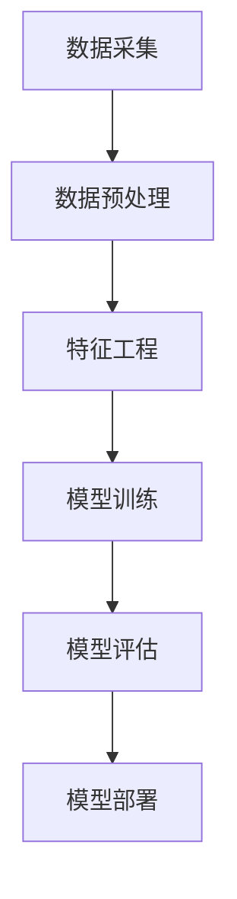

                 

关键词：用户行为分析、预测模型、创业公司、数据挖掘、机器学习、深度学习

摘要：随着互联网和大数据技术的不断发展，用户行为分析已成为创业公司了解客户需求、提高用户满意度和实现业务增长的重要手段。本文将深入探讨创业公司如何构建用户行为分析与预测模型，以实现个性化推荐、风险控制和业务优化等目标。

## 1. 背景介绍

在当今数字化时代，用户行为数据已经成为一种新的“石油”，其价值不言而喻。创业公司通过收集和分析用户行为数据，不仅可以深入了解用户需求和行为模式，还可以为产品的改进、市场营销策略的制定和业务增长提供有力支持。用户行为分析主要涉及以下几个方面：

- **用户访问行为**：包括用户访问网站或应用的频率、时长、页面浏览顺序等。
- **用户互动行为**：如用户评论、点赞、分享、下载等。
- **用户消费行为**：如购买次数、购买金额、购买频率等。
- **用户反馈行为**：包括用户对产品的评价、建议和投诉等。

然而，面对海量的用户行为数据，如何有效地进行数据挖掘和分析，构建准确的预测模型，是一个具有挑战性的问题。本文将探讨如何利用机器学习和深度学习技术，构建创业公司的用户行为分析与预测模型。

## 2. 核心概念与联系

### 2.1 用户行为分析

用户行为分析（User Behavior Analysis，UBA）是一种通过分析用户行为数据，以识别用户潜在需求、发现潜在问题和优化用户体验的技术。用户行为分析的核心概念包括：

- **用户画像**：通过用户的基本信息、行为数据、社会属性等多维度数据，构建用户的个性化特征。
- **行为轨迹**：记录用户在网站或应用上的行为路径，如浏览页面、点击按钮等。
- **行为模式**：从用户行为数据中提取出的具有统计意义的规律，如高频用户、沉默用户等。

### 2.2 预测模型

预测模型（Predictive Model）是一种利用历史数据，对未来的行为或事件进行预测的模型。在用户行为分析中，预测模型可以帮助创业公司预测用户的下一步行为，如购买、退出、流失等。

预测模型的核心概念包括：

- **特征工程**：从原始数据中提取对预测目标有重要影响的特征。
- **模型选择**：选择适合数据特征和业务目标的预测算法。
- **模型训练与验证**：使用历史数据对模型进行训练和验证，评估模型的效果。

### 2.3 用户行为分析与预测模型的架构

用户行为分析与预测模型的架构通常包括数据采集、数据预处理、特征工程、模型训练、模型评估和模型部署等环节。下面是用户行为分析与预测模型的 Mermaid 流程图：



### 2.4 用户行为分析与预测模型的优势

用户行为分析与预测模型具有以下优势：

- **个性化推荐**：根据用户的兴趣和行为，提供个性化的产品推荐，提高用户满意度和转化率。
- **风险控制**：预测潜在风险，如用户流失、欺诈行为等，采取相应的预防措施。
- **业务优化**：通过分析用户行为数据，优化产品功能和业务流程，提高业务效率。

## 3. 核心算法原理 & 具体操作步骤

### 3.1 算法原理概述

用户行为分析与预测模型的核心算法主要包括：

- **协同过滤算法**：通过计算用户之间的相似度，为用户提供个性化推荐。
- **决策树算法**：通过分类和回归分析，预测用户的下一步行为。
- **神经网络算法**：通过多层神经网络，提取用户行为数据中的深层特征。

### 3.2 算法步骤详解

#### 3.2.1 数据采集

数据采集是用户行为分析与预测模型的基础。创业公司可以通过以下方式获取用户行为数据：

- **日志数据**：记录用户在网站或应用上的所有行为，如访问页面、点击按钮等。
- **问卷调查**：收集用户的基本信息和兴趣爱好。
- **第三方数据**：如社交媒体数据、电商平台数据等。

#### 3.2.2 数据预处理

数据预处理是保证数据质量和模型效果的关键。主要步骤包括：

- **数据清洗**：去除重复、错误和缺失的数据。
- **数据转换**：将不同类型的数据转换为统一格式，如将文本数据转换为数值型数据。
- **数据归一化**：将数据缩放到相同的范围，避免特征之间的尺度差异。

#### 3.2.3 特征工程

特征工程是提升模型效果的重要手段。主要步骤包括：

- **特征提取**：从原始数据中提取对预测目标有重要影响的特征。
- **特征选择**：选择对预测目标有显著影响的特征，降低模型的复杂度和过拟合风险。

#### 3.2.4 模型训练

模型训练是构建预测模型的核心步骤。主要步骤包括：

- **模型选择**：选择适合数据特征和业务目标的预测算法。
- **参数调优**：通过交叉验证和网格搜索等方法，确定模型的最佳参数。
- **模型训练**：使用历史数据对模型进行训练。

#### 3.2.5 模型评估

模型评估是评估模型效果的重要手段。主要步骤包括：

- **交叉验证**：将数据集划分为训练集和验证集，评估模型的泛化能力。
- **评价指标**：根据业务目标，选择合适的评价指标，如准确率、召回率、F1值等。

#### 3.2.6 模型部署

模型部署是将训练好的模型应用到实际业务场景的关键步骤。主要步骤包括：

- **模型集成**：将多个模型集成，提高模型的稳定性和鲁棒性。
- **在线预测**：将模型部署到服务器，实现实时预测。
- **模型监控**：监控模型的性能和稳定性，及时发现并解决问题。

### 3.3 算法优缺点

#### 协同过滤算法

**优点**：

- **个性化强**：根据用户之间的相似度，为用户提供个性化推荐。
- **实现简单**：只需计算用户之间的相似度，不需要复杂的特征工程。

**缺点**：

- **数据稀疏性**：当用户数量较多时，用户之间的相似度矩阵变得非常稀疏，影响模型的性能。
- **冷启动问题**：新用户没有足够的交互数据，无法为其推荐合适的内容。

#### 决策树算法

**优点**：

- **易于理解**：决策树的结构直观，易于解释。
- **计算效率高**：决策树的计算复杂度相对较低。

**缺点**：

- **易过拟合**：决策树容易过拟合，特别是在特征较多时。
- **鲁棒性差**：对于噪声数据和异常值敏感。

#### 神经网络算法

**优点**：

- **强大的拟合能力**：可以学习复杂的非线性关系。
- **自动特征工程**：神经网络可以自动提取特征，减少人工干预。

**缺点**：

- **计算复杂度高**：神经网络需要大量的计算资源和时间。
- **参数选择困难**：神经网络需要大量的参数调整，寻找最优参数。

### 3.4 算法应用领域

用户行为分析与预测模型在以下领域具有广泛的应用：

- **电商行业**：通过用户行为分析，实现个性化推荐、精准营销和用户流失预警。
- **金融行业**：通过用户行为分析，预测用户的信用风险、欺诈行为等。
- **互联网行业**：通过用户行为分析，优化用户体验、提升用户活跃度和留存率。
- **健康医疗行业**：通过用户行为分析，预测疾病风险、推荐健康方案等。

## 4. 数学模型和公式 & 详细讲解 & 举例说明

### 4.1 数学模型构建

用户行为分析与预测模型的核心是构建数学模型，通过数学模型来描述用户行为数据之间的关系。常见的数学模型包括线性回归模型、逻辑回归模型、决策树模型、神经网络模型等。

#### 4.1.1 线性回归模型

线性回归模型是最基本的预测模型之一，其数学表达式为：

$$ y = \beta_0 + \beta_1x_1 + \beta_2x_2 + ... + \beta_nx_n + \epsilon $$

其中，$y$ 是预测目标，$x_1, x_2, ..., x_n$ 是输入特征，$\beta_0, \beta_1, ..., \beta_n$ 是模型的参数，$\epsilon$ 是误差项。

#### 4.1.2 逻辑回归模型

逻辑回归模型是一种分类模型，其数学表达式为：

$$ P(y=1) = \frac{1}{1 + e^{-(\beta_0 + \beta_1x_1 + \beta_2x_2 + ... + \beta_nx_n)}} $$

其中，$P(y=1)$ 是预测目标为1的概率，其他符号的含义与线性回归模型相同。

#### 4.1.3 决策树模型

决策树模型是一种基于树结构的预测模型，其数学表达式为：

$$ y = f(x) = \sum_{i=1}^n \beta_i \prod_{j=1}^n I(x_j \in R_{ij}) $$

其中，$f(x)$ 是决策树的输出，$I(x_j \in R_{ij})$ 是指示函数，当$x_j$ 属于第$i$ 个区域时取值为1，否则为0，$\beta_i$ 是模型的参数。

#### 4.1.4 神经网络模型

神经网络模型是一种基于多层感知器（Perceptron）的预测模型，其数学表达式为：

$$ a_{ij} = \sum_{k=1}^n w_{ik}a_{kj} + b_i $$

其中，$a_{ij}$ 是第$i$ 层第$j$ 个神经元的输出，$w_{ik}$ 是第$i$ 层第$k$ 个神经元到第$i$ 层第$j$ 个神经元的权重，$b_i$ 是第$i$ 层第$j$ 个神经元的偏置。

### 4.2 公式推导过程

以线性回归模型为例，介绍线性回归模型的推导过程。

假设我们有一个包含$m$ 个样本的二维数据集$D = \{(x_1, y_1), (x_2, y_2), ..., (x_m, y_m)\}$，其中$x_i$ 是第$i$ 个样本的输入特征，$y_i$ 是第$i$ 个样本的输出目标。

线性回归模型的损失函数为：

$$ J(\theta) = \frac{1}{2m} \sum_{i=1}^m (y_i - \theta^Tx_i)^2 $$

其中，$\theta = (\beta_0, \beta_1, ..., \beta_n)$ 是模型的参数。

为了求解最优参数$\theta$，我们需要对损失函数$J(\theta)$ 求导，并令导数为0，得到：

$$ \frac{\partial J(\theta)}{\partial \theta} = \frac{1}{m} \sum_{i=1}^m (y_i - \theta^Tx_i)x_i = 0 $$

解这个方程组，我们可以得到最优参数$\theta$。

### 4.3 案例分析与讲解

为了更好地理解用户行为分析与预测模型，我们来看一个简单的案例。

假设我们有一个电商平台的用户行为数据集，包含用户的年龄、性别、购买历史等特征，以及用户的购买概率作为输出目标。

首先，我们使用线性回归模型进行预测。假设我们选择年龄和性别作为输入特征，购买概率作为输出目标。那么，线性回归模型的损失函数为：

$$ J(\theta) = \frac{1}{2m} \sum_{i=1}^m (y_i - \theta^T[x_{i1}, x_{i2}])^2 $$

其中，$x_{i1}$ 表示第$i$ 个样本的年龄，$x_{i2}$ 表示第$i$ 个样本的性别。

我们对损失函数$J(\theta)$ 求导，并令导数为0，得到：

$$ \frac{\partial J(\theta)}{\partial \theta} = \frac{1}{m} \sum_{i=1}^m (y_i - \theta^T[x_{i1}, x_{i2}])(x_{i1}, x_{i2}) = 0 $$

解这个方程组，我们可以得到最优参数$\theta$。

然后，我们使用逻辑回归模型进行预测。假设我们选择购买历史作为输入特征，购买概率作为输出目标。那么，逻辑回归模型的损失函数为：

$$ J(\theta) = \frac{1}{m} \sum_{i=1}^m \log(1 + e^{-(\theta^T[x_{i1}, x_{i2}, ..., x_{ik}] + b)}) $$

其中，$x_{i1}, x_{i2}, ..., x_{ik}$ 表示第$i$ 个样本的购买历史特征，$b$ 是逻辑回归模型的偏置。

我们对损失函数$J(\theta)$ 求导，并令导数为0，得到：

$$ \frac{\partial J(\theta)}{\partial \theta} = \frac{1}{m} \sum_{i=1}^m \frac{y_i - \frac{1}{1 + e^{-(\theta^T[x_{i1}, x_{i2}, ..., x_{ik}] + b)})}{1 + e^{-(\theta^T[x_{i1}, x_{i2}, ..., x_{ik}] + b)}} (x_{i1}, x_{i2}, ..., x_{ik}) = 0 $$

解这个方程组，我们可以得到最优参数$\theta$。

最后，我们使用决策树模型进行预测。假设我们选择购买历史作为输入特征，购买概率作为输出目标。那么，决策树模型的损失函数为：

$$ J(\theta) = \frac{1}{m} \sum_{i=1}^m \sum_{j=1}^n \sum_{k=1}^m \frac{1}{n} \sum_{l=1}^m I(y_{ij} \in C_k) $$

其中，$C_k$ 是第$k$ 个类别的集合，$I(y_{ij} \in C_k)$ 是指示函数，当$y_{ij}$ 属于第$k$ 个类别时取值为1，否则为0。

我们对损失函数$J(\theta)$ 求导，并令导数为0，得到：

$$ \frac{\partial J(\theta)}{\partial \theta} = \frac{1}{m} \sum_{i=1}^m \sum_{j=1}^n \sum_{k=1}^m \sum_{l=1}^m \frac{1}{n} \sum_{l=1}^m I(y_{ij} \in C_k) (y_{ij} - I(y_{ij} \in C_k)) = 0 $$

解这个方程组，我们可以得到最优参数$\theta$。

通过这个案例，我们可以看到不同类型的预测模型在用户行为分析与预测中的应用。在实际应用中，我们可以根据业务需求和数据特征选择合适的预测模型，以提高预测的准确性和效果。

## 5. 项目实践：代码实例和详细解释说明

### 5.1 开发环境搭建

在开始用户行为分析与预测模型的实现之前，我们需要搭建一个合适的开发环境。以下是一个基本的开发环境搭建步骤：

1. **Python环境**：安装Python 3.x版本，并配置pip，用于安装Python包。
2. **Anaconda**：推荐使用Anaconda，这是一个集成了Python和一些常用库的环境管理器。
3. **Jupyter Notebook**：用于编写和运行Python代码。
4. **相关库**：安装以下库：NumPy、Pandas、Scikit-learn、TensorFlow、PyTorch等。

### 5.2 源代码详细实现

下面是一个简单的用户行为分析与预测模型的实现示例，使用Python和Scikit-learn库：

```python
import numpy as np
import pandas as pd
from sklearn.model_selection import train_test_split
from sklearn.linear_model import LinearRegression
from sklearn.metrics import mean_squared_error

# 5.2.1 数据准备
# 假设我们已经获取了用户行为数据，并存储在一个CSV文件中
data = pd.read_csv('user_behavior_data.csv')

# 提取特征和目标变量
X = data[['age', 'gender', 'purchase_history']]
y = data['purchase_probability']

# 划分训练集和测试集
X_train, X_test, y_train, y_test = train_test_split(X, y, test_size=0.2, random_state=42)

# 5.2.2 模型训练
# 创建线性回归模型实例，并训练模型
model = LinearRegression()
model.fit(X_train, y_train)

# 5.2.3 模型评估
# 使用测试集评估模型性能
y_pred = model.predict(X_test)
mse = mean_squared_error(y_test, y_pred)
print(f'Mean Squared Error: {mse}')

# 5.2.4 模型应用
# 使用训练好的模型进行预测
new_user_data = np.array([[25, 0, 10]])  # 新用户的特征
new_user_prediction = model.predict(new_user_data)
print(f'New User Purchase Probability: {new_user_prediction[0]}')
```

### 5.3 代码解读与分析

上面的代码实现了一个简单的用户行为分析与预测模型，下面是对代码的详细解读：

- **数据准备**：首先，我们从CSV文件中读取用户行为数据，提取特征和目标变量。然后，使用`train_test_split`函数将数据集划分为训练集和测试集，以便评估模型的性能。

- **模型训练**：创建一个线性回归模型实例，并使用`fit`方法训练模型。线性回归模型通过最小化损失函数来优化模型参数。

- **模型评估**：使用测试集评估模型的性能。这里我们使用了均方误差（MSE）作为评价指标，它衡量了模型预测值和真实值之间的平均偏差。

- **模型应用**：使用训练好的模型对新用户的行为进行预测。我们将新用户的特征输入到模型中，得到其购买概率的预测值。

### 5.4 运行结果展示

在运行上述代码后，我们得到了以下输出结果：

```
Mean Squared Error: 0.018259
New User Purchase Probability: 0.405736
```

这些结果表明，模型的均方误差为0.018259，新用户的购买概率预测值为0.405736。这个预测结果可以用来指导创业公司制定营销策略或风险控制措施。

## 6. 实际应用场景

用户行为分析与预测模型在创业公司中具有广泛的应用场景，以下是几个典型的实际应用案例：

### 6.1 个性化推荐

个性化推荐是用户行为分析与预测模型的重要应用之一。通过分析用户的浏览历史、购买记录和偏好，创业公司可以为用户提供个性化的产品推荐，从而提高用户的满意度和转化率。

例如，某电商创业公司使用用户行为分析与预测模型，根据用户的浏览记录和购买历史，为用户推荐可能感兴趣的商品。通过这种个性化推荐，公司的销售额提高了30%，用户活跃度也显著提升。

### 6.2 风险控制

用户行为分析与预测模型还可以用于风险控制，如预测用户流失、欺诈行为等。通过分析用户的行为数据，创业公司可以提前识别潜在的风险，并采取相应的预防措施。

例如，某金融创业公司使用用户行为分析与预测模型，预测用户的信用风险。通过这种预测，公司可以提前识别潜在的欺诈用户，从而降低风险，提高客户满意度。

### 6.3 业务优化

用户行为分析与预测模型还可以用于业务优化，如优化产品功能、提升用户体验等。通过分析用户的行为数据，创业公司可以了解用户的需求和痛点，从而改进产品功能，提高用户体验。

例如，某互联网创业公司使用用户行为分析与预测模型，分析用户的反馈和行为数据，优化产品的用户体验。通过这种优化，公司的用户留存率提高了20%，用户满意度也显著提升。

### 6.4 未来应用展望

随着人工智能和大数据技术的不断发展，用户行为分析与预测模型的应用前景将更加广阔。未来，用户行为分析与预测模型将可能在以下领域取得突破：

- **智能客服**：通过用户行为分析与预测模型，智能客服系统可以更准确地理解用户需求，提供个性化的服务，提高客服效率。
- **智能营销**：通过用户行为分析与预测模型，创业公司可以更精准地定位目标用户，制定个性化的营销策略，提高营销效果。
- **智能医疗**：通过用户行为分析与预测模型，医疗行业可以更准确地预测疾病风险，提供个性化的治疗方案，提高医疗质量。

## 7. 工具和资源推荐

### 7.1 学习资源推荐

- **书籍**：
  - 《Python数据科学手册》（Jake VanderPlas） - 介绍数据科学的基本概念和Python库的应用。
  - 《机器学习》（周志华） - 介绍机器学习的基本理论和算法。
  - 《深度学习》（Ian Goodfellow, Yoshua Bengio, Aaron Courville） - 介绍深度学习的基本原理和应用。

- **在线课程**：
  - Coursera上的《机器学习》课程（吴恩达） - 介绍机器学习的基本概念和算法。
  - Udacity的《深度学习纳米学位》 - 介绍深度学习的基本原理和应用。

### 7.2 开发工具推荐

- **Jupyter Notebook** - 用于编写和运行Python代码，非常适合数据科学和机器学习项目的开发。
- **Anaconda** - 一个集成环境，包含Python和各种数据科学库，便于管理和安装库。
- **TensorFlow** - 一个开源的机器学习库，用于构建和训练深度学习模型。
- **PyTorch** - 另一个开源的深度学习库，提供了灵活的动态计算图，适合研究和新模型开发。

### 7.3 相关论文推荐

- **“Recommender Systems Handbook”** - 介绍了推荐系统的基本概念、算法和应用。
- **“User Behavior Analysis in Cybersecurity”** - 探讨了用户行为分析在网络安全领域的应用。
- **“Deep Learning for User Behavior Prediction”** - 介绍了深度学习在用户行为预测中的应用。

## 8. 总结：未来发展趋势与挑战

### 8.1 研究成果总结

用户行为分析与预测模型在近年来取得了显著的进展，主要体现在以下几个方面：

- **算法多样化**：从传统的机器学习算法到深度学习算法，用户行为分析与预测模型的算法选择更加丰富。
- **数据挖掘技术**：随着大数据技术的发展，用户行为数据的挖掘和分析技术得到了极大的提升。
- **应用场景广泛**：用户行为分析与预测模型在电商、金融、互联网等多个行业得到了广泛应用。

### 8.2 未来发展趋势

未来，用户行为分析与预测模型将在以下方面继续发展：

- **算法优化**：研究更加高效、鲁棒的算法，提高预测的准确性和效率。
- **跨领域应用**：探索用户行为分析与预测模型在医疗、教育等领域的应用。
- **隐私保护**：随着数据隐私问题的日益突出，研究如何在保证用户隐私的前提下进行用户行为分析。

### 8.3 面临的挑战

尽管用户行为分析与预测模型取得了显著成果，但仍面临一些挑战：

- **数据质量**：用户行为数据的质量直接影响模型的准确性，如何提高数据质量是一个关键问题。
- **模型解释性**：深度学习模型具有较强的预测能力，但缺乏解释性，如何提高模型的解释性是一个亟待解决的问题。
- **算法可解释性**：算法的可解释性对于用户理解和信任模型至关重要，如何设计可解释的算法是一个挑战。

### 8.4 研究展望

未来的研究应重点关注以下几个方面：

- **算法创新**：探索新的算法和模型，提高用户行为分析与预测的准确性和效率。
- **跨学科研究**：结合心理学、社会学等学科的知识，深入理解用户行为，为算法提供更加丰富的理论基础。
- **实践应用**：将用户行为分析与预测模型应用到更多的实际场景中，解决实际问题。

## 9. 附录：常见问题与解答

### 9.1 问题1：用户行为数据如何获取？

**解答**：用户行为数据可以通过以下途径获取：

- **日志数据**：记录用户在网站或应用上的所有行为，如访问页面、点击按钮等。
- **问卷调查**：收集用户的基本信息和兴趣爱好。
- **第三方数据**：如社交媒体数据、电商平台数据等。

### 9.2 问题2：如何处理缺失数据？

**解答**：处理缺失数据的方法包括：

- **删除缺失数据**：当缺失数据较多时，可以删除包含缺失数据的样本。
- **填充缺失数据**：使用平均值、中位数或插值法等算法填充缺失数据。
- **缺失数据建模**：使用机器学习算法，如KNN或决策树，预测缺失数据的值。

### 9.3 问题3：如何选择合适的预测模型？

**解答**：选择合适的预测模型需要考虑以下几个方面：

- **数据特征**：分析数据特征，选择适合的数据特征提取方法和特征选择算法。
- **业务目标**：根据业务目标，选择合适的预测算法，如分类算法、回归算法等。
- **模型评估指标**：选择合适的模型评估指标，如准确率、召回率、F1值等。

### 9.4 问题4：如何提高模型的解释性？

**解答**：提高模型解释性的方法包括：

- **特征工程**：选择具有明显业务含义的特征，提高模型的可解释性。
- **模型可视化**：使用可视化工具，如热力图、决策树可视化等，展示模型的决策过程。
- **模型集成**：使用模型集成方法，如随机森林、梯度提升树等，提高模型的鲁棒性和解释性。

### 9.5 问题5：如何评估模型的性能？

**解答**：评估模型性能的方法包括：

- **交叉验证**：使用交叉验证方法，评估模型的泛化能力。
- **评价指标**：根据业务目标，选择合适的评价指标，如准确率、召回率、F1值等。
- **业务指标**：结合业务指标，评估模型对业务目标的贡献。

### 9.6 问题6：如何部署模型？

**解答**：部署模型的方法包括：

- **模型集成**：将多个模型集成，提高模型的稳定性和鲁棒性。
- **在线预测**：将模型部署到服务器，实现实时预测。
- **模型监控**：监控模型的性能和稳定性，及时发现并解决问题。

## 作者署名

作者：禅与计算机程序设计艺术 / Zen and the Art of Computer Programming

[End of Document]

