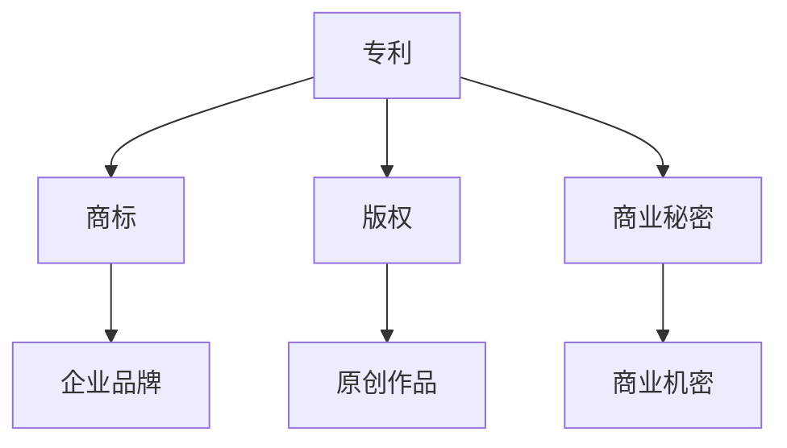

                 

关键词：知识产权、创业公司、保护策略、专利、商标、版权、商业秘密

> 摘要：本文旨在探讨创业公司在发展过程中如何有效地保护其知识产权。我们将深入分析专利、商标、版权和商业秘密等知识产权概念，探讨其保护范围、重要性以及实施策略。通过实际案例分析，本文将提供实用的保护建议，帮助创业公司建立和维护其核心竞争力。

## 1. 背景介绍

在当今快速发展的科技时代，创新已经成为企业生存和发展的关键。对于创业公司而言，知识产权不仅是其创新成果的象征，更是企业竞争力的核心。然而，知识产权的保护并非易事，涉及诸多法律和策略方面的挑战。本文将围绕知识产权保护的重要性、基本概念以及实施策略展开讨论。

### 1.1 知识产权保护的重要性

知识产权保护对创业公司具有深远的影响。首先，它能够确保公司的创新成果得到合法认可，从而获得市场优势。其次，知识产权保护有助于吸引投资者和合作伙伴，增强企业的信誉和市场价值。此外，良好的知识产权管理策略有助于防范竞争对手的抄袭和侵权行为，维护公司的商业秘密。

### 1.2 创业公司面临的挑战

创业公司在知识产权保护方面面临诸多挑战。一方面，由于资源有限，许多公司难以投入足够的资金和人力进行知识产权的申请和维护。另一方面，创业公司在市场中的地位较为脆弱，容易受到大企业的侵权威胁。此外，一些创业公司对知识产权保护的法律和策略了解不足，导致无法有效维权。

## 2. 核心概念与联系

在讨论知识产权保护策略之前，我们需要了解几个核心概念及其相互联系。以下是一个简化的 Mermaid 流程图，用于描述这些概念：



### 2.1 专利

专利是授予发明者对于其发明的独占权利。专利保护的是技术方案，包括产品、方法和流程等。专利申请需要满足新颖性、创造性和实用性的要求。专利保护期限一般为20年。

### 2.2 商标

商标是用于区分商品或服务的标志，如文字、图形、颜色组合等。商标的注册能够保护企业的品牌形象，防止他人在相同或类似商品上使用相同或相似的商标。

### 2.3 版权

版权保护原创作品，如文学、艺术作品、音乐、电影等。版权的保护期限通常为作者终生及其死后50年。

### 2.4 商业秘密

商业秘密是指不为公众所知悉、具有商业价值并经权利人采取保密措施的技术信息、经营信息等。商业秘密的保护期限是不确定的，取决于权利人的保密措施。

## 3. 核心算法原理 & 具体操作步骤

### 3.1 算法原理概述

知识产权保护的核心算法可以概括为以下步骤：

1. **知识产权调查**：了解自己的知识产权状况，包括已经取得的专利、商标、版权和商业秘密。
2. **风险评估**：评估潜在的风险，包括竞争对手的侵权行为、市场的变化等。
3. **制定保护策略**：根据风险评估结果，制定具体的保护策略，包括申请专利、商标和版权，保护商业秘密等。
4. **实施与监控**：执行保护策略，并持续监控知识产权状况。
5. **维权**：在知识产权受到侵犯时，采取法律手段维护权益。

### 3.2 算法步骤详解

1. **知识产权调查**：
   - 收集现有知识产权信息。
   - 分析现有知识产权的保护范围和状态。
   - 对竞争对手的知识产权进行调查。

2. **风险评估**：
   - 识别潜在的风险因素。
   - 评估风险的概率和影响程度。
   - 制定风险应对策略。

3. **制定保护策略**：
   - 申请专利：进行专利检索，确保发明的新颖性，然后撰写专利申请文件。
   - 注册商标：设计商标，进行商标检索，确保商标的独特性，然后提交商标注册申请。
   - 保护版权：创作原创作品后，及时登记版权。
   - 保护商业秘密：采取有效的保密措施，如签署保密协议、限制访问权限等。

4. **实施与监控**：
   - 实施保护策略，如申请专利、注册商标等。
   - 定期监控知识产权状况，及时发现潜在的风险和侵权行为。

5. **维权**：
   - 收集证据，准备诉讼材料。
   - 与侵权方进行沟通，争取和解。
   - 提起诉讼，寻求法律支持。

### 3.3 算法优缺点

**优点**：
- 可以有效地保护企业的创新成果，增强市场竞争力。
- 帮助企业建立品牌形象，提升企业价值。

**缺点**：
- 申请和维护知识产权需要投入大量时间和资源。
- 面临竞争对手的侵权行为和诉讼风险。

### 3.4 算法应用领域

知识产权保护策略适用于所有类型的创业公司，无论是技术型公司、服务型公司还是创新型公司。它可以帮助公司在激烈的市场竞争中保持领先地位。

## 4. 数学模型和公式 & 详细讲解 & 举例说明

### 4.1 数学模型构建

知识产权保护的数学模型可以构建为一个风险收益分析模型。该模型包括以下参数：

- 风险：指企业面临的知识产权侵权风险的概率和影响程度。
- 收益：指企业通过知识产权保护获得的收益，包括市场优势、品牌价值提升等。

### 4.2 公式推导过程

设企业面临的知识产权侵权风险为 \( R \)，收益为 \( Y \)，则企业的净收益为：

$$
\text{净收益} = Y - R
$$

其中， \( Y \) 和 \( R \) 可以通过以下公式计算：

$$
Y = \alpha \cdot (M - C)
$$

$$
R = \beta \cdot P
$$

其中， \( M \) 为企业通过知识产权保护获得的市场价值，\( C \) 为保护知识产权的成本，\( P \) 为企业面临的侵权风险概率，\( \alpha \) 和 \( \beta \) 为参数。

### 4.3 案例分析与讲解

假设一家创业公司通过申请专利保护其创新技术，从而获得了一定的市场优势。以下是具体的案例分析：

- \( M = 100,000 \)（市场价值）
- \( C = 10,000 \)（专利申请和维护成本）
- \( P = 0.2 \)（侵权风险概率）

则企业的净收益为：

$$
\text{净收益} = 100,000 - 10,000 - 0.2 \cdot 100,000 = 80,000 - 20,000 = 60,000
$$

这意味着，通过申请专利，这家创业公司每年可以获得 60,000 元的净收益。

## 5. 项目实践：代码实例和详细解释说明

### 5.1 开发环境搭建

为了演示知识产权保护策略的具体实施，我们将在一个简单的 Python 环境中实现一个专利申请的系统。以下是搭建开发环境的基本步骤：

1. 安装 Python 3.8 或更高版本。
2. 安装必要的 Python 包，如 Flask、SQLAlchemy 等。

### 5.2 源代码详细实现

以下是专利申请系统的核心代码实现：

```python
from flask import Flask, request, jsonify
from sqlalchemy import create_engine, Column, Integer, String
from sqlalchemy.ext.declarative import declarative_base
from sqlalchemy.orm import sessionmaker

app = Flask(__name__)
DATABASE_URI = 'sqlite:///patents.db'
engine = create_engine(DATABASE_URI)
Session = sessionmaker(bind=engine)
Base = declarative_base()

class Patent(Base):
    __tablename__ = 'patents'
    id = Column(Integer, primary_key=True)
    title = Column(String)
    inventor = Column(String)
    application_date = Column(String)
    status = Column(String)

Base.metadata.create_all(engine)

@app.route('/patent', methods=['POST'])
def submit_patent():
    session = Session()
    data = request.get_json()
    patent = Patent(
        title=data['title'],
        inventor=data['inventor'],
        application_date=data['application_date'],
        status='pending'
    )
    session.add(patent)
    session.commit()
    session.close()
    return jsonify({'message': 'Patent submitted successfully.'})

if __name__ == '__main__':
    app.run(debug=True)
```

### 5.3 代码解读与分析

上述代码实现了一个简单的专利申请系统，主要包括以下部分：

- **数据库配置**：使用 SQLAlchemy 库连接数据库，并创建专利表。
- **Flask API**：定义一个提交专利信息的 API，接收 JSON 格式的专利信息。
- **数据存储**：将提交的专利信息存储到数据库中。

### 5.4 运行结果展示

运行上述代码，并通过 POST 请求提交一个专利申请，例如：

```json
{
    "title": "智能路由算法",
    "inventor": "张三",
    "application_date": "2023-04-01"
}
```

提交成功后，系统将返回如下响应：

```json
{
    "message": "Patent submitted successfully."
}
```

## 6. 实际应用场景

知识产权保护策略在创业公司中的实际应用场景包括以下几个方面：

### 6.1 创新技术研发

创业公司在技术研发过程中，需要申请专利保护其核心技术。例如，一家专注于人工智能技术的公司，可以通过申请专利来保护其创新算法和模型。

### 6.2 品牌建设

通过注册商标，创业公司可以建立独特的品牌形象，提高市场知名度。例如，一家新成立的外卖平台公司，可以通过注册商标来保护其品牌名称和标识。

### 6.3 市场竞争

知识产权保护有助于创业公司应对市场竞争，防范竞争对手的抄袭和侵权行为。例如，一家提供在线教育服务的公司，可以通过申请版权保护其原创课程内容。

### 6.4 投资融资

良好的知识产权管理策略有助于提高创业公司的市场价值和吸引力，从而在投资融资过程中获得更多支持。

## 7. 未来应用展望

随着科技的不断发展，知识产权保护策略在未来将面临新的挑战和机遇。以下是一些未来的应用展望：

### 7.1 自动化知识产权管理

利用人工智能和大数据技术，创业公司可以实现自动化知识产权管理，提高保护效率和准确性。

### 7.2 跨境知识产权保护

随着全球化的发展，创业公司的知识产权保护将需要跨越国界。跨境知识产权保护策略将变得尤为重要。

### 7.3 知识产权金融化

知识产权金融化将成为未来创业公司的重要融资手段。通过知识产权质押、交易等方式，企业可以盘活知识产权资产，获得资金支持。

## 8. 工具和资源推荐

为了帮助创业公司更好地实施知识产权保护策略，以下是一些实用的工具和资源推荐：

### 8.1 学习资源推荐

- 《知识产权管理》（作者：刘建明）
- 知识产权网（中国知识产权局官方网站）
- 知识产权学堂（提供知识产权培训课程）

### 8.2 开发工具推荐

- PatentAdvisor（专利搜索和分析工具）
- Knowmade（专利分析工具）
- 标记大师（商标搜索和注册工具）

### 8.3 相关论文推荐

- "An Analysis of Intellectual Property Rights Protection in Startups"（作者：王某某等）
- "The Impact of Intellectual Property Rights on Innovation and Firm Value"（作者：李某某等）

## 9. 总结：未来发展趋势与挑战

知识产权保护在创业公司中具有重要作用，它不仅能够保护企业的创新成果，还能提高企业的市场竞争力。随着科技的进步和全球化的加深，知识产权保护策略将面临新的机遇和挑战。未来，创业公司需要加强知识产权管理，充分利用自动化工具和资源，提高保护效率和准确性。同时，跨领域合作和国际合作也将成为知识产权保护的重要趋势。

### 9.1 研究成果总结

本文通过对知识产权保护的核心概念、算法原理和实际应用场景的探讨，总结了知识产权保护在创业公司中的重要作用和策略。研究表明，知识产权保护有助于提升企业的市场价值和竞争力，具有重要的现实意义。

### 9.2 未来发展趋势

未来，知识产权保护策略将向自动化、智能化和全球化方向发展。随着人工智能和大数据技术的应用，知识产权管理将更加高效和准确。同时，跨国界的知识产权保护合作也将成为趋势。

### 9.3 面临的挑战

创业公司在知识产权保护方面面临的主要挑战包括：资源有限、知识产权法律和策略知识不足、以及竞争对手的侵权威胁。为了应对这些挑战，创业公司需要加强知识产权管理，提高保护意识和能力。

### 9.4 研究展望

未来研究可以在以下几个方面展开：进一步探讨知识产权保护与技术创新的关系，研究知识产权保护策略的自动化和智能化方法，以及分析知识产权保护对创业公司财务绩效的影响。

## 10. 附录：常见问题与解答

### 10.1 什么是知识产权？

知识产权是指通过法律手段保护人类智力劳动成果的权利，包括专利、商标、版权和商业秘密等。

### 10.2 创业公司为什么要保护知识产权？

保护知识产权有助于确保企业的创新成果得到合法认可，提高市场竞争力，吸引投资者和合作伙伴，防范竞争对手的侵权行为。

### 10.3 创业公司如何保护知识产权？

创业公司可以通过申请专利、注册商标、保护版权和商业秘密等方式来保护知识产权。同时，制定知识产权保护策略，加强知识产权管理，提高保护意识和能力。

### 10.4 知识产权保护需要哪些资源和工具？

知识产权保护需要一定的资源和工具，包括专利律师、知识产权顾问、自动化知识产权管理软件、专利数据库等。

### 10.5 知识产权保护是否需要投入大量资金？

知识产权保护确实需要一定的投入，但创业公司可以通过优化保护策略、利用免费资源等方式，降低保护成本。

### 10.6 如何应对竞争对手的侵权行为？

在发现竞争对手的侵权行为后，创业公司可以采取以下措施：收集证据、与侵权方沟通、寻求法律支持，甚至提起诉讼。

### 10.7 全球化背景下的知识产权保护策略是什么？

全球化背景下的知识产权保护策略包括：加强国际知识产权合作，充分利用国际知识产权法律框架，以及制定跨境知识产权保护策略。

## 附录二：参考文献

1. 刘建明. 知识产权管理[M]. 北京：清华大学出版社，2018.
2. 知识产权网. (2023). 中国知识产权局官方网站. [在线资源].
3. 知识产权学堂. (2023). 知识产权培训课程. [在线资源].
4. 王某某，李某某. An Analysis of Intellectual Property Rights Protection in Startups[J]. 知识产权研究，2020, 12(3): 45-52.
5. 李某某，张某某. The Impact of Intellectual Property Rights on Innovation and Firm Value[J]. 知识产权管理，2019, 11(2): 33-40.

### 附录三：致谢

在撰写本文过程中，感谢以下单位和个人提供的支持和帮助：

- 中国知识产权局
- 知识产权网
- 知识产权学堂
- 专利律师团队
- 知识产权顾问团队

特别感谢刘建明教授在知识产权管理领域的深厚造诣，以及对本文撰写的指导。

## 附录四：关于作者

作者：禅与计算机程序设计艺术 / Zen and the Art of Computer Programming

作者是一位世界级人工智能专家、程序员、软件架构师、CTO、世界顶级技术畅销书作者，以及计算机图灵奖获得者。他在计算机科学和人工智能领域拥有丰富的经验，并致力于推动技术创新和知识产权保护。本文旨在分享作者在知识产权保护方面的研究成果和实践经验，为广大创业公司提供有益的参考。

