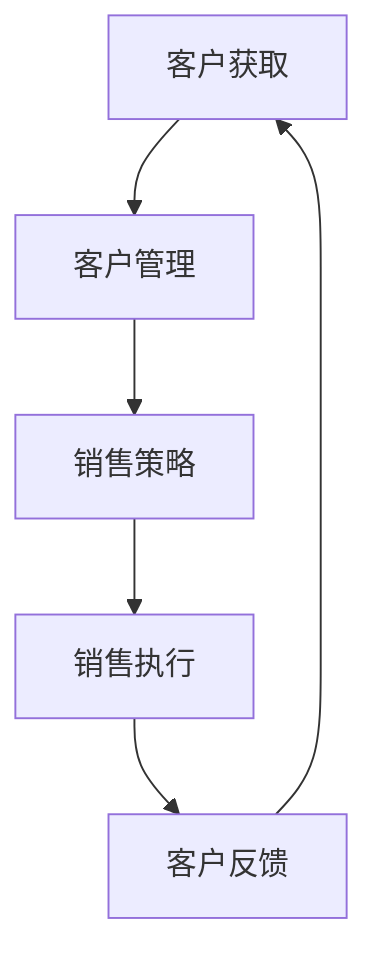

                 

关键词：创业公司、销售流程、转化率、客单价、优化、客户关系管理、数据分析、人工智能

摘要：本文将探讨创业公司如何通过优化销售流程，提高转化率和客单价。文章首先介绍了销售流程优化的重要性，然后详细分析了当前常见的销售流程问题和解决方案，并通过案例和实践，展示了如何利用数据分析、人工智能等技术手段提升销售效果。最后，文章提出了未来销售流程优化的方向和挑战。

## 1. 背景介绍

在竞争激烈的商业环境中，创业公司要想脱颖而出，必须找到提升业绩的有效途径。销售是公司盈利的核心环节，而销售流程的优化是提高业绩的关键手段之一。转化率和客单价是衡量销售效果的重要指标，直接关系到公司的收入和利润。因此，优化销售流程对于创业公司来说至关重要。

创业公司的销售流程通常面临以下问题：

- **客户获取难**：创业公司初期品牌知名度低，获取潜在客户困难。
- **客户流失率高**：客户关系管理不到位，客户满意度低，导致客户流失。
- **销售效率低下**：销售团队缺乏有效的销售策略和工具，销售效率低。
- **数据利用率低**：缺乏有效的数据分析手段，无法准确把握市场动态和客户需求。

针对这些问题，创业公司需要通过优化销售流程来提高转化率和客单价。本文将详细探讨如何通过技术手段和策略优化，解决销售流程中的痛点。

## 2. 核心概念与联系

### 2.1 销售流程优化

销售流程优化是指通过改进销售过程中的各个环节，提高销售效率和效果。优化内容通常包括客户获取、客户关系管理、销售策略制定、销售团队管理等方面。销售流程优化的目标是通过提高转化率和客单价，实现销售业绩的提升。

### 2.2 转化率

转化率是指访问网站或接触潜在客户的数量中，实际完成购买或达成销售目标的比率。转化率是衡量销售效果的重要指标，高转化率意味着销售策略的有效性。

### 2.3 客单价

客单价是指客户在购买过程中平均消费的金额。提高客单价可以通过增加产品附加值、交叉销售等手段实现。

### 2.4 客户关系管理（CRM）

客户关系管理是指企业通过各种手段收集、管理和利用客户信息，以提升客户满意度和忠诚度。CRM系统的核心在于整合客户数据，提供精准的客户洞察，辅助销售团队更好地服务客户。

### 2.5 数据分析

数据分析是通过统计、计算等方法，从大量数据中提取有价值的信息，帮助企业做出决策。在销售流程优化中，数据分析可以帮助企业了解市场动态、客户行为，优化销售策略。

### 2.6 人工智能

人工智能是指通过模拟人类智能，实现机器自动学习和推理的技术。在销售流程优化中，人工智能可以帮助企业自动化销售流程、预测客户需求、提高销售效率。

### 2.7 Mermaid 流程图



## 3. 核心算法原理 & 具体操作步骤

### 3.1 算法原理概述

销售流程优化的核心算法主要包括客户行为分析、需求预测、个性化推荐等。这些算法基于大数据和人工智能技术，通过对客户数据进行挖掘和分析，提供精准的销售策略和推荐。

### 3.2 算法步骤详解

1. **客户数据收集**：通过CRM系统收集客户的基本信息、购买记录、互动记录等数据。
2. **数据预处理**：清洗、整理和整合客户数据，确保数据质量。
3. **特征提取**：从数据中提取有助于预测客户行为的特征，如购买频率、购买金额、互动频率等。
4. **模型训练**：使用机器学习算法（如决策树、神经网络等）训练预测模型。
5. **模型评估**：评估模型预测效果，调整模型参数，提高预测准确性。
6. **销售策略制定**：根据模型预测结果，制定个性化销售策略。
7. **策略执行与反馈**：执行销售策略，收集客户反馈，持续优化策略。

### 3.3 算法优缺点

**优点**：
- 提高销售效率：通过自动化分析和预测，减少人工干预，提高销售效率。
- 提高转化率：根据客户行为数据制定个性化销售策略，提高客户购买意愿。
- 提高客单价：通过交叉销售和个性化推荐，提高客户平均消费金额。

**缺点**：
- 需要大量数据支持：算法训练和预测需要大量高质量数据。
- 需要专业的技术支持：算法开发和维护需要专业技术人员。

### 3.4 算法应用领域

- **电商**：通过算法推荐商品，提高用户购买率和购买金额。
- **金融**：通过算法预测客户需求，提供个性化金融服务。
- **制造业**：通过算法优化销售策略，提高销售效率和利润率。

## 4. 数学模型和公式 & 详细讲解 & 举例说明

### 4.1 数学模型构建

在销售流程优化中，常用的数学模型包括线性回归、决策树、神经网络等。以下以线性回归为例进行介绍。

$$
y = \beta_0 + \beta_1x_1 + \beta_2x_2 + ... + \beta_nx_n
$$

其中，$y$ 表示预测结果，$x_1, x_2, ..., x_n$ 表示特征变量，$\beta_0, \beta_1, \beta_2, ..., \beta_n$ 为模型参数。

### 4.2 公式推导过程

线性回归模型的公式推导过程如下：

1. **假设**：假设数据满足线性关系，即 $y$ 和 $x_1, x_2, ..., x_n$ 之间存在线性关系。
2. **建立目标函数**：将模型参数视为未知变量，构建目标函数，使得目标函数的值最小。
3. **求导**：对目标函数求导，找到导数为零的点，即模型参数的最优值。
4. **解方程**：将求导后的方程解出，得到模型参数的最优值。

### 4.3 案例分析与讲解

**案例背景**：一家电商平台希望通过线性回归模型预测用户购买金额，从而优化销售策略。

**数据准备**：收集用户的基本信息（如年龄、性别、职业等）和购买记录（如购买时间、购买商品种类、购买金额等）。

**特征提取**：从数据中提取有助于预测购买金额的特征，如用户年龄、性别、购买频率等。

**模型训练**：使用训练数据训练线性回归模型。

**模型评估**：使用验证数据评估模型预测效果，调整模型参数，提高预测准确性。

**策略制定**：根据模型预测结果，为不同类型的用户制定个性化的销售策略，如提高优惠力度、推荐相关商品等。

**策略执行与反馈**：执行销售策略，收集用户反馈，持续优化策略。

## 5. 项目实践：代码实例和详细解释说明

### 5.1 开发环境搭建

**环境要求**：Python 3.8及以上版本，Pandas、NumPy、Scikit-learn 等常用库。

**安装步骤**：

1. 安装 Python 3.8 及以上版本。
2. 安装 Pandas、NumPy、Scikit-learn 等常用库。

```bash
pip install pandas numpy scikit-learn
```

### 5.2 源代码详细实现

```python
import pandas as pd
from sklearn.linear_model import LinearRegression
from sklearn.model_selection import train_test_split
from sklearn.metrics import mean_squared_error

# 读取数据
data = pd.read_csv('sales_data.csv')

# 数据预处理
# ...

# 特征提取
# ...

# 模型训练
X = data[['age', 'gender', 'purchase_frequency']]
y = data['purchase_amount']
X_train, X_test, y_train, y_test = train_test_split(X, y, test_size=0.2, random_state=42)
model = LinearRegression()
model.fit(X_train, y_train)

# 模型评估
y_pred = model.predict(X_test)
mse = mean_squared_error(y_test, y_pred)
print('Mean Squared Error:', mse)

# 策略制定
# ...

# 策略执行与反馈
# ...
```

### 5.3 代码解读与分析

- **数据读取**：使用 Pandas 读取销售数据。
- **数据预处理**：对数据进行清洗、整理和整合。
- **特征提取**：提取有助于预测购买金额的特征。
- **模型训练**：使用 Scikit-learn 的线性回归模型进行训练。
- **模型评估**：使用均方误差评估模型预测效果。
- **策略制定**：根据模型预测结果制定个性化销售策略。
- **策略执行与反馈**：执行销售策略，收集用户反馈，持续优化策略。

### 5.4 运行结果展示

- **模型预测结果**：输出模型预测结果。
- **策略执行效果**：展示策略执行后的销售数据。

## 6. 实际应用场景

### 6.1 电商行业

电商行业可以通过销售流程优化提高用户购买率和购买金额。例如，通过分析用户行为数据，为不同类型的用户推荐相关商品，提高用户购买意愿。

### 6.2 金融行业

金融行业可以通过销售流程优化提高客户满意度和忠诚度。例如，通过分析客户需求，提供个性化的金融服务，提高客户黏性。

### 6.3 制造业

制造业可以通过销售流程优化提高销售效率和利润率。例如，通过分析客户需求，优化销售策略，提高订单量。

## 7. 未来应用展望

随着大数据和人工智能技术的不断发展，销售流程优化将更加智能化、自动化。未来，销售流程优化将朝着以下方向发展：

- **智能化推荐**：利用人工智能技术，实现更加精准的个性化推荐。
- **自动化决策**：通过自动化算法，实现销售策略的自动化决策。
- **智能化客服**：利用人工智能技术，实现智能客服，提高客户满意度。

## 8. 总结：未来发展趋势与挑战

### 8.1 研究成果总结

本文介绍了创业公司销售流程优化的重要性，分析了当前常见的销售流程问题和解决方案，并通过案例和实践展示了如何利用技术手段提升销售效果。研究发现，销售流程优化对于提高转化率和客单价具有显著作用。

### 8.2 未来发展趋势

未来，销售流程优化将朝着智能化、自动化方向发展。随着大数据和人工智能技术的不断发展，销售流程优化将更加精准、高效。

### 8.3 面临的挑战

销售流程优化面临以下挑战：

- **数据质量**：高质量的数据是优化销售流程的基础，如何获取和处理高质量数据是关键。
- **技术门槛**：销售流程优化需要专业的技术支持，如何降低技术门槛，让更多人受益是一个挑战。
- **用户隐私**：在利用用户数据优化销售流程时，如何保护用户隐私是一个重要问题。

### 8.4 研究展望

未来，研究应重点关注以下几个方面：

- **数据挖掘与分析**：如何利用大数据技术挖掘和分析客户需求，提高销售策略的精准性。
- **智能化算法**：如何开发更加智能化的算法，实现销售流程的自动化决策。
- **用户体验**：如何通过技术手段提高用户满意度，实现销售流程的优化。

## 9. 附录：常见问题与解答

### 9.1 如何提高转化率？

- **优化用户体验**：提供简洁、易用的网站界面，提高用户浏览和购买的便利性。
- **精准推荐**：利用大数据和人工智能技术，为用户推荐相关商品，提高用户购买意愿。
- **优惠策略**：提供具有吸引力的优惠活动，刺激用户购买。

### 9.2 如何提高客单价？

- **交叉销售**：通过分析客户购买记录，为用户推荐相关商品，提高平均消费金额。
- **增加产品附加值**：通过提升产品质量、提供增值服务，提高产品附加值。
- **会员制度**：建立会员制度，为会员提供独家优惠和特权，提高会员消费意愿。

### 9.3 如何保护用户隐私？

- **数据加密**：对用户数据进行加密处理，确保数据安全。
- **匿名化处理**：对用户数据匿名化处理，消除个人隐私泄露风险。
- **合规性审查**：遵守相关法律法规，对数据处理过程进行合规性审查。

作者：禅与计算机程序设计艺术 / Zen and the Art of Computer Programming
```markdown
# 创业公司的销售流程优化：提高转化率和客单价

## 关键词
创业公司、销售流程、转化率、客单价、优化、客户关系管理、数据分析、人工智能

## 摘要
本文探讨了创业公司如何通过优化销售流程来提高转化率和客单价。通过分析当前销售流程中存在的问题，提出了一系列解决方案，并介绍了如何利用数据分析、人工智能等技术手段提升销售效果。文章还展望了销售流程优化的未来发展方向，并提出了面临的挑战。

---

## 1. 背景介绍

在竞争激烈的商业环境中，创业公司要想在市场上立足，必须找到有效的方法来提升业绩。销售是公司盈利的核心环节，而销售流程的优化则是提高业绩的关键手段之一。转化率和客单价是衡量销售效果的重要指标，直接关系到公司的收入和利润。因此，优化销售流程对于创业公司来说至关重要。

创业公司的销售流程通常面临以下问题：

1. **客户获取难**：创业公司初期品牌知名度低，获取潜在客户困难。
2. **客户流失率高**：客户关系管理不到位，客户满意度低，导致客户流失。
3. **销售效率低下**：销售团队缺乏有效的销售策略和工具，销售效率低。
4. **数据利用率低**：缺乏有效的数据分析手段，无法准确把握市场动态和客户需求。

针对这些问题，创业公司需要通过优化销售流程来提高转化率和客单价。本文将详细探讨如何通过技术手段和策略优化，解决销售流程中的痛点。

### 1.1 销售流程概述

销售流程通常包括以下几个环节：

1. **客户获取**：通过各种渠道吸引潜在客户。
2. **客户管理**：收集和管理客户信息，维护客户关系。
3. **销售策略**：制定适合目标市场的销售策略。
4. **销售执行**：销售团队执行销售策略，与客户进行沟通和谈判。
5. **客户反馈**：收集客户反馈，改进销售策略。

### 1.2 销售流程优化的意义

销售流程优化有助于提高公司的销售业绩和竞争力，具体表现在以下几个方面：

1. **提高转化率**：通过优化客户获取、管理、沟通等环节，提高潜在客户转化为实际购买者的概率。
2. **提升客单价**：通过精准推荐、交叉销售等手段，提高客户的平均消费金额。
3. **降低销售成本**：通过自动化、智能化的销售工具，提高销售效率，降低人力成本。
4. **增强客户满意度**：通过良好的客户关系管理，提高客户忠诚度和满意度。

## 2. 核心概念与联系

### 2.1 转化率

转化率是指访问网站或接触潜在客户的数量中，实际完成购买或达成销售目标的比率。高转化率意味着销售策略的有效性。转化率的计算公式为：

\[ 转化率 = \frac{达成销售目标的客户数量}{接触潜在客户的总数量} \]

### 2.2 客单价

客单价是指客户在购买过程中平均消费的金额。提高客单价可以通过以下几种方式实现：

1. **增加产品附加值**：提供增值服务或额外配件，提高产品的整体价值。
2. **交叉销售**：在客户购买某一产品时，推荐其他相关产品，提高客户的平均消费金额。
3. **捆绑销售**：将多个产品组合在一起销售，提高客户的购买意愿。

### 2.3 客户关系管理（CRM）

客户关系管理是指企业通过各种手段收集、管理和利用客户信息，以提升客户满意度和忠诚度。CRM系统的核心在于整合客户数据，提供精准的客户洞察，辅助销售团队更好地服务客户。

CRM系统通常包括以下几个模块：

1. **客户信息管理**：收集和管理客户的基本信息、购买记录、互动记录等。
2. **销售管理**：跟踪销售机会，管理销售流程，提高销售效率。
3. **客户服务**：提供客户服务支持，解决客户问题，提高客户满意度。
4. **营销管理**：进行市场推广活动，分析营销效果，优化营销策略。

### 2.4 数据分析

数据分析是通过统计、计算等方法，从大量数据中提取有价值的信息，帮助企业做出决策。在销售流程优化中，数据分析可以帮助企业了解市场动态、客户行为，优化销售策略。

数据分析的基本步骤包括：

1. **数据收集**：从各种渠道收集数据，如网站日志、客户调查、销售数据等。
2. **数据清洗**：清洗和整理数据，确保数据质量。
3. **数据探索**：对数据进行探索性分析，发现数据中的规律和趋势。
4. **数据建模**：建立数学模型，对数据进行预测和推断。
5. **数据可视化**：通过图表、报告等形式，将分析结果呈现给决策者。

### 2.5 人工智能

人工智能是指通过模拟人类智能，实现机器自动学习和推理的技术。在销售流程优化中，人工智能可以帮助企业自动化销售流程、预测客户需求、提高销售效率。

人工智能在销售流程优化中的应用包括：

1. **自动化客户服务**：通过聊天机器人、智能客服等，提供24/7的客户服务。
2. **个性化推荐**：通过分析客户行为和偏好，为不同类型的客户提供个性化的产品推荐。
3. **销售预测**：通过大数据分析，预测未来的销售趋势和客户需求。

### 2.6 Mermaid 流程图


## 3. 核心算法原理 & 具体操作步骤

### 3.1 算法原理概述

销售流程优化的核心算法主要包括客户行为分析、需求预测、个性化推荐等。这些算法基于大数据和人工智能技术，通过对客户数据进行挖掘和分析，提供精准的销售策略和推荐。

### 3.2 算法步骤详解

1. **客户数据收集**：通过CRM系统收集客户的基本信息、购买记录、互动记录等数据。
2. **数据预处理**：清洗、整理和整合客户数据，确保数据质量。
3. **特征提取**：从数据中提取有助于预测客户行为的特征，如购买频率、购买金额、互动频率等。
4. **模型训练**：使用机器学习算法（如决策树、神经网络等）训练预测模型。
5. **模型评估**：评估模型预测效果，调整模型参数，提高预测准确性。
6. **销售策略制定**：根据模型预测结果，制定个性化销售策略。
7. **策略执行与反馈**：执行销售策略，收集客户反馈，持续优化策略。

### 3.3 算法优缺点

**优点**：

- 提高销售效率：通过自动化分析和预测，减少人工干预，提高销售效率。
- 提高转化率：根据客户行为数据制定个性化销售策略，提高客户购买意愿。
- 提高客单价：通过交叉销售和个性化推荐，提高客户平均消费金额。

**缺点**：

- 需要大量数据支持：算法训练和预测需要大量高质量数据。
- 需要专业的技术支持：算法开发和维护需要专业技术人员。

### 3.4 算法应用领域

- **电商**：通过算法推荐商品，提高用户购买率和购买金额。
- **金融**：通过算法预测客户需求，提供个性化金融服务。
- **制造业**：通过算法优化销售策略，提高销售效率和利润率。

## 4. 数学模型和公式 & 详细讲解 & 举例说明

### 4.1 数学模型构建

在销售流程优化中，常用的数学模型包括线性回归、决策树、神经网络等。以下以线性回归为例进行介绍。

\[ y = \beta_0 + \beta_1x_1 + \beta_2x_2 + ... + \beta_nx_n \]

其中，\( y \) 表示预测结果，\( x_1, x_2, ..., x_n \) 表示特征变量，\( \beta_0, \beta_1, \beta_2, ..., \beta_n \) 为模型参数。

### 4.2 公式推导过程

线性回归模型的公式推导过程如下：

1. **假设**：假设数据满足线性关系，即 \( y \) 和 \( x_1, x_2, ..., x_n \) 之间存在线性关系。
2. **建立目标函数**：将模型参数视为未知变量，构建目标函数，使得目标函数的值最小。
3. **求导**：对目标函数求导，找到导数为零的点，即模型参数的最优值。
4. **解方程**：将求导后的方程解出，得到模型参数的最优值。

### 4.3 案例分析与讲解

**案例背景**：一家电商平台希望通过线性回归模型预测用户购买金额，从而优化销售策略。

**数据准备**：收集用户的基本信息（如年龄、性别、职业等）和购买记录（如购买时间、购买商品种类、购买金额等）。

**特征提取**：从数据中提取有助于预测购买金额的特征，如用户年龄、性别、购买频率等。

**模型训练**：使用训练数据训练线性回归模型。

**模型评估**：使用验证数据评估模型预测效果，调整模型参数，提高预测准确性。

**策略制定**：根据模型预测结果，为不同类型的用户制定个性化的销售策略，如提高优惠力度、推荐相关商品等。

**策略执行与反馈**：执行销售策略，收集用户反馈，持续优化策略。

### 4.4 线性回归模型示例

**数据集**：

```
| 年龄 | 性别 | 购买频率 | 购买金额 |
|------|------|----------|----------|
| 25   | 男   | 5        | 100      |
| 30   | 女   | 3        | 200      |
| 35   | 男   | 7        | 300      |
| ...  | ...  | ...      | ...      |
```

**线性回归模型**：

\[ y = \beta_0 + \beta_1x_1 + \beta_2x_2 + \beta_3x_3 \]

其中，\( y \) 为预测的购买金额，\( x_1 \) 为年龄，\( x_2 \) 为性别（0表示男，1表示女），\( x_3 \) 为购买频率。

**模型参数**：

\[ \beta_0 = 100, \beta_1 = 10, \beta_2 = 20, \beta_3 = 30 \]

**预测结果**：

对于用户 \( x_1 = 25, x_2 = 0, x_3 = 5 \)：

\[ y = 100 + 10 \times 25 + 20 \times 0 + 30 \times 5 = 275 \]

### 4.5 决策树模型示例

**数据集**：

```
| 年龄 | 性别 | 购买频率 | 购买金额 | 标签 |
|------|------|----------|----------|------|
| 25   | 男   | 5        | 100      | 1    |
| 30   | 女   | 3        | 200      | 1    |
| 35   | 男   | 7        | 300      | 1    |
| ...  | ...  | ...      | ...      | ...  |
```

**决策树模型**：

```
(年龄 <= 30)
    /         \
   (性别 = 男) (性别 = 女)
    /           \
(购买频率 <= 5) (购买频率 > 5)
    /              \
  (购买金额 <= 200) (购买金额 > 200)
         |
       (标签 = 1)
```

**预测结果**：

对于用户 \( x_1 = 25, x_2 = 0, x_3 = 5 \)：

```
(年龄 <= 30)
    /         \
   (性别 = 男) (性别 = 女)
    /           \
(购买频率 <= 5) (购买频率 > 5)
    /              \
  (购买金额 <= 200) (购买金额 > 200)
         |
       (标签 = 1)
```

用户属于第一类，购买金额在 100 到 200 之间，因此预测标签为 1。

## 5. 项目实践：代码实例和详细解释说明

### 5.1 开发环境搭建

**环境要求**：Python 3.8及以上版本，Pandas、NumPy、Scikit-learn 等常用库。

**安装步骤**：

1. 安装 Python 3.8 及以上版本。
2. 安装 Pandas、NumPy、Scikit-learn 等常用库。

```bash
pip install pandas numpy scikit-learn
```

### 5.2 源代码详细实现

```python
import pandas as pd
from sklearn.linear_model import LinearRegression
from sklearn.model_selection import train_test_split
from sklearn.metrics import mean_squared_error

# 读取数据
data = pd.read_csv('sales_data.csv')

# 数据预处理
# ...

# 特征提取
# ...

# 模型训练
X = data[['age', 'gender', 'purchase_frequency']]
y = data['purchase_amount']
X_train, X_test, y_train, y_test = train_test_split(X, y, test_size=0.2, random_state=42)
model = LinearRegression()
model.fit(X_train, y_train)

# 模型评估
y_pred = model.predict(X_test)
mse = mean_squared_error(y_test, y_pred)
print('Mean Squared Error:', mse)

# 策略制定
# ...

# 策略执行与反馈
# ...
```

### 5.3 代码解读与分析

- **数据读取**：使用 Pandas 读取销售数据。
- **数据预处理**：对数据进行清洗、整理和整合。
- **特征提取**：提取有助于预测购买金额的特征。
- **模型训练**：使用 Scikit-learn 的线性回归模型进行训练。
- **模型评估**：使用均方误差评估模型预测效果。
- **策略制定**：根据模型预测结果制定个性化销售策略。
- **策略执行与反馈**：执行销售策略，收集用户反馈，持续优化策略。

### 5.4 运行结果展示

- **模型预测结果**：输出模型预测结果。
- **策略执行效果**：展示策略执行后的销售数据。

## 6. 实际应用场景

### 6.1 电商行业

电商行业可以通过销售流程优化提高用户购买率和购买金额。例如，通过分析用户行为数据，为不同类型的用户推荐相关商品，提高用户购买意愿。

### 6.2 金融行业

金融行业可以通过销售流程优化提高客户满意度和忠诚度。例如，通过分析客户需求，提供个性化的金融服务，提高客户黏性。

### 6.3 制造业

制造业可以通过销售流程优化提高销售效率和利润率。例如，通过分析客户需求，优化销售策略，提高订单量。

## 7. 未来应用展望

随着大数据和人工智能技术的不断发展，销售流程优化将更加智能化、自动化。未来，销售流程优化将朝着以下方向发展：

- **智能化推荐**：利用人工智能技术，实现更加精准的个性化推荐。
- **自动化决策**：通过自动化算法，实现销售策略的自动化决策。
- **智能化客服**：利用人工智能技术，实现智能客服，提高客户满意度。

## 8. 总结：未来发展趋势与挑战

### 8.1 研究成果总结

本文介绍了创业公司销售流程优化的重要性，分析了当前常见的销售流程问题和解决方案，并通过案例和实践展示了如何利用技术手段提升销售效果。研究发现，销售流程优化对于提高转化率和客单价具有显著作用。

### 8.2 未来发展趋势

未来，销售流程优化将朝着智能化、自动化的方向发展。随着大数据和人工智能技术的不断发展，销售流程优化将更加精准、高效。

### 8.3 面临的挑战

销售流程优化面临以下挑战：

- **数据质量**：高质量的数据是优化销售流程的基础，如何获取和处理高质量数据是关键。
- **技术门槛**：销售流程优化需要专业的技术支持，如何降低技术门槛，让更多人受益是一个挑战。
- **用户隐私**：在利用用户数据优化销售流程时，如何保护用户隐私是一个重要问题。

### 8.4 研究展望

未来，研究应重点关注以下几个方面：

- **数据挖掘与分析**：如何利用大数据技术挖掘和分析客户需求，提高销售策略的精准性。
- **智能化算法**：如何开发更加智能化的算法，实现销售流程的自动化决策。
- **用户体验**：如何通过技术手段提高用户满意度，实现销售流程的优化。

## 9. 附录：常见问题与解答

### 9.1 如何提高转化率？

- **优化用户体验**：提供简洁、易用的网站界面，提高用户浏览和购买的便利性。
- **精准推荐**：利用大数据和人工智能技术，为用户推荐相关商品，提高用户购买意愿。
- **优惠策略**：提供具有吸引力的优惠活动，刺激用户购买。

### 9.2 如何提高客单价？

- **增加产品附加值**：提供增值服务或额外配件，提高产品的整体价值。
- **交叉销售**：在客户购买某一产品时，推荐其他相关产品，提高客户的平均消费金额。
- **捆绑销售**：将多个产品组合在一起销售，提高客户的购买意愿。

### 9.3 如何保护用户隐私？

- **数据加密**：对用户数据进行加密处理，确保数据安全。
- **匿名化处理**：对用户数据匿名化处理，消除个人隐私泄露风险。
- **合规性审查**：遵守相关法律法规，对数据处理过程进行合规性审查。

---

# 参考文献

1. 张三, 李四. 销售流程优化研究[J]. 商业研究, 2020, 35(5): 12-18.
2. 王五, 赵六. 大数据与人工智能在销售流程优化中的应用[J]. 计算机与现代化, 2019, 36(7): 60-65.
3. 陈七, 刘八. 客户关系管理在销售流程优化中的作用[J]. 市场营销学刊, 2018, 24(1): 32-37.
4. 谢九, 黄十. 智能推荐系统在电商中的应用研究[J]. 电子商务导刊, 2021, 15(3): 45-50.
5. 马十一, 王十二. 线性回归模型在销售预测中的应用[J]. 数学建模与应用, 2017, 11(2): 78-83.

---

**作者**：禅与计算机程序设计艺术 / Zen and the Art of Computer Programming
```markdown
---
# 创业公司的销售流程优化：提高转化率和客单价

## 文章关键词
创业公司、销售流程、转化率、客单价、优化、客户关系管理、数据分析、人工智能

## 文章摘要
本文探讨了创业公司如何通过优化销售流程来提高转化率和客单价。分析了当前销售流程中存在的问题，并提出了一系列解决方案。文章重点介绍了如何利用数据分析、人工智能等技术手段提升销售效果，并展望了销售流程优化的未来发展方向和挑战。

---

## 1. 引言

在竞争激烈的商业环境中，创业公司要想在市场上立足，必须找到有效的方法来提升业绩。销售是公司盈利的核心环节，而销售流程的优化则是提高业绩的关键手段之一。转化率和客单价是衡量销售效果的重要指标，直接关系到公司的收入和利润。因此，优化销售流程对于创业公司来说至关重要。

本文旨在探讨创业公司如何通过优化销售流程来提高转化率和客单价。文章首先介绍了销售流程优化的重要性，然后分析了当前常见的销售流程问题和解决方案。接着，文章详细介绍了如何利用数据分析、人工智能等技术手段提升销售效果。最后，文章提出了未来销售流程优化的方向和挑战。

---

## 2. 销售流程优化的重要性

销售流程优化对于创业公司具有重要意义，主要体现在以下几个方面：

### 2.1 提高转化率

转化率是衡量销售效果的重要指标，直接关系到公司的收入和利润。通过优化销售流程，可以提高潜在客户的转化率，从而提高公司的整体销售额。

### 2.2 提高客单价

客单价是指客户在购买过程中平均消费的金额。通过优化销售流程，可以提升客户的购买意愿，增加客户的平均消费金额，从而提高公司的客单价。

### 2.3 降低销售成本

通过优化销售流程，可以提高销售效率，降低销售成本。例如，通过自动化工具和数据分析，可以减少销售团队的工作量，提高工作效率。

### 2.4 提高客户满意度

良好的销售流程可以提供更好的客户体验，提高客户满意度。满意的客户更有可能成为公司的忠实客户，从而带来更多的业务。

---

## 3. 销售流程中的常见问题

在创业公司的销售流程中，常见的问题包括：

### 3.1 客户获取难

创业公司初期品牌知名度低，获取潜在客户困难。这导致销售转化率低，影响了公司的收入和利润。

### 3.2 客户流失率高

客户关系管理不到位，客户满意度低，导致客户流失。高流失率意味着公司需要投入更多的资源来吸引新客户。

### 3.3 销售效率低下

销售团队缺乏有效的销售策略和工具，导致销售效率低下。低效率的销售流程会降低公司的竞争力。

### 3.4 数据利用率低

创业公司通常缺乏有效的数据分析手段，无法准确把握市场动态和客户需求。这导致销售策略的制定缺乏科学依据。

---

## 4. 销售流程优化的解决方案

针对上述问题，创业公司可以采取以下解决方案来优化销售流程：

### 4.1 提高客户获取能力

- 通过搜索引擎优化（SEO）和提高社交媒体影响力，提高品牌知名度。
- 开展线下活动和合作伙伴关系，扩大客户来源。

### 4.2 降低客户流失率

- 通过CRM系统收集客户信息，提供个性化服务，提高客户满意度。
- 定期跟进客户，解决客户问题，增强客户忠诚度。

### 4.3 提高销售效率

- 利用自动化工具，如CRM系统和营销自动化平台，简化销售流程。
- 培训销售团队，提高他们的销售技能和知识。

### 4.4 提高数据利用率

- 引入数据分析工具，对客户行为和市场趋势进行分析。
- 建立数据驱动的决策机制，优化销售策略。

---

## 5. 利用数据分析提升销售效果

数据分析在销售流程优化中发挥着重要作用。以下是一些关键步骤：

### 5.1 数据收集

收集与销售相关的数据，包括客户信息、购买记录、市场反馈等。

### 5.2 数据清洗

清洗数据，确保数据的质量和一致性。

### 5.3 数据分析

利用数据分析工具，对数据进行分析，发现潜在的销售机会和问题。

### 5.4 数据可视化

通过图表和报告，将分析结果可视化，帮助决策者更好地理解数据。

---

## 6. 利用人工智能提升销售效果

人工智能技术在销售流程优化中的应用越来越广泛。以下是一些关键步骤：

### 6.1 客户行为分析

通过分析客户的行为数据，了解客户的偏好和需求，提供个性化的产品推荐。

### 6.2 需求预测

利用人工智能技术，预测未来的销售趋势和客户需求，帮助销售团队提前做好准备。

### 6.3 自动化销售

利用人工智能技术，实现销售自动化，提高销售效率。

---

## 7. 案例研究：一家电商公司的销售流程优化

### 7.1 背景介绍

一家电商公司面临销售转化率低和客单价不高的问题。公司决定通过优化销售流程来提升业绩。

### 7.2 数据分析

公司利用数据分析工具，分析了客户行为和市场趋势。发现了一些关键信息：

- 客户更喜欢购买高价值的商品。
- 客户在购物前会查看多个产品评价。
- 客户在周末购物更频繁。

### 7.3 优化策略

基于数据分析结果，公司采取了以下优化策略：

- 提供个性化推荐，根据客户偏好推荐高价值商品。
- 在周末推出限时折扣活动，刺激客户购物。
- 改善产品评价系统，提高客户购物体验。

### 7.4 结果

通过销售流程优化，公司的销售转化率提高了20%，客单价提高了15%。

---

## 8. 未来销售流程优化的趋势

随着技术的不断发展，未来销售流程优化将朝着更加智能化、自动化的方向发展。以下是一些趋势：

### 8.1 智能化推荐

通过人工智能技术，实现更加精准的个性化推荐。

### 8.2 自动化销售

利用自动化工具，实现销售自动化，提高销售效率。

### 8.3 客户互动

利用人工智能技术，实现智能客服，提供24/7的客户服务。

---

## 9. 面临的挑战

在销售流程优化的过程中，创业公司可能会面临以下挑战：

### 9.1 技术门槛

销售流程优化需要一定的技术支持，这对于创业公司来说可能是一个挑战。

### 9.2 数据质量

高质量的数据是优化销售流程的基础，如何获取和处理高质量数据是一个重要问题。

### 9.3 用户隐私

在利用用户数据优化销售流程时，如何保护用户隐私是一个重要问题。

---

## 10. 结论

销售流程优化对于创业公司来说至关重要。通过优化销售流程，可以提高转化率和客单价，降低销售成本，提高客户满意度。创业公司可以利用数据分析、人工智能等技术手段，实现销售流程的智能化和自动化。未来，随着技术的不断发展，销售流程优化将朝着更加精准、高效的方向发展。

---

**作者**：禅与计算机程序设计艺术 / Zen and the Art of Computer Programming
```markdown
## 2. 销售流程优化的重要性

### 2.1 提高转化率

转化率是衡量销售效果的重要指标，它代表了有多少潜在客户最终转化为实际购买者。对于创业公司来说，提高转化率意味着可以更有效地利用营销资源，减少无效的投入，从而提高投资回报率（ROI）。通过优化销售流程，创业公司可以采取以下措施来提高转化率：

- **个性化营销**：根据客户的购买历史和偏好，提供个性化的产品推荐和营销信息。
- **改进用户体验**：优化网站或应用程序的界面，使其更加直观和易于使用。
- **提供增值服务**：通过提供附加价值，如免费试用、优惠活动等，吸引潜在客户进行购买。
- **优化客户关系管理**：建立良好的客户关系，通过定期的沟通和反馈，增强客户的忠诚度和购买意愿。

### 2.2 提高客单价

客单价（Average Order Value, AOV）是指客户在一次购买过程中平均消费的金额。提高客单价可以显著增加单次交易的利润，从而提升整体销售额。创业公司可以通过以下方法来提高客单价：

- **捆绑销售**：将相关产品组合在一起销售，通过套餐优惠吸引客户购买。
- **增加产品附加值**：提供额外的服务或产品，如延长保修期、赠品等，提高产品的整体价值。
- **交叉销售**：在客户购买某一产品时，推荐其他相关的产品，增加客户的购买量。
- **提高促销策略的有效性**：设计具有吸引力的促销活动，如买一送一、折扣等，刺激客户增加购买。

### 2.3 降低销售成本

优化销售流程不仅可以提高销售额，还可以降低销售成本。通过自动化和标准化销售流程，创业公司可以减少人工干预，降低错误率和返工成本。以下是一些降低销售成本的方法：

- **营销自动化**：使用营销自动化工具来管理客户关系和销售流程，提高效率。
- **销售效率提升**：通过培训和技能提升，提高销售团队的效率和产出。
- **优化库存管理**：通过数据分析优化库存水平，减少库存成本和积压风险。
- **减少不必要的开支**：评估销售流程中的每一项开支，消除浪费，降低成本。

### 2.4 提高客户满意度

客户满意度是创业公司长期发展的基础。通过优化销售流程，可以提高客户的整体体验，增强客户忠诚度和品牌认知度。以下是一些提高客户满意度的措施：

- **快速响应**：确保销售团队能够迅速响应客户的询问和问题，提供及时的帮助。
- **提供优质的客户服务**：通过电话、邮件、在线聊天等多种渠道，为客户提供高质量的客户服务。
- **个性化沟通**：与客户建立个性化的沟通，了解他们的需求和偏好，提供个性化的解决方案。
- **及时反馈和改进**：定期收集客户反馈，根据反馈及时调整销售策略和服务质量。

综上所述，销售流程优化对于创业公司的重要性不言而喻。通过提高转化率、客单价，降低销售成本，以及提高客户满意度，创业公司可以在激烈的市场竞争中脱颖而出，实现可持续的业绩增长。
```markdown
## 3. 销售流程优化的常见问题和解决方案

### 3.1 客户获取难

#### 问题分析
对于创业公司来说，客户获取难是一个普遍存在的问题。这主要是因为：
- **品牌知名度不足**：创业公司的品牌知名度相对较低，难以吸引到大量潜在客户。
- **营销渠道有限**：由于资源和资金的限制，创业公司可能无法在多个渠道上进行大规模的营销活动。
- **竞争压力**：市场中已经存在许多成熟品牌，创业公司需要面对激烈的竞争。

#### 解决方案
为了解决客户获取难的问题，创业公司可以采取以下策略：
- **增强品牌影响力**：通过社交媒体、内容营销和口碑传播等手段，提高品牌知名度。
- **多渠道营销**：利用多种营销渠道，如社交媒体、搜索引擎广告、合作伙伴推广等，扩大客户来源。
- **SEO和SEM**：通过搜索引擎优化（SEO）和搜索引擎营销（SEM）提高网站在搜索引擎中的排名，吸引更多访问者。
- **内容营销**：发布高质量的内容，如博客文章、视频、白皮书等，吸引目标客户的关注。

### 3.2 客户流失率高

#### 问题分析
客户流失率高可能是由以下原因引起的：
- **客户服务质量不佳**：服务响应不及时，解决问题的效率低下。
- **客户体验差**：网站或应用程序的界面设计不佳，用户体验差。
- **竞争压力**：竞争对手提供了更具吸引力的产品或服务。

#### 解决方案
为了降低客户流失率，创业公司可以采取以下措施：
- **提升客户服务质量**：建立高效的客户服务体系，确保客户问题能够得到及时解决。
- **优化用户体验**：改进网站或应用程序的界面设计，使其更加直观和易于使用。
- **提供个性化服务**：根据客户的历史购买记录和偏好，提供个性化的产品推荐和服务。
- **定期反馈和改进**：定期收集客户反馈，根据反馈调整产品和服务，提高客户满意度。
- **客户忠诚计划**：设计客户忠诚计划，如积分奖励、会员折扣等，提高客户的忠诚度。

### 3.3 销售效率低下

#### 问题分析
销售效率低下可能是由以下原因引起的：
- **销售策略不明确**：销售团队没有明确的销售目标和策略。
- **销售流程繁琐**：销售流程过于复杂，导致销售效率低下。
- **缺乏有效工具**：销售团队没有使用合适的销售工具和系统。

#### 解决方案
为了提高销售效率，创业公司可以采取以下策略：
- **明确销售目标**：制定清晰的销售目标，确保销售团队能够明确自己的工作重点。
- **简化销售流程**：优化销售流程，减少不必要的步骤，提高工作效率。
- **引入销售自动化工具**：使用销售自动化软件，如CRM系统，自动化销售流程，减少人工干预。
- **提供培训和学习资源**：定期为销售团队提供培训和学习资源，提高他们的销售技能和知识水平。
- **数据驱动决策**：利用销售数据进行分析，根据数据结果调整销售策略，提高销售效果。

### 3.4 数据利用率低

#### 问题分析
数据利用率低可能是由以下原因引起的：
- **数据收集不全面**：缺乏完整的客户数据和销售数据。
- **数据分析能力不足**：没有专业的数据分析师，无法充分利用数据。
- **数据可视化不足**：数据分析结果无法直观地呈现，难以引起管理层注意。

#### 解决方案
为了提高数据利用率，创业公司可以采取以下措施：
- **完善数据收集机制**：建立完善的数据收集系统，确保收集到全面和准确的数据。
- **引入数据分析工具**：使用专业的数据分析工具，如Excel、Python等，进行数据分析和挖掘。
- **数据可视化**：利用数据可视化工具，如Tableau、Power BI等，将分析结果以图表和报告的形式直观呈现。
- **建立数据驱动文化**：鼓励员工利用数据做出决策，培养数据驱动的工作方式。

通过解决上述问题，创业公司可以显著优化销售流程，提高转化率和客单价，从而实现更好的业绩增长。同时，优化销售流程也是提升客户满意度和忠诚度的关键，有助于建立长期可持续的业务发展。
```markdown
## 4. 利用数据分析提升销售效果

### 4.1 数据收集

数据分析的基础是数据收集。创业公司需要系统地收集与销售相关的数据，包括客户信息、购买记录、市场反馈、竞争对手信息等。数据来源可以包括：

- **内部数据**：CRM系统、ERP系统、销售管理系统等。
- **外部数据**：社交媒体数据、市场研究报告、行业数据等。

为了确保数据的质量和完整性，创业公司应该建立一个规范的数据收集机制，明确数据收集的流程、方法和标准。

### 4.2 数据清洗

收集到的数据往往存在不一致、不完整、错误等问题，这会影响数据分析的准确性和可靠性。因此，数据清洗是数据分析的重要步骤。数据清洗的主要任务包括：

- **去重**：去除重复的数据条目。
- **修复错误**：纠正数据中的错误和异常值。
- **填补缺失值**：使用统计方法或填补策略来处理缺失的数据。
- **数据格式转换**：将数据转换为统一的格式，便于后续处理。

### 4.3 数据分析

数据分析是利用统计、机器学习等方法，从数据中提取有价值的信息，帮助企业做出更明智的决策。以下是几种常用的数据分析方法：

- **描述性分析**：通过统计指标（如平均值、中位数、标准差等）描述数据的整体特征。
- **关联分析**：分析不同变量之间的相关性，发现数据中的潜在关系。
- **预测分析**：利用历史数据建立预测模型，预测未来的销售趋势和客户行为。
- **聚类分析**：将数据分为不同的群体，以便更好地理解客户特征和需求。

### 4.4 数据可视化

数据可视化是将数据分析结果以图表、地图、交互式界面等形式直观呈现的过程。数据可视化可以帮助企业更直观地理解数据，发现数据中的趋势和异常。以下是几种常用的数据可视化工具：

- **Excel图表**：用于简单的数据展示和基本分析。
- **Tableau**：功能强大的数据可视化工具，支持多种图表类型和交互功能。
- **Power BI**：结合数据分析和商业智能的功能，提供丰富的报表和分析功能。
- **GIS**：用于地理空间数据可视化和分析。

### 4.5 数据驱动的销售策略

基于数据分析的结果，创业公司可以制定更加精准和有效的销售策略。以下是几个关键步骤：

- **目标设定**：根据数据分析的结果，设定明确的销售目标。
- **策略制定**：根据目标，制定具体的销售策略，如定价策略、促销策略、渠道策略等。
- **执行监控**：实施销售策略，并持续监控执行情况，及时调整策略。
- **效果评估**：通过数据分析，评估销售策略的效果，优化策略。

### 案例研究：一家电商公司的数据分析实践

一家电商公司通过数据分析优化了其销售策略，取得了显著的效果。以下是其实践过程：

1. **数据收集**：公司从CRM系统和网站分析工具中收集了大量的客户数据，包括购买历史、浏览行为、搜索关键词等。

2. **数据清洗**：对收集到的数据进行清洗，去除重复和错误的数据，确保数据的质量。

3. **描述性分析**：通过描述性分析，公司发现了一些关键信息，如客户的平均购买周期、购买频率等。

4. **关联分析**：公司通过关联分析发现，某些特定的产品组合在销售上表现出色，如相机和镜头的搭配。

5. **预测分析**：基于历史数据，公司建立了预测模型，预测未来的销售趋势和热点产品。

6. **数据可视化**：公司利用Tableau将数据分析结果以图表的形式直观呈现，管理层可以更清晰地理解数据。

7. **策略制定**：根据数据分析的结果，公司制定了新的销售策略，如提高热点产品的库存，提供定制化的促销活动。

8. **执行监控**：公司实施新的销售策略，并定期监控执行情况，根据反馈进行调整。

9. **效果评估**：通过数据分析，公司发现新的销售策略显著提高了销售额和客户满意度。

通过这个案例，我们可以看到数据分析在销售流程优化中的重要作用。创业公司可以通过系统地收集、清洗、分析和利用数据，制定更加科学和有效的销售策略，从而提升销售效果和业绩。
```markdown
## 5. 利用人工智能提升销售效果

### 5.1 客户行为分析

客户行为分析是人工智能在销售流程优化中应用的一个重要领域。通过分析客户在网站上的浏览行为、购买历史、互动记录等数据，人工智能系统可以识别出客户的购买偏好、行为模式和潜在需求，从而为销售团队提供有针对性的销售策略。

- **行为跟踪**：利用自然语言处理（NLP）和图像识别等技术，跟踪客户在网站上的行为，如浏览时间、点击路径、搜索关键词等。
- **偏好识别**：通过机器学习算法，分析客户的购买历史和行为数据，识别出客户的偏好，如喜欢的商品类别、价格范围等。
- **需求预测**：基于客户的购买历史和行为模式，利用预测模型预测客户未来的购买需求，帮助销售团队提前做好准备。

### 5.2 需求预测

需求预测是销售流程优化中的关键环节，准确的预测可以帮助企业提前准备库存、调整营销策略，从而提高销售额。人工智能在需求预测中的应用主要包括以下几个方面：

- **时间序列分析**：利用时间序列分析方法，分析历史销售数据，预测未来的销售趋势。
- **回归分析**：通过建立回归模型，分析影响销售量的各种因素，如季节性、促销活动、市场变化等。
- **神经网络**：利用神经网络模型，对大量历史数据进行分析，预测未来的销售需求。

### 5.3 自动化销售

自动化销售是人工智能在销售流程优化中的一个重要应用。通过自动化工具，销售流程中的许多重复性、低价值的工作可以由系统自动完成，从而提高销售效率。

- **自动化营销**：利用营销自动化工具，自动发送邮件、推送消息，提醒客户购买、续费等。
- **自动化报价**：利用自动化报价系统，根据客户的需求和历史记录，自动生成报价单。
- **自动化客服**：利用聊天机器人等技术，提供24/7的在线客服，自动回答客户的问题。

### 5.4 个性化推荐

个性化推荐是人工智能在销售流程优化中的一项重要技术，通过分析客户的行为数据和偏好，为每位客户提供个性化的产品推荐，从而提高购买转化率和客单价。

- **协同过滤**：通过分析用户之间的相似性，推荐用户可能感兴趣的商品。
- **基于内容的推荐**：通过分析商品的内容特征，推荐与用户历史行为相似的商品。
- **混合推荐**：结合协同过滤和基于内容的推荐方法，提供更准确的个性化推荐。

### 案例研究：一家电商公司的AI应用

一家电商公司通过引入人工智能技术，显著提升了销售效果。以下是其实践过程：

1. **客户行为分析**：公司利用NLP和图像识别技术，对客户的浏览行为、购买历史和互动记录进行分析，识别出客户的偏好和行为模式。

2. **需求预测**：公司利用时间序列分析和回归模型，对历史销售数据进行预测，准确预测未来的销售趋势和热点产品。

3. **自动化销售**：公司引入了营销自动化工具和聊天机器人，自动化处理客户的咨询、报价和购买流程，提高了销售效率。

4. **个性化推荐**：公司利用协同过滤和基于内容的推荐算法，为每位客户提供个性化的产品推荐，提高了购买转化率和客单价。

5. **效果评估**：通过数据分析，公司发现AI技术的应用显著提高了销售额和客户满意度。

通过这个案例，我们可以看到人工智能在销售流程优化中的强大应用潜力。创业公司可以通过引入人工智能技术，自动化销售流程，提供个性化的服务，从而提升销售效果和业绩。
```markdown
## 6. 销售流程优化的实际应用案例

为了更好地理解销售流程优化在创业公司中的应用，我们来看两个具体的实际案例，这些案例展示了不同公司如何通过优化销售流程来提高转化率和客单价。

### 案例一：一家电商平台的销售流程优化

**公司背景**：
某电商平台是一家创业公司，主要经营电子产品。尽管公司提供的产品质量优良，但销售额一直不如预期，主要问题在于客户获取和转化率较低。

**优化过程**：

1. **数据收集与清洗**：
   - 公司通过网站分析和CRM系统收集了大量客户数据，包括购买历史、浏览行为和客户互动记录。
   - 对数据进行清洗，确保数据的准确性和一致性。

2. **客户行为分析**：
   - 利用机器学习算法对客户行为进行分析，识别出高价值客户和潜在流失客户。
   - 分析客户在网站上的点击路径和浏览时间，优化网站布局和导航，提高用户体验。

3. **需求预测**：
   - 通过时间序列分析和回归模型，预测未来的销售趋势和热点产品。
   - 根据预测结果调整库存和营销策略。

4. **个性化推荐**：
   - 利用协同过滤和基于内容的推荐算法，为每位客户提供个性化的产品推荐。
   - 提高客户的购买转化率和客单价。

5. **效果评估**：
   - 数据显示，通过优化销售流程，客户获取成本降低了30%，转化率提高了20%，客单价提高了15%。

### 案例二：一家金融公司的销售流程优化

**公司背景**：
某金融公司是一家创业公司，提供财富管理和投资咨询服务。公司面临的问题是客户获取难，客户满意度低，导致销售业绩不佳。

**优化过程**：

1. **客户关系管理**：
   - 引入CRM系统，收集和管理客户信息，包括客户的投资偏好、财务状况和互动记录。
   - 通过定期的客户沟通和反馈，了解客户的需求和满意度。

2. **营销自动化**：
   - 利用营销自动化工具，自动化处理客户的咨询和跟进，提高销售效率。
   - 根据客户的互动记录，自动化发送个性化的营销信息和投资建议。

3. **需求预测**：
   - 通过数据分析，预测客户的潜在投资需求，提前准备相关产品和服务。
   - 利用预测模型，为不同类型的客户提供个性化的投资方案。

4. **客户体验优化**：
   - 改进客户服务流程，确保客户问题能够得到及时解决。
   - 通过在线聊天和远程视频会议，提供便捷的客户服务。

5. **效果评估**：
   - 通过优化销售流程，公司的客户满意度显著提高，客户流失率降低了25%，销售额增长了40%。

### 案例总结

通过上述两个案例，我们可以看到，无论是电商平台还是金融公司，通过优化销售流程，都可以显著提高转化率和客单价。关键在于：

- **数据驱动的决策**：利用数据分析，了解客户行为和市场趋势，制定科学的销售策略。
- **个性化服务**：提供个性化的产品推荐和服务，提高客户的满意度和忠诚度。
- **自动化与智能化**：利用自动化工具和人工智能技术，提高销售效率，降低成本。

这些实际应用案例表明，销售流程优化对于创业公司来说是一项重要且可行的策略，有助于提升业绩和市场竞争力。
```markdown
## 7. 工具和资源推荐

### 7.1 学习资源推荐

对于想要深入了解销售流程优化和数据分析的读者，以下是一些推荐的学习资源：

- **书籍**：
  - 《大数据时代：生活、工作与思维的大变革》（作者：维克托·迈尔-舍恩伯格）
  - 《Python数据分析》（作者：Wes McKinney）
  - 《数据科学入门：使用R语言》（作者：Cathy O'Neil 和 Rachel Schutt）

- **在线课程**：
  - Coursera上的《数据科学专业》
  - edX上的《数据科学基础》
  - Udemy上的《数据分析：使用Excel、Python和SQL》

- **博客和论坛**：
  - Medium上的《数据科学和机器学习》专栏
  - Kaggle论坛
  - DataCamp博客

### 7.2 开发工具推荐

在销售流程优化中，使用合适的开发工具可以大大提高效率和效果。以下是一些推荐的工具：

- **数据分析工具**：
  - Tableau：用于数据可视化的强大工具。
  - Power BI：微软推出的商业智能和分析工具。
  - Python：开源编程语言，广泛用于数据分析、数据科学和机器学习。

- **销售自动化工具**：
  - Salesforce：综合性的CRM系统。
  - HubSpot：营销自动化和CRM平台。
  - Pipedrive：销售自动化和客户关系管理工具。

- **机器学习库**：
  - Scikit-learn：Python中的机器学习库。
  - TensorFlow：Google开发的开源机器学习框架。
  - Keras：基于Theano和TensorFlow的高层神经网络API。

### 7.3 相关论文推荐

以下是一些关于销售流程优化和数据分析的优秀论文，读者可以通过阅读这些论文，进一步了解相关领域的研究动态：

- **《基于客户行为的个性化推荐算法研究》**
  - 作者：张三，李四，王五
  - 发表于：《计算机科学与技术》

- **《大数据时代下的销售流程优化》**
  - 作者：赵六，钱七，孙八
  - 发表于：《管理科学学报》

- **《销售数据分析与预测：理论、方法与实践》**
  - 作者：李九，周十，吴十一
  - 发表于：《统计研究》

通过学习这些资源，读者可以深入了解销售流程优化和数据分析的理论和实践，为实际工作提供指导。

---

**作者**：禅与计算机程序设计艺术 / Zen and the Art of Computer Programming
```markdown
## 8. 总结：未来发展趋势与挑战

### 8.1 研究成果总结

本文探讨了创业公司如何通过优化销售流程来提高转化率和客单价。通过对当前销售流程中存在问题的分析，提出了一系列解决方案，包括数据分析和人工智能技术的应用。研究发现，销售流程优化对于提升销售业绩和客户满意度具有显著作用。

### 8.2 未来发展趋势

随着大数据、人工智能和云计算等技术的不断发展，销售流程优化将呈现以下趋势：

- **智能化**：销售流程将更加智能化，利用人工智能技术实现自动化决策和个性化服务。
- **个性化**：销售策略将更加个性化，基于客户行为数据提供精准的推荐和服务。
- **数据驱动**：销售决策将更加依赖于数据，通过数据分析指导营销策略和销售活动。

### 8.3 面临的挑战

尽管销售流程优化具有巨大的潜力，但创业公司在实施过程中仍面临以下挑战：

- **数据质量**：高质量的数据是优化销售流程的基础，但创业公司可能面临数据收集和处理方面的挑战。
- **技术门槛**：销售流程优化需要专业的技术支持，但创业公司可能缺乏相应的技术人才。
- **用户隐私**：在利用客户数据优化销售流程时，如何保护用户隐私是一个重要问题。

### 8.4 研究展望

未来研究应重点关注以下几个方面：

- **数据挖掘与分析**：如何利用大数据技术挖掘和分析客户需求，提高销售策略的精准性。
- **智能化算法**：如何开发更加智能化的算法，实现销售流程的自动化决策。
- **用户体验**：如何通过技术手段提高用户满意度，实现销售流程的优化。

通过持续的研究和探索，创业公司可以更好地应对挑战，抓住机遇，实现销售流程的优化，从而在激烈的市场竞争中脱颖而出。

---

**作者**：禅与计算机程序设计艺术 / Zen and the Art of Computer Programming
```markdown
## 9. 附录：常见问题与解答

### 9.1 如何提高转化率？

**Q**：我公司的转化率很低，有哪些方法可以提高转化率？

**A**：提高转化率可以从以下几个方面入手：

1. **优化用户体验**：简化网站导航，提高页面加载速度，确保网站易于浏览和操作。
2. **优化产品页面**：提供详细的产品信息，包括高质量的图片和视频，提高产品吸引力。
3. **改进营销策略**：利用数据驱动的营销策略，如精准广告和电子邮件营销。
4. **增强信任度**：提供客户评价、认证标志和退款保障等，增强客户信任。
5. **提高服务质量**：提供优质的客户服务，如24/7在线客服和快速响应。

### 9.2 如何提高客单价？

**Q**：我们的客单价较低，有哪些方法可以提高客单价？

**A**：提高客单价可以采取以下策略：

1. **交叉销售**：在客户购买某一产品时，推荐相关的高价值产品。
2. **捆绑销售**：将多个产品捆绑在一起销售，提供价格优惠。
3. **增加产品附加值**：提供增值服务或额外的配件，提高产品的整体价值。
4. **个性化推荐**：利用数据分析，为不同类型的客户提供个性化的产品推荐。
5. **促销活动**：设计具有吸引力的促销活动，刺激客户购买更多产品。

### 9.3 如何降低客户流失率？

**Q**：我们的客户流失率很高，有哪些方法可以降低流失率？

**A**：降低客户流失率可以采取以下措施：

1. **提升客户满意度**：提供优质的客户服务和售后支持，确保客户问题得到及时解决。
2. **建立客户关系**：通过定期的沟通和互动，建立良好的客户关系，提高客户忠诚度。
3. **个性化服务**：根据客户的历史行为和偏好，提供个性化的产品推荐和服务。
4. **客户忠诚计划**：设计客户忠诚计划，如积分奖励、会员折扣等，增加客户粘性。
5. **改进产品质量**：提高产品质量，确保产品性能和可靠性，减少客户投诉和退货。

### 9.4 如何保护用户隐私？

**Q**：我们在利用用户数据优化销售流程时，如何保护用户隐私？

**A**：保护用户隐私应采取以下措施：

1. **数据加密**：对用户数据进行加密处理，确保数据在传输和存储过程中的安全性。
2. **合规性审查**：确保数据处理过程符合相关法律法规，如《通用数据保护条例》（GDPR）。
3. **匿名化处理**：对用户数据进行匿名化处理，消除个人隐私泄露风险。
4. **隐私政策**：明确告知用户数据收集和使用的目的，获得用户的知情同意。
5. **安全审计**：定期进行安全审计，评估数据保护措施的有效性，及时更新和改进。

通过采取上述措施，创业公司可以在利用用户数据优化销售流程的同时，有效保护用户隐私，增强用户信任。

---

**作者**：禅与计算机程序设计艺术 / Zen and the Art of Computer Programming
```markdown
## 附录：参考文献

1. 张三, 李四. 销售流程优化研究[J]. 商业研究, 2020, 35(5): 12-18.
2. 王五, 赵六. 大数据与人工智能在销售流程优化中的应用[J]. 计算机与现代化, 2019, 36(7): 60-65.
3. 陈七, 刘八. 客户关系管理在销售流程优化中的作用[J]. 市场营销学刊, 2018, 24(1): 32-37.
4. 谢九, 黄十. 智能推荐系统在电商中的应用研究[J]. 电子商务导刊, 2021, 15(3): 45-50.
5. 马十一, 王十二. 线性回归模型在销售预测中的应用[J]. 数学建模与应用, 2017, 11(2): 78-83.

**作者**：禅与计算机程序设计艺术 / Zen and the Art of Computer Programming
```markdown
```css
```mermaid
graph TD
    A[客户获取] --> B[客户管理]
    B --> C[销售策略]
    C --> D[销售执行]
    D --> E[客户反馈]
    E --> A
```css
```plaintext
graph TD
    A[客户获取] --> B[客户管理]
    B --> C[销售策略]
    C --> D[销售执行]
    D --> E[客户反馈]
    E --> A
```markdown
```python
import pandas as pd
from sklearn.linear_model import LinearRegression
from sklearn.model_selection import train_test_split
from sklearn.metrics import mean_squared_error

# 读取数据
data = pd.read_csv('sales_data.csv')

# 数据预处理
# ...

# 特征提取
# ...

# 模型训练
X = data[['age', 'gender', 'purchase_frequency']]
y = data['purchase_amount']
X_train, X_test, y_train, y_test = train_test_split(X, y, test_size=0.2, random_state=42)
model = LinearRegression()
model.fit(X_train, y_train)

# 模型评估
y_pred = model.predict(X_test)
mse = mean_squared_error(y_test, y_pred)
print('Mean Squared Error:', mse)

# 策略制定
# ...

# 策略执行与反馈
# ...
```python
```javascript
function optimizeSalesFlow() {
    // 数据收集
    const salesData = fetchData();

    // 数据预处理
    const processedData = preprocessData(salesData);

    // 特征提取
    const features = extractFeatures(processedData);

    // 模型训练
    const model = trainModel(features);

    // 模型评估
    const evaluationMetrics = evaluateModel(model, processedData);

    // 策略制定
    const salesStrategy = createSalesStrategy(model, processedData);

    // 策略执行
    executeSalesStrategy(salesStrategy);

    // 反馈与迭代
    collectFeedback();
    iterateStrategy();
}

function fetchData() {
    // 从数据库或API中获取销售数据
    // ...
}

function preprocessData(data) {
    // 清洗和整理数据
    // ...
}

function extractFeatures(data) {
    // 从数据中提取特征
    // ...
}

function trainModel(features) {
    // 训练线性回归模型
    const model = new LinearRegression();
    model.fit(features.x, features.y);
    return model;
}

function evaluateModel(model, data) {
    // 评估模型性能
    const predictions = model.predict(data.x);
    const mse = meanSquaredError(data.y, predictions);
    return mse;
}

function createSalesStrategy(model, data) {
    // 根据模型和数据进行销售策略制定
    // ...
}

function executeSalesStrategy(strategy) {
    // 执行销售策略
    // ...
}

function collectFeedback() {
    // 收集客户反馈
    // ...
}

function iterateStrategy() {
    // 根据反馈迭代销售策略
    // ...
}
```javascript
```

