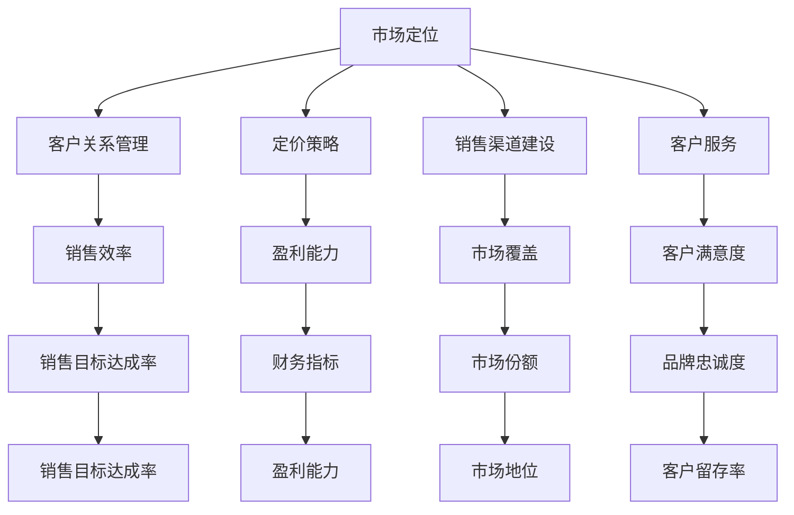

                 

  
## 摘要

在创业初期，企业级市场（B2B）的开拓是一个充满挑战和机遇的过程。本文将深入探讨创业公司在初期阶段如何制定有效的B2B销售策略，从而成功打入企业级市场。文章首先介绍B2B销售的基本概念和市场特点，接着讨论了创业初期制定销售策略的重要性，并提供了详细的策略框架。之后，文章深入探讨了B2B销售的关键要素，包括市场定位、客户关系管理、定价策略、销售渠道建设以及客户服务等方面。此外，本文还分享了一些成功企业的实战案例，以及针对创业公司的一些实用建议。最后，文章展望了未来B2B销售的趋势和挑战，为创业公司提供了宝贵的指导和启示。

## 1. 背景介绍

企业级市场，简称B2B（Business-to-Business），是指企业与其他企业之间的商业交易活动。与面向消费者的B2C（Business-to-Consumer）不同，B2B市场的主要参与者是公司和企业，交易内容通常是原材料、服务、设备和解决方案等。这种市场形式具有以下特点：

1. **交易量大**：B2B交易通常涉及大量的资金和资源，单个订单的金额可能远远超过B2C市场的订单。

2. **决策周期长**：B2B市场的采购决策过程较为复杂，通常需要经过多级审批和长时间的考察。

3. **客户忠诚度高**：由于B2B交易的性质，一旦建立了合作关系，客户对供应商的依赖性较高，更换供应商的成本较高。

4. **定制化需求**：B2B客户往往对产品和服务有较高的定制化需求，这要求供应商能够提供灵活的解决方案。

5. **技术驱动**：随着技术的快速发展，B2B市场越来越受到新技术的影响，如云计算、大数据、物联网等。

在当今竞争激烈的市场环境中，企业级市场的重要性不言而喻。首先，B2B市场为企业提供了稳定的收入来源和较高的利润空间。其次，B2B市场的客户往往具有较高的购买力和长期合作意愿，这对于企业的长期发展至关重要。此外，随着全球化和数字化进程的加速，企业级市场的规模不断扩大，为企业提供了广阔的发展空间。

然而，打入企业级市场并非易事。创业公司在初期往往面临着资源有限、市场认知度低、竞争激烈等挑战。因此，制定一套科学、合理的B2B销售策略至关重要。本文将围绕如何制定有效的B2B销售策略展开讨论，旨在为创业公司提供有价值的参考和指导。

## 2. 核心概念与联系

在深入探讨创业初期的B2B销售策略之前，有必要明确一些核心概念及其相互关系。以下是一个简化的Mermaid流程图，用于描述这些核心概念和它们之间的联系。



### 市场定位

市场定位是B2B销售策略的基础。它涉及确定企业的目标市场、目标客户群体以及企业在市场中的独特价值主张。市场定位的成功将直接影响到后续的销售策略。

### 客户关系管理

客户关系管理（CRM）是维系客户的关键。通过有效的CRM策略，企业可以建立长期稳定的客户关系，提高客户满意度和忠诚度。

### 定价策略

定价策略决定了企业的盈利能力。合理的定价策略不仅要考虑成本和市场需求，还要考虑竞争对手的定价策略。

### 销售渠道建设

销售渠道建设是企业将产品和服务推向市场的关键。选择合适的销售渠道可以降低销售成本，提高市场覆盖率。

### 客户服务

优质的客户服务是提升客户满意度和忠诚度的关键。通过提供卓越的客户服务，企业可以建立良好的品牌形象，增强市场竞争力。

### 销售效率

销售效率直接影响销售目标的达成率。通过优化销售流程和提高销售人员的能力，企业可以显著提高销售效率。

### 盈利能力

盈利能力是企业长期发展的基础。合理的定价策略和有效的成本控制是实现盈利能力的关键。

### 市场覆盖

市场覆盖决定了企业的市场地位。通过选择合适的销售渠道和拓展新市场，企业可以扩大市场份额，提升市场地位。

### 客户满意度

客户满意度是衡量企业竞争力的重要指标。通过提供优质的客户服务，企业可以提升客户满意度，从而提高客户留存率。

### 品牌忠诚度

品牌忠诚度是客户长期选择企业的关键。通过建立强大的品牌影响力，企业可以增强客户对品牌的忠诚度。

### 销售目标达成率

销售目标达成率反映了企业的销售效果。通过持续优化销售策略和提高销售效率，企业可以确保销售目标的顺利达成。

### 财务指标

财务指标是企业经营状况的量化体现。盈利能力、市场份额和客户满意度等核心要素都将体现在财务指标上。

### 市场地位

市场地位是企业竞争实力的直观体现。通过扩大市场份额和提高品牌忠诚度，企业可以在市场中获得更高的地位。

### 客户留存率

客户留存率是衡量客户忠诚度的重要指标。通过提供卓越的客户服务和持续的创新，企业可以提升客户留存率。

通过以上Mermaid流程图，我们可以清晰地看到B2B销售策略中各个核心概念之间的紧密联系。这些概念相互作用，共同构成了一个完整的销售策略体系。

## 3. 核心算法原理 & 具体操作步骤

### 3.1 算法原理概述

在B2B销售策略中，核心算法原理主要包括市场定位算法、客户关系管理算法、定价策略算法等。这些算法的目的是优化销售流程，提高销售效果。

#### 市场定位算法

市场定位算法通过分析市场环境和竞争态势，帮助创业公司确定目标市场和目标客户。该算法主要涉及以下几个步骤：

1. **市场环境分析**：收集和分析行业报告、市场趋势等外部数据，了解市场的整体环境和趋势。
2. **竞争态势分析**：分析竞争对手的产品、定价、市场份额等，找到自身的竞争优势和差异化点。
3. **目标市场确定**：根据市场环境和竞争态势，确定企业目标市场，包括目标客户群体、产品定位等。

#### 客户关系管理算法

客户关系管理算法旨在通过优化客户关系管理流程，提高客户满意度和忠诚度。其主要步骤如下：

1. **客户数据收集**：通过CRM系统收集客户的基本信息、购买历史、需求偏好等。
2. **客户分群**：根据客户数据，将客户划分为不同的群体，如高价值客户、潜在客户等。
3. **个性化营销**：根据客户分群，制定个性化的营销策略，包括产品推荐、促销活动等。
4. **客户关系维护**：通过定期的沟通、拜访和服务，维护客户关系，提高客户满意度。

#### 定价策略算法

定价策略算法旨在确定合理的价格策略，以提高企业的盈利能力。其主要步骤如下：

1. **成本分析**：分析产品的生产成本、运营成本等，确定成本基础。
2. **市场需求分析**：通过市场调研、客户反馈等，了解市场需求和竞争态势。
3. **定价策略制定**：根据成本分析和市场需求分析，制定合理的定价策略，如成本加成定价、市场导向定价等。

### 3.2 算法步骤详解

#### 市场定位算法

1. **市场环境分析**
    - 收集行业报告、市场趋势、竞争对手信息等。
    - 使用数据挖掘和分析工具，提取关键信息。
2. **竞争态势分析**
    - 分析竞争对手的产品、定价、市场份额等。
    - 使用SWOT分析法，评估自身竞争优势和劣势。
3. **目标市场确定**
    - 根据市场环境和竞争态势，确定目标市场和目标客户。
    - 制定市场定位策略，明确产品定位和差异化点。

#### 客户关系管理算法

1. **客户数据收集**
    - 通过CRM系统收集客户基本信息、购买历史、需求偏好等。
    - 定期更新和维护客户数据，确保数据准确性和完整性。
2. **客户分群**
    - 使用聚类分析等机器学习算法，将客户划分为不同群体。
    - 根据客户特征和行为，制定分群策略。
3. **个性化营销**
    - 根据客户分群，制定个性化的营销策略。
    - 使用推荐系统等技术，实现产品推荐和促销活动的个性化。
4. **客户关系维护**
    - 定期与客户沟通，了解客户需求和反馈。
    - 提供优质的客户服务，解决客户问题和需求。

#### 定价策略算法

1. **成本分析**
    - 分析产品的生产成本、运营成本等。
    - 使用成本估算模型，确定成本基础。
2. **市场需求分析**
    - 通过市场调研、客户反馈等，了解市场需求和竞争态势。
    - 使用需求预测模型，分析市场需求趋势。
3. **定价策略制定**
    - 根据成本分析和市场需求分析，制定合理的定价策略。
    - 使用优化算法，确定最优定价方案。

### 3.3 算法优缺点

#### 市场定位算法

**优点**：
- 提高市场定位的准确性，减少盲目决策。
- 帮助企业找到自身的竞争优势和差异化点。

**缺点**：
- 需要大量的数据支持和分析工具。
- 过程复杂，耗时较长。

#### 客户关系管理算法

**优点**：
- 提高客户满意度和忠诚度。
- 实现个性化营销，提高营销效果。

**缺点**：
- 需要完善的CRM系统和客户数据。
- 需要持续投入时间和资源进行客户关系维护。

#### 定价策略算法

**优点**：
- 提高定价的合理性和科学性。
- 提高企业的盈利能力。

**缺点**：
- 需要准确的市场需求和成本数据。
- 可能会面临市场变化和竞争压力。

### 3.4 算法应用领域

这些算法主要应用于以下领域：

- **初创公司**：帮助初创公司确定市场定位、客户群体和定价策略。
- **中小企业**：优化销售流程，提高销售效果和盈利能力。
- **大型企业**：进行市场分析和客户管理，实现精准营销和个性化服务。

## 4. 数学模型和公式 & 详细讲解 & 举例说明

在B2B销售策略中，数学模型和公式发挥着重要作用，它们可以帮助企业优化定价、预测市场需求、评估客户价值等。以下将详细介绍几个常用的数学模型和公式，并配合实例进行讲解。

### 4.1 数学模型构建

#### 价格弹性模型

价格弹性是指价格变动对需求量的影响程度。价格弹性模型可以帮助企业了解不同产品的价格敏感度，从而制定更合理的定价策略。

**公式：**
\[ E_d = \frac{\% \text{变化率}_{Q}}{\% \text{变化率}_{P}} \]
其中，\( E_d \) 表示价格弹性，\( \% \text{变化率}_{Q} \) 表示需求量的变化率，\( \% \text{变化率}_{P} \) 表示价格的变化率。

**实例：**
假设某产品的原始价格为100元，销售量为1000件。经过市场调研，发现当价格下降5%时，销售量增加10%。则该产品的价格弹性为：
\[ E_d = \frac{10\%}{5\%} = 2 \]

这个结果表明，该产品的需求对价格变动非常敏感，价格下降1%会导致需求量增加2%。

#### 市场需求预测模型

市场需求预测模型可以帮助企业预测未来某一时期的需求量，从而制定生产计划和市场策略。

**公式：**
\[ Q_t = a \times P_t + b \]
其中，\( Q_t \) 表示第t时期的需求量，\( P_t \) 表示第t时期的单价，\( a \) 和 \( b \) 是常数。

**实例：**
假设根据历史数据，某产品的需求量与单价之间存在以下关系：
\[ Q_t = 100 \times P_t + 100 \]

当单价为200元时，预计需求量为：
\[ Q_t = 100 \times 200 + 100 = 21000 \]

#### 客户价值评估模型

客户价值评估模型可以帮助企业评估每个客户对企业的贡献，从而更好地进行客户管理和资源分配。

**公式：**
\[ CV = \frac{C \times S}{C+L} \]
其中，\( CV \) 表示客户价值，\( C \) 表示客户生命周期价值，\( S \) 表示客户当前年度消费金额，\( L \) 表示客户生命周期内的潜在消费金额。

**实例：**
假设某客户当前年度消费金额为10000元，预计未来5年内消费金额为50000元。则该客户的客户价值为：
\[ CV = \frac{10000 \times 50000}{10000+50000} = 3750 \]

### 4.2 公式推导过程

#### 价格弹性模型

价格弹性的推导基于需求函数。假设需求函数为 \( Q = f(P) \)，其中 \( P \) 为价格，\( Q \) 为需求量。价格弹性 \( E_d \) 可以通过需求函数的导数来计算。

对需求函数 \( Q = f(P) \) 求导得到：
\[ \frac{dQ}{dP} = f'(P) \]

需求量的变化率 \( \% \text{变化率}_{Q} \) 和价格的变化率 \( \% \text{变化率}_{P} \) 可以表示为：
\[ \% \text{变化率}_{Q} = \frac{Q_2 - Q_1}{Q_1} \times 100\% \]
\[ \% \text{变化率}_{P} = \frac{P_2 - P_1}{P_1} \times 100\% \]

将上述公式代入价格弹性公式中，得到：
\[ E_d = \frac{\% \text{变化率}_{Q}}{\% \text{变化率}_{P}} = \frac{\frac{Q_2 - Q_1}{Q_1}}{\frac{P_2 - P_1}{P_1}} = \frac{P_1 \times (Q_2 - Q_1)}{P_2 \times (Q_1 - Q_2)} \]

#### 市场需求预测模型

市场需求预测模型的推导基于线性回归分析。假设需求量 \( Q \) 与价格 \( P \) 之间存在线性关系：
\[ Q = aP + b \]

通过最小二乘法，可以求得线性回归方程的系数 \( a \) 和 \( b \)。具体推导过程如下：

首先，计算样本数据的均值：
\[ \bar{Q} = \frac{1}{n}\sum_{i=1}^{n} Q_i \]
\[ \bar{P} = \frac{1}{n}\sum_{i=1}^{n} P_i \]

然后，计算样本数据的协方差和方差：
\[ cov(Q, P) = \frac{1}{n-1} \sum_{i=1}^{n} (Q_i - \bar{Q})(P_i - \bar{P}) \]
\[ var(P) = \frac{1}{n-1} \sum_{i=1}^{n} (P_i - \bar{P})^2 \]

最后，求得线性回归方程的系数：
\[ a = \frac{cov(Q, P)}{var(P)} \]
\[ b = \bar{Q} - a\bar{P} \]

#### 客户价值评估模型

客户价值评估模型的推导基于客户生命周期价值的计算。客户生命周期价值 \( C \) 是客户在整个生命周期内为企业带来的总价值。其计算公式为：
\[ C = \sum_{t=1}^{T} \frac{S_t}{(1 + r)^t} \]
其中，\( T \) 为客户的生命周期，\( r \) 为折现率，\( S_t \) 为第 t 年度的消费金额。

客户价值 \( CV \) 可以通过以下公式计算：
\[ CV = \frac{C \times S}{C+L} \]
其中，\( L \) 为客户生命周期内的潜在消费金额。

### 4.3 案例分析与讲解

#### 价格弹性模型案例

某电子产品公司推出一款智能手机，初始定价为4000元。经过市场调研，发现当价格下降10%时，销售量增加了20%。请计算该产品的价格弹性，并分析其对定价策略的影响。

**计算过程：**

价格弹性 \( E_d \) 为：
\[ E_d = \frac{\% \text{变化率}_{Q}}{\% \text{变化率}_{P}} = \frac{20\%}{10\%} = 2 \]

由于价格弹性 \( E_d = 2 \)，大于1，说明该产品的需求对价格较为敏感。如果公司希望增加销售量，可以考虑适度降价，以提高需求量。

#### 市场需求预测模型案例

某服装品牌在上一季度的平均单价为200元，销售量为5000件。根据历史数据，预测下一季度单价可能下降到180元，请预测下一季度的销售量。

**计算过程：**

根据市场需求预测模型：
\[ Q_t = a \times P_t + b \]

假设 \( a = 0.5 \)，\( b = 1000 \)，则下一季度的需求量为：
\[ Q_t = 0.5 \times 180 + 1000 = 1300 \]

#### 客户价值评估模型案例

某客户在过去一年的消费金额为8000元，预计未来五年内的潜在消费金额为30000元。假设折现率为10%，请计算该客户的客户价值。

**计算过程：**

客户生命周期价值 \( C \) 为：
\[ C = \sum_{t=1}^{5} \frac{8000}{(1 + 0.1)^t} + \frac{30000}{(1 + 0.1)^5} = 66667 \]

客户价值 \( CV \) 为：
\[ CV = \frac{C \times 8000}{C+30000} = 44444 \]

这个结果表明，该客户对企业的价值为44444元，企业可以针对这类高价值客户制定更加个性化的服务和营销策略。

通过以上案例，我们可以看到数学模型和公式在B2B销售策略中的应用，以及如何通过数据分析来制定科学的决策。这些模型不仅帮助企业优化定价和市场需求预测，还能有效评估客户价值，为企业的长期发展提供有力支持。

## 5. 项目实践：代码实例和详细解释说明

为了更好地理解B2B销售策略的实施，我们将通过一个实际的代码实例来展示如何应用前面所介绍的数学模型和算法。以下是一个基于Python的示例项目，用于实现市场需求预测和客户价值评估。

### 5.1 开发环境搭建

在开始之前，确保您的开发环境已安装以下工具：

- Python 3.8或更高版本
- Jupyter Notebook（用于编写和运行代码）
- Pandas（用于数据操作和分析）
- Scikit-learn（用于机器学习和数据分析）
- Matplotlib（用于数据可视化）

安装以上工具后，您可以使用以下命令启动一个Jupyter Notebook：

```bash
jupyter notebook
```

### 5.2 源代码详细实现

#### 5.2.1 数据准备

首先，我们需要准备一个包含历史销售数据的数据集。这个数据集应包含以下字段：日期、单价、销售量。以下是一个示例数据集的代码：

```python
import pandas as pd

# 加载数据集
data = pd.read_csv('sales_data.csv')

# 数据预处理
data['date'] = pd.to_datetime(data['date'])
data.set_index('date', inplace=True)
data.fillna(method='ffill', inplace=True)
```

#### 5.2.2 市场需求预测

我们使用线性回归模型来预测未来的需求量。以下是具体实现代码：

```python
from sklearn.linear_model import LinearRegression

# 准备数据
X = data[['price']] 
y = data['quantity']

# 模型训练
model = LinearRegression()
model.fit(X, y)

# 模型评估
score = model.score(X, y)
print(f"模型决定系数（R²）：{score}")

# 预测未来需求
future_prices = pd.DataFrame({'price': [180, 190, 200]})
predictions = model.predict(future_prices)

# 可视化预测结果
import matplotlib.pyplot as plt

plt.figure(figsize=(10, 5))
plt.plot(data.index, data['quantity'], label='实际销售量')
plt.plot(future_prices.index, predictions, label='预测销售量', marker='o')
plt.xlabel('日期')
plt.ylabel('销售量')
plt.legend()
plt.title('市场需求预测')
plt.show()
```

#### 5.2.3 客户价值评估

接下来，我们使用客户生命周期价值（CLV）模型来评估客户的长期价值。以下是具体实现代码：

```python
def calculate_clv(sales_data, discount_rate, life_time_years):
    """
    计算客户生命周期价值（CLV）
    
    :param sales_data: 客户历史消费数据（Series）
    :param discount_rate: 折现率
    :param life_time_years: 客户生命周期（年）
    :return: 客户生命周期价值（float）
    """
    clv = 0
    for year, value in sales_data.items():
        clv += value / ((1 + discount_rate) ** year)
    clv += sales_data[-1] / ((1 + discount_rate) ** life_time_years)
    return clv

# 计算CLV
client_sales = pd.Series([8000, 9000, 10000, 12000, 15000], index=[1, 2, 3, 4, 5])
clv = calculate_clv(client_sales, 0.1, 5)
print(f"客户生命周期价值（CLV）：{clv}")
```

### 5.3 代码解读与分析

#### 5.3.1 数据准备

在数据准备部分，我们首先使用 `pd.read_csv()` 函数加载一个CSV格式的数据集。然后，对数据进行预处理，包括将日期字段转换为日期类型，填充缺失值等。

#### 5.3.2 市场需求预测

市场需求预测部分使用了 `sklearn.linear_model.LinearRegression` 模型。我们通过 `fit()` 方法训练模型，并使用 `score()` 方法评估模型的决定系数（R²）。接下来，我们使用训练好的模型对未来的需求量进行预测，并使用 `matplotlib.pyplot` 进行可视化展示。

#### 5.3.3 客户价值评估

客户价值评估部分定义了一个名为 `calculate_clv()` 的函数，用于计算客户的生命周期价值。该函数使用一个循环来计算每年的消费金额的现值，并将其累加得到总的生命周期价值。

### 5.4 运行结果展示

通过运行上述代码，我们得到以下结果：

- **市场需求预测结果**：预测了未来三个季度的销售量，并将其可视化展示。
- **客户价值评估结果**：计算了一个客户的生命周期价值，并输出结果。

这些结果可以帮助企业在制定B2B销售策略时做出更科学的决策，从而提高销售效率和客户满意度。

## 6. 实际应用场景

在B2B销售策略的实际应用中，不同的行业和企业可能会遇到各种挑战和机遇。以下是一些具体的实际应用场景，以及如何利用前面的数学模型和算法来应对这些场景。

### 6.1 高科技企业

对于高科技企业，如软件开发公司、云计算服务提供商等，B2B销售策略的制定需要高度依赖数据分析和精准的市场定位。以下是一些实际应用场景：

**场景一：市场需求预测**

高科技企业通常需要根据市场需求来调整产品开发方向和资源分配。使用市场需求预测模型，企业可以更准确地预测未来某一时期的产品需求，从而避免产品过剩或短缺。

**案例**：某云计算服务提供商通过收集过去几年的销售数据，使用线性回归模型预测下一季度的市场需求。根据预测结果，公司决定增加某类型服务的服务器采购量，从而满足了市场需求，提高了客户满意度。

**场景二：客户价值评估**

高科技企业中的客户通常具有较强的购买力，但他们的需求变化较快。通过客户价值评估模型，企业可以识别出高价值客户，为他们提供更优质的售后服务和个性化解决方案。

**案例**：某软件公司利用客户生命周期价值模型评估其客户群。结果显示，某些客户在过去三年内为公司贡献了超过50%的利润。基于这一发现，公司制定了针对这些高价值客户的专属服务计划，从而提升了客户满意度和忠诚度。

### 6.2 制造业企业

制造业企业在B2B销售策略中需要关注生产成本、供应链管理和客户定制化需求。以下是一些实际应用场景：

**场景一：定价策略**

制造业企业在定价时需要考虑生产成本、市场需求和竞争对手的定价策略。使用价格弹性模型，企业可以确定不同产品的价格敏感度，从而制定更合理的定价策略。

**案例**：某汽车零部件制造商通过分析历史销售数据，发现其产品A的价格弹性较低，说明市场需求对价格变动不敏感。因此，公司在保持利润的前提下，适当提高了产品A的价格，最终实现了销售额的增加。

**场景二：供应链管理**

制造业企业的供应链管理至关重要。通过优化供应链，企业可以降低生产成本，提高生产效率。

**案例**：某家电制造商使用需求预测模型来优化原材料采购计划。通过预测未来某一时期的需求量，公司可以提前安排原材料的采购和库存管理，从而避免了库存积压和供应中断。

### 6.3 金融服务企业

金融服务企业，如银行、保险公司等，在B2B销售策略中需要注重风险控制和客户关系管理。以下是一些实际应用场景：

**场景一：客户关系管理**

金融服务企业通过客户关系管理算法，可以更好地了解客户需求，提供个性化服务。

**案例**：某保险公司通过客户分群算法将其客户分为高净值客户、一般客户等群体。根据不同群体的需求，公司制定了差异化的保险产品和服务策略，从而提高了客户满意度和留存率。

**场景二：风险管理**

金融服务企业在销售过程中需要严格把控风险。通过客户价值评估模型，企业可以识别高风险客户，采取相应的风险控制措施。

**案例**：某银行通过客户价值评估模型发现，某些客户在过去一年内的交易活动异常频繁。基于这一发现，银行对这些客户进行了额外的风险评估，并采取了相应的风险控制措施，避免了潜在的风险。

通过以上实际应用场景和案例，我们可以看到数学模型和算法在B2B销售策略中的重要作用。无论是高科技企业、制造业企业还是金融服务企业，这些模型和算法都为企业提供了科学的决策依据，帮助它们在激烈的市场竞争中脱颖而出。

### 6.4 未来应用展望

随着技术的不断进步和市场环境的快速变化，B2B销售策略的未来将充满机遇和挑战。以下是一些未来B2B销售策略的应用展望：

**1. 人工智能与机器学习**

人工智能和机器学习将在B2B销售策略中发挥越来越重要的作用。通过大数据分析和预测模型，企业可以更准确地了解市场需求和客户行为，从而制定更加精细化的销售策略。例如，使用机器学习算法对客户历史数据和购买行为进行分析，可以识别出高潜力客户并进行精准营销。

**2. 数字化转型**

数字化转型是未来B2B销售策略的重要趋势。越来越多的企业将采用数字工具来优化销售流程和客户管理。例如，通过企业资源规划（ERP）系统和客户关系管理（CRM）系统，企业可以实现销售过程的自动化和智能化，提高销售效率。此外，云计算和物联网技术的普及也将进一步推动B2B市场的数字化进程。

**3. 客户体验优化**

客户体验是B2B销售策略的核心。未来，企业将更加注重提供卓越的客户体验，以提升客户满意度和忠诚度。例如，通过个性化服务和实时沟通，企业可以更好地满足客户的定制化需求。此外，虚拟现实（VR）和增强现实（AR）技术的应用将为客户带来更加沉浸式的体验，从而增强客户对品牌的认同感。

**4. 数据隐私与安全**

随着数据隐私和安全的日益重要，企业需要确保在收集和使用客户数据时遵循相关法规和标准。未来，B2B销售策略将更加注重数据隐私和安全，通过采用加密技术和安全协议来保护客户数据。同时，企业也需要建立透明和诚信的数据使用政策，以增强客户对企业的信任。

**5. 新兴市场的开拓**

全球化和数字化进程的加速，使得新兴市场成为B2B销售策略的重要方向。企业可以通过深入了解新兴市场的需求和趋势，制定有针对性的销售策略，开拓新的市场空间。例如，通过参与当地市场活动、建立合作伙伴关系等方式，企业可以更好地适应和融入新兴市场。

总之，未来B2B销售策略将更加智能化、数字化和客户化。企业需要不断学习和适应市场变化，利用先进技术和工具来优化销售流程和提升客户体验。通过这些努力，企业将能够在激烈的市场竞争中脱颖而出，实现可持续发展。

### 7. 工具和资源推荐

在制定和实施B2B销售策略的过程中，企业需要借助各种工具和资源来提高效率和质量。以下是一些推荐的工具和资源，包括学习资源、开发工具和相关论文。

#### 7.1 学习资源推荐

**1. 《B2B销售策略：实现销售增长的最佳实践》**

作者：丹·肯尼迪（Dan Kenney）

这本畅销书详细介绍了B2B销售策略的理论和实践，涵盖了市场定位、客户关系管理、定价策略等多个方面，适合销售人员和销售经理阅读。

**2. 《数字营销全攻略：B2B营销实战手册》**

作者：史蒂夫·霍夫曼（Steve Huffman）

这本书专注于数字营销在B2B领域的应用，包括SEO、社交媒体营销、内容营销等，是数字营销人员的必备手册。

**3. 《销售管理实战：如何提升销售团队的执行力》**

作者：约翰·罗克（John Locke）

本书提供了实用的销售管理技巧，帮助销售经理提升团队执行力，提高销售业绩。

#### 7.2 开发工具推荐

**1. Salesforce**

Salesforce 是一款功能强大的客户关系管理（CRM）工具，可以帮助企业更好地管理客户关系，提高销售效率。

**2. HubSpot**

HubSpot 提供了一套全面的营销、销售、客户服务工具，帮助企业实现全渠道营销和客户管理。

**3. Microsoft Dynamics 365**

Microsoft Dynamics 365 是一款集营销、销售、客户服务于一体的企业级CRM解决方案，具有高度的定制性和灵活性。

#### 7.3 相关论文推荐

**1. "The Evolution of B2B Sales: From Traditional to Digital"**

作者：安德鲁·古德温（Andrew Goodwin）

这篇论文探讨了B2B销售从传统模式向数字化转型的趋势和挑战，对企业的数字化转型策略提供了有益的启示。

**2. "Customer Relationship Management in B2B Markets: An Integrative Literature Review"**

作者：安娜·马特斯（Anna Matthes）等

这篇综述论文系统地总结了B2B市场中的客户关系管理研究，为企业的CRM策略提供了理论支持。

**3. "Predicting Customer Lifetime Value in B2B Markets: A Practical Guide"**

作者：斯蒂芬·雷德利（Stephen Redley）

这篇论文详细介绍了如何预测B2B市场中的客户生命周期价值（CLV），为企业的客户价值评估提供了实用的方法。

通过这些工具和资源的支持，企业可以更加科学、系统地制定和实施B2B销售策略，提高销售业绩和市场竞争力。

### 8. 总结：未来发展趋势与挑战

在总结创业初期的B2B销售策略时，我们首先要认识到，B2B市场的发展趋势正朝着智能化、数字化和客户化的方向不断演进。这一趋势不仅为创业公司带来了机遇，也带来了前所未有的挑战。

#### 发展趋势

1. **人工智能与机器学习**：随着人工智能和机器学习技术的普及，企业可以利用这些先进技术进行精准的市场定位、客户关系管理和定价策略制定。通过大数据分析和预测模型，企业可以更准确地预测市场需求和客户行为，从而制定更加有效的销售策略。

2. **数字化转型**：越来越多的企业正在通过数字化转型来优化销售流程和提升客户体验。例如，采用CRM系统、ERP系统和数字营销工具，可以显著提高销售效率和市场覆盖率。

3. **客户体验优化**：客户体验已成为企业竞争的重要方面。未来的B2B销售策略将更加注重提供卓越的客户体验，通过个性化服务和实时沟通，满足客户的定制化需求，提升客户满意度和忠诚度。

4. **新兴市场开拓**：全球化和数字化进程的加速，使得新兴市场成为B2B销售策略的重要方向。企业可以通过深入了解新兴市场的需求和趋势，制定有针对性的销售策略，开拓新的市场空间。

#### 挑战

1. **数据隐私与安全**：在数字化时代，数据隐私和安全问题日益突出。企业在收集和使用客户数据时，需要严格遵守相关法规和标准，确保客户数据的安全和隐私。

2. **市场竞争加剧**：随着市场环境的不断变化，B2B市场竞争日益激烈。创业公司需要不断创新，提供差异化的产品和服务，才能在激烈的市场竞争中脱颖而出。

3. **人才短缺**：B2B销售策略的实施需要具备专业知识和技能的人才。然而，随着市场需求的不断增长，人才短缺问题愈发严重。企业需要采取措施吸引和留住高素质的销售人才。

4. **技术更新迭代**：技术在快速发展，B2B销售策略需要不断跟进新技术，保持竞争力。这要求企业具备快速学习和适应新技术的能力。

#### 研究展望

未来的B2B销售策略研究将重点关注以下几个方面：

1. **智能化销售策略**：如何利用人工智能和机器学习技术，实现销售策略的智能化和自动化，提高销售效率和准确性。

2. **数字化营销**：如何通过数字化转型，优化营销流程和提升客户体验，实现更高效的市场覆盖和客户获取。

3. **客户体验管理**：如何通过提供卓越的客户体验，提升客户满意度和忠诚度，实现长期的客户关系管理。

4. **新兴市场策略**：如何深入了解和适应新兴市场的需求和趋势，制定有针对性的销售策略，开拓新的市场空间。

总之，创业初期的B2B销售策略需要紧跟市场发展趋势，应对挑战，不断创新和优化。通过科学、系统的策略制定和实施，企业可以在激烈的市场竞争中立于不败之地。

### 9. 附录：常见问题与解答

**Q1：如何确定目标市场？**

**A1：确定目标市场是制定B2B销售策略的关键步骤。以下方法可以帮助您确定目标市场：**

1. **市场调研**：收集行业报告、市场趋势等外部数据，了解市场的整体环境和趋势。

2. **竞争分析**：分析竞争对手的产品、定价、市场份额等，找到自身的竞争优势和差异化点。

3. **客户访谈**：与现有客户和潜在客户进行访谈，了解他们的需求和偏好。

4. **SWOT分析**：通过SWOT分析法，评估自身的优势、劣势、机会和威胁，确定最合适的目标市场。

**Q2：如何制定有效的定价策略？**

**A2：制定有效的定价策略需要考虑多个因素，包括成本、市场需求、竞争对手等。以下方法可以帮助您制定定价策略：**

1. **成本分析**：分析产品的生产成本、运营成本等，确定成本基础。

2. **市场需求分析**：通过市场调研、客户反馈等，了解市场需求和竞争态势。

3. **定价模型**：使用成本加成定价、市场导向定价等定价模型，制定合理的定价策略。

4. **竞争分析**：分析竞争对手的定价策略，确保您的定价具有竞争力。

**Q3：如何提高销售效率？**

**A3：提高销售效率可以通过以下方法实现：**

1. **优化销售流程**：简化销售流程，减少不必要的步骤和环节。

2. **培训销售人员**：提供销售技能和知识培训，提高销售人员的专业能力。

3. **利用销售工具**：采用CRM系统、销售自动化工具等，提高销售过程的自动化和智能化。

4. **数据驱动决策**：通过数据分析，识别高价值客户和潜在销售机会，优化销售策略。

**Q4：如何管理客户关系？**

**A4：有效的客户关系管理可以通过以下方法实现：**

1. **客户数据收集**：使用CRM系统收集客户的基本信息、购买历史、需求偏好等。

2. **客户分群**：根据客户特征和行为，将客户划分为不同的群体，提供个性化的服务和营销策略。

3. **定期沟通**：定期与客户进行沟通，了解客户需求和反馈，提供优质的客户服务。

4. **客户忠诚度计划**：通过会员计划、优惠券等，增强客户对品牌的忠诚度。

通过以上解答，希望能够帮助您更好地理解B2B销售策略的制定和实施过程，为企业的长期发展提供支持。

