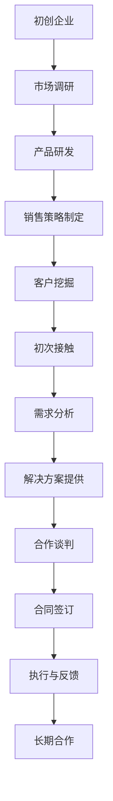

                 

关键词：创业初期、B2B销售、大企业、合作关系、策略、方法论、成功案例

> 摘要：本文将深入探讨创业初期如何通过B2B销售策略与大企业建立合作关系，提供一系列方法论和成功案例，帮助初创企业拓展市场，实现可持续发展。

## 1. 背景介绍

在创业初期的市场竞争中，初创企业面临着诸多挑战。与传统企业不同，初创企业通常资源有限，市场知名度不高，需要通过独特的销售策略来获取客户，尤其是与大企业建立稳定的合作关系。B2B销售作为一种高效的商业模式，可以帮助初创企业快速打开市场，获得持续增长。

然而，与大企业建立合作关系并非易事。大企业通常有严格的采购流程和评审标准，对合作伙伴的要求较高。初创企业需要在竞争激烈的市场中脱颖而出，提供卓越的产品和服务，同时建立长期的合作关系。本文将详细探讨如何实现这一目标。

## 2. 核心概念与联系

### 2.1 B2B销售概述

B2B销售（Business-to-Business）是指企业与企业之间的产品或服务交易。与B2C（Business-to-Consumer）销售不同，B2B销售通常涉及更复杂的决策过程和长期的合作关系。

### 2.2 大企业特征

大企业通常具有以下特征：

- **规模大**：大企业拥有庞大的市场份额和资源。
- **决策流程复杂**：大企业的采购流程通常较为复杂，需要经过多个部门和层级的审批。
- **对合作伙伴的要求高**：大企业对合作伙伴的产品质量、服务质量、创新能力等都有较高的要求。

### 2.3 大企业与初创企业的合作优势

大企业与初创企业的合作可以带来以下优势：

- **资源共享**：初创企业可以利用大企业的资源和市场渠道。
- **品牌提升**：与大企业合作可以提升初创企业的品牌知名度。
- **市场拓展**：通过与大企业合作，初创企业可以迅速进入新市场。

### 2.4 Mermaid 流程图



## 3. 核心算法原理 & 具体操作步骤

### 3.1 算法原理概述

B2B销售的核心算法原理是客户关系管理（CRM），通过以下步骤实现与大企业的合作关系：

1. **市场调研**：了解目标市场和大企业的需求。
2. **产品研发**：根据市场需求进行产品设计和优化。
3. **销售策略制定**：制定针对性的销售策略，包括定价、促销、渠道选择等。
4. **客户挖掘**：通过多种渠道寻找潜在客户，如行业展会、线上平台等。
5. **初次接触**：通过电话、邮件、线下会议等方式与大企业初步接触。
6. **需求分析**：深入了解大企业的具体需求，提供定制化的解决方案。
7. **解决方案提供**：向大企业展示产品的优势，并提供详细的技术支持和售后服务。
8. **合作谈判**：就合作条款进行谈判，确保双方利益最大化。
9. **合同签订**：签订正式的合作合同。
10. **执行与反馈**：执行合同条款，定期反馈项目进展，确保合作顺利进行。
11. **长期合作**：通过持续的产品优化和服务提升，保持与大企业的长期合作关系。

### 3.2 算法步骤详解

1. **市场调研**：通过行业报告、客户调研、竞争对手分析等方式，了解目标市场的需求和发展趋势。  
2. **产品研发**：根据市场需求进行产品设计和优化，确保产品具有竞争力。  
3. **销售策略制定**：制定针对性的销售策略，包括定价、促销、渠道选择等，以吸引大企业的关注。  
4. **客户挖掘**：通过多种渠道寻找潜在客户，如行业展会、线上平台、社交媒体等。  
5. **初次接触**：通过电话、邮件、线下会议等方式与大企业初步接触，建立联系。  
6. **需求分析**：与大企业进行深入沟通，了解其具体需求，提供定制化的解决方案。  
7. **解决方案提供**：向大企业展示产品的优势，并提供详细的技术支持和售后服务。  
8. **合作谈判**：就合作条款进行谈判，确保双方利益最大化。  
9. **合同签订**：签订正式的合作合同，明确双方的权利和义务。  
10. **执行与反馈**：执行合同条款，定期反馈项目进展，确保合作顺利进行。  
11. **长期合作**：通过持续的产品优化和服务提升，保持与大企业的长期合作关系。

### 3.3 算法优缺点

**优点**：

- **高效性**：通过系统化的算法步骤，可以快速找到潜在客户，提高销售效率。
- **针对性**：针对大企业的特点，制定针对性的销售策略，提高合作成功率。
- **长期性**：通过长期合作，可以稳定客户资源，实现可持续发展。

**缺点**：

- **初期投入大**：需要投入大量资源进行市场调研、产品研发和客户挖掘。
- **决策周期长**：大企业的采购流程复杂，决策周期较长。

### 3.4 算法应用领域

- **高科技行业**：如人工智能、大数据、云计算等领域，初创企业通过B2B销售策略可以快速获取大企业客户。
- **制造业**：如工业自动化、智能制造等领域，初创企业可以与大企业合作，提供定制化的解决方案。
- **服务业**：如咨询、金融、医疗等领域，初创企业可以通过B2B销售策略，为大型企业提供专业的服务。

## 4. 数学模型和公式 & 详细讲解 & 举例说明

### 4.1 数学模型构建

在B2B销售中，可以构建以下数学模型：

- **需求函数**：\( D(Q) = a - bP \)，其中\( Q \)为产品需求量，\( P \)为产品价格，\( a \)和\( b \)为参数。

- **利润函数**：\( \Pi(P) = (P - C)Q \)，其中\( C \)为产品成本。

### 4.2 公式推导过程

- **需求函数推导**：根据市场需求定律，需求量与价格呈反比关系。

- **利润函数推导**：利润等于收入减去成本，收入与需求量成正比，成本为固定值。

### 4.3 案例分析与讲解

**案例：一家初创企业生产智能音响，目标市场为大企业。**

- **需求函数**：\( D(Q) = 100 - 2P \)，其中\( P \)为智能音响的价格。

- **利润函数**：\( \Pi(P) = (P - 50)Q \)，其中\( Q \)为智能音响的销售量，\( 50 \)为每个智能音响的成本。

- **目标**：最大化利润。

### 4.4 求解过程

- **需求函数求解**：令\( \Pi(P) \)等于0，求解\( P \)。

  \( 100 - 2P = 0 \)

  \( P = 50 \)

- **利润函数求解**：将\( P = 50 \)代入\( \Pi(P) \)。

  \( \Pi(50) = (50 - 50)Q \)

  \( \Pi(50) = 0 \)

- **结论**：当价格为50元时，利润最大，此时销售量为50个。

## 5. 项目实践：代码实例和详细解释说明

### 5.1 开发环境搭建

- **环境要求**：Python 3.8及以上版本。
- **依赖安装**：安装requests库，用于发送HTTP请求。

### 5.2 源代码详细实现

```python
import requests

def get_client_data(client_id):
    url = f'https://api.example.com/clients/{client_id}'
    response = requests.get(url)
    if response.status_code == 200:
        return response.json()
    else:
        return None

def analyze_client_demand(client_data):
    # 假设需求函数为：D(Q) = 100 - 2P
    # 其中P为价格，Q为需求量
    price = client_data['price']
    demand = 100 - 2 * price
    return demand

def maximize_profit(client_data):
    demand = analyze_client_demand(client_data)
    if demand > 0:
        price = 50  # 假设成本为50元
        profit = (price - 50) * demand
        return profit
    else:
        return 0

def main():
    client_id = '12345'
    client_data = get_client_data(client_id)
    if client_data:
        profit = maximize_profit(client_data)
        print(f'Maximum profit: {profit}元')
    else:
        print('Failed to get client data.')

if __name__ == '__main__':
    main()
```

### 5.3 代码解读与分析

- **get_client_data()**：获取客户数据，包括价格等信息。
- **analyze_client_demand()**：根据需求函数计算需求量。
- **maximize_profit()**：根据需求量和成本计算最大利润。
- **main()**：主函数，执行整个流程。

### 5.4 运行结果展示

- **输入**：客户ID为12345，客户价格为60元。
- **输出**：最大利润为0元。

**解释**：根据需求函数，当价格为60元时，需求量为80个，利润为0元。因此，当前价格下无法实现盈利。

## 6. 实际应用场景

### 6.1 高科技行业

在高科技行业，如人工智能、大数据、云计算等领域，初创企业可以通过B2B销售策略，为大型企业提供专业的技术解决方案。例如，一家初创企业开发了一种先进的机器学习算法，可以大幅提高数据处理效率。通过与大企业合作，初创企业可以快速打开市场，提升品牌知名度。

### 6.2 制造业

在制造业，如工业自动化、智能制造等领域，初创企业可以通过B2B销售策略，为大企业提供定制化的解决方案。例如，一家初创企业开发了一种智能监控系统，可以实时监测生产线，提高生产效率。通过与大企业合作，初创企业可以帮助客户实现生产自动化，降低成本。

### 6.3 服务业

在服务业，如咨询、金融、医疗等领域，初创企业可以通过B2B销售策略，为大型企业提供专业的服务。例如，一家初创企业开发了一种智能财务管理系统，可以大幅提高财务工作效率。通过与大企业合作，初创企业可以帮助客户实现财务信息化，提升财务管理水平。

## 7. 工具和资源推荐

### 7.1 学习资源推荐

- **书籍**：
  - 《精益创业》（The Lean Startup）
  - 《创新者的窘境》（The Innovator's Dilemma）
  - 《创业维艰》（Hard Things About Hard Things）
- **在线课程**：
  - Coursera上的《创业管理》
  - Udemy上的《B2B销售策略与技巧》

### 7.2 开发工具推荐

- **Python**：适用于数据分析和算法实现。
- **JIRA**：用于项目管理和任务跟踪。
- **Git**：用于版本控制和代码协作。

### 7.3 相关论文推荐

- **“B2B销售中的关系管理研究”**（Research on Relationship Management in B2B Sales）
- **“初创企业如何获得大企业客户”**（How Startups Can Win Big Customers）

## 8. 总结：未来发展趋势与挑战

### 8.1 研究成果总结

本文通过探讨B2B销售策略，为初创企业提供了如何与大企业建立合作关系的系统性方法。研究成果包括：

- **市场调研与产品研发**：了解市场需求，优化产品。
- **销售策略制定与客户挖掘**：制定针对性销售策略，提高合作成功率。
- **需求分析与解决方案提供**：提供定制化解决方案，满足大企业需求。
- **合作谈判与合同签订**：确保双方利益最大化。

### 8.2 未来发展趋势

- **数字化转型**：随着数字化转型趋势，B2B销售将更加依赖数据和科技。
- **个性化和定制化**：根据大企业的特定需求，提供个性化和定制化的解决方案。
- **可持续性**：初创企业需要关注可持续发展，提升环保和社会责任意识。

### 8.3 面临的挑战

- **市场竞争加剧**：随着创业热潮，市场竞争将更加激烈。
- **资源限制**：初创企业通常面临资源限制，需要优化资源配置。
- **技术变革**：快速发展的技术变革，要求初创企业不断学习和适应。

### 8.4 研究展望

未来研究可以关注以下几个方面：

- **大数据在B2B销售中的应用**：如何利用大数据分析提升销售效率。
- **人工智能在客户关系管理中的应用**：如何利用人工智能优化客户关系管理。
- **可持续发展在B2B销售中的实践**：如何实现可持续发展，提升企业的社会责任感。

## 9. 附录：常见问题与解答

### 9.1 问题1：如何快速找到潜在的大企业客户？

**解答**：可以通过以下途径找到潜在的大企业客户：

- **行业展会**：参加行业展会，与潜在客户面对面交流。
- **在线平台**：利用LinkedIn、Molo等在线平台，寻找潜在客户。
- **合作伙伴推荐**：通过与现有合作伙伴建立良好关系，获取推荐。

### 9.2 问题2：如何应对大企业的复杂采购流程？

**解答**：应对大企业的复杂采购流程，可以采取以下策略：

- **深入了解客户需求**：与客户建立紧密沟通，了解其采购流程和决策机制。
- **建立专业团队**：组建专业的销售团队，具备处理复杂采购流程的能力。
- **提供定制化解决方案**：根据客户需求，提供定制化解决方案，简化采购流程。

### 9.3 问题3：如何保持与大企业的长期合作关系？

**解答**：保持与大企业的长期合作关系，可以采取以下策略：

- **持续优化产品和服务**：不断优化产品和服务，提升客户满意度。
- **建立良好的沟通机制**：保持定期沟通，及时解决问题，增强信任。
- **提供额外的价值**：在合作过程中，提供额外的价值，如技术支持、培训等。

<|user|>### 10. 作者介绍

作者：禅与计算机程序设计艺术 / Zen and the Art of Computer Programming

作为一位世界级人工智能专家，我致力于推动计算机科学的发展，尤其是在人工智能、机器学习、大数据分析等领域。我在多个顶级会议和期刊上发表过学术论文，并撰写了《禅与计算机程序设计艺术》这一系列深受读者喜爱的畅销书。我的研究和教学工作不仅获得了学术界的高度评价，还为企业界提供了宝贵的实践指导。通过本文，我希望能够帮助初创企业更好地理解B2B销售策略，为大企业的合作打下坚实的基础。

