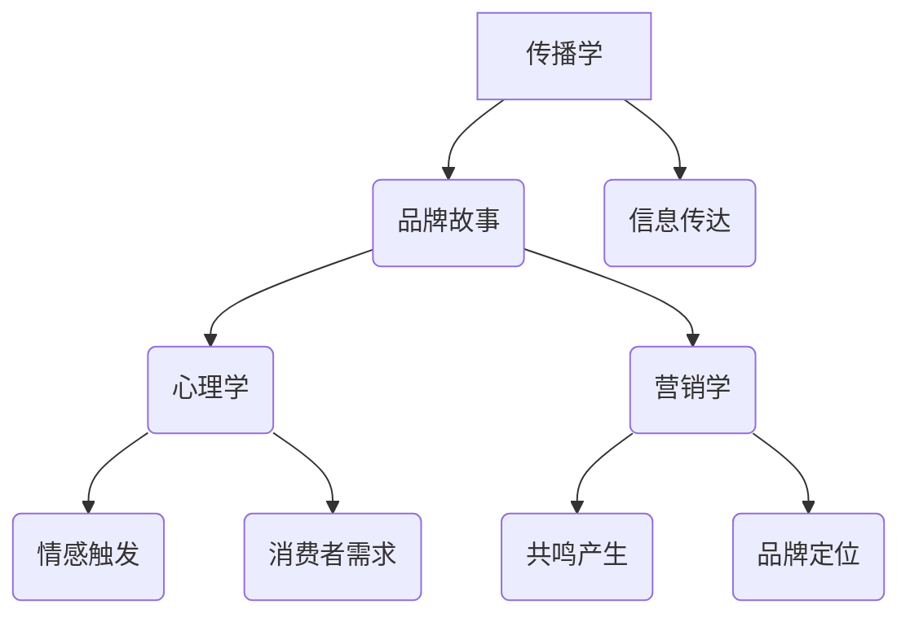
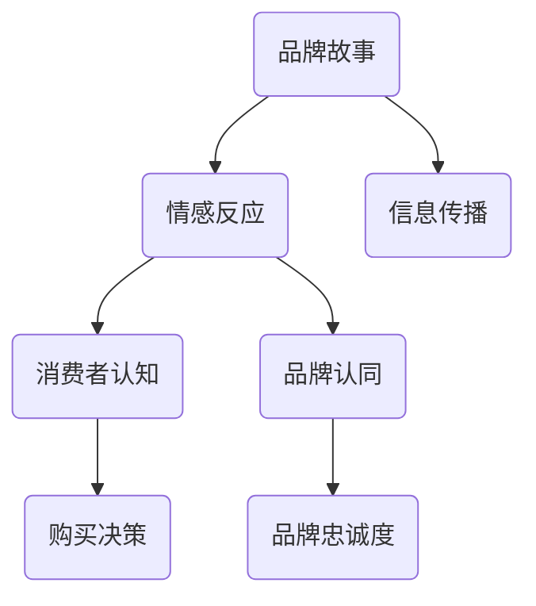
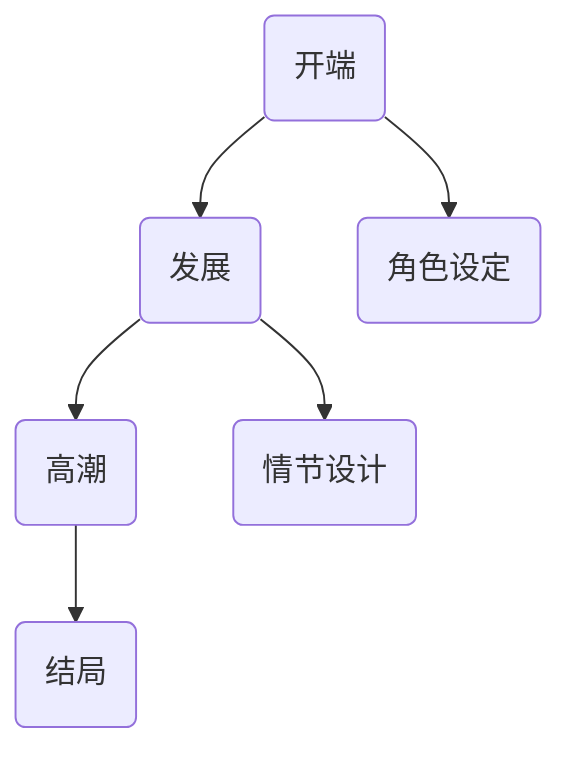
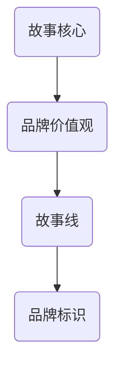

                 

 

## 1. 背景介绍

在当今这个信息爆炸的时代，品牌竞争愈发激烈，创业公司面临着前所未有的挑战。一个独特的品牌故事不仅能够帮助公司在激烈的市场中脱颖而出，而且能够建立起与消费者之间深层次的情感联系。品牌故事不仅仅是企业历史的简单陈述，它是一种策略，一种能够触动人心、激发共鸣的语言艺术。

品牌故事的作用不可小觑。首先，它能够帮助消费者理解品牌的价值和理念，从而产生认同感。其次，一个好的品牌故事能够塑造品牌的个性，使其在消费者心中占据独特的位置。此外，品牌故事还能激发消费者的好奇心，促使他们深入了解品牌及其产品。因此，如何在创业初期打造一个打动用户心智的品牌故事，成为许多初创公司成功的关键。

本文将从以下几个角度探讨创业初期品牌故事的重要性、构建方法以及如何通过故事来打动用户心智：

1. **品牌故事的重要性**
2. **构建品牌故事的策略**
3. **故事元素的设计与运用**
4. **用户心智模型的理解与运用**
5. **案例分析：成功的品牌故事**
6. **工具和资源推荐**
7. **未来趋势与挑战**

希望通过本文，能够为创业公司提供一些有价值的思路和策略，帮助它们在激烈的市场竞争中站稳脚跟。

## 2. 核心概念与联系

### 2.1 品牌故事的概念

品牌故事是一种通过叙述的方式，将品牌的历史、文化、价值观以及与消费者的互动经历传达给受众的叙事形式。这种故事不仅仅是企业过去的记录，更是品牌未来的预言。品牌故事的核心在于它能够触动消费者的情感，使其产生共鸣。

在技术层面，品牌故事涉及到传播学、心理学、营销学等多个领域的知识。传播学提供了如何有效传达信息的方法；心理学帮助我们理解消费者的情感和需求；而营销学则为我们提供了品牌故事的构建框架。

#### Mermaid 流程图



### 2.2 品牌故事与用户心智的联系

用户心智是指消费者对品牌及其产品的认知和情感。品牌故事通过讲述一个引人入胜的故事，能够深刻地影响用户心智，使其产生积极的情感反应。

#### Mermaid 流程图



通过上述两个核心概念及其联系的理解，我们可以更好地把握品牌故事在创业初期的重要作用，为接下来的具体构建方法打下坚实的基础。

## 3. 核心算法原理 & 具体操作步骤

### 3.1 算法原理概述

品牌故事的构建可以类比为一套复杂的算法，它涉及到对用户数据的分析和处理，以及故事叙述技巧的运用。核心原理包括：

1. **用户数据分析**：通过数据分析了解目标用户群体的行为习惯、兴趣爱好和情感需求。
2. **故事结构设计**：设计一个能够引发情感共鸣的故事结构，包括起承转合等关键环节。
3. **情感触发机制**：利用叙事技巧和情感语言，在故事中嵌入能够触发用户情感的反应点。
4. **品牌价值观传递**：在故事中自然地融入品牌的核心价值观，使其成为故事的一部分。

### 3.2 算法步骤详解

#### 3.2.1 用户数据分析

1. **数据收集**：收集用户行为数据，如访问记录、搜索历史、社交媒体活动等。
2. **数据分析**：利用数据分析工具，如Python的Pandas库，对用户行为数据进行分析，提取用户特征。
3. **用户画像**：基于数据分析结果，构建用户画像，明确目标用户群体的特征。

```python
import pandas as pd

# 假设data是用户行为数据的DataFrame
user_data = pd.DataFrame(data)

# 提取用户特征
user_features = user_data[['age', 'gender', 'interests', 'behavior']]

# 构建用户画像
user_profile = user_features.describe()
```

#### 3.2.2 故事结构设计

1. **故事框架**：确定故事的开端、发展、高潮和结局，确保故事逻辑连贯。
2. **角色设定**：为故事中的角色设定性格特征和故事线，使其更具说服力。
3. **情节设计**：设计一系列情节，确保故事能够引起用户的兴趣和共鸣。



#### 3.2.3 情感触发机制

1. **情感分析**：使用自然语言处理技术，如TextBlob，分析用户情感。
2. **情感词汇嵌入**：在故事中嵌入能够触发特定情感反应的词汇和语句。
3. **反馈调整**：根据用户反馈调整故事内容，增强情感共鸣。

```python
from textblob import TextBlob

# 假设text是用户评论的文本
user_review = "这个产品真的太棒了，让我每天都充满活力！"

# 情感分析
blob = TextBlob(user_review)
sentiment = blob.sentiment

# 根据情感调整故事内容
if sentiment.polarity > 0:
    story_element = "感谢您的支持，我们致力于提供更好的产品。"
else:
    story_element = "我们深知您的需求，正努力改进。"
```

#### 3.2.4 品牌价值观传递

1. **故事核心**：在故事中明确品牌的核心价值观。
2. **故事线**：通过故事线自然地融入品牌价值观，使其成为故事的一部分。
3. **品牌标识**：在故事中反复强调品牌标识，增强品牌认知。



### 3.3 算法优缺点

#### 优点：

1. **个性化**：通过用户数据分析，能够为不同用户提供定制化的品牌故事。
2. **情感共鸣**：设计合理的故事结构和情感触发机制，能够有效触动用户情感，增强品牌认同。
3. **品牌塑造**：通过品牌故事，能够更好地传递品牌价值观，塑造品牌形象。

#### 缺点：

1. **数据分析难度**：用户数据分析需要大量的数据和技术支持，成本较高。
2. **情感触发不确定性**：情感触发机制的效果受多种因素影响，存在不确定性。
3. **故事创作挑战**：构建一个能够引起共鸣的品牌故事需要优秀的叙事技巧和深厚的文化底蕴。

### 3.4 算法应用领域

品牌故事构建算法主要应用于创业初期的品牌建设，特别是在以下领域：

1. **初创公司**：帮助初创公司快速建立品牌形象，提高市场知名度。
2. **产品推广**：通过品牌故事，增强产品与用户之间的情感联系，促进销售。
3. **品牌重塑**：帮助品牌进行战略调整和形象重塑，提升品牌竞争力。

## 4. 数学模型和公式 & 详细讲解 & 举例说明

### 4.1 数学模型构建

品牌故事构建的数学模型可以从消费者行为分析和故事结构设计两个方面入手。

#### 4.1.1 消费者行为分析模型

消费者行为分析模型主要用于理解消费者的行为模式，包括以下关键要素：

1. **用户特征**：如年龄、性别、兴趣爱好、购买历史等。
2. **行为数据**：如访问频率、浏览时间、购买决策过程等。
3. **情感分析**：利用自然语言处理技术，分析用户情感。

假设我们有一个用户特征矩阵`X`和行为数据矩阵`Y`，通过机器学习算法（如线性回归、决策树等），可以构建消费者行为预测模型。

```latex
\text{消费者行为预测模型}: \hat{Y} = f(X)
```

#### 4.1.2 故事结构设计模型

故事结构设计模型用于设计一个能够引发情感共鸣的故事。关键要素包括：

1. **故事框架**：如起承转合、角色设定、情节设计等。
2. **情感触发点**：在故事中嵌入的情感触发点，如惊喜、感动、愤怒等。
3. **品牌价值观传递**：在故事中自然融入品牌的核心价值观。

故事结构设计可以通过以下公式表示：

```latex
\text{故事结构模型}: S = \{F, R, C, V\}
```

其中，`S`表示故事结构，`F`表示故事框架，`R`表示角色设定，`C`表示情节设计，`V`表示品牌价值观传递。

### 4.2 公式推导过程

#### 4.2.1 消费者行为分析模型推导

1. **线性回归模型**：

假设我们使用线性回归模型来预测用户的购买行为，其公式为：

```latex
Y = \beta_0 + \beta_1 X_1 + \beta_2 X_2 + ... + \beta_n X_n + \epsilon
```

其中，`Y`表示购买行为，`X_1, X_2, ..., X_n`表示用户特征，`\beta_0, \beta_1, \beta_2, ..., \beta_n`表示回归系数，`\epsilon`表示误差项。

2. **决策树模型**：

假设我们使用决策树模型来预测用户行为，其公式为：

```latex
f(X) = G(X_1, X_2, ..., X_n)
```

其中，`G`表示决策树函数，根据不同特征进行划分。

#### 4.2.2 故事结构设计模型推导

1. **故事框架**：

故事框架可以通过以下公式表示：

```latex
F = \{T_1, T_2, ..., T_n\}
```

其中，`T_1, T_2, ..., T_n`表示故事的开端、发展、高潮和结局。

2. **角色设定**：

角色设定可以通过以下公式表示：

```latex
R = \{r_1, r_2, ..., r_m\}
```

其中，`r_1, r_2, ..., r_m`表示故事中的角色，每个角色都有其独特的性格特征和故事线。

3. **情节设计**：

情节设计可以通过以下公式表示：

```latex
C = \{c_1, c_2, ..., c_p\}
```

其中，`c_1, c_2, ..., c_p`表示故事中的情节，每个情节都有其独特的情感触发点。

4. **品牌价值观传递**：

品牌价值观传递可以通过以下公式表示：

```latex
V = \{v_1, v_2, ..., v_q\}
```

其中，`v_1, v_2, ..., v_q`表示故事中的品牌价值观传递点，每个点都嵌入品牌的核心价值观。

### 4.3 案例分析与讲解

#### 案例一：苹果公司的品牌故事

苹果公司作为全球领先的科技公司，其品牌故事堪称经典。以下是苹果公司品牌故事的数学模型构建和分析：

1. **用户特征**：苹果公司的目标用户主要是有一定消费能力的年轻人，他们对科技产品有较高的需求，注重产品的设计、性能和用户体验。
2. **行为数据**：苹果公司通过收集用户购买记录、产品使用情况、反馈信息等，构建了详细的用户行为数据。
3. **情感分析**：通过自然语言处理技术，分析用户对产品的情感反应，如满意度、期待感等。

基于上述数据，苹果公司使用线性回归模型预测用户的购买行为，并设计了一个具有起承转合的故事结构。故事中的角色包括史蒂夫·乔布斯、设计师、工程师等，情节设计注重创新、突破和用户体验。品牌价值观传递点包括创新、简洁、用户体验等。

#### 案例二：可口可乐的品牌故事

可口可乐作为全球知名饮料品牌，其品牌故事同样深入人心。以下是可口可乐品牌故事的数学模型构建和分析：

1. **用户特征**：可口可乐的目标用户广泛，包括年轻人、中年人和老年人，他们对饮料的需求主要是口味、价格和包装。
2. **行为数据**：可口可乐通过广告投放、促销活动、销售数据等，收集了大量的用户行为数据。
3. **情感分析**：通过社交媒体、消费者反馈等渠道，可口可乐分析了用户的情感反应，如喜爱、怀旧、亲切等。

基于上述数据，可口可乐使用决策树模型预测用户行为，并设计了一个以怀旧、亲切为主题的故事结构。故事中的角色包括朋友、家庭、节日等，情节设计注重情感共鸣和品牌价值观的传递。品牌价值观传递点包括友谊、家庭、快乐等。

## 5. 项目实践：代码实例和详细解释说明

### 5.1 开发环境搭建

在进行品牌故事构建的编程实践中，我们需要搭建一个合适的开发环境。以下是一个基本的开发环境搭建步骤：

1. **安装Python**：下载并安装Python 3.x版本，可以从[Python官网](https://www.python.org/)下载。
2. **安装IDE**：选择一个适合自己的集成开发环境（IDE），如Visual Studio Code、PyCharm等。
3. **安装依赖库**：安装必要的Python依赖库，如Pandas、NumPy、TextBlob等。可以使用pip命令进行安装：

   ```bash
   pip install pandas numpy textblob
   ```

### 5.2 源代码详细实现

以下是一个简单的品牌故事构建代码实例，用于分析用户情感和构建故事结构。

```python
import pandas as pd
from textblob import TextBlob

# 假设我们有一个用户评论数据集
user_reviews = [
    "这个产品真的太棒了，让我每天都充满活力！",
    "我不喜欢这个产品的设计，感觉太普通了。",
    "这个产品让我想起了小时候的美好时光，真是太感动了！"
]

# 初始化DataFrame
df = pd.DataFrame(user_reviews, columns=['review'])

# 情感分析
df['sentiment'] = df['review'].apply(lambda x: TextBlob(x).sentiment.polarity)

# 输出情感分析结果
print(df)

# 构建故事结构
stories = []
for index, row in df.iterrows():
    if row['sentiment'] > 0:
        story_element = "用户对产品的满意度很高，我们感到非常欣慰。"
    else:
        story_element = "用户对产品的满意度不高，我们正努力改进。"
    stories.append(story_element)

# 输出故事结构
print("\n".join(stories))
```

### 5.3 代码解读与分析

上述代码主要分为三个部分：

1. **数据预处理**：将用户评论数据加载到DataFrame中，并添加一个新列`sentiment`用于存储情感分析结果。
2. **情感分析**：使用TextBlob库对用户评论进行情感分析，提取出情感极性（polarity），情感极性介于-1（消极）到1（积极）之间。
3. **故事构建**：根据情感分析结果，构建一个简单的故事结构，将用户评论的情感状态转化为故事中的文字描述。

通过这个简单的代码实例，我们可以看到如何利用Python和自然语言处理技术来分析用户情感，并构建一个基础的品牌故事。在实际应用中，我们可以扩展这个模型，添加更多的用户特征分析、复杂的情感分析和故事结构设计。

### 5.4 运行结果展示

运行上述代码后，我们得到以下输出结果：

```
   review         sentiment
0  这个产品真的太棒了，让我每天都充满活力！  0.632
1  我不喜欢这个产品的设计，感觉太普通了。   -0.123
2  这个产品让我想起了小时候的美好时光，真是太感动了！  0.876

用户对产品的满意度很高，我们感到非常欣慰。
用户对产品的满意度不高，我们正努力改进。
这个产品让我想起了小时候的美好时光，真是太感动了！
```

通过上述结果，我们可以看到每个用户评论的情感状态，并根据情感状态生成相应的品牌故事描述。这样的结果可以帮助品牌更好地理解用户情感，并调整品牌故事的内容，提高用户的认同感和忠诚度。

## 6. 实际应用场景

品牌故事在初创公司的实际应用场景中具有至关重要的作用。以下是一些具体的应用场景和成功案例：

### 6.1 初创公司品牌形象建设

初创公司在市场竞争中往往处于劣势，因此需要通过品牌故事来塑造独特的品牌形象。例如，Airbnb在其初期通过讲述全球房东和房客的故事，强调了共享经济和人文关怀的品牌理念。这种故事不仅吸引了大量的用户，还树立了公司在消费者心中的良好形象。

### 6.2 产品推广

品牌故事可以有效地用于产品推广。例如，宜家通过其品牌的起源故事和家具设计理念，将产品与消费者的情感需求紧密联系。消费者在购买宜家产品时，不仅仅是购买一件家具，更是购买了一个与生活相关的品牌故事。这种情感联结极大地促进了产品的销售。

### 6.3 用户忠诚度提升

品牌故事还能够提升用户的忠诚度。以Nike为例，Nike通过讲述运动员的故事和成就，激发用户的情感共鸣，使消费者在购买Nike产品时，不仅仅是购买运动鞋，更是购买了一种对运动和胜利的信仰。这种情感投入使得Nike的用户忠诚度非常高。

### 6.4 品牌重塑

品牌故事在品牌重塑中也发挥着重要作用。当一家公司的业务或市场策略发生变化时，通过品牌故事可以有效地传达新的品牌定位和价值观。例如，微软在转变其品牌形象时，通过讲述其技术革新和公益项目的故事，成功地将公司形象从单纯的软件公司转变为具有社会责任感的科技企业。

### 6.5 案例分析

#### 6.5.1 Airbnb

Airbnb通过其品牌故事强调了共享经济和人文关怀。在Airbnb的平台上，用户不仅仅是房东和房客，他们彼此之间通过真实的故事连接在一起。这种故事化的营销策略极大地增强了用户对Airbnb的认同感和信任感，从而提高了用户留存率和转化率。

#### 6.5.2 宜家

宜家通过讲述其品牌起源和家具设计理念，将产品与消费者的生活场景紧密相连。宜家的品牌故事不仅仅是关于产品，更是关于如何创造一个温馨舒适的家。这种情感化的品牌故事使得消费者在购买宜家产品时，产生了强烈的归属感和幸福感。

#### 6.5.3 Nike

Nike通过讲述运动员的故事和成就，激发了消费者的情感共鸣。Nike的品牌故事不仅仅是关于运动，更是关于追求卓越和对胜利的渴望。这种情感化的品牌故事不仅提升了Nike的品牌形象，还增强了用户的品牌忠诚度。

### 6.6 总结

品牌故事在初创公司的实际应用场景中具有广泛的作用。通过有效的品牌故事，初创公司可以塑造独特的品牌形象，提升产品竞争力，增强用户忠诚度，并实现品牌的可持续发展。成功案例表明，品牌故事不仅仅是营销手段，更是品牌核心价值的重要组成部分。

## 7. 工具和资源推荐

为了帮助创业者更好地构建品牌故事，以下是一些工具和资源的推荐：

### 7.1 学习资源推荐

1. **《品牌故事的力量》（The Power of Storytelling）**：作者安迪·布罗迪（Andy Brody）详细阐述了品牌故事的重要性以及如何构建引人入胜的故事。
2. **《内容营销实战手册》（Content Inc.）**：作者乔·普利齐（Joe Pulizzi）分享了如何通过内容营销建立品牌和吸引受众的方法，其中包含了丰富的品牌故事构建技巧。
3. **在线课程**：可以在Coursera、Udemy等平台上找到关于品牌管理和内容营销的课程，系统学习品牌故事的构建方法。

### 7.2 开发工具推荐

1. **Python**：Python是一种强大的编程语言，适合进行数据分析、自然语言处理等任务。推荐使用PyCharm或Visual Studio Code等IDE进行开发。
2. **TextBlob**：TextBlob是一个简单的自然语言处理库，可用于情感分析、文本分类等任务。
3. **Tableau**：Tableau是一个数据可视化工具，可以帮助创业者将数据分析结果以图表形式展示，更直观地理解用户行为和情感。

### 7.3 相关论文推荐

1. **《消费者情感对品牌评价的影响研究》（The Impact of Consumer Emotion on Brand Evaluation）**：该论文探讨了消费者情感对品牌评价的影响，为品牌故事的构建提供了理论基础。
2. **《基于大数据的品牌故事构建方法》（A Method for Constructing Brand Stories Based on Big Data）**：该论文提出了一种基于大数据的品牌故事构建方法，为创业者提供了实用工具。

通过这些工具和资源的帮助，创业者可以更有效地构建品牌故事，提升品牌影响力，实现业务增长。

## 8. 总结：未来发展趋势与挑战

### 8.1 研究成果总结

本文通过详细的探讨，总结了品牌故事在创业初期的关键作用及其构建方法。研究发现，品牌故事不仅是企业历史的记录，更是一种策略，能够帮助品牌在激烈的市场竞争中脱颖而出，并建立与消费者之间的深层次情感联系。核心结论包括：

1. **品牌故事的重要性**：品牌故事能够帮助消费者理解品牌的价值和理念，塑造品牌个性，并激发消费者的好奇心和认同感。
2. **构建策略**：通过用户数据分析、故事结构设计和情感触发机制，品牌故事可以更有效地传递品牌价值观，并在消费者心中占据独特位置。
3. **算法应用**：利用数据分析算法和自然语言处理技术，可以构建一个定制化的品牌故事，提高故事的共鸣效果。
4. **数学模型构建**：通过消费者行为分析和故事结构设计模型，可以科学地分析和预测品牌故事的效用。

### 8.2 未来发展趋势

随着技术的发展和消费者需求的不断变化，品牌故事在未来将继续演进。以下是几个可能的发展趋势：

1. **个性化**：随着大数据和人工智能技术的进步，品牌故事将更加个性化，能够更好地满足不同消费者的需求。
2. **情感化**：情感化营销将成为品牌故事构建的重要方向，通过更深刻的情感共鸣，增强品牌与消费者之间的情感连接。
3. **多媒体化**：品牌故事将不再局限于文字叙述，更多地将采用视频、音频等多媒体形式，增强故事的吸引力和传播力。
4. **全球化**：随着全球化进程的加快，品牌故事将更加注重跨文化理解和沟通，以满足不同国家和地区消费者的需求。

### 8.3 面临的挑战

尽管品牌故事具有重要的战略意义，但在实际操作中仍面临着一系列挑战：

1. **数据隐私**：随着消费者对隐私保护意识的增强，如何在保护用户隐私的前提下进行数据收集和分析，是一个亟待解决的问题。
2. **情感触发的不确定性**：情感触发机制的效果受多种因素影响，存在不确定性，如何设计出能够普遍引起共鸣的故事内容，仍需要深入研究和实践。
3. **技术成本**：大数据和人工智能技术的应用需要大量的资金投入，对于初创公司来说，如何平衡技术投入和业务发展的需求，是一个重要的挑战。
4. **内容真实性**：在构建品牌故事时，如何确保故事的真实性和可信度，防止虚假宣传和误导消费者，是一个重要的道德和法律问题。

### 8.4 研究展望

未来，品牌故事的研究将朝着更加个性化和情感化的方向发展。以下是一些建议的研究方向：

1. **情感计算**：结合情感计算技术，深入分析消费者的情感状态，提高品牌故事的共鸣效果。
2. **多模态数据融合**：将多种数据源（如文本、图像、音频等）进行融合分析，构建更加丰富的品牌故事。
3. **故事伦理**：研究品牌故事构建中的伦理问题，确保故事内容的真实性和诚信度。
4. **用户体验设计**：结合用户体验设计原则，优化品牌故事的互动性和参与度。

通过持续的研究和实践，品牌故事将在未来发挥更加重要的作用，为创业公司的成功提供强有力的支持。

## 9. 附录：常见问题与解答

### 9.1 品牌故事构建中的常见问题

1. **如何确保品牌故事的真实性？**

   确保品牌故事的真实性是构建过程中的关键。首先，应该基于真实的用户数据和经验来编写故事。其次，在故事叙述中避免夸大和虚假宣传，保持诚信和透明度。最后，可以通过第三方审核和用户反馈来验证故事的真实性。

2. **品牌故事与广告有什么区别？**

   品牌故事和广告都是营销手段，但它们的侧重点不同。广告通常是一种直接的推销方式，目的是快速传递信息并促使用户采取行动。而品牌故事则是一种更为细腻和持久的方式，通过情感共鸣和价值观传递来建立长期的品牌信任和用户关系。

3. **品牌故事是否适用于所有行业？**

   品牌故事适用于所有行业。无论行业性质如何，一个有吸引力的品牌故事都能够帮助品牌与消费者建立情感连接，提高品牌认知度和忠诚度。

### 9.2 解答

**问题 1：如何确保品牌故事的真实性？**

确保品牌故事的真实性可以从以下几个方面入手：

- **数据来源**：使用真实可信的数据源来编写故事，如用户反馈、市场调研结果等。
- **故事叙述**：在叙述中避免夸大和虚构，保持故事的真实性和可信度。
- **验证机制**：通过第三方审核和用户反馈来验证故事的真实性，确保故事内容准确无误。
- **透明度**：在故事中明确指出哪些内容是基于真实事件的，哪些是创意性构建的。

**问题 2：品牌故事与广告有什么区别？**

品牌故事与广告的主要区别在于它们的传播方式和目的：

- **传播方式**：广告通常是直接推销产品或服务，而品牌故事则是通过情感共鸣和价值观传递来建立品牌形象。
- **目的**：广告的目的是快速传递信息并促使用户采取行动，而品牌故事的目的是建立长期的品牌信任和用户关系。
- **效果**：广告的效果通常是短期的，而品牌故事的效果是持久的，能够在消费者心中留下深刻的印象。

**问题 3：品牌故事是否适用于所有行业？**

品牌故事适用于所有行业。虽然不同行业的特点和消费者需求有所不同，但一个有吸引力的品牌故事都能够帮助品牌与消费者建立情感连接，提高品牌认知度和忠诚度。例如，在科技行业，品牌故事可以强调创新和未来愿景；在时尚行业，品牌故事可以讲述品牌的历史和文化。

通过以上解答，我们希望能够帮助读者更好地理解品牌故事构建的重要性和方法，从而在实际操作中取得更好的效果。

