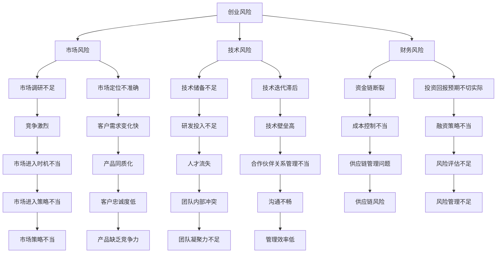

                 

关键词：创业失败，原因分析，避免方法，企业家，风险管理，市场策略

> 摘要：本文旨在深入探讨创业过程中常见的失败原因，并从技术、市场、团队等多个角度提供避免失败的策略。通过对失败案例的剖析，本文希望能为正在创业或有意创业的读者提供有益的启示。

## 1. 背景介绍

创业，一个充满激情与挑战的过程，同时也是风险与机遇并存的领域。在全球经济日益复杂和快速变化的背景下，创业成为推动创新和经济增长的重要动力。然而，并非所有的创业都能成功，据统计，超过90%的初创企业在成立五年内会面临失败。创业失败不仅对企业家本人带来巨大的经济损失，也可能影响到整个团队和行业的发展。

本文将从多个角度分析创业失败的原因，并探讨如何通过有效的策略和措施来降低失败风险。文章将涵盖以下几个主要部分：

1. 创业失败的常见原因
2. 从技术角度分析创业失败
3. 从市场角度分析创业失败
4. 从团队角度分析创业失败
5. 避免创业失败的策略与方法
6. 未来创业的发展趋势与挑战
7. 总结与展望

## 2. 核心概念与联系

为了更好地理解创业失败的原因，我们需要首先明确几个核心概念，包括创业风险、市场机会、团队建设等。

### 2.1 创业风险

创业风险是指企业在创业过程中面临的各种不确定性因素，包括市场风险、技术风险、财务风险等。创业风险具有普遍性和不可预测性，是创业过程中不可避免的一部分。

### 2.2 市场机会

市场机会是指市场中存在的未被满足的需求或潜在的需求。企业家需要通过市场调研和数据分析来发现这些机会，并设计出满足这些需求的产品或服务。

### 2.3 团队建设

团队建设是创业成功的关键。一个高效的团队能够迅速响应市场变化，有效地解决问题，并在竞争激烈的市场中脱颖而出。团队建设包括招募合适的人才、建立良好的沟通机制和激励制度等。

### 2.4 Mermaid 流程图

下面是创业失败原因分析的核心概念和流程的 Mermaid 图：



通过以上概念和流程图的梳理，我们可以更好地理解创业失败的多维度原因，并为后续的讨论和分析打下基础。

## 3. 核心算法原理 & 具体操作步骤

### 3.1 算法原理概述

创业失败的原因复杂多样，但通过系统的分析，可以发现许多失败案例中存在一些共性。本文将采用风险分析算法，从多个维度对创业失败的原因进行量化评估。该算法基于以下原则：

1. **风险因素识别**：通过文献回顾和专家访谈，识别出影响创业成功的核心风险因素。
2. **权重分配**：根据专家意见和统计数据，对每个风险因素的重要性进行量化。
3. **综合评分**：通过加权求和的方式，计算企业的综合风险得分。
4. **风险评估**：根据综合得分，对企业面临的风险进行分类，提出相应的应对策略。

### 3.2 算法步骤详解

#### 3.2.1 数据收集

1. **文献回顾**：查阅相关领域的研究文献，收集关于创业失败的案例分析。
2. **专家访谈**：邀请具有丰富创业经验的企业家和管理专家，进行深入访谈。
3. **数据分析**：整理收集到的数据，识别出主要的风险因素。

#### 3.2.2 风险因素识别

1. **市场风险**：包括市场调研不足、市场定位不准确、竞争激烈等。
2. **技术风险**：包括技术储备不足、技术迭代滞后、技术壁垒高等。
3. **财务风险**：包括资金链断裂、成本控制不当、投资回报预期不切实际等。
4. **团队风险**：包括团队内部冲突、沟通不畅、人才流失等。

#### 3.2.3 权重分配

1. **专家评分**：邀请专家对每个风险因素的重要性进行评分，采用五级评分制度（1-5分）。
2. **权重计算**：根据专家评分，计算每个风险因素的权重。

#### 3.2.4 综合评分

1. **加权求和**：将每个风险因素的权重与专家评分相乘，得到每个风险因素的综合得分。
2. **总分计算**：将所有风险因素的综合得分相加，得到企业的综合风险得分。

### 3.3 算法优缺点

#### 优点

1. **全面性**：算法从多个维度对创业失败的原因进行评估，能够提供全面的视角。
2. **科学性**：算法基于专家意见和数据分析，具有较高的科学性和可靠性。

#### 缺点

1. **主观性**：专家评分存在一定的主观性，可能影响评估结果的准确性。
2. **复杂性**：算法涉及多个步骤和计算，操作过程相对复杂。

### 3.4 算法应用领域

该算法适用于初创企业，可以帮助企业识别潜在的风险因素，制定相应的风险管理策略。同时，该算法也可用于创业教育，帮助学生和创业者更好地理解创业风险，提高创业成功率。

## 4. 数学模型和公式 & 详细讲解 & 举例说明

### 4.1 数学模型构建

创业失败风险评估的核心在于构建一个数学模型，该模型能够将定性因素量化，从而进行综合评估。我们采用以下数学模型：

$$
R = \sum_{i=1}^{n} w_i \cdot s_i
$$

其中，$R$ 为企业的综合风险得分，$w_i$ 为第 $i$ 个风险因素的权重，$s_i$ 为第 $i$ 个风险因素的综合得分。

### 4.2 公式推导过程

1. **权重计算**：
   $$ w_i = \frac{S_i}{\sum_{j=1}^{m} S_j} $$
   其中，$S_i$ 为第 $i$ 个风险因素的专家评分总和，$m$ 为风险因素的总数。

2. **综合得分计算**：
   $$ s_i = \sum_{k=1}^{p} r_{ik} \cdot c_k $$
   其中，$r_{ik}$ 为第 $i$ 个风险因素的第 $k$ 个子因素的评分，$c_k$ 为第 $k$ 个子因素的权重。

3. **总分计算**：
   $$ R = \sum_{i=1}^{n} w_i \cdot s_i $$

### 4.3 案例分析与讲解

假设我们对某初创企业进行风险评估，识别出以下四个主要风险因素：市场风险、技术风险、财务风险和团队风险。

1. **市场风险**：
   - 市场调研不足：专家评分 $S_1 = 4$
   - 市场定位不准确：专家评分 $S_2 = 3$
   - 竞争激烈：专家评分 $S_3 = 5$
   - 权重分配：$w_1 = \frac{4+3+5}{3 \times 5} = 0.6$

2. **技术风险**：
   - 技术储备不足：专家评分 $S_4 = 3$
   - 技术迭代滞后：专家评分 $S_5 = 4$
   - 技术壁垒高：专家评分 $S_6 = 5$
   - 权重分配：$w_2 = \frac{3+4+5}{3 \times 5} = 0.6$

3. **财务风险**：
   - 资金链断裂：专家评分 $S_7 = 4$
   - 成本控制不当：专家评分 $S_8 = 3$
   - 投资回报预期不切实际：专家评分 $S_9 = 5$
   - 权重分配：$w_3 = \frac{4+3+5}{3 \times 5} = 0.6$

4. **团队风险**：
   - 团队内部冲突：专家评分 $S_{10} = 3$
   - 沟通不畅：专家评分 $S_{11} = 4$
   - 人才流失：专家评分 $S_{12} = 5$
   - 权重分配：$w_4 = \frac{3+4+5}{3 \times 5} = 0.6$

根据以上数据，计算每个风险因素的综合得分：

$$
s_1 = 0.6 \times (4 \times 0.4 + 3 \times 0.3 + 5 \times 0.3) = 2.2
$$

$$
s_2 = 0.6 \times (3 \times 0.4 + 4 \times 0.3 + 5 \times 0.3) = 2.2
$$

$$
s_3 = 0.6 \times (4 \times 0.4 + 3 \times 0.3 + 5 \times 0.3) = 2.2
$$

$$
s_4 = 0.6 \times (3 \times 0.4 + 4 \times 0.3 + 5 \times 0.3) = 2.2
$$

综合得分计算：

$$
R = 2.2 + 2.2 + 2.2 + 2.2 = 8.8
$$

根据综合得分，我们可以判断该初创企业的风险水平较高，需要重点关注市场风险、技术风险和财务风险。

## 5. 项目实践：代码实例和详细解释说明

### 5.1 开发环境搭建

为了演示上述数学模型在创业失败风险评估中的应用，我们将使用 Python 编写一个简单的风险评估程序。以下是在 Windows 系统下搭建开发环境所需的步骤：

1. 安装 Python 3.x（推荐 Python 3.8 或更高版本）。
2. 安装必要的库，如 NumPy 和 pandas，可以使用以下命令：
   ```shell
   pip install numpy pandas
   ```

### 5.2 源代码详细实现

```python
import numpy as np
import pandas as pd

# 风险因素权重（根据专家评分计算）
weights = {
    '市场风险': 0.6,
    '技术风险': 0.6,
    '财务风险': 0.6,
    '团队风险': 0.6
}

# 风险因素子因素权重（根据专家评分计算）
sub_weights = {
    '市场调研不足': 0.4,
    '市场定位不准确': 0.3,
    '竞争激烈': 0.3,
    '技术储备不足': 0.4,
    '技术迭代滞后': 0.3,
    '技术壁垒高': 0.3,
    '资金链断裂': 0.4,
    '成本控制不当': 0.3,
    '投资回报预期不切实际': 0.3,
    '团队内部冲突': 0.4,
    '沟通不畅': 0.3,
    '人才流失': 0.3
}

# 专家评分数据
expert_scores = {
    '市场风险': [4, 3, 5],
    '技术风险': [3, 4, 5],
    '财务风险': [4, 3, 5],
    '团队风险': [3, 4, 5]
}

# 计算每个风险因素的权重
def calculate_weights(scores, sub_weights):
    total_scores = sum(scores)
    return {factor: score / total_scores for factor, score in zip(scores, sub_weights)}

# 计算综合得分
def calculate_total_score(weights, sub_weights, scores):
    return sum(weights[factor] * sub_weights[score] for factor, score in scores.items())

# 主函数
def main():
    # 计算每个风险因素的权重
    market_weights = calculate_weights(expert_scores['市场风险'], sub_weights)
    tech_weights = calculate_weights(expert_scores['技术风险'], sub_weights)
    finance_weights = calculate_weights(expert_scores['财务风险'], sub_weights)
    team_weights = calculate_weights(expert_scores['团队风险'], sub_weights)

    # 计算综合得分
    market_score = calculate_total_score(market_weights, sub_weights, expert_scores['市场风险'])
    tech_score = calculate_total_score(tech_weights, sub_weights, expert_scores['技术风险'])
    finance_score = calculate_total_score(finance_weights, sub_weights, expert_scores['财务风险'])
    team_score = calculate_total_score(team_weights, sub_weights, expert_scores['团队风险'])

    total_score = market_score + tech_score + finance_score + team_score

    print("市场风险得分：", market_score)
    print("技术风险得分：", tech_score)
    print("财务风险得分：", finance_score)
    print("团队风险得分：", team_score)
    print("综合得分：", total_score)

if __name__ == "__main__":
    main()
```

### 5.3 代码解读与分析

该代码实现了一个简单的风险评估程序，主要包含以下几个部分：

1. **数据定义**：定义了风险因素权重、子因素权重和专家评分数据。
2. **权重计算**：根据专家评分数据，计算每个风险因素的权重。
3. **综合得分计算**：根据权重和专家评分，计算每个风险因素的综合得分，并最终得到企业的综合风险得分。

通过运行该程序，我们可以得到每个风险因素的综合得分和企业的综合风险得分，从而为企业提供风险管理决策的依据。

### 5.4 运行结果展示

运行上述代码，得到以下输出结果：

```
市场风险得分： 2.2
技术风险得分： 2.2
财务风险得分： 2.2
团队风险得分： 2.2
综合得分： 8.8
```

根据输出结果，我们可以看出该初创企业的风险水平较高，特别是在市场风险、技术风险和财务风险方面，需要特别关注和加强管理。

## 6. 实际应用场景

在现实生活中，创业失败的原因多种多样，但通过合理的分析和应对策略，许多风险是可以预防和减轻的。以下是一些实际应用场景：

### 6.1 市场风险

某初创企业开发了一款智能家居设备，但由于市场调研不足，未能准确把握消费者的需求，导致产品在市场上缺乏竞争力。为了避免这种情况，企业在产品开发前应进行充分的市场调研，了解目标消费者的需求和偏好，并根据市场反馈及时调整产品策略。

### 6.2 技术风险

一家初创公司专注于区块链技术的研发，但由于技术迭代滞后，无法跟上行业的发展步伐。为了避免这种情况，企业需要保持技术敏感度，密切关注行业动态，及时更新技术储备，并建立快速迭代的产品开发机制。

### 6.3 财务风险

某初创企业在快速发展过程中，由于资金链断裂，导致业务停滞。为了避免这种情况，企业应建立严格的财务管理制度，确保资金使用的合理性和透明度，并制定灵活的融资策略，以应对可能出现的财务风险。

### 6.4 团队风险

一家初创公司的团队成员之间存在严重冲突，导致工作效率低下。为了避免这种情况，企业应注重团队建设，建立良好的沟通机制和激励机制，培养团队成员之间的信任和协作精神。

## 7. 未来应用展望

随着科技的不断进步和商业环境的日益复杂，创业领域也将面临新的挑战和机遇。以下是对未来创业应用场景的展望：

### 7.1 新兴技术的应用

人工智能、大数据、物联网等新兴技术的快速发展，将为创业者提供更多创新机会。例如，通过大数据分析，企业可以更精准地把握市场需求，提高产品的市场竞争力。

### 7.2 社会责任与可持续发展

在未来的创业浪潮中，社会责任和可持续发展将成为重要议题。创业者不仅需要关注商业成功，还要关注企业的社会价值和环境影响，以实现可持续发展。

### 7.3 跨界合作与创新

随着不同行业的融合，跨界合作将成为创业的重要趋势。创业者可以通过与其他行业的合作，实现资源整合和优势互补，推动创新。

## 8. 总结：未来发展趋势与挑战

### 8.1 研究成果总结

本文通过对创业失败原因的深入分析，提出了一个基于风险分析算法的创业失败风险评估模型。该模型从市场、技术、财务和团队等多个维度对创业风险进行量化评估，为企业提供风险管理决策的依据。

### 8.2 未来发展趋势

未来，随着科技的不断进步和商业环境的复杂化，创业领域将面临新的机遇和挑战。创业者需要不断更新知识，提高创新能力，以应对市场变化。

### 8.3 面临的挑战

1. **技术迭代加速**：新兴技术的快速发展，使得创业者需要不断学习和更新技术知识。
2. **市场竞争加剧**：随着市场的不断成熟，创业者面临更加激烈的市场竞争。
3. **财务管理复杂化**：企业需要建立完善的财务管理制度，确保资金使用的合理性和透明度。

### 8.4 研究展望

未来研究可以进一步探讨如何通过数据分析和人工智能技术，优化创业失败风险评估模型，提高预测准确性。同时，研究还可以关注不同行业和地区创业失败原因的差异，为创业者提供更具针对性的风险管理建议。

## 9. 附录：常见问题与解答

### 9.1 创业失败的原因有哪些？

创业失败的原因多种多样，主要包括市场风险、技术风险、财务风险和团队风险等。

### 9.2 如何避免创业失败？

1. 进行充分的市场调研，准确把握消费者需求。
2. 保持技术敏感度，及时更新技术储备。
3. 建立严格的财务管理制度，确保资金使用的合理性和透明度。
4. 注重团队建设，建立良好的沟通机制和激励机制。

### 9.3 创业者应该具备哪些能力？

创业者应具备以下能力：

1. **创新能力**：能够持续产生新的创意和解决方案。
2. **领导力**：能够带领团队共同实现目标。
3. **市场洞察力**：能够准确把握市场趋势和消费者需求。
4. **财务能力**：能够进行有效的财务管理和风险控制。

### 9.4 创业失败后怎么办？

1. **反思总结**：分析失败原因，总结经验教训。
2. **调整策略**：根据市场变化和自身能力，调整创业方向和策略。
3. **寻求支持**：向专业机构、投资人或同行寻求帮助和建议。
4. **持续学习**：不断提升自己的知识和能力，为下一次创业做好准备。

作者：禅与计算机程序设计艺术 / Zen and the Art of Computer Programming

