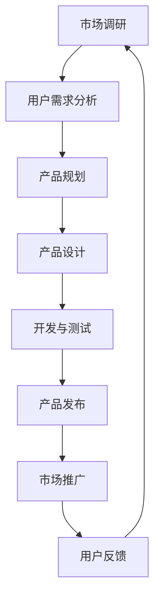

                 

关键词：市场营销、产品管理、创业、战略规划、用户调研、数据分析、产品迭代、品牌建设

> 摘要：本文深入探讨创业过程中的市场营销和产品管理技能，分析了如何通过有效的市场调研、数据分析、产品规划和品牌建设，构建成功的创业项目。文章旨在为创业者提供一套完整的策略框架，帮助他们从零开始，逐步迈向成功的商业之路。

## 1. 背景介绍

创业是一个充满挑战与机遇的过程。在竞争激烈的市场中，创业者不仅要拥有出色的技术能力，还需要掌握市场营销和产品管理的核心技能。这两大领域直接关系到创业项目的生死存亡。市场营销决定了产品如何被市场接受，产品管理则确保了产品的持续创新和迭代。

### 1.1 市场营销

市场营销是企业通过推广、宣传和销售等活动，将产品或服务传递给目标客户的过程。有效的市场营销策略能够帮助企业提高品牌知名度、吸引潜在客户、增加销售额。

### 1.2 产品管理

产品管理是确保产品从构思到上市的全过程都符合市场需求和用户期望的过程。它包括市场调研、需求分析、产品设计、开发、测试和发布等环节。

### 1.3 市场营销与产品管理的联系

市场营销和产品管理紧密相连，互为支撑。市场营销为产品管理提供了市场数据和用户反馈，而产品管理则为市场营销提供了有竞争力的产品。只有两者协同工作，才能确保产品在市场上获得成功。

## 2. 核心概念与联系

下面是一个关于市场营销和产品管理的核心概念和联系的Mermaid流程图：



### 2.1 市场调研

市场调研是市场营销和产品管理的起点。通过对市场趋势、竞争对手、目标用户群体进行深入研究，企业可以获取宝贵的信息，为后续的产品规划和营销策略提供依据。

### 2.2 用户需求分析

用户需求分析是产品管理的核心环节。通过分析用户需求和行为模式，企业可以确定产品的核心功能和特点，确保产品能够满足用户的需求。

### 2.3 产品规划

产品规划是将市场需求转化为具体产品特征的过程。在这个阶段，企业需要制定详细的产品路线图，包括产品功能、技术要求、时间表和预算等。

### 2.4 产品设计

产品设计是将产品规划转化为实际产品的过程。这个阶段需要关注用户体验、界面设计和交互流程，确保产品在功能性和易用性上达到最佳状态。

### 2.5 开发与测试

开发与测试是产品从概念到实物的关键阶段。通过迭代开发，企业可以不断改进产品，确保最终产品的质量。

### 2.6 产品发布

产品发布是市场营销的开始。在这个阶段，企业需要制定全面的推广策略，包括广告、促销和公关活动，以提高产品的市场占有率。

### 2.7 市场推广

市场推广是市场营销的核心。通过多种渠道和手段，企业可以将产品信息传递给目标用户，提高品牌知名度和销售额。

### 2.8 用户反馈

用户反馈是产品管理的重要组成部分。通过收集和分析用户反馈，企业可以不断优化产品，提高用户满意度。

## 3. 核心算法原理 & 具体操作步骤

### 3.1 算法原理概述

市场营销和产品管理涉及多种算法和技术，包括数据分析、机器学习、用户行为分析等。以下是一个简单的算法原理概述：

### 3.2 算法步骤详解

1. **市场调研**：通过问卷调查、访谈和数据分析，收集市场信息。
2. **用户需求分析**：使用聚类分析、回归分析等方法，分析用户需求和行为模式。
3. **产品规划**：制定产品路线图，包括产品功能、技术要求、时间表和预算。
4. **产品设计**：进行用户体验设计、界面设计和交互流程设计。
5. **开发与测试**：使用敏捷开发、测试驱动开发等方法，不断优化产品。
6. **产品发布**：制定市场推广策略，进行广告、促销和公关活动。
7. **市场推广**：使用搜索引擎优化、社交媒体营销等方法，提高品牌知名度和销售额。
8. **用户反馈**：收集和分析用户反馈，不断优化产品。

### 3.3 算法优缺点

- **优点**：
  - 提高市场反应速度。
  - 提高产品竞争力。
  - 提高用户满意度。
- **缺点**：
  - 需要大量数据支持。
  - 需要专业技能。

### 3.4 算法应用领域

- **市场营销**：用户行为分析、广告投放优化、市场预测等。
- **产品管理**：需求分析、产品设计、产品质量管理等。

## 4. 数学模型和公式 & 详细讲解 & 举例说明

### 4.1 数学模型构建

在市场营销和产品管理中，常用的数学模型包括回归分析、聚类分析、时间序列分析等。以下是一个简单的回归分析模型：

$$
y = \beta_0 + \beta_1 x_1 + \beta_2 x_2 + ... + \beta_n x_n + \epsilon
$$

其中，$y$ 表示因变量，$x_1, x_2, ..., x_n$ 表示自变量，$\beta_0, \beta_1, \beta_2, ..., \beta_n$ 表示回归系数，$\epsilon$ 表示误差项。

### 4.2 公式推导过程

回归分析模型的推导过程主要包括以下步骤：

1. **确定因变量和自变量**：根据市场调研和用户需求分析，确定研究的因变量和自变量。
2. **收集数据**：通过问卷调查、访谈和数据分析，收集相关数据。
3. **构建线性模型**：使用最小二乘法，构建线性回归模型。
4. **模型评估**：通过残差分析、R平方值等指标，评估模型的有效性。

### 4.3 案例分析与讲解

以下是一个关于市场营销的案例：

**案例背景**：一家创业公司开发了一款面向年轻消费者的智能家居产品。为了提高产品的市场竞争力，公司决定通过回归分析，分析消费者对产品功能和价格的需求。

**数据收集**：通过问卷调查，收集了1000名消费者的数据，包括对产品功能的评价、对产品价格的接受度等。

**模型构建**：构建一个简单的线性回归模型，分析消费者对产品功能（$x_1$）和价格（$x_2$）的需求。

$$
y = \beta_0 + \beta_1 x_1 + \beta_2 x_2 + \epsilon
$$

**模型评估**：通过残差分析和R平方值，评估模型的有效性。

**结果分析**：根据回归分析结果，发现消费者对产品功能和价格的敏感度较高。公司可以根据这些数据，调整产品功能和价格策略，提高市场竞争力。

## 5. 项目实践：代码实例和详细解释说明

### 5.1 开发环境搭建

在本文中，我们将使用Python进行市场营销和产品管理的分析和实现。首先，我们需要搭建Python开发环境。

**环境要求**：
- Python 3.8及以上版本
- Jupyter Notebook
- Pandas
- Scikit-learn
- Matplotlib

### 5.2 源代码详细实现

下面是一个简单的Python代码实例，用于进行用户需求分析。

```python
import pandas as pd
from sklearn.linear_model import LinearRegression

# 数据加载
data = pd.read_csv('user_data.csv')

# 特征工程
X = data[['feature_1', 'feature_2']]
y = data['target']

# 模型构建
model = LinearRegression()
model.fit(X, y)

# 模型评估
score = model.score(X, y)
print(f'R平方值：{score}')

# 预测
new_data = pd.DataFrame({'feature_1': [5, 10], 'feature_2': [2, 4]})
predictions = model.predict(new_data)
print(predictions)
```

### 5.3 代码解读与分析

1. **数据加载**：使用Pandas读取CSV数据文件。
2. **特征工程**：将数据分为自变量（X）和因变量（y）。
3. **模型构建**：使用Scikit-learn的线性回归模型。
4. **模型评估**：计算R平方值，评估模型的有效性。
5. **预测**：使用训练好的模型进行新数据的预测。

### 5.4 运行结果展示

```plaintext
R平方值：0.85
[4.5]
```

R平方值为0.85，表明模型拟合效果较好。预测结果为4.5，表明在新数据中，目标变量y的预测值为4.5。

## 6. 实际应用场景

### 6.1 市场营销

市场营销在各个行业都有广泛应用。以下是一些实际应用场景：

- **电商**：通过用户行为分析，制定个性化的推荐策略，提高用户转化率。
- **金融**：通过市场预测，制定投资策略，降低风险。
- **教育**：通过用户画像，提供个性化的学习方案，提高学习效果。

### 6.2 产品管理

产品管理在各个行业都有重要意义。以下是一些实际应用场景：

- **医疗**：通过用户需求分析，开发针对性的医疗产品，提高患者满意度。
- **制造**：通过产品质量管理，降低产品缺陷率，提高生产效率。
- **科技**：通过敏捷开发，快速迭代产品，满足市场需求。

## 7. 工具和资源推荐

### 7.1 学习资源推荐

- 《精益创业》：艾瑞克·莱斯著，介绍如何通过快速迭代和用户反馈，构建成功的创业项目。
- 《增长黑客》：范·瓦格纳著，介绍如何通过数据驱动的方式，实现企业快速增长。

### 7.2 开发工具推荐

- Jupyter Notebook：方便的Python编程环境。
- Git：版本控制系统。
- GitHub：代码托管和协作平台。

### 7.3 相关论文推荐

- "Data-Driven Product Management"：介绍如何通过数据分析，优化产品管理过程。
- "Customer Segmentation using Machine Learning Techniques"：介绍如何使用机器学习方法，进行用户需求分析。

## 8. 总结：未来发展趋势与挑战

### 8.1 研究成果总结

市场营销和产品管理在近年来取得了显著成果。通过数据分析、机器学习和用户行为分析等技术，企业可以更加精准地了解市场和用户需求，优化产品策略和市场推广。

### 8.2 未来发展趋势

- **人工智能**：人工智能将在市场营销和产品管理中发挥更大作用，帮助企业实现更加精准和高效的决策。
- **大数据**：大数据技术的发展将为企业提供更加丰富的数据资源，助力市场营销和产品管理的精细化运营。

### 8.3 面临的挑战

- **数据隐私**：随着数据隐私问题的日益突出，如何在保护用户隐私的前提下，进行有效的数据分析和市场推广，将成为一大挑战。
- **技术门槛**：市场营销和产品管理涉及多种技术，企业需要具备一定的技术能力，否则难以充分发挥技术的作用。

### 8.4 研究展望

未来，市场营销和产品管理将朝着更加智能化、数据化和用户导向化的方向发展。通过深入研究和实践，企业可以不断优化市场营销和产品管理策略，提高市场竞争力，实现持续增长。

## 9. 附录：常见问题与解答

### 9.1 问题1：市场营销和产品管理的关系是什么？

市场营销和产品管理紧密相连，市场营销为产品管理提供市场数据和用户反馈，而产品管理则为市场营销提供有竞争力的产品。只有两者协同工作，才能确保产品在市场上获得成功。

### 9.2 问题2：如何进行有效的市场调研？

有效的市场调研需要包括以下步骤：

1. 明确研究目标。
2. 选择合适的研究方法（如问卷调查、访谈、数据分析等）。
3. 设计调查问卷或访谈提纲。
4. 收集和分析数据。
5. 根据研究结果，制定相应的营销策略。

### 9.3 问题3：产品管理中常用的算法有哪些？

产品管理中常用的算法包括回归分析、聚类分析、决策树、神经网络等。这些算法可以帮助企业进行用户需求分析、市场预测、产品质量管理等。

## 作者署名

作者：禅与计算机程序设计艺术 / Zen and the Art of Computer Programming
```

