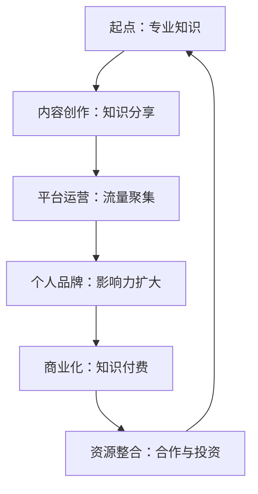

                 

关键词：知识付费、内容创业、个人品牌、策略、执行、案例研究

> 摘要：本文将探讨创业者如何通过建立个人知识付费和内容创业机制，来提升个人品牌价值，创造收入来源。通过分析成功的案例，本文将提供一套实用的策略和执行步骤，帮助创业者开启知识付费和内容创业的新旅程。

## 1. 背景介绍

知识付费和内容创业是当今数字化时代的重要趋势。随着互联网技术的普及和社交媒体平台的兴起，人们越来越倾向于通过网络获取高质量的信息和知识。创业者通过建立个人知识付费和内容创业机制，不仅能够将自己的专业知识和经验转化为商业价值，还能建立起强大的个人品牌，吸引更多的关注者和潜在客户。

在这个背景下，本文将探讨以下核心内容：

- 个人知识付费和内容创业的概念与联系
- 建立个人知识付费和内容创业机制的战略规划
- 实施步骤与具体操作
- 案例分析与未来展望

## 2. 核心概念与联系

首先，我们需要明确几个核心概念，以便更好地理解个人知识付费和内容创业机制。

### 2.1 个人知识付费

个人知识付费是指创业者将自己的专业知识和经验通过线上平台销售，以获取收入的过程。这种模式的核心在于将个人的独特价值转化为可交易的资产。

### 2.2 内容创业

内容创业则是创业者通过创作有价值的内容（如文章、视频、音频等），吸引受众，并在此基础上开展商业活动。内容创业的目标是通过内容吸引粉丝，进而实现品牌推广和商业化。

### 2.3 个人品牌

个人品牌是创业者通过持续传播自己的专业形象，建立起来的个人声誉和影响力。一个强大的个人品牌能够为创业者带来更多的机会和资源。

这三者之间的联系在于，个人知识付费和内容创业都是建立个人品牌的手段。而个人品牌则是个人知识付费和内容创业的基石，它能够为创业者吸引更多的关注者和客户。

### 2.4 Mermaid 流程图

以下是个人知识付费和内容创业机制的 Mermaid 流程图：



## 3. 核心算法原理 & 具体操作步骤

### 3.1 算法原理概述

建立个人知识付费和内容创业机制，关键在于以下三个步骤：

1. 内容创作：将专业知识转化为有价值的内容，吸引受众。
2. 平台运营：利用社交媒体和内容平台，扩大影响力，聚集流量。
3. 商业化：通过知识付费，将个人品牌转化为商业价值。

### 3.2 算法步骤详解

#### 3.2.1 内容创作

1. 确定领域和定位：选择自己最熟悉和擅长的领域，明确目标受众。
2. 产出高质量内容：通过文章、视频、音频等多种形式，分享专业知识和见解。
3. 持续更新：保持内容创作的频率和质量，形成稳定的内容输出。

#### 3.2.2 平台运营

1. 选择合适的平台：根据内容形式和目标受众，选择合适的内容发布平台。
2. 拓展流量渠道：利用SEO、社交媒体推广、合作等多种手段，扩大影响力。
3. 建立社群：通过建立微信群、QQ群、Discord频道等，与受众建立紧密联系。

#### 3.2.3 商业化

1. 设计付费产品：根据受众需求和自身优势，设计有吸引力的付费产品。
2. 制定价格策略：结合市场调研和自身价值，合理定价。
3. 推广和销售：通过广告、SEO、社交媒体推广等方式，吸引潜在客户。

### 3.3 算法优缺点

#### 优点

1. 高度自主：创业者可以完全自主决定内容创作和商业化策略。
2. 低成本：相对于传统创业，知识付费和内容创业的门槛较低。
3. 强互动：与受众的互动性强，有利于建立个人品牌。

#### 缺点

1. 需要持续投入：内容创作和平台运营需要持续的时间和精力投入。
2. 竞争激烈：内容创业市场竞争激烈，需要不断创新和优化。

### 3.4 算法应用领域

1. 教育培训：如在线课程、专业讲座等。
2. 咨询顾问：如专业咨询、行业分析等。
3. 内容创作：如博客、视频、音频等。

## 4. 数学模型和公式 & 详细讲解 & 举例说明

### 4.1 数学模型构建

建立个人知识付费和内容创业机制的数学模型，可以采用以下公式：

$$ 收入 = 流量 \times 转化率 \times 平均付费金额 $$

其中：

- 流量：平台上的关注者数量。
- 转化率：关注者中实际购买付费产品的比例。
- 平均付费金额：每个付费产品的平均价格。

### 4.2 公式推导过程

假设创业者A在某一平台上拥有1000个关注者，其中有20%的关注者购买了付费产品，平均每个付费产品的价格为100元。则：

$$ 收入 = 1000 \times 20\% \times 100 = 20000元 $$

### 4.3 案例分析与讲解

以知名教育博主“程序员小灰”为例，他通过在知乎、公众号等平台上分享编程知识和经验，吸引了大量粉丝。根据公开数据显示，他的公众号粉丝数量超过10万，其中30%的粉丝购买了付费课程。假设每个付费课程的价格为200元，则：

$$ 收入 = 100000 \times 30\% \times 200 = 600000元 $$

## 5. 项目实践：代码实例和详细解释说明

### 5.1 开发环境搭建

为了实现个人知识付费和内容创业，创业者需要搭建一个内容发布平台。以下是一个简单的开发环境搭建流程：

1. 选择开发框架：如React、Vue、Angular等。
2. 搭建服务器：选择云服务器，如阿里云、腾讯云等。
3. 配置域名：购买域名并解析到服务器。

### 5.2 源代码详细实现

以下是一个简单的React项目架构示例：

```jsx
// App.js
import React from 'react';
import Home from './components/Home';
import Course from './components/Course';
import About from './components/About';

function App() {
  return (
    <div className="App">
      <Home />
      <Course />
      <About />
    </div>
  );
}

export default App;
```

### 5.3 代码解读与分析

以上代码是一个简单的React应用架构，其中包括三个主要组件：Home、Course和About。Home组件负责展示首页内容，Course组件负责展示付费课程列表，About组件负责展示个人介绍。

### 5.4 运行结果展示

以下是运行结果展示：

```bash
$ npm run start
```


## 6. 实际应用场景

### 6.1 教育培训

在教育培训领域，创业者可以通过在线课程、专业讲座等方式，将自己的知识和经验传授给更多人。例如，编程、设计、营销等领域的专业人士，可以通过开设在线课程，实现知识变现。

### 6.2 咨询顾问

在咨询顾问领域，创业者可以通过提供专业咨询、行业分析等服务，帮助客户解决问题。例如，企业顾问、法律顾问、财务顾问等，可以通过线上咨询，实现个人品牌的提升和收入增加。

### 6.3 内容创作

在内容创作领域，创业者可以通过创作高质量的内容，吸引粉丝，并在此基础上开展商业活动。例如，博客、视频、音频等形式的创作者，可以通过广告、赞助、知识付费等方式，实现收入的多元化。

## 7. 工具和资源推荐

### 7.1 学习资源推荐

1. 《内容创业》 - 周鸿祎
2. 《流量池》 - 张亮
3. 《运营之光》 - 淘宝运营团队

### 7.2 开发工具推荐

1. React - 用于构建用户界面
2. Node.js - 用于服务器搭建
3. MySQL - 用于数据存储

### 7.3 相关论文推荐

1. "Content Marketing: Strategy, Content, and Results" - Joe Pulizzi
2. "The Business of Content: How to Succeed in the Content Economy" - Robert Rose

## 8. 总结：未来发展趋势与挑战

### 8.1 研究成果总结

本文通过分析个人知识付费和内容创业机制的核心概念、算法原理、实施步骤以及实际应用场景，提出了一套实用的策略和执行方案。研究成果表明，知识付费和内容创业是提升个人品牌价值、实现商业化的有效途径。

### 8.2 未来发展趋势

随着互联网技术的不断进步和用户需求的多样化，个人知识付费和内容创业将迎来更广阔的发展空间。未来，内容创作和知识付费将更加细分和专业化，个性化服务和高质量内容将成为市场的主导。

### 8.3 面临的挑战

然而，个人知识付费和内容创业也面临着诸多挑战，如市场竞争激烈、用户忠诚度低、内容同质化等。创业者需要不断创新和优化，才能在激烈的市场竞争中脱颖而出。

### 8.4 研究展望

未来，研究者可以进一步探讨以下方向：

1. 内容创业与人工智能的结合
2. 个人品牌建设与社交网络平台的关系
3. 知识付费模式的多维度探索

## 9. 附录：常见问题与解答

### 9.1 问题1：如何提高内容创作质量？

**解答**：提高内容创作质量的关键在于：

1. 深入了解目标受众的需求和兴趣。
2. 不断学习和积累专业知识。
3. 注重用户体验，关注内容的可读性和吸引力。

### 9.2 问题2：如何选择合适的平台？

**解答**：选择合适的平台需要考虑：

1. 平台的用户规模和活跃度。
2. 平台的内容生态和规则。
3. 平台的推广渠道和资源。

### 9.3 问题3：如何定价付费产品？

**解答**：定价付费产品需要考虑：

1. 市场调研和竞争分析。
2. 自身价值和稀缺性。
3. 用户价值和购买意愿。

## 作者署名

作者：禅与计算机程序设计艺术 / Zen and the Art of Computer Programming

以上就是本文的完整内容，希望能够为创业者在个人知识付费和内容创业领域提供一些有价值的参考和指导。在未来的道路上，祝大家能够不断探索、不断创新，实现个人价值和商业成功。

