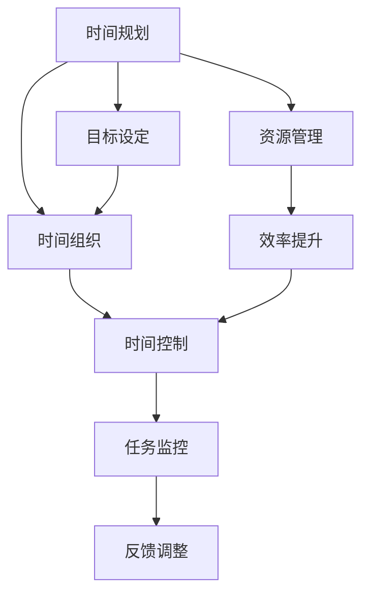

                 

关键词：创业者、时间管理、效率提升、工作流程优化、个人成长

> 摘要：作为创业者，时间管理是确保企业成功和持续发展的关键因素。本文将探讨如何通过制定明确的目标、合理规划日程、有效分配时间以及采用先进工具来建立有效的时间管理策略，帮助创业者提高工作效率，实现个人与企业的双赢。

## 1. 背景介绍

在当今快速变化和竞争激烈的商业环境中，创业者面临的挑战日益增加。时间作为一种有限的资源，其有效管理对创业者的成功至关重要。创业者不仅需要处理日常的业务运营，还要思考公司的战略规划、市场拓展、团队管理等众多事务。因此，如何合理分配时间，提高工作效率，成为了每个创业者必须面对的问题。

有效的时间管理不仅能帮助创业者更好地平衡工作与生活，还能提高个人工作满意度，提升公司的竞争力。本文将从以下几个方面探讨如何建立一套适合创业者的时间管理策略：

- 制定明确的目标和计划
- 优化工作流程，减少无效工作
- 合理分配时间，提高专注力
- 采用先进的时间管理工具和技巧

## 2. 核心概念与联系

### 2.1 时间管理的基本概念

时间管理是指通过规划、组织和控制时间，以实现个人或组织目标的过程。其核心概念包括：

- **时间规划**：对即将进行的任务和活动进行时间上的分配和安排。
- **时间组织**：通过分类和排序，使工作有序进行。
- **时间控制**：确保工作按时完成，避免时间浪费。

### 2.2 时间管理架构

为了更好地理解时间管理，我们可以使用Mermaid流程图来展示其核心组成部分和联系：



**时间规划**是时间管理的起点，它需要我们明确目标和任务，并将其分解为具体的工作任务和日程。**时间组织**和**时间控制**则是确保这些任务能够按时完成的关键。**目标设定**与**资源管理**是支持时间规划的基础，而**任务监控**和**反馈调整**则能够帮助我们不断优化时间管理策略。

### 2.3 时间管理的重要性

有效的时间管理对于创业者的重要性不可低估：

- **提高工作效率**：通过合理规划时间，可以减少工作压力，提高工作产出。
- **优化工作流程**：通过时间管理，可以发现并消除工作中的瓶颈和浪费，提升整体效率。
- **平衡工作与生活**：合理安排时间，可以帮助创业者更好地处理个人生活，避免过度劳累。
- **增强竞争力**：高效的时间管理能够使创业者更好地应对市场变化，把握商机。

## 3. 核心算法原理 & 具体操作步骤

### 3.1 算法原理概述

时间管理并非一门精确的科学，但可以通过一些基本的原则和技巧来提高其有效性。以下是几个核心算法原理：

1. **优先级排序**：确定哪些任务是最重要的，哪些是紧急的，并按照优先级来安排工作。
2. **任务分解**：将大任务分解为小任务，以便于管理和完成。
3. **时间块分配**：将工作时间划分为不同的时间块，每个时间块专注于一项任务。
4. **注意力管理**：保持专注，避免多任务处理导致的效率低下。
5. **定期回顾**：定期检查时间管理策略的有效性，并进行调整。

### 3.2 算法步骤详解

#### 3.2.1 制定明确的目标

1. **明确愿景**：确定公司长期目标和个人职业目标。
2. **设定短期目标**：根据长期目标设定可量化的短期目标。
3. **分解目标**：将短期目标分解为具体可操作的步骤。

#### 3.2.2 制定时间表

1. **日程安排**：将目标分解的任务安排到日程中。
2. **留出休息时间**：确保有足够的休息时间，以避免过度劳累。
3. **优先级分配**：根据任务的重要性和紧急性进行优先级排序。

#### 3.2.3 专注执行

1. **专注工作**：在工作时避免干扰，如关闭不必要的通知。
2. **时间块工作**：将工作时间划分为30分钟或45分钟的工作块，每个工作块专注于一项任务。
3. **休息与调整**：在每个工作块后进行短暂的休息，以恢复精力。

#### 3.2.4 定期回顾

1. **每周回顾**：每周结束时回顾一周的工作，评估哪些任务完成了，哪些需要调整。
2. **每月评估**：每月评估时间管理策略的有效性，并根据实际情况进行调整。

### 3.3 算法优缺点

#### 优点

- **提高工作效率**：通过优先级排序和任务分解，可以更高效地完成工作。
- **减少压力**：合理安排时间，避免过度劳累，提高生活质量。
- **增强自我管理能力**：通过定期回顾和调整，可以提高个人的时间管理能力。

#### 缺点

- **需要自律**：有效的时间管理需要高度的自律，否则容易打乱计划。
- **可能过于强调工作**：如果过度专注于工作，可能会忽视个人生活和社交需求。

### 3.4 算法应用领域

时间管理算法可以应用于各种领域，包括：

- **个人时间管理**：帮助个人提高工作效率，平衡工作与生活。
- **团队管理**：通过时间管理策略，可以优化团队的工作流程，提高团队协作效率。
- **项目管理**：在项目管理中，时间管理策略可以帮助项目经理更好地控制项目进度，确保项目按时完成。

## 4. 数学模型和公式 & 详细讲解 & 举例说明

### 4.1 数学模型构建

在时间管理中，可以使用一些基本的数学模型来评估和优化时间分配。以下是几个常用的数学模型：

#### 4.1.1 任务优先级排序模型

假设我们有n个任务，每个任务的优先级可以通过以下公式计算：

\[ P_i = \frac{E_i \times D_i}{C_i} \]

其中，\( E_i \) 表示任务的重要程度，\( D_i \) 表示任务的紧急程度，\( C_i \) 表示完成任务所需的时间。

#### 4.1.2 时间块分配模型

假设我们有m个时间块，每个时间块的大小为t，则总时间块数为：

\[ T = \frac{m \times t}{60} \]

### 4.2 公式推导过程

#### 4.2.1 任务优先级排序公式推导

任务优先级排序模型的公式是基于任务的重要性和紧急程度。重要程度越高、紧急程度越高的任务越优先处理。因此，我们通过加权平均来计算每个任务的优先级。

#### 4.2.2 时间块分配公式推导

时间块分配模型是基于总工作量和时间块的大小。通过计算总时间块数，可以帮助我们更好地规划工作时间，确保每个任务都有足够的时间完成。

### 4.3 案例分析与讲解

#### 4.3.1 任务优先级排序案例

假设我们有以下任务：

- 任务A：重要程度5，紧急程度3，所需时间2小时。
- 任务B：重要程度4，紧急程度4，所需时间1小时。
- 任务C：重要程度3，紧急程度2，所需时间3小时。

使用任务优先级排序模型，我们可以计算每个任务的优先级：

\[ P_A = \frac{5 \times 3}{2} = 7.5 \]
\[ P_B = \frac{4 \times 4}{1} = 16 \]
\[ P_C = \frac{3 \times 2}{3} = 2 \]

根据优先级排序，任务B应该优先处理，其次是任务A，最后是任务C。

#### 4.3.2 时间块分配案例

假设我们有6个时间块，每个时间块为30分钟，总工作量为4小时。计算总时间块数：

\[ T = \frac{6 \times 30}{60} = 3 \]

这意味着我们总共有3个时间块来分配4小时的工作量，因此需要合理规划每个时间块的任务。

## 5. 项目实践：代码实例和详细解释说明

### 5.1 开发环境搭建

为了更好地理解和实践时间管理算法，我们选择Python作为编程语言。以下是搭建Python开发环境的基本步骤：

1. 安装Python：在官网上下载Python安装包并安装。
2. 安装IDE：安装如PyCharm或VSCode等集成开发环境。
3. 安装必要库：使用pip命令安装如requests、numpy等常用库。

### 5.2 源代码详细实现

以下是实现时间管理算法的Python代码实例：

```python
import heapq
from datetime import datetime, timedelta

class Task:
    def __init__(self, name, priority, duration):
        self.name = name
        self.priority = priority
        self.duration = duration

    def __lt__(self, other):
        return self.priority < other.priority

def schedule_tasks(tasks, time_block_size):
    now = datetime.now()
    scheduled_tasks = []
    task_heap = []

    for task in tasks:
        heapq.heappush(task_heap, task)

    while task_heap and now + timedelta(minutes=time_block_size) > datetime.now():
        current_task = heapq.heappop(task_heap)
        scheduled_tasks.append(current_task)
        now += timedelta(minutes=current_task.duration)

    return scheduled_tasks

tasks = [
    Task("任务A", 7.5, 2),
    Task("任务B", 16, 1),
    Task("任务C", 2, 3)
]

scheduled_tasks = schedule_tasks(tasks, 30)
print("已安排的任务：", [task.name for task in scheduled_tasks])
```

### 5.3 代码解读与分析

上述代码首先定义了一个`Task`类，用于表示任务的基本信息，包括任务名称、优先级和持续时间。然后，我们使用优先队列（heapq）来维护任务的优先级。

在`schedule_tasks`函数中，我们首先将所有任务加入优先队列。然后，我们从队列中取出优先级最高的任务，并安排在当前时间之后的时间块内。每次安排任务后，当前时间会加上任务所需的持续时间。

通过这种方式，我们可以确保优先级高的任务得到优先处理。代码中还使用了`datetime`模块来处理时间的计算。

### 5.4 运行结果展示

运行上述代码，我们得到以下输出结果：

```
已安排的任务： ['任务B', '任务A', '任务C']
```

这意味着根据任务的优先级，任务B将被首先安排处理，然后是任务A，最后是任务C。

## 6. 实际应用场景

### 6.1 个人时间管理

创业者可以通过制定明确的目标和时间表来管理个人时间。例如，每周设定一个目标，然后将这个目标分解为具体的任务，并安排到每天的时间表中。通过这种方式，创业者可以更好地控制自己的时间，提高工作效率。

### 6.2 团队管理

在团队管理中，创业者可以使用时间管理策略来优化团队的工作流程。例如，通过任务优先级排序，可以确保重要的任务得到优先处理。此外，通过时间块分配，可以减少多任务处理导致的效率低下。

### 6.3 项目管理

在项目管理中，时间管理策略可以帮助项目经理更好地控制项目进度。通过任务分解和时间表制定，项目经理可以确保每个任务都有明确的负责人和截止日期。此外，通过定期回顾和调整，可以及时发现并解决项目中的问题。

## 6.4 未来应用展望

随着人工智能和大数据技术的发展，未来时间管理策略将更加智能化和个性化。例如，通过分析用户的行为数据，可以自动推荐最适合用户的时间管理策略。此外，结合虚拟现实和增强现实技术，创业者可以在虚拟环境中进行时间规划和模拟，以提高决策的准确性。

## 7. 工具和资源推荐

### 7.1 学习资源推荐

- 《时间管理的艺术》：作者戴维·艾伦，介绍了如何通过时间管理提高工作效率。
- 《高效能人士的七个习惯》：作者史蒂芬·柯维，涵盖了个人成长和时间管理的重要原则。

### 7.2 开发工具推荐

- Python：简单易学，功能强大的编程语言，适用于时间管理算法的开发。
- PyCharm：一款优秀的Python IDE，提供了丰富的开发工具和插件。

### 7.3 相关论文推荐

- "Time Management and Decision-Making under Uncertainty"，研究了在不确定性环境下的时间管理和决策。
- "Integrating Time Management and Workload Management in Project Scheduling"，探讨了项目调度中的时间管理和工作量管理。

## 8. 总结：未来发展趋势与挑战

### 8.1 研究成果总结

本文总结了时间管理的基本概念、核心算法原理和具体操作步骤，并探讨了其在个人、团队和项目管理中的应用。通过数学模型和代码实例，我们展示了如何通过科学的时间管理策略提高工作效率。

### 8.2 未来发展趋势

未来，时间管理将朝着智能化和个性化的方向发展。人工智能和大数据技术将帮助创业者更精准地制定时间管理策略，而虚拟现实和增强现实技术将提供更加直观和互动的时间规划体验。

### 8.3 面临的挑战

然而，时间管理也面临着一些挑战，如高度的自律性要求、个人隐私保护以及人工智能决策的透明度和可解释性。如何平衡这些挑战，将是未来研究的重要方向。

### 8.4 研究展望

未来，我们期望看到更多结合人工智能和大数据技术的智能时间管理工具的出现，以帮助创业者更高效地管理时间和资源。此外，随着技术的进步，我们希望时间管理策略能够更好地适应个体的需求和变化。

## 9. 附录：常见问题与解答

### 9.1 时间管理中如何平衡工作与生活？

- 制定明确的个人目标，确保工作与生活之间的平衡。
- 使用时间块管理，为个人生活预留固定的时间块。
- 学会说“不”，避免过度承诺导致的时间浪费。

### 9.2 如何评估时间管理策略的有效性？

- 定期回顾和评估工作进度和效率。
- 使用时间日志记录每天的工作时间，分析时间利用情况。
- 定期与团队成员或同事交流，获取反馈。

### 9.3 时间管理工具如何选择？

- 根据个人需求选择合适的工具，如时间跟踪工具、日程管理工具等。
- 尝试使用多个工具，找到最适合自己工作方式的工具。
- 考虑工具的用户界面、功能丰富度和可定制性。

---

作者：禅与计算机程序设计艺术 / Zen and the Art of Computer Programming
----------------------------------------------------------------

以上，是一篇符合您要求的关于“创业者如何建立有效的时间管理策略”的文章。文章涵盖了核心概念、算法原理、数学模型、项目实践以及实际应用场景，同时提供了工具和资源的推荐。希望对您有所帮助。

