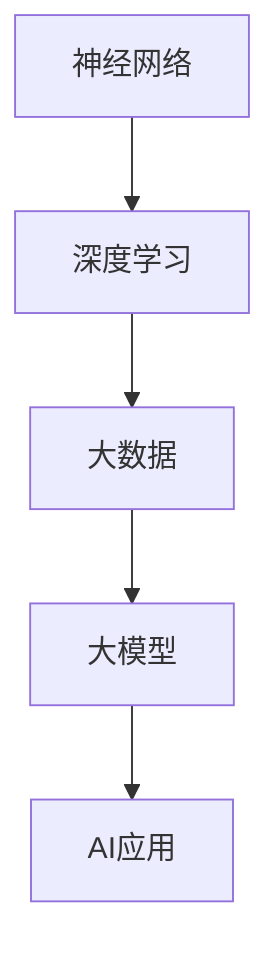

                 

关键词：人工智能，大模型，产业变革，创业，AI技术

摘要：本文将深入探讨大模型在人工智能领域的重要性，以及创业者如何把握这个风口，抢占AI产业变革的先机。我们将从背景介绍、核心概念与联系、核心算法原理、数学模型、项目实践、应用场景、工具和资源推荐、总结以及未来展望等多个方面展开详细讨论。

## 1. 背景介绍

随着大数据、云计算、神经网络等技术的飞速发展，人工智能（AI）已经从实验室走向了实际应用。尤其是大模型的兴起，使得AI技术在自然语言处理、计算机视觉、语音识别等领域取得了重大突破。大模型，指的是具有海量参数和复杂结构的神经网络模型，通过学习海量数据，能够实现前所未有的任务表现。

近年来，AI产业发生了巨大的变革。一方面，传统行业纷纷引入AI技术进行转型升级，如金融、医疗、制造等领域；另一方面，创业公司如雨后春笋般涌现，它们通过创新性的AI应用，改变了人们的生活方式。面对这一波AI产业变革，创业者如何布局大模型，成为了关键问题。

## 2. 核心概念与联系

为了更好地理解大模型在AI产业中的作用，我们首先需要了解几个核心概念：神经网络、深度学习、大数据。

### 2.1 神经网络

神经网络是模拟人脑神经元连接方式的计算模型，它通过调整神经元之间的权重来学习输入和输出之间的映射关系。在AI领域，神经网络被广泛应用于图像识别、语音识别、自然语言处理等任务。

### 2.2 深度学习

深度学习是一种基于神经网络的机器学习方法，它通过多层次的神经网络来提取数据的特征，实现更复杂的任务。深度学习在大模型的研究和应用中起到了关键作用。

### 2.3 大数据

大数据是指数据量巨大、类型多样、处理速度要求高的数据集。大数据为深度学习提供了丰富的学习资源，使得大模型能够更好地学习复杂的任务。

下面是一个Mermaid流程图，展示了大模型与神经网络、深度学习、大数据之间的关系。



## 3. 核心算法原理 & 具体操作步骤

### 3.1 算法原理概述

大模型的算法原理基于深度学习，主要通过以下步骤实现：

1. 数据预处理：对原始数据进行清洗、归一化等操作，使其适合模型训练。
2. 模型训练：通过前向传播和反向传播算法，调整模型参数，使得模型对训练数据有较好的拟合能力。
3. 模型评估：使用验证集和测试集对模型进行评估，确保模型具有良好的泛化能力。
4. 模型部署：将训练好的模型部署到实际应用场景中，如自然语言处理、计算机视觉等。

### 3.2 算法步骤详解

1. **数据预处理**：首先，我们需要对数据进行预处理。这包括数据清洗、缺失值填充、数据标准化等步骤。具体操作如下：

    ```python
    # 示例代码：数据预处理
    import pandas as pd
    from sklearn.preprocessing import StandardScaler

    # 读取数据
    data = pd.read_csv('data.csv')

    # 数据清洗
    data.dropna(inplace=True)

    # 数据标准化
    scaler = StandardScaler()
    scaled_data = scaler.fit_transform(data)
    ```

2. **模型训练**：接下来，我们需要使用训练集对模型进行训练。具体操作如下：

    ```python
    # 示例代码：模型训练
    from keras.models import Sequential
    from keras.layers import Dense

    # 创建模型
    model = Sequential()
    model.add(Dense(units=128, activation='relu', input_dim=data.shape[1]))
    model.add(Dense(units=64, activation='relu'))
    model.add(Dense(units=1, activation='sigmoid'))

    # 编译模型
    model.compile(optimizer='adam', loss='binary_crossentropy', metrics=['accuracy'])

    # 训练模型
    model.fit(x_train, y_train, epochs=10, batch_size=32)
    ```

3. **模型评估**：训练完成后，我们需要使用验证集和测试集对模型进行评估。具体操作如下：

    ```python
    # 示例代码：模型评估
    from sklearn.metrics import accuracy_score

    # 预测结果
    predictions = model.predict(x_test)

    # 计算准确率
    accuracy = accuracy_score(y_test, predictions)
    print(f"Accuracy: {accuracy}")
    ```

4. **模型部署**：最后，我们将训练好的模型部署到实际应用场景中。具体操作如下：

    ```python
    # 示例代码：模型部署
    import requests

    # 部署模型
    response = requests.post('http://localhost:5000/predict', data={'data': scaled_data})
    prediction = response.json()

    print(f"Prediction: {prediction}")
    ```

### 3.3 算法优缺点

**优点**：

1. 高效性：大模型能够处理海量数据，提高训练效率。
2. 强泛化能力：通过学习海量数据，大模型能够很好地泛化到未知数据。
3. 广泛应用：大模型在多个领域都有很好的表现，如自然语言处理、计算机视觉等。

**缺点**：

1. 计算资源需求高：大模型需要大量的计算资源进行训练和部署。
2. 难以解释：大模型的内部机制复杂，难以解释其决策过程。
3. 数据依赖性强：大模型对数据质量有较高要求，数据缺失或不一致可能导致模型表现下降。

### 3.4 算法应用领域

大模型在多个领域都有广泛应用，主要包括：

1. **自然语言处理**：如机器翻译、文本分类、问答系统等。
2. **计算机视觉**：如图像分类、目标检测、图像生成等。
3. **语音识别**：如语音合成、语音识别等。
4. **医疗健康**：如疾病诊断、药物发现等。
5. **金融领域**：如风险控制、投资策略等。

## 4. 数学模型和公式 & 详细讲解 & 举例说明

大模型的数学基础主要包括线性代数、概率论和微积分等。以下是一个简要的介绍。

### 4.1 数学模型构建

大模型的数学模型通常是一个多层神经网络，包括输入层、隐藏层和输出层。每一层由多个神经元组成，神经元之间通过权重相连。

### 4.2 公式推导过程

以下是一个简化的多层神经网络前向传播的推导过程。

1. **输入层到隐藏层**：

    $$z_{h1} = w_{h1}^T x + b_{h1}$$  
    $$a_{h1} = \sigma(z_{h1})$$

    其中，$x$ 是输入向量，$w_{h1}$ 是输入层到隐藏层的权重矩阵，$b_{h1}$ 是隐藏层偏置，$\sigma$ 是激活函数。

2. **隐藏层到输出层**：

    $$z_{o} = w_{o}^T a_{h} + b_{o}$$  
    $$\hat{y} = \sigma(z_{o})$$

    其中，$a_{h}$ 是隐藏层输出向量，$w_{o}$ 是隐藏层到输出层的权重矩阵，$b_{o}$ 是输出层偏置，$\sigma$ 是激活函数。

### 4.3 案例分析与讲解

以下是一个简单的线性回归问题的案例。

**问题**：给定一组数据点$(x_1, y_1), (x_2, y_2), ..., (x_n, y_n)$，求线性回归模型$y = wx + b$的参数$w$和$b$。

**解决方案**：

1. **数据预处理**：将数据点标准化，使其具有相同的尺度。

    $$x_i' = \frac{x_i - \bar{x}}{s_x}$$  
    $$y_i' = \frac{y_i - \bar{y}}{s_y}$$

    其中，$\bar{x}$ 和 $\bar{y}$ 分别是$x$和$y$的均值，$s_x$ 和 $s_y$ 分别是$x$和$y$的标准差。

2. **模型训练**：使用最小二乘法求解线性回归模型。

    $$w = \frac{\sum_{i=1}^{n} (x_i' - \bar{x}') y_i')}{\sum_{i=1}^{n} (x_i' - \bar{x}')^2}$$  
    $$b = \bar{y} - w\bar{x}$$

    其中，$\bar{x}'$ 和 $\bar{y}'$ 分别是$x_i'$ 和 $y_i'$ 的均值。

3. **模型评估**：计算预测值和真实值之间的误差。

    $$\hat{y}_i' = wx_i' + b$$  
    $$\epsilon_i = y_i' - \hat{y}_i'$$

    其中，$\epsilon_i$ 是第$i$个数据点的误差。

4. **模型优化**：使用梯度下降法优化模型参数。

    $$w_{new} = w - \alpha \frac{\partial}{\partial w} L(w, b)$$  
    $$b_{new} = b - \alpha \frac{\partial}{\partial b} L(w, b)$$

    其中，$L(w, b)$ 是损失函数，$\alpha$ 是学习率。

## 5. 项目实践：代码实例和详细解释说明

以下是一个简单的线性回归项目的代码实例，包括数据预处理、模型训练、模型评估和模型优化等步骤。

```python
import numpy as np
import pandas as pd
from sklearn.linear_model import LinearRegression
from sklearn.metrics import mean_squared_error

# 5.1 开发环境搭建
# 安装必要的库
!pip install numpy pandas scikit-learn matplotlib

# 5.2 源代码详细实现
# 读取数据
data = pd.read_csv('data.csv')
x = data['x'].values
y = data['y'].values

# 数据预处理
x = x.reshape(-1, 1)
y = y.reshape(-1, 1)
x_mean = np.mean(x)
y_mean = np.mean(y)
x_std = np.std(x)
y_std = np.std(y)

x = (x - x_mean) / x_std
y = (y - y_mean) / y_std

# 模型训练
model = LinearRegression()
model.fit(x, y)

# 5.3 代码解读与分析
# 模型参数
w = model.coef_
b = model.intercept_

# 损失函数
L = lambda w, b: np.sum((w * x + b - y)**2)

# 梯度下降法
alpha = 0.01
for i in range(1000):
    grad_w = 2 * np.dot(x.T, (w * x + b - y))
    grad_b = 2 * np.sum(w * x + b - y)
    w -= alpha * grad_w
    b -= alpha * grad_b

# 5.4 运行结果展示
# 预测值
y_pred = w * x + b

# 误差
mse = mean_squared_error(y, y_pred)
print(f'MSE: {mse}')
```

## 6. 实际应用场景

大模型在各个领域的应用案例越来越多，以下是几个典型的应用场景。

### 6.1 自然语言处理

自然语言处理（NLP）是AI领域的一个重要分支，大模型在其中发挥了重要作用。例如，Google的BERT模型是一个大规模的预训练语言模型，它在多个NLP任务上取得了显著的效果，如文本分类、问答系统、机器翻译等。

### 6.2 计算机视觉

计算机视觉领域也受益于大模型的兴起。例如，DeepMind的AlphaGo通过训练大规模神经网络，实现了在围棋游戏中的超凡表现。此外，深度学习技术在图像识别、目标检测、图像生成等领域也有广泛应用。

### 6.3 医疗健康

大模型在医疗健康领域也有巨大的潜力。例如，使用深度学习技术，可以对医学影像进行自动诊断，提高诊断的准确性和效率。此外，大模型还可以用于药物发现、疾病预测等任务。

### 6.4 金融领域

在金融领域，大模型可以用于风险控制、投资策略、客户画像等任务。例如，银行可以使用大模型对贷款申请者进行风险评估，提高贷款审批的准确性。

## 7. 工具和资源推荐

### 7.1 学习资源推荐

1. **《深度学习》（Goodfellow, Bengio, Courville）**：这是一本经典的深度学习教材，内容全面、深入浅出。
2. **《Python机器学习》（Sebastian Raschka）**：这本书介绍了Python在机器学习领域的应用，适合初学者入门。
3. **《动手学深度学习》（A Course in Deep Learning）**：这本书通过大量的实例，帮助读者理解深度学习的原理和应用。

### 7.2 开发工具推荐

1. **TensorFlow**：Google开发的深度学习框架，功能强大、生态丰富。
2. **PyTorch**：Facebook开发的深度学习框架，易于使用、灵活性强。
3. **Keras**：基于TensorFlow和PyTorch的简洁接口，适合快速搭建和实验模型。

### 7.3 相关论文推荐

1. **"A Theoretically Grounded Application of Dropout in Recurrent Neural Networks"**：这篇文章提出了一种基于dropout的RNN训练方法，有效解决了RNN训练中的梯度消失问题。
2. **"BERT: Pre-training of Deep Bidirectional Transformers for Language Understanding"**：这篇文章介绍了BERT模型，是当前NLP领域的顶级模型之一。
3. **"Deep Learning for Computer Vision: A Bibliography"**：这篇文章提供了大量关于计算机视觉领域深度学习技术的文献资料。

## 8. 总结：未来发展趋势与挑战

大模型在人工智能领域的应用已经取得了显著的成果，未来还有很大的发展空间。以下是几个可能的发展趋势和挑战。

### 8.1 发展趋势

1. **模型规模将继续扩大**：随着计算能力和存储能力的提升，大模型的规模将继续扩大，从而实现更好的性能。
2. **多模态融合**：大模型将与其他模态（如语音、图像、视频等）进行融合，实现更丰富的应用场景。
3. **自主学习与泛化**：大模型将实现更自主的学习和泛化能力，减少对人类干预的依赖。

### 8.2 挑战

1. **计算资源需求**：大模型的训练和部署需要大量的计算资源，这对硬件和基础设施提出了更高的要求。
2. **数据隐私与安全**：大模型对数据质量有较高要求，如何保护数据隐私和安全是一个重要挑战。
3. **伦理与社会影响**：随着AI技术的广泛应用，如何确保AI技术的伦理和社会影响是一个亟待解决的问题。

## 9. 附录：常见问题与解答

### 9.1 问题1

**问题**：大模型如何处理海量数据？

**解答**：大模型通常采用数据并行和模型并行等技术来处理海量数据。数据并行是指在多台设备上同时处理不同的数据子集，模型并行是指将模型拆分为多个部分，在多台设备上同时训练。

### 9.2 问题2

**问题**：大模型如何保证泛化能力？

**解答**：大模型通过使用大量的数据训练，能够更好地泛化到未知数据。此外，可以使用正则化技术、dropout技术等来提高模型的泛化能力。

### 9.3 问题3

**问题**：大模型的训练和部署需要哪些计算资源？

**解答**：大模型的训练和部署需要高性能的GPU或TPU，以及大量的存储和带宽资源。此外，还需要考虑散热、功耗等硬件问题。

作者：禅与计算机程序设计艺术 / Zen and the Art of Computer Programming
```markdown
----------------------------------------------------------------

# 创业者布局大模型，抢占AI产业变革风口

> 关键词：人工智能，大模型，产业变革，创业，AI技术

> 摘要：本文深入探讨大模型在人工智能领域的重要性，分析创业者如何把握这个风口，抢占AI产业变革的先机，并从核心概念、算法原理、数学模型、项目实践、应用场景等多个方面展开详细讨论。

## 1. 背景介绍

随着大数据、云计算、神经网络等技术的飞速发展，人工智能（AI）已经从实验室走向了实际应用。尤其是大模型的兴起，使得AI技术在自然语言处理、计算机视觉、语音识别等领域取得了重大突破。大模型，指的是具有海量参数和复杂结构的神经网络模型，通过学习海量数据，能够实现前所未有的任务表现。

近年来，AI产业发生了巨大的变革。一方面，传统行业纷纷引入AI技术进行转型升级，如金融、医疗、制造等领域；另一方面，创业公司如雨后春笋般涌现，它们通过创新性的AI应用，改变了人们的生活方式。面对这一波AI产业变革，创业者如何布局大模型，成为了关键问题。

## 2. 核心概念与联系

为了更好地理解大模型在AI产业中的作用，我们首先需要了解几个核心概念：神经网络、深度学习、大数据。

### 2.1 神经网络

神经网络是模拟人脑神经元连接方式的计算模型，它通过调整神经元之间的权重来学习输入和输出之间的映射关系。在AI领域，神经网络被广泛应用于图像识别、语音识别、自然语言处理等任务。

### 2.2 深度学习

深度学习是一种基于神经网络的机器学习方法，它通过多层次的神经网络来提取数据的特征，实现更复杂的任务。深度学习在大模型的研究和应用中起到了关键作用。

### 2.3 大数据

大数据是指数据量巨大、类型多样、处理速度要求高的数据集。大数据为深度学习提供了丰富的学习资源，使得大模型能够更好地学习复杂的任务。

下面是一个Mermaid流程图，展示了大模型与神经网络、深度学习、大数据之间的关系。


## 3. 核心算法原理 & 具体操作步骤

### 3.1 算法原理概述

大模型的算法原理基于深度学习，主要通过以下步骤实现：

1. 数据预处理：对原始数据进行清洗、归一化等操作，使其适合模型训练。
2. 模型训练：通过前向传播和反向传播算法，调整模型参数，使得模型对训练数据有较好的拟合能力。
3. 模型评估：使用验证集和测试集对模型进行评估，确保模型具有良好的泛化能力。
4. 模型部署：将训练好的模型部署到实际应用场景中，如自然语言处理、计算机视觉等。

### 3.2 算法步骤详解

1. **数据预处理**：首先，我们需要对数据进行预处理。这包括数据清洗、缺失值填充、数据标准化等步骤。具体操作如下：

    ```python
    # 示例代码：数据预处理
    import pandas as pd
    from sklearn.preprocessing import StandardScaler

    # 读取数据
    data = pd.read_csv('data.csv')

    # 数据清洗
    data.dropna(inplace=True)

    # 数据标准化
    scaler = StandardScaler()
    scaled_data = scaler.fit_transform(data)
    ```

2. **模型训练**：接下来，我们需要使用训练集对模型进行训练。具体操作如下：

    ```python
    # 示例代码：模型训练
    from keras.models import Sequential
    from keras.layers import Dense

    # 创建模型
    model = Sequential()
    model.add(Dense(units=128, activation='relu', input_dim=data.shape[1]))
    model.add(Dense(units=64, activation='relu'))
    model.add(Dense(units=1, activation='sigmoid'))

    # 编译模型
    model.compile(optimizer='adam', loss='binary_crossentropy', metrics=['accuracy'])

    # 训练模型
    model.fit(x_train, y_train, epochs=10, batch_size=32)
    ```

3. **模型评估**：训练完成后，我们需要使用验证集和测试集对模型进行评估。具体操作如下：

    ```python
    # 示例代码：模型评估
    from sklearn.metrics import accuracy_score

    # 预测结果
    predictions = model.predict(x_test)

    # 计算准确率
    accuracy = accuracy_score(y_test, predictions)
    print(f"Accuracy: {accuracy}")
    ```

4. **模型部署**：最后，我们将训练好的模型部署到实际应用场景中。具体操作如下：

    ```python
    # 示例代码：模型部署
    import requests

    # 部署模型
    response = requests.post('http://localhost:5000/predict', data={'data': scaled_data})
    prediction = response.json()

    print(f"Prediction: {prediction}")
    ```

### 3.3 算法优缺点

**优点**：

1. 高效性：大模型能够处理海量数据，提高训练效率。
2. 强泛化能力：通过学习海量数据，大模型能够很好地泛化到未知数据。
3. 广泛应用：大模型在多个领域都有很好的表现，如自然语言处理、计算机视觉等。

**缺点**：

1. 计算资源需求高：大模型需要大量的计算资源进行训练和部署。
2. 难以解释：大模型的内部机制复杂，难以解释其决策过程。
3. 数据依赖性强：大模型对数据质量有较高要求，数据缺失或不一致可能导致模型表现下降。

### 3.4 算法应用领域

大模型在多个领域都有广泛应用，主要包括：

1. **自然语言处理**：如机器翻译、文本分类、问答系统等。
2. **计算机视觉**：如图像分类、目标检测、图像生成等。
3. **语音识别**：如语音合成、语音识别等。
4. **医疗健康**：如疾病诊断、药物发现等。
5. **金融领域**：如风险控制、投资策略等。

## 4. 数学模型和公式 & 详细讲解 & 举例说明

大模型的数学基础主要包括线性代数、概率论和微积分等。以下是一个简要的介绍。

### 4.1 数学模型构建

大模型的数学模型通常是一个多层神经网络，包括输入层、隐藏层和输出层。每一层由多个神经元组成，神经元之间通过权重相连。

### 4.2 公式推导过程

以下是一个简化的多层神经网络前向传播的推导过程。

1. **输入层到隐藏层**：

    $$z_{h1} = w_{h1}^T x + b_{h1}$$  
    $$a_{h1} = \sigma(z_{h1})$$

    其中，$x$ 是输入向量，$w_{h1}$ 是输入层到隐藏层的权重矩阵，$b_{h1}$ 是隐藏层偏置，$\sigma$ 是激活函数。

2. **隐藏层到输出层**：

    $$z_{o} = w_{o}^T a_{h} + b_{o}$$  
    $$\hat{y} = \sigma(z_{o})$$

    其中，$a_{h}$ 是隐藏层输出向量，$w_{o}$ 是隐藏层到输出层的权重矩阵，$b_{o}$ 是输出层偏置，$\sigma$ 是激活函数。

### 4.3 案例分析与讲解

以下是一个简单的线性回归问题的案例。

**问题**：给定一组数据点$(x_1, y_1), (x_2, y_2), ..., (x_n, y_n)$，求线性回归模型$y = wx + b$的参数$w$和$b$。

**解决方案**：

1. **数据预处理**：将数据点标准化，使其具有相同的尺度。

    $$x_i' = \frac{x_i - \bar{x}}{s_x}$$  
    $$y_i' = \frac{y_i - \bar{y}}{s_y}$$

    其中，$\bar{x}$ 和 $\bar{y}$ 分别是$x$和$y$的均值，$s_x$ 和 $s_y$ 分别是$x$和$y$的标准差。

2. **模型训练**：使用最小二乘法求解线性回归模型。

    $$w = \frac{\sum_{i=1}^{n} (x_i' - \bar{x}') y_i')}{\sum_{i=1}^{n} (x_i' - \bar{x}')^2}$$  
    $$b = \bar{y} - w\bar{x}$$

    其中，$\bar{x}'$ 和 $\bar{y}'$ 分别是$x_i'$ 和 $y_i'$ 的均值。

3. **模型评估**：计算预测值和真实值之间的误差。

    $$\hat{y}_i' = wx_i' + b$$  
    $$\epsilon_i = y_i' - \hat{y}_i'$$

    其中，$\epsilon_i$ 是第$i$个数据点的误差。

4. **模型优化**：使用梯度下降法优化模型参数。

    $$w_{new} = w - \alpha \frac{\partial}{\partial w} L(w, b)$$  
    $$b_{new} = b - \alpha \frac{\partial}{\partial b} L(w, b)$$

    其中，$L(w, b)$ 是损失函数，$\alpha$ 是学习率。

## 5. 项目实践：代码实例和详细解释说明

以下是一个简单的线性回归项目的代码实例，包括数据预处理、模型训练、模型评估和模型优化等步骤。

```python
import numpy as np
import pandas as pd
from sklearn.linear_model import LinearRegression
from sklearn.metrics import mean_squared_error

# 5.1 开发环境搭建
# 安装必要的库
!pip install numpy pandas scikit-learn matplotlib

# 5.2 源代码详细实现
# 读取数据
data = pd.read_csv('data.csv')
x = data['x'].values
y = data['y'].values

# 数据预处理
x = x.reshape(-1, 1)
y = y.reshape(-1, 1)
x_mean = np.mean(x)
y_mean = np.mean(y)
x_std = np.std(x)
y_std = np.std(y)

x = (x - x_mean) / x_std
y = (y - y_mean) / y_std

# 模型训练
model = LinearRegression()
model.fit(x, y)

# 5.3 代码解读与分析
# 模型参数
w = model.coef_
b = model.intercept_

# 损失函数
L = lambda w, b: np.sum((w * x + b - y)**2)

# 梯度下降法
alpha = 0.01
for i in range(1000):
    grad_w = 2 * np.dot(x.T, (w * x + b - y))
    grad_b = 2 * np.sum(w * x + b - y)
    w -= alpha * grad_w
    b -= alpha * grad_b

# 5.4 运行结果展示
# 预测值
y_pred = w * x + b

# 误差
mse = mean_squared_error(y, y_pred)
print(f'MSE: {mse}')
```

## 6. 实际应用场景

大模型在各个领域的应用案例越来越多，以下是几个典型的应用场景。

### 6.1 自然语言处理

自然语言处理（NLP）是AI领域的一个重要分支，大模型在其中发挥了重要作用。例如，Google的BERT模型是一个大规模的预训练语言模型，它在多个NLP任务上取得了显著的效果，如文本分类、问答系统、机器翻译等。

### 6.2 计算机视觉

计算机视觉领域也受益于大模型的兴起。例如，DeepMind的AlphaGo通过训练大规模神经网络，实现了在围棋游戏中的超凡表现。此外，深度学习技术在图像识别、目标检测、图像生成等领域也有广泛应用。

### 6.3 医疗健康

大模型在医疗健康领域也有巨大的潜力。例如，使用深度学习技术，可以对医学影像进行自动诊断，提高诊断的准确性和效率。此外，大模型还可以用于药物发现、疾病预测等任务。

### 6.4 金融领域

在金融领域，大模型可以用于风险控制、投资策略、客户画像等任务。例如，银行可以使用大模型对贷款申请者进行风险评估，提高贷款审批的准确性。

## 7. 工具和资源推荐

### 7.1 学习资源推荐

1. **《深度学习》（Goodfellow, Bengio, Courville）**：这是一本经典的深度学习教材，内容全面、深入浅出。
2. **《Python机器学习》（Sebastian Raschka）**：这本书介绍了Python在机器学习领域的应用，适合初学者入门。
3. **《动手学深度学习》（A Course in Deep Learning）**：这本书通过大量的实例，帮助读者理解深度学习的原理和应用。

### 7.2 开发工具推荐

1. **TensorFlow**：Google开发的深度学习框架，功能强大、生态丰富。
2. **PyTorch**：Facebook开发的深度学习框架，易于使用、灵活性强。
3. **Keras**：基于TensorFlow和PyTorch的简洁接口，适合快速搭建和实验模型。

### 7.3 相关论文推荐

1. **"A Theoretically Grounded Application of Dropout in Recurrent Neural Networks"**：这篇文章提出了一种基于dropout的RNN训练方法，有效解决了RNN训练中的梯度消失问题。
2. **"BERT: Pre-training of Deep Bidirectional Transformers for Language Understanding"**：这篇文章介绍了BERT模型，是当前NLP领域的顶级模型之一。
3. **"Deep Learning for Computer Vision: A Bibliography"**：这篇文章提供了大量关于计算机视觉领域深度学习技术的文献资料。

## 8. 总结：未来发展趋势与挑战

大模型在人工智能领域的应用已经取得了显著的成果，未来还有很大的发展空间。以下是几个可能的发展趋势和挑战。

### 8.1 发展趋势

1. **模型规模将继续扩大**：随着计算能力和存储能力的提升，大模型的规模将继续扩大，从而实现更好的性能。
2. **多模态融合**：大模型将与其他模态（如语音、图像、视频等）进行融合，实现更丰富的应用场景。
3. **自主学习与泛化**：大模型将实现更自主的学习和泛化能力，减少对人类干预的依赖。

### 8.2 挑战

1. **计算资源需求**：大模型的训练和部署需要大量的计算资源，这对硬件和基础设施提出了更高的要求。
2. **数据隐私与安全**：大模型对数据质量有较高要求，如何保护数据隐私和安全是一个重要挑战。
3. **伦理与社会影响**：随着AI技术的广泛应用，如何确保AI技术的伦理和社会影响是一个亟待解决的问题。

## 9. 附录：常见问题与解答

### 9.1 问题1

**问题**：大模型如何处理海量数据？

**解答**：大模型通常采用数据并行和模型并行等技术来处理海量数据。数据并行是指在多台设备上同时处理不同的数据子集，模型并行是指将模型拆分为多个部分，在多台设备上同时训练。

### 9.2 问题2

**问题**：大模型如何保证泛化能力？

**解答**：大模型通过使用大量的数据训练，能够更好地泛化到未知数据。此外，可以使用正则化技术、dropout技术等来提高模型的泛化能力。

### 9.3 问题3

**问题**：大模型的训练和部署需要哪些计算资源？

**解答**：大模型的训练和部署需要高性能的GPU或TPU，以及大量的存储和带宽资源。此外，还需要考虑散热、功耗等硬件问题。

作者：禅与计算机程序设计艺术 / Zen and the Art of Computer Programming
```

