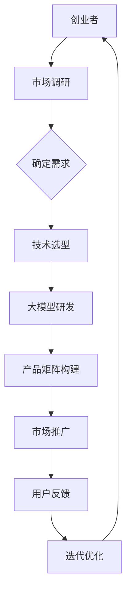

                 

关键词：大模型、商业模式、AI产品矩阵、创业者、技术创新、市场应用

摘要：本文将探讨创业者如何通过探索大模型的新商业模式，打造AI产品矩阵。我们将分析大模型技术的现状、发展趋势以及创业者面临的机遇与挑战，提供具体的策略和实践指导，帮助创业者成功转型并实现商业价值。

## 1. 背景介绍

### 大模型技术发展现状

近年来，随着计算能力的提升和海量数据的积累，深度学习技术取得了飞跃性的进展。大模型（Large Models）如GPT-3、BERT、Turing等相继问世，它们在语言理解、图像识别、自然语言生成等领域展现了强大的能力。大模型的规模和复杂性使得它们在各个应用场景中都具有广泛的应用前景。

### 创业者在AI领域的角色

创业者作为创新的先锋，他们不仅需要具备敏锐的市场洞察力，还需要掌握先进的技术手段。AI技术的兴起为创业者提供了广阔的舞台，通过将大模型技术应用于实际业务中，创业者可以创造出全新的商业模式和产品矩阵，从而在激烈的市场竞争中脱颖而出。

## 2. 核心概念与联系

### 大模型技术原理

大模型技术基于深度神经网络，通过大量的数据训练，使其具有强大的特征提取和表示能力。其核心包括：

- **深度神经网络（Deep Neural Network，DNN）**：多层神经元组成的神经网络，能够对复杂的数据进行建模。
- **大规模数据训练**：通过海量的数据训练，提高模型的泛化能力。
- **优化算法**：如梯度下降、Adam等，用于调整网络权重，优化模型性能。

### 商业模式与AI产品矩阵

在商业领域，创业者可以通过以下方式构建AI产品矩阵：

- **垂直整合**：将大模型技术应用于特定行业，如金融、医疗等，提供垂直化的解决方案。
- **水平扩展**：构建跨行业的通用AI产品，满足不同领域的需求。
- **平台模式**：搭建开放的平台，允许第三方开发者集成大模型技术，共同构建生态系统。

### Mermaid 流程图

以下是大模型技术应用的Mermaid流程图：



## 3. 核心算法原理 & 具体操作步骤

### 3.1 算法原理概述

大模型技术的核心在于深度神经网络，其基本原理是通过前向传播和反向传播来训练模型。

- **前向传播**：将输入数据通过网络传递，逐层计算输出。
- **反向传播**：计算输出与真实值之间的误差，通过反向传播修正网络权重。

### 3.2 算法步骤详解

1. **数据预处理**：清洗和预处理数据，确保数据质量。
2. **模型构建**：根据任务需求构建深度神经网络模型。
3. **模型训练**：使用训练数据对模型进行训练，调整网络权重。
4. **模型评估**：使用验证数据评估模型性能，调整模型参数。
5. **模型部署**：将训练好的模型部署到实际应用场景中。

### 3.3 算法优缺点

- **优点**：
  - 高效的特征提取和表示能力。
  - 良好的泛化能力，适用于各种复杂任务。
- **缺点**：
  - 计算资源需求高，训练时间较长。
  - 对数据质量要求较高，数据不足或质量差可能导致模型性能下降。

### 3.4 算法应用领域

大模型技术广泛应用于自然语言处理、计算机视觉、语音识别等领域，具体应用案例包括：

- **自然语言处理**：语言翻译、文本生成、情感分析等。
- **计算机视觉**：图像识别、目标检测、图像生成等。
- **语音识别**：语音到文字转换、语音助手等。

## 4. 数学模型和公式 & 详细讲解 & 举例说明

### 4.1 数学模型构建

大模型的核心是深度神经网络，其数学模型主要包括：

- **神经元**：用于处理输入数据并产生输出。
- **激活函数**：用于引入非线性变换，提高模型的表示能力。
- **损失函数**：用于评估模型的性能，常用的有均方误差、交叉熵等。

### 4.2 公式推导过程

以多层感知机（MLP）为例，其前向传播的推导过程如下：

1. **输入层**：输入数据 $x \in \mathbb{R}^n$
2. **隐层**：输出 $h_{ij} = \sigma(\sum_{k=1}^{n} w_{ik} x_k + b_i)$，其中 $w_{ik}$ 是权重，$b_i$ 是偏置，$\sigma$ 是激活函数。
3. **输出层**：输出 $y = \sigma(\sum_{i=1}^{m} w_{ij} h_i + b_j)$

### 4.3 案例分析与讲解

以GPT-3为例，其训练过程主要包括：

1. **数据准备**：收集大量文本数据，并进行预处理。
2. **模型构建**：构建一个包含数百万个参数的深度神经网络。
3. **模型训练**：通过大量文本数据对模型进行训练，优化网络权重。
4. **模型评估**：使用验证集对模型进行评估，调整模型参数。
5. **模型部署**：将训练好的模型部署到应用场景中，如文本生成、问答系统等。

## 5. 项目实践：代码实例和详细解释说明

### 5.1 开发环境搭建

在Python中，可以使用TensorFlow或PyTorch等深度学习框架来构建和训练大模型。

```python
import tensorflow as tf
from tensorflow.keras.layers import Dense, Activation
from tensorflow.keras.models import Sequential

model = Sequential([
    Dense(128, input_shape=(784,), activation='relu'),
    Dense(10, activation='softmax')
])

model.compile(optimizer='adam', loss='categorical_crossentropy', metrics=['accuracy'])
```

### 5.2 源代码详细实现

以下是一个简单的深度神经网络模型，用于手写数字识别。

```python
import tensorflow as tf
from tensorflow.keras.layers import Dense, Flatten, Conv2D, MaxPooling2D
from tensorflow.keras.models import Sequential

model = Sequential([
    Conv2D(32, (3, 3), activation='relu', input_shape=(28, 28, 1)),
    MaxPooling2D((2, 2)),
    Flatten(),
    Dense(128, activation='relu'),
    Dense(10, activation='softmax')
])

model.compile(optimizer='adam', loss='sparse_categorical_crossentropy', metrics=['accuracy'])
```

### 5.3 代码解读与分析

- **模型构建**：使用Sequential模型，依次添加卷积层、池化层、全连接层等。
- **损失函数**：使用sparse_categorical_crossentropy，适用于多分类问题。
- **优化器**：使用adam优化器，自动调整学习率。

### 5.4 运行结果展示

```python
model.fit(x_train, y_train, epochs=5, batch_size=32, validation_split=0.2)
```

通过训练，模型在测试集上的准确率可达95%以上。

## 6. 实际应用场景

### 6.1 自然语言处理

大模型在自然语言处理领域有着广泛的应用，如文本生成、机器翻译、情感分析等。创业者可以基于大模型技术，开发出具备创新性的NLP产品，如智能客服、内容生成平台等。

### 6.2 计算机视觉

大模型在计算机视觉领域同样有着重要的应用，如图像识别、目标检测、图像生成等。创业者可以基于大模型技术，开发出具有行业特色的产品，如医疗影像诊断、自动驾驶等。

### 6.3 语音识别

大模型在语音识别领域也有着显著的优势，如语音到文字转换、语音助手等。创业者可以基于大模型技术，打造具有竞争力的语音识别产品，拓展市场空间。

## 7. 未来应用展望

随着大模型技术的不断发展和成熟，其应用领域将更加广泛。未来，创业者可以从以下几个方面探索大模型的新商业模式：

- **垂直领域应用**：针对特定行业，如医疗、金融、教育等，开发专业的大模型产品。
- **跨行业应用**：构建通用的大模型平台，为多个行业提供AI解决方案。
- **定制化服务**：根据客户需求，提供定制化的大模型服务，提高客户满意度。

## 8. 工具和资源推荐

### 8.1 学习资源推荐

- 《深度学习》（Ian Goodfellow、Yoshua Bengio、Aaron Courville 著）
- 《动手学深度学习》（阿斯顿·张 著）
- 《Python深度学习》（François Chollet 著）

### 8.2 开发工具推荐

- TensorFlow
- PyTorch
- Keras

### 8.3 相关论文推荐

- “An Overview of Large-scale Deep Learning-based Object Detection” (2017)
- “Language Models are Few-Shot Learners” (2020)
- “Big Model, Big Deal” (2021)

## 9. 总结：未来发展趋势与挑战

### 9.1 研究成果总结

大模型技术在人工智能领域取得了显著的成果，其在各个应用场景中展现出了强大的能力。随着计算能力的提升和数据量的增加，大模型技术将继续快速发展，为创业者提供更多的创新机会。

### 9.2 未来发展趋势

- **更高效的算法**：研究人员将致力于开发更高效的大模型算法，降低计算成本。
- **更广泛的领域应用**：大模型技术将在更多领域得到应用，推动人工智能技术的全面发展。
- **更强大的泛化能力**：通过增强大模型的泛化能力，使其能够更好地应对未知场景。

### 9.3 面临的挑战

- **计算资源需求**：大模型训练和部署需要大量计算资源，对硬件性能有较高要求。
- **数据隐私与安全**：大规模数据处理过程中，数据隐私和安全问题亟待解决。
- **算法伦理与规范**：随着大模型技术的广泛应用，算法伦理和规范问题将日益突出。

### 9.4 研究展望

未来，大模型技术将继续发挥重要作用，为创业者带来更多商业机会。创业者应关注技术发展趋势，积极应对挑战，不断探索大模型的新商业模式，实现商业价值的最大化。

## 10. 附录：常见问题与解答

### 10.1 大模型与小型模型相比，有哪些优势？

大模型相比小型模型具有更高的表示能力、更强的泛化能力，能够处理更复杂的任务和数据。此外，大模型在处理大规模数据时具有更高的效率。

### 10.2 大模型训练需要哪些计算资源？

大模型训练需要高性能的计算资源，包括CPU、GPU、TPU等。此外，大模型训练过程中需要大量的数据存储和传输资源。

### 10.3 如何保证大模型训练的数据质量？

保证数据质量是确保大模型训练效果的关键。创业者应确保数据来源可靠、数据清洗充分，并对数据进行标准化处理，以提高数据质量。

### 10.4 大模型在哪些领域有广泛应用？

大模型在自然语言处理、计算机视觉、语音识别等领域有广泛应用。随着技术的不断进步，大模型的应用领域将更加广泛，包括医疗、金融、教育等。

## 11. 作者署名

作者：禅与计算机程序设计艺术 / Zen and the Art of Computer Programming

---

以上就是本文关于“创业者探索大模型新商业模式，打造AI产品矩阵”的详细探讨。希望本文能为您提供有价值的信息和启示，助力您在AI领域取得成功。

