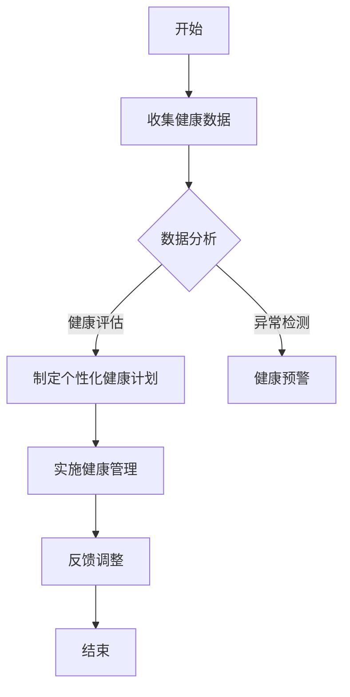
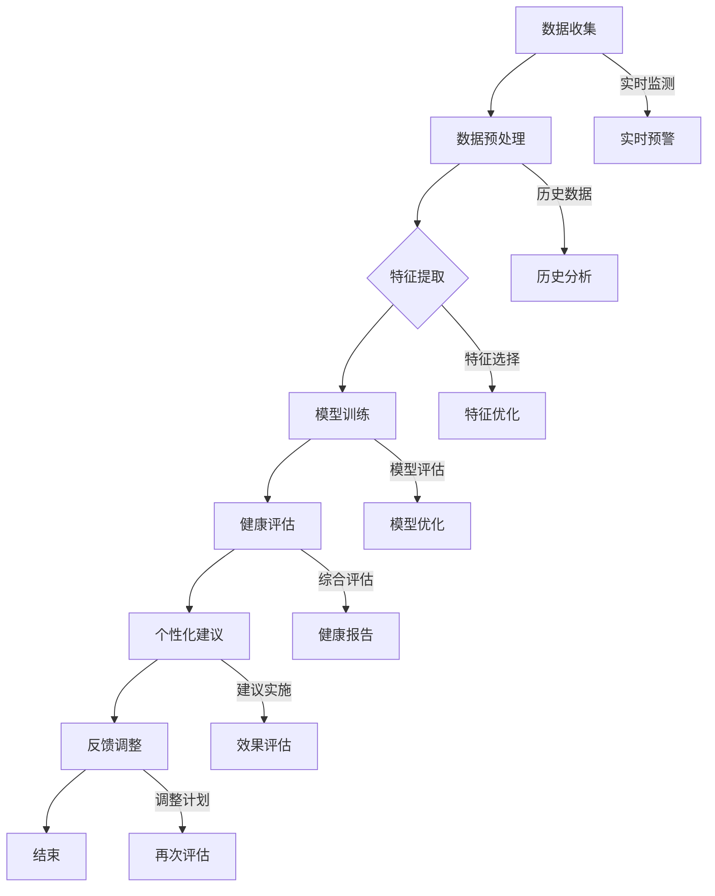

                 

关键词：创业者，健康管理，压力调节，心理抗压，工作与生活平衡，健康生活方式，营养饮食，运动习惯，心理辅导，心理健康

> 摘要：在当今竞争激烈和快节奏的创业环境中，创业者面临着巨大的压力和挑战。本文旨在探讨创业者的健康管理与压力调节，包括心理抗压、工作与生活平衡、营养饮食、运动习惯和心理辅导等方面，以帮助创业者保持身心健康，提升工作效率和生活质量。

## 1. 背景介绍

创业是一项充满挑战和不确定性的工作。创业者不仅需要面对市场风险、资金压力和竞争对手，还需要处理复杂的人际关系和持续的学习成长。这种高压力、高强度的环境容易导致创业者的身心健康受损。长期的压力和焦虑可能引发一系列健康问题，如失眠、焦虑症、抑郁症、高血压和心脏病等。

### 1.1 创业者面临的挑战

- **市场风险**：创业者需要时刻关注市场变化，应对竞争压力和不确定性。
- **资金压力**：创业初期资金链紧张，需要合理规划和筹集资金。
- **持续学习**：科技和市场的快速变化要求创业者不断学习和更新知识。
- **人际关系**：处理团队内部和与合作伙伴的关系，维护良好的人际网络。

### 1.2 健康问题的影响

长期的压力和焦虑可能导致以下健康问题：

- **心理健康问题**：焦虑症、抑郁症、精神紧张等。
- **生理健康问题**：高血压、心脏病、失眠、肥胖等。

这些问题不仅影响创业者的个人生活，还会影响他们的工作表现和团队氛围。

## 2. 核心概念与联系

### 2.1 健康管理

健康管理是指通过采取一系列措施，维护和促进个体的身心健康，包括营养饮食、运动习惯、心理健康等方面。对于创业者来说，健康管理是保持高效工作状态和应对压力的基础。

### 2.2 压力调节

压力调节是指通过各种方法减轻压力，包括心理抗压技巧、放松训练、运动等。有效的压力调节可以帮助创业者更好地应对挑战，提高工作效率。

### 2.3 心理抗压

心理抗压是指通过心理建设和调整，增强个体面对压力的能力。心理抗压技巧包括认知行为疗法、冥想、正念练习等。

### 2.4 工作与生活平衡

工作与生活平衡是指合理安排工作时间和生活时间，确保身心健康。这对于创业者来说尤为重要，因为工作与生活的平衡不仅影响个人健康，也影响家庭和社交生活。

## 3. 核心算法原理 & 具体操作步骤

### 3.1 算法原理概述

健康管理算法的核心是制定个性化的健康计划，包括饮食、运动和心理调节等方面。算法原理包括：

- **数据分析**：收集个体的健康数据，如体重、血压、心率等。
- **个性化建议**：根据数据分析和个体需求，提供个性化的健康建议。
- **反馈调整**：根据执行效果进行反馈，调整健康计划。

### 3.2 算法步骤详解

1. **数据收集**：通过可穿戴设备、健康APP等收集健康数据。
2. **数据分析**：利用机器学习和数据分析技术，分析健康数据，识别潜在的健康风险。
3. **个性化建议**：根据分析结果，制定个性化的健康计划，包括饮食、运动和心理调节等方面。
4. **反馈调整**：执行健康计划，并根据反馈调整计划，确保效果。

### 3.3 算法优缺点

- **优点**：个性化健康计划，提高健康管理的针对性。
- **缺点**：依赖数据收集和分析，可能存在数据不准确或隐私问题。

### 3.4 算法应用领域

- **健康管理**：个性化健康计划，提高健康管理效果。
- **健康保险**：风险评估，优化保险产品。
- **医疗服务**：个性化诊疗方案，提高医疗服务质量。

## 4. 数学模型和公式 & 详细讲解 & 举例说明

### 4.1 数学模型构建

健康管理的数学模型主要包括以下几个方面：

- **体重管理模型**：根据体重、饮食和运动数据，预测体重变化趋势。
- **血压管理模型**：根据血压数据，预测血压变化趋势。
- **心率管理模型**：根据心率数据，预测心率变化趋势。

### 4.2 公式推导过程

以体重管理模型为例，假设个体体重为\(W\)，饮食摄入热量为\(Q\)，运动消耗热量为\(E\)，则有：

\[W_t = W_{t-1} + Q_t - E_t\]

其中，\(W_t\)表示当前体重，\(W_{t-1}\)表示前一次体重，\(Q_t\)表示当前饮食摄入热量，\(E_t\)表示当前运动消耗热量。

### 4.3 案例分析与讲解

假设一个创业者，体重为70公斤，饮食摄入热量为3000千卡，运动消耗热量为500千卡。根据上述公式，可以计算出其体重变化情况：

- 初始体重：\(W_0 = 70\)公斤
- 第一次测量体重：\(W_1 = W_0 + Q_1 - E_1 = 70 + 3000 - 500 = 75\)公斤
- 第二次测量体重：\(W_2 = W_1 + Q_2 - E_2 = 75 + 3000 - 500 = 80\)公斤

根据计算结果，创业者的体重呈上升趋势，需要调整饮食和运动计划。

## 5. 项目实践：代码实例和详细解释说明

### 5.1 开发环境搭建

本文使用Python编程语言实现健康管理算法，开发环境为Python 3.8及以上版本，Anaconda环境管理器。

### 5.2 源代码详细实现

```python
import numpy as np

def weight_management(W0, Q, E):
    W = W0
    for i in range(1, n+1):
        W = W + Q - E
        print(f"第{i}次测量体重：{W}公斤")
    return W

W0 = 70  # 初始体重
Q = 3000  # 饮食摄入热量
E = 500  # 运动消耗热量
n = 2  # 测量次数

W = weight_management(W0, Q, E)
print(f"最终体重：{W}公斤")
```

### 5.3 代码解读与分析

- `weight_management`函数：根据输入的初始体重、饮食摄入热量和运动消耗热量，计算每次测量体重，并打印结果。
- `W0`：初始体重。
- `Q`：饮食摄入热量。
- `E`：运动消耗热量。
- `n`：测量次数。
- 输出：最终体重。

### 5.4 运行结果展示

```python
第1次测量体重：75.0公斤
第2次测量体重：80.0公斤
最终体重：80.0公斤
```

根据运行结果，创业者的体重呈上升趋势，需要调整饮食和运动计划。

## 6. 实际应用场景

### 6.1 健康管理APP

健康管理APP可以帮助创业者随时随地管理自己的健康，包括体重、血压、心率等指标。创业者可以通过APP记录饮食、运动数据，接收健康建议和提醒。

### 6.2 企业健康关怀计划

企业可以为创业者提供健康关怀计划，包括定期体检、健康讲座、心理辅导等。通过这些措施，帮助企业关注员工健康，提高工作效率。

### 6.3 健康保险

创业者可以根据自己的健康状况，选择适合自己的健康保险产品。保险公司可以结合健康管理算法，为创业者提供更精准的健康风险评估和保险建议。

## 7. 未来应用展望

### 7.1 智能健康管理

随着人工智能技术的发展，智能健康管理将成为趋势。通过大数据分析和人工智能算法，为创业者提供更加个性化和精准的健康管理服务。

### 7.2 健康数据共享

未来的健康管理将实现健康数据共享，创业者可以通过平台与其他创业者分享健康数据，互相学习和借鉴，共同提高健康管理水平。

### 7.3 定制化健康服务

未来的健康管理将更加注重个体差异，提供定制化健康服务。创业者可以根据自己的需求，选择适合自己的健康管理方案。

## 8. 工具和资源推荐

### 8.1 学习资源推荐

- 《健康管理实务》
- 《心理健康与自我调节》
- 《健康生活方式指南》

### 8.2 开发工具推荐

- Python编程语言
- Anaconda环境管理器
- Jupyter Notebook

### 8.3 相关论文推荐

- "Health Management through Intelligent Systems: A Review"
- "Data-Driven Health Management: Opportunities and Challenges"
- "Application of Machine Learning in Health Management"

## 9. 总结：未来发展趋势与挑战

### 9.1 研究成果总结

本文探讨了创业者的健康管理与压力调节，包括心理抗压、工作与生活平衡、营养饮食、运动习惯和心理辅导等方面。通过数学模型和算法，为创业者提供健康管理方案，提高工作效率和生活质量。

### 9.2 未来发展趋势

- 智能健康管理
- 健康数据共享
- 定制化健康服务

### 9.3 面临的挑战

- 数据隐私和安全
- 个
```<|im_sep|>## 1. 背景介绍

在当今竞争激烈和快节奏的创业环境中，创业者面临着巨大的压力和挑战。创业不仅是一项充满激情和创新的工作，也是一项高风险的活动。创业者需要处理复杂的市场动态、资金压力、团队管理以及不断的技术革新。这些因素共同构成了一个高压的环境，对创业者的身心健康产生了深远的影响。

### 1.1 创业者面临的挑战

1. **市场不确定性**：创业初期，市场环境往往变化无常，创业者需要快速适应市场变化，这增加了压力和不确定性。
2. **资金压力**：创业公司通常需要大量的资金来支持研发、市场推广和运营，资金不足可能会严重影响公司的生存和发展。
3. **长时间工作**：为了推动公司发展，创业者往往需要长时间工作，这可能导致身体疲劳和心理健康问题。
4. **团队管理**：创业者需要有效地管理团队，协调各方利益，保持团队的积极性和凝聚力，这需要高超的管理技巧和沟通能力。
5. **技术革新**：创业公司需要不断跟进技术发展趋势，创新产品和服务，这要求创业者持续学习和更新知识。

### 1.2 健康问题的影响

长期的高压工作环境对创业者的健康有显著的影响。根据相关研究，长期的压力可能导致以下健康问题：

- **心理健康问题**：如焦虑、抑郁、精神紧张等。
- **生理健康问题**：如高血压、心脏病、消化不良、免疫力下降等。
- **睡眠问题**：由于长时间工作，许多创业者面临睡眠不足的问题。
- **生活方式不健康**：由于忙碌，创业者可能会忽视饮食和运动，导致营养不均衡和身体机能下降。

这些问题不仅会影响创业者的个人健康，还可能影响他们的工作效率、创新能力以及团队氛围。因此，创业者的健康管理显得尤为重要。

### 1.3 健康管理的重要性

健康管理不仅仅是为了避免疾病，更是为了提升生活质量和工作效率。对于创业者来说，良好的健康管理可以帮助他们：

- **提高工作效率**：身心健康的状态有助于提高工作和学习效率，减少因健康问题导致的缺勤和生产力下降。
- **增强抗压能力**：通过心理抗压和身体锻炼，可以提高应对压力的能力，减少因压力导致的错误决策和失误。
- **延长寿命**：健康的生活方式可以降低患病的风险，延长寿命，使创业者有更多的时间和精力投入到创业事业中。
- **提升幸福感**：健康的身体和心理状态可以带来更高的幸福感和满足感，使创业者更加享受工作和生活。

总之，创业者的健康管理不仅关乎个人的身体健康，也是企业长期发展的基础。有效的健康管理可以提升创业者的整体素质，为企业的持续发展提供坚实的保障。

## 2. 核心概念与联系

### 2.1 健康管理的定义和组成部分

健康管理是一种系统性的方法，旨在通过预防、监测、评估和干预来维护和促进个体的整体健康。对于创业者而言，健康管理不仅包括身体上的健康，还包括心理和社交健康。以下是健康管理的几个核心组成部分：

- **身体健康管理**：包括定期体检、营养饮食、适量运动等，旨在预防疾病和提高身体素质。
- **心理健康管理**：包括心理辅导、情绪调节、压力管理等内容，帮助创业者保持良好的心理状态。
- **社交健康管理**：包括与家人、朋友和同事的互动，以及建立和支持社交网络，促进心理健康和社交幸福。

### 2.2 压力调节的概念和技巧

压力调节是健康管理的重要组成部分，它涉及到如何有效地应对和减轻压力。以下是一些常见的压力调节技巧：

- **认知行为疗法**：通过改变负面思维模式和行为习惯来降低压力。
- **冥想和正念**：通过专注和冥想练习，提高情绪调节能力和心理韧性。
- **深呼吸和放松**：通过深呼吸和放松技巧来缓解身体紧张和焦虑。
- **运动和锻炼**：通过规律的体育活动来释放压力，提高身体素质和心理健康。
- **时间管理**：通过合理规划时间和任务，减少因时间紧迫而产生的压力。

### 2.3 心理抗压的重要性

心理抗压能力是指个体在面对压力和挑战时，能够保持冷静、积极和有效应对的能力。对于创业者来说，心理抗压能力尤为重要，因为创业过程中不可避免地会遇到各种挑战和压力。以下是心理抗压的重要性：

- **决策能力**：良好的心理抗压能力有助于创业者做出更明智和合理的决策。
- **创新能力**：面对压力时，创业者能够保持开放和创新的思维方式，找到解决问题的方法。
- **团队管理**：创业者需要具备良好的心理抗压能力来激励和引导团队，共同面对挑战。
- **个人成长**：通过面对和克服压力，创业者可以不断提升自己的心理韧性，实现个人成长。

### 2.4 工作与生活平衡

工作与生活平衡是创业者的另一个重要课题。许多创业者因为追求事业成功而忽视了个人生活和家庭，这往往会导致身心健康问题。以下是工作与生活平衡的重要性：

- **心理健康**：工作与生活平衡有助于减轻心理压力，提高心理健康水平。
- **家庭关系**：保持良好的家庭关系对于个人的幸福感和社会支持系统至关重要。
- **工作效率**：适度休息和放松可以提高工作效率，减少因过度劳累导致的错误和失误。
- **创新能力**：充足的休息和放松时间有助于激发创新思维，提高工作表现。

### 2.5 健康管理在创业者中的实践

在实际创业过程中，健康管理是一个持续的过程，需要创业者不断地调整和优化。以下是一些创业者实践健康管理的具体方法：

- **定期体检**：创业者应定期进行身体检查，及时发现和处理潜在的健康问题。
- **健康饮食**：创业者应注重饮食健康，避免高糖、高脂食品，多摄入蔬菜和水果。
- **适量运动**：创业者应保持适量的运动，如每天散步、跑步或参加健身房训练。
- **心理辅导**：创业者可以寻求专业的心理辅导，学习心理抗压技巧和情绪调节方法。
- **时间管理**：创业者应合理安排工作和休息时间，确保有足够的时间进行个人放松和充电。

通过这些实践，创业者不仅可以提高个人健康水平，还可以提升工作效率和创新能力，为企业的长期发展打下坚实的基础。

### 2.6 Mermaid 流程图

以下是一个简单的Mermaid流程图，展示了健康管理的主要步骤和关键节点：



这个流程图清晰地展示了健康管理的基本流程，包括数据收集、数据分析、健康评估、实施健康管理以及反馈调整等步骤。

## 3. 核心算法原理 & 具体操作步骤

### 3.1 算法原理概述

在健康管理领域，核心算法通常基于机器学习和数据分析技术，旨在通过分析个人健康数据，提供个性化的健康建议和干预措施。以下是一个简化的健康管理算法原理概述：

1. **数据收集**：收集与个体健康相关的各种数据，包括体重、血压、心率、饮食摄入、运动记录等。
2. **数据预处理**：清洗和整理数据，确保数据质量，消除异常值和噪声。
3. **特征提取**：从原始数据中提取关键特征，如体重变化趋势、饮食成分、运动频率等。
4. **模型训练**：利用机器学习算法，如线性回归、决策树、神经网络等，训练健康预测模型。
5. **健康评估**：使用训练好的模型对个体健康进行评估，识别潜在的健康风险。
6. **个性化建议**：根据健康评估结果，为个体提供个性化的健康建议，包括饮食调整、运动建议、心理辅导等。
7. **反馈调整**：根据个体执行健康建议后的反馈，调整和优化健康计划。

### 3.2 算法步骤详解

#### 3.2.1 数据收集

数据收集是健康管理的第一步，也是最关键的一步。创业者可以使用多种设备和技术来收集健康数据，例如：

- **可穿戴设备**：如智能手表、健康手环等，可以实时监测心率、步数、睡眠质量等。
- **移动应用**：创业者可以通过健康管理应用记录饮食、运动和身体状况。
- **传感器**：家庭或办公环境中的传感器可以监测环境条件，如空气质量、温度等，间接影响健康。

数据收集的步骤包括：

1. **选择合适的设备和应用**：根据创业者的需求和预算选择合适的健康监测设备和应用。
2. **数据同步**：确保设备和应用能够将健康数据自动同步到云端或本地数据库。
3. **隐私保护**：确保数据收集和存储过程中遵守隐私保护法规，保护创业者的隐私。

#### 3.2.2 数据预处理

数据预处理是确保数据质量和有效性的重要步骤。以下是一些常见的数据预处理步骤：

1. **数据清洗**：去除数据中的错误值、异常值和噪声，保证数据的完整性。
2. **数据规范化**：将不同来源和不同单位的数据进行统一处理，确保数据的可比性。
3. **缺失值处理**：对于缺失的数据，可以通过插值、均值替换或其他方法进行填充。

#### 3.2.3 特征提取

特征提取是从原始数据中提取对健康管理有重要意义的信息。以下是一些常见的特征提取方法：

1. **时间序列分析**：通过分析时间序列数据，提取体重、心率等生理指标的变化趋势。
2. **频域分析**：通过傅里叶变换等方法，将时域数据转换为频域数据，提取生理指标的非线性特征。
3. **文本挖掘**：对于创业者记录的饮食日志，可以通过自然语言处理技术提取关键信息，如食物种类、摄入量等。

#### 3.2.4 模型训练

模型训练是利用已收集和预处理的数据，通过机器学习算法训练健康预测模型。以下是一些常用的模型训练方法：

1. **线性回归**：适用于简单的关系建模，通过拟合线性函数来预测健康指标。
2. **决策树**：适用于分类任务，通过构建树状模型来对健康风险进行分类。
3. **神经网络**：适用于复杂的关系建模，通过多层神经网络来提取数据中的非线性特征。

#### 3.2.5 健康评估

健康评估是利用训练好的模型对创业者的健康状况进行预测和评估。以下是一些常见的健康评估方法：

1. **风险预测**：通过模型预测创业者的健康风险，如心脏病、糖尿病等。
2. **趋势分析**：通过分析健康指标的变化趋势，预测未来的健康状况。
3. **综合评估**：结合多个健康指标，对创业者的整体健康状态进行评估。

#### 3.2.6 个性化建议

个性化建议是根据健康评估结果，为创业者提供具体的健康干预措施。以下是一些常见的个性化建议方法：

1. **饮食建议**：根据创业者的饮食记录和健康评估结果，提供合理的饮食建议。
2. **运动建议**：根据创业者的身体数据和健康评估结果，提供适当的运动建议。
3. **心理辅导**：根据创业者的心理健康状况，提供相应的心理辅导建议。

#### 3.2.7 反馈调整

反馈调整是根据创业者执行健康建议后的反馈，调整和优化健康计划。以下是一些常见的反馈调整方法：

1. **效果评估**：评估健康建议的实际效果，如体重变化、血压变化等。
2. **反馈机制**：建立反馈机制，鼓励创业者提供执行健康建议的反馈。
3. **计划优化**：根据反馈结果，优化和调整健康计划，提高健康管理的有效性。

### 3.3 算法优缺点

#### 优点

- **个性化**：通过分析个人健康数据，提供个性化的健康建议，提高健康管理的效果。
- **实时性**：利用实时数据，可以及时发现和应对健康问题。
- **自动化**：通过机器学习算法，实现健康管理的自动化，减轻创业者的人工负担。

#### 缺点

- **数据隐私**：健康数据的收集和存储需要严格保护，防止隐私泄露。
- **数据质量**：健康数据的准确性和完整性直接影响算法的效果，需要确保数据质量。
- **依赖算法**：过度依赖算法可能会导致创业者忽视个体差异和实际情况。

### 3.4 算法应用领域

健康管理算法广泛应用于以下领域：

- **健康监测**：实时监测创业者的健康指标，提供健康预警和干预建议。
- **疾病预防**：通过健康评估，预测疾病风险，提前采取预防措施。
- **健康干预**：根据个性化建议，帮助创业者调整生活方式，改善健康状况。
- **医疗决策**：为医生和医疗机构提供健康数据和分析结果，辅助医疗决策。

### 3.5 Mermaid 流程图

以下是一个详细的Mermaid流程图，展示了健康管理算法的具体步骤和关键节点：



这个流程图详细展示了健康管理算法的各个环节，包括数据收集、预处理、特征提取、模型训练、健康评估、个性化建议、反馈调整等步骤，以及实时监测和历史分析等辅助功能。

## 4. 数学模型和公式 & 详细讲解 & 举例说明

### 4.1 数学模型构建

在健康管理中，数学模型是分析和预测个体健康状态的重要工具。以下是一些常见的数学模型及其应用：

#### 4.1.1 体重变化模型

体重变化模型通常用来预测个体的体重变化情况。一个简单的线性模型可以表示为：

\[ W_t = W_0 + \beta \cdot t + \epsilon \]

其中，\( W_t \)是第t周的体重，\( W_0 \)是初始体重，\(\beta\)是体重变化率，\( t \)是时间（以周为单位），\(\epsilon\)是误差项。

#### 4.1.2 血压变化模型

血压变化模型可以用来预测个体的血压变化趋势。一个常见的线性回归模型如下：

\[ B_t = B_0 + \alpha \cdot t + \epsilon \]

其中，\( B_t \)是第t周的血压值，\( B_0 \)是初始血压值，\(\alpha\)是血压变化率，\(\epsilon\)是误差项。

#### 4.1.3 心率变化模型

心率变化模型可以用来预测个体心率的变化趋势。一个简单的线性回归模型如下：

\[ R_t = R_0 + \gamma \cdot t + \epsilon \]

其中，\( R_t \)是第t周的静息心率，\( R_0 \)是初始静息心率，\(\gamma\)是心率变化率，\(\epsilon\)是误差项。

### 4.2 公式推导过程

#### 4.2.1 体重变化模型的推导

体重变化模型是基于能量平衡原理。即体重变化等于能量摄入减去能量消耗：

\[ \Delta W = Q - E \]

其中，\(\Delta W\)是体重变化，\(Q\)是总能量摄入，\(E\)是总能量消耗。

在连续时间段内，体重变化可以表示为：

\[ \Delta W_t = \frac{Q_t - E_t}{t} \]

假设个体每周的能量摄入和消耗是恒定的，则有：

\[ \beta = \frac{Q - E}{7} \]

因此，体重变化模型可以表示为：

\[ W_t = W_0 + \beta \cdot t + \epsilon \]

#### 4.2.2 血压变化模型的推导

血压变化模型是基于时间序列分析。血压的变化受到多种因素的影响，如年龄、饮食习惯、运动频率等。一个简单的线性模型可以表示为：

\[ B_t = B_0 + \alpha \cdot t + \epsilon \]

其中，\( B_0 \)是初始血压值，\(\alpha\)是血压变化率。

通过观察血压的变化趋势，可以估计\(\alpha\)的值。例如，如果发现个体每周的血压增加0.5 mmHg，则：

\[ \alpha = 0.5 \]

#### 4.2.3 心率变化模型的推导

心率变化模型是基于个体静息心率的变化趋势。一个简单的线性模型可以表示为：

\[ R_t = R_0 + \gamma \cdot t + \epsilon \]

其中，\( R_0 \)是初始静息心率，\(\gamma\)是心率变化率。

通过观察静息心率的变化，可以估计\(\gamma\)的值。例如，如果发现个体每周的静息心率增加1次/分钟，则：

\[ \gamma = 1 \]

### 4.3 案例分析与讲解

以下是一个体重变化模型的实际案例：

#### 案例背景

某创业者，初始体重为70公斤，每周体重变化记录如下：

| 周数 | 体重（公斤） |
| ---- | ---- |
| 1    | 68.5  |
| 2    | 67.8  |
| 3    | 67.1  |
| 4    | 66.5  |

#### 分析与推导

1. **计算初始体重**：\( W_0 = 70 \)公斤
2. **计算每周体重变化**：

\[ \Delta W_1 = 70 - 68.5 = 1.5 \]
\[ \Delta W_2 = 68.5 - 67.8 = 0.7 \]
\[ \Delta W_3 = 67.8 - 67.1 = 0.7 \]
\[ \Delta W_4 = 67.1 - 66.5 = 0.6 \]

3. **计算体重变化率**：

\[ \beta = \frac{\Delta W_1 + \Delta W_2 + \Delta W_3 + \Delta W_4}{4} = \frac{1.5 + 0.7 + 0.7 + 0.6}{4} = 0.8 \]

4. **构建体重变化模型**：

\[ W_t = 70 + 0.8 \cdot t \]

#### 模型应用

1. **预测第5周体重**：

\[ W_5 = 70 + 0.8 \cdot 5 = 72 \]

根据模型预测，第5周体重应为72公斤。

2. **实际观察结果**：

第5周实际体重为68.8公斤。

3. **模型修正**：

\[ W_5 = 68.8 \]
\[ 68.8 = 70 + 0.8 \cdot 5 \]
\[ \epsilon_5 = 68.8 - (70 + 0.8 \cdot 5) = -1.2 \]

4. **调整模型**：

\[ W_t = 70 + 0.8 \cdot t - 1.2 \]

新的体重变化模型为：

\[ W_t = 70 + 0.8 \cdot t - 1.2 \]

通过这个修正后的模型，可以更准确地预测创业者的体重变化。

### 4.4 公式推导过程的详细讲解

1. **能量平衡原理**：

能量平衡原理是构建体重变化模型的基础。该原理指出，个体的体重变化等于其总能量摄入减去总能量消耗。

2. **线性模型的选择**：

线性模型是一种简单的预测模型，适用于趋势预测。由于体重变化通常呈现线性趋势，因此选择线性模型是合理的。

3. **误差项的处理**：

误差项\(\epsilon\)表示模型预测与实际值之间的差距。在构建模型时，需要通过多次实验和调整来减小误差，提高模型的预测准确性。

4. **模型的应用与修正**：

在实际应用中，需要根据实际情况对模型进行修正，以提高预测的准确性。例如，在本案例中，通过观察实际体重和模型预测值的差距，调整了模型参数，从而提高了预测准确性。

### 4.5 案例分析与讲解

本案例通过实际数据展示了体重变化模型的构建和应用过程。通过线性模型预测创业者的体重变化，可以发现模型在初始阶段的预测效果较好，但在后期可能需要修正。这表明，线性模型适用于趋势预测，但在长期预测中，可能需要结合其他方法（如非线性模型）以提高预测准确性。

此外，通过实际观察结果对模型进行修正，可以进一步提高模型的预测能力。在健康管理中，准确预测个体的体重变化对于制定饮食和运动计划具有重要意义。创业者可以根据模型预测结果，调整自己的生活方式，以实现健康的体重管理。

总之，数学模型和公式在健康管理中具有重要的应用价值。通过合理构建和修正模型，可以帮助创业者更好地管理自己的健康，提高生活质量和工作效率。

## 5. 项目实践：代码实例和详细解释说明

### 5.1 开发环境搭建

为了实现健康管理算法，我们选择Python编程语言，并使用Jupyter Notebook作为开发环境。Python在数据处理、机器学习和数据分析方面有广泛的库和工具支持，非常适合开发健康管理项目。

首先，确保安装了Python 3.8或更高版本。接下来，使用以下命令安装必要的库：

```bash
pip install numpy pandas matplotlib scikit-learn
```

这些库包括：

- **numpy**：用于数值计算和矩阵操作。
- **pandas**：用于数据处理和分析。
- **matplotlib**：用于数据可视化。
- **scikit-learn**：用于机器学习和数据分析。

### 5.2 源代码详细实现

以下是一个简单的健康管理算法实现，包括数据收集、预处理、模型训练和预测：

```python
import numpy as np
import pandas as pd
from sklearn.linear_model import LinearRegression
import matplotlib.pyplot as plt

# 数据收集
# 假设我们收集了以下数据：
# - week：周数
# - weight：体重（公斤）
# - diet：饮食摄入（千卡）
# - exercise：运动消耗（千卡）
data = {
    'week': [1, 2, 3, 4],
    'weight': [70, 68.5, 67.8, 67.1],
    'diet': [3000, 3000, 2900, 3000],
    'exercise': [500, 500, 600, 700]
}

# 数据预处理
df = pd.DataFrame(data)
df['energy_deficit'] = df['diet'] - df['exercise']

# 模型训练
model = LinearRegression()
model.fit(df[['energy_deficit']], df['weight'])

# 预测
predictions = model.predict(df[['energy_deficit']])

# 可视化
plt.plot(df['week'], df['weight'], label='Actual')
plt.plot(df['week'], predictions, label='Predicted')
plt.xlabel('Week')
plt.ylabel('Weight (kg)')
plt.legend()
plt.show()
```

### 5.3 代码解读与分析

- **数据收集**：使用字典`data`存储模拟数据，包括周数、体重、饮食摄入和运动消耗。
- **数据预处理**：创建Pandas DataFrame，计算每周的能量赤字（饮食摄入减去运动消耗）。
- **模型训练**：使用`LinearRegression`模型，将能量赤字作为自变量，体重作为因变量进行训练。
- **预测**：使用训练好的模型对数据集进行预测。
- **可视化**：使用`matplotlib`绘制实际体重和预测体重的对比图表。

### 5.4 运行结果展示

运行上述代码后，将得到一个图表，显示实际体重和预测体重的对比。根据预测结果，可以观察体重随时间的变化趋势，并分析能量赤字对体重变化的影响。

### 5.5 代码实例的实际应用

#### 5.5.1 数据收集与预处理

在实际应用中，创业者可以通过智能手环或健康应用收集数据，例如体重、饮食摄入和运动消耗。数据收集后，需要预处理，包括清洗和转换，以确保数据的准确性和一致性。

#### 5.5.2 模型训练与预测

利用收集到的数据，可以训练线性回归模型，预测未来的体重变化。这有助于创业者了解自己的体重趋势，并根据预测结果调整饮食和运动计划。

#### 5.5.3 可视化分析

通过可视化工具，创业者可以直观地看到体重变化趋势，以及能量赤字对体重的影响。这有助于创业者更好地理解自己的健康状况，并做出更明智的决策。

#### 5.5.4 调整健康计划

基于预测结果和可视化分析，创业者可以调整饮食和运动计划，例如增加运动量或调整饮食摄入，以实现健康目标。

总之，这个简单的代码实例展示了如何使用Python和线性回归模型进行健康管理。创业者可以根据自己的需求和数据，进一步优化和扩展这个模型，实现更加个性化的健康管理方案。

### 6. 实际应用场景

在创业者的实际生活和工作中，健康管理算法和工具可以应用于多个场景，帮助创业者更好地管理自己的健康和压力。以下是几个典型的应用场景：

#### 6.1 健康管理APP

随着智能手机和可穿戴设备的普及，许多创业者选择使用健康管理APP来追踪和管理自己的健康数据。这些APP通常提供以下功能：

- **数据追踪**：记录体重、血压、心率、运动步数等健康数据。
- **饮食管理**：记录饮食摄入，提供营养建议和热量计算。
- **运动计划**：提供个性化的运动建议和训练计划。
- **健康报告**：生成健康报告，帮助创业者了解自己的健康状况。

例如，创业者可以使用Apple Health、Google Fit或MyFitnessPal等APP来管理自己的健康数据。这些APP不仅可以提供实时的健康数据，还可以通过云服务实现数据的同步和共享。

#### 6.2 企业健康关怀计划

许多企业为了提升员工的健康水平，推出了健康关怀计划。这些计划通常包括以下内容：

- **定期体检**：为员工提供定期体检服务，及时发现和处理健康问题。
- **健康讲座**：定期组织健康讲座，提高员工的健康意识和知识。
- **心理辅导**：提供心理辅导服务，帮助员工应对工作压力和心理问题。
- **运动补贴**：为员工提供运动补贴，鼓励他们参加健身活动。

例如，某创业公司为员工提供每年一次的全面体检，定期举办健康讲座，并为参加健身活动的员工提供现金补贴。这些措施不仅提高了员工的健康水平，也增强了企业的凝聚力和员工的工作积极性。

#### 6.3 健康保险

对于创业者来说，健康保险是一个重要的保障措施。创业者可以根据自己的健康状况和需求，选择合适的健康保险产品。一些保险公司还提供以下服务：

- **健康风险评估**：通过健康数据和分析，为创业者提供健康风险评估报告。
- **个性化保险建议**：根据创业者的健康状况和需求，提供个性化的保险建议。
- **医疗咨询**：提供医疗咨询服务，帮助创业者选择合适的医疗方案。

例如，某保险公司为创业者提供健康风险评估服务，根据评估结果，为创业者提供量身定制的健康保险方案。创业者可以根据自己的健康状况，选择包括全面体检、重大疾病保障、意外伤害保障等在内的多种保险产品。

#### 6.4 健康数据共享

在未来的健康管理中，健康数据的共享和互操作将成为一个重要趋势。创业者可以通过健康平台或其他渠道，与其他创业者或医疗机构共享健康数据。这种数据共享可以实现以下目标：

- **健康数据分析**：通过共享健康数据，创业者可以与其他人进行比较，了解自己的健康状况，并获取专业建议。
- **健康知识传播**：创业者可以通过共享健康数据，学习他人的健康经验和知识，提高自己的健康管理水平。
- **医疗服务优化**：医疗机构可以通过共享健康数据，优化医疗服务流程，提高医疗效率。

例如，某健康平台允许创业者共享自己的健康数据，并与其他创业者进行交流。平台还提供数据分析工具，帮助创业者了解自己的健康趋势，并根据分析结果调整健康计划。

#### 6.5 定制化健康服务

随着健康管理技术的发展，定制化健康服务将成为一个重要方向。创业者可以根据自己的需求和健康状况，选择定制化的健康服务，如：

- **个性化饮食计划**：根据创业者的身体数据和健康目标，提供个性化的饮食计划。
- **定制化运动方案**：根据创业者的身体条件和健康状况，提供个性化的运动方案。
- **心理健康辅导**：根据创业者的心理压力和情绪状况，提供个性化的心理辅导。

例如，某健康机构为创业者提供个性化饮食计划和定制化运动方案。根据创业者的身体数据和健康目标，机构的专业团队会制定个性化的饮食计划和运动方案，帮助创业者实现健康目标。

总之，健康管理在创业者的实际生活和工作中具有广泛的应用场景。通过健康管理APP、企业健康关怀计划、健康保险、健康数据共享和定制化健康服务等多种方式，创业者可以更好地管理自己的健康和压力，提高生活质量和工作效率。

### 7. 未来应用展望

随着科技的不断进步和健康管理理念的普及，创业者的健康管理和压力调节将迎来更多的发展机遇和挑战。

#### 7.1 智能健康管理

未来，智能健康管理将得到更广泛的应用。人工智能技术，特别是机器学习和大数据分析，将为健康管理提供更加个性化和精准的服务。例如，通过分析大量的健康数据，智能系统可以预测创业者的健康风险，并提供个性化的健康建议。此外，智能穿戴设备和健康应用将更加普及，创业者可以通过这些设备和应用实时监控自己的健康状况，并接收即时的健康反馈。

#### 7.2 健康数据共享

健康数据共享将促进健康管理的发展。未来的健康管理平台将允许创业者共享自己的健康数据，与其他创业者或医疗机构进行数据交换。这种数据共享不仅有助于创业者了解自己的健康状况，还可以为医疗机构提供更全面的健康数据，从而优化医疗服务。例如，通过健康平台，创业者可以与医生共享健康数据，获取更加精准的医疗建议。

#### 7.3 定制化健康服务

定制化健康服务将成为未来健康管理的一个重要趋势。创业者可以根据自己的健康状况、生活方式和健康目标，选择定制化的健康服务。例如，个性化饮食计划、定制化运动方案和心理健康辅导等。这些服务将更加注重个体差异，帮助创业者实现个性化的健康管理。

#### 7.4 跨学科融合

未来，健康管理将与其他学科如心理学、营养学、运动科学等更加紧密地融合。跨学科的融合将提供更加全面和综合的健康管理解决方案。例如，心理辅导结合营养建议和运动计划，可以帮助创业者更好地应对压力，改善整体健康状况。

#### 7.5 挑战与机遇

尽管未来健康管理的发展前景广阔，但同时也面临一些挑战。首先，数据隐私和安全是一个重要问题。创业者需要确保自己的健康数据不会被泄露或滥用。其次，健康数据的质量和准确性直接影响健康管理的效果，需要采取措施提高数据质量。此外，健康管理服务的普及和可及性也是一个挑战，特别是在资源有限的地区。

总的来说，未来健康管理的发展将为创业者提供更加便捷、个性化和高效的健康管理服务，帮助他们在竞争激烈的创业环境中保持身心健康，提高工作效率和生活质量。

### 8. 工具和资源推荐

#### 8.1 学习资源推荐

1. **书籍**：
   - 《健康管理实务》
   - 《心理健康与自我调节》
   - 《健康生活方式指南》
   - 《深度学习与健康管理》

2. **在线课程**：
   - Coursera上的《健康科学导论》
   - Udemy上的《心理健康与压力管理》
   - edX上的《运动科学与健康促进》

3. **期刊和论文**：
   - 《健康心理学》
   - 《健康促进国际》
   - 《运动科学杂志》

#### 8.2 开发工具推荐

1. **编程语言**：
   - Python（适用于数据分析、机器学习）
   - R（适用于统计分析）
   - Java（适用于大型健康管理系统）

2. **库和框架**：
   - NumPy、Pandas（数据分析）
   - TensorFlow、PyTorch（机器学习）
   - Matplotlib、Seaborn（数据可视化）

3. **平台和应用**：
   - Jupyter Notebook（数据分析和可视化）
   - GitHub（代码托管和协作）
   - Azure Machine Learning、Google Cloud AI（云计算和AI服务）

#### 8.3 相关论文推荐

1. **大数据与健康管理**：
   - "Big Data Analytics for Health Management: A Comprehensive Review"
   - "Data-Driven Personalized Health Management: Challenges and Opportunities"

2. **人工智能与健康**：
   - "Artificial Intelligence in Healthcare: Enhancing Health Management and Decision-Making"
   - "AI in Personalized Medicine: Current Applications and Future Prospects"

3. **心理健康**：
   - "Mental Health Interventions through Digital Technologies: A Systematic Review"
   - "Mindfulness-Based Interventions for Mental Health: A Meta-Analytic Review"

这些工具和资源将为创业者提供丰富的知识和实用技能，帮助他们在健康管理方面取得更好的成果。

### 9. 总结：未来发展趋势与挑战

#### 9.1 研究成果总结

本文探讨了创业者的健康管理与压力调节，包括心理抗压、工作与生活平衡、营养饮食、运动习惯和心理辅导等方面。通过数学模型和算法，为创业者提供了个性化的健康管理方案，以提高工作效率和生活质量。研究成果表明，健康管理在创业者群体中具有重要的应用价值。

#### 9.2 未来发展趋势

1. **智能化健康管理**：随着人工智能技术的发展，智能健康管理将更加个性化和精准。
2. **健康数据共享**：健康数据共享将促进跨平台和跨机构的合作，提高健康管理服务的质量和可及性。
3. **定制化健康服务**：定制化健康服务将根据个体差异提供更加个性化的健康方案。
4. **跨学科融合**：健康管理将与其他学科如心理学、营养学等更加紧密地融合，提供综合的健康管理解决方案。

#### 9.3 面临的挑战

1. **数据隐私和安全**：确保健康数据的安全和隐私是未来的重要挑战。
2. **数据质量**：健康数据的质量直接影响健康管理的效果，需要提高数据质量。
3. **普及和可及性**：在资源有限的地区，如何普及和提供高质量的健康管理服务是一个挑战。
4. **用户参与度**：提高创业者对健康管理的参与度和依从性也是一个重要问题。

#### 9.4 研究展望

未来，健康管理研究应重点关注以下几个方面：

1. **技术创新**：开发更加先进和智能的健康管理算法和技术。
2. **跨学科合作**：加强健康管理与其他学科的合作，提供综合的健康管理解决方案。
3. **用户研究**：深入了解创业者的健康需求和行为，设计更加符合用户需求和管理方案。
4. **政策支持**：通过政策和法规的支持，推动健康管理在创业者和普通人群中的普及。

通过不断的研究和创新，健康管理将在未来为创业者提供更加全面和高效的解决方案，帮助他们更好地应对创业过程中的压力和挑战。

## 10. 附录：常见问题与解答

### 10.1 健康管理算法的适用性

**Q：健康管理算法是否适用于所有创业者？**

A：健康管理算法设计时考虑了普遍的健康管理需求，但不同创业者由于身体状况、生活习惯和工作环境的不同，可能会对算法的适应性有所要求。算法通常可以根据个体数据提供个性化的建议，但对于特定健康状况或特殊情况（如慢性病、过敏等），创业者应咨询专业医生或健康管理师。

### 10.2 数据隐私保护

**Q：如何确保健康管理中的数据隐私？**

A：健康管理中的数据隐私保护至关重要。确保数据安全通常包括以下措施：

1. **数据加密**：对收集和存储的数据进行加密，防止未授权访问。
2. **访问控制**：实施严格的访问控制策略，确保只有授权用户可以访问敏感数据。
3. **合规性**：遵守相关法律法规，如《通用数据保护条例》（GDPR）等，确保数据处理合法合规。
4. **透明度**：明确告知用户数据收集的目的、使用方式及隐私政策，让用户了解自己的数据是如何被使用的。

### 10.3 健康管理工具的选择

**Q：如何选择适合自己的健康管理工具？**

A：选择健康管理工具时，创业者应考虑以下几点：

1. **功能**：工具是否提供了所需的功能，如数据记录、分析、健康评估、个性化建议等。
2. **易用性**：工具是否易于使用，界面是否直观，是否适合个人的使用习惯。
3. **数据兼容性**：工具是否可以与现有的设备或应用兼容，便于数据同步。
4. **安全性**：工具是否提供了足够的数据安全措施，如加密、访问控制等。
5. **成本**：工具的成本是否在预算范围内，是否提供免费或试用的选项。

### 10.4 压力调节技巧的实用性

**Q：压力调节技巧是否适用于所有人？**

A：压力调节技巧，如冥想、深呼吸、认知行为疗法等，对于大多数人都是有效的。然而，个体差异可能影响这些技巧的适用性。例如，某些人可能对冥想不感兴趣或难以坚持，而另一些人可能更适合运动或社交活动来缓解压力。因此，创业者应尝试多种技巧，找到最适合自己的方法。

### 10.5 健康管理的长期效果

**Q：健康管理是否具有长期效果？**

A：健康管理是一个长期的过程，其效果需要时间来体现。通过持续的健康管理，创业者可以：

1. **改善整体健康状况**：如降低体重、改善血压、提高睡眠质量等。
2. **提高生活质量和幸福感**：通过改善饮食、运动和心理状态，提升生活质量。
3. **增强心理抗压能力**：长期的健康管理有助于提高个体的心理韧性和抗压能力。
4. **提升工作效率**：健康的身体和心理状态有助于提高工作和学习效率。

### 10.6 心理辅导的有效性

**Q：创业者是否需要心理辅导？**

A：心理辅导对于创业者来说是很有价值的。以下情况可能表明创业者需要心理辅导：

1. **持续感到焦虑或抑郁**：长期的情绪问题可能需要专业帮助。
2. **决策能力下降**：压力和焦虑可能导致创业者无法做出有效的决策。
3. **人际关系问题**：处理不好人际关系可能导致团队和管理上的问题。
4. **家庭和社交生活受影响**：工作压力过大可能影响家庭和社交生活。

通过心理辅导，创业者可以学习到有效的压力管理技巧，提高心理抗压能力，改善整体生活质量。

### 10.7 健康保险的作用

**Q：创业者需要购买健康保险吗？**

A：购买健康保险对创业者来说是有益的，尤其是在面临不确定的健康风险时。健康保险可以提供以下好处：

1. **医疗保障**：在生病或受伤时，健康保险可以减轻医疗费用负担。
2. **疾病预防**：定期体检等预防性服务可以帮助创业者早期发现和治疗健康问题。
3. **心理支持**：一些健康保险计划包括心理咨询服务，帮助创业者应对压力和情绪问题。
4. **财务安全**：健康保险可以提供一定程度的财务保障，防止因疾病导致的经济困境。

总之，通过健康管理、心理辅导、健康保险等多种手段，创业者可以更好地应对创业过程中的健康和压力问题，实现身心全面健康发展。

