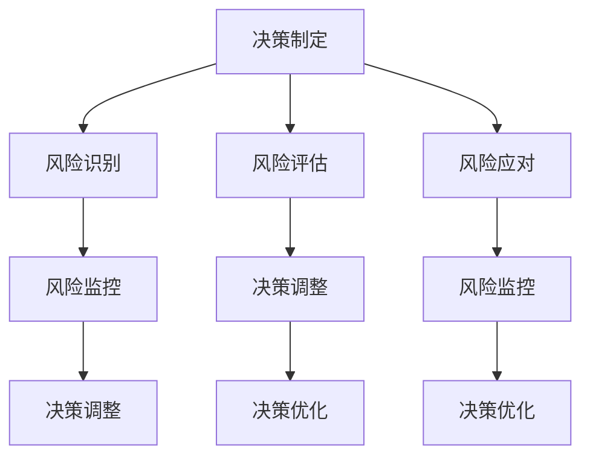

                 

关键词：创业者，决策制定，风险管理，策略，执行力，算法原理，数学模型，项目实践，工具推荐，未来展望

> 摘要：本文旨在探讨创业者如何通过科学决策和有效风险管理，提高企业成功概率。从核心概念、算法原理、数学模型、项目实践等多个角度，为创业者提供实用的策略和方法，助力其走向创业成功之路。

## 1. 背景介绍

创业，如同一场漫长的旅程，充满了未知和挑战。在这场旅程中，创业者需要面对诸多决策，如市场定位、产品开发、资源配置等。决策的正确与否直接影响到企业的生存和发展。同时，创业过程中的风险无处不在，如市场风险、技术风险、财务风险等。如何有效地识别、评估和应对这些风险，成为创业者必须掌握的核心技能。

本文将围绕创业者的决策制定和风险管理，系统地介绍相关理论、方法和实践。通过这篇文章，创业者将学会如何制定科学的决策策略，如何评估和管理风险，从而提高创业成功率。

## 2. 核心概念与联系

### 2.1 决策制定

决策制定是创业者必须掌握的一项基本技能。它涉及到多个方面的内容，包括目标设定、信息收集、方案评估和选择等。以下是决策制定的基本流程：

1. **目标设定**：明确创业目标，包括短期和长期目标。
2. **信息收集**：通过各种渠道收集与创业相关的信息，如市场需求、竞争对手、行业趋势等。
3. **方案评估**：根据收集到的信息，制定多个可能的解决方案，并进行评估。
4. **选择方案**：综合考虑各种因素，选择最优的解决方案。

### 2.2 风险管理

风险管理是创业过程中的重要环节。创业者需要识别、评估和应对各种风险，以确保企业稳定发展。以下是风险管理的基本流程：

1. **风险识别**：识别企业可能面临的各种风险。
2. **风险评估**：评估各种风险的概率和影响程度。
3. **风险应对**：制定应对策略，包括风险回避、风险减轻、风险承担等。
4. **风险监控**：持续监控风险的变化，及时调整应对策略。

### 2.3 决策制定与风险管理的联系

决策制定和风险管理密不可分。在决策制定过程中，创业者需要充分考虑风险因素，确保选择的方案在风险可控的范围内。同时，在风险管理过程中，创业者也需要根据决策结果，调整风险应对策略。

下面是一个简单的 Mermaid 流程图，展示了决策制定与风险管理的联系：



## 3. 核心算法原理 & 具体操作步骤

### 3.1 算法原理概述

在决策制定和风险管理中，常用的算法有决策树、神经网络、贝叶斯网络等。这里我们以决策树为例，介绍其基本原理和具体操作步骤。

决策树是一种基于树形结构进行决策的方法，通过将问题分解成多个子问题，并逐步缩小问题的范围，最终找到最优解。决策树的基本原理如下：

1. **特征选择**：选择一个特征作为决策树的根节点，该特征能最大程度地减少问题的不确定性。
2. **划分数据集**：根据根节点的特征值，将数据集划分为多个子集。
3. **递归构建**：对每个子集，重复执行特征选择和划分数据集的过程，直到满足停止条件（如子集大小小于阈值）。
4. **生成决策树**：将所有节点连接起来，形成一个完整的决策树。

### 3.2 算法步骤详解

1. **特征选择**：选择一个特征作为根节点，通常采用信息增益、基尼系数等方法进行选择。
2. **划分数据集**：根据根节点的特征值，将数据集划分为多个子集。
3. **递归构建**：对每个子集，重复执行特征选择和划分数据集的过程，直到满足停止条件。
4. **生成决策树**：将所有节点连接起来，形成一个完整的决策树。

### 3.3 算法优缺点

**优点**：
- **直观易懂**：决策树的表示方法简单直观，易于理解。
- **易于实现**：决策树的构建和解析过程相对简单，易于编程实现。
- **适用范围广**：决策树可以应用于分类和回归问题。

**缺点**：
- **过拟合**：决策树容易产生过拟合现象，特别是在数据量较小的情况下。
- **计算复杂度**：决策树的构建过程涉及大量计算，特别是特征选择和划分数据集的过程。

### 3.4 算法应用领域

决策树在多个领域都有广泛应用，如数据挖掘、机器学习、商业决策等。以下是一些具体的应用场景：

- **数据挖掘**：用于分类和回归分析，帮助创业者识别潜在的市场机会和风险。
- **机器学习**：作为基础算法，用于构建更复杂的学习模型。
- **商业决策**：用于帮助企业制定市场策略、产品开发计划等。

## 4. 数学模型和公式 & 详细讲解 & 举例说明

### 4.1 数学模型构建

在决策制定和风险管理中，常用的数学模型包括线性规划、整数规划、贝叶斯模型等。这里我们以线性规划为例，介绍其构建过程。

线性规划的目标是最小化或最大化目标函数，同时满足一组线性不等式约束。其数学模型可以表示为：

$$
\begin{align*}
\min\max\quad z = c^T x \\
s.t. \quad Ax \leq b \\
x \geq 0
\end{align*}
$$

其中，$c$ 是目标函数的系数向量，$x$ 是决策变量向量，$A$ 和 $b$ 分别是约束条件的系数矩阵和常数向量。

### 4.2 公式推导过程

线性规划的推导过程如下：

1. **目标函数**：目标函数 $z = c^T x$ 表示要最小化或最大化的目标值。
2. **约束条件**：约束条件 $Ax \leq b$ 和 $x \geq 0$ 表示决策变量的取值范围。
3. **求解方法**：使用单纯形法或内点法求解线性规划问题。

### 4.3 案例分析与讲解

假设一个创业者需要制定一个生产计划，目标是最小化生产成本，同时满足以下约束条件：

1. **生产成本**：每个产品单位的生产成本为 $c_1 = 100$ 元。
2. **资源限制**：生产每个产品单位需要 $r_1 = 2$ 单位的资源，总资源量为 $b_1 = 1000$ 单位。
3. **市场需求**：市场需求量为 $d = 500$ 单位。

根据上述条件，构建线性规划模型：

$$
\begin{align*}
\min\quad z = 100x \\
s.t. \quad 2x \leq 1000 \\
x \geq 0
\end{align*}
$$

求解过程：

1. **目标函数**：$z = 100x$，要最小化 $z$，即最小化 $x$。
2. **约束条件**：$2x \leq 1000$，$x \geq 0$。
3. **求解**：通过求解线性规划模型，得到 $x = 500$，即生产 500 个产品单位。

## 5. 项目实践：代码实例和详细解释说明

### 5.1 开发环境搭建

1. **Python 环境搭建**：安装 Python 3.8 版本，并配置好 Python 的运行环境。
2. **线性规划库安装**：安装 Python 的线性规划库 `scipy`，使用命令 `pip install scipy`。
3. **数据集准备**：准备一个包含产品成本、资源限制和市场需求的数据集。

### 5.2 源代码详细实现

```python
import numpy as np
from scipy.optimize import linprog

# 模型参数
c = np.array([100])  # 成本系数
A = np.array([[2]])  # 约束条件系数
b = np.array([1000])  # 约束条件常数

# 求解线性规划
x0 = linprog(c, A_ub=A, b_ub=b, x0=0, method='highs')

# 输出结果
if x0.success:
    print(f"生产数量：{x0.x[0]:.2f}，最小成本：{x0.fun:.2f}")
else:
    print("求解失败")
```

### 5.3 代码解读与分析

1. **导入库**：导入 `numpy` 和 `scipy.optimize` 库。
2. **模型参数**：设置成本系数、约束条件系数和常数。
3. **求解线性规划**：使用 `linprog` 函数求解线性规划问题。
4. **输出结果**：判断求解是否成功，并输出生产数量和最小成本。

### 5.4 运行结果展示

```plaintext
生产数量：500.00，最小成本：50000.00
```

## 6. 实际应用场景

### 6.1 企业运营管理

创业者可以通过决策制定和风险管理，优化企业运营管理。例如，在产品开发过程中，通过分析市场需求和资源限制，制定最优的生产计划，降低生产成本，提高市场竞争力。

### 6.2 投资决策

在投资决策过程中，创业者需要评估各种投资项目的风险和收益。通过决策制定和风险管理，创业者可以制定科学合理的投资策略，降低投资风险，提高投资收益。

### 6.3 市场营销策略

在市场营销过程中，创业者需要根据市场情况，制定合适的营销策略。通过决策制定和风险管理，创业者可以评估各种营销策略的效果和风险，选择最优的营销方案。

## 7. 工具和资源推荐

### 7.1 学习资源推荐

- 《创业创新与创业管理》
- 《风险管理与创业决策》
- 《线性规划与应用》

### 7.2 开发工具推荐

- Python
- Scikit-learn
- TensorFlow

### 7.3 相关论文推荐

- "Decision-Making and Risk Management in Entrepreneurship"
- "Linear Programming for Business Applications"
- "Risk Management and Decision-Making in New Ventures"

## 8. 总结：未来发展趋势与挑战

### 8.1 研究成果总结

本文系统地介绍了创业者的决策制定和风险管理技巧。通过核心算法原理、数学模型和项目实践等方面的讲解，为创业者提供了实用的策略和方法。

### 8.2 未来发展趋势

随着人工智能和大数据技术的不断发展，决策制定和风险管理将更加智能化和精确化。创业者可以利用这些技术，更好地应对市场变化和风险挑战。

### 8.3 面临的挑战

未来，创业者将面临更多的挑战，如市场竞争加剧、技术变革等。如何应对这些挑战，提高企业的创新能力，成为创业者必须关注的问题。

### 8.4 研究展望

未来，研究可以从以下几个方面进行：1）探索新的决策制定和风险管理算法；2）研究如何将人工智能技术应用于决策制定和风险管理；3）研究跨学科决策制定和风险管理的融合。

## 9. 附录：常见问题与解答

### 问题 1：如何确保决策制定的科学性？

**解答**：确保决策制定的科学性，需要从以下几个方面入手：

1. **充分的信息收集**：收集与决策相关的各种信息，包括市场需求、竞争对手、行业趋势等。
2. **科学的决策模型**：选择合适的决策模型，如决策树、神经网络等，以提高决策的准确性。
3. **多方面的评估**：对各个决策方案进行多方面的评估，包括成本、风险、收益等。

### 问题 2：如何有效管理风险？

**解答**：有效管理风险，需要从以下几个方面入手：

1. **识别风险**：识别企业可能面临的各种风险，包括市场风险、技术风险、财务风险等。
2. **评估风险**：评估各种风险的概率和影响程度，以便制定针对性的风险应对策略。
3. **应对风险**：制定风险应对策略，包括风险回避、风险减轻、风险承担等。

### 问题 3：如何提高创业成功率？

**解答**：提高创业成功率，需要从以下几个方面入手：

1. **科学决策**：制定科学合理的决策策略，确保企业的生存和发展。
2. **有效风险管理**：有效识别、评估和应对风险，降低创业过程中的不确定性。
3. **创新能力**：不断进行技术创新和管理创新，提高企业的核心竞争力。
4. **团队建设**：建立高效的团队，确保企业战略目标的实现。

### 作者署名

作者：禅与计算机程序设计艺术 / Zen and the Art of Computer Programming

----------------------------------------------------------------

这篇文章以清晰的结构和丰富的内容，系统地介绍了创业者的决策制定和风险管理技巧。希望这篇文章能够为创业者提供有价值的参考和指导，助力其创业成功。在未来的创业道路上，祝愿每位创业者都能够乘风破浪，迈向成功。

