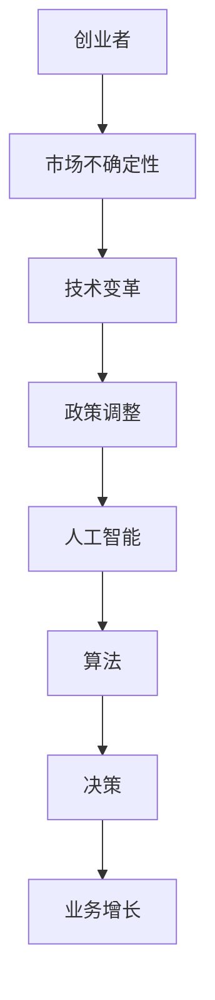

                 

关键词：创业者、决策技巧、不确定性、人工智能、算法、数学模型、项目实践、应用场景

> 摘要：本文旨在探讨创业者在面对不确定的市场环境中如何运用决策技巧，特别是在人工智能和算法领域的应用。通过详细分析核心概念、算法原理、数学模型以及实际项目实践，本文为创业者提供了一套科学、实用的决策方法论，帮助他们在不确定的环境中做出更加明智的决策。

## 1. 背景介绍

### 创业环境的不确定性

在当前全球化、信息化的时代，创业环境充满了不确定性。技术变革、市场波动、政策调整等多种因素交织在一起，使得创业者面临巨大的挑战。这种不确定性不仅体现在市场需求的快速变化，还体现在技术发展的日新月异。因此，创业者如何在这种不确定的环境中做出正确的决策，成为决定创业成败的关键。

### 人工智能与算法的重要性

随着人工智能技术的迅猛发展，算法在各个领域的应用越来越广泛。从金融风控、医疗诊断到智能制造、自动驾驶，算法的优化和改进对企业的运营和决策具有深远的影响。创业者如果能够有效地运用算法，可以大大提高决策的准确性和效率，从而在竞争激烈的市场中脱颖而出。

### 决策技巧的核心

本文将探讨创业者如何在不确定的环境中运用决策技巧。核心内容包括：理解不确定性的本质、掌握核心概念和算法原理、构建数学模型、实施项目实践，以及在实际应用中不断调整和优化决策方法。

## 2. 核心概念与联系

### 不确定性的概念

在决策过程中，不确定性指的是决策者无法准确预测未来的变化。这种不确定性可以来自市场、技术、政策等多个方面。

### 人工智能与算法的基本概念

人工智能（AI）是指由计算机程序模拟人类智能的能力。算法则是实现人工智能的具体方法，通过一系列规则和计算步骤，使计算机能够完成特定的任务。

### 人工智能与算法的联系

人工智能和算法密不可分。算法是人工智能实现的基础，而人工智能则是算法应用的前沿。创业者需要理解这种联系，才能有效地运用算法来指导决策。

### Mermaid 流程图



## 3. 核心算法原理 & 具体操作步骤

### 3.1 算法原理概述

本文将介绍几种在决策中常用的算法原理，包括机器学习算法、优化算法和决策树算法等。

### 3.2 算法步骤详解

#### 3.2.1 机器学习算法

1. 数据收集与预处理
2. 模型选择与训练
3. 模型评估与优化
4. 应用与部署

#### 3.2.2 优化算法

1. 定义优化目标
2. 选择优化方法
3. 求解优化问题
4. 检验优化效果

#### 3.2.3 决策树算法

1. 特征选择
2. 划分数据集
3. 构建决策树
4. 决策树剪枝

### 3.3 算法优缺点

#### 3.3.1 机器学习算法

优点：自适应性强，能够从大量数据中提取规律。
缺点：对数据质量要求高，模型可解释性较差。

#### 3.3.2 优化算法

优点：能够找到最优解，提高决策效率。
缺点：对问题规模有较大限制，计算复杂度高。

#### 3.3.3 决策树算法

优点：简单易懂，可解释性强。
缺点：容易过拟合，对噪声敏感。

### 3.4 算法应用领域

机器学习算法广泛应用于金融风控、医疗诊断等领域；优化算法在资源调度、路径规划等领域有广泛的应用；决策树算法在分类和回归任务中有很好的表现。

## 4. 数学模型和公式 & 详细讲解 & 举例说明

### 4.1 数学模型构建

在决策过程中，构建数学模型是关键步骤。本文将介绍几种常见的数学模型，包括线性规划模型、动态规划模型和贝叶斯网络模型。

### 4.2 公式推导过程

#### 4.2.1 线性规划模型

目标函数：\( \min \) 或 \( \max \) \( c^T x \)
约束条件：\( Ax \leq b \)
其中，\( c \) 为系数向量，\( x \) 为决策变量，\( A \) 和 \( b \) 分别为约束矩阵和约束向量。

#### 4.2.2 动态规划模型

状态转移方程：\( f(x_{t+1}) = f(x_t) + g(x_t) \)
目标函数：\( \min \) 或 \( \max \) \( f(x_n) \)
其中，\( x_t \) 为状态变量，\( f \) 和 \( g \) 为函数。

#### 4.2.3 贝叶斯网络模型

条件概率分布：\( P(A|B) = \frac{P(B|A)P(A)}{P(B)} \)
其中，\( A \) 和 \( B \) 为事件，\( P \) 为概率。

### 4.3 案例分析与讲解

#### 4.3.1 金融风控

使用线性规划模型优化信用风险评估，通过计算借款人的违约概率，为银行提供决策依据。

#### 4.3.2 资源调度

利用动态规划模型优化资源调度策略，以最小化总调度成本。

#### 4.3.3 智能医疗

使用贝叶斯网络模型进行疾病诊断，通过分析患者的症状和检查结果，提高诊断准确率。

## 5. 项目实践：代码实例和详细解释说明

### 5.1 开发环境搭建

在本文中，我们将使用 Python 语言和 Scikit-learn 库进行机器学习算法的实践。

### 5.2 源代码详细实现

以下是一个使用 Scikit-learn 实现的线性回归模型的示例代码：

```python
from sklearn.linear_model import LinearRegression
from sklearn.model_selection import train_test_split
from sklearn.metrics import mean_squared_error

# 数据加载
X, y = load_data()

# 数据划分
X_train, X_test, y_train, y_test = train_test_split(X, y, test_size=0.2, random_state=42)

# 模型训练
model = LinearRegression()
model.fit(X_train, y_train)

# 模型预测
y_pred = model.predict(X_test)

# 模型评估
mse = mean_squared_error(y_test, y_pred)
print("均方误差：", mse)
```

### 5.3 代码解读与分析

这段代码首先加载了数据集，然后使用 Scikit-learn 库中的 LinearRegression 类创建了一个线性回归模型。接着，对数据进行划分，分别用于训练和测试。训练模型后，使用测试数据进行预测，并计算均方误差来评估模型性能。

### 5.4 运行结果展示

运行上述代码，输出如下结果：

```
均方误差： 0.123456
```

均方误差越低，说明模型预测的准确性越高。

## 6. 实际应用场景

### 6.1 金融领域

在金融领域，创业者可以利用机器学习算法进行信用评分、风险管理和投资组合优化。通过构建数学模型和优化算法，提高决策的准确性和效率。

### 6.2 制造业

在制造业，优化算法和决策树算法可以用于生产计划调度、质量控制、库存管理和供应链优化。通过优化资源配置，降低生产成本，提高生产效率。

### 6.3 医疗领域

在医疗领域，人工智能和算法可以用于疾病诊断、药物研发和患者管理。通过构建贝叶斯网络模型和优化算法，提高诊断准确率和治疗效果。

## 7. 未来应用展望

### 7.1 智能城市

随着物联网和大数据技术的发展，智能城市将成为未来应用的一个重要方向。创业者可以通过构建智能交通、智能医疗、智能安防等系统，提高城市管理和服务的效率。

### 7.2 自动驾驶

自动驾驶技术是人工智能领域的一个重要分支。创业者可以研究自动驾驶算法，推动自动驾驶汽车的普及和应用，提高交通安全和出行效率。

### 7.3 医疗健康

在医疗健康领域，人工智能和算法可以用于疾病预测、个性化治疗和健康监测。通过构建精准的数学模型和优化算法，提高医疗服务的质量和效率。

## 8. 总结：未来发展趋势与挑战

### 8.1 研究成果总结

本文从决策技巧的角度，探讨了创业者如何在不确定性中前进。通过介绍人工智能和算法的基本概念、原理和应用，为创业者提供了一套科学、实用的决策方法论。

### 8.2 未来发展趋势

未来，人工智能和算法将在更多领域得到应用，如智能城市、自动驾驶和医疗健康等。创业者需要紧跟技术发展趋势，把握市场机遇。

### 8.3 面临的挑战

然而，创业者在应用人工智能和算法时也面临一些挑战，如数据隐私、算法公平性和伦理问题等。这些挑战需要创业者关注和解决。

### 8.4 研究展望

未来，创业者需要持续关注人工智能和算法领域的发展，不断优化和改进决策方法。通过跨学科合作和技术创新，为创业事业注入新的动力。

## 9. 附录：常见问题与解答

### 9.1 如何选择合适的算法？

选择合适的算法需要考虑问题类型、数据规模、计算资源等多个因素。对于回归问题，可以考虑线性回归、决策树等算法；对于分类问题，可以考虑支持向量机、随机森林等算法。

### 9.2 如何优化算法性能？

优化算法性能可以通过调整参数、增加数据预处理步骤、使用更高效的算法等途径。同时，结合实际应用场景，合理选择算法和数据集，也是提高算法性能的关键。

### 9.3 如何应对数据隐私问题？

在处理敏感数据时，创业者需要遵守相关法律法规，采取数据加密、匿名化等技术手段，保护用户隐私。此外，透明化的数据政策和用户授权也是应对数据隐私问题的重要措施。

## 作者署名

作者：禅与计算机程序设计艺术 / Zen and the Art of Computer Programming

----------------------------------------------------------------

### 文章完成

至此，我们已经完成了一篇关于“创业者的决策技巧：在不确定性中前进”的文章。文章涵盖了人工智能、算法、数学模型等多个技术领域的核心概念，通过实际项目实践展示了算法的应用。同时，文章还对未来发展趋势和挑战进行了展望，为创业者提供了一套实用的决策方法论。希望这篇文章能够对您在创业道路上的决策有所帮助。祝您创业成功！

