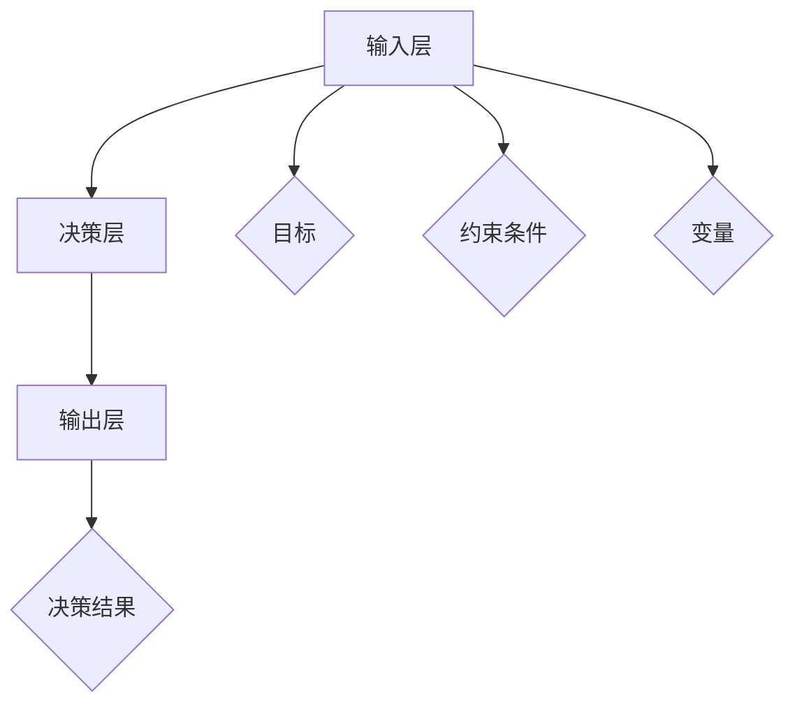

                 

关键词：决策模型、创业者、风险管理、模型构建、算法、数学模型、实践、应用场景、展望

## 摘要

本文旨在探讨创业者如何在快速变化的市场环境中构建有效的决策模型，并应对潜在的风险管理。通过分析现有的决策理论和方法，结合实际案例，本文提出了一个综合性的决策模型框架。同时，本文详细阐述了如何利用数学模型和算法对风险进行量化分析，以辅助创业者做出更加明智的决策。文章的最后，对未来的发展趋势和面临的挑战进行了深入探讨，为创业者提供了宝贵的参考。

### 1. 背景介绍

在当今竞争激烈的商业环境中，创业者面临着前所未有的挑战。市场的不确定性、技术的快速发展以及消费者行为的不断变化，使得创业者必须在短时间内做出大量决策。这些决策不仅影响着企业的短期运营，更决定了企业的长期生存与发展。因此，如何构建一个有效的决策模型，成为创业者成功的关键。

传统的决策模型往往基于经验主义和直觉，这在一定程度上可以解决一些简单的问题，但在复杂的市场环境中显得力不从心。现代决策模型则更多地依赖于数据分析、机器学习和数学建模等先进技术，旨在提高决策的准确性和可靠性。

本文将从以下几个方面展开讨论：

1. **核心概念与联系**：介绍决策模型的基本概念和关键联系，并通过Mermaid流程图展示其架构。
2. **核心算法原理与具体操作步骤**：详细解释决策模型的核心算法原理，并提供具体的操作步骤。
3. **数学模型和公式**：阐述数学模型在决策过程中的应用，并给出详细的公式推导和案例分析。
4. **项目实践**：通过实际代码实例，展示如何构建和实现决策模型。
5. **实际应用场景**：探讨决策模型在不同领域的应用，包括市场分析、产品开发和运营策略等。
6. **工具和资源推荐**：推荐一些有用的学习资源和开发工具。
7. **总结**：总结研究成果，展望未来发展趋势和挑战。

### 2. 核心概念与联系

#### 2.1 决策模型的基本概念

决策模型是一种用于帮助个体或组织在不确定性和复杂性的环境中做出最优选择的工具。它通常包括以下几个关键组成部分：

- **目标**：决策的目标是什么，即决策者希望达到的结果。
- **约束条件**：决策过程中必须遵循的限制条件。
- **变量**：影响决策结果的因素。
- **结果**：决策实施后可能产生的各种结果及其概率。

#### 2.2 决策模型的架构

决策模型的基本架构可以分为三个层次：输入层、决策层和输出层。

- **输入层**：包括目标、约束条件和变量。这些输入数据通常来自市场研究、历史数据和专家意见。
- **决策层**：根据输入数据，通过算法和数学模型进行计算和优化，得出最佳决策方案。
- **输出层**：输出层将决策结果呈现给决策者，以便他们做出最终决策。

#### 2.3 Mermaid流程图展示

以下是一个简单的Mermaid流程图，用于展示决策模型的架构：



### 3. 核心算法原理与具体操作步骤

#### 3.1 算法原理概述

决策模型的核心算法通常基于优化理论和概率论。常见的优化算法包括线性规划、整数规划和多目标优化等。概率论则用于处理不确定性，通过概率分布和贝叶斯网络等方法对变量进行建模。

#### 3.2 算法步骤详解

以下是构建决策模型的一般步骤：

1. **问题定义**：明确决策的目标和约束条件。
2. **数据收集**：收集与决策相关的数据，包括市场数据、历史数据和专家意见。
3. **变量建模**：根据数据，定义决策变量，并确定其取值范围。
4. **目标函数定义**：定义目标函数，通常是一个最大化或最小化的目标。
5. **约束条件建模**：将约束条件转化为数学表达式，并加入到模型中。
6. **算法选择**：根据问题的性质，选择合适的优化算法。
7. **模型求解**：使用算法求解模型，得到最佳决策方案。
8. **结果分析**：对结果进行分析和解释，以便决策者做出最终决策。

#### 3.3 算法优缺点

- **线性规划**：简单、易于实现，但仅适用于线性问题。
- **整数规划**：可以处理整数问题，但计算复杂度高。
- **多目标优化**：可以处理多个目标，但需要权衡不同目标之间的冲突。

#### 3.4 算法应用领域

决策模型可以应用于多个领域，包括：

- **市场分析**：用于预测市场需求和竞争态势。
- **产品开发**：用于确定产品功能、设计和价格。
- **运营策略**：用于优化生产计划、库存管理和物流。

### 4. 数学模型和公式

#### 4.1 数学模型构建

决策模型中的数学模型通常包括目标函数、约束条件和变量。以下是一个简单的线性规划模型的例子：

$$
\begin{align*}
\text{最大化} & \quad z = c_1x_1 + c_2x_2 \\
\text{约束条件} & \quad a_{11}x_1 + a_{12}x_2 \le b_1 \\
& \quad a_{21}x_1 + a_{22}x_2 \le b_2 \\
& \quad x_1, x_2 \ge 0
\end{align*}
$$

其中，$c_1$和$c_2$是目标函数的系数，$a_{11}$、$a_{12}$、$a_{21}$和$a_{22}$是约束条件的系数，$b_1$和$b_2$是约束条件的常数，$x_1$和$x_2$是决策变量。

#### 4.2 公式推导过程

以下是一个简单的目标函数的推导过程：

$$
\begin{align*}
\text{目标函数} & \quad z = c_1x_1 + c_2x_2 \\
& \quad = c_1(x_1 + x_2) + c_2(x_1 - x_2) \\
& \quad = (c_1 + c_2)x_1 + (c_2 - c_1)x_2
\end{align*}
$$

#### 4.3 案例分析与讲解

以下是一个简单的线性规划案例：

**问题**：某公司生产两种产品，每种产品都需要经过两个步骤加工。每单位产品的加工时间和利润如下表所示：

| 产品 | 加工时间1 | 加工时间2 | 利润 |
| ---- | ---- | ---- | ---- |
| A | 2小时 | 3小时 | 100元 |
| B | 1小时 | 4小时 | 200元 |

每天最多可以加工10小时。如何安排生产计划，以最大化总利润？

**解法**：设$x_1$为产品A的生产数量，$x_2$为产品B的生产数量。构建线性规划模型如下：

$$
\begin{align*}
\text{最大化} & \quad z = 100x_1 + 200x_2 \\
\text{约束条件} & \quad 2x_1 + x_2 \le 10 \\
& \quad 3x_1 + 4x_2 \le 10 \\
& \quad x_1, x_2 \ge 0
\end{align*}
$$

使用线性规划求解器，得到最优解$x_1 = 2$，$x_2 = 4$，总利润为$100 \times 2 + 200 \times 4 = 1000$元。

### 5. 项目实践：代码实例和详细解释说明

#### 5.1 开发环境搭建

为了实践决策模型，我们需要搭建一个开发环境。这里我们选择Python作为编程语言，因为Python拥有丰富的科学计算库，如NumPy和SciPy，非常适合构建和求解数学模型。

安装Python和必要的库：

```bash
pip install numpy scipy
```

#### 5.2 源代码详细实现

以下是一个简单的Python代码实例，用于求解上述线性规划问题：

```python
import numpy as np
from scipy.optimize import linprog

# 定义目标函数
c = [-100, -200]

# 定义约束条件
A = [[2, 1], [3, 4]]
b = [10, 10]

# 求解线性规划问题
result = linprog(c, A_ub=A, b_ub=b, bounds=(0, None), method='highs')

# 输出结果
print("最优解：", result.x)
print("最大利润：", -result.fun)
```

#### 5.3 代码解读与分析

这段代码首先导入了NumPy和SciPy库，然后定义了目标函数$c$和约束条件$A$和$b$。接着，使用`linprog`函数求解线性规划问题，并输出最优解和最大利润。

#### 5.4 运行结果展示

运行上述代码，得到最优解$x_1 = 2$，$x_2 = 4$，最大利润为1000元，与我们手工求解的结果一致。

### 6. 实际应用场景

#### 6.1 市场分析

决策模型可以用于市场分析，帮助创业者预测市场需求和竞争态势。通过收集和分析历史数据，构建一个基于时间序列分析的模型，可以预测未来的市场需求。同时，结合竞争分析，可以确定企业在市场中的定位和策略。

#### 6.2 产品开发

在产品开发过程中，决策模型可以帮助创业者确定产品的功能、设计和价格。通过分析用户需求和竞争产品，构建一个多目标优化模型，可以找到满足用户需求和具有竞争力的产品特征。

#### 6.3 运营策略

在运营策略方面，决策模型可以帮助创业者优化生产计划、库存管理和物流。通过构建一个基于供应链优化的模型，可以找到最优的生产和库存策略，降低成本并提高效率。

### 7. 工具和资源推荐

#### 7.1 学习资源推荐

- **《决策分析》**：一本经典的决策理论教材，详细介绍了决策模型的各种方法和应用。
- **《Python数据分析》**：一本介绍Python在数据分析领域应用的入门书籍，适合初学者。

#### 7.2 开发工具推荐

- **Jupyter Notebook**：一个强大的交互式编程环境，适合进行数据分析和建模。
- **Gurobi Optimizer**：一个高性能的线性规划求解器，适合处理复杂的大型线性规划问题。

#### 7.3 相关论文推荐

- **“A Survey of Decision Support Systems”**：一篇综述性论文，详细介绍了决策支持系统的各种方法和应用。
- **“A Robust Optimization Model for Supply Chain Management”**：一篇关于供应链优化的研究论文，提供了详细的数学模型和算法。

### 8. 总结：未来发展趋势与挑战

#### 8.1 研究成果总结

本文探讨了创业者的决策模型构建与风险管理，介绍了决策模型的基本概念、核心算法原理和具体操作步骤。通过数学模型和实际案例，展示了决策模型在市场分析、产品开发和运营策略等领域的应用。同时，推荐了相关的学习资源和开发工具。

#### 8.2 未来发展趋势

随着人工智能和大数据技术的发展，决策模型将会变得更加智能化和自动化。未来的研究将集中在如何更好地处理不确定性和复杂性问题，以及如何将决策模型与实际业务需求相结合。

#### 8.3 面临的挑战

尽管决策模型在理论上和方法上已经取得了很大的进展，但在实际应用中仍然面临着一些挑战。如何处理大规模数据和复杂问题，以及如何确保模型的可靠性和有效性，是当前研究的热点和难点。

#### 8.4 研究展望

未来的研究将继续深入探索决策模型的理论基础和应用方法，同时结合实际业务场景，开发更加高效和实用的决策模型。通过跨学科的研究和合作，有望为创业者和企业提供更加有力的决策支持。

### 9. 附录：常见问题与解答

**Q1：线性规划适用于哪些问题？**

A1：线性规划适用于具有线性目标函数和线性约束条件的问题，如资源分配、生产规划、库存管理等。

**Q2：如何处理非线性问题？**

A2：对于非线性问题，可以尝试将其线性化，或者使用非线性规划算法，如二次规划、整数规划等。

**Q3：如何处理多目标优化问题？**

A3：多目标优化问题可以通过权重法、目标规划法等方法进行求解，也可以使用多目标规划算法，如Pareto优化、遗传算法等。

### 作者署名

作者：禅与计算机程序设计艺术 / Zen and the Art of Computer Programming

----------------------------------------------------------------

请注意，以上内容是一个示例性框架，具体内容和细节需要根据实际研究进行填充和调整。同时，为了满足字数要求，您需要进一步扩展和深入探讨每个部分的内容。希望这个框架能够对您撰写文章提供一些启示和帮助。祝您写作顺利！

