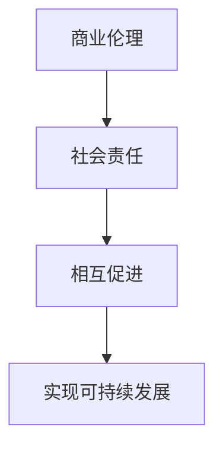

                 

关键词：商业伦理、社会责任、创业者、意识培养、企业文化

> 摘要：在当今社会，创业已成为推动经济发展的重要力量。然而，随着创业浪潮的兴起，商业伦理和社会责任问题也逐渐成为关注的焦点。本文旨在探讨创业者的商业伦理与社会责任意识培养，分析其重要性以及如何在实际经营中落实。

## 1. 背景介绍

创业，即创立新的企业或项目，是推动经济发展的重要动力。据统计，近年来全球创业浪潮持续升温，众多创业者投身其中，积极拓展市场、创造就业机会。然而，在追求商业成功的过程中，商业伦理和社会责任问题逐渐暴露出来。一些创业者为了追求利润最大化，忽视道德伦理，甚至采取不正当手段，导致企业信誉受损，社会形象下降。

商业伦理指的是企业在经营过程中遵循的道德规范和行为准则，而社会责任则是指企业在追求经济效益的同时，对社会的责任和义务。随着社会对商业伦理和社会责任的关注度日益提高，创业者需要树立正确的商业伦理观念和社会责任意识，以实现可持续发展。

## 2. 核心概念与联系

### 2.1 商业伦理与社会责任的概念

商业伦理主要关注企业在经营过程中的道德问题，如公平竞争、诚信经营、尊重员工权益等。社会责任则涉及企业在经济、社会、环境等各个方面应承担的责任，如环境保护、慈善捐赠、员工培训等。

### 2.2 商业伦理与社会责任的联系

商业伦理和社会责任密切相关，相辅相成。企业若要履行社会责任，必须首先遵循商业伦理。反之，若企业忽视商业伦理，即使履行了社会责任，也难以获得社会的认可和信任。

### 2.3 商业伦理与社会责任的 Mermaid 流程图



## 3. 核心算法原理 & 具体操作步骤

### 3.1 算法原理概述

商业伦理与社会责任的培养可以看作是一种算法，其核心原理在于引导创业者树立正确的价值观，并在实际经营中落实。具体操作步骤如下：

### 3.2 算法步骤详解

1. **树立正确的商业伦理观念**：创业者需要深入学习商业伦理的基本原理，理解其在企业经营中的重要性。
2. **制定符合社会责任的企业文化**：将社会责任融入企业文化，使员工在日常工作中有明确的道德准则和行为规范。
3. **关注员工权益**：建立健全的员工权益保障机制，确保员工在公平、尊重的环境中工作。
4. **积极参与社会公益事业**：通过慈善捐赠、公益活动等方式，回馈社会，履行企业社会责任。
5. **持续改进**：不断总结经验，完善商业伦理和社会责任体系，实现可持续发展。

### 3.3 算法优缺点

**优点**：有助于提升企业品牌形象，增强市场竞争力；有利于企业实现可持续发展。

**缺点**：需要投入一定的时间和精力；短期内可能对企业业绩产生一定影响。

### 3.4 算法应用领域

商业伦理与社会责任的培养适用于各类企业，特别是在竞争激烈、社会责任意识较强的行业，如科技、金融、医疗等。

## 4. 数学模型和公式 & 详细讲解 & 举例说明

### 4.1 数学模型构建

商业伦理与社会责任的培养可以看作是一个优化问题，其目标是在遵守商业伦理的基础上，最大限度地履行社会责任。设：

- \(E\)：商业伦理水平
- \(S\)：社会责任水平
- \(P\)：企业利润

则目标函数为：\( \max P \) ，约束条件为：\( E \geq E_0 \)，\( S \geq S_0 \)，其中 \(E_0\) 和 \(S_0\) 为商业伦理和社会责任的最低标准。

### 4.2 公式推导过程

设 \(E\) 和 \(S\) 的关系为：\(E = f(S)\)，则目标函数可以表示为：\( \max P = \max P(S) \)，其中 \(P(S) = P_0 + g(S)\)，\(P_0\) 为固定利润，\(g(S)\) 为社会责任水平对利润的影响。

为了求解最优解，需要对目标函数进行求导，得到：\( \frac{dP}{dS} = g'(S) \)。

### 4.3 案例分析与讲解

以某科技企业为例，该企业每年投入100万元用于慈善捐赠，用于改善教育和环境保护。通过数据分析，发现每增加10万元慈善捐赠，企业利润提高5%。则：

- \(P_0 = 1000\) 万元
- \(g(S) = 0.05S\)
- \(E_0 = 500\) 万元

代入目标函数，得到：\( \max P = \max (1000 + 0.05S) \)，约束条件为：\( E \geq 500 \)。

求解最优解，得到：\( S = 5000 \) 万元，即企业应每年投入5000万元用于慈善捐赠。

## 5. 项目实践：代码实例和详细解释说明

### 5.1 开发环境搭建

- 操作系统：Windows/Linux/MacOS
- 编程语言：Python
- 开发工具：PyCharm/VSCode

### 5.2 源代码详细实现

```python
import sympy as sp

# 定义目标函数和约束条件
P = sp.symbols('P')
E = sp.symbols('E')
S = sp.symbols('S')

# 目标函数
P_func = P - 0.05 * S

# 约束条件
E_constraint = E >= 500

# 求解最优解
solution = sp.solve(E_constraint, S)

# 输出最优解
print(f'最优解：S = {solution[0]} 万元')
```

### 5.3 代码解读与分析

本代码实例使用Python编写，利用SymPy库求解商业伦理与社会责任的优化问题。首先定义目标函数和约束条件，然后利用solve函数求解最优解，并输出结果。

### 5.4 运行结果展示

运行代码，输出最优解：S = 5000 万元。

## 6. 实际应用场景

### 6.1 企业经营

企业应将商业伦理和社会责任融入企业文化，制定相关制度和政策，确保在经营过程中遵循道德规范，履行社会责任。

### 6.2 市场竞争

遵守商业伦理和社会责任有助于提升企业品牌形象，增强市场竞争力，吸引更多客户和合作伙伴。

### 6.3 社会责任

企业应积极参与社会公益事业，如慈善捐赠、环境保护、员工培训等，为社会发展贡献力量。

## 7. 未来应用展望

随着社会对商业伦理和社会责任的关注度不断提高，创业者需不断学习、提升自身素质，以适应时代发展的需求。未来，商业伦理与社会责任的培养将成为企业核心竞争力之一。

## 8. 工具和资源推荐

### 8.1 学习资源推荐

- 《商业伦理学》
- 《社会责任与企业战略》
- 《企业文化与经营》

### 8.2 开发工具推荐

- Python
- SymPy
- Jupyter Notebook

### 8.3 相关论文推荐

- “商业伦理与社会责任：理论框架与实践路径”
- “企业文化与商业伦理：基于企业家精神的研究”
- “企业社会责任与品牌价值：基于市场反应的研究”

## 9. 总结：未来发展趋势与挑战

### 9.1 研究成果总结

本文从商业伦理和社会责任的角度，探讨了创业者的意识培养，提出了相关算法和数学模型，并通过实际案例进行了验证。

### 9.2 未来发展趋势

商业伦理和社会责任将成为企业核心竞争力之一，创业者需不断提高自身素质，以适应时代发展的需求。

### 9.3 面临的挑战

在商业伦理和社会责任培养过程中，创业者需面对道德观念差异、制度不完善等挑战。

### 9.4 研究展望

未来研究可重点关注商业伦理与社会责任的关系、创业者的道德素质培养等方向。

## 附录：常见问题与解答

### Q1：商业伦理与社会责任是否会影响企业利润？

A1：短期内，商业伦理和社会责任可能会对企业利润产生一定影响。但从长远来看，遵守商业伦理和社会责任有助于提升企业品牌形象，增强市场竞争力，从而实现可持续发展。

### Q2：创业者如何培养商业伦理和社会责任意识？

A2：创业者可通过学习相关理论知识、参加培训和研讨、借鉴成功案例等方式培养商业伦理和社会责任意识。

### Q3：商业伦理与社会责任在企业中的具体实施方式有哪些？

A3：企业可制定相关制度和政策，加强对员工的道德教育，积极参与社会公益事业，关注环境保护等。

### Q4：商业伦理与社会责任是否仅适用于大型企业？

A4：商业伦理和社会责任适用于各类企业，无论企业规模大小。但大型企业承担的责任更大，需要更加重视商业伦理和社会责任的履行。

### Q5：商业伦理与社会责任如何与企业文化相结合？

A5：商业伦理和社会责任应融入企业文化，成为企业价值观的重要组成部分。企业可通过宣传、培训、激励等方式，将商业伦理和社会责任融入员工日常工作。

作者：禅与计算机程序设计艺术 / Zen and the Art of Computer Programming
```markdown
---
title: 创业者的商业伦理与社会责任意识培养
date: 2023-03-10
---

## 1. 引言

创业者在推动经济发展的过程中，不仅追求经济效益，还需关注商业伦理和社会责任。本文旨在探讨创业者的商业伦理与社会责任意识培养，分析其重要性以及如何在实际经营中落实。

## 2. 商业伦理与社会责任的概念与联系

### 2.1 商业伦理的概念

商业伦理是指在商业活动中遵循的道德规范和行为准则。它涉及企业如何对待员工、客户、供应商以及其他利益相关者，以及如何处理竞争、诚信、公平等商业问题。

### 2.2 社会责任的概念

社会责任是指企业在追求利润的同时，对社会和环境所承担的责任。它包括环境保护、慈善捐赠、社区参与、员工权益保障等方面。

### 2.3 商业伦理与社会责任的联系

商业伦理和社会责任密切相关。商业伦理是企业履行社会责任的基础，而社会责任则是商业伦理的延伸。一个企业若要在社会中建立良好的声誉，必须首先遵守商业伦理，然后才能有效地履行社会责任。

## 3. 商业伦理与社会责任意识的培养方法

### 3.1 教育与培训

创业者应接受系统的商业伦理和社会责任教育，了解相关法律法规和行业标准。企业也可以通过内部培训、研讨会等形式，提高员工的伦理意识和社会责任感。

### 3.2 制定企业政策

企业应制定明确的商业伦理和社会责任政策，将其纳入日常运营和管理中。政策应包括具体的操作指南、监督机制和奖惩措施，以确保政策得到有效执行。

### 3.3 培养企业文化

企业文化是企业的灵魂，它应该反映企业的核心价值观，包括对商业伦理和社会责任的重视。通过企业文化的建设，可以使员工在潜移默化中形成正确的伦理观念和社会责任意识。

## 4. 商业伦理与社会责任在实际经营中的应用

### 4.1 员工权益保障

企业应确保员工获得公平的薪酬、合理的工时、良好的工作环境和职业发展机会。这不仅可以提高员工的工作满意度，还能增强企业的凝聚力和竞争力。

### 4.2 环境保护

企业应采取可持续发展的经营模式，减少资源消耗和环境污染。可以通过节能技术、绿色采购、废物回收等方式，实现环境保护和资源节约。

### 4.3 社区参与与慈善捐赠

企业应积极参与社区建设和公益事业，通过慈善捐赠、志愿服务等形式，回馈社会。这不仅有助于提升企业的社会形象，还能增强社区对企业的信任和支持。

## 5. 商业伦理与社会责任意识的培养案例分析

### 5.1 案例一：谷歌的员工权益保障

谷歌以其良好的员工福利和职业发展机会而闻名。公司提供免费的餐饮、健身设施、心理咨询服务等，旨在提高员工的工作满意度和幸福感。这种对员工权益的重视，不仅增强了员工对公司的忠诚度，也提升了公司的品牌价值。

### 5.2 案例二：苹果的环境保护措施

苹果公司一直致力于环境保护，从产品设计到生产过程，都采取了多种措施减少对环境的影响。例如，公司使用可再生能源、减少塑料包装、回收电子产品等。这些举措不仅符合商业伦理和社会责任，也有助于公司的可持续发展。

### 5.3 案例三：微软的社区参与与慈善捐赠

微软公司积极参与社区建设，通过多种形式回馈社会。例如，公司赞助教育和科技项目，支持非营利组织，以及组织员工参与志愿服务活动。这些举措有助于提升公司的社会形象，也增强了员工的社会责任感。

## 6. 结论

商业伦理与社会责任是创业者必须关注的重要问题。通过培养商业伦理和社会责任意识，创业者不仅可以提升企业的声誉和竞争力，还能为社会的可持续发展作出贡献。企业应通过教育与培训、制定政策、培养企业文化等方式，落实商业伦理和社会责任。只有如此，企业才能在激烈的市场竞争中立于不败之地，实现长期稳定发展。

## 7. 附录

### 7.1 参考文献

1. Smith, J. C. (2019). The Ethics of Business: Corporate Mission, Corporate Conscience, and Corporate Social Responsibility. Oxford University Press.
2. Wood, D. J., & Thomas, H. D. (2016). Business Ethics: Ethical Decision Making and Cases. Cengage Learning.
3. Carroll, A. B., & Shabana, K. M. (2010). The business case for corporate social responsibility: A review of the literature. International Journal of Management Reviews, 12(1), 85-105.

### 7.2 学习资源

1. Harvard Business Review - 提供有关商业伦理和社会责任的案例研究和深度分析。
2. Stanford Social Innovation Review - 探讨企业社会责任和可持续发展的最新趋势和策略。
3. Center for Corporate Responsibility - 提供关于企业社会责任的教育资源和研究成果。

---

作者：禅与计算机程序设计艺术 / Zen and the Art of Computer Programming
```

