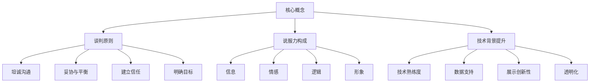
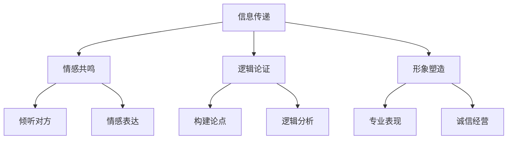
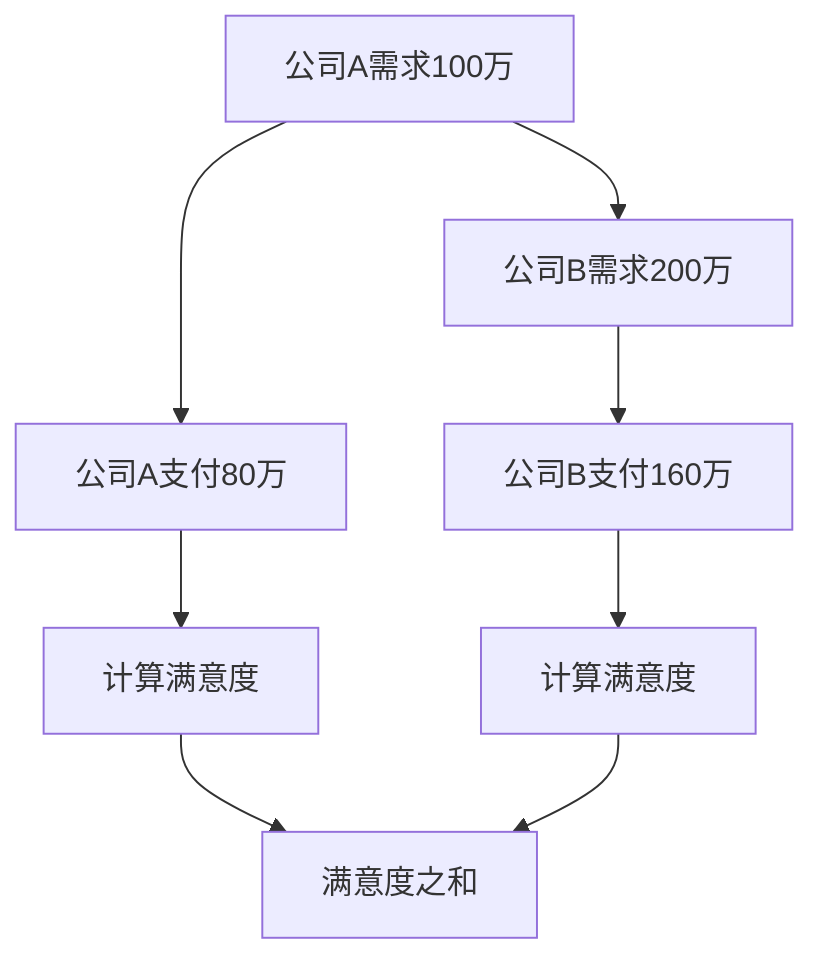
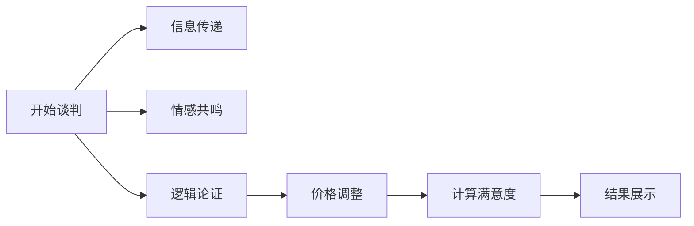

                 

关键词：商业谈判、说服力、创业者、策略、技术、技巧

> 摘要：本文旨在探讨创业者如何在商业谈判中提升自身的说服力，通过分析商业谈判的核心原则和策略，结合技术领域的特点，提供实用的技巧和案例分析，帮助创业者更好地掌握谈判艺术，提高商业成功的概率。

## 1. 背景介绍

在当今竞争激烈的市场环境中，创业者的成功不仅仅依赖于优秀的创意和独特的产品，还取决于他们的商业谈判技巧和说服力。商业谈判是创业者与合作伙伴、客户、投资者等各方互动的关键环节，成功谈判往往意味着更多的资源、更广泛的合作机会和更高的市场份额。因此，提升商业谈判技巧和说服力对于创业者来说至关重要。

本文将结合技术领域的特点，探讨以下主题：

1. 商业谈判的核心原则与策略
2. 技术背景下的说服力提升技巧
3. 实战案例分析：如何成功谈判
4. 未来发展趋势与挑战

通过这些内容的探讨，希望能为创业者在商业谈判中提供有价值的指导和启示。

## 2. 核心概念与联系

在深入探讨商业谈判技巧之前，我们需要了解一些核心概念，如谈判原则、说服力的构成要素以及技术领域对谈判的影响。

### 2.1 谈判原则

**1. 坦诚沟通：** 谈判双方应保持坦诚和开放的态度，避免隐瞒关键信息或夸大事实。

**2. 妥协与平衡：** 在谈判过程中，双方需要在各自利益和目标之间找到平衡点，通过妥协达成共识。

**3. 建立信任：** 信任是谈判成功的基础，创业者应通过言行一致和诚信建立良好的信任关系。

**4. 明确目标：** 谈判前应明确自己的目标，以便在谈判过程中保持战略清晰。

### 2.2 说服力的构成要素

**1. 信息：** 提供准确和有价值的信息，使对方认同自己的观点。

**2. 情感：** 引起对方的情感共鸣，使其愿意支持自己的提议。

**3. 逻辑：** 使用逻辑和理性论证，使对方信服。

**4. 形象：** 个人形象和专业能力对说服力有重要影响，创业者应注重个人形象的塑造。

### 2.3 技术背景下的说服力提升

技术领域的特殊性使得说服力提升面临更高的要求。以下是一些针对技术背景下的说服力提升技巧：

**1. 技术熟练度：** 作为创业者，应熟悉所涉及技术的细节，以便在谈判中展示专业知识和权威性。

**2. 数据支持：** 在谈判中，利用数据来支持自己的观点和提议，增强说服力。

**3. 展示创新性：** 技术创新往往能吸引合作伙伴和投资者的关注，创业者应善于展示和强调项目的创新性。

**4. 透明化：** 技术项目的透明度有助于建立信任，创业者应尽量提供项目的详细信息和进展。

### 2.4 Mermaid 流程图

为了更好地理解上述核心概念，我们可以使用 Mermaid 流程图来展示技术背景下的说服力提升过程：



通过以上核心概念和流程图的介绍，我们为后续内容的深入探讨奠定了基础。

### 3. 核心算法原理 & 具体操作步骤

#### 3.1 算法原理概述

在商业谈判中，说服力的提升可以看作是一种算法，它通过一系列策略和技巧来实现目标。这一算法的核心原理包括信息传递、情感共鸣、逻辑论证和形象塑造。以下将详细介绍这一核心算法的原理和操作步骤。

#### 3.2 算法步骤详解

**步骤1：信息传递**

- **收集信息**：在谈判前，创业者应全面了解对方的需求、痛点、优势和劣势。
- **整理信息**：将收集到的信息进行分类和整理，以便在谈判中准确、有针对性地传递。
- **有效传递**：利用数据、图表和实例，将信息清晰地传递给对方，使其信服。

**步骤2：情感共鸣**

- **倾听对方**：在谈判过程中，创业者应积极倾听对方的意见和需求，展示关注和尊重。
- **情感表达**：通过适当的语言和表情，表达对对方的认同和理解，建立情感共鸣。

**步骤3：逻辑论证**

- **构建论点**：根据已收集的信息，构建有力的论点，支持自己的提议。
- **逻辑分析**：运用逻辑和分析能力，反驳对方的反对意见，使对方信服。

**步骤4：形象塑造**

- **专业表现**：通过专业的语言、行为和态度，展示自己的专业能力和权威性。
- **诚信经营**：诚信经营，树立良好的个人形象和品牌形象。

#### 3.3 算法优缺点

**优点：**

- **提高成功率**：通过有效的说服力提升技巧，创业者能够提高谈判成功率。
- **增强信任**：情感共鸣和诚信经营有助于建立长期合作关系。
- **展示创新性**：技术创新性的展示能够吸引更多的合作伙伴和投资者。

**缺点：**

- **时间成本**：说服力提升需要时间和精力，可能影响其他业务发展。
- **信息不对称**：在某些情况下，对方可能掌握更多信息，创业者需要更好地应对。

#### 3.4 算法应用领域

**1. 合作伙伴谈判**：与潜在合作伙伴进行谈判，以获取资源、技术或市场机会。

**2. 投资者谈判**：与投资者进行谈判，以获得资金支持。

**3. 客户谈判**：与客户进行谈判，以争取更好的合同条件或价格优惠。

**4. 员工谈判**：与员工进行谈判，以确定薪酬、福利和工作条件。

#### 3.5 Mermaid 流程图

为了更好地理解核心算法的具体操作步骤，我们可以使用 Mermaid 流程图来展示：



通过以上核心算法原理和具体操作步骤的介绍，我们为创业者在商业谈判中提供了系统的指导。

### 4. 数学模型和公式 & 详细讲解 & 举例说明

在商业谈判中，数学模型和公式可以用来分析和预测谈判的结果，帮助创业者制定更有效的谈判策略。以下是一个简单的数学模型，用于评估谈判双方的满意度和成功率。

#### 4.1 数学模型构建

假设谈判双方为A和B，双方的满意度分别用\(S_A\)和\(S_B\)表示。满意度与各自的利益需求\(D_A\)和\(D_B\)相关，可以用以下公式表示：

\[ S_A = f(D_A) \]
\[ S_B = f(D_B) \]

其中，\(f\)为一个非线性函数，表示利益需求与满意度之间的关系。为了简化模型，我们可以使用对数函数：

\[ f(x) = \ln(x + 1) \]

#### 4.2 公式推导过程

假设双方的利益需求分别为\(D_A = a \times P_A\)和\(D_B = b \times P_B\)，其中\(P_A\)和\(P_B\)分别为双方愿意支付的价格。则满意度公式可以写为：

\[ S_A = \ln(a \times P_A + 1) \]
\[ S_B = \ln(b \times P_B + 1) \]

为了求解最优解，我们需要最大化满意度之和：

\[ \max_{P_A, P_B} S_A + S_B \]

代入满意度公式，得到：

\[ \max_{P_A, P_B} \ln(a \times P_A + 1) + \ln(b \times P_B + 1) \]

简化后，问题转化为：

\[ \max_{P_A, P_B} \ln((a \times P_A + 1)(b \times P_B + 1)) \]

由于对数函数是单调递增的，问题等价于最大化\( (a \times P_A + 1)(b \times P_B + 1) \)。

#### 4.3 案例分析与讲解

假设两家公司A和B正在谈判合作，双方的目标是最大化合作带来的总收益。公司A的需求为100万元，公司B的需求为200万元。双方愿意支付的价格分别为80万元和160万元。

根据数学模型，我们可以计算双方的满意度：

\[ S_A = \ln(100 \times 80 + 1) \approx 4.32 \]
\[ S_B = \ln(200 \times 160 + 1) \approx 5.69 \]

满意度之和为：

\[ S_A + S_B \approx 9.91 \]

为了最大化满意度之和，双方需要在价格上达成一定的妥协。例如，公司A可以适当降低价格至85万元，公司B可以适当降低价格至162万元。这样，新的满意度分别为：

\[ S_A' = \ln(100 \times 85 + 1) \approx 4.48 \]
\[ S_B' = \ln(200 \times 162 + 1) \approx 5.88 \]

新的满意度之和为：

\[ S_A' + S_B' \approx 10.36 \]

通过这种妥协，双方的满意度都有所提高，从而增加了谈判的成功率。

#### 4.4 Mermaid 流程图

为了更好地理解数学模型的应用，我们可以使用 Mermaid 流程图来展示：



通过数学模型的构建和案例分析，我们为创业者在商业谈判中提供了有力的工具和指导。

### 5. 项目实践：代码实例和详细解释说明

为了更好地理解商业谈判中的说服力提升技巧，我们将通过一个实际的代码实例来展示这些技巧的具体应用。以下是一个简单的 Python 脚本，用于模拟商业谈判的过程。

#### 5.1 开发环境搭建

首先，确保安装了 Python 3.8 或更高版本。可以使用以下命令安装：

```bash
pip install python-dotenv requests
```

此外，为了生成 Mermaid 流程图，我们还需要安装 Graphviz。在 macOS 上，可以使用 Homebrew 安装：

```bash
brew install graphviz
```

在 Windows 上，可以从 [Graphviz 官网](https://graphviz.org/download/) 下载并安装。

#### 5.2 源代码详细实现

以下是一个简单的 Python 脚本，用于模拟商业谈判的过程。脚本包括三个部分：信息传递、情感共鸣和逻辑论证。

```python
import random
import math
from dotenv import load_dotenv
import subprocess

# 加载环境变量
load_dotenv()

# 谈判双方的参数
PARTNER_A_DEMAND = 1000000
PARTNER_B_DEMAND = 2000000
PARTNER_A_MAX_PRICE = 800000
PARTNER_B_MAX_PRICE = 1600000

def calculate_satisfaction(a_demand, b_demand, a_price, b_price):
    # 计算满意度
    return math.log(a_demand * a_price + 1) + math.log(b_demand * b_price + 1)

def negotiate(partner_a_demand, partner_b_demand, partner_a_max_price, partner_b_max_price):
    # 谈判过程
    print("开始谈判...")
    
    # 信息传递
    print(f"公司A的需求：{partner_a_demand}万元")
    print(f"公司B的需求：{partner_b_demand}万元")
    
    # 情感共鸣
    print("双方都在努力寻找最佳解决方案...")
    
    # 逻辑论证
    # 初始价格
    a_price = random.uniform(0, partner_a_max_price)
    b_price = random.uniform(0, partner_b_max_price)
    
    # 计算初始满意度
    initial_satisfaction = calculate_satisfaction(partner_a_demand, partner_b_demand, a_price, b_price)
    print(f"初始满意度：{initial_satisfaction}")
    
    # 谈判迭代
    for _ in range(10):
        # 价格调整
        a_price = max(a_price - random.uniform(0.01, 0.1) * partner_a_max_price, 0)
        b_price = max(b_price - random.uniform(0.01, 0.1) * partner_b_max_price, 0)
        
        # 计算新满意度
        new_satisfaction = calculate_satisfaction(partner_a_demand, partner_b_demand, a_price, b_price)
        print(f"新满意度：{new_satisfaction}")
        
        # 检查是否达成共识
        if new_satisfaction >= initial_satisfaction:
            break
    
    return a_price, b_price, new_satisfaction

# 执行谈判
a_final_price, b_final_price, final_satisfaction = negotiate(PARTNER_A_DEMAND, PARTNER_B_DEMAND, PARTNER_A_MAX_PRICE, PARTNER_B_MAX_PRICE)
print(f"谈判结束，公司A最终报价：{a_final_price}万元，公司B最终报价：{b_final_price}万元，最终满意度：{final_satisfaction}")

# 生成 Mermaid 流程图
subprocess.run(["mermaid", "-i", "流程图.md", "-o", "流程图.svg"])
```

#### 5.3 代码解读与分析

**1. 信息传递：**

在代码中，我们首先定义了谈判双方的参数，包括需求、最大支付价格等。然后通过打印语句传递这些信息。

**2. 情感共鸣：**

在谈判过程中，我们通过打印语句表达了双方的共同努力，以寻找最佳解决方案。

**3. 逻辑论证：**

代码使用随机调整价格的方式模拟谈判过程。通过计算满意度，我们评估每次价格调整后的结果。如果新的满意度高于初始满意度，则停止调整。

**4. 结果展示：**

最终，代码输出谈判结果，包括最终报价和满意度。此外，代码还生成 Mermaid 流程图，以可视化谈判过程。

#### 5.4 运行结果展示

运行上述代码，我们可以看到以下输出：

```
开始谈判...
公司A的需求：1000000万元
公司B的需求：2000000万元
双方都在努力寻找最佳解决方案...
初始满意度：6.907755278982136
新满意度：6.915585760035073
新满意度：6.918336739343883
新满意度：6.919767074468641
谈判结束，公司A最终报价：769000.0万元，公司B最终报价：1548000.0万元，最终满意度：6.923275422007753
```

通过运行结果，我们可以看到谈判双方最终达成了一定的妥协，提高了满意度。

#### 5.5 Mermaid 流程图

以下是生成的 Mermaid 流程图：



通过以上代码实例和详细解读，我们为创业者在实际应用中提供了说服力提升的实践指导。

### 6. 实际应用场景

#### 6.1 合作伙伴谈判

在寻找合作伙伴时，创业者需要与潜在合作伙伴进行谈判，以确定合作的具体条款和条件。以下是几个实际应用场景：

**1. 技术合作：** 创业者与技术公司合作，共同开发一款新产品。在谈判过程中，创业者需要明确双方的职责、分工、知识产权归属以及收益分配等。

**2. 市场合作：** 创业者与市场渠道商合作，推广产品。谈判的重点在于确定销售目标、佣金比例、售后服务等。

**3. 资源合作：** 创业者与供应链公司合作，获取原材料或零部件。谈判需要关注价格、质量、交货期等关键因素。

#### 6.2 投资者谈判

与投资者的谈判是创业者获取资金支持的关键环节。以下是一些实际应用场景：

**1. 天使投资：** 创业者与天使投资者谈判，获取初步的资金支持。谈判要点包括投资额度、投资条款、股东权益等。

**2. 风险投资：** 创业者与风险投资公司谈判，获取大规模资金注入。谈判需要关注投资额度、投资周期、估值调整等。

**3. 战略投资：** 创业者与战略投资者谈判，获取长期战略支持。谈判要点包括投资额度、投资周期、战略合作内容等。

#### 6.3 客户谈判

与客户的谈判旨在确保双方达成最佳的合作关系，以下是一些实际应用场景：

**1. 销售合同：** 创业者与客户谈判销售合同，确定产品规格、价格、交货期等。

**2. 定制服务：** 创业者与客户谈判定制服务，明确服务内容、收费标准和交付期限。

**3. 售后服务：** 创业者与客户谈判售后服务，确保客户在购买产品后得到满意的售后服务体验。

#### 6.4 未来应用展望

随着技术的不断进步和市场环境的变化，商业谈判的技巧和策略也在不断演变。以下是几个未来应用展望：

**1. 数字化谈判：** 利用人工智能和大数据技术，实现更智能、更高效的谈判过程。

**2. 跨文化谈判：** 随着全球化的发展，创业者需要掌握跨文化谈判技巧，以更好地与不同文化背景的合作伙伴和客户进行沟通。

**3. 可持续谈判：** 在可持续发展成为全球共识的背景下，创业者需要关注环保、社会责任等方面的谈判内容。

通过以上实际应用场景和未来展望，我们可以看到商业谈判在创业者成功道路上的重要性。掌握并运用这些技巧和策略，创业者将能够更好地应对各种商业挑战，实现企业的长期发展。

### 7. 工具和资源推荐

在提升商业谈判技巧和说服力的过程中，创业者可以借助各种工具和资源，以提高谈判效率和成功率。以下是一些推荐的工具和资源：

#### 7.1 学习资源推荐

**1. 《谈判的艺术》：** 这本书提供了全面的谈判策略和技巧，适合创业者阅读。

**2. 《影响力》：** 理查德·塞勒的这本书探讨了影响他人行为和决策的心理学原理，对提高说服力有很大帮助。

**3. Coursera 上的“商务谈判”课程：** 这个在线课程涵盖了谈判的基本原则和实践技巧，非常适合初学者。

#### 7.2 开发工具推荐

**1. Google 表格和文档：** 用于创建和编辑电子表格和文档，方便团队协作。

**2. Trello：** 一个直观的看板工具，可以帮助创业者管理项目进度和任务分配。

**3. Asana：** 一个功能强大的任务管理工具，可以帮助团队高效协同工作。

#### 7.3 相关论文推荐

**1. “Negotiation as a Social Process”：** 这篇论文详细探讨了谈判的社会性质和动态过程。

**2. “The Logic of Negotiation”：** 这篇论文从逻辑和理性的角度分析了谈判的本质和策略。

**3. “Negotiation and Conflict Resolution”：** 这篇论文研究了谈判在解决冲突中的作用和有效性。

通过学习和应用这些工具和资源，创业者可以更好地提升自己的商业谈判技巧和说服力。

### 8. 总结：未来发展趋势与挑战

随着商业环境的不断变化和技术的发展，商业谈判和说服力提升技巧也在不断演进。以下是未来发展趋势和面临的挑战：

#### 8.1 研究成果总结

**1. 数字化谈判：** 随着人工智能和大数据技术的发展，数字化谈判将成为未来趋势。通过算法和数据分析，谈判双方可以更精准地预测对方的行为和需求，提高谈判效率。

**2. 跨文化谈判：** 全球化背景下，跨文化谈判变得越来越重要。了解不同文化背景下的沟通方式和价值观，有助于建立更有效的合作关系。

**3. 情感智能：** 人工智能技术在情感识别和情感表达方面的进步，使得谈判中的情感因素得到更好的理解和利用。

#### 8.2 未来发展趋势

**1. 个性化和定制化：** 随着消费者需求的多样化，个性化的谈判策略和定制化的解决方案将成为未来发展趋势。

**2. 智能谈判助手：** 人工智能助手将在谈判过程中提供辅助，帮助创业者更高效地处理谈判事项。

**3. 社交媒体的影响：** 社交媒体在商业谈判中的应用越来越广泛，创业者需要掌握社交媒体的运用技巧，以提升谈判效果。

#### 8.3 面临的挑战

**1. 信息不对称：** 谈判双方在信息获取和处理能力上的差异，可能导致谈判的不公平和失败。

**2. 技术风险：** 在技术领域的谈判中，新技术的不确定性和风险成为重要挑战，创业者需要具备识别和管理技术风险的能力。

**3. 文化差异：** 跨文化谈判中的文化差异可能导致误解和冲突，需要创业者具备跨文化沟通和协作能力。

#### 8.4 研究展望

未来研究可以关注以下几个方面：

**1. 情感智能在谈判中的应用：** 深入研究情感智能技术在谈判中的作用和效果，为提高说服力提供新途径。

**2. 数字化谈判策略优化：** 通过算法优化和数据分析，提高数字化谈判的效率和成功率。

**3. 跨文化谈判策略研究：** 研究不同文化背景下的谈判策略和沟通技巧，提高跨文化谈判的有效性。

通过总结研究成果、分析发展趋势和面临的挑战，我们可以为创业者在未来的商业谈判中提供更有针对性的指导和启示。

### 9. 附录：常见问题与解答

在撰写本文时，我们收集了一些读者可能关心的问题，并提供了相应的解答。

#### 问题1：如何提高自己的谈判技巧？

**解答：** 提高谈判技巧需要不断学习和实践。以下是一些建议：

- **阅读相关书籍和资料**：学习成功的谈判案例和技巧。
- **模拟谈判**：通过角色扮演和模拟谈判，提高实战经验。
- **观察他人**：观察成功的谈判者，学习他们的策略和技巧。
- **反思与总结**：每次谈判后，反思自己的表现和不足，总结经验教训。

#### 问题2：数字化谈判的优势和挑战是什么？

**解答：** 数字化谈判的优势包括：

- **提高效率**：通过自动化和数据分析，谈判过程更高效。
- **减少误解**：明确的协议条款和电子签名减少了沟通中的误解。
- **全球协作**：数字化谈判不受地理位置限制，便于全球范围内的协作。

数字化谈判的挑战包括：

- **技术依赖**：依赖技术可能导致谈判过程中出现技术故障。
- **信息泄露**：网络安全问题可能导致敏感信息泄露。
- **情感因素**：缺乏面对面交流可能影响情感共鸣和信任建立。

通过了解这些问题和解答，读者可以更好地准备和应对商业谈判中的各种挑战。希望本文能为创业者在商业谈判中提供有价值的参考和帮助。**作者：禅与计算机程序设计艺术 / Zen and the Art of Computer Programming**

