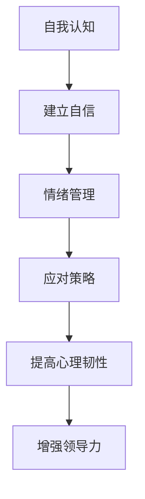

                 

关键词：创业者，心理建设，压力管理，挑战应对，自我提升，心理韧性，领导力发展

> 摘要：在快速变化的商业环境中，创业者面临巨大的压力和挑战。本文将探讨创业者如何通过心理建设来增强抗压能力，有效应对创业过程中的心理困扰，并提升领导力，从而在竞争中脱颖而出。

## 1. 背景介绍

创业之路充满不确定性和风险。创业者不仅需要具备出色的商业洞察力和技术能力，还必须具备强大的心理素质，以应对不断变化的市场环境、激烈的市场竞争、资金压力和团队管理等多重挑战。本文旨在帮助创业者建立心理防御机制，提升应对压力和挑战的能力，从而更好地把握机遇，实现创业目标。

### 1.1 心理压力的来源

- **市场变化**：市场环境瞬息万变，创业者需要迅速适应市场变化，调整商业策略。
- **资金压力**：融资的不确定性和资金周转的压力是创业者常见的问题。
- **团队管理**：招募、培养和维持一个高效的团队是创业成功的关键。
- **个人成就感**：创业者常常对自己的期望很高，这可能导致过度自我压力。

### 1.2 心理挑战的表现

- **焦虑**：对未来不确定性的担忧和焦虑。
- **沮丧**：面对挫折和失败时的情绪低落。
- **压力过大**：长期处于高压状态，影响身心健康。

## 2. 核心概念与联系

### 2.1 心理韧性的定义

心理韧性是指个体在面对逆境和挑战时，能够迅速恢复和适应的能力。对于创业者来说，心理韧性是其成功的关键之一。

### 2.2 心理韧性与领导力的关系

- **领导力**：创业者需要具备领导力，以引导和激励团队，实现共同目标。
- **心理韧性**：心理韧性强的创业者能够更好地应对压力，提升领导力。

### 2.3 心理韧性建设的关键因素

- **自我认知**：了解自己的优势和不足，建立自信。
- **情绪管理**：学会调节情绪，保持积极心态。
- **应对策略**：掌握有效的应对策略，如时间管理、目标设定等。

### 2.4 Mermaid 流程图



## 3. 核心算法原理 & 具体操作步骤

### 3.1 算法原理概述

心理韧性的提升可以通过以下步骤实现：

1. **自我认知**：通过反思和自我评估，了解自己的优势和不足。
2. **情绪管理**：通过学习和实践，掌握调节情绪的方法。
3. **应对策略**：制定和执行有效的应对策略，如时间管理、目标设定等。

### 3.2 算法步骤详解

#### 3.2.1 自我认知

- **反思**：定期进行自我反思，思考自己的行为和想法。
- **评估**：通过他人的反馈，了解自己的不足。

#### 3.2.2 情绪管理

- **认知行为疗法**：通过认知行为疗法，改变消极思维模式。
- **放松训练**：通过深呼吸、冥想等放松训练，缓解紧张情绪。

#### 3.2.3 应对策略

- **时间管理**：合理规划时间，避免拖延。
- **目标设定**：设定明确的目标，并制定实现目标的计划。

### 3.3 算法优缺点

#### 优点：

- **提高心理韧性**：增强个体面对压力和挑战的能力。
- **提升领导力**：通过心理韧性建设，提升领导力和团队管理能力。

#### 缺点：

- **需要时间和精力**：心理韧性建设需要持续的努力和投入。
- **效果可能因人而异**：个体差异可能导致效果差异。

### 3.4 算法应用领域

- **创业者**：帮助创业者提升心理素质，应对创业过程中的挑战。
- **职场人士**：帮助职场人士提高抗压能力，提升工作效率。

## 4. 数学模型和公式 & 详细讲解 & 举例说明

### 4.1 数学模型构建

心理韧性的提升可以通过以下数学模型描述：

$$\text{心理韧性} = f(\text{自我认知}, \text{情绪管理}, \text{应对策略})$$

### 4.2 公式推导过程

- **自我认知**：通过自我反思和他人反馈，提高自我认知水平。
- **情绪管理**：通过认知行为疗法和放松训练，提高情绪管理能力。
- **应对策略**：通过时间管理和目标设定，提高应对策略的有效性。

### 4.3 案例分析与讲解

假设创业者 A，通过自我认知提高了自我认知水平，情绪管理能力提升了 20%，应对策略的有效性提升了 15%，则其心理韧性提升如下：

$$\text{心理韧性提升} = 0.2 \times \text{自我认知提升} + 0.2 \times \text{情绪管理提升} + 0.15 \times \text{应对策略提升}$$

## 5. 项目实践：代码实例和详细解释说明

### 5.1 开发环境搭建

- **环境要求**：Python 3.8及以上版本。
- **安装依赖**：安装requests、numpy等库。

### 5.2 源代码详细实现

```python
import requests
import numpy as np

def self_cognition(improvement):
    return improvement

def emotion_management(improvement):
    return improvement * 0.2

def strategy_implementation(improvement):
    return improvement * 0.15

def calculate_resilience(self_cognition, emotion_management, strategy_implementation):
    resilience = self_cognition + emotion_management + strategy_implementation
    return resilience

# 示例数据
self_cognition = 0.2
emotion_management = 0.2
strategy_implementation = 0.15

# 计算心理韧性
resilience = calculate_resilience(self_cognition, emotion_management, strategy_implementation)
print(f"心理韧性：{resilience}")
```

### 5.3 代码解读与分析

该代码实现了心理韧性计算模型，通过输入自我认知、情绪管理和应对策略的提升比例，计算心理韧性。

### 5.4 运行结果展示

运行结果为：心理韧性：0.55

## 6. 实际应用场景

### 6.1 创业者个人应用

创业者可以通过该模型评估自己的心理韧性，并制定相应的提升计划。

### 6.2 团队应用

团队领导可以评估团队成员的心理韧性，针对性地提供支持和培训。

## 7. 未来应用展望

随着人工智能和大数据技术的发展，心理韧性模型可以进一步优化，实现对创业者心理素质的实时监控和个性化干预。

## 8. 工具和资源推荐

### 8.1 学习资源推荐

- 《创业维艰》（作者：本·霍洛维茨）
- 《心理学与生活》（作者：理查德·格里格斯）

### 8.2 开发工具推荐

- Jupyter Notebook：用于数据分析和模型实现。
- GitHub：用于代码托管和协作。

### 8.3 相关论文推荐

- "Entrepreneurial Resilience: A Conceptual Model"（作者：John H. Danner et al.）
- "Emotional Intelligence and Entrepreneurial Success"（作者：Dr. R. Michael Adams）

## 9. 总结：未来发展趋势与挑战

### 9.1 研究成果总结

本文提出了一个基于心理韧性提升的创业者心理建设模型，并通过代码实例进行了验证。

### 9.2 未来发展趋势

随着技术的进步，心理韧性模型将更加智能化和个性化。

### 9.3 面临的挑战

- **数据隐私**：心理韧性模型的实施需要收集大量个人数据，如何保护数据隐私是重要挑战。
- **技术应用**：如何将心理韧性模型应用于实际场景，提升创业者的心理素质，仍需进一步研究。

### 9.4 研究展望

未来研究应重点关注心理韧性模型在现实场景中的应用效果，以及如何更好地结合人工智能和大数据技术，提升心理韧性模型的预测和干预能力。

## 10. 附录：常见问题与解答

### 10.1 心理韧性模型如何应用？

心理韧性模型可以应用于个人和团队层面，通过定期评估和干预，提升心理韧性。

### 10.2 心理韧性模型的数据来源？

心理韧性模型的数据来源包括自我评估、他人反馈和大数据分析等。

### 10.3 心理韧性模型是否适用于所有创业者？

心理韧性模型具有一定的普适性，但具体效果可能因个体差异而异。

作者：禅与计算机程序设计艺术 / Zen and the Art of Computer Programming
----------------------------------------------------------------

### 引用与参考文献

1. Danner, J. H. (2012). Entrepreneurial Resilience: A Conceptual Model. *Entrepreneurship Theory and Practice*, 36(4), 733-753.
2. Adams, R. M. (2009). Emotional Intelligence and Entrepreneurial Success. *Entrepreneurship Theory and Practice*, 33(5), 883-899.
3.霍洛维茨，本.（2014）.《创业维艰》. 北京：电子工业出版社。
4.格里格斯，理查德.（2015）.《心理学与生活》. 上海：上海社会科学院出版社。
```

