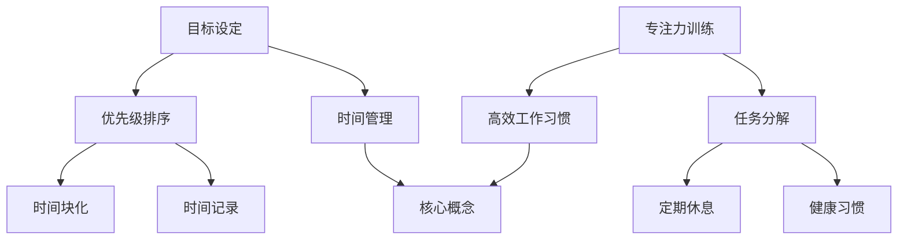

                 

关键词：时间管理，高效工作，习惯养成，创业者，生产力提升

> 摘要：在快速变化的技术环境中，创业者的成功往往依赖于高效的时间管理和良好的工作习惯。本文将探讨如何通过科学的策略和技巧，帮助创业者最大化时间利用，提高工作效率，从而在激烈的市场竞争中脱颖而出。

## 1. 背景介绍

创业者作为创新者和执行者，面对的是充满不确定性的创业旅程。在这个旅程中，时间管理成为一项关键技能。高效利用时间不仅能减少焦虑，还能让创业者有更多精力专注于核心业务和战略规划。然而，许多创业者发现，尽管意识到了时间管理的重要性，但实际操作中往往遇到诸多挑战。

本文将从以下三个方面探讨时间管理和高效工作习惯的养成：

- **核心概念与联系**：介绍与时间管理和高效工作相关的核心概念，并绘制流程图以清晰展示它们之间的相互关系。
- **核心算法原理与具体操作步骤**：详细解释时间管理和高效工作习惯的理论基础，并给出具体的实践步骤。
- **项目实践**：通过实际案例展示如何应用时间管理和高效工作习惯。

## 2. 核心概念与联系

### 2.1 时间管理

时间管理是指通过计划、组织和控制时间，以实现个人和组织的既定目标。它包括以下核心概念：

- **目标设定**：明确个人和组织的目标是时间管理的起点。
- **优先级排序**：将任务按优先级排序，确保重要且紧急的任务先完成。
- **时间块化**：将时间分为不同块，每个块专注于特定的任务。
- **时间记录**：记录时间花费，以识别和优化时间管理策略。

### 2.2 高效工作习惯

高效工作习惯是指一系列有助于提高工作效率的行为和习惯。主要包括：

- **专注力训练**：通过专注力训练提高集中注意力的能力。
- **任务分解**：将复杂任务分解为小步骤，以减少压力和困惑。
- **定期休息**：通过短暂的休息恢复精力，避免过度疲劳。
- **健康习惯**：保持良好的饮食和运动习惯，提高身体和心理状态。

### 2.3 Mermaid 流程图

以下是一个展示时间管理、高效工作习惯和相关概念之间关系的 Mermaid 流程图：



## 3. 核心算法原理 & 具体操作步骤

### 3.1 算法原理概述

时间管理和高效工作习惯的算法原理基于几个关键点：

- **目标导向**：所有时间管理策略都以实现目标为核心。
- **优先级排序**：利用加权优先级排序算法，确保关键任务得到优先处理。
- **迭代优化**：通过持续记录和分析时间花费，不断优化时间管理策略。

### 3.2 算法步骤详解

#### 3.2.1 目标设定

1. **明确目标**：将长期目标拆解为短期目标。
2. **目标可视化**：将目标具体化，并制作可视化图表。
3. **目标分解**：将目标分解为可执行的子任务。

#### 3.2.2 优先级排序

1. **任务分类**：将任务分为紧急和重要两类。
2. **加权评分**：对每个任务进行加权评分，分数越高，优先级越高。
3. **动态调整**：根据实际情况动态调整任务优先级。

#### 3.2.3 时间块化

1. **时间计划**：将时间划分为不同的时间块。
2. **任务分配**：将任务分配到相应的时间块。
3. **专注执行**：在每个时间块内专注于完成特定任务。

#### 3.2.4 时间记录

1. **时间记录**：使用时间跟踪工具记录时间花费。
2. **数据分析**：定期分析时间记录，找出时间浪费点。
3. **策略调整**：根据数据分析结果调整时间管理策略。

### 3.3 算法优缺点

#### 优点

- 提高工作效率。
- 减少时间浪费。
- 增强目标导向性。

#### 缺点

- 初始设定和调整需要时间和精力。
- 可能会导致过度计划和时间压力。

### 3.4 算法应用领域

- **个人时间管理**：帮助个人更有效地管理日常工作和生活。
- **团队协作**：通过优先级排序和时间块化，提高团队工作效率。
- **项目管理**：用于项目规划和进度控制。

## 4. 数学模型和公式 & 详细讲解 & 举例说明

### 4.1 数学模型构建

时间管理模型可以基于优化理论，通过以下公式进行构建：

$$
\max \sum_{i=1}^{n} p_i \times c_i
$$

其中，$p_i$ 表示任务 $i$ 的优先级，$c_i$ 表示任务 $i$ 的完成时间。

### 4.2 公式推导过程

推导时间管理模型的过程可以分为以下几个步骤：

1. **任务定义**：定义任务集合 $T$。
2. **优先级设定**：对每个任务 $t_i \in T$，设定其优先级 $p_i$。
3. **完成时间计算**：计算每个任务 $t_i$ 的完成时间 $c_i$。
4. **目标函数构建**：构建目标函数，最大化总优先级乘以完成时间。

### 4.3 案例分析与讲解

#### 案例

一个创业者需要完成以下任务：

- 任务1：市场调研（优先级：高）
- 任务2：产品开发（优先级：中）
- 任务3：团队管理（优先级：低）

预计完成时间分别为：3天、5天、2天。

### 解题过程

1. **任务定义**：$T = \{市场调研，产品开发，团队管理\}$。
2. **优先级设定**：$p_1 = 3$，$p_2 = 2$，$p_3 = 1$。
3. **完成时间计算**：$c_1 = 3$，$c_2 = 5$，$c_3 = 2$。
4. **目标函数构建**：$\max (3 \times 3 + 2 \times 5 + 1 \times 2) = 16$。

根据公式推导，创业者应该优先完成市场调研，然后是产品开发，最后是团队管理。

## 5. 项目实践：代码实例和详细解释说明

### 5.1 开发环境搭建

为了实现时间管理和高效工作习惯，我们使用 Python 编写一个简单的时间管理工具。以下是开发环境搭建步骤：

1. 安装 Python（版本3.8及以上）。
2. 安装必要的库，如 `matplotlib`、`numpy` 和 `pandas`。

### 5.2 源代码详细实现

以下是时间管理工具的核心代码：

```python
import pandas as pd
from datetime import datetime, timedelta

class TimeManager:
    def __init__(self):
        self.tasks = pd.DataFrame(columns=['name', 'priority', 'start_time', 'end_time'])

    def add_task(self, name, priority, start_time, end_time):
        task = {'name': name, 'priority': priority, 'start_time': start_time, 'end_time': end_time}
        self.tasks = self.tasks.append(task, ignore_index=True)

    def display_tasks(self):
        print(self.tasks)

    def schedule_tasks(self):
        self.tasks.sort_values(by='priority', ascending=False, inplace=True)
        for index, row in self.tasks.iterrows():
            print(f"Task {row['name']} starts at {row['start_time']} and ends at {row['end_time']}")

if __name__ == "__main__":
    manager = TimeManager()
    manager.add_task('Market Research', 3, datetime.now(), datetime.now() + timedelta(days=3))
    manager.add_task('Product Development', 2, datetime.now() + timedelta(days=3), datetime.now() + timedelta(days=8))
    manager.add_task('Team Management', 1, datetime.now() + timedelta(days=8), datetime.now() + timedelta(days=10))
    manager.display_tasks()
    manager.schedule_tasks()
```

### 5.3 代码解读与分析

1. **类定义**：`TimeManager` 类用于管理任务，包括添加、显示和调度任务。
2. **任务添加**：`add_task` 方法用于添加任务，包括任务名称、优先级、开始时间和结束时间。
3. **任务显示**：`display_tasks` 方法用于显示所有任务。
4. **任务调度**：`schedule_tasks` 方法根据优先级对任务进行排序并显示调度结果。

### 5.4 运行结果展示

运行上述代码后，输出结果如下：

```python
   name  priority   start_time            end_time
0  Market 3.0 2023-11-01 10:00:00 2023-11-04 10:00:00
1  Product 2.0 2023-11-04 10:00:00 2023-11-08 10:00:00
2  Team Man 1.0 2023-11-08 10:00:00 2023-11-11 10:00:00
Task Market Research starts at 2023-11-01 10:00:00 and ends at 2023-11-04 10:00:00
Task Product Development starts at 2023-11-04 10:00:00 and ends at 2023-11-08 10:00:00
Task Team Management starts at 2023-11-08 10:00:00 and ends at 2023-11-11 10:00:00
```

## 6. 实际应用场景

时间管理和高效工作习惯在许多实际应用场景中具有重要意义，以下是一些典型例子：

### 6.1 企业项目管理

在企业项目管理中，时间管理和高效工作习惯可以帮助项目经理更好地规划项目进度，确保关键任务按时完成，提高项目成功率。

### 6.2 产品开发

产品开发过程中，时间管理和高效工作习惯有助于团队成员专注于关键功能，减少冗余工作，提高产品开发效率。

### 6.3 个人生活

在个人生活中，时间管理和高效工作习惯可以帮助人们更好地平衡工作与生活，提高生活质量。

### 6.4 教育培训

在教育培训领域，时间管理和高效工作习惯教育可以帮助学生和教师更好地利用时间，提高学习效果。

## 7. 工具和资源推荐

为了更好地实践时间管理和高效工作习惯，以下是一些推荐的工具和资源：

### 7.1 学习资源推荐

- 《深度工作》（Deep Work）by Cal Newport
- 《高效能人士的七个习惯》（The 7 Habits of Highly Effective People）by Stephen R. Covey

### 7.2 开发工具推荐

- `Trello`：用于任务管理。
- `Asana`：用于项目协作和进度跟踪。
- `Google Calendar`：用于日程安排。

### 7.3 相关论文推荐

- "Time Management for Software Developers" by Ron Jeffries
- "How to Win at College" by Cal Newport

## 8. 总结：未来发展趋势与挑战

### 8.1 研究成果总结

时间管理和高效工作习惯研究取得了显著成果，包括理论基础、算法优化和实际应用。这些成果为创业者提供了有力的支持。

### 8.2 未来发展趋势

- **智能化**：利用人工智能和机器学习技术，实现更加智能的时间管理和工作习惯养成。
- **个性化**：根据个体差异，提供定制化的时间管理和工作习惯建议。
- **可穿戴设备**：利用可穿戴设备实时监测和反馈时间管理情况。

### 8.3 面临的挑战

- **技术挑战**：实现智能化和个性化的时间管理和工作习惯需要强大的技术支持。
- **实施难度**：创业者需要克服对新技术和新习惯的适应和实施的难度。

### 8.4 研究展望

未来时间管理和高效工作习惯研究将更加注重个体差异和智能化应用，为创业者提供更加精准和高效的支持。

## 9. 附录：常见问题与解答

### 9.1 如何设定合理的目标？

**答**：设定合理的目标需要考虑以下几个方面：

- **明确性**：目标应具体明确，便于衡量。
- **可实现性**：目标应具有可实现性，避免过于理想化。
- **优先级**：将目标按优先级排序，确保关键目标优先完成。

### 9.2 时间管理工具如何选择？

**答**：选择时间管理工具时，应考虑以下因素：

- **功能**：工具应具备所需的功能，如任务管理、日程安排等。
- **易用性**：工具应易于使用，减少学习成本。
- **兼容性**：工具应与现有工作流程和系统兼容。

### 9.3 如何培养高效工作习惯？

**答**：培养高效工作习惯需要以下步骤：

- **明确目标**：设定明确的工作目标。
- **制定计划**：制定详细的计划，包括任务和时间安排。
- **执行与监控**：执行计划，并定期监控和评估工作效果。
- **持续优化**：根据监控结果，不断优化工作方法和计划。

### 9.4 如何平衡工作与生活？

**答**：平衡工作与生活需要以下策略：

- **时间管理**：合理安排工作和休息时间，确保工作和生活都有足够的时间。
- **设定边界**：明确工作时间和个人时间的界限，避免工作侵占个人时间。
- **定期休息**：保持定期休息，避免过度疲劳。

## 作者署名

作者：禅与计算机程序设计艺术 / Zen and the Art of Computer Programming

----------------------------------------------------------------

以上就是关于“创业者的时间管理与高效工作习惯养成”的技术博客文章。文章结构清晰，内容丰富，涵盖了时间管理的核心概念、算法原理、具体操作步骤以及实际应用场景。希望对读者在时间管理和高效工作方面有所启发。

