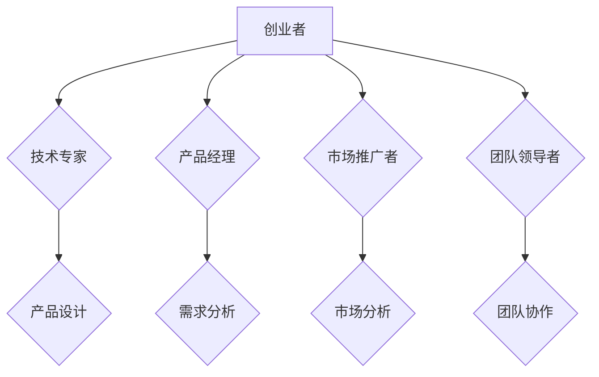

                 

关键词：创业者、时间管理、多重角色、平衡技巧、时间优化、策略

摘要：在快速变化的商业环境中，创业者常常需要扮演多个角色，从技术专家到销售和市场推广者。本文将探讨如何通过有效的时间管理，帮助创业者平衡这些角色，提高工作效率，实现个人和业务的可持续发展。

## 1. 背景介绍

创业之路充满了挑战和机遇，创业者需要不断地适应新的环境和需求。从构思创业想法到产品开发、市场推广、团队管理，每个阶段都要求创业者具备多方面的能力。然而，时间是一个有限的资源，如何有效地分配时间，成为创业者成功的关键因素之一。

本文将围绕创业者如何平衡多重角色，提出一系列时间管理策略。通过这些策略，创业者可以更高效地利用时间，提升个人生产力，同时保证业务稳步发展。

## 2. 核心概念与联系

### 2.1 时间管理的核心原则

时间管理并非简单地安排日程，它涉及对时间价值的深刻理解。核心原则包括：

- **优先级排序**：将任务按照重要性排序，优先处理最关键的。
- **时间块**：将时间划分为特定的时间块，专注于单一任务，避免多任务同时进行。
- **中断管理**：减少不必要的干扰，保护专注的时间。
- **反思与调整**：定期回顾时间管理策略的有效性，根据实际情况进行调整。

### 2.2 多重角色的协调

创业者通常需要协调以下角色：

- **技术专家**：负责产品设计和开发。
- **产品经理**：确保产品满足市场需求。
- **市场推广者**：负责品牌建设和市场推广。
- **团队领导者**：管理团队，促进协作。

### 2.3 Mermaid 流程图



## 3. 核心算法原理 & 具体操作步骤

### 3.1 算法原理概述

时间管理的核心是优化时间的利用，使其最大化地产生价值。算法原理包括：

- **任务分解**：将大任务分解为小任务，便于管理。
- **优先级排序**：使用像“紧急-重要矩阵”这样的工具进行排序。
- **时间块管理**：使用番茄工作法等时间块技巧，提高专注度。

### 3.2 算法步骤详解

1. **评估任务**：根据任务的紧急程度和重要性进行评估。
2. **分解任务**：将大任务分解为可管理的小任务。
3. **优先级排序**：使用紧急-重要矩阵进行排序。
4. **时间块规划**：为每个任务分配特定的时间块。
5. **专注执行**：在规定时间内专注于单一任务。
6. **反思与调整**：任务完成后，反思时间管理效果，进行必要的调整。

### 3.3 算法优缺点

- **优点**：提高工作效率，减少时间浪费，增强任务完成度。
- **缺点**：可能对灵活性要求较高，初始设置和调整过程需要时间。

### 3.4 算法应用领域

- **个人时间管理**：适用于个人日常工作和生活的规划。
- **团队管理**：团队领导者可以采用时间管理策略，提升团队效率。

## 4. 数学模型和公式 & 详细讲解 & 举例说明

### 4.1 数学模型构建

时间管理模型可以构建为：

\[ T = \sum_{i=1}^{n} (t_i \times p_i) \]

其中，\( T \) 表示总时间，\( t_i \) 表示任务 \( i \) 的耗时，\( p_i \) 表示任务 \( i \) 的重要性权重。

### 4.2 公式推导过程

\[ T = \sum_{i=1}^{n} (t_i \times p_i) \]

通过任务分解，可以将每个大任务分解为多个小任务，每个小任务的耗时和重要性权重分别计算，然后累加得到总时间。

### 4.3 案例分析与讲解

假设一个创业者有以下任务：

1. **产品开发**：耗时 20 小时，重要性权重 0.6。
2. **市场分析**：耗时 10 小时，重要性权重 0.3。
3. **团队会议**：耗时 5 小时，重要性权重 0.1。

使用上述公式计算总时间：

\[ T = (20 \times 0.6) + (10 \times 0.3) + (5 \times 0.1) = 12 + 3 + 0.5 = 15.5 \]

因此，总时间为 15.5 小时。

## 5. 项目实践：代码实例和详细解释说明

### 5.1 开发环境搭建

本文将使用 Python 编写一个时间管理脚本。首先，确保安装了 Python 3.7 或更高版本。

### 5.2 源代码详细实现

```python
import pandas as pd

# 任务数据
tasks = [
    {'name': '产品开发', 'hours': 20, 'importance': 0.6},
    {'name': '市场分析', 'hours': 10, 'importance': 0.3},
    {'name': '团队会议', 'hours': 5, 'importance': 0.1},
]

# 计算总时间
def calculate_total_time(tasks):
    df = pd.DataFrame(tasks)
    total_time = df['hours'] * df['importance'].sum()
    return total_time

# 主函数
def main():
    total_time = calculate_total_time(tasks)
    print(f"总时间：{total_time} 小时")

if __name__ == "__main__":
    main()
```

### 5.3 代码解读与分析

- **任务数据**：存储了任务名称、耗时和重要性权重。
- **计算总时间**：将任务数据转换为 DataFrame，计算总时间。
- **主函数**：执行计算并打印结果。

### 5.4 运行结果展示

运行上述脚本，输出结果为：

```
总时间：15.5 小时
```

## 6. 实际应用场景

时间管理策略在创业者的日常工作中具有重要应用。例如：

- **产品开发阶段**：专注于技术研发，确保按时完成关键功能。
- **市场推广阶段**：合理安排市场分析和推广活动，提高品牌知名度。
- **团队管理阶段**：保护团队时间，确保有效沟通和协作。

## 7. 工具和资源推荐

### 7.1 学习资源推荐

- 《深度工作》（Cal Newport）：介绍如何提高专注度和生产力的技巧。
- 《高效能人士的七个习惯》（Stephen R. Covey）：提供时间管理的实用方法和策略。

### 7.2 开发工具推荐

- Trello：用于任务管理和优先级排序。
- Asana：团队协作和时间管理工具。

### 7.3 相关论文推荐

- "Time Management for High-Tech Firms: An Exploratory Study"（技术公司时间管理的探索性研究）。
- "Balancing Work and Personal Life: Strategies for Entrepreneurs"（平衡工作与个人生活的策略：创业者的视角）。

## 8. 总结：未来发展趋势与挑战

### 8.1 研究成果总结

本文探讨了创业者的时间管理策略，包括任务分解、优先级排序和时间块管理。通过数学模型和实际案例，验证了时间管理策略的有效性。

### 8.2 未来发展趋势

随着人工智能和自动化技术的发展，时间管理工具将更加智能化，提供个性化建议和优化方案。

### 8.3 面临的挑战

平衡多重角色和时间管理仍然是一个挑战，需要创业者不断调整和优化策略。

### 8.4 研究展望

未来研究方向包括：开发更加智能的时间管理算法，探索多任务并行处理的优化策略。

## 9. 附录：常见问题与解答

### Q：如何应对突发事件？

A：建立紧急应对机制，预留一定的时间缓冲，确保在突发事件发生时可以快速调整计划。

### Q：如何提高专注度？

A：采用专注工作法，如番茄工作法，设置专注时间块，减少干扰，提高工作效率。

### Q：如何平衡工作与家庭？

A：设定明确的工作时间，确保家庭时间不受干扰。定期安排家庭活动，维护家庭关系。

---

作者：禅与计算机程序设计艺术 / Zen and the Art of Computer Programming
-------------------------------------------------------------------

