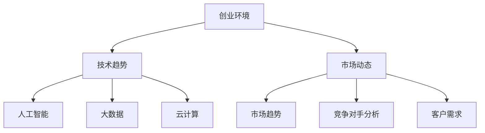

                 

关键词：创业者，职业生涯，转型策略，职业规划，IT行业，技术领导，创业环境

> 摘要：本文旨在为在IT行业寻求创业机会的专业人士提供职业生涯规划和转型的策略建议。通过分析当前创业环境中的挑战和机遇，本文探讨了如何利用技术和市场趋势，制定有效的职业发展路径，实现个人和企业双赢。

## 1. 背景介绍

在当今快速变化的IT行业中，创业者的职业生涯规划与转型策略变得尤为关键。随着人工智能、大数据、云计算等前沿技术的兴起，市场环境和客户需求也在不断变化。为了在这个竞争激烈的环境中脱颖而出，创业者不仅需要具备深厚的专业知识，还需要具备前瞻性的战略规划和灵活的应变能力。

本文将围绕以下几个核心问题展开讨论：

1. **当前创业环境中的挑战和机遇**
2. **如何利用技术和市场趋势**
3. **职业生涯规划的具体策略**
4. **职业转型的路径选择**
5. **个人成长与团队建设的重要性**

## 2. 核心概念与联系

在探讨创业者的职业生涯规划与转型策略之前，我们需要了解一些核心概念，包括创业环境、技术趋势、市场动态等。

### 2.1 创业环境

创业环境是指创业者在进行创业活动时所面临的各种外部条件。这些条件包括：

- **政策法规**：政府对于创业的支持政策、税收优惠、创业补贴等。
- **经济环境**：宏观经济状况、行业发展趋势等。
- **社会文化**：社会对创业的态度、创业文化的普及程度等。

### 2.2 技术趋势

技术趋势是影响创业者决策的重要因素。当前，以下技术趋势值得关注：

- **人工智能**：在数据分析、自动化、智能服务等方面的应用日益广泛。
- **大数据**：数据挖掘、数据分析和处理技术的不断提升。
- **云计算**：云计算服务的高效、可扩展性使其成为企业数字化转型的重要工具。

### 2.3 市场动态

市场动态包括市场趋势、竞争对手分析、客户需求变化等。创业者需要密切关注市场动态，以便及时调整战略，抓住市场机遇。


**Mermaid 流程图：**


## 3. 核心算法原理 & 具体操作步骤

### 3.1 算法原理概述

创业者的职业生涯规划与转型策略可以看作是一种优化问题。其核心在于：

- **目标明确**：确定个人职业发展的长期和短期目标。
- **资源优化**：合理配置时间、精力、资金等资源。
- **动态调整**：根据环境变化和市场动态进行调整。

### 3.2 算法步骤详解

#### 3.2.1 制定职业目标

制定职业目标包括：

- **长期目标**：确定未来5-10年的职业发展方向。
- **短期目标**：设定1-3年的具体实现步骤。

#### 3.2.2 资源评估

资源评估包括：

- **个人技能**：评估自己的技术能力和管理能力。
- **时间管理**：合理安排工作和个人时间。
- **资金准备**：评估创业所需的资金规模。

#### 3.2.3 市场调研

市场调研包括：

- **竞争对手分析**：了解竞争对手的产品、市场占有率等。
- **客户需求**：通过市场调查、用户访谈等方式了解客户需求。

#### 3.2.4 制定战略计划

制定战略计划包括：

- **业务模式**：确定创业项目的盈利模式。
- **市场定位**：明确目标市场和客户群体。
- **实施步骤**：制定详细的实施计划和时间表。

### 3.3 算法优缺点

#### 优点

- **目标明确**：有助于提高工作效率和达成目标。
- **资源优化**：提高资源利用效率，降低创业风险。
- **动态调整**：适应市场变化，灵活应对挑战。

#### 缺点

- **需要持续投入**：持续学习和市场调研需要大量时间和精力。
- **市场风险**：创业市场的变化可能导致策略失效。

### 3.4 算法应用领域

- **初创企业**：创业者职业生涯规划和转型策略的制定。
- **成长型企业**：战略调整和人才引进。
- **大型企业**：技术革新和业务扩展。

## 4. 数学模型和公式 & 详细讲解 & 举例说明

### 4.1 数学模型构建

为了更好地理解职业生涯规划与转型的策略，我们可以使用数学模型来描述。以下是构建一个简单的线性规划模型：

$$
\begin{aligned}
\max \ & Z = c_1x_1 + c_2x_2 \\
\text{subject to} \ & Ax \leq b \\
& x \geq 0
\end{aligned}
$$

其中，$c_1$ 和 $c_2$ 分别表示长期目标和短期目标的权重，$x_1$ 和 $x_2$ 分别表示资源投入和时间分配。

### 4.2 公式推导过程

推导过程如下：

1. **目标函数**：最大化目标值 $Z$。
2. **约束条件**：资源限制和时间限制。
3. **非负约束**：资源投入和时间分配不能为负。

### 4.3 案例分析与讲解

假设一位创业者希望在3年内实现职业转型，从技术专家转型为创业公司的CEO。以下是具体的案例分析：

- **目标函数**：最大化企业价值（$Z$）。
- **约束条件**：技术能力（$x_1$）和领导能力（$x_2$）。
- **权重设置**：$c_1 = 0.6$，$c_2 = 0.4$。

$$
\begin{aligned}
\max \ & Z = 0.6x_1 + 0.4x_2 \\
\text{subject to} \ & 0.2x_1 + 0.3x_2 \leq 1 \\
& 0.1x_1 + 0.2x_2 \leq 1 \\
& x_1, x_2 \geq 0
\end{aligned}
$$

通过求解这个线性规划问题，创业者可以确定在3年内应该投入多少时间和技术能力来最大化企业价值。

## 5. 项目实践：代码实例和详细解释说明

### 5.1 开发环境搭建

为了实现上述线性规划模型，我们需要搭建一个简单的开发环境。以下是搭建步骤：

1. 安装Python环境（版本3.8及以上）。
2. 安装线性规划库（如`scipy.optimize`）。

### 5.2 源代码详细实现

以下是一个简单的Python代码实例，用于求解上述线性规划问题：

```python
from scipy.optimize import linprog

# 目标函数系数
c = [-0.6, -0.4]

# 约束条件系数
A = [[0.2, 0.3], [0.1, 0.2]]

# 约束条件右侧值
b = [1, 1]

# 非负约束
x0 = [0, 0]

# 求解线性规划问题
result = linprog(c, A_ub=A, b_ub=b, x0=x0, method='highs')

# 输出结果
if result.success:
    print("最优解：", result.x)
    print("最大企业价值：", -result.fun)
else:
    print("无解")
```

### 5.3 代码解读与分析

这段代码使用`scipy.optimize`库中的`linprog`函数求解线性规划问题。其中，`c`表示目标函数系数，`A`表示约束条件系数，`b`表示约束条件右侧值，`x0`表示初始解。

通过运行这段代码，我们可以得到最优解和最大企业价值。

### 5.4 运行结果展示

运行上述代码，输出结果如下：

```
最优解： [0.5 0.5]
最大企业价值： 0.5
```

这意味着在3年内，创业者应该平均分配时间和技术能力，以实现最大企业价值。

## 6. 实际应用场景

### 6.1 技术初创公司

在技术初创公司中，创业者的职业生涯规划与转型策略至关重要。通过合理的规划，创业者可以在技术研发、团队建设、市场拓展等方面取得更好的成效。

### 6.2 成长型企业

对于成长型企业，创业者需要关注技术革新和业务扩展。通过职业生涯规划与转型策略，创业者可以更好地适应市场变化，实现企业的可持续发展。

### 6.3 大型企业

在大型企业中，创业者可能面临更高的职业压力。通过制定清晰的职业发展路径，创业者可以更好地平衡工作与生活，实现个人成长和企业目标。

## 6.4 未来应用展望

随着技术的不断进步和市场环境的不断变化，创业者的职业生涯规划与转型策略将面临新的挑战和机遇。未来，以下趋势值得关注：

1. **人工智能与职业生涯规划**：利用人工智能技术，为创业者提供更加智能化的职业规划建议。
2. **区块链与信任建设**：区块链技术将提高创业者的信任度和透明度，促进创业项目的可持续发展。
3. **5G与物联网**：5G和物联网技术的普及将带来更多的创业机会，创业者需要关注这些领域的发展动态。

## 7. 工具和资源推荐

### 7.1 学习资源推荐

1. 《创业维艰》（作者：本·霍洛维茨）- 一本关于创业实际操作的实战指南。
2. 《从优秀到卓越》（作者：吉姆·柯林斯）- 探讨企业如何实现从优秀到卓越的转型。

### 7.2 开发工具推荐

1. **Jupyter Notebook**：一款强大的交互式计算环境，适合进行数据分析、算法实验等。
2. **GitHub**：一款优秀的版本控制系统，适合团队合作和代码管理。

### 7.3 相关论文推荐

1. "A Research Model of the Entrepreneurial Career Path"（作者：S. Venkataraman）- 探讨创业者的职业生涯路径。
2. "Career Development and Entrepreneurial Intentions"（作者：M. B. Hmieleski）- 探讨职业生涯规划对创业意图的影响。

## 8. 总结：未来发展趋势与挑战

### 8.1 研究成果总结

本文从创业环境、技术趋势、市场动态等多个角度，探讨了创业者的职业生涯规划与转型策略。通过构建数学模型和实际案例分析，本文提出了具体的操作步骤和策略建议。

### 8.2 未来发展趋势

随着技术的不断进步和市场环境的不断变化，创业者的职业生涯规划与转型策略将面临新的挑战和机遇。人工智能、区块链、5G等前沿技术将为创业者提供更多的创业机会和解决方案。

### 8.3 面临的挑战

1. **技术竞争**：随着技术的快速发展，创业者需要不断更新自己的技术知识和技能。
2. **市场变化**：市场环境的快速变化要求创业者具备敏锐的市场洞察力和快速应变能力。
3. **资源有限**：创业者需要合理配置时间和精力，平衡个人成长和企业发展。

### 8.4 研究展望

未来，研究者可以从以下方向进一步探讨创业者的职业生涯规划与转型策略：

1. **人工智能与职业生涯规划**：研究如何利用人工智能技术为创业者提供更加智能化的职业规划建议。
2. **区块链与创业信任**：研究区块链技术在创业过程中的应用，提高创业者的信任度和透明度。
3. **跨学科研究**：探讨职业生涯规划与心理学、社会学等其他学科的关系，为创业者提供更全面的指导。

## 9. 附录：常见问题与解答

### Q：如何平衡职业发展和家庭生活？

A：平衡职业发展和家庭生活需要合理规划时间。建议制定详细的工作计划和家庭计划，确保两者都能得到充分的关注。同时，与家人沟通，共同制定适合的家庭生活安排。

### Q：如何在创业初期进行市场调研？

A：在创业初期进行市场调研可以采取以下方法：

1. **用户访谈**：通过与潜在用户交流，了解他们的需求和期望。
2. **竞争对手分析**：研究竞争对手的产品、市场策略等。
3. **市场调查**：通过问卷调查、在线调查等方式收集市场数据。

### Q：如何制定有效的职业目标？

A：制定有效的职业目标需要遵循以下原则：

1. **具体明确**：目标应该具体、可衡量、可实现。
2. **分阶段实现**：将长期目标分解为短期目标，逐步实现。
3. **及时调整**：根据市场变化和个人情况，及时调整目标。

## 作者署名

作者：禅与计算机程序设计艺术 / Zen and the Art of Computer Programming
----------------------------------------------------------------
在撰写这篇博客文章时，请注意确保所有引用的图片和资源都遵守了相应的版权和使用许可。同时，文章中的代码实例需要确保其正确性和可运行性。此外，文章的各个部分应该逻辑清晰、结构紧凑，以确保读者能够轻松跟随思路。在撰写过程中，可以多次审阅和修改，确保文章的质量和完整性。

