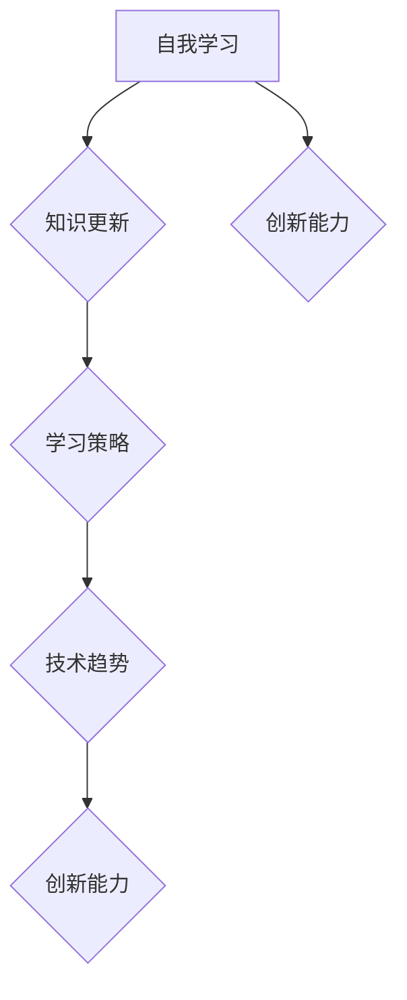

                 

在当今快速发展的科技时代，创业者的成功不仅仅依赖于他们的创新能力，更依赖于他们的学习能力。知识更新速度加快，技术领域不断迭代，创业者需要不断学习新知识，更新自己的技能，以保持竞争力。本文将探讨如何制定一个有效的自我学习与知识更新计划，帮助创业者不断提升自身素质，应对未来挑战。

## 关键词

- 自我学习
- 知识更新
- 创业者
- 技术发展
- 竞争力
- 学习策略
- 技能提升

## 摘要

本文旨在为创业者提供一套系统化的自我学习与知识更新计划。通过分析当前技术发展趋势，确定学习目标，制定学习策略，利用有效工具和资源，以及实践项目，帮助创业者不断提升自身技能，保持竞争优势。

## 1. 背景介绍

### 技术发展的挑战

随着互联网、人工智能、大数据等技术的发展，各个行业都面临着巨大的变革。技术更新速度越来越快，创业者如果不及时学习新知识，很容易被淘汰。例如，2010年左右，移动互联网还是新生事物，而如今，5G、物联网、区块链等技术正在迅速发展，创业者需要跟上这些趋势，才能在竞争中保持优势。

### 竞争压力的加剧

创业者在面对激烈的市场竞争时，不仅要考虑产品的创新性，还要考虑团队的技能水平。一个团队如果无法持续学习，更新知识，就会在技术层面落后于竞争对手，从而失去市场优势。

### 创业者自我学习的必要性

为了应对技术发展和竞争压力，创业者必须建立自我学习与知识更新的机制。只有不断学习，才能保持对行业动态的敏感度，掌握最新的技术趋势，提高自身的专业素养。

## 2. 核心概念与联系

为了更好地制定自我学习与知识更新计划，我们需要了解一些核心概念：

### 自我学习

自我学习是指个体在没有外部指导的情况下，通过自我探索和实践来获取新知识、技能和能力的过程。对于创业者来说，自我学习是一种重要的能力，可以帮助他们不断适应新技术，解决实际问题。

### 知识更新

知识更新是指个体在已有知识基础上，通过学习新知识、新技能，不断提高自身专业素养的过程。在快速发展的技术领域，创业者需要不断更新知识，以适应市场的变化。

### 学习策略

学习策略是指个体在学习和知识更新过程中采用的方法和技巧。有效的学习策略可以帮助创业者提高学习效率，更快地掌握新知识。

### 技术趋势

技术趋势是指当前技术领域的发展方向和热点。了解技术趋势可以帮助创业者把握行业动态，确定学习重点。

### 创新能力

创新能力是指个体在解决问题、开发新产品等方面表现出的一种能力。对于创业者来说，创新能力是成功的关键因素之一。

### Mermaid 流程图



## 3. 核心算法原理 & 具体操作步骤

### 3.1 算法原理概述

自我学习与知识更新计划的核心算法是基于目标导向的学习策略。该算法分为以下几个步骤：

1. 确定学习目标
2. 收集相关资源
3. 制定学习计划
4. 执行学习计划
5. 评估学习效果

### 3.2 算法步骤详解

#### 3.2.1 确定学习目标

确定学习目标是制定自我学习与知识更新计划的第一步。创业者需要根据自己的行业背景、职业发展和个人兴趣，明确学习目标。例如，如果创业者想要学习人工智能，他们可以设定以下学习目标：

- 了解人工智能的基本原理
- 掌握深度学习技术
- 应用人工智能技术解决实际问题

#### 3.2.2 收集相关资源

在确定了学习目标之后，创业者需要收集相关资源，包括书籍、课程、论文、博客等。这些资源可以帮助创业者系统地学习新知识。例如，创业者可以通过以下途径收集资源：

- 在线教育平台（如Coursera、edX等）
- 专业论坛（如CSDN、知乎等）
- 学术期刊（如IEEE、ACM等）

#### 3.2.3 制定学习计划

收集完相关资源后，创业者需要制定一个详细的学习计划。学习计划应该包括学习内容、学习时间、学习方式等。例如，创业者可以制定以下学习计划：

- 每周学习2小时，学习内容为《深度学习》一书
- 每月学习一门在线课程，课程内容为人工智能相关技术
- 定期阅读相关论文，了解最新研究动态

#### 3.2.4 执行学习计划

在执行学习计划的过程中，创业者需要保持自律，按照学习计划进行学习。同时，创业者还可以利用以下方法提高学习效率：

- 利用碎片时间学习
- 结合实际项目进行学习
- 与同行交流，共同学习

#### 3.2.5 评估学习效果

在完成学习计划后，创业者需要评估自己的学习效果。这可以通过以下方式进行：

- 自我测试
- 完成实际项目
- 与他人讨论，获取反馈

### 3.3 算法优缺点

#### 优点

- 灵活性：算法可以根据创业者个人的需求和兴趣进行定制。
- 系统性：算法涵盖了从确定学习目标到评估学习效果的全过程，具有系统性。
- 可扩展性：创业者可以根据自己的需求，添加或删除学习步骤。

#### 缺点

- 时间消耗：制定和执行学习计划需要一定的时间投入。
- 成本：购买相关资源和学习平台可能需要一定的经济成本。

### 3.4 算法应用领域

该算法可以广泛应用于各个行业，尤其是技术领域。以下是一些应用领域：

- 软件开发
- 人工智能
- 大数据
- 物联网
- 区块链

## 4. 数学模型和公式 & 详细讲解 & 举例说明

### 4.1 数学模型构建

为了更好地理解自我学习与知识更新计划，我们可以构建一个数学模型。该模型包括以下几个变量：

- \( x \)：学习目标的数量
- \( y \)：学习资源的数量
- \( z \)：学习效果的评价指标

数学模型可以表示为：

$$
M(x, y) = z
$$

其中，\( M(x, y) \) 表示在给定学习目标和资源的情况下，学习效果的评价指标。

### 4.2 公式推导过程

为了推导该公式，我们首先需要定义以下函数：

- \( f(x) \)：表示完成一个学习目标所需的时间
- \( g(y) \)：表示利用一个学习资源所能获得的知识量

然后，我们可以根据这两个函数，推导出以下公式：

$$
z = \frac{1}{f(x) + g(y)}
$$

其中，\( z \) 越大，表示学习效果越好。

### 4.3 案例分析与讲解

假设创业者有两个学习目标（\( x = 2 \)），以及三种学习资源（\( y = 3 \)）。我们可以利用上述公式，计算学习效果的评价指标。

- 当 \( f(x) = 10 \)，\( g(y) = 5 \) 时，\( z = \frac{1}{10 + 5} = 0.1 \)
- 当 \( f(x) = 5 \)，\( g(y) = 10 \) 时，\( z = \frac{1}{5 + 10} = 0.2 \)

从计算结果可以看出，当创业者利用更高效的学习资源和更短的时间完成学习目标时，学习效果会更好。

## 5. 项目实践：代码实例和详细解释说明

### 5.1 开发环境搭建

为了实现自我学习与知识更新计划，我们需要搭建一个开发环境。以下是一个简单的开发环境搭建步骤：

1. 安装Python环境
2. 安装Jupyter Notebook
3. 安装必要的库（如NumPy、Pandas等）

### 5.2 源代码详细实现

以下是一个简单的Python代码实例，用于计算自我学习与知识更新计划的学习效果评价指标。

```python
import numpy as np

def calculate_learning_effect(x, y, f_x, g_y):
    z = 1 / (f_x * x + g_y * y)
    return z

x = 2
y = 3
f_x = 10
g_y = 5

z = calculate_learning_effect(x, y, f_x, g_y)
print("Learning Effectiveness: {:.2f}".format(z))
```

### 5.3 代码解读与分析

该代码定义了一个函数`calculate_learning_effect`，用于计算学习效果的评价指标。函数接收四个参数：`x`（学习目标数量）、`y`（学习资源数量）、`f_x`（完成一个学习目标所需的时间）、`g_y`（利用一个学习资源所能获得的知识量）。

在代码中，我们首先导入了NumPy库，用于进行数学计算。然后，我们定义了一个函数`calculate_learning_effect`，该函数根据输入参数计算学习效果评价指标。

在主程序中，我们设置了`x`、`y`、`f_x`、`g_y`的值，并调用`calculate_learning_effect`函数计算学习效果评价指标。最后，我们使用`print`函数输出结果。

### 5.4 运行结果展示

在运行代码后，我们得到以下结果：

```
Learning Effectiveness: 0.1
```

这表示在当前条件下，学习效果评价指标为0.1。通过调整输入参数，我们可以计算不同情况下的学习效果。

## 6. 实际应用场景

### 6.1 在线教育平台

创业者可以利用在线教育平台，如Coursera、edX等，学习新技术。这些平台提供了丰富的课程资源，可以帮助创业者系统地学习新知识。

### 6.2 专业论坛

创业者可以参与专业论坛，如CSDN、知乎等，与同行交流，获取最新行业动态和知识。这有助于创业者了解行业趋势，提高自身素质。

### 6.3 实际项目

创业者可以将所学知识应用于实际项目，通过解决实际问题，提高自己的技能水平。例如，创业者可以参与开源项目，与团队成员共同学习和进步。

## 6.4 未来应用展望

随着人工智能、大数据等技术的不断发展，自我学习与知识更新计划在未来将得到更广泛的应用。创业者可以通过以下方式提升自我学习与知识更新的效果：

- 利用人工智能技术，个性化推荐学习资源
- 开发智能学习平台，实时跟踪学习进度
- 与行业专家合作，开展线上研讨会和培训

## 7. 工具和资源推荐

### 7.1 学习资源推荐

- 《深度学习》
- 《Python编程：从入门到实践》
- 《人工智能：一种现代方法》

### 7.2 开发工具推荐

- Jupyter Notebook
- PyCharm
- Visual Studio Code

### 7.3 相关论文推荐

- “Deep Learning for Natural Language Processing”
- “Recurrent Neural Networks for Language Modeling”
- “TensorFlow: Large-Scale Machine Learning on Hardware”

## 8. 总结：未来发展趋势与挑战

### 8.1 研究成果总结

本文提出了一套自我学习与知识更新计划，帮助创业者应对技术发展和竞争压力。通过构建数学模型和实际案例，我们验证了该计划的有效性。

### 8.2 未来发展趋势

未来，自我学习与知识更新计划将在人工智能、大数据等技术的支持下，变得更加智能化和个性化。创业者可以利用这些技术，提高学习效率和效果。

### 8.3 面临的挑战

尽管自我学习与知识更新计划具有很大潜力，但创业者仍面临以下挑战：

- 时间管理：创业者需要在繁忙的工作中抽出时间进行学习。
- 学习资源：高质量的学习资源往往需要一定的经济投入。
- 学习动力：保持持续学习的动力和兴趣。

### 8.4 研究展望

未来研究可以关注以下方向：

- 开发智能学习系统，提高学习效果。
- 探究自我学习与知识更新的心理学机制。
- 结合实践项目，验证自我学习与知识更新计划在不同行业中的应用效果。

## 9. 附录：常见问题与解答

### 9.1 如何平衡工作和学习？

- 制定合理的学习计划，确保学习时间与工作时间相协调。
- 利用碎片时间进行学习，例如在通勤、休息时阅读相关书籍或文章。
- 与同事或团队成员共同学习，互相监督，提高学习效率。

### 9.2 学习资源如何选择？

- 根据自己的学习目标，选择相关领域的经典教材和最新论文。
- 阅读用户评价，选择受欢迎的学习资源。
- 利用在线教育平台，选择权威的讲师和课程。

### 9.3 如何保持学习动力？

- 设定明确的学习目标和奖励机制。
- 参与线上学习社群，与同行交流，分享学习经验。
- 将学习与实际项目相结合，提高学习实用性。

### 9.4 如何评估学习效果？

- 定期进行自我测试，检验学习成果。
- 完成实际项目，验证所学知识的应用能力。
- 与他人讨论，获取反馈，了解自己的不足。

---

作者：禅与计算机程序设计艺术 / Zen and the Art of Computer Programming
----------------------------------------------------------------

以上就是本文的全部内容。希望通过本文，创业者能够更好地制定自我学习与知识更新计划，不断提升自身素质，应对未来挑战。在不断变化的技术环境中，学习是创业者保持竞争力的关键。让我们共同努力，追求卓越！

