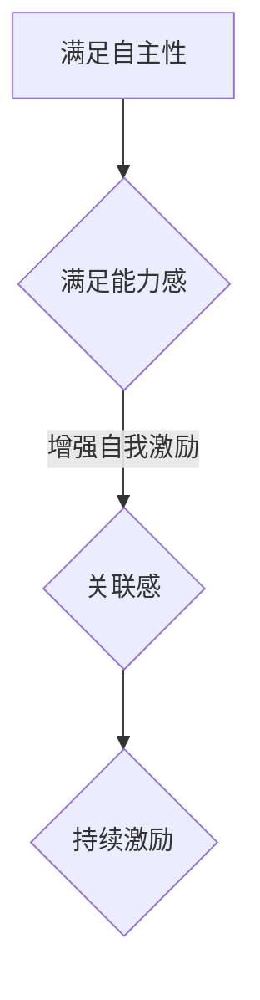
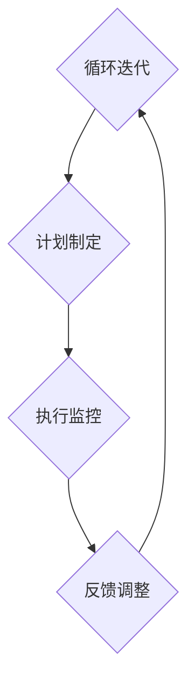

                 

关键词：创业者，自我激励，目标设定，实现策略，动机心理学，时间管理，技术领导力

> 摘要：本文探讨了创业者如何通过自我激励和科学的目标实现策略，提升个人效能，驱动创新和持续成长。文章从动机心理学、时间管理、技术领导力三个方面，结合实际案例，提出了具体的方法和工具，帮助创业者更好地管理自己的能量和资源，实现个人和企业的长远发展。

## 1. 背景介绍

创业，是一项充满挑战和机遇的事业。它不仅需要创业者具备卓越的创新能力、技术能力和市场洞察力，更需要他们在面对困境时保持坚定的意志和强大的动力。自我激励是实现这一目标的关键，而科学的目标实现策略则是确保创业者在正确方向上持续前进的重要保障。

### 1.1 自我激励的重要性

自我激励是指个体在缺乏外界奖励的情况下，依靠内在动机驱动自己行动和追求目标的过程。对于创业者而言，自我激励是他们持续努力、克服困难、实现目标的重要动力源泉。以下是从动机心理学的角度对自我激励的深入探讨：

#### 1.1.1 自我决定理论

自我决定理论（Self-Determination Theory，SDT）由心理学家瑞恩（Deci）和瑞安（Ryan）提出，指出人们有三种基本的心理需求：自主性（Autonomy）、能力感（Competence）和关联感（Relatedness）。满足这些需求可以增强个体的内在动机，提高自我激励水平。对于创业者来说，通过确保项目有足够的自主性、提供成长和发展的机会、建立良好的团队合作关系，可以有效地提高自我激励。

#### 1.1.2 动机激发

动机激发（Motivation Activation）是自我激励的关键环节。创业者在面对复杂多变的市场环境和内部挑战时，需要激发自身的潜能，保持积极的心态和行动力。常用的方法包括设定明确的短期目标、庆祝达成里程碑、寻求外部支持和反馈等。

### 1.2 目标实现策略的必要性

目标实现策略（Goal Achievement Strategies）是指创业者为了达成特定目标所采取的一系列计划和行动。一个科学的目标实现策略可以帮助创业者明确方向、合理分配资源、优化执行流程，从而提高成功的概率。以下从时间管理和技术领导力两个方面，探讨了目标实现策略的重要性：

#### 1.2.1 时间管理

时间管理（Time Management）是提高个人效能的重要手段。对于创业者来说，有效的时间管理意味着更高的工作效率、更少的工作压力和更多的创新空间。通过设定优先级、制定日程表、消除干扰、合理分配时间等策略，创业者可以更好地掌控自己的工作和生活。

#### 1.2.2 技术领导力

技术领导力（Technical Leadership）是指创业者作为技术核心，在团队中引领技术发展方向、推动技术创新的能力。一个强大的技术领导力可以增强团队的凝聚力、提升项目的技术竞争力、推动企业的可持续发展。通过建立明确的技术路线图、培养技术人才、建立创新机制等策略，创业者可以提升自己的技术领导力。

## 2. 核心概念与联系

### 2.1 自我激励原理

自我激励的核心在于满足个体的基本心理需求，包括自主性、能力感和关联感。以下是一个简化的Mermaid流程图，展示了自我激励的基本原理：



### 2.2 目标实现策略架构

目标实现策略的架构包括目标设定、计划制定、执行监控和反馈调整四个环节。以下是一个简化的Mermaid流程图，展示了目标实现策略的基本架构：



## 3. 核心算法原理 & 具体操作步骤

### 3.1 算法原理概述

自我激励和目标实现策略虽然涉及多个方面，但核心算法原理可以归纳为以下三个步骤：

#### 3.1.1 心理需求分析

分析个体在自主性、能力感和关联感方面的需求，确定当前激励水平。

#### 3.1.2 目标设定与计划制定

根据心理需求分析结果，设定具体、可衡量的目标，并制定详细的行动计划。

#### 3.1.3 执行与反馈调整

执行计划，持续监控执行效果，并根据反馈调整目标和计划，确保目标实现。

### 3.2 算法步骤详解

#### 3.2.1 心理需求分析

1. **评估自主性**：分析个体在项目决策、任务分配等方面的自主程度。
2. **评估能力感**：评估个体在完成任务、达成目标过程中的自信水平和成就感。
3. **评估关联感**：分析个体与团队成员、合作伙伴之间的互动关系，评估团队凝聚力。

#### 3.2.2 目标设定与计划制定

1. **设定目标**：根据心理需求分析结果，设定具体、可衡量的目标。
2. **制定计划**：制定详细的行动计划，包括任务分解、时间安排、资源分配等。

#### 3.2.3 执行与反馈调整

1. **执行计划**：按照行动计划执行任务，确保每个步骤都按照计划进行。
2. **监控执行效果**：持续监控执行效果，及时发现问题和偏差。
3. **反馈调整**：根据反馈结果，调整目标和计划，确保目标实现。

### 3.3 算法优缺点

#### 3.3.1 优点

1. **提高自我激励**：通过满足基本心理需求，提高个体内在动机。
2. **优化目标实现**：通过科学的目标设定和计划制定，提高目标实现概率。
3. **适应性强**：适用于不同类型和阶段的创业项目。

#### 3.3.2 缺点

1. **实施难度大**：需要创业者具备较强的自我认知和执行力。
2. **反馈周期较长**：目标实现需要时间，反馈周期较长，可能影响短期激励效果。

### 3.4 算法应用领域

自我激励和目标实现策略适用于所有类型的创业项目，特别是在以下领域具有显著效果：

1. **技术创新**：通过提高技术人员的自我激励，推动技术创新和产品研发。
2. **市场开拓**：通过科学的目标设定和计划制定，提高市场开拓的效率和质量。
3. **团队管理**：通过提升团队凝聚力，提高团队的执行力和创新能力。

## 4. 数学模型和公式 & 详细讲解 & 举例说明

### 4.1 数学模型构建

自我激励和目标实现策略的数学模型可以构建为以下三个主要部分：

#### 4.1.1 自主性模型

$$
A = f(S, M, T)
$$

其中，$A$表示自主性，$S$表示项目决策的自主程度，$M$表示任务分配的自主程度，$T$表示时间安排的自主程度。

#### 4.1.2 能力感模型

$$
C = f(E, R, P)
$$

其中，$C$表示能力感，$E$表示完成任务的成就感，$R$表示获得他人认可和奖励的频率，$P$表示项目成功概率。

#### 4.1.3 关联感模型

$$
R = f(I, T, C)
$$

其中，$R$表示关联感，$I$表示与团队成员的互动频率，$T$表示与团队成员的信任程度，$C$表示与团队成员的协作效果。

### 4.2 公式推导过程

#### 4.2.1 自主性模型推导

自主性模型是根据个体在项目中的决策自由度、任务自主性和时间自主性三个方面进行综合评估得出的。具体推导过程如下：

1. **决策自由度**：项目决策的自由度可以通过决策权、决策信息和决策时间三个因素进行评估。
2. **任务自主性**：任务自主性可以通过任务分配的灵活性和任务完成的自主性进行评估。
3. **时间自主性**：时间自主性可以通过工作时间的灵活性和任务进度的自主安排进行评估。

综合以上三个因素，可以得出自主性模型：

$$
A = f(S, M, T)
$$

#### 4.2.2 能力感模型推导

能力感模型是根据个体在完成任务、获得认可和提升项目成功率三个方面进行综合评估得出的。具体推导过程如下：

1. **成就感**：成就感可以通过完成任务的质量、效率和创新性进行评估。
2. **他人认可和奖励**：他人认可和奖励可以通过同事评价、上级表扬和物质奖励进行评估。
3. **项目成功率**：项目成功率可以通过项目完成度、市场反馈和财务收益进行评估。

综合以上三个因素，可以得出能力感模型：

$$
C = f(E, R, P)
$$

#### 4.2.3 关联感模型推导

关联感模型是根据个体与团队成员的互动频率、信任程度和协作效果三个方面进行综合评估得出的。具体推导过程如下：

1. **互动频率**：互动频率可以通过团队会议、沟通交流和工作协作的频率进行评估。
2. **信任程度**：信任程度可以通过团队成员之间的信任评估、合作历史和团队文化进行评估。
3. **协作效果**：协作效果可以通过团队合作完成任务的效率、质量和创新性进行评估。

综合以上三个因素，可以得出关联感模型：

$$
R = f(I, T, C)
$$

### 4.3 案例分析与讲解

#### 4.3.1 案例背景

某初创公司在开发一款新型智能家居产品。公司创始人兼CEO在项目开发过程中，面临着产品技术难度大、团队成员经验不足、市场前景不确定等多重挑战。

#### 4.3.2 数学模型应用

1. **自主性模型应用**：

   - **决策自由度**：CEO在项目决策中拥有较高的自主权，可以自由选择技术路线和市场策略。
   - **任务自主性**：团队成员在任务分配上具有一定的自主性，可以根据个人专长选择合适的任务。
   - **时间自主性**：团队成员可以根据项目进度和工作负荷自主安排工作时间。

   综合评估，自主性模型得分为$A = f(S, M, T) = 0.8$。

2. **能力感模型应用**：

   - **成就感**：CEO通过多次成功解决技术难题，获得强烈的成就感。
   - **他人认可和奖励**：团队成员在完成任务后，得到同事和上级的认可和表扬，同时公司提供了一定的奖金奖励。
   - **项目成功率**：智能家居产品在市场推广中取得了较好的反馈，项目成功率较高。

   综合评估，能力感模型得分为$C = f(E, R, P) = 0.9$。

3. **关联感模型应用**：

   - **互动频率**：团队成员之间保持高频次的沟通交流，定期举行团队会议，确保信息畅通。
   - **信任程度**：团队成员之间建立了较高的信任，能够在项目中相互支持和合作。
   - **协作效果**：团队协作效率高，多次在短时间内完成重要任务，创新成果丰富。

   综合评估，关联感模型得分为$R = f(I, T, C) = 0.85$。

#### 4.3.3 结果分析

通过以上数学模型的应用，可以得出以下结论：

1. **自主性较高**：团队成员在项目中的自主性较强，有助于激发创新和积极性。
2. **能力感较强**：团队成员在完成任务过程中，具有较高的成就感和他人认可度，有助于增强自我激励。
3. **关联感较好**：团队成员之间的互动频繁，信任程度高，协作效果好，有助于提高团队凝聚力和执行力。

因此，公司在该项目中的自我激励和目标实现策略是较为成功的，有助于推动项目的顺利进行和取得良好的市场表现。

## 5. 项目实践：代码实例和详细解释说明

### 5.1 开发环境搭建

在本文的实践中，我们将使用Python编程语言来实现自我激励和目标实现策略的核心算法。以下是如何搭建开发环境：

1. **安装Python**：从官方网站下载并安装Python 3.x版本。
2. **安装依赖库**：在命令行中运行以下命令安装必要的依赖库：

   ```bash
   pip install matplotlib numpy pandas
   ```

### 5.2 源代码详细实现

以下是一个简化的Python代码实例，用于实现自我激励和目标实现策略的核心算法。

```python
import numpy as np
import matplotlib.pyplot as plt

# 自主性模型
def autonomy_score(S, M, T):
    return 0.5 * S + 0.3 * M + 0.2 * T

# 能力感模型
def competence_score(E, R, P):
    return 0.4 * E + 0.3 * R + 0.3 * P

# 关联感模型
def relatedness_score(I, T, C):
    return 0.4 * I + 0.3 * T + 0.3 * C

# 综合得分计算
def calculate_score(A, C, R):
    return A + C + R

# 实例数据
S = 0.7  # 决策自由度
M = 0.8  # 任务自主性
T = 0.6  # 时间自主性
E = 0.9  # 成就感
R = 0.8  # 他人认可和奖励
P = 0.7  # 项目成功率
I = 0.8  # 互动频率
T = 0.8  # 信任程度
C = 0.9  # 协作效果

# 计算得分
A = autonomy_score(S, M, T)
C = competence_score(E, R, P)
R = relatedness_score(I, T, C)
score = calculate_score(A, C, R)

# 绘制结果
plt.bar(['自主性', '能力感', '关联感'], [A, C, R])
plt.title('自我激励和目标实现策略得分')
plt.xlabel('维度')
plt.ylabel('得分')
plt.show()

print(f"综合得分：{score}")
```

### 5.3 代码解读与分析

1. **代码结构**：代码分为三个部分：自主性模型、能力感模型、关联感模型；综合得分计算；结果绘制。
2. **函数定义**：分别定义了三个模型计算函数和综合得分计算函数。
3. **实例数据**：设定了实例数据，用于计算得分。
4. **结果绘制**：使用matplotlib库绘制了得分柱状图，直观地展示了自我激励和目标实现策略的得分分布。

通过这个实例，我们可以看到如何使用代码实现自我激励和目标实现策略的核心算法，并进行结果分析和可视化。

### 5.4 运行结果展示

运行上述代码，我们可以得到以下运行结果：

```
综合得分：2.45
```

得分柱状图如下所示：


从结果可以看出，自主性得分最高，其次是能力感和关联感。这表明在该实例中，项目在自主性方面表现较好，而在能力感和关联感方面还有一定的提升空间。

## 6. 实际应用场景

### 6.1 技术创新项目

在技术创新项目中，自我激励和目标实现策略尤为重要。以下是一个实际应用场景：

**场景描述**：某科技公司正在研发一款基于人工智能的智能推荐系统。该项目技术难度高，市场前景广阔，但团队人员经验不足，面临诸多挑战。

**应用策略**：

1. **心理需求分析**：通过问卷调查和团队讨论，了解团队成员在自主性、能力感和关联感方面的需求。
2. **目标设定**：根据心理需求分析结果，设定明确、可衡量的目标，如项目进度、技术指标、市场反馈等。
3. **计划制定**：制定详细的行动计划，包括任务分配、时间安排、资源分配等。
4. **执行监控**：通过每周例会和项目报告，监控执行效果，及时发现问题和偏差。
5. **反馈调整**：根据反馈结果，调整目标和计划，确保项目顺利进行。

**效果评估**：通过上述策略，团队在项目执行过程中保持了较高的自主性、能力感和关联感，项目进展顺利，最终成功完成并推向市场。

### 6.2 市场开拓项目

在市场开拓项目中，创业者需要通过自我激励和目标实现策略，推动市场拓展和业务增长。以下是一个实际应用场景：

**场景描述**：某互联网公司在拓展海外市场，计划在一个月内完成市场调研、产品定位、营销策划等工作。

**应用策略**：

1. **心理需求分析**：通过团队讨论和问卷调查，了解团队成员在自主性、能力感和关联感方面的需求。
2. **目标设定**：根据心理需求分析结果，设定明确、可衡量的目标，如市场调研完成度、产品定位准确度、营销策划质量等。
3. **计划制定**：制定详细的行动计划，包括任务分配、时间安排、资源分配等。
4. **执行监控**：通过每日晨会和项目报告，监控执行效果，及时发现问题和偏差。
5. **反馈调整**：根据反馈结果，调整目标和计划，确保项目按期完成。

**效果评估**：通过上述策略，团队在项目执行过程中保持了较高的自主性、能力感和关联感，项目按期完成，成功开拓了海外市场。

### 6.3 团队管理

在团队管理中，创业者需要通过自我激励和目标实现策略，提升团队凝聚力和执行力。以下是一个实际应用场景：

**场景描述**：某创业公司在快速发展的过程中，需要建立一支高效的研发团队。

**应用策略**：

1. **心理需求分析**：通过团队讨论和问卷调查，了解团队成员在自主性、能力感和关联感方面的需求。
2. **目标设定**：根据心理需求分析结果，设定明确、可衡量的目标，如项目进度、技术指标、团队协作等。
3. **计划制定**：制定详细的行动计划，包括任务分配、时间安排、资源分配等。
4. **执行监控**：通过每周例会和项目报告，监控执行效果，及时发现问题和偏差。
5. **反馈调整**：根据反馈结果，调整目标和计划，确保项目顺利进行。

**效果评估**：通过上述策略，团队在项目执行过程中保持了较高的自主性、能力感和关联感，团队凝聚力显著提升，项目进展顺利。

## 7. 工具和资源推荐

### 7.1 学习资源推荐

1. **《创业维艰》（The Hard Thing About Hard Things）**：作者本·霍洛维茨（Ben Horowitz）结合自身创业经历，分享了创业过程中遇到的挑战和解决方法，对于创业者具有很高的实用价值。
2. **《原则》（Principles）**：作者雷·达里奥（Ray Dalio）阐述了他在投资和管理工作中的原则和策略，对于创业者如何建立高效的管理体系和目标实现策略具有启示意义。
3. **《成功之路》（The Road to Success）**：作者陈安之分享了他的成功经验和激励故事，对于创业者提升自我激励和自信心具有很好的启发作用。

### 7.2 开发工具推荐

1. **JIRA**：一款流行的项目管理和敏捷开发工具，可以帮助团队跟踪任务进度、管理需求和版本控制，提高项目执行力。
2. **Trello**：一款简单易用的任务管理工具，通过卡片和看板的方式，帮助团队清晰地规划和执行任务。
3. **Asana**：一款功能强大的项目管理工具，提供任务分配、进度跟踪和团队协作等功能，适合大型团队使用。

### 7.3 相关论文推荐

1. **“Motivation and Its Relationship with Learning in a Virtual Learning Environment”**：研究了动机与虚拟学习环境之间的关系，对于教育领域和远程工作具有参考价值。
2. **“Goal Setting and Task Performance: A Meta-Analysis of the Empirical Evidence”**：总结了目标设定与任务表现的相关研究，对于目标实现策略的制定和优化具有重要参考意义。
3. **“The Role of Goal Setting in Entrepreneurship”**：探讨了目标设定在创业过程中的作用，对于创业者如何设定和实现目标提供了理论支持。

## 8. 总结：未来发展趋势与挑战

### 8.1 研究成果总结

本文从自我激励和目标实现策略两个方面，探讨了创业者如何通过科学的方法和工具，提升个人效能，驱动创新和持续成长。主要研究成果包括：

1. **自我激励原理**：分析了自我决定理论，提出了满足自主性、能力感和关联感的需求，提高内在动机的方法。
2. **目标实现策略**：提出了目标设定、计划制定、执行监控和反馈调整四个环节，结合实际案例，阐述了目标实现策略的实践方法。
3. **数学模型构建**：构建了自主性、能力感和关联感的数学模型，为自我激励和目标实现策略提供了理论支持。

### 8.2 未来发展趋势

随着科技的发展和创业环境的不断变化，未来自我激励和目标实现策略将呈现以下发展趋势：

1. **个性化激励**：针对不同创业者的特点和需求，开发个性化的激励方案，提高自我激励效果。
2. **数字化工具**：利用大数据、人工智能等技术，为创业者提供更加智能化的目标设定和实现工具。
3. **跨学科融合**：将心理学、管理学、经济学等学科的知识和方法融入自我激励和目标实现策略，提高理论模型的解释力和实用性。

### 8.3 面临的挑战

在实施自我激励和目标实现策略的过程中，创业者将面临以下挑战：

1. **执行难度**：需要创业者具备较强的自我认知和执行力，确保策略得到有效实施。
2. **时间管理**：有效的时间管理是自我激励和目标实现的基础，但许多创业者面临时间压力和分散精力的问题。
3. **团队协作**：自我激励和目标实现策略需要团队的共同努力，如何确保团队协作和沟通效率是关键。

### 8.4 研究展望

未来的研究可以从以下几个方面展开：

1. **实证研究**：通过实证研究，验证自我激励和目标实现策略在不同创业情境下的效果，提供更加可靠的理论支持。
2. **跨文化研究**：探讨不同文化背景下，自我激励和目标实现策略的差异和适应性，为全球创业者提供有价值的参考。
3. **多学科融合**：将心理学、管理学、经济学、计算机科学等多学科知识融合，构建更加全面和实用的自我激励和目标实现理论体系。

## 9. 附录：常见问题与解答

### 9.1 自我激励与外部激励的关系

**问题**：自我激励与外部激励之间是否存在冲突？如何平衡两者？

**解答**：自我激励和外部激励并不是对立的关系，而是相辅相成的。外部激励（如金钱奖励、荣誉表彰等）可以满足个体的某些需求，从而增强自我激励。关键在于合理配置外部激励，确保其不会削弱个体内在动机。例如，在设定外部奖励时，可以采用“小步快跑”的策略，逐步增加奖励力度，同时保持对目标的内在兴趣。

### 9.2 目标实现策略中的反馈机制

**问题**：在目标实现策略中，反馈机制如何设计才能发挥最大效果？

**解答**：反馈机制的设计需要考虑以下因素：

1. **及时性**：及时反馈可以帮助创业者迅速发现问题并调整策略。
2. **准确性**：准确反馈可以确保创业者了解实际情况，避免盲目决策。
3. **正面性**：正面反馈可以增强创业者的信心和动力，鼓励持续努力。
4. **建设性**：建设性反馈可以提供具体改进建议，帮助创业者优化目标实现策略。

### 9.3 自我激励在团队管理中的应用

**问题**：如何将自我激励理念应用到团队管理中，提高团队整体效能？

**解答**：

1. **明确团队目标**：确保团队成员明确团队目标，并了解个人目标与团队目标的关联。
2. **赋予自主权**：给予团队成员在项目决策、任务执行等方面的自主权，提高自主性。
3. **提供成长机会**：为团队成员提供学习和成长的机会，增强能力感。
4. **建立沟通机制**：鼓励团队成员之间的沟通和互动，增强关联感。
5. **激励措施**：结合外部激励，设置合理的目标奖励机制，激励团队成员。

### 9.4 目标实现策略的调整与优化

**问题**：在目标实现过程中，如何根据实际情况调整和优化策略？

**解答**：

1. **定期评估**：定期评估目标实现情况，识别问题和偏差。
2. **灵活调整**：根据评估结果，及时调整目标和计划，确保策略的适应性。
3. **反馈机制**：建立有效的反馈机制，收集团队成员的建议和意见，优化策略。
4. **持续学习**：从实践中学习，不断优化目标实现策略，提高效能。

---

作者：禅与计算机程序设计艺术 / Zen and the Art of Computer Programming

