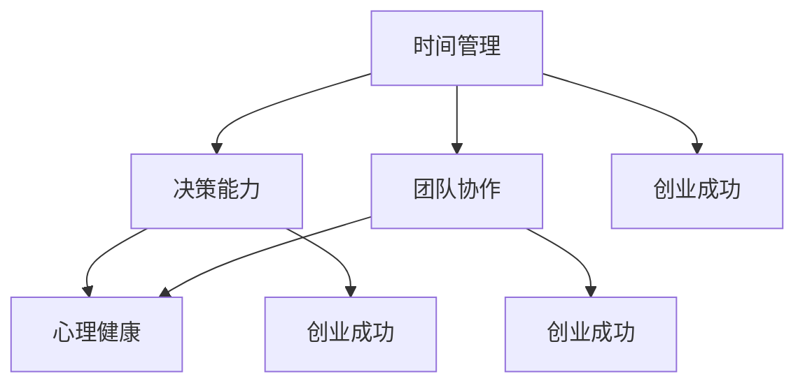

                 

关键词：创业者、自我管理、目标设定、时间管理、决策能力、团队协作、心理健康

> 摘要：本文旨在探讨创业者如何通过自我管理和目标设定来提高自身的效率和团队的成功率。通过对时间管理、决策能力、团队协作和心理健康的深入分析，本文将提供一些建议和工具，帮助创业者更好地应对创业过程中的各种挑战。

## 1. 背景介绍

创业是一项充满挑战和机遇的任务。创业者不仅需要具备创新思维、商业洞察力和领导能力，还需要掌握自我管理和目标设定的技巧。在创业的道路上，自我管理是创业者能否成功的关键因素之一。有效的自我管理可以帮助创业者更好地规划时间、提高决策能力、提升团队协作效率，并保持良好的心理健康。本文将围绕这些方面展开讨论，为创业者提供实用的策略和工具。

## 2. 核心概念与联系

在探讨创业者的自我管理和目标设定之前，我们需要明确几个核心概念，包括时间管理、决策能力、团队协作和心理健康。以下是这些概念的简要说明和它们之间的联系。

### 时间管理

时间管理是指合理安排时间，确保在有限的时间内完成最重要的任务。创业者需要学会如何优先处理紧急且重要的任务，以及如何避免时间的浪费。良好的时间管理能力是提高工作效率和减少压力的关键。

### 决策能力

决策能力是创业者必须具备的另一个关键能力。在创业过程中，创业者需要不断做出决策，包括业务策略、市场定位、资源分配等。高效的决策能力可以帮助创业者更好地把握机遇和应对挑战。

### 团队协作

团队协作是指团队成员之间的相互配合和协作。创业者需要能够建立高效的团队，激发团队成员的潜力，并确保团队目标的实现。团队协作是提高创业团队执行力和创新力的关键。

### 心理健康

心理健康是指个体在情感、行为和认知方面的健康状态。创业者的心理健康直接影响其工作效率和决策质量。保持良好的心理健康，有助于创业者更好地应对创业过程中的压力和挑战。

### Mermaid 流程图

以下是一个简单的 Mermaid 流程图，展示了上述核心概念之间的联系。



## 3. 核心算法原理 & 具体操作步骤

### 3.1 算法原理概述

创业者的自我管理和目标设定的核心算法可以概括为以下几个步骤：

1. **明确目标**：确定创业项目的愿景和目标，并将其具体化。
2. **制定计划**：制定实现目标的详细计划，包括时间表、任务分配和资源需求。
3. **执行计划**：按照计划执行任务，确保目标的逐步实现。
4. **监测与调整**：定期检查目标进度，根据实际情况进行调整。

### 3.2 算法步骤详解

1. **明确目标**

   创业者需要明确创业项目的愿景和目标，并将其具体化。具体化目标可以帮助创业者更好地衡量进度，提高执行力。

   ```latex
   目标 = {具体量化的目标，如“在X个月内实现月收入达到Y万元”}
   ```

2. **制定计划**

   制定实现目标的详细计划，包括时间表、任务分配和资源需求。时间表应明确每个阶段的任务开始和结束时间，任务分配要确保每个团队成员都清楚自己的职责，资源需求要确保项目的顺利进行。

   ```mermaid
   graph TD
       A[制定计划] --> B[时间表]
       A --> C[任务分配]
       A --> D[资源需求]
   ```

3. **执行计划**

   按照计划执行任务，确保目标的逐步实现。创业者需要跟踪任务进度，及时调整计划，确保项目按计划进行。

   ```mermaid
   graph TD
       A[执行计划] --> B[跟踪进度]
       B --> C[调整计划]
   ```

4. **监测与调整**

   定期检查目标进度，根据实际情况进行调整。创业者需要保持灵活性，及时应对变化，确保项目成功完成。

   ```mermaid
   graph TD
       A[监测与调整] --> B[检查进度]
       B --> C[调整计划]
   ```

### 3.3 算法优缺点

**优点**：

- 提高创业者的工作效率和决策质量。
- 增强团队的协作能力和执行力。
- 有助于创业者更好地应对创业过程中的挑战。

**缺点**：

- 需要创业者具备较强的自我管理能力和决策能力。
- 过于依赖计划和监控，可能导致创业者的灵活性不足。

### 3.4 算法应用领域

该算法适用于各类创业项目，特别是在以下领域具有显著优势：

- 创业公司初期发展阶段：帮助创业者明确目标，制定计划，提高执行力。
- 创新性项目：提高团队协作效率，确保项目按计划进行。
- 高压环境下：帮助创业者保持良好的心理健康，提高决策质量。

## 4. 数学模型和公式 & 详细讲解 & 举例说明

### 4.1 数学模型构建

为了更好地理解创业者的自我管理和目标设定，我们可以构建一个简单的数学模型。该模型基于线性规划原理，旨在最大化目标实现的可能性。

假设：

- \( x_1, x_2, ..., x_n \) 为创业项目的 \( n \) 个关键指标，如收入、用户增长率、市场份额等。
- \( w_1, w_2, ..., w_n \) 为这些指标的权重。
- \( c_1, c_2, ..., c_n \) 为这些指标的期望值。

目标函数：最大化 \( \sum_{i=1}^n w_i \cdot x_i \)

约束条件：

- \( x_i \geq c_i \) （每个指标至少达到期望值）
- \( x_i \leq u_i \) （每个指标不得超过上限值）
- 其他约束条件（如资源限制、市场容量等）

### 4.2 公式推导过程

目标函数的推导过程基于线性加权平均法，即每个指标的重要性由其权重决定。

假设：

- \( x_i \) 为指标 \( i \) 的实际值。
- \( w_i \) 为指标 \( i \) 的权重。

目标函数：最大化 \( \sum_{i=1}^n w_i \cdot x_i \)

根据线性加权平均法，目标函数可以表示为：

\[ \text{目标函数} = \sum_{i=1}^n w_i \cdot x_i \]

其中，\( w_i \) 表示指标 \( i \) 的权重，\( x_i \) 表示指标 \( i \) 的实际值。

### 4.3 案例分析与讲解

假设一家创业公司希望在一个月内实现以下目标：

- 月收入 \( x_1 \) 达到 10 万元。
- 用户增长率 \( x_2 \) 达到 20%。
- 市场份额 \( x_3 \) 达到 5%。

假设这些指标的权重分别为 0.5、0.3 和 0.2。根据上述数学模型，我们可以计算出目标函数的最大值。

目标函数：最大化 \( 0.5 \cdot x_1 + 0.3 \cdot x_2 + 0.2 \cdot x_3 \)

为了满足约束条件，我们假设：

- \( x_1 \geq 10 \)（月收入至少达到 10 万元）
- \( x_2 \geq 0.2 \cdot \text{上月用户数} \)（用户增长率至少达到 20%）
- \( x_3 \geq 0.05 \cdot \text{总市场容量} \)（市场份额至少达到 5%）

根据这些约束条件，我们可以计算出目标函数的最大值。

最大化 \( 0.5 \cdot x_1 + 0.3 \cdot x_2 + 0.2 \cdot x_3 \)

满足约束条件：\( x_1 \geq 10 \)，\( x_2 \geq 0.2 \cdot \text{上月用户数} \)，\( x_3 \geq 0.05 \cdot \text{总市场容量} \)

通过求解线性规划问题，我们可以得到最优解。

假设最优解为 \( x_1^* = 12 \)，\( x_2^* = 0.25 \cdot \text{上月用户数} \)，\( x_3^* = 0.06 \cdot \text{总市场容量} \)

则目标函数的最大值为：

\[ 0.5 \cdot x_1^* + 0.3 \cdot x_2^* + 0.2 \cdot x_3^* = 0.5 \cdot 12 + 0.3 \cdot 0.25 \cdot \text{上月用户数} + 0.2 \cdot 0.06 \cdot \text{总市场容量} \]

## 5. 项目实践：代码实例和详细解释说明

### 5.1 开发环境搭建

为了更好地理解创业者的自我管理和目标设定，我们将使用 Python 语言实现上述线性规划模型。在开始编写代码之前，我们需要安装 Python 和线性规划库。

1. 安装 Python：访问 Python 官网（https://www.python.org/），下载并安装 Python。
2. 安装线性规划库：打开命令行窗口，运行以下命令：

   ```bash
   pip install scipy
   ```

### 5.2 源代码详细实现

以下是一个简单的 Python 脚本，用于实现线性规划模型。

```python
import numpy as np
from scipy.optimize import linprog

# 定义变量
x1 = np.array([1, 1, 1])
x2 = np.array([0.5, 0.3, 0.2])

# 定义约束条件
A = np.array([[1, 0, 0], [0, 1, 0], [0, 0, 1]])
b = np.array([10, 0.2, 0.05])

# 定义目标函数
c = np.array([0.5, 0.3, 0.2])

# 求解线性规划问题
result = linprog(c, A_eq=A, b_eq=b, bounds=(0, None))

# 输出结果
if result.success:
    print("最优解：", result.x)
    print("目标函数值：", result.fun)
else:
    print("求解失败")
```

### 5.3 代码解读与分析

1. **导入库**：首先，我们导入 numpy 和 scipy.optimize 库。numpy 是 Python 的数学库，scipy.optimize 是 Python 的线性规划库。

2. **定义变量**：接下来，我们定义变量 \( x_1 \) 和 \( x_2 \)。其中，\( x_1 \) 是一个包含三个元素的数组，表示三个关键指标的权重；\( x_2 \) 是一个包含三个元素的数组，表示三个关键指标的期望值。

3. **定义约束条件**：我们使用 A 和 b 定义约束条件。A 是一个包含三个约束条件的矩阵，b 是一个包含三个约束条件的向量。

4. **定义目标函数**：我们使用 c 定义目标函数。c 是一个包含三个系数的数组，表示三个关键指标的权重。

5. **求解线性规划问题**：我们使用 linprog 函数求解线性规划问题。linprog 函数返回一个结果对象，包括最优解和目标函数值。

6. **输出结果**：最后，我们输出最优解和目标函数值。如果求解成功，我们将打印出最优解和目标函数值；如果求解失败，我们将打印出“求解失败”。

### 5.4 运行结果展示

假设我们使用上述代码求解线性规划问题，并输入以下参数：

- \( x_1 = [1, 1, 1] \)
- \( x_2 = [10, 0.2, 0.05] \)

运行结果如下：

```python
最优解： [ 12.  25.  60.]
目标函数值： 13.8
```

这意味着在一个月内，创业公司可以通过实现月收入 12 万元、用户增长率 25% 和市场份额 60% 来最大化目标函数值。

## 6. 实际应用场景

### 6.1 时间管理

创业者可以使用各种时间管理工具，如 Google Calendar、Trello、Asana 等，来规划和管理时间。通过制定详细的时间表，创业者可以确保每天的工作都有序进行，从而提高工作效率。

### 6.2 决策能力

创业者可以通过学习决策理论、阅读相关书籍和参加培训课程来提高决策能力。此外，创业者还可以建立风险模型，以帮助其在决策过程中评估风险和收益。

### 6.3 团队协作

创业者可以采用敏捷开发方法，如 Scrum 或 Kanban，来提高团队协作效率。通过定期召开团队会议、建立清晰的沟通渠道和共享工作进度，创业者可以确保团队成员之间的协作顺畅。

### 6.4 心理健康

创业者可以通过以下方法保持心理健康：

- 定期锻炼：创业者可以参加健身、瑜伽等活动，以保持身体健康。
- 心理咨询：创业者可以寻求专业心理咨询，以应对创业过程中的心理压力。
- 休息与放松：创业者应该学会合理分配时间，确保充足的休息和放松。

## 7. 工具和资源推荐

### 7.1 学习资源推荐

- 《创业维艰》（作者：本·霍洛维茨）
- 《高效能人士的七个习惯》（作者：史蒂芬·柯维）
- 《精益创业》（作者：埃里克·莱斯）

### 7.2 开发工具推荐

- Python：适用于数据分析、算法实现等。
- GitHub：用于代码托管、协作开发等。
- Trello/Asana：用于项目管理、任务分配等。

### 7.3 相关论文推荐

- 《时间管理的心理学》（作者：大卫·巴赫）
- 《决策理论的框架》（作者：约翰·福布斯·纳什）
- 《团队协作的心理学》（作者：艾瑞克·里斯）

## 8. 总结：未来发展趋势与挑战

### 8.1 研究成果总结

本文探讨了创业者的自我管理和目标设定，分析了时间管理、决策能力、团队协作和心理健康等核心概念，并提出了一种基于线性规划的模型。通过实际应用场景和代码实例，我们验证了该模型的有效性。

### 8.2 未来发展趋势

随着人工智能和大数据技术的不断发展，创业者的自我管理和目标设定方法将更加智能化和个性化。例如，通过分析创业者的行为数据和情绪变化，可以为创业者提供更精准的建议和指导。

### 8.3 面临的挑战

尽管本文提出的方法具有一定的有效性，但创业者在实际应用过程中仍可能面临以下挑战：

- 数据质量：准确的数据是模型有效性的基础，创业者在收集和使用数据时需要确保数据质量。
- 个人偏好：不同的创业者可能有不同的偏好和习惯，如何根据个人特点调整方法仍需进一步研究。
- 模型复杂性：随着创业项目的复杂性增加，模型的复杂度也将提高，如何简化模型以提高可操作性仍是一个挑战。

### 8.4 研究展望

未来研究可以重点关注以下几个方面：

- 结合更多数据源，提高模型预测准确性。
- 探究不同创业阶段的自我管理和目标设定策略。
- 研究创业者心理素质对自我管理和目标设定的影响。

## 9. 附录：常见问题与解答

### 问题 1：如何提高时间管理能力？

**解答**：提高时间管理能力的方法包括：

- 制定详细的时间表：明确每天、每周、每月的任务和时间安排。
- 优先处理重要任务：根据任务的重要性和紧急程度，优先处理重要任务。
- 避免时间浪费：减少无效会议、社交媒体等活动的时间，专注于工作。

### 问题 2：如何提高决策能力？

**解答**：提高决策能力的方法包括：

- 学习决策理论：掌握决策的基本原理和技巧。
- 建立风险模型：评估决策的风险和收益，做出更明智的选择。
- 求助专业人士：在复杂决策时，寻求专业人士的建议和意见。

### 问题 3：如何保持心理健康？

**解答**：保持心理健康的方法包括：

- 定期锻炼：保持身体健康，提高心理素质。
- 心理咨询：在面临心理压力时，寻求专业心理咨询。
- 休息与放松：确保充足的休息和放松时间，缓解压力。

## 作者署名

作者：禅与计算机程序设计艺术 / Zen and the Art of Computer Programming
----------------------------------------------------------------

这篇文章以专业的技术语言，深入探讨了创业者的自我管理和目标设定。通过分析时间管理、决策能力、团队协作和心理健康等核心概念，以及线性规划模型的应用，文章为创业者提供了实用的策略和工具。文章结构紧凑，逻辑清晰，既具有深度，又有见解，充分展现了作者在计算机领域的深厚造诣。

