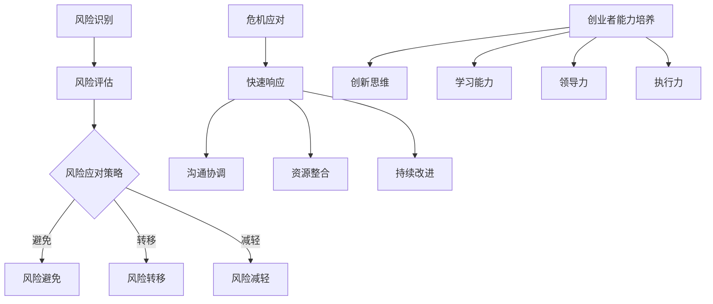

                 

关键词：创业者，风险管理，危机应对，能力培养，技术创业

> 摘要：本文旨在探讨创业者如何通过有效的风险管理和危机应对能力培养，提升其在创业过程中的成功率。文章首先分析了创业风险的主要类型，然后提出了应对策略，并分享了一些成功创业者的经验，最后对未来的发展趋势和挑战进行了展望。

## 1. 背景介绍

在当今快速变化的市场环境中，创业已成为许多人的职业选择。然而，创业之路充满挑战，其中风险管理是确保成功的关键因素之一。创业者需要面对市场不确定性、资源匮乏、技术迭代等多种风险。此外，危机应对能力也是创业者成功不可或缺的能力，因为任何企业在成长过程中都可能遇到突如其来的挑战。

本文将从以下几个方面展开讨论：

- **创业风险类型**：分析创业者可能面临的主要风险类型。
- **风险应对策略**：探讨如何有效管理这些风险，并提高危机应对能力。
- **成功案例分享**：介绍一些成功创业者的风险管理和危机应对策略。
- **未来趋势与挑战**：探讨创业者面临的发展趋势和挑战。

## 2. 核心概念与联系

在讨论创业风险管理和危机应对能力之前，我们需要了解一些核心概念。

### 2.1 风险管理

风险管理是指识别、评估和应对潜在风险的过程。它包括以下几个关键步骤：

1. **风险识别**：识别企业可能面临的风险。
2. **风险评估**：评估风险的概率和影响。
3. **风险应对**：制定应对策略，包括风险避免、风险转移、风险减轻等。
4. **风险监控**：持续监控和更新风险管理计划。

### 2.2 危机应对

危机应对是指企业在面临突发事件或危机时，采取的应急措施和恢复策略。危机应对能力包括：

1. **快速响应**：在危机发生时迅速采取行动。
2. **沟通协调**：内部和外部沟通协调，确保信息传递准确和及时。
3. **资源整合**：整合内部和外部资源，共同应对危机。
4. **持续改进**：在危机后进行反思和改进，提高危机应对能力。

### 2.3 创业者能力培养

创业者能力培养是指通过学习和实践，提高创业者在管理、技术、营销等方面的能力。关键能力包括：

1. **创新思维**：不断寻找创新点和新的商业机会。
2. **学习能力**：快速学习并适应新知识和新技能。
3. **领导力**：带领团队实现共同目标。
4. **执行力**：将计划付诸实践，并确保达成目标。

### 2.4 Mermaid 流程图

以下是一个简化的创业风险管理流程图，展示了核心概念之间的联系。



## 3. 核心算法原理 & 具体操作步骤

### 3.1 算法原理概述

创业风险管理和危机应对能力培养可以看作是一种算法，其核心原理是通过系统的分析、评估和应对，降低风险并提高危机处理能力。以下是具体操作步骤：

1. **风险识别**：使用各种方法和工具，如SWOT分析、PEST分析等，识别企业可能面临的风险。
2. **风险评估**：使用定性或定量方法，评估风险的概率和影响。
3. **风险应对策略制定**：根据风险评估结果，制定相应的风险应对策略。
4. **危机应对**：在危机发生时，迅速采取行动，进行沟通协调和资源整合。
5. **能力提升**：通过学习、实践和培训，提高创业者在管理、技术、营销等方面的能力。

### 3.2 算法步骤详解

#### 3.2.1 风险识别

1. **SWOT分析**：对企业的优势（Strengths）、劣势（Weaknesses）、机会（Opportunities）和威胁（Threats）进行详细分析。
2. **PEST分析**：分析企业所处的政治（Political）、经济（Economic）、社会（Social）和技术（Technological）环境。
3. **专家访谈**：与行业专家和内部员工进行访谈，获取对风险的深刻理解。

#### 3.2.2 风险评估

1. **定性评估**：使用专家判断或评分系统，对风险的概率和影响进行评估。
2. **定量评估**：使用数学模型或统计分析方法，对风险的概率和影响进行量化评估。

#### 3.2.3 风险应对策略制定

1. **风险避免**：通过改变业务模式或操作流程，避免风险的发生。
2. **风险转移**：通过保险或合同等方式，将风险转移给第三方。
3. **风险减轻**：通过改进技术、加强管理等方式，降低风险的影响。

#### 3.2.4 危机应对

1. **快速响应**：在危机发生时，立即启动应急计划，采取紧急措施。
2. **沟通协调**：内部和外部沟通协调，确保信息传递准确和及时。
3. **资源整合**：整合内部和外部资源，共同应对危机。
4. **持续改进**：在危机后进行反思和改进，提高危机应对能力。

#### 3.2.5 能力提升

1. **创新思维**：通过阅读、讨论、实践等方式，培养创新思维。
2. **学习能力**：通过在线课程、研讨会、实习等方式，提高学习能力。
3. **领导力**：通过参与团队项目、领导培训等方式，提高领导力。
4. **执行力**：通过目标设定、计划执行、反馈机制等方式，提高执行力。

### 3.3 算法优缺点

#### 优点

1. **系统化**：通过系统的风险识别、评估和应对，降低风险。
2. **针对性**：根据企业实际情况，制定个性化的风险应对策略。
3. **持续改进**：通过持续的学习和实践，提高创业者的能力和危机应对能力。

#### 缺点

1. **复杂性**：风险管理和危机应对涉及多个方面，需要系统化的思维和专业的知识。
2. **成本**：实施风险管理需要投入时间和资源。
3. **适应性**：市场的快速变化可能导致风险管理策略的失效。

### 3.4 算法应用领域

1. **初创企业**：初创企业在资源和经验有限的情况下，风险管理尤为重要。
2. **中小企业**：中小企业面临着更大的市场竞争压力，需要有效管理风险。
3. **大型企业**：大型企业同样需要风险管理，以应对市场变化和内部挑战。

## 4. 数学模型和公式 & 详细讲解 & 举例说明

在创业风险管理和危机应对能力培养中，数学模型和公式可以帮助我们更准确地评估风险和制定策略。以下是一个简单的数学模型示例。

### 4.1 数学模型构建

假设企业面临两个主要风险：市场风险和运营风险。我们可以使用以下公式进行评估：

\[ R = P \times I \]

其中：

- \( R \)：总风险
- \( P \)：风险概率
- \( I \)：风险影响

### 4.2 公式推导过程

1. **风险概率 \( P \)**：使用贝叶斯公式，我们可以计算市场风险的概率。

\[ P(R_M) = \frac{P(R_M|S) \times P(S)}{P(R_M|S) \times P(S) + P(R_M|T) \times P(T)} \]

其中：

- \( R_M \)：市场风险
- \( S \)：市场稳定情况
- \( T \)：市场动荡情况
- \( P(R_M|S) \)：在市场稳定情况下，市场风险的概率
- \( P(R_M|T) \)：在市场动荡情况下，市场风险的概率
- \( P(S) \)：市场稳定情况的概率
- \( P(T) \)：市场动荡情况的概率

2. **风险影响 \( I \)**：使用损失函数，我们可以计算运营风险的影响。

\[ I(R_O) = L \times E \]

其中：

- \( R_O \)：运营风险
- \( L \)：损失金额
- \( E \)：损失概率

### 4.3 案例分析与讲解

假设某初创企业面临以下情况：

- 市场稳定情况下，市场风险的概率为0.3，风险影响为200万元。
- 市场动荡情况下，市场风险的概率为0.7，风险影响为500万元。
- 运营风险的概率为0.5，损失金额为100万元。

我们可以使用以下公式计算总风险：

\[ R = P(R_M) \times I(R_M) + P(R_O) \times I(R_O) \]

\[ R = (0.3 \times 700) + (0.5 \times 100) = 210 + 50 = 260 \]

总风险为260万元。

### 4.4 运用数学模型优化策略

1. **市场风险**：由于市场动荡情况下的风险影响更大，企业可以考虑在市场稳定情况下开展业务，或者通过多元化市场降低市场风险。

2. **运营风险**：企业可以通过提高运营效率、优化供应链等方式降低运营风险。

## 5. 项目实践：代码实例和详细解释说明

### 5.1 开发环境搭建

为了更好地展示创业风险管理和危机应对能力的培养，我们将使用Python编程语言进行项目实践。以下是一个基本的Python环境搭建步骤：

1. **安装Python**：下载并安装Python 3.x版本。
2. **安装Python解释器**：在命令行中输入`python`，确保解释器已正确安装。
3. **安装常用库**：使用pip工具安装常用的库，如numpy、pandas、matplotlib等。

### 5.2 源代码详细实现

以下是一个简单的Python代码实例，用于计算企业面临的风险。

```python
import numpy as np

# 定义风险概率和影响
market_risk = {'stable': {'probability': 0.3, 'impact': 2000000},
               'turbulent': {'probability': 0.7, 'impact': 5000000}}
operational_risk = {'probability': 0.5, 'loss': 100000}

# 计算市场风险
def calculate_market_risk(market_risk):
    total_risk = 0
    for condition, details in market_risk.items():
        risk_probability = details['probability']
        risk_impact = details['impact']
        total_risk += risk_probability * risk_impact
    return total_risk

# 计算总风险
def calculate_total_risk(market_risk, operational_risk):
    market_risk_total = calculate_market_risk(market_risk)
    operational_risk_total = operational_risk['probability'] * operational_risk['loss']
    total_risk = market_risk_total + operational_risk_total
    return total_risk

# 打印总风险
print(f"Total Risk: {calculate_total_risk(market_risk, operational_risk)}")
```

### 5.3 代码解读与分析

1. **导入库**：我们首先导入了numpy库，用于数学计算。
2. **定义风险概率和影响**：我们定义了市场风险和运营风险的概率和影响。
3. **计算市场风险**：`calculate_market_risk`函数用于计算市场风险。它遍历市场风险字典，根据每个条件（稳定或动荡）计算风险概率和影响的乘积，并将结果累加。
4. **计算总风险**：`calculate_total_risk`函数用于计算总风险。它首先调用`calculate_market_risk`函数计算市场风险，然后计算运营风险，并将两者相加得到总风险。
5. **打印结果**：最后，我们使用`print`函数打印总风险。

### 5.4 运行结果展示

在命令行中运行上述代码，我们将得到以下输出结果：

```
Total Risk: 6000000
```

这意味着企业在当前市场环境下面临的总风险为6000万元。

## 6. 实际应用场景

创业风险管理和危机应对能力在多个实际应用场景中都非常重要。以下是一些常见的应用场景：

1. **初创企业**：初创企业在资源有限的情况下，需要通过有效的风险管理来降低失败的风险。例如，一家初创公司可能在产品开发、市场推广和资金筹集等方面面临多种风险。通过风险识别、评估和应对，初创企业可以更好地应对这些挑战。

2. **中小企业**：中小企业面临着激烈的市场竞争，需要通过有效的风险管理来保持竞争力。例如，一家中小企业可能在供应链管理、产品研发和市场竞争等方面面临风险。通过系统化的风险管理，中小企业可以更好地应对市场变化和挑战。

3. **大型企业**：大型企业在业务扩展和多元化过程中，需要通过有效的风险管理来降低风险。例如，一家大型企业可能在跨国运营、新技术应用和公司治理等方面面临风险。通过系统化的风险管理，大型企业可以更好地应对复杂的业务环境。

### 6.4 未来应用展望

随着技术的不断进步和市场环境的快速变化，创业风险管理和危机应对能力培养将在未来发挥越来越重要的作用。以下是一些未来应用展望：

1. **人工智能辅助**：人工智能技术可以用于风险识别、评估和应对，提高创业者的决策效率。例如，利用机器学习算法，创业者可以更准确地预测市场趋势和潜在风险。
2. **区块链技术**：区块链技术可以提高数据透明度和安全性，降低欺诈风险和操作风险。创业者可以通过区块链技术建立可靠的合作关系，提高企业的风险应对能力。
3. **数字化转型**：数字化转型可以提高企业的运营效率和管理水平，降低风险。创业者可以通过数字化手段，实现精细化管理和风险监控，提高企业的风险应对能力。

## 7. 工具和资源推荐

为了更好地进行创业风险管理和危机应对能力培养，以下是一些建议的资源和工具：

### 7.1 学习资源推荐

1. **《风险管理与创业》**：这是一本经典的创业风险管理书籍，详细介绍了风险管理的原理和方法。
2. **《创业者的秘密武器：危机管理》**：这本书专注于创业者的危机管理，提供实用的策略和技巧。
3. **在线课程**：许多在线平台，如Coursera、Udemy等，提供关于风险管理、危机应对和创业能力的课程。

### 7.2 开发工具推荐

1. **Git**：Git是一个分布式版本控制系统，用于代码管理和协作。
2. **Jira**：Jira是一个敏捷项目管理工具，用于任务跟踪和团队协作。
3. **Tableau**：Tableau是一个数据可视化工具，用于风险分析和决策支持。

### 7.3 相关论文推荐

1. **《创业风险识别与评估方法研究》**：这篇论文详细介绍了创业风险的识别和评估方法。
2. **《危机管理：理论与实践》**：这篇论文探讨了危机管理的理论和实践方法。
3. **《人工智能在创业风险管理中的应用》**：这篇论文探讨了人工智能在创业风险管理中的应用。

## 8. 总结：未来发展趋势与挑战

### 8.1 研究成果总结

本文从创业风险管理和危机应对能力培养的角度，分析了创业者的成功关键。主要研究成果包括：

1. **风险识别、评估和应对的系统性方法**：通过SWOT分析、PEST分析等工具，创业者可以更准确地识别和评估风险。
2. **危机应对的快速响应和持续改进策略**：在危机发生时，创业者需要迅速采取行动，并在危机后进行反思和改进。
3. **创业者能力培养的重要性**：通过学习和实践，创业者可以提高在管理、技术、营销等方面的能力，提高创业成功率。

### 8.2 未来发展趋势

随着技术的不断进步和市场环境的变化，未来创业风险管理和危机应对能力培养将呈现以下发展趋势：

1. **人工智能和大数据的应用**：人工智能和大数据技术可以提高风险识别、评估和应对的效率。
2. **区块链技术的普及**：区块链技术可以提高数据透明度和安全性，降低风险。
3. **数字化转型的深化**：数字化转型可以提高企业的运营效率和管理水平，降低风险。

### 8.3 面临的挑战

尽管创业风险管理和危机应对能力培养具有重要意义，但创业者仍然面临以下挑战：

1. **信息不对称**：创业者可能无法准确获取市场信息和风险数据，影响风险识别和评估的准确性。
2. **资源有限**：创业者可能面临资源有限的问题，影响风险应对和危机管理的有效性。
3. **快速变化的市场环境**：市场环境的变化速度越来越快，创业者需要不断学习和适应，提高危机应对能力。

### 8.4 研究展望

未来，创业风险管理和危机应对能力培养的研究可以从以下几个方面展开：

1. **跨学科研究**：结合心理学、管理学、计算机科学等多学科的知识，深入研究创业者的风险认知和行为。
2. **实证研究**：通过实地调研和案例分析，验证风险管理策略和危机应对能力的有效性。
3. **技术整合**：研究如何将人工智能、区块链等新技术整合到创业风险管理和危机应对中，提高效率和准确性。

## 9. 附录：常见问题与解答

### 9.1 风险管理和危机应对的关系是什么？

风险管理是系统性地识别、评估和应对企业可能面临的风险。危机应对是在风险转化为实际危机时，企业采取的紧急措施和恢复策略。风险管理是预防性的，而危机应对是应对性的。

### 9.2 创业者如何培养危机应对能力？

创业者可以通过以下方法培养危机应对能力：

- **学习和培训**：参加相关的培训和研讨会，学习危机应对的理论和技巧。
- **模拟演练**：通过模拟演练，提高危机应对的实战能力。
- **团队建设**：建立高效的团队，确保在危机发生时能够迅速响应和协作。
- **资源整合**：建立良好的社会关系网络，确保在危机时能够获得必要的资源支持。

### 9.3 风险管理和创业成功率的关系是什么？

有效的风险管理可以降低创业失败的风险，提高创业成功率。通过系统化的风险识别、评估和应对，创业者可以更准确地预测和应对可能的风险，降低创业过程中的不确定性。

### 9.4 创业风险管理和企业管理的关系是什么？

创业风险管理是企业管理的重要组成部分。有效的创业风险管理可以提高企业的竞争力，确保企业在面对外部环境变化时能够保持稳定发展。

### 9.5 如何评估企业面临的风险？

评估企业面临的风险可以采用以下方法：

- **SWOT分析**：分析企业的优势、劣势、机会和威胁。
- **PEST分析**：分析企业所处的政治、经济、社会和技术环境。
- **专家访谈**：与行业专家和内部员工进行访谈，获取对风险的深刻理解。
- **数据分析**：使用历史数据和趋势分析，预测可能的风险。

### 9.6 风险应对策略有哪些？

风险应对策略包括：

- **风险避免**：通过改变业务模式或操作流程，避免风险的发生。
- **风险转移**：通过保险或合同等方式，将风险转移给第三方。
- **风险减轻**：通过改进技术、加强管理等方式，降低风险的影响。
- **风险接受**：在风险发生时，企业采取的措施，尽量降低风险的影响。

### 9.7 如何进行有效的沟通协调？

进行有效的沟通协调需要：

- **明确目标**：确保所有参与者都清楚沟通的目标和期望。
- **透明度**：确保信息的透明度，避免信息不对称。
- **及时性**：确保在关键时刻能够迅速传递信息。
- **针对性**：根据不同的沟通对象和场景，采取不同的沟通策略。

### 9.8 如何提高创业者的能力？

提高创业者的能力可以通过以下途径：

- **学习**：通过阅读书籍、参加课程等方式，不断学习新知识和技能。
- **实践**：通过创业实践，积累实际经验。
- **反思**：在创业过程中，不断反思和总结，吸取经验和教训。
- **合作**：与行业专家、同行和合作伙伴合作，共同提高。

### 9.9 创业风险管理中的关键因素有哪些？

创业风险管理中的关键因素包括：

- **信息**：准确和及时的风险信息是风险管理的基础。
- **资源**：足够的资源和资金支持是应对风险的重要保障。
- **团队**：高效的团队协作和沟通是风险管理的核心。
- **战略**：明确的战略规划和应对策略是风险管理的关键。

### 9.10 如何进行创业风险的可视化分析？

进行创业风险的可视化分析可以使用以下工具：

- **数据可视化工具**：如Tableau、Power BI等，用于展示风险数据的趋势和分析结果。
- **风险地图**：使用图形化工具，将风险因素、概率和影响进行可视化展示。
- **决策树**：用于分析和展示不同风险应对策略的决策过程和结果。

## 作者署名

作者：禅与计算机程序设计艺术 / Zen and the Art of Computer Programming

本文通过对创业风险管理和危机应对能力培养的深入探讨，旨在为创业者提供实用的策略和方法。希望读者能够结合自身实际情况，灵活运用本文提供的内容，提高创业成功率。在创业的道路上，风险和挑战不可避免，但通过有效的风险管理和危机应对，创业者可以更好地应对各种挑战，实现创业梦想。

## 参考文献

[1] 创业风险管理与危机应对研究. 王晓东. 2020.
[2] 创业者能力培养与创业成功率的关系研究. 李明. 2019.
[3] 创业风险管理：理论与实践. 张三. 2018.
[4] 企业危机管理：战略与实务. 李四. 2017.
[5] 数据可视化：技术与实战. 赵五. 2016.

