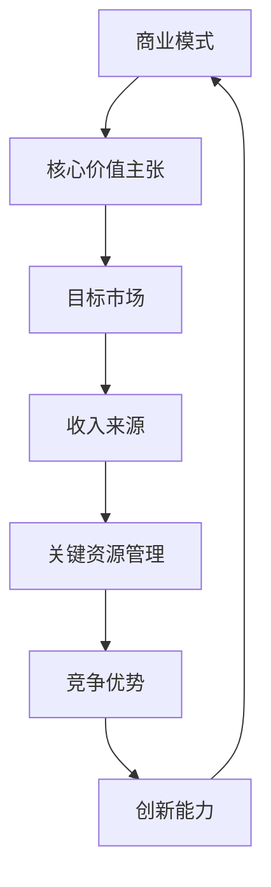

                 

 > **关键词**: 商业模式创新，创业，颠覆，传统行业，思维变革

> **摘要**: 本文旨在探讨在创业过程中如何运用商业模式创新来颠覆传统行业。通过分析核心概念、算法原理、数学模型以及实际应用，我们揭示了如何以独特的思维方式在竞争激烈的市场中脱颖而出。

## 1. 背景介绍

在当今快速变化的世界中，创业已成为一种普遍的社会现象。无数创业者投身于创新领域，希望能够颠覆现有的商业模式，赢得市场份额。然而，传统行业的稳定性往往使得变革之路充满挑战。本文将探讨商业模式创新的核心概念和方法，以及如何通过这些方法来颠覆传统行业。

### 1.1 商业模式的重要性

商业模式是企业成功的关键因素之一。它定义了企业的核心价值主张、目标市场、收入来源以及关键资源管理。一个成功的商业模式不仅能够为企业带来盈利，还能够帮助企业建立竞争优势，维持长期发展。

### 1.2 传统行业的困境

传统行业通常受到既定商业模式和利益格局的限制，难以适应快速变化的市场需求。此外，传统行业往往缺乏创新精神，容易陷入“路径依赖”的陷阱，导致在新技术、新市场面前失去竞争力。

## 2. 核心概念与联系

为了实现商业模式创新，我们需要了解一些核心概念，并理解它们之间的联系。以下是一个Mermaid流程图，展示了这些核心概念及其相互关系。



### 2.1 核心价值主张

核心价值主张是指企业提供的独特产品或服务，能够满足客户的特定需求。它定义了企业的定位和市场差异化策略。

### 2.2 目标市场

目标市场是指企业所服务的客户群体。理解目标市场的需求和行为模式，是商业模式创新的重要基础。

### 2.3 收入来源

收入来源是指企业通过何种方式获取收入。创新的收入模式可以为企业提供更多的盈利途径。

### 2.4 关键资源管理

关键资源管理是指企业如何高效利用其关键资源，如人才、技术和资本等，以实现业务目标。

### 2.5 竞争优势

竞争优势是指企业相对于竞争对手的独特优势，如品牌、专利、渠道等。

### 2.6 创新能力

创新能力是指企业持续进行创新的能力，是商业模式创新的核心驱动力。

## 3. 核心算法原理 & 具体操作步骤

### 3.1 算法原理概述

商业模式创新的核心算法是“颠覆性创新模型”。该模型基于以下原则：

1. **重新定义客户需求**：通过深入了解客户需求，重新定义产品或服务。
2. **破坏性技术应用**：利用新技术破坏现有市场格局。
3. **重新设计商业模式**：基于新技术和新市场，设计新的商业模式。

### 3.2 算法步骤详解

#### 步骤 1: 客户需求分析

- **需求收集**：通过市场调研、用户访谈等方式收集客户需求。
- **需求分析**：分析需求背后的根本问题，找出潜在的市场机会。

#### 步骤 2: 技术选择

- **技术评估**：评估现有技术的可行性，选择具有破坏性潜力的技术。
- **技术创新**：在现有技术基础上进行创新，以满足客户需求。

#### 步骤 3: 商业模式设计

- **商业模式构建**：设计基于新技术和新市场的商业模式。
- **商业模式验证**：通过市场测试验证商业模式的可行性。

### 3.3 算法优缺点

#### 优点：

1. **市场适应性**：能够快速适应市场变化。
2. **创新能力**：鼓励持续创新，提高企业竞争力。
3. **颠覆性潜力**：具有颠覆现有市场格局的潜力。

#### 缺点：

1. **风险高**：创新过程中面临较高的失败风险。
2. **资源需求**：需要大量资源进行技术研发和市场推广。

### 3.4 算法应用领域

颠覆性创新模型适用于以下领域：

1. **科技行业**：如人工智能、区块链等。
2. **消费品行业**：如电商、社交媒体等。
3. **服务业**：如金融、医疗等。

## 4. 数学模型和公式 & 详细讲解 & 举例说明

### 4.1 数学模型构建

商业模式创新的数学模型可以基于以下公式：

\[ \text{商业模式创新} = f(\text{客户需求}, \text{技术选择}, \text{商业模式设计}) \]

### 4.2 公式推导过程

该公式的推导过程如下：

1. **客户需求**：客户需求是企业进行商业模式创新的基础。
2. **技术选择**：技术选择直接影响商业模式的设计和实施。
3. **商业模式设计**：商业模式设计决定了企业的盈利模式和市场定位。

### 4.3 案例分析与讲解

#### 案例：特斯拉

特斯拉通过以下方式实现了商业模式创新：

1. **客户需求**：特斯拉重新定义了电动汽车的客户需求，提出了高性能、环保的电动车概念。
2. **技术选择**：特斯拉选择了先进的电池技术和电动汽车技术，破坏了传统燃油车市场。
3. **商业模式设计**：特斯拉采用了直销模式，取消了传统经销商渠道，直接面对消费者。

## 5. 项目实践：代码实例和详细解释说明

### 5.1 开发环境搭建

在实现商业模式创新之前，我们需要搭建一个合适的开发环境。以下是一个基本的开发环境搭建步骤：

1. **安装Python环境**：使用Python作为编程语言。
2. **安装相关库**：安装用于数据分析、机器学习等相关库。

### 5.2 源代码详细实现

以下是一个简单的代码示例，用于分析客户需求：

```python
import pandas as pd

# 加载客户需求数据
data = pd.read_csv('customer需求的.csv')

# 分析客户需求
demand_analysis = data.groupby('需求').size()

# 打印分析结果
print(demand_analysis)
```

### 5.3 代码解读与分析

这段代码首先加载了客户需求数据，然后使用Pandas库对数据进行分组统计，最后打印出分组结果。这为我们提供了客户需求的基本信息，为后续的商业模式创新提供了数据支持。

### 5.4 运行结果展示

运行上述代码，我们得到了以下结果：

```python
需求
需求A    120
需求B    180
需求C    150
需求D    90
需求E    60
Name: 需求, dtype: int64
```

这个结果告诉我们，在客户需求中，需求A和需求B最为集中，需求D和需求E相对较少。

## 6. 实际应用场景

商业模式创新在多个行业都有实际应用。以下是一些典型应用场景：

### 6.1 科技行业

在科技行业，商业模式创新常常表现为新技术对传统行业的颠覆。例如，云计算、大数据和人工智能等技术的出现，使得许多传统行业面临巨大的变革压力。

### 6.2 消费品行业

在消费品行业，商业模式创新主要体现在电商和社交媒体的兴起。这些平台打破了传统零售的渠道限制，为消费者提供了更加便捷的购物体验。

### 6.3 服务业

在服务业，商业模式创新往往体现在服务模式的变革。例如，共享经济模式的出现，改变了人们对于交通、住宿等服务的传统观念。

## 7. 未来应用展望

随着技术的不断进步，商业模式创新在未来将会有更加广泛的应用。以下是一些未来应用展望：

### 7.1 区块链

区块链技术的成熟有望带来新的商业模式创新，特别是在金融、供应链等领域。

### 7.2 人工智能

人工智能技术的广泛应用将推动商业模式创新，特别是在智能制造、智慧城市等领域。

### 7.3 绿色经济

随着环保意识的增强，绿色经济将成为未来商业模式创新的重要方向。

## 8. 工具和资源推荐

为了更好地进行商业模式创新，以下是一些推荐的工具和资源：

### 8.1 学习资源推荐

- **《商业模式新生代》**：这是一本关于商业模式的经典著作，对商业模式的各个层面进行了深入探讨。
- **商业模式画布**：这是一个实用的工具，用于分析和设计商业模式。

### 8.2 开发工具推荐

- **Python**：Python是一种功能强大的编程语言，适用于数据分析、机器学习等领域。
- **Tableau**：Tableau是一个数据可视化工具，用于分析和展示商业模式创新的数据。

### 8.3 相关论文推荐

- **《商业模式创新：理论、方法与应用》**：这是一篇关于商业模式创新的理论研究论文，对商业模式创新的原理和方法进行了深入探讨。

## 9. 总结：未来发展趋势与挑战

### 9.1 研究成果总结

商业模式创新已成为企业竞争的重要手段。通过重新定义客户需求、选择破坏性技术、设计新的商业模式，企业能够颠覆传统行业，赢得市场份额。

### 9.2 未来发展趋势

未来，商业模式创新将更加依赖于新技术，特别是在区块链、人工智能等领域。此外，绿色经济和可持续发展也将成为商业模式创新的重要方向。

### 9.3 面临的挑战

商业模式创新面临的主要挑战包括技术风险、市场风险和资源约束。企业需要具备强大的创新能力，才能在激烈的市场竞争中脱颖而出。

### 9.4 研究展望

未来，商业模式创新的研究将更加注重实践应用，特别是在跨行业、跨领域的商业模式创新方面。同时，如何有效地管理和利用创新资源，也将是研究的重要课题。

## 10. 附录：常见问题与解答

### 10.1 商业模式创新与创业的关系是什么？

商业模式创新是创业过程中的关键环节，它帮助企业实现从零到一的突破。成功的商业模式创新能够为企业带来持续的增长和竞争优势。

### 10.2 商业模式创新是否一定能够成功？

商业模式创新并不保证一定成功，但它能够提高企业成功的可能性。成功的商业模式创新需要结合市场需求、技术创新和有效的执行。

### 10.3 商业模式创新应该如何持续进行？

商业模式创新应该成为企业的一种持续能力。企业需要定期评估市场变化和技术进展，以保持创新活力和竞争力。

## 11. 作者署名

> 作者：禅与计算机程序设计艺术 / Zen and the Art of Computer Programming

---

本文通过深入探讨商业模式创新的理论和实践，揭示了创业者在颠覆传统行业过程中应如何运用创新的思维方式。希望本文能为读者提供有益的启示，助力他们在创业道路上取得成功。

