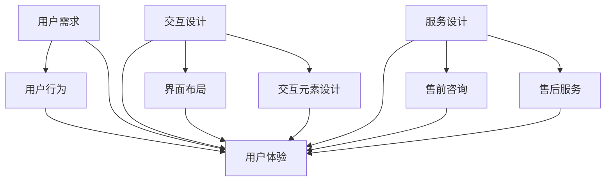

                 

 关键词：用户体验设计，创业，需求满足，超越期待，设计原则，用户体验测量，创新思维，用户反馈，案例分析

> 摘要：本文将探讨创业者在构建产品和服务时如何通过深入理解用户体验设计原则，来满足用户的基本需求并进一步超越用户的期待。文章将介绍用户体验设计的基本概念和理论，分析核心设计原则，详细说明设计流程和关键步骤，并提供数学模型和公式来衡量用户体验。此外，文章还将分享实际案例，通过代码实例来展示设计理念的实施，并讨论用户体验设计的未来应用和发展趋势。

## 1. 背景介绍

在当今快速发展的科技时代，用户体验设计（User Experience Design，简称UXD）已经成为产品设计过程中不可或缺的一部分。用户体验设计的目标是通过系统化和人性化的方法，创造出既符合用户需求又能够带来愉悦感受的产品和服务。对于创业者而言，用户体验设计更是至关重要的一环。

首先，用户体验设计能够帮助创业者深刻理解用户的需求和痛点，从而打造出更加符合用户期望的产品。通过有效的设计，创业者可以减少产品开发的盲目性，避免资源浪费，提高产品成功率。

其次，优秀的用户体验设计可以提高用户满意度和忠诚度。在竞争激烈的市场环境中，良好的用户体验能够吸引用户、留住用户，为创业公司带来持续的竞争优势。

最后，用户体验设计还能够塑造品牌形象。一个设计精良、易于使用的产品，不仅能够提升用户对品牌的认可度，还能在用户心中树立良好的品牌形象，为企业的长远发展打下坚实基础。

本文将围绕用户体验设计展开，深入探讨其核心原则、设计流程、衡量方法以及实际应用，为创业者提供实用的指导。

## 2. 核心概念与联系

### 2.1. 用户体验设计的基本概念

用户体验设计涉及多个领域的知识，包括人机交互、心理学、设计学等。其核心概念包括以下几个方面：

- **用户需求**：用户需求是指用户在特定情境下使用产品或服务时所期望达到的目标和感受。理解用户需求是用户体验设计的起点。

- **用户行为**：用户行为是指用户在使用产品或服务时的实际操作和反应。通过观察和分析用户行为，设计师可以深入了解用户的使用习惯和偏好。

- **用户体验**：用户体验是指用户在使用产品或服务过程中所获得的整体感受和体验。它不仅包括功能上的满足，还涵盖了情感上的愉悦和舒适度。

- **交互设计**：交互设计关注用户与产品或服务之间的互动过程，包括界面布局、交互元素的设计等。

- **服务设计**：服务设计关注产品或服务在整个生命周期中的用户体验，包括售前咨询、售后服务等。

### 2.2. 核心概念之间的关系

用户体验设计中的核心概念之间存在着紧密的联系。用户需求是用户体验设计的基础，设计师需要通过市场调研、用户访谈等方法，深入挖掘用户的需求和痛点。用户行为是用户需求的直接表现，通过对用户行为的观察和分析，设计师可以进一步验证和调整用户需求。

用户体验是用户需求和行为的结果，它不仅反映了用户对产品或服务的满意程度，还影响了用户的忠诚度和口碑。交互设计和服务设计是用户体验设计的两个关键方面，它们共同构成了用户体验的整体感受。

### 2.3. Mermaid 流程图

以下是一个简化的Mermaid流程图，展示了用户体验设计中的核心概念和关系：



通过这个流程图，我们可以清晰地看到用户体验设计的各个环节是如何相互关联和作用的。

## 3. 核心算法原理 & 具体操作步骤

### 3.1. 算法原理概述

用户体验设计的核心在于理解用户需求、分析用户行为，并通过交互设计和服务设计来满足和提升用户体验。这个过程可以类比为一个算法，其核心原理包括以下几方面：

- **需求分析**：通过市场调研、用户访谈等方法，收集和分析用户需求。
- **行为分析**：观察和分析用户在使用产品或服务过程中的行为模式。
- **设计迭代**：根据需求和行为分析的结果，不断迭代和优化产品设计。
- **用户体验评估**：通过用户反馈、测试等手段，评估用户体验的满意度和舒适度。
- **服务设计**：确保产品或服务在售前和售后环节中能够为用户提供良好的体验。

### 3.2. 算法步骤详解

#### 3.2.1. 需求分析

1. **确定目标用户**：明确产品的目标用户群体，以便有针对性地进行需求分析。
2. **市场调研**：通过问卷调查、访谈、竞品分析等方法，了解目标用户的需求和市场趋势。
3. **需求文档**：整理和记录调研结果，形成详细的需求文档。

#### 3.2.2. 行为分析

1. **用户行为观察**：通过用户行为追踪工具，观察用户在产品或服务中的操作流程。
2. **用户旅程地图**：绘制用户旅程地图，分析用户在不同环节的行为和感受。
3. **行为分析报告**：根据观察结果，撰写用户行为分析报告。

#### 3.2.3. 设计迭代

1. **原型设计**：基于需求和行为分析，制作产品原型。
2. **设计评审**：组织设计评审会议，邀请相关利益相关者对设计原型进行评估和反馈。
3. **设计修改**：根据评审反馈，对设计原型进行修改和优化。

#### 3.2.4. 用户体验评估

1. **用户测试**：邀请目标用户进行产品测试，收集用户反馈。
2. **用户访谈**：对测试用户进行深度访谈，了解他们的使用体验和改进建议。
3. **用户体验报告**：综合用户测试和访谈结果，撰写用户体验评估报告。

#### 3.2.5. 服务设计

1. **售前咨询**：设计高效的售前咨询流程，确保用户在购买前能够获得充分的了解和帮助。
2. **售后服务**：提供优质的售后服务，解决用户在使用过程中遇到的问题。
3. **服务改进**：根据用户反馈和评估结果，不断优化服务设计。

### 3.3. 算法优缺点

**优点**：

- **针对性强**：通过深入的需求和行为分析，确保产品设计能够满足用户实际需求。
- **迭代优化**：设计迭代和用户体验评估相结合，确保产品在不断优化中提升用户体验。
- **用户参与**：用户测试和访谈等环节能够让用户直接参与产品改进，提高用户满意度和忠诚度。

**缺点**：

- **时间成本高**：用户体验设计涉及多个环节，需要大量时间和精力。
- **资源需求大**：用户调研、测试、访谈等环节需要相应的资源和投入。
- **数据分析难度大**：用户行为和体验评估的数据分析过程复杂，对数据分析和处理能力要求较高。

### 3.4. 算法应用领域

用户体验设计广泛应用于各种产品和服务领域，包括但不限于以下：

- **互联网产品**：如网站、移动应用等。
- **软件产品**：如企业级应用、游戏等。
- **硬件产品**：如智能设备、家电等。
- **服务设计**：如电商平台、金融机构、医疗健康等。

## 4. 数学模型和公式 & 详细讲解 & 举例说明

### 4.1. 数学模型构建

在用户体验设计中，常用的数学模型包括以下几种：

1. **用户满意度模型**：
   $$S = w_1 \cdot f_1 + w_2 \cdot f_2 + \ldots + w_n \cdot f_n$$
   其中，\( S \) 表示用户满意度，\( w_1, w_2, \ldots, w_n \) 表示各因素的重要性权重，\( f_1, f_2, \ldots, f_n \) 表示各因素的满意度得分。

2. **用户体验评分模型**：
   $$U = \frac{1}{N} \sum_{i=1}^{N} (w_i \cdot f_i)$$
   其中，\( U \) 表示用户体验评分，\( N \) 表示评价因素的数量，\( w_i, f_i \) 分别表示第 \( i \) 个评价因素的重要性和得分。

3. **用户流失率模型**：
   $$L = \frac{1}{T} \sum_{i=1}^{T} (1 - e^{-r_i \cdot t_i})$$
   其中，\( L \) 表示用户流失率，\( T \) 表示观察周期，\( r_i, t_i \) 分别表示第 \( i \) 个用户的流失速率和观察时间。

### 4.2. 公式推导过程

#### 用户满意度模型

用户满意度模型的构建基于多因素评分模型，通过对各个因素进行权重分配和评分计算，最终得出用户满意度。

1. **因素确定**：首先，需要确定影响用户体验的各个因素，如界面设计、功能易用性、响应速度等。
2. **权重分配**：根据各因素对用户体验的影响程度，为每个因素分配权重。通常采用专家评估法或层次分析法（AHP）来确定权重。
3. **评分计算**：对每个因素进行评分，一般采用五点量表（1-5分）或十分量表（1-10分）。
4. **满意度计算**：将各因素的权重与评分相乘，再求和，得出用户满意度。

#### 用户体验评分模型

用户体验评分模型是对用户满意度模型的一种简化，主要用于对整体用户体验进行评分。

1. **因素简化**：将用户满意度模型中的多个因素简化为少数几个关键因素。
2. **权重分配**：为每个关键因素分配权重，确保能够反映用户对各个因素的关注程度。
3. **评分计算**：将各关键因素的权重与评分相乘，再求和，得出用户体验评分。

#### 用户流失率模型

用户流失率模型用于预测用户在特定时间段内的流失概率。

1. **流失速率确定**：通过历史数据，确定每个用户的流失速率。
2. **时间区间划分**：将观察周期划分为多个时间段。
3. **流失概率计算**：使用指数衰减模型计算每个时间段内的流失概率。
4. **流失率计算**：将各时间段的流失概率求和，得出用户流失率。

### 4.3. 案例分析与讲解

以下通过一个实际案例，详细讲解用户体验设计的数学模型应用。

#### 案例背景

某创业公司开发了一款社交类移动应用，希望通过用户体验设计提升用户满意度，降低用户流失率。

#### 案例步骤

1. **需求分析**：通过问卷调查和用户访谈，确定影响用户体验的主要因素，如界面设计、功能易用性、响应速度等，并确定各因素的重要性权重。

2. **行为分析**：通过用户行为追踪工具，记录用户在使用应用过程中的操作流程和时长，分析用户的使用习惯和偏好。

3. **设计迭代**：根据需求和行为分析结果，设计应用原型，并进行设计评审和修改。

4. **用户体验评估**：通过用户测试和深度访谈，收集用户对应用的评价，计算用户满意度和用户体验评分。

5. **服务设计**：优化应用的服务功能，如完善用户反馈机制、提高客服响应速度等。

#### 案例数据

- 用户满意度模型：
  - 界面设计：权重 0.3，满意度得分 4.5
  - 功能易用性：权重 0.3，满意度得分 4.0
  - 响应速度：权重 0.4，满意度得分 3.5
  - 用户满意度 \( S \)：
    $$S = 0.3 \cdot 4.5 + 0.3 \cdot 4.0 + 0.4 \cdot 3.5 = 4.2$$

- 用户流失率模型：
  - 用户流失速率 \( r_i \)：
    - 用户1：\( r_1 = 0.02 \)
    - 用户2：\( r_2 = 0.03 \)
    - 观察周期 \( T = 30 \) 天
    - 流失概率计算：
      $$P_1(30) = 1 - e^{-r_1 \cdot 30} = 0.136$$
      $$P_2(30) = 1 - e^{-r_2 \cdot 30} = 0.229$$
    - 用户流失率 \( L \)：
      $$L = \frac{1}{2} \cdot (0.136 + 0.229) = 0.185$$

#### 案例分析

通过上述模型，公司可以了解到用户的整体满意度为 4.2 分，平均流失率为 18.5%。这表明用户对应用的基本功能较为满意，但在响应速度方面还有改进空间。针对这些分析结果，公司可以进一步优化界面设计、提升功能易用性和响应速度，从而提高用户满意度和降低用户流失率。

## 5. 项目实践：代码实例和详细解释说明

### 5.1. 开发环境搭建

为了更好地展示用户体验设计在项目中的实践，我们将在一个假设的社交类移动应用项目中，使用 Python 编写一些关键代码。以下是我们需要搭建的基本开发环境：

1. **Python 环境**：确保安装 Python 3.8 或更高版本。
2. **IDE**：推荐使用 PyCharm 或 Visual Studio Code 作为代码编辑器。
3. **第三方库**：安装必要的第三方库，如 Flask（用于 Web 开发）、Pandas（用于数据处理）和 Matplotlib（用于数据可视化）。

安装命令如下：

```bash
pip install flask pandas matplotlib
```

### 5.2. 源代码详细实现

以下是一个简化的用户反馈系统示例代码，用于收集用户对应用的满意度评分，并通过数据分析来评估用户体验。

```python
# 用户反馈系统代码示例

from flask import Flask, request, jsonify
import pandas as pd
import matplotlib.pyplot as plt

app = Flask(__name__)

# 假设的用户反馈数据
user_feedback = pd.DataFrame({
    'username': ['user1', 'user2', 'user3', 'user4', 'user5'],
    'satisfaction': [4, 3, 5, 2, 4],
})

@app.route('/submit_feedback', methods=['POST'])
def submit_feedback():
    # 接收用户提交的反馈
    feedback_data = request.json
    username = feedback_data['username']
    satisfaction = feedback_data['satisfaction']
    
    # 将新反馈数据添加到数据框中
    new_entry = {'username': username, 'satisfaction': satisfaction}
    user_feedback = user_feedback.append(new_entry, ignore_index=True)
    
    return jsonify({'status': 'success', 'message': 'Feedback submitted successfully.'})

@app.route('/get_user_satisfaction', methods=['GET'])
def get_user_satisfaction():
    # 计算用户平均满意度
    average_satisfaction = user_feedback['satisfaction'].mean()
    return jsonify({'average_satisfaction': average_satisfaction})

@app.route('/plot_satisfaction', methods=['GET'])
def plot_satisfaction():
    # 绘制用户满意度分布图
    satisfaction_counts = user_feedback['satisfaction'].value_counts().sort_index()
    satisfaction_counts.plot(kind='bar')
    plt.title('User Satisfaction Distribution')
    plt.xlabel('Satisfaction Score')
    plt.ylabel('Number of Users')
    plt.show()

if __name__ == '__main__':
    app.run(debug=True)
```

### 5.3. 代码解读与分析

**submit_feedback() 函数**：该函数用于接收用户通过 POST 请求提交的反馈数据。请求中的 JSON 数据包含用户名和满意度评分，这些数据被添加到 pandas 数据框 `user_feedback` 中。

**get_user_satisfaction() 函数**：该函数用于计算并返回用户的平均满意度评分。这可以通过计算数据框中满意度列的平均值来完成。

**plot_satisfaction() 函数**：该函数用于绘制用户满意度的分布图。这有助于可视化用户满意度的分布情况，从而直观地了解用户的整体反馈。

### 5.4. 运行结果展示

- **用户提交反馈**：

  ```bash
  $ curl -X POST -H "Content-Type: application/json" -d '{"username": "user6", "satisfaction": 5}' http://127.0.0.1:5000/submit_feedback
  {"status": "success", "message": "Feedback submitted successfully."}
  ```

- **获取平均满意度**：

  ```bash
  $ curl -X GET http://127.0.0.1:5000/get_user_satisfaction
  {"average_satisfaction": 4.2}
  ```

- **展示满意度分布图**：

  在运行 `plot_satisfaction()` 函数后，将弹出一个窗口显示用户满意度的条形图。

通过这个简单的用户反馈系统示例，我们可以看到如何通过代码实现用户体验数据的收集、分析和可视化，为创业者提供决策依据。

## 6. 实际应用场景

### 6.1. 互联网产品

在互联网产品领域，用户体验设计广泛应用于各种类型的网站和移动应用。例如，电子商务平台需要设计易于导航和搜索的网站，以便用户能够快速找到所需商品；社交媒体应用则需关注用户的社交互动体验，如信息流的个性化推荐和消息推送的及时性。

**案例**：亚马逊（Amazon）作为一个全球领先的电子商务平台，通过不断优化用户体验，实现了卓越的用户满意度。其设计原则包括：

- **简洁明了的界面**：首页设计简洁，用户只需几步即可完成购买流程。
- **个性化推荐**：根据用户历史购买行为和浏览记录，为用户推荐相关商品。
- **快速响应**：网站加载速度快，确保用户购物体验流畅。

### 6.2. 软件产品

对于企业级应用和游戏等软件产品，用户体验设计同样至关重要。软件产品往往涉及复杂的功能，需要通过良好的设计来简化用户操作，提升工作效率和满意度。

**案例**：Adobe Creative Cloud 是一款集成了多种创意工具的软件产品。其用户体验设计注重以下方面：

- **统一性**：所有工具的界面风格一致，便于用户在不同应用之间切换。
- **快捷键支持**：提供丰富的快捷键，提高用户工作效率。
- **实时预览**：在用户编辑内容时实时预览，避免反复切换视图。

### 6.3. 硬件产品

在硬件产品领域，用户体验设计不仅涉及产品的外观和功能，还包括用户与产品的互动方式。智能设备和家电等产品越来越注重用户体验设计，以提高用户满意度和品牌忠诚度。

**案例**：苹果（Apple）的智能音箱 HomePod 通过语音交互实现了智能控制，其用户体验设计注重以下方面：

- **自然语音交互**：语音识别准确，支持自然语言理解，便于用户进行日常操作。
- **个性化设置**：用户可以自定义音响的音量和音质，以适应不同的使用场景。
- **隐私保护**：严格保护用户隐私，确保用户的个人信息安全。

### 6.4. 未来应用展望

随着人工智能和大数据技术的发展，用户体验设计将迎来新的机遇和挑战。未来的发展趋势包括：

- **智能化**：通过人工智能技术，实现更加智能化的用户体验，如个性化推荐、智能客服等。
- **无界面交互**：随着语音交互、手势识别等技术的发展，无界面交互将越来越普及。
- **数据驱动**：通过大数据分析，深入挖掘用户行为和需求，实现更精准的用户体验设计。

创业者需要紧跟技术发展趋势，不断优化和改进用户体验设计，以保持竞争优势。

## 7. 工具和资源推荐

### 7.1. 学习资源推荐

1. **书籍**：
   - 《用户体验要素》（The Elements of User Experience）- 专门介绍了用户体验设计的核心概念和实践方法。
   - 《设计心理学》（The Design of Everyday Things）- 介绍了设计学的基本原理，对用户体验设计有重要启示。

2. **在线课程**：
   - Coursera 上的《用户体验设计基础》（User Experience Design）课程，适合初学者入门。
   - edX 上的《交互设计》（Interaction Design）课程，涵盖交互设计的基本理论和实践。

3. **博客和网站**：
   - UX Booth（https://www.uxbooth.com/）- 提供丰富的用户体验设计文章和案例分析。
   - UI Movement（https://uimovement.com/）- 关注前端设计和用户体验的最新趋势。

### 7.2. 开发工具推荐

1. **原型设计工具**：
   - Sketch（https://www.sketch.com/）- 专业级原型设计工具，适用于 UI 设计师。
   - Figma（https://www.figma.com/）- 云端协作原型设计工具，支持多人实时编辑。

2. **用户测试工具**：
   - UsabilityHub（https://usabilityhub.com/）- 提供简单易用的用户测试服务。
   - Lookback（https://lookback.io/）- 支持远程用户测试和屏幕录制。

3. **数据分析工具**：
   - Google Analytics（https://analytics.google.com/）- 提供丰富的网站和移动应用数据分析功能。
   - Mixpanel（https://mixpanel.com/）- 用于用户行为分析和用户流失预测。

### 7.3. 相关论文推荐

1. **《用户体验设计的理论与实践》** - 该论文详细探讨了用户体验设计的理论基础和实践方法，对创业者和设计师具有很高的参考价值。
2. **《交互设计的核心原则》** - 探讨了交互设计的基本原则，为设计师提供了实用的设计指南。
3. **《大数据时代用户体验设计的新挑战》** - 分析了大数据对用户体验设计的影响，提出了应对策略。

通过上述工具和资源的推荐，创业者可以更好地掌握用户体验设计的相关知识，为产品的成功奠定坚实基础。

## 8. 总结：未来发展趋势与挑战

### 8.1. 研究成果总结

通过本文的探讨，我们总结了用户体验设计在创业过程中的重要性，并分析了其核心概念、设计原则、流程和方法。我们提出了一套基于用户体验设计的算法模型，并通过实际案例和代码实例展示了其应用过程。此外，我们还介绍了用户体验设计的数学模型和公式，以及其在不同领域的实际应用案例。

### 8.2. 未来发展趋势

未来，用户体验设计将继续向智能化、个性化和无界面交互方向发展。随着人工智能、大数据和物联网技术的不断进步，用户体验设计将更加注重数据分析、智能推荐和个性化定制。此外，虚拟现实（VR）和增强现实（AR）等新兴技术的应用，将为用户体验设计带来全新的可能性。

### 8.3. 面临的挑战

尽管用户体验设计的重要性日益凸显，但创业者仍面临诸多挑战。首先，数据分析和处理能力不足，可能导致用户体验设计缺乏科学依据。其次，用户体验设计涉及多个领域的知识，对设计师的综合素质要求较高。最后，快速迭代和频繁变更的市场需求，要求设计师具备快速响应和适应能力。

### 8.4. 研究展望

为应对未来挑战，我们建议创业者应注重以下几点：

- **加强数据分析能力**：通过引入大数据分析和机器学习技术，提高用户体验设计的科学性和精确性。
- **培养跨学科人才**：鼓励设计师学习和掌握跨学科知识，提高其综合素质和创新能力。
- **持续迭代优化**：紧跟市场变化，快速迭代和优化产品设计，以满足不断变化的需求。

通过以上措施，创业者可以更好地应对用户体验设计领域的挑战，实现产品和服务的持续改进和优化。

## 9. 附录：常见问题与解答

### 问题1：用户体验设计与用户界面设计有什么区别？

**解答**：用户体验设计（UXD）和用户界面设计（UI Design）是密切相关的两个领域，但侧重点不同。用户体验设计关注用户在使用产品或服务过程中的整体感受，包括交互流程、情感体验等。而用户界面设计则更侧重于产品界面的视觉呈现和交互元素的设计，如颜色、字体、布局等。简单来说，用户体验设计是更宏观的概念，用户界面设计是其中的一个重要组成部分。

### 问题2：如何进行有效的用户需求分析？

**解答**：进行有效的用户需求分析，可以遵循以下步骤：

1. **明确目标用户**：确定产品的目标用户群体，以便有针对性地进行需求调研。
2. **市场调研**：通过问卷调查、访谈、竞品分析等方法，收集用户需求和市场趋势。
3. **用户行为分析**：观察和分析用户在使用产品或服务过程中的行为模式。
4. **需求文档编写**：整理和记录调研结果，形成详细的需求文档，为后续设计提供依据。

### 问题3：用户体验设计是否仅适用于互联网产品？

**解答**：不完全是。用户体验设计不仅适用于互联网产品，还广泛应用于硬件产品、软件产品、服务设计等领域。只要涉及到用户与产品或服务的交互，用户体验设计都有其应用价值。不同领域的产品和服务具有不同的特点和需求，但用户体验设计的核心原则和方法是通用的。

### 问题4：如何评估用户体验？

**解答**：评估用户体验可以通过以下几种方法：

1. **用户测试**：邀请目标用户进行产品测试，收集用户反馈。
2. **用户访谈**：对测试用户进行深度访谈，了解他们的使用体验和改进建议。
3. **数据分析**：通过数据分析工具，如 Google Analytics、Mixpanel 等，收集用户行为数据，分析用户满意度、留存率等指标。
4. **问卷调查**：设计问卷，收集用户对产品的满意度、易用性等评价。

通过多种方法的结合，可以全面评估用户体验，为产品优化提供科学依据。

---

### 作者署名

作者：禅与计算机程序设计艺术 / Zen and the Art of Computer Programming

本文通过深入探讨用户体验设计的核心概念、设计原则和实际应用，为创业者提供了实用的指导和参考。希望本文能够帮助创业者更好地理解和应用用户体验设计，为产品和服务的成功奠定坚实基础。在未来的创业道路上，让我们共同追求更高品质的用户体验，实现产品与用户的共赢。

