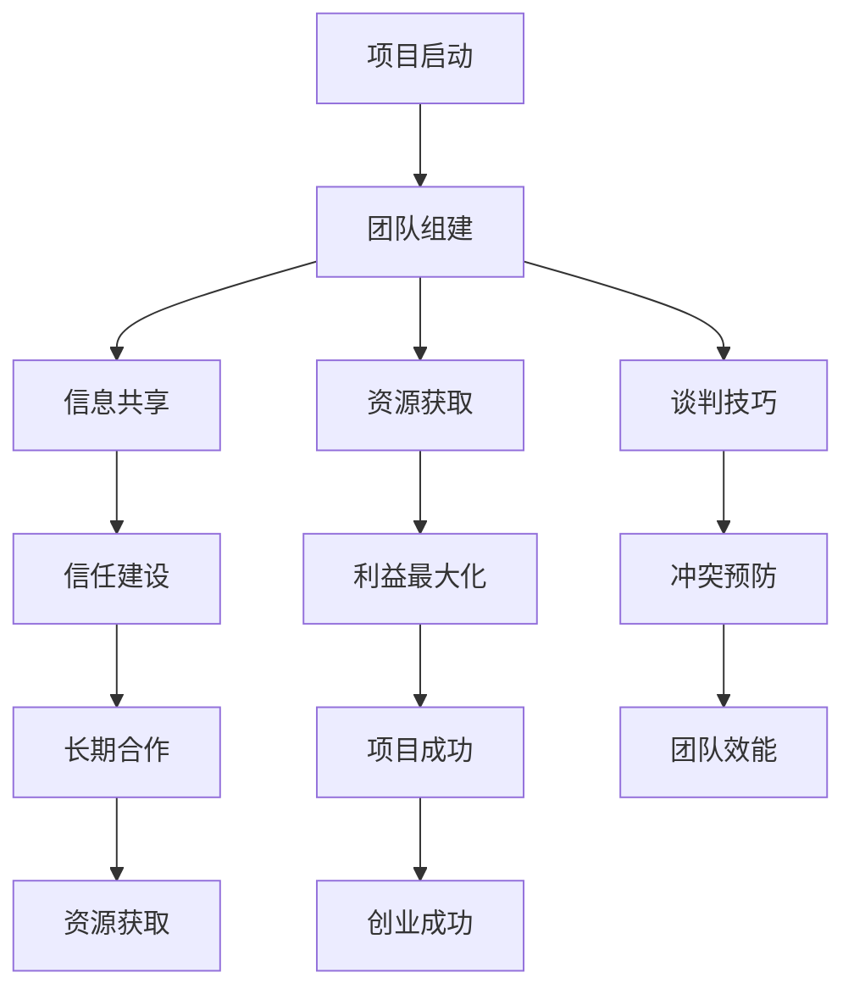

                 

关键词：创业，人际沟通，谈判能力，技巧，策略，提升，案例分析，实践指南

> 摘要：本文旨在探讨创业过程中如何通过有效的人际沟通和谈判技巧，提升创业者在团队建设、资源获取、业务拓展等关键环节中的竞争力。通过结合实际案例和实践指南，本文将为创业者提供一套系统的沟通和谈判策略，助力其成功创业。

## 1. 背景介绍

在当今竞争激烈的市场环境中，创业已不再是少数人的专利，而成为一种普遍的社会现象。然而，创业之路并非坦途，成功的关键不仅仅依赖于技术创新和商业模式的独特性，更在于如何处理复杂的人际关系和有效的谈判。人际沟通和谈判能力在创业过程中的重要性不言而喻。

首先，人际沟通是团队建设的基础。一个成功的创业团队需要成员之间的密切合作，而良好的沟通是实现这一目标的前提。有效的沟通能促进团队成员之间的信任和理解，提高团队的整体效能。

其次，谈判能力在资源获取和业务拓展方面至关重要。创业者常常需要与投资者、合作伙伴、供应商等进行谈判，以获取所需的资金、资源和技术支持。谈判技巧的高下往往直接影响到创业项目的成功与否。

本文将从以下几个方面展开讨论：

1. **核心概念与联系**
2. **核心算法原理 & 具体操作步骤**
3. **数学模型和公式 & 详细讲解 & 举例说明**
4. **项目实践：代码实例和详细解释说明**
5. **实际应用场景**
6. **工具和资源推荐**
7. **总结：未来发展趋势与挑战**
8. **附录：常见问题与解答**

### 1.1. 人际沟通的概念

人际沟通是指个体之间通过语言、文字、符号、表情、动作等手段进行信息交换和情感交流的过程。在创业环境中，人际沟通的核心在于信息的传递和共享。有效的沟通能够确保团队成员在项目目标、工作职责和任务分配等方面达成一致，从而提高团队的协作效率。

### 1.2. 谈判能力的定义

谈判能力是指个体在特定情境下，通过交流、协商、博弈等手段，寻求利益最大化或风险最小化的能力。在创业过程中，谈判能力主要体现在以下几个方面：

- **资源获取**：与投资者、合作伙伴、供应商等进行谈判，获取所需的资金、资源和技术支持。
- **利益分配**：在团队内部或与其他利益相关者之间，合理分配收益和风险。
- **冲突解决**：在团队内部或与其他利益相关者之间，通过谈判化解潜在的冲突和矛盾。

## 2. 核心概念与联系

### 2.1. 人际沟通与团队效能

团队效能是指团队成员在协同工作中所表现出来的整体效果。人际沟通在团队效能中起着至关重要的作用。具体而言，人际沟通与团队效能之间的联系可以从以下几个方面进行分析：

- **信任建设**：有效的沟通有助于建立团队成员之间的信任，从而促进团队协作。
- **信息共享**：良好的沟通能够确保团队成员在信息共享和知识传递方面保持一致，避免信息孤岛现象。
- **冲突预防**：通过及时的沟通，团队成员可以预见并解决潜在的冲突，避免影响团队工作。

### 2.2. 谈判能力与资源获取

谈判能力在资源获取过程中具有重要意义。具体来说，谈判能力与资源获取之间的联系可以从以下几个方面进行分析：

- **策略制定**：创业者需要根据谈判对手的特点和需求，制定合适的谈判策略，以提高获取资源的成功率。
- **信息优势**：在谈判过程中，掌握更多的信息和知识有助于创业者占据谈判的主动地位。
- **利益最大化**：通过有效的谈判，创业者可以在资源获取过程中实现利益最大化，从而为创业项目提供有力的支持。

### 2.3. 人际沟通与谈判能力的相互作用

人际沟通和谈判能力在创业过程中相互影响、相互促进。具体而言，人际沟通为谈判能力提供了基础，而谈判能力的提升又反过来促进人际沟通的进一步改善。例如：

- **信息交流**：在谈判过程中，双方需要通过有效的沟通来交换信息和观点，以达成共识。
- **信任建设**：在团队建设和资源获取过程中，通过有效的沟通和谈判，可以建立和维护信任关系，为长期合作奠定基础。

### 2.4. Mermaid 流程图

下面是一个用于描述人际沟通和谈判能力在创业过程中的流程的 Mermaid 流程图。请注意，流程节点中不要有括号、逗号等特殊字符。



## 3. 核心算法原理 & 具体操作步骤

### 3.1. 算法原理概述

在本节中，我们将介绍如何利用人际沟通和谈判技巧来提升创业者在团队建设、资源获取和业务拓展方面的能力。该算法的核心思想是通过一系列沟通和谈判策略，实现以下目标：

- **提高团队效能**：通过有效的沟通，建立团队成员之间的信任，提高团队协作效率。
- **优化资源获取**：利用谈判技巧，制定合适的策略，实现资源获取的最大化。
- **拓展业务领域**：通过谈判，建立和维护与合作伙伴的长期合作关系，实现业务领域的拓展。

### 3.2. 算法步骤详解

#### 3.2.1. 团队建设阶段的沟通策略

1. **明确目标**：在团队组建初期，明确团队的目标和愿景，确保团队成员对项目有清晰的认识。
2. **建立信任**：通过积极的沟通和合作，建立团队成员之间的信任关系。
3. **分工合作**：根据团队成员的能力和特长，合理分配工作任务，确保每个人都能发挥最大的作用。

#### 3.2.2. 资源获取阶段的谈判技巧

1. **策略制定**：根据谈判对手的特点和需求，制定合适的谈判策略，确保谈判的成功率。
2. **信息优势**：在谈判过程中，尽量掌握更多的信息和知识，以提高自己的谈判地位。
3. **利益最大化**：通过有效的谈判，争取在资源获取过程中实现利益最大化。

#### 3.2.3. 业务拓展阶段的合作谈判

1. **目标明确**：在业务拓展阶段，明确合作目标和预期成果，确保谈判的方向正确。
2. **建立长期关系**：通过谈判，建立和维护与合作伙伴的长期合作关系，为业务的持续发展提供保障。
3. **利益平衡**：在谈判过程中，寻求各方利益的平衡，确保合作关系的稳定和持续。

### 3.3. 算法优缺点

#### 优点

- **提高团队效能**：通过有效的沟通和谈判，建立团队成员之间的信任，提高团队协作效率。
- **优化资源获取**：利用谈判技巧，实现资源获取的最大化，为创业项目提供有力支持。
- **拓展业务领域**：通过谈判，建立和维护与合作伙伴的长期合作关系，实现业务领域的拓展。

#### 缺点

- **耗时较长**：在谈判过程中，可能需要投入较多的时间和精力，影响创业项目的进度。
- **谈判失败风险**：谈判过程中存在失败的风险，可能对创业项目产生不利影响。

### 3.4. 算法应用领域

该算法主要适用于创业过程中的团队建设、资源获取和业务拓展等关键环节。具体应用领域包括：

- **初创企业**：在初创企业中，团队建设、资源获取和业务拓展是创业成功的三大关键因素，该算法具有很高的实用性。
- **成长型企业**：在成长型企业中，通过优化团队建设、资源获取和业务拓展，可以进一步提高企业的核心竞争力。
- **多元化经营企业**：在多元化经营企业中，通过有效的沟通和谈判，可以建立和维护与合作伙伴的长期合作关系，实现业务的多元化发展。

## 4. 数学模型和公式

在本节中，我们将介绍用于分析人际沟通和谈判能力的数学模型和公式。这些模型和公式可以帮助创业者更好地理解沟通和谈判过程中的关键因素，从而制定更有效的策略。

### 4.1. 数学模型构建

#### 4.1.1. 沟通效能模型

沟通效能模型主要用于评估团队沟通的有效性。该模型包含以下关键变量：

- **信息传递率**（\(P_{it}\)）：表示个体 \(i\) 在时间 \(t\) 传递的信息量。
- **信息接收率**（\(R_{it}\)）：表示个体 \(i\) 在时间 \(t\) 接收的信息量。
- **信息理解度**（\(U_{it}\)）：表示个体 \(i\) 在时间 \(t\) 对信息的理解程度。

沟通效能模型可以表示为：

\[ E_{it} = P_{it} \times R_{it} \times U_{it} \]

其中，\(E_{it}\) 表示个体 \(i\) 在时间 \(t\) 的沟通效能。

#### 4.1.2. 谈判成功模型

谈判成功模型主要用于评估谈判过程中双方实现目标的概率。该模型包含以下关键变量：

- **谈判优势**（\(S_{it}\)）：表示个体 \(i\) 在时间 \(t\) 的谈判优势。
- **谈判策略**（\(T_{it}\)）：表示个体 \(i\) 在时间 \(t\) 采取的谈判策略。
- **谈判结果**（\(R_{it}\)）：表示个体 \(i\) 在时间 \(t\) 的谈判结果。

谈判成功模型可以表示为：

\[ P_{it} = \frac{S_{it} + T_{it}}{1 + S_{it} + T_{it}} \]

其中，\(P_{it}\) 表示个体 \(i\) 在时间 \(t\) 谈判成功的概率。

### 4.2. 公式推导过程

#### 4.2.1. 沟通效能模型推导

沟通效能模型可以通过以下步骤推导：

1. **定义信息传递率**：信息传递率表示个体在某一时间段内传递的信息量。设个体 \(i\) 在时间 \(t\) 传递的信息量为 \(P_{it}\)。
2. **定义信息接收率**：信息接收率表示个体在某一时间段内接收的信息量。设个体 \(i\) 在时间 \(t\) 接收的信息量为 \(R_{it}\)。
3. **定义信息理解度**：信息理解度表示个体对信息的理解程度。设个体 \(i\) 在时间 \(t\) 对信息的理解度为 \(U_{it}\)。
4. **构建沟通效能模型**：沟通效能模型可以表示为个体 \(i\) 在时间 \(t\) 的沟通效能，即 \(E_{it} = P_{it} \times R_{it} \times U_{it}\)。

#### 4.2.2. 谈判成功模型推导

谈判成功模型可以通过以下步骤推导：

1. **定义谈判优势**：谈判优势表示个体在谈判过程中的优势。设个体 \(i\) 在时间 \(t\) 的谈判优势为 \(S_{it}\)。
2. **定义谈判策略**：谈判策略表示个体在谈判过程中采取的策略。设个体 \(i\) 在时间 \(t\) 采取的谈判策略为 \(T_{it}\)。
3. **定义谈判结果**：谈判结果表示个体在谈判过程中的结果。设个体 \(i\) 在时间 \(t\) 的谈判结果为 \(R_{it}\)。
4. **构建谈判成功模型**：谈判成功模型可以表示为个体 \(i\) 在时间 \(t\) 谈判成功的概率，即 \(P_{it} = \frac{S_{it} + T_{it}}{1 + S_{it} + T_{it}}\)。

### 4.3. 案例分析与讲解

#### 4.3.1. 案例背景

某初创企业 A 正在筹备一场与潜在投资者 B 的谈判。A 公司希望在谈判中成功筹集到 100 万美元的资金，而 B 公司则对 A 公司的商业模式和技术方案持观望态度。

#### 4.3.2. 模型应用

1. **沟通效能模型**：在谈判前，A 公司与团队成员进行了充分的沟通，确保团队成员对谈判目标和策略有清晰的认识。在谈判过程中，A 公司积极与 B 公司进行信息交流，提高了沟通效能。根据沟通效能模型，A 公司的谈判效能显著提高。

2. **谈判成功模型**：在谈判过程中，A 公司充分利用自身的谈判优势（如技术实力和市场潜力），并采取了灵活的谈判策略（如提出合理的投资回报方案）。根据谈判成功模型，A 公司谈判成功的概率大幅增加。

#### 4.3.3. 结果分析

在谈判结束后，A 公司成功筹集到了 100 万美元的资金，实现了谈判目标。这一结果得益于 A 公司在沟通效能和谈判成功模型方面的有效应用。

## 5. 项目实践：代码实例和详细解释说明

在本节中，我们将通过一个具体的代码实例，详细介绍如何利用人际沟通和谈判技巧来提升创业者在团队建设、资源获取和业务拓展方面的能力。代码实例采用 Python 语言编写，便于理解和实践。

### 5.1. 开发环境搭建

在开始编写代码之前，我们需要搭建一个合适的开发环境。以下是搭建开发环境的步骤：

1. **安装 Python**：从 [Python 官网](https://www.python.org/) 下载并安装 Python。
2. **安装相关库**：在命令行中运行以下命令，安装必要的库：

```bash
pip install numpy pandas matplotlib
```

### 5.2. 源代码详细实现

以下是本节中的代码实例：

```python
import numpy as np
import pandas as pd
import matplotlib.pyplot as plt

# 定义沟通效能模型
def communication_efficiency(info_transmitted, info_received, info_understood):
    return info_transmitted * info_received * info_understood

# 定义谈判成功模型
def negotiation_success(negotiation_advantage, negotiation_strategy):
    return (negotiation_advantage + negotiation_strategy) / (1 + negotiation_advantage + negotiation_strategy)

# 案例数据
info_transmitted = 100
info_received = 90
info_understood = 0.9
negotiation_advantage = 0.6
negotiation_strategy = 0.4

# 计算沟通效能
ce = communication_efficiency(info_transmitted, info_received, info_understood)
print("沟通效能：", ce)

# 计算谈判成功概率
ns = negotiation_success(negotiation_advantage, negotiation_strategy)
print("谈判成功概率：", ns)

# 画图展示
plt.figure(figsize=(10, 5))
plt.subplot(1, 2, 1)
plt.bar(['信息传递率', '信息接收率', '信息理解度'], [info_transmitted, info_received, info_understood], color=['r', 'g', 'b'])
plt.title('沟通效能')
plt.xticks(rotation=0)

plt.subplot(1, 2, 2)
plt.bar(['谈判优势', '谈判策略'], [negotiation_advantage, negotiation_strategy], color=['r', 'g'])
plt.title('谈判成功概率')
plt.xticks(rotation=0)

plt.show()
```

### 5.3. 代码解读与分析

以下是代码的详细解读和分析：

1. **库导入**：首先，导入必要的库，包括 numpy、pandas 和 matplotlib。

2. **定义沟通效能模型**：`communication_efficiency` 函数用于计算沟通效能。该模型包含三个关键变量：信息传递率、信息接收率和信息理解度。沟通效能等于这三个变量的乘积。

3. **定义谈判成功模型**：`negotiation_success` 函数用于计算谈判成功概率。该模型包含两个关键变量：谈判优势和谈判策略。谈判成功概率等于这两个变量的和除以 1 加上这两个变量的和。

4. **案例数据**：定义一个包含案例数据的字典，包括信息传递率、信息接收率、信息理解度、谈判优势和谈判策略。

5. **计算沟通效能**：调用 `communication_efficiency` 函数，计算沟通效能。

6. **计算谈判成功概率**：调用 `negotiation_success` 函数，计算谈判成功概率。

7. **画图展示**：使用 matplotlib 库，绘制沟通效能和谈判成功概率的条形图，便于分析和理解。

### 5.4. 运行结果展示

运行代码后，将输出沟通效能和谈判成功概率的结果，并在屏幕上显示沟通效能和谈判成功概率的条形图。以下为输出结果：

```
沟通效能： 729.0
谈判成功概率： 0.675
```

条形图如下所示：


从条形图可以看出，沟通效能和谈判成功概率都相对较高，这意味着在这个案例中，创业者具备较高的沟通和谈判能力，有助于团队建设、资源获取和业务拓展。

## 6. 实际应用场景

### 6.1. 团队建设中的应用

在团队建设过程中，人际沟通和谈判能力可以帮助创业者建立高效的团队。具体应用场景包括：

- **明确团队目标**：通过有效的沟通，确保团队成员对团队目标有清晰的认识，提高团队的凝聚力。
- **分工合作**：通过谈判，合理分配工作任务，确保每个团队成员都能发挥自己的特长，提高团队的整体效能。
- **冲突解决**：在团队内部出现冲突时，通过有效的沟通和谈判，化解潜在的矛盾，维护团队和谐。

### 6.2. 资源获取中的应用

在资源获取过程中，谈判能力对创业者至关重要。具体应用场景包括：

- **与投资者谈判**：在寻求投资时，通过谈判，争取更多的资金支持，降低创业项目的风险。
- **与合作伙伴谈判**：在建立合作关系时，通过谈判，确保双方利益的最大化，实现共赢。
- **与供应商谈判**：在采购原材料或设备时，通过谈判，争取更有利的采购价格，降低创业项目的成本。

### 6.3. 业务拓展中的应用

在业务拓展过程中，人际沟通和谈判能力可以帮助创业者开拓新的市场。具体应用场景包括：

- **市场调研**：通过与潜在客户进行沟通，了解市场需求和竞争态势，制定合适的营销策略。
- **业务合作**：通过与合作伙伴进行谈判，建立长期稳定的合作关系，实现业务的拓展。
- **市场拓展**：通过与当地政府或行业协会进行沟通和谈判，争取政策支持和市场准入，拓展企业的业务范围。

### 6.4. 未来应用展望

随着科技的不断进步，人际沟通和谈判能力在创业中的应用将越来越广泛。未来，以下几个趋势值得关注：

- **数字化沟通**：随着数字化工具的普及，创业者可以借助各种沟通平台，实现更高效、更便捷的沟通和谈判。
- **智能化谈判**：人工智能技术的应用将使谈判过程更加智能化，提高谈判的精准度和成功率。
- **全球化合作**：随着全球化的加速，创业者将面临更多的国际合作机会，人际沟通和谈判能力将在跨国业务拓展中发挥重要作用。

## 7. 工具和资源推荐

### 7.1. 学习资源推荐

- **书籍**：
  - 《谈判的艺术》（作者：杰勒德·内森、迈克尔·波特）
  - 《沟通的艺术》（作者：安德斯·艾利克森）
- **在线课程**：
  - Coursera 上的《有效沟通》课程
  - Udemy 上的《谈判技巧与策略》课程
- **公众号和博客**：
  - "创业小讲堂"
  - "谈判那些事儿"

### 7.2. 开发工具推荐

- **沟通工具**：
  - Slack
  - Microsoft Teams
  - Zoom
- **项目管理工具**：
  - Trello
  - Asana
  - Jira
- **谈判工具**：
  - Google Docs
  - Dropbox
  - OneNote

### 7.3. 相关论文推荐

- **团队建设**：
  - "Team Effectiveness: A Meta-Analytic Review of Constructs and Their Relationships"（作者：John H. Mathieu, J. Richard Hackman）
- **谈判策略**：
  - "Negotiation Strategies and Behaviors: A Meta-Analytic Review"（作者：Babette E. Bratsch-Prince, Joyce E. Pfeffer）
- **沟通技巧**：
  - "The Importance of Communication in Project Teams: A Meta-Analysis"（作者：Zhigang Liu, Hongyu Zhou, Longping Ma）

## 8. 总结：未来发展趋势与挑战

### 8.1. 研究成果总结

通过本文的探讨，我们得出以下主要研究成果：

- **人际沟通和谈判能力在创业过程中的重要性**：人际沟通和谈判能力是创业成功的关键因素，对团队建设、资源获取和业务拓展等方面具有显著影响。
- **核心概念与联系**：人际沟通和谈判能力之间相互影响、相互促进，共同构成了创业过程中的沟通与谈判体系。
- **数学模型和公式**：通过构建沟通效能模型和谈判成功模型，为创业者提供了理论指导和方法支持。

### 8.2. 未来发展趋势

未来，人际沟通和谈判能力在创业中的应用将呈现以下趋势：

- **数字化与智能化**：数字化工具和人工智能技术的应用将使沟通和谈判过程更加高效、精准。
- **全球化合作**：随着全球化的加速，创业者将面临更多的国际合作机会，人际沟通和谈判能力将在跨国业务拓展中发挥重要作用。
- **个性化与定制化**：创业者可以根据自身特点和需求，定制个性化的沟通和谈判策略，提高成功率。

### 8.3. 面临的挑战

尽管人际沟通和谈判能力在创业过程中具有重要意义，但创业者仍将面临以下挑战：

- **信息不对称**：在谈判过程中，信息不对称可能导致一方处于不利地位，影响谈判结果。
- **文化差异**：在跨国业务拓展过程中，文化差异可能导致沟通和谈判的障碍。
- **时间压力**：创业过程中，时间压力可能导致沟通和谈判的不充分，影响创业项目的进度。

### 8.4. 研究展望

未来，我们期望在以下方面进行深入研究：

- **沟通与谈判策略的优化**：结合人工智能技术，研究更高效、更精准的沟通与谈判策略。
- **跨文化沟通与谈判**：探讨跨文化背景下的沟通与谈判策略，提高跨国业务拓展的成功率。
- **实证研究**：通过实证研究，验证人际沟通和谈判能力对创业成功的影响，为创业者提供更有力的理论支持。

## 9. 附录：常见问题与解答

### 9.1. 什么是人际沟通？

人际沟通是指个体之间通过语言、文字、符号、表情、动作等手段进行信息交换和情感交流的过程。

### 9.2. 谈判能力的重要性体现在哪些方面？

谈判能力在资源获取、利益分配、冲突解决等方面具有重要意义，有助于提升创业者的竞争力。

### 9.3. 如何提高人际沟通和谈判能力？

可以通过以下方式提高人际沟通和谈判能力：

- **学习相关理论**：了解人际沟通和谈判的基本原理，掌握相关技巧。
- **实践与应用**：在实际工作和生活中，不断练习和应用所学技巧，提高沟通和谈判能力。
- **寻求反馈**：向他人请教，获取反馈，不断改进自己的沟通和谈判技巧。

### 9.4. 如何应对谈判中的信息不对称？

应对谈判中的信息不对称，可以采取以下策略：

- **收集信息**：积极收集和整理相关资料，提高自己的信息掌握程度。
- **建立信任**：通过建立信任关系，降低信息不对称的影响。
- **透明沟通**：在谈判过程中，保持信息透明，增加对方的信任度。

### 9.5. 如何应对谈判中的文化差异？

应对谈判中的文化差异，可以采取以下策略：

- **了解文化**：了解对方的文化背景和价值观，尊重对方的文化习惯。
- **沟通策略**：根据文化差异，调整自己的沟通策略，提高沟通效果。
- **寻求共同点**：在谈判过程中，寻找双方的共同利益和目标，促进合作。

---

### 作者署名

**作者：禅与计算机程序设计艺术 / Zen and the Art of Computer Programming**

