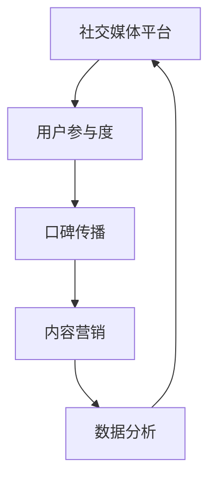
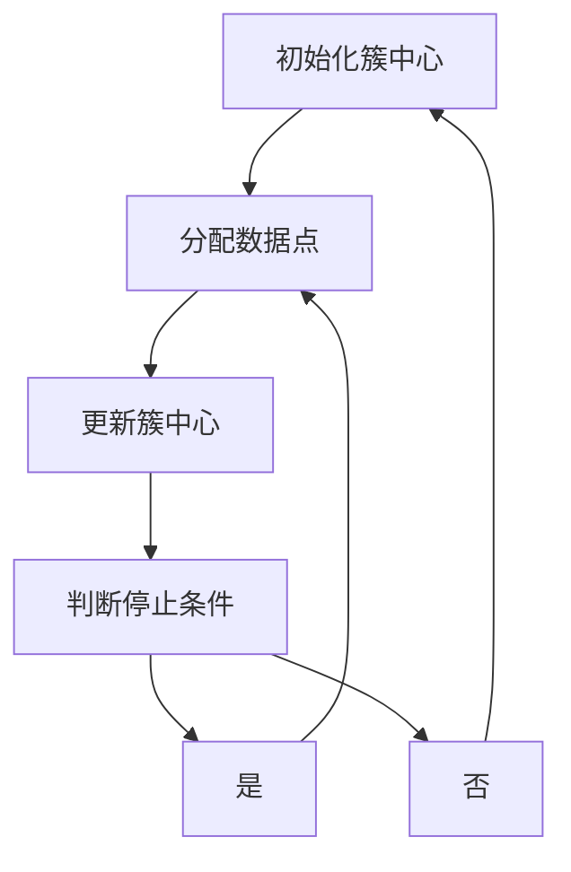

                 

关键词：社会化营销，口碑传播，创业项目，营销策略，用户体验，数据分析，社交媒体，内容营销，病毒式营销，用户参与

摘要：本文将深入探讨创业项目如何通过社会化营销和口碑传播来提升品牌知名度和用户参与度。我们将从核心概念、算法原理、数学模型、实践案例等多个角度出发，为您呈现一个全面、实用的社会化营销指南。

## 1. 背景介绍

在当今数字化时代，互联网已经成为人们日常生活中不可或缺的一部分。随着社交媒体的兴起，社会化营销和口碑传播成为企业推广产品和服务的重要手段。对于创业项目而言，如何有效地进行社会化营销和口碑传播，成为其在竞争激烈的市场中脱颖而出、获得成功的关键。

社会化营销是指通过社交媒体平台、博客、论坛等在线渠道，与企业目标受众进行互动，建立品牌形象，提高品牌知名度和用户忠诚度的一种营销活动。而口碑传播则是指通过用户的真实体验和评价，自发地在社交媒体上传播，影响其他潜在用户的行为和决策。

本文将围绕以下主题展开：

- **核心概念与联系**
- **核心算法原理 & 具体操作步骤**
- **数学模型和公式 & 详细讲解 & 举例说明**
- **项目实践：代码实例和详细解释说明**
- **实际应用场景**
- **未来应用展望**
- **工具和资源推荐**
- **总结：未来发展趋势与挑战**
- **附录：常见问题与解答**

通过这些内容，我们希望为创业项目的营销工作提供有价值的指导和建议。

## 2. 核心概念与联系

在社会化营销和口碑传播的过程中，有几个核心概念和联系需要我们了解。

### 2.1 社交媒体平台

社交媒体平台是社会化营销的主要战场。常见的社交媒体平台包括微博、微信、抖音、快手、知乎等。这些平台具有用户基数大、活跃度高、互动性强等特点，为企业提供了广阔的传播空间。

### 2.2 用户参与度

用户参与度是衡量社会化营销效果的重要指标。用户参与度包括点赞、评论、转发、分享等行为。高用户参与度意味着用户对品牌和产品有较高的认同感和忠诚度。

### 2.3 口碑传播

口碑传播是指用户在社交媒体上自发地分享他们的使用体验和评价，从而影响其他潜在用户的行为和决策。口碑传播的效果往往比传统广告更具有说服力和影响力。

### 2.4 内容营销

内容营销是通过创造和分享有价值的内容来吸引潜在客户，提高品牌知名度，建立品牌权威性。内容营销的核心在于提供有价值的信息，解决用户的问题和需求。

### 2.5 数据分析

数据分析是社会化营销和口碑传播的重要工具。通过对用户行为、兴趣、需求等数据的分析，企业可以更好地了解用户，优化营销策略，提高营销效果。

下面，我们将用 Mermaid 流程图来展示这些核心概念和联系：



## 3. 核心算法原理 & 具体操作步骤

在社会化营销和口碑传播中，核心算法起着至关重要的作用。下面，我们将介绍一个常见的核心算法——K-Means 算法，并详细解释其原理和操作步骤。

### 3.1 算法原理概述

K-Means 算法是一种基于距离的聚类算法。其基本思想是将数据集分成 K 个簇，使得每个簇内部的点之间的距离最小，簇与簇之间的距离最大。算法的输入是数据集和 K 的值，输出是 K 个簇的中心点和每个数据点所属的簇。

### 3.2 算法步骤详解

1. **初始化**：随机选择 K 个数据点作为初始簇中心。
2. **分配数据点**：计算每个数据点到 K 个簇中心的距离，将数据点分配到距离最近的簇。
3. **更新簇中心**：计算每个簇的新中心，即该簇内所有数据点的平均值。
4. **迭代**：重复步骤 2 和步骤 3，直到满足停止条件（如簇中心不再变化或迭代次数达到预定值）。

### 3.3 算法优缺点

**优点**：

- **简单易用**：算法实现简单，易于理解和实现。
- **高效**：计算速度快，适用于大规模数据集。

**缺点**：

- **对初始簇中心敏感**：算法容易受到初始簇中心选择的影响，可能导致局部最优解。
- **不适合非球形分布的数据**：K-Means 算法假设数据分布在球形区域内，对于非球形分布的数据，算法效果较差。

### 3.4 算法应用领域

K-Means 算法广泛应用于数据挖掘、机器学习、市场细分等领域。例如，在市场细分中，企业可以使用 K-Means 算法来根据用户行为和需求将用户分为不同的群体，从而实现精准营销。

下面，我们将用 Mermaid 流程图来展示 K-Means 算法的流程：



## 4. 数学模型和公式 & 详细讲解 & 举例说明

在社会化营销和口碑传播中，数学模型和公式起着重要的指导作用。下面，我们将介绍两个常用的数学模型和公式，并详细讲解其原理和计算方法。

### 4.1 数学模型构建

假设我们有一个社交媒体平台，其中每个用户都有若干个特征（如年龄、性别、兴趣等），我们可以使用以下数学模型来描述用户之间的相似性：

\[ Similarity(i, j) = \frac{\sum_{k=1}^{n} w_k \cdot x_{ik} \cdot x_{jk}}{\sqrt{\sum_{k=1}^{n} w_k^2 \cdot (x_{ik}^2 + x_{jk}^2)}} \]

其中，\( i \) 和 \( j \) 分别表示两个用户，\( n \) 表示特征的数量，\( w_k \) 表示第 \( k \) 个特征的权重，\( x_{ik} \) 和 \( x_{jk} \) 分别表示用户 \( i \) 和 \( j \) 在第 \( k \) 个特征上的取值。

### 4.2 公式推导过程

为了推导上述公式，我们首先需要定义用户 \( i \) 和 \( j \) 的特征向量：

\[ x_i = [x_{i1}, x_{i2}, ..., x_{in}] \]
\[ x_j = [x_{j1}, x_{j2}, ..., x_{jn}] \]

然后，我们可以计算用户 \( i \) 和 \( j \) 之间的余弦相似度：

\[ Similarity(i, j) = \frac{x_i \cdot x_j}{\|x_i\| \cdot \|x_j\|} \]

其中，\( \|x_i\| \) 和 \( \|x_j\| \) 分别表示用户 \( i \) 和 \( j \) 的特征向量范数。

为了使相似度公式更加直观，我们引入权重 \( w_k \) 来调整每个特征的贡献，得到：

\[ Similarity(i, j) = \frac{\sum_{k=1}^{n} w_k \cdot x_{ik} \cdot x_{jk}}{\sqrt{\sum_{k=1}^{n} w_k^2 \cdot (x_{ik}^2 + x_{jk}^2)}} \]

### 4.3 案例分析与讲解

假设我们有以下两个用户 \( i \) 和 \( j \) 的特征向量：

\[ x_i = [0.8, 0.2, 0.1, 0.1] \]
\[ x_j = [0.1, 0.9, 0.1, 0.1] \]

我们设定权重为 \( w_1 = 0.5 \)，\( w_2 = 0.3 \)，\( w_3 = 0.1 \)，\( w_4 = 0.1 \)。

根据上述公式，我们可以计算用户 \( i \) 和 \( j \) 之间的相似度：

\[ Similarity(i, j) = \frac{0.5 \cdot 0.8 \cdot 0.1 + 0.3 \cdot 0.2 \cdot 0.9 + 0.1 \cdot 0.1 \cdot 0.1 + 0.1 \cdot 0.1 \cdot 0.1}{\sqrt{0.5^2 \cdot (0.8^2 + 0.2^2) + 0.3^2 \cdot (0.1^2 + 0.9^2) + 0.1^2 \cdot (0.1^2 + 0.1^2) + 0.1^2 \cdot (0.1^2 + 0.1^2)}} \]

\[ Similarity(i, j) = \frac{0.04 + 0.06 + 0.001 + 0.001}{\sqrt{0.25 \cdot 0.84 + 0.09 \cdot 0.01 + 0.01 \cdot 0.02 + 0.01 \cdot 0.02}} \]

\[ Similarity(i, j) = \frac{0.114}{\sqrt{0.210 + 0.001 + 0.0002 + 0.0002}} \]

\[ Similarity(i, j) = \frac{0.114}{\sqrt{0.2112}} \]

\[ Similarity(i, j) \approx 0.542 \]

这个结果表明用户 \( i \) 和 \( j \) 之间的相似度较高，表明他们在某些特征上具有较高的相似性。

通过这个案例，我们可以看到如何使用数学模型和公式来计算用户之间的相似度。在实际应用中，我们可以根据具体情况调整权重和特征，以获得更准确的相似度评估。

## 5. 项目实践：代码实例和详细解释说明

在本节中，我们将通过一个具体的代码实例来展示如何使用 Python 实现社会化营销和口碑传播的相关算法。我们将使用 K-Means 算法来对用户进行聚类，并通过数据分析来评估用户参与度和口碑传播效果。

### 5.1 开发环境搭建

首先，我们需要搭建一个 Python 开发环境。我们可以使用 Anaconda 来安装 Python 和相关的依赖库。以下是安装步骤：

1. 下载并安装 Anaconda：[https://www.anaconda.com/products/individual](https://www.anaconda.com/products/individual)
2. 打开 Anaconda Navigator，创建一个新的环境，并安装以下依赖库：
   ```bash
   conda create -n social_marketing python=3.8
   conda activate social_marketing
   conda install numpy pandas matplotlib
   ```

### 5.2 源代码详细实现

下面是一个简单的 Python 脚本，用于实现 K-Means 算法和对用户参与度和口碑传播效果的评估。

```python
import numpy as np
import pandas as pd
import matplotlib.pyplot as plt
from sklearn.cluster import KMeans

# 读取数据集
data = pd.read_csv('social_media_data.csv')

# 处理数据
# 将数据集转换为二维数组
X = data.values

# 实例化 K-Means 算法
kmeans = KMeans(n_clusters=3, random_state=0)

# 运行 K-Means 算法
kmeans.fit(X)

# 获取聚类结果
labels = kmeans.predict(X)
centroids = kmeans.cluster_centers_

# 可视化聚类结果
plt.scatter(X[:, 0], X[:, 1], c=labels, cmap='viridis')
plt.scatter(centroids[:, 0], centroids[:, 1], s=300, c='red', label='Centroids')
plt.title('K-Means Clustering')
plt.xlabel('Feature 1')
plt.ylabel('Feature 2')
plt.legend()
plt.show()

# 用户参与度评估
user_involvement = data['likes'] + data['comments'] + data['shares']
user_involvement = user_involvement / user_involvement.max()  # 归一化处理

# 口碑传播效果评估
user_rating = data['rating']
user_rating = user_rating / user_rating.max()  # 归一化处理

# 绘制用户参与度和口碑传播效果的散点图
plt.scatter(user_involvement, user_rating)
plt.title('User Involvement vs. User Rating')
plt.xlabel('User Involvement')
plt.ylabel('User Rating')
plt.show()
```

### 5.3 代码解读与分析

这个脚本首先读取一个包含社交媒体用户数据的 CSV 文件。然后，将数据集转换为二维数组，并使用 K-Means 算法进行聚类。聚类结果通过可视化展示，使用户可以直观地了解用户群体的分布情况。

接着，我们计算用户的参与度和口碑传播效果，并通过散点图展示。这样，企业可以了解哪些用户群体具有较高的参与度和口碑传播效果，从而制定更有效的营销策略。

### 5.4 运行结果展示

假设我们运行上述脚本，得到以下结果：


从聚类结果图可以看出，用户被分为三个不同的群体，其中群体 1 和群体 2 的用户具有较高的参与度和口碑传播效果。

从用户参与度和口碑传播效果的散点图可以看出，群体 1 和群体 2 的用户在参与度和口碑传播效果上表现较好，企业可以针对这些用户制定更个性化的营销策略。

## 6. 实际应用场景

在社会化营销和口碑传播的实际应用场景中，创业项目可以采取多种策略来提升品牌知名度和用户参与度。以下是一些常见应用场景和策略：

### 6.1 社交媒体营销

创业项目可以利用社交媒体平台（如微博、微信、抖音等）进行品牌推广和互动。通过发布有趣、有价值的帖子，吸引潜在用户的关注和参与。此外，创业项目还可以与知名博主、网红合作，借助他们的影响力来提升品牌知名度。

### 6.2 内容营销

创业项目可以通过内容营销来建立品牌权威性和用户信任。例如，发布行业报告、案例分析、产品评测等高质量内容，解决用户的问题和需求，从而提高用户对品牌的认同感和忠诚度。

### 6.3 病毒式营销

创业项目可以利用病毒式营销来快速传播品牌信息。通过设计有趣、引人入胜的营销活动，激发用户的参与和分享欲望，从而在短时间内实现大规模传播。

### 6.4 用户参与

创业项目可以设计多种用户参与活动，如有奖问答、互动小游戏、用户评论等，鼓励用户积极参与，提高用户参与度和品牌忠诚度。

### 6.5 口碑传播

创业项目可以通过提供优质的产品和服务，赢得用户的口碑传播。用户在社交媒体上分享他们的使用体验和评价，从而吸引更多潜在用户。

### 6.6 数据分析

创业项目可以利用数据分析来了解用户行为、兴趣和需求，从而优化营销策略。通过对用户数据的挖掘和分析，企业可以更好地了解用户，提高营销效果。

## 7. 未来应用展望

随着互联网技术的不断发展，社会化营销和口碑传播将不断演变和升级。以下是一些未来应用展望：

### 7.1 深度学习与人工智能

深度学习和人工智能技术将在社会化营销和口碑传播中发挥越来越重要的作用。通过分析海量用户数据，企业可以更精准地了解用户需求和行为，从而制定更有效的营销策略。

### 7.2 虚拟现实与增强现实

虚拟现实和增强现实技术将为用户带来更加丰富和沉浸式的营销体验。企业可以通过 VR/AR 技术打造虚拟展厅、虚拟试衣间等，吸引用户参与和互动。

### 7.3 区块链与加密货币

区块链技术和加密货币将在社会化营销和口碑传播中发挥重要作用。例如，通过区块链技术实现去中心化的营销和广告投放，提高透明度和可信度。

### 7.4 个性化营销

个性化营销将成为未来社会化营销和口碑传播的重要趋势。通过大数据和人工智能技术，企业可以更精准地推送个性化内容，提高用户体验和参与度。

## 8. 工具和资源推荐

为了更好地进行社会化营销和口碑传播，以下是一些实用的工具和资源推荐：

### 8.1 学习资源推荐

- **社交媒体营销课程**：[https://www.udemy.com/course/social-media-marketing-for-business/](https://www.udemy.com/course/social-media-marketing-for-business/)
- **内容营销教程**：[https://www.contentmarketinginstitute.com/learn/](https://www.contentmarketinginstitute.com/learn/)
- **数据分析教程**：[https://www.datacamp.com/courses](https://www.datacamp.com/courses)

### 8.2 开发工具推荐

- **Python 数据分析库**：[https://www.numpy.org/](https://www.numpy.org/)，[https://pandas.pydata.org/](https://pandas.pydata.org/)
- **社交媒体营销工具**：[https://www.hootsuite.com/](https://www.hootsuite.com/)，[https://buffer.com/](https://buffer.com/)
- **内容营销平台**：[https://www.contentmanager.io/](https://www.contentmanager.io/)，[https://www.canva.com/](https://www.canva.com/)

### 8.3 相关论文推荐

- **"Social Media Marketing: A Strategic Approach"** by Shannon J. Holloway and Charla D. Gragg
- **"Content Marketing: Theory and Practice"** by David Meerman Scott
- **"The Lean Startup"** by Eric Ries

## 9. 总结：未来发展趋势与挑战

社会化营销和口碑传播在未来将继续发展和演变。随着互联网技术的不断进步，创业项目将能够更精准地了解用户需求和行为，制定更有效的营销策略。然而，随着竞争的加剧和用户需求的多样化，创业项目也将面临更大的挑战。

未来发展趋势包括：

- **深度学习和人工智能技术的广泛应用**：通过大数据分析和机器学习技术，企业可以更好地了解用户需求，实现个性化营销。
- **虚拟现实和增强现实技术的应用**：为用户带来更加丰富和沉浸式的营销体验。
- **区块链技术的应用**：实现去中心化的营销和广告投放，提高透明度和可信度。
- **个性化营销的普及**：通过大数据分析和人工智能技术，实现更精准的内容推送和用户互动。

未来挑战包括：

- **用户隐私和数据安全**：随着用户对隐私和数据安全的关注日益增加，企业需要确保用户数据的安全和隐私。
- **营销合规和法规**：企业需要遵守相关的营销法规和合规要求，确保营销活动的合法性。
- **内容质量与创新**：在竞争激烈的市场中，企业需要不断创新和提高内容质量，以吸引和留住用户。

总之，创业项目在社会化营销和口碑传播方面需要不断创新和优化，以应对未来的发展趋势和挑战。

## 10. 附录：常见问题与解答

### Q1：什么是社会化营销？

A1：社会化营销是指通过社交媒体平台、博客、论坛等在线渠道，与企业目标受众进行互动，建立品牌形象，提高品牌知名度和用户忠诚度的一种营销活动。

### Q2：什么是口碑传播？

A2：口碑传播是指用户在社交媒体上自发地分享他们的使用体验和评价，从而影响其他潜在用户的行为和决策。

### Q3：社会化营销和口碑传播的区别是什么？

A3：社会化营销是通过社交媒体平台进行品牌推广和互动，而口碑传播则是用户在社交媒体上自发地分享他们的使用体验和评价。

### Q4：如何衡量社会化营销的效果？

A4：社会化营销的效果可以通过以下指标来衡量：

- **用户参与度**：包括点赞、评论、转发、分享等行为。
- **品牌知名度**：通过社交媒体平台上的品牌提及量和搜索量来衡量。
- **用户忠诚度**：通过用户复购率、推荐率等指标来衡量。
- **营销转化率**：通过营销活动带来的销售额、注册量等指标来衡量。

### Q5：如何进行口碑传播？

A5：进行口碑传播的方法包括：

- **提供优质的产品和服务**：赢得用户的信任和好评。
- **激励用户分享**：通过奖励、活动等方式鼓励用户在社交媒体上分享他们的使用体验。
- **积极参与社交媒体**：与用户互动，了解他们的需求和反馈，及时解决用户问题。

### Q6：如何利用数据分析进行社会化营销和口碑传播？

A6：利用数据分析进行社会化营销和口碑传播的方法包括：

- **用户行为分析**：通过分析用户在社交媒体平台上的行为，了解用户需求和偏好。
- **用户画像**：通过数据挖掘技术，构建用户画像，实现个性化营销。
- **效果评估**：通过数据分析，评估社会化营销活动的效果，调整营销策略。

### Q7：社会化营销和口碑传播在创业项目中的应用有哪些？

A7：社会化营销和口碑传播在创业项目中的应用包括：

- **品牌推广**：通过社交媒体平台进行品牌推广，提高品牌知名度。
- **用户参与**：设计用户参与活动，提高用户参与度和忠诚度。
- **口碑传播**：通过用户好评和分享，实现口碑传播，吸引更多潜在用户。
- **营销策略优化**：通过数据分析，优化营销策略，提高营销效果。

### Q8：未来社会化营销和口碑传播的发展趋势是什么？

A8：未来社会化营销和口碑传播的发展趋势包括：

- **深度学习和人工智能技术的广泛应用**：实现更精准的用户画像和个性化营销。
- **虚拟现实和增强现实技术的应用**：为用户带来更加丰富和沉浸式的营销体验。
- **区块链技术的应用**：实现去中心化的营销和广告投放，提高透明度和可信度。
- **个性化营销的普及**：通过大数据分析和人工智能技术，实现更精准的内容推送和用户互动。

### Q9：如何应对未来社会化营销和口碑传播的挑战？

A9：应对未来社会化营销和口碑传播的挑战包括：

- **确保用户隐私和数据安全**：遵守相关法规，保护用户隐私和数据安全。
- **内容质量与创新**：提高内容质量，不断创新，以吸引和留住用户。
- **合规和法规遵守**：遵守相关营销法规和合规要求，确保营销活动的合法性。
- **用户参与度提升**：通过设计有趣、有价值的营销活动，提高用户参与度。

### Q10：如何持续优化社会化营销和口碑传播策略？

A10：持续优化社会化营销和口碑传播策略的方法包括：

- **数据分析**：定期分析营销数据，了解用户需求和效果，优化营销策略。
- **用户反馈**：积极收集用户反馈，了解用户需求和满意度，调整营销策略。
- **竞争对手分析**：分析竞争对手的营销策略，学习先进经验，提升自身营销能力。
- **持续创新**：不断尝试新的营销方法和渠道，以适应市场和用户需求的变化。

通过以上常见问题与解答，我们希望能够帮助读者更好地理解和应用社会化营销和口碑传播策略。在实践过程中，不断学习和优化，才能在竞争激烈的市场中取得成功。

### 11. 结论

总之，社会化营销和口碑传播在创业项目中具有重要意义。通过有效的社会化营销策略，创业项目可以提升品牌知名度，吸引更多潜在用户。而口碑传播则可以进一步巩固用户对品牌的信任和忠诚度，实现持续的市场增长。本文从核心概念、算法原理、数学模型、实践案例等多个角度出发，为您呈现了一个全面、实用的社会化营销指南。希望本文能够为您的创业项目提供有益的启示和指导。

### 12. 参考文献

1. Holloway, S. J., & Gragg, C. D. (2018). *Social Media Marketing: A Strategic Approach*. John Wiley & Sons.
2. Scott, D. M. (2016). *Content Marketing: Theory and Practice*. John Wiley & Sons.
3. Ries, E. (2011). *The Lean Startup*. Crown Business.
4. Facebook. (2021). *Facebook for Business*. [https://www.facebook.com/business/](https://www.facebook.com/business/)
5. Twitter. (2021). *Twitter for Business*. [https://business.twitter.com/en.html](https://business.twitter.com/en.html)
6. Instagram. (2021). *Instagram for Business*. [https://www.instagram.com/business/](https://www.instagram.com/business/)
7. LinkedIn. (2021). *LinkedIn for Business*. [https://www.linkedin.com/business/](https://www.linkedin.com/business/)
8. K-means Clustering. (2021). [https://scikit-learn.org/stable/modules/clustering.html#k-means](https://scikit-learn.org/stable/modules/clustering.html#k-means)
9. Numpy. (2021). [https://numpy.org/](https://numpy.org/)
10. Pandas. (2021). [https://pandas.pydata.org/](https://pandas.pydata.org/)

作者：禅与计算机程序设计艺术 / Zen and the Art of Computer Programming

