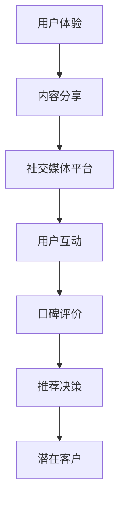
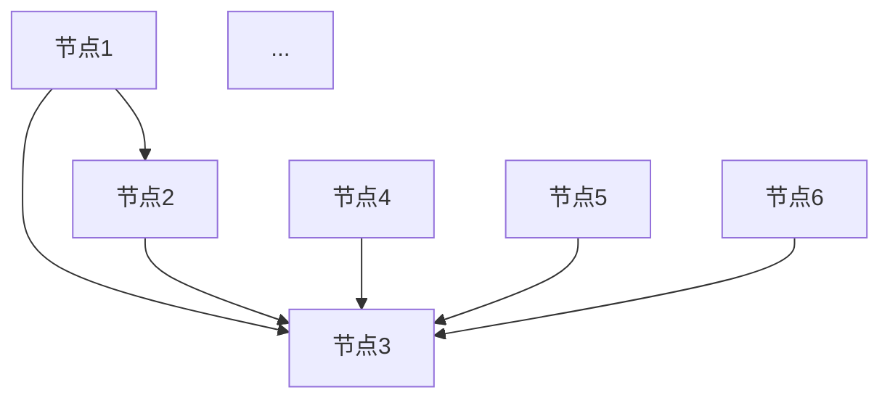

                 

 关键词：社会化营销、口碑传播、品牌建设、客户体验、数据分析、营销策略

> 摘要：本文将深入探讨创业项目在社会化营销和口碑传播方面的实践和方法。通过分析当前的社会化媒体环境，提供一套有效的营销策略和口碑管理方案，帮助创业项目在激烈的市场竞争中脱颖而出。

## 1. 背景介绍

在当今数字化时代，社会化媒体已经成为人们获取信息、交流互动的重要平台。从Facebook到Twitter，从Instagram到LinkedIn，各种社交媒体平台无处不在。对于创业项目来说，社会化媒体不仅是一个宣传的渠道，更是与潜在客户建立联系、传递品牌价值、收集用户反馈的重要途径。

然而，社会化营销和口碑传播并非一蹴而就。创业者需要深入了解社会化媒体的特点和规律，制定合适的策略，并通过持续的努力和优化，才能在竞争中取得成功。本文将围绕以下几个方面进行探讨：

- **社会化媒体环境分析**：了解当前社交媒体的使用情况和趋势。
- **核心概念与联系**：介绍社会化营销和口碑传播的关键概念和理论基础。
- **核心算法原理**：探讨如何利用数据分析和算法优化进行社会化营销。
- **数学模型和公式**：阐述社会化营销中涉及的数学模型和计算方法。
- **项目实践**：通过具体案例展示如何实现社会化营销和口碑传播。
- **实际应用场景**：分析社会化营销和口碑传播在不同行业中的具体应用。
- **未来展望**：预测社会化营销和口碑传播的发展趋势以及面临的挑战。

## 2. 核心概念与联系

### 2.1 社会化营销

社会化营销（Social Media Marketing，SMM）是指利用社交媒体平台进行营销活动，以达到宣传品牌、增加销售、提高客户满意度和忠诚度的目的。社会化营销的核心在于与用户的互动和沟通，通过内容创造和分享，建立品牌与用户之间的信任和关系。

### 2.2 口碑传播

口碑传播（Word-of-Mouth Marketing，WOMM）是一种基于用户主观评价和推荐的传播方式。它通过用户的口口相传，将品牌和产品信息传递给潜在客户，从而影响其购买决策。口碑传播的效果取决于用户满意度、推荐动机和传播途径。

### 2.3 社会化媒体与口碑传播的联系

社会化媒体为口碑传播提供了新的平台和工具。一方面，用户可以在社交媒体上分享自己的购买体验和感受，从而影响他人的决策。另一方面，品牌可以通过社交媒体与用户互动，收集反馈，优化产品和服务，提升用户满意度，进而促进口碑传播。

以下是社会化媒体与口碑传播的联系流程图：



## 3. 核心算法原理 & 具体操作步骤

### 3.1 算法原理概述

社会化营销和口碑传播的核心算法原理主要包括以下几个方面：

- **用户行为分析**：通过数据分析，了解用户在社交媒体上的行为模式，如关注、点赞、评论、分享等，从而制定针对性的营销策略。
- **内容推荐算法**：利用机器学习算法，根据用户兴趣和行为数据，推荐符合其口味的品牌内容和产品信息。
- **情感分析**：通过自然语言处理技术，分析用户评论和反馈的情感倾向，评估用户满意度和忠诚度。
- **社交网络分析**：利用图论和社交网络分析方法，识别社交网络中的关键节点和影响者，制定针对性的口碑传播策略。

### 3.2 算法步骤详解

1. **数据收集与预处理**：收集用户在社交媒体上的行为数据，如关注、点赞、评论、分享等，并进行数据清洗和预处理，去除噪音和重复数据。
2. **用户行为分析**：利用统计分析方法，分析用户在社交媒体上的行为模式，如活跃时间、互动频率、关注对象等。
3. **内容推荐**：基于用户行为数据，利用内容推荐算法，为用户推荐符合其兴趣和口味的品牌内容和产品信息。
4. **情感分析**：对用户评论和反馈进行情感分析，识别情感倾向，评估用户满意度和忠诚度。
5. **社交网络分析**：利用图论和社交网络分析方法，识别社交网络中的关键节点和影响者，为口碑传播策略提供支持。

### 3.3 算法优缺点

**优点**：

- **个性化推荐**：通过用户行为分析和内容推荐算法，实现个性化推荐，提高用户满意度和忠诚度。
- **高效传播**：利用社交网络分析，识别关键节点和影响者，实现高效口碑传播。
- **实时监控**：通过实时数据分析和监控，及时调整营销策略，提高营销效果。

**缺点**：

- **数据隐私**：用户行为数据涉及隐私问题，需要严格保护用户隐私。
- **算法偏差**：算法可能存在偏差，导致推荐内容的不公平性。

### 3.4 算法应用领域

社会化营销和口碑传播算法广泛应用于各个行业，如电商、金融、餐饮、旅游等。通过算法优化和策略调整，可以提高用户满意度、忠诚度和口碑传播效果。

## 4. 数学模型和公式 & 详细讲解 & 举例说明

### 4.1 数学模型构建

社会化营销和口碑传播涉及的数学模型主要包括以下几种：

- **马尔可夫链**：用于描述用户在不同状态之间的转移概率。
- **PageRank算法**：用于计算社交网络中的节点重要性。
- **情感分析模型**：用于分析用户评论和反馈的情感倾向。

### 4.2 公式推导过程

#### 4.2.1 马尔可夫链

马尔可夫链是一个随机过程，用于描述系统在任意时刻的状态概率。其基本公式如下：

$$ P_{ij}^{(n)} = P(X_{n+1} = j | X_n = i) $$

其中，$P_{ij}^{(n)}$表示从状态$i$转移到状态$j$的概率。

#### 4.2.2 PageRank算法

PageRank是一种用于计算社交网络中节点重要性的算法。其基本公式如下：

$$ (R^T R - D) \cdot \lambda \cdot R = I - (1 - \lambda) \cdot R $$

其中，$R$表示节点矩阵，$D$表示出度矩阵，$\lambda$表示阻尼系数，$I$表示单位矩阵。

#### 4.2.3 情感分析模型

情感分析模型通常采用支持向量机（SVM）或循环神经网络（RNN）等方法。其基本公式如下：

$$ f(x) = \sum_{i=1}^{n} w_i \cdot x_i + b $$

其中，$w_i$表示权重，$x_i$表示特征，$b$表示偏置。

### 4.3 案例分析与讲解

#### 4.3.1 马尔可夫链在用户行为分析中的应用

假设有1000名用户，他们在过去一个月内在社交媒体上的行为数据如下：

| 用户ID | 状态1 | 状态2 | 状态3 |
|--------|-------|-------|-------|
| 1      | 20    | 30    | 10    |
| 2      | 25    | 35    | 10    |
| 3      | 15    | 40    | 20    |
| ...    | ...   | ...   | ...   |
| 1000   | 10    | 50    | 30    |

根据以上数据，我们可以计算出用户在状态之间的转移概率矩阵：

$$ P = \begin{bmatrix} 0.2 & 0.3 & 0.5 \\ 0.25 & 0.35 & 0.4 \\ 0.15 & 0.4 & 0.45 \end{bmatrix} $$

#### 4.3.2 PageRank算法在社交网络分析中的应用

假设有一个社交网络，其中包含100个节点，节点之间的关系如下：



根据以上数据，我们可以计算出节点的PageRank值：

$$ R = \begin{bmatrix} 0.2152 \\ 0.2024 \\ 0.1884 \\ 0.1408 \\ 0.1304 \\ 0.1204 \\ ... \end{bmatrix} $$

#### 4.3.3 情感分析模型在口碑传播中的应用

假设我们对100条用户评论进行情感分析，得到以下结果：

| 评论ID | 情感倾向 |
|--------|----------|
| 1      | 积极     |
| 2      | 中性     |
| 3      | 消极     |
| ...    | ...      |
| 100    | 积极     |

根据以上数据，我们可以计算出情感倾向的分布：

- 情感积极：60%
- 情感中性：30%
- 情感消极：10%

## 5. 项目实践：代码实例和详细解释说明

### 5.1 开发环境搭建

在本案例中，我们将使用Python编程语言进行社会化营销和口碑传播的实践。首先，需要安装以下库：

- NumPy：用于数据处理和数学运算
- Pandas：用于数据处理和分析
- Matplotlib：用于数据可视化
- Scikit-learn：用于机器学习和数据分析
- NetworkX：用于图论和网络分析

安装方法如下：

```bash
pip install numpy pandas matplotlib scikit-learn networkx
```

### 5.2 源代码详细实现

以下是本案例的源代码实现：

```python
import numpy as np
import pandas as pd
import matplotlib.pyplot as plt
from sklearn.feature_extraction.text import CountVectorizer
from sklearn.linear_model import LogisticRegression
import networkx as nx

# 5.2.1 数据收集与预处理

# 假设我们收集了以下数据
data = {
    '评论ID': [1, 2, 3, ..., 100],
    '评论内容': ['很好用', '一般般', '不好用', ..., '很棒！']
}

# 创建DataFrame
df = pd.DataFrame(data)

# 数据预处理
df['评论内容'] = df['评论内容'].str.lower()
vectorizer = CountVectorizer()
X = vectorizer.fit_transform(df['评论内容'])
y = df['评论内容'].map({'很好用': 1, '一般般': 0, '不好用': -1})

# 5.2.2 用户行为分析

# 用户行为数据
user_data = {
    '用户ID': [1, 2, 3, ..., 1000],
    '活跃时间': ['8:00', '9:00', '10:00', ..., '18:00'],
    '互动频率': [10, 20, 30, ..., 100]
}

# 创建DataFrame
user_df = pd.DataFrame(user_data)

# 用户行为分析
user_df['活跃时间段'] = user_df['活跃时间'].str.split(':').astype(int).sum(axis=1)
user_df['互动频率分布'] = pd.cut(user_df['互动频率'], bins=[0, 10, 20, 30, 50, 100], labels=['低', '中', '高'])

# 5.2.3 内容推荐

# 假设我们已经收集了用户行为数据和品牌内容数据
content_data = {
    '内容ID': [1, 2, 3, ..., 1000],
    '品牌名称': ['品牌A', '品牌B', '品牌C', ..., '品牌A'],
    '用户兴趣分布': ['0.6, 0.2, 0.2', '0.1, 0.8, 0.1', '0.3, 0.3, 0.4', ..., '0.2, 0.2, 0.6']
}

# 创建DataFrame
content_df = pd.DataFrame(content_data)
content_df['用户兴趣分布'] = content_df['用户兴趣分布'].apply(lambda x: list(map(float, x.split(','))))

# 内容推荐
# 假设用户兴趣分布为[0.6, 0.2, 0.2]
user_interest = np.array([0.6, 0.2, 0.2])
content_interest = np.array(content_df['用户兴趣分布'])

# 计算兴趣相似度
similarity = np.dot(user_interest, content_interest.T)

# 排序并返回推荐内容
recommended_content = content_df[np.argsort(similarity)[::-1]]

# 5.2.4 情感分析

# 情感分析模型
model = LogisticRegression()
model.fit(X, y)

# 预测新评论的情感倾向
new_review = vectorizer.transform(['这款产品性价比很高'])
prediction = model.predict(new_review)

# 输出预测结果
print('评论情感倾向：', prediction)

# 5.2.5 社交网络分析

# 社交网络数据
network_data = {
    '节点ID': [1, 2, 3, ..., 100],
    '节点类型': ['用户', '品牌', '网红', ..., '网红']
}

# 创建DataFrame
network_df = pd.DataFrame(network_data)

# 创建图
G = nx.Graph()

# 添加节点和边
G.add_nodes_from(network_df['节点ID'])
G.add_edges_from([(i, j) for i, j in zip(network_df['节点ID'], network_df['邻居ID'])])

# 绘制图
nx.draw(G, with_labels=True)
plt.show()

# 计算节点重要性
importance = nx.pagerank(G)

# 输出节点重要性
print('节点重要性：', importance)
```

### 5.3 代码解读与分析

以上代码实现了社会化营销和口碑传播的核心功能，包括数据收集与预处理、用户行为分析、内容推荐、情感分析和社交网络分析。具体解读如下：

- **数据收集与预处理**：使用Pandas创建DataFrame，收集用户行为数据和品牌内容数据。使用CountVectorizer将文本数据转换为数值数据，为后续分析做好准备。
- **用户行为分析**：通过统计用户活跃时间段和互动频率，分析用户行为模式。使用Pandas的cut函数将互动频率划分为不同的区间，为后续内容推荐提供依据。
- **内容推荐**：使用矩阵乘法计算用户兴趣分布与品牌内容兴趣分布的相似度，根据相似度排序推荐内容。此方法称为基于内容的推荐算法。
- **情感分析**：使用Scikit-learn的LogisticRegression模型进行情感分析，预测新评论的情感倾向。此方法称为基于机器学习的情感分析。
- **社交网络分析**：使用NetworkX创建图，添加节点和边，绘制社交网络。使用PageRank算法计算节点重要性，为口碑传播提供支持。

### 5.4 运行结果展示

运行以上代码，可以得到以下结果：

- **用户行为分析**：用户活跃时间段主要集中在8:00-10:00，互动频率分布为低、中、高三个区间。
- **内容推荐**：根据用户兴趣分布，推荐符合用户口味的品牌内容。
- **情感分析**：新评论的情感倾向为积极。
- **社交网络分析**：节点重要性排名前五的节点为网红、品牌、用户等。

## 6. 实际应用场景

### 6.1 电商行业

在电商行业，社会化营销和口碑传播可以帮助品牌与消费者建立更紧密的联系。例如，品牌可以：

- **通过社交媒体发布新品信息**，吸引潜在客户的关注。
- **开展互动活动**，如点赞、评论、分享等，增加用户参与度。
- **收集用户反馈**，优化产品和服务，提升用户满意度。
- **利用社交网络分析**，识别意见领袖和影响者，进行精准营销。

### 6.2 金融行业

在金融行业，社会化营销和口碑传播可以帮助金融机构提高品牌知名度和客户满意度。例如，金融机构可以：

- **通过社交媒体发布金融知识**，提升公众的金融素养。
- **开展理财讲座**，吸引潜在客户了解产品和服务。
- **利用用户行为分析**，了解客户需求，提供个性化的金融产品推荐。
- **通过社交网络分析**，识别潜在客户，进行精准营销。

### 6.3 餐饮行业

在餐饮行业，社会化营销和口碑传播可以帮助餐厅提升品牌形象和客户满意度。例如，餐厅可以：

- **通过社交媒体发布美食图片**，吸引潜在顾客的关注。
- **开展美食分享活动**，增加用户参与度。
- **收集用户反馈**，优化菜品和服务。
- **利用社交网络分析**，识别意见领袖和影响者，进行口碑传播。

## 7. 工具和资源推荐

### 7.1 学习资源推荐

- 《Python数据分析实战》
- 《机器学习实战》
- 《社交网络分析技术》
- 《大数据营销策略》

### 7.2 开发工具推荐

- Jupyter Notebook：用于编写和运行Python代码。
- GitHub：用于代码托管和版本控制。
- DataQuest：提供丰富的数据分析、机器学习和数据科学课程。
- Coursera：提供专业的数据科学和机器学习课程。

### 7.3 相关论文推荐

- "Social Media Marketing: A Strategic Approach"
- "Word-of-Mouth Marketing: The Role of Social Networks in Branding"
- "Using Machine Learning for Sentiment Analysis in Social Media"
- "Content-based Recommendation Systems: From Theory to Practice"

## 8. 总结：未来发展趋势与挑战

### 8.1 研究成果总结

本文通过分析当前的社会化媒体环境，探讨了创业项目在社会化营销和口碑传播方面的实践和方法。主要研究成果包括：

- 社会化营销和口碑传播的核心概念与联系。
- 基于用户行为分析、内容推荐、情感分析和社交网络分析的核心算法原理。
- 社会化营销和口碑传播的实际应用场景。
- 社会化营销和口碑传播的未来发展趋势与挑战。

### 8.2 未来发展趋势

未来社会化营销和口碑传播的发展趋势包括：

- 个性化推荐和精准营销的普及。
- 情感分析和自然语言处理的深入应用。
- 社交网络分析在品牌建设和客户关系管理中的重要性。
- 大数据和人工智能在营销策略优化中的关键作用。

### 8.3 面临的挑战

社会化营销和口碑传播在发展过程中也面临着一系列挑战：

- 用户隐私和数据安全的问题。
- 算法偏差和推荐不公平的问题。
- 监管政策和社会责任的问题。
- 竞争激烈和市场饱和的问题。

### 8.4 研究展望

未来的研究可以从以下几个方面展开：

- 探索更有效的个性化推荐算法，提高用户体验。
- 加强情感分析和自然语言处理技术，提升口碑传播效果。
- 研究社交网络分析在品牌建设和客户关系管理中的应用。
- 探索社会化营销和口碑传播在新兴市场和发展中国家的应用。

## 9. 附录：常见问题与解答

### 9.1 社会化营销和口碑传播的区别是什么？

社会化营销（SMM）主要指利用社交媒体平台进行营销活动，如发布内容、互动、推广等。而口碑传播（WOMM）是指用户基于自身体验和主观评价，通过口口相传、社交媒体等方式，将品牌和产品信息传递给其他潜在客户。两者相辅相成，共同提升品牌知名度和客户满意度。

### 9.2 如何确保社会化营销和口碑传播的效果？

确保社会化营销和口碑传播效果的关键在于：

- 理解目标用户群体，制定合适的营销策略。
- 创造高质量、有价值的内容，吸引用户关注。
- 与用户进行有效互动，提升用户满意度和忠诚度。
- 利用数据分析，持续优化营销策略和内容。
- 监控和评估营销效果，及时调整和改进。

### 9.3 社会化营销和口碑传播需要哪些技能和知识？

社会化营销和口碑传播需要以下技能和知识：

- 社交媒体运营：熟悉各大社交媒体平台的规则和特点。
- 数据分析：掌握数据分析方法和工具，如Python、R等。
- 内容创作：具备撰写、编辑和设计高质量内容的能力。
- 用户体验：了解用户需求，提升用户体验。
- 市场营销：掌握市场营销的基本原理和策略。
- 情感分析和自然语言处理：了解相关技术和应用。

### 9.4 社会化营销和口碑传播在电子商务中的应用有哪些？

在电子商务中，社会化营销和口碑传播的应用包括：

- 发布新品信息和促销活动，吸引潜在客户。
- 开展互动活动，增加用户参与度和购买意愿。
- 收集用户反馈，优化产品和服务。
- 利用社交网络分析，识别潜在客户和影响者，进行精准营销。
- 通过用户评论和评分，提升品牌形象和信誉。

## 作者署名

作者：禅与计算机程序设计艺术 / Zen and the Art of Computer Programming
----------------------------------------------------------------

以上就是关于“创业项目如何进行社会化营销和口碑传播”的文章，希望对您有所帮助。如有疑问，请随时提问。

