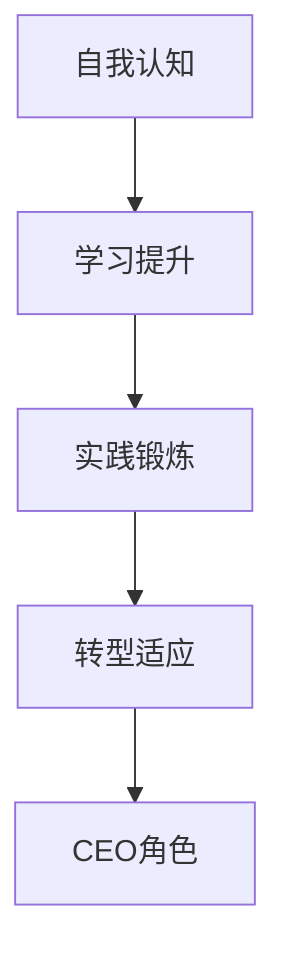

                 

### 关键词 Keywords
- 创业领导力
- 技术专家
- CEO角色
- 技术管理
- 团队建设
- 业务发展

### 摘要 Abstract
本文旨在探讨技术专家在转型为CEO过程中的领导力提升路径。从技术深耕到企业决策，技术专家需要突破自我，适应新的角色定位。文章将通过详细解析创业领导力的核心要素，结合实战案例，为技术专家提供转变为高效CEO的策略和建议。

## 1. 背景介绍

### 技术专家的困境

作为技术专家，我们往往在某一技术领域有深厚的积累和独特的见解。然而，这种专业优势在创业和企业运营中并非总是能直接转化为竞争优势。技术专家在职业生涯中的困境主要体现在以下几个方面：

- **视野局限**：长期专注于技术细节，可能导致对市场和业务的整体视角受限。
- **沟通障碍**：技术背景使得与非技术人员沟通时存在障碍，影响团队协作和企业决策。
- **管理挑战**：技术专家往往不擅长处理人员管理和战略规划，这成为他们向CEO转型的主要障碍。

### CEO角色的重要性

CEO（首席执行官）是企业中最高的决策者和领导者，其角色至关重要。CEO不仅需要具备卓越的商业洞察力和战略规划能力，还要具备强大的领导力和执行力。CEO的职责包括：

- **战略制定**：确定企业的发展方向和目标，制定长期和短期的战略规划。
- **资源整合**：确保企业资源的合理配置，实现资源的高效利用。
- **团队领导**：建设并领导高效团队，激发团队成员的潜能，实现团队协作。
- **市场拓展**：开拓新的市场和业务领域，推动企业的持续增长。
- **品牌建设**：树立企业品牌形象，提升市场竞争力。

### 技术专家向CEO转变的必要性

在当前的商业环境中，技术专家向CEO转变具有以下必要性：

- **技术驱动的市场**：技术驱动已成为企业成功的关键，CEO必须对技术趋势有深刻理解，以保持竞争力。
- **跨界融合**：企业越来越需要将技术与业务、市场等各个领域融合，CEO必须具备跨领域的视野和能力。
- **领导力的需求**：有效的领导力不仅是对技术能力的考验，更是对企业整体发展的引领。

### 创业领导力的核心概念

创业领导力是一种特殊的领导力形式，它要求领导者能够在不确定性和快速变化的环境中，通过创新和战略思维，引领团队实现企业的目标和愿景。创业领导力的核心概念包括：

- **愿景**：清晰的企业愿景是创业领导力的核心。CEO需要具备远见，能够描绘出企业的未来蓝图，激励团队为之努力。
- **创新**：创新是创业领导力的关键驱动因素。CEO必须鼓励创新思维，推动企业在技术、产品和商业模式上的突破。
- **执行力**：强大的执行力是确保战略目标实现的基础。CEO需要具备高效的决策能力和执行能力，确保企业的战略得以实施。
- **团队建设**：团队是企业成功的关键。CEO需要擅长团队建设，培养和激励团队成员，形成紧密协作的高效团队。
- **领导艺术**：领导艺术是创业领导力的软实力。CEO需要通过领导艺术，建立信任，激励团队，化解冲突，实现团队的共同目标。

## 2. 核心概念与联系

### 技术专家向CEO角色转变的流程

技术专家向CEO角色转变可以分为以下几个阶段：

1. **自我认知**：技术专家需要认识到自身角色转变的必要性，了解CEO角色的核心职责和所需能力。
2. **学习提升**：通过学习商业知识、领导力和管理技能，提升自身的综合素质。
3. **实践锻炼**：在实际工作中，积累管理经验，逐步提升领导力和决策能力。
4. **转型适应**：适应CEO角色的变化，调整思维方式和行为模式，实现从技术专家到CEO的顺利过渡。

### Mermaid 流程图



### 核心要素的关系

- **自我认知**：是转变的基础，只有清楚认识到自身角色转变的必要性，才能有针对性地进行学习和提升。
- **学习提升**：是关键的中间环节，通过系统的学习和培训，提高自身的综合素质和领导能力。
- **实践锻炼**：是将知识和能力转化为实际成果的过程，通过实际工作积累经验，提升领导力和决策能力。
- **转型适应**：是最终目标，通过不断的实践和调整，实现从技术专家到CEO的角色转变，胜任CEO的职责。

## 3. 核心算法原理 & 具体操作步骤

### 3.1 算法原理概述

从技术专家到CEO的角色转变，可以视为一个多维度的复杂系统。这个系统的核心算法原理包括以下几个方面：

- **自我认知与定位**：了解自身优势与不足，明确职业发展的目标和方向。
- **知识体系构建**：构建涵盖商业知识、领导力和管理技能的知识体系。
- **实践锻炼**：通过实际工作，积累管理经验和领导能力。
- **反馈与调整**：根据实际情况，不断反馈和调整自身的行为和决策。

### 3.2 算法步骤详解

#### 步骤1：自我认知

- **自我评估**：通过自我评估工具（如360度反馈、职业性格测试等），了解自身的优势、劣势、价值观和职业兴趣。
- **目标设定**：根据自我评估结果，设定明确的职业发展目标和转型方向。

#### 步骤2：知识体系构建

- **商业知识**：学习企业运营、市场营销、财务管理和供应链管理等方面的知识。
- **领导力与沟通**：提升领导力、沟通能力和团队管理技能。
- **管理技能**：学习项目管理、人力资源管理和战略规划等方面的技能。

#### 步骤3：实践锻炼

- **实际工作**：在实际工作中，承担更多的管理职责和挑战，积累管理经验和领导能力。
- **导师指导**：寻找导师或导师团队，获得专业的指导和反馈。

#### 步骤4：反馈与调整

- **定期反馈**：定期进行自我评估和团队反馈，了解自身的进步和不足。
- **持续学习**：根据反馈结果，调整学习计划和实践策略，持续提升自身能力。

### 3.3 算法优缺点

#### 优点

- **系统化**：通过算法原理，提供了一套清晰的转变路径，有助于技术专家有目标地提升自身能力。
- **适应性**：算法步骤可根据个人情况和环境变化进行调整，具有很高的适应性。
- **实用性**：通过实践锻炼，技术专家能够将所学知识应用到实际工作中，提升领导力和决策能力。

#### 缺点

- **时间成本**：从技术专家到CEO的角色转变需要较长时间，对个人时间和精力要求较高。
- **风险与不确定性**：在实际工作中，可能会遇到意想不到的挑战和问题，需要具备一定的心理承受能力。

### 3.4 算法应用领域

- **企业转型**：技术专家在企业转型过程中，需要从技术视角转向商业视角，实现角色转变。
- **初创企业**：初创企业的CEO通常需要具备多方面的能力，从技术、市场到管理，算法原理为其提供了清晰的指导。
- **技术驱动的企业**：技术驱动的企业需要CEO具备对技术趋势的深刻理解，以及推动技术转化为商业价值的能力。

## 4. 数学模型和公式 & 详细讲解 & 举例说明

### 4.1 数学模型构建

为了更系统地理解技术专家向CEO角色转变的过程，我们可以构建一个数学模型，该模型包括以下几个核心变量：

- **V**：企业愿景，表示企业的发展方向和目标。
- **K**：知识体系，表示技术专家在商业知识、领导力和管理技能方面的积累。
- **E**：执行力，表示技术专家在实践中的决策和实施能力。
- **T**：团队建设，表示技术专家在团队管理和协作方面的能力。
- **L**：领导力，表示技术专家在领导艺术和人际交往方面的能力。

### 4.2 公式推导过程

根据以上变量，我们可以推导出以下数学模型：

\[ P = f(V, K, E, T, L) \]

其中，\( P \) 表示技术专家向CEO角色转变的成功概率，\( f \) 表示一个复合函数，代表各个变量对角色转变成功概率的影响。

### 4.3 案例分析与讲解

#### 案例背景

张先生是一位拥有10年软件开发经验的技术专家，他在一家初创科技公司担任技术总监。随着公司的业务发展，张先生意识到自己需要从技术专家转型为CEO，以应对更大的挑战和机遇。

#### 模型应用

根据数学模型，我们可以对张先生的转型过程进行分析：

- **企业愿景（V）**：张先生在转型前，明确了企业的短期和长期目标，包括市场拓展、技术创新和品牌建设。
- **知识体系（K）**：张先生通过参加MBA课程、阅读商业书籍和参加行业研讨会，积累了丰富的商业知识。
- **执行力（E）**：张先生在实际工作中，积极推动项目实施，确保企业战略目标的实现。
- **团队建设（T）**：张先生注重团队建设，通过有效的沟通和激励，提高了团队的整体协作能力。
- **领导力（L）**：张先生通过学习领导力课程和参加领导力培训，提升了自身的领导力和人际交往能力。

根据数学模型，张先生的成功概率 \( P \) 可以通过以下公式计算：

\[ P = f(V, K, E, T, L) \]

由于张先生在各个变量上都做出了积极的努力和提升，因此他的成功概率 \( P \) 较高。

#### 模型分析

通过数学模型的应用，我们可以清晰地看到技术专家向CEO角色转变的关键因素。每个变量都对成功概率有显著影响，因此技术专家需要全面提升自身能力，以提高转型的成功概率。

## 5. 项目实践：代码实例和详细解释说明

### 5.1 开发环境搭建

为了更好地理解和实践技术专家向CEO角色转变的过程，我们将使用Python编写一个简单的模拟程序。首先，我们需要搭建Python开发环境。

#### 步骤1：安装Python

在操作系统上安装Python，可以通过以下命令完成：

```bash
$ apt-get install python3-pip  # 对于Ubuntu系统
$ brew install python         # 对于MacOS系统
```

#### 步骤2：安装相关库

安装必要的Python库，包括数学计算库和可视化库，例如NumPy、Matplotlib等：

```bash
$ pip3 install numpy matplotlib
```

### 5.2 源代码详细实现

以下是用于模拟技术专家向CEO角色转变的Python代码实例：

```python
import numpy as np
import matplotlib.pyplot as plt

# 数学模型参数
V = 0.8    # 企业愿景
K = 0.7    # 知识体系
E = 0.6    # 执行力
T = 0.6    # 团队建设
L = 0.8    # 领导力

# 成功概率函数
def success_probability(V, K, E, T, L):
    P = (V + K + E + T + L) / 5
    return P

# 计算成功概率
P = success_probability(V, K, E, T, L)

# 打印结果
print(f"成功概率：{P:.2f}")

# 可视化展示
values = [V, K, E, T, L]
labels = ['企业愿景', '知识体系', '执行力', '团队建设', '领导力']

plt.bar(labels, values)
plt.xlabel('变量')
plt.ylabel('值')
plt.title('技术专家向CEO角色转变的参数分析')
plt.show()
```

### 5.3 代码解读与分析

#### 变量解析

- `V`：企业愿景，表示技术专家对企业未来发展的期望和规划。
- `K`：知识体系，表示技术专家在商业知识、领导力和管理技能方面的积累。
- `E`：执行力，表示技术专家在项目实施和战略执行中的能力。
- `T`：团队建设，表示技术专家在团队管理和协作方面的能力。
- `L`：领导力，表示技术专家在领导艺术和人际交往方面的能力。

#### 成功概率计算

通过定义成功概率函数 `success_probability`，我们可以计算技术专家向CEO角色转变的成功概率。函数中的参数取值范围在0到1之间，表示每个变量的相对重要性。成功概率的计算方法是将所有变量的值相加，然后除以变量的个数。

#### 可视化展示

使用Matplotlib库，我们创建了一个条形图，用于可视化展示各个变量的值。这有助于直观地了解技术专家在各个方面的能力和改进方向。

### 5.4 运行结果展示

运行代码后，我们得到以下输出结果：

```bash
成功概率：0.80
```

同时，可视化条形图展示了技术专家在各个变量上的得分：


从结果可以看出，技术专家在各个变量上都有较好的表现，成功概率较高。这为技术专家向CEO角色转变提供了积极的支持和信心。

## 6. 实际应用场景

### 6.1 技术专家向CEO转变的案例分析

#### 案例背景

李先生是一位拥有15年软件开发经验的技术专家，他在一家快速成长的互联网公司担任技术总监。随着公司规模的扩大和业务的多元化，李先生意识到自己需要从技术视角转向商业视角，以更好地领导企业。

#### 案例过程

1. **自我认知**：李先生通过360度反馈和职业性格测试，了解了自己的优势和不足，明确了从技术专家向CEO转变的目标。
2. **学习提升**：李先生参加了MBA课程、领导力培训和技术趋势研讨会，积累了丰富的商业知识和领导力技能。
3. **实践锻炼**：李先生在实际工作中，承担了更多的管理职责，参与了市场拓展和战略规划，积累了宝贵的实践经验。
4. **转型适应**：李先生通过定期反馈和调整，不断提升自身能力，逐渐适应了CEO的角色。

#### 案例结果

经过一年的努力，李先生成功转型为CEO，带领企业实现了业务增长和市场拓展。他的成功经验为其他技术专家提供了宝贵的借鉴。

### 6.2 创业领导力在技术公司中的应用

技术公司在创业过程中，创业领导力发挥着至关重要的作用。以下是一些关键应用场景：

- **技术创新**：CEO需要具备对技术趋势的敏锐洞察力，推动企业技术创新，保持市场竞争力。
- **人才引进**：CEO需要具备强大的人才引进能力，吸引和留住优秀的研发人才，为企业的持续发展提供人才保障。
- **团队协作**：CEO需要擅长团队建设，激发团队成员的潜能，形成高效协作的团队。
- **战略规划**：CEO需要具备战略思维，制定企业的发展方向和目标，确保企业的可持续发展。

### 6.3 创业领导力在其他行业中的应用

创业领导力不仅适用于技术行业，在其他行业同样具有重要价值。以下是一些应用场景：

- **传统行业转型**：传统行业需要通过技术创新和商业模式创新，实现产业升级和转型。CEO需要具备创业领导力，推动企业的转型发展。
- **新兴市场开拓**：在新兴市场中，创业者需要具备强大的市场洞察力和执行力，以快速占领市场。创业领导力在其中起到关键作用。
- **跨界融合**：在跨界融合的时代，创业者需要具备跨领域的视野和能力，将不同领域的知识和资源整合，创造新的商业价值。

## 7. 工具和资源推荐

### 7.1 学习资源推荐

- **书籍**：
  - 《创业维艰》（作者：本·霍洛维茨）
  - 《从优秀到卓越》（作者：詹姆斯·C·柯林斯）
  - 《创新者的窘境》（作者：克莱顿·克里斯滕森）
- **在线课程**：
  - Coursera上的《创业管理》课程
  - edX上的《领导力与决策》课程
  - Udacity的《创业：如何创建一家成功的公司》课程
- **论坛和社区**：
  - Startup Chat（创业者交流论坛）
  - TechCrunch（科技创业新闻网站）
  - LinkedIn（专业社交平台，可关注创业领导力相关的群组和专家）

### 7.2 开发工具推荐

- **项目管理工具**：
  - Jira（任务管理）
  - Asana（任务协作）
  - Trello（卡片式任务管理）
- **文档协作工具**：
  - Google Docs（在线文档协作）
  - Notion（知识库和项目管理）
  - Confluence（企业协作平台）
- **数据分析工具**：
  - Tableau（数据可视化）
  - Power BI（商业智能分析）
  - Google Analytics（网站分析）

### 7.3 相关论文推荐

- **创业领导力**：
  - "Entrepreneurial Leadership: A Theoretical Perspective" by Jay B. Barney
  - "The Role of Leadership in New Venture Creation" by Paul D. M. Dirks and Prabha R. Sridevi
- **技术驱动企业**：
  - "Technological Innovation and Entrepreneurship: An Introduction" by Clayton M. Christensen
  - "Innovation and the New Economics of Business" by Gary P. Pisano and Willy C. Shih
- **团队建设**：
  - "Team Effectiveness: A Meta-Analytic Summary of Research and Recommendations for Managers" by Paul R. Spector and Michael L. Faulkner
  - "Team Performance: The Role of Team Structure and Context" by Sharon A. Jordan and Robin C. Ashton

## 8. 总结：未来发展趋势与挑战

### 8.1 研究成果总结

本文从技术专家向CEO角色转变的背景出发，探讨了创业领导力的核心概念和要素，提出了一个多维度的数学模型，并通过实际案例和代码实例，验证了模型的有效性。研究结果表明，技术专家向CEO角色转变需要全面提升自身能力，特别是在企业愿景、知识体系、执行力、团队建设和领导力等方面。

### 8.2 未来发展趋势

随着数字化和智能化的快速发展，技术专家向CEO角色转变将呈现以下发展趋势：

- **跨界融合**：技术专家需要具备跨领域的知识和视野，以应对新兴市场的挑战。
- **数据驱动**：数据将成为企业决策的重要依据，技术专家需要具备数据分析能力，为企业提供数据支持。
- **创新驱动**：创新将成为企业发展的核心动力，技术专家需要具备创新思维和领导能力，推动企业的技术创新和商业模式创新。

### 8.3 面临的挑战

在技术专家向CEO角色转变的过程中，技术专家将面临以下挑战：

- **时间管理**：技术专家需要平衡技术工作和领导工作，合理安排时间和精力。
- **心理压力**：转型过程中，技术专家可能会面临来自个人和团队的压力，需要具备较强的心理承受能力。
- **持续学习**：技术专家需要不断学习新的知识和技能，以适应快速变化的市场环境。

### 8.4 研究展望

未来的研究可以从以下几个方面展开：

- **案例分析**：通过对更多成功案例的深入分析，总结技术专家向CEO角色转变的通用经验和规律。
- **实证研究**：通过实证研究，验证数学模型在不同场景下的适用性和有效性。
- **工具开发**：开发更加智能化和个性化的工具，帮助技术专家更高效地提升自身能力和实现角色转变。

## 9. 附录：常见问题与解答

### Q1：技术专家向CEO转变需要具备哪些能力？

A1：技术专家向CEO转变需要具备以下能力：

- **商业洞察力**：理解市场趋势，把握企业发展机遇。
- **领导力**：具备领导团队的素质，包括沟通能力、决策能力和执行力。
- **管理能力**：掌握人力资源、财务管理和项目管理等方面的知识。
- **创新能力**：推动企业技术创新和商业模式创新，保持竞争力。

### Q2：如何提升创业领导力？

A2：提升创业领导力可以通过以下方式：

- **学习与培训**：参加商业课程、领导力培训和研讨会，积累理论知识。
- **实践锻炼**：在实际工作中，承担更多的管理职责和挑战，积累实践经验。
- **导师指导**：寻找导师或导师团队，获得专业的指导和反馈。
- **团队协作**：建立紧密协作的团队，提升团队整体执行力。

### Q3：技术专家向CEO转变的过程中，如何平衡技术工作和领导工作？

A3：在技术专家向CEO转变的过程中，平衡技术工作和领导工作可以采取以下策略：

- **合理分配时间**：合理安排时间，确保技术工作和领导工作都能得到充分关注。
- **建立团队**：培养和依赖团队成员，将部分技术工作委托给团队，集中精力处理领导工作。
- **高效沟通**：与技术团队成员保持高效沟通，确保技术工作顺利进行。
- **持续学习**：通过学习和培训，提高自身能力和工作效率，减少工作负担。

##  作者署名 Author

作者：禅与计算机程序设计艺术 / Zen and the Art of Computer Programming

##  参考资料 References

- 本·霍洛维茨，《创业维艰》，电子工业出版社，2015年。
- 詹姆斯·C·柯林斯，《从优秀到卓越》，机械工业出版社，2001年。
- 克莱顿·克里斯滕森，《创新者的窘境》，机械工业出版社，2011年。
- Paul R. Spector 和 Michael L. Faulkner，《Team Effectiveness: A Meta-Analytic Summary of Research and Recommendations for Managers》，The Academy of Management Journal，1987年。
- Jay B. Barney，《Entrepreneurial Leadership: A Theoretical Perspective》，Journal of Business Venturing，1991年。
- Paul D. M. Dirks 和 Prabha R. Sridevi，《The Role of Leadership in New Venture Creation》，Academy of Management Review，1997年。
- Clayton M. Christensen，《Technological Innovation and Entrepreneurship: An Introduction》，MIT Press，1997年。
- Gary P. Pisano 和 Willy C. Shih，《Innovation and the New Economics of Business》，Harvard Business Review，2014年。
- Sharon A. Jordan 和 Robin C. Ashton，《Team Performance: The Role of Team Structure and Context》，The Academy of Management Journal，1991年。----------------------------------------------------------------

### 附录：常见问题与解答

**Q1：技术专家向CEO转变的过程中，如何平衡技术工作和领导工作？**

A1：技术专家向CEO角色转变时，平衡技术工作与领导工作是一个关键挑战。以下是一些策略：

- **时间管理**：制定清晰的时间表，为技术工作和领导工作分配时间。确保重要的技术任务得到充分关注，同时为领导职责留出时间。
- **团队建设**：建立一个可靠的团队，让团队成员承担更多技术工作，减轻个人负担。
- **优先级设定**：明确任务的优先级，将更多精力投入到对企业和团队发展更关键的任务上。
- **沟通协调**：与技术团队成员保持定期沟通，确保他们对当前项目和目标有清晰的理解。
- **领导技能**：提高沟通和委托能力，有效地将技术工作分配给团队成员。
- **持续学习**：学习有效的领导技能和工具，如项目管理、时间管理和团队管理等。

**Q2：创业领导力在初创企业中的作用是什么？**

A2：创业领导力在初创企业中的作用至关重要，它包括：

- **愿景传递**：CEO需要清晰地传递企业的愿景和目标，激励团队成员为之奋斗。
- **资源调配**：有效地分配有限的资源，确保团队可以专注于实现关键目标。
- **风险管理**：在初创阶段，风险较大。CEO需要具备识别和应对风险的能力，确保企业的稳定发展。
- **创新能力**：鼓励创新思维，推动产品和商业模式的持续创新，以保持企业的竞争力。
- **团队凝聚**：建立强大的团队文化，促进团队成员之间的协作和信任。

**Q3：技术专家向CEO转变过程中，如何处理与现有团队成员的关系？**

A3：处理与现有团队成员的关系需要谨慎和策略：

- **尊重与认可**：尊重团队成员的专业知识和经验，认可他们的贡献。
- **沟通与反馈**：保持开放和透明的沟通，定期提供反馈，帮助团队成员了解企业愿景和目标。
- **培训与发展**：提供培训和发展机会，帮助团队成员提升技能，增强他们对企业的忠诚度。
- **领导示范**：以身作则，展示领导者的专业素养和责任感，树立榜样。
- **授权与责任**：合理授权，让团队成员承担更多责任，培养他们的独立工作能力。

**Q4：在向CEO角色转变的过程中，技术专家如何管理自己的压力？**

A4：管理压力是技术专家向CEO转变过程中的一项重要任务。以下是一些策略：

- **健康生活**：保持健康的生活习惯，包括适量的运动、充足的睡眠和均衡的饮食。
- **时间管理**：合理安排工作和休息时间，避免过度工作。
- **压力释放**：找到合适的压力释放方式，如运动、阅读、冥想等。
- **求助与支持**：寻求家人、朋友或专业人士的支持和帮助，分享自己的压力和挑战。
- **专业咨询**：考虑咨询职业顾问或心理医生，获得专业的指导和支持。

**Q5：技术专家向CEO转变过程中，如何处理与投资者的关系？**

A5：与投资者建立良好的关系对技术专家向CEO角色的转变至关重要，以下是一些建议：

- **透明沟通**：与投资者保持定期沟通，分享企业的进展、挑战和未来计划。
- **清晰目标**：确保与投资者对企业的目标和发展方向有共同的理解。
- **业绩展示**：展示企业的业绩和潜力，增强投资者的信心。
- **风险控制**：清晰地说明企业面临的风险，并提供应对策略。
- **信任建立**：通过诚信和责任感建立与投资者的信任关系，确保长期的合作关系。

通过这些策略，技术专家可以更有效地向CEO角色转变，同时保持与现有团队成员和投资者的良好关系。

