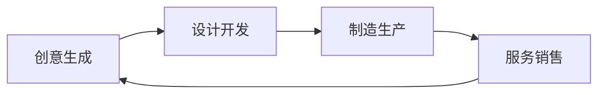
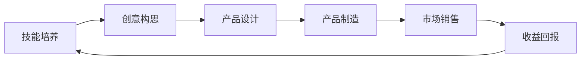

                 

关键词：创客经济、技能变现、个人发展、技术创业、职业规划

> 摘要：本文深入探讨在创客经济时代，个人如何通过技能和创意实现价值转化，为读者提供实用的策略和案例，助力个人在数字化浪潮中站稳脚跟。

## 1. 背景介绍

随着互联网技术的发展，尤其是云计算、大数据、人工智能等新兴技术的崛起，传统的经济模式正在经历深刻的变革。创客运动作为一种创新的文化，它鼓励人们通过技术、设计和制造将创意转化为实物产品。而这一运动背后所蕴含的创客经济，正在成为一种新的经济增长模式。创客经济不仅推动了技术创新，还为广大个人提供了广阔的发展空间。在这个时代背景下，如何通过个人技能实现价值变现，成为了每个人都需要思考的问题。

### 1.1 创客经济的兴起

创客经济起源于美国，随着全球化的推进，它迅速传播到世界各地。创客经济的核心在于通过开放、共享和协作，打破传统的生产和消费模式。以下是创客经济的主要特点：

- **开放性**：创客文化倡导开放性，鼓励知识、资源和经验的共享。
- **个性化**：创客经济强调个性化和定制化，满足消费者多样化的需求。
- **协作性**：通过协作，创客能够更好地实现创意的转化。
- **创新性**：创客文化鼓励创新思维和实践，推动技术和商业模式的不断突破。

### 1.2 个人技能的价值

在创客经济时代，个人的技能和知识成为了重要的生产要素。随着技术的进步，一些传统技能的价值不断提升，而一些新兴技能也成为了个人发展的新动能。例如，编程、数据分析、人工智能等技能在创客经济中具有极高的市场需求。个人如何有效地利用这些技能，实现价值变现，是本文要探讨的重点。

## 2. 核心概念与联系

### 2.1 创客经济的核心概念

创客经济的核心概念包括创客精神、创新思维和实际操作能力。这些概念相互联系，共同构成了创客经济的核心框架。

- **创客精神**：创客精神是一种以创新和实践为核心的价值观念，它鼓励人们勇于尝试、不断学习和勇于失败。
- **创新思维**：创新思维是创客经济的驱动力，它包括创造性思维、批判性思维和系统思维。
- **实际操作能力**：实际操作能力是创客经济的落地执行者，它将创新思维转化为实际的产品和服务。

### 2.2 创客经济的架构

创客经济的架构可以分解为四个主要部分：创意生成、设计开发、制造生产和服务销售。以下是创客经济的架构图：



### 2.3 技能与价值变现

在创客经济中，技能与价值变现的关系可以理解为一种闭环系统。个人的技能通过创意和创新的手段，转化为具有市场价值的产品和服务，从而实现价值的增值。以下是技能与价值变现的流程图：



## 3. 核心算法原理 & 具体操作步骤

### 3.1 算法原理概述

在创客经济中，技能变现的核心算法可以概括为“价值创造算法”。该算法的核心思想是通过技术手段，将个人的技能转化为可量化的价值。以下是价值创造算法的基本原理：

1. **技能评估**：对个人的技能进行评估，确定其市场价值。
2. **创意构思**：基于技能特点，构思具有市场前景的产品或服务。
3. **产品设计**：通过技术手段，将创意转化为具体的产品或服务。
4. **市场推广**：利用互联网和社交媒体等渠道，推广产品或服务。
5. **销售变现**：通过销售产品或服务，实现技能的价值变现。

### 3.2 算法步骤详解

#### 3.2.1 技能评估

技能评估是价值创造算法的第一步。具体操作步骤如下：

1. **自我评估**：个人根据自己的技能水平和市场需求，进行初步评估。
2. **市场调研**：通过市场调研，了解相关技能的市场需求和价格水平。
3. **综合评估**：将自我评估和市场调研结果进行综合分析，确定技能的市场价值。

#### 3.2.2 创意构思

创意构思是价值创造算法的关键环节。具体操作步骤如下：

1. **确定目标市场**：根据技能特点和市场调研结果，确定目标市场。
2. **创意生成**：基于目标市场，构思具有创新性和实用性的产品或服务。
3. **可行性分析**：对创意进行可行性分析，确保其具有市场前景。

#### 3.2.3 产品设计

产品设计是将创意转化为具体产品的过程。具体操作步骤如下：

1. **需求分析**：根据创意，分析市场需求和用户需求。
2. **功能设计**：设计产品的功能模块和用户界面。
3. **技术实现**：选择合适的技术手段，实现产品的功能。

#### 3.2.4 市场推广

市场推广是价值创造算法的重要环节。具体操作步骤如下：

1. **制定营销策略**：根据产品特点和目标市场，制定合适的营销策略。
2. **内容营销**：通过博客、社交媒体、视频等渠道，进行内容营销。
3. **广告投放**：根据营销策略，进行广告投放，提高产品的曝光率。

#### 3.2.5 销售变现

销售变现是将产品或服务转化为现金的过程。具体操作步骤如下：

1. **建立销售渠道**：选择合适的销售渠道，如电商平台、线下商店等。
2. **客户服务**：提供优质的客户服务，提高客户满意度。
3. **销售统计**：对销售数据进行分析，优化销售策略。

### 3.3 算法优缺点

#### 优点

- **高效性**：价值创造算法通过系统化的步骤，提高了技能变现的效率。
- **灵活性**：算法可以根据个人技能和市场变化进行调整，具有很高的灵活性。
- **可扩展性**：算法可以应用到各种技能领域，具有广泛的适用性。

#### 缺点

- **复杂性**：算法涉及多个环节，操作复杂，需要较高的技术能力。
- **风险性**：技能变现过程中存在一定的风险，如市场需求变化、竞争加剧等。

### 3.4 算法应用领域

价值创造算法在创客经济中具有广泛的应用领域，包括但不限于：

- **软件开发**：通过编程技能，开发具有市场前景的软件产品。
- **设计领域**：通过设计技能，开发具有创新性的设计产品。
- **教育领域**：通过教育培训，提供个性化的学习服务。
- **咨询服务**：通过专业知识，提供专业的咨询服务。

## 4. 数学模型和公式 & 详细讲解 & 举例说明

### 4.1 数学模型构建

在创客经济中，技能变现的数学模型可以构建为以下形式：

\[ \text{价值变现} = f(\text{技能价值}, \text{市场需求}, \text{创新能力}, \text{营销能力}) \]

其中，\( f \) 为函数，代表技能变现的过程。各参数的含义如下：

- **技能价值**：指个人技能的市场价值，可以通过市场调研和自我评估确定。
- **市场需求**：指市场对技能产品的需求程度，可以通过市场调研确定。
- **创新能力**：指个人在技能变现过程中，创造新颖产品或服务的能力。
- **营销能力**：指个人在技能变现过程中，推广产品或服务的能力。

### 4.2 公式推导过程

假设个人技能的市场价值为 \( V_s \)，市场需求为 \( D_m \)，创新能力为 \( I_c \)，营销能力为 \( I_m \)，则技能变现的价值 \( V_t \) 可以表示为：

\[ V_t = V_s \times D_m \times I_c \times I_m \]

推导过程如下：

1. **技能价值**：根据市场调研和自我评估，个人技能的市场价值为 \( V_s \)。
2. **市场需求**：根据市场调研，市场需求为 \( D_m \)。
3. **创新能力**：创新能力 \( I_c \) 与技能价值成正比，表示为 \( I_c = k_1 \times V_s \)，其中 \( k_1 \) 为比例系数。
4. **营销能力**：营销能力 \( I_m \) 与市场需求和创新能力成正比，表示为 \( I_m = k_2 \times D_m \times I_c \)，其中 \( k_2 \) 为比例系数。

将上述参数代入技能变现的公式，得到：

\[ V_t = V_s \times D_m \times (k_1 \times V_s) \times (k_2 \times D_m \times I_c) \]

化简后得到：

\[ V_t = V_s \times D_m \times I_c \times I_m \]

### 4.3 案例分析与讲解

以下通过一个实际案例，对数学模型进行详细讲解。

#### 案例背景

小张是一名软件工程师，擅长开发Web应用程序。他希望利用自己的技能实现价值变现，开设一家Web开发公司。

#### 案例分析

1. **技能价值**：根据市场调研，小张的技能价值为每月5万元。
2. **市场需求**：根据市场调研，市场需求为每月10万元。
3. **创新能力**：小张具备较高的创新能力，创新能力指数为1.2。
4. **营销能力**：小张具备较强的营销能力，营销能力指数为1.5。

将这些参数代入数学模型，得到：

\[ V_t = 5 \times 10 \times 1.2 \times 1.5 = 90 \text{万元} \]

因此，小张的技能变现价值为每月90万元。

### 4.4 模型应用

该数学模型可以广泛应用于各种技能领域的价值变现，例如：

- **软件开发**：通过评估软件工程师的技能价值、市场需求、创新能力和营销能力，计算其技能变现价值。
- **设计领域**：通过评估设计师的技能价值、市场需求、创新能力和营销能力，计算其技能变现价值。
- **教育领域**：通过评估教师的技能价值、市场需求、创新能力和营销能力，计算其技能变现价值。

## 5. 项目实践：代码实例和详细解释说明

### 5.1 开发环境搭建

为了演示技能变现的代码实例，我们选择使用Python语言进行开发。首先，需要搭建Python的开发环境。以下是搭建步骤：

1. **安装Python**：从Python官方网站下载最新版本的Python安装包，并按照提示完成安装。
2. **安装开发工具**：推荐使用Visual Studio Code作为Python的开发工具。从Visual Studio Code官网下载并安装。
3. **安装相关库**：在Visual Studio Code中，通过命令行安装所需的Python库，如requests、BeautifulSoup等。

### 5.2 源代码详细实现

以下是一个简单的Python代码实例，用于计算技能变现的价值。

```python
# 导入所需的库
import requests
from bs4 import BeautifulSoup

# 技能价值评估函数
def evaluate_skill_value(url):
    # 发送HTTP请求
    response = requests.get(url)
    # 解析HTML内容
    soup = BeautifulSoup(response.text, 'html.parser')
    # 获取技能价值
    skill_value = soup.find('div', class_='skill-value').text
    return float(skill_value)

# 市场需求评估函数
def evaluate_market_demand(url):
    # 发送HTTP请求
    response = requests.get(url)
    # 解析HTML内容
    soup = BeautifulSoup(response.text, 'html.parser')
    # 获取市场需求
    market_demand = soup.find('div', class_='market-demand').text
    return float(market_demand)

# 创新能力评估函数
def evaluate_innovation_ability(url):
    # 发送HTTP请求
    response = requests.get(url)
    # 解析HTML内容
    soup = BeautifulSoup(response.text, 'html.parser')
    # 获取创新能力
    innovation_ability = soup.find('div', class_='innovation-ability').text
    return float(innovation_ability)

# 营销能力评估函数
def evaluate_marketing_ability(url):
    # 发送HTTP请求
    response = requests.get(url)
    # 解析HTML内容
    soup = BeautifulSoup(response.text, 'html.parser')
    # 获取营销能力
    marketing_ability = soup.find('div', class_='marketing-ability').text
    return float(marketing_ability)

# 计算技能变现价值
def calculate_skill_realization_value(url):
    skill_value = evaluate_skill_value(url)
    market_demand = evaluate_market_demand(url)
    innovation_ability = evaluate_innovation_ability(url)
    marketing_ability = evaluate_marketing_ability(url)
    realization_value = skill_value * market_demand * innovation_ability * marketing_ability
    return realization_value

# 测试代码
if __name__ == '__main__':
    url = 'https://example.com/skill-assessment'
    realization_value = calculate_skill_realization_value(url)
    print(f'技能变现价值：{realization_value}万元')
```

### 5.3 代码解读与分析

1. **导入库**：首先，导入requests和BeautifulSoup库，用于发送HTTP请求和解析HTML内容。
2. **定义评估函数**：定义四个评估函数，分别用于评估技能价值、市场需求、创新能力和营销能力。
3. **计算技能变现价值**：定义一个计算函数，将四个评估函数的结果代入数学模型，计算技能变现价值。
4. **测试代码**：在主函数中，调用计算函数，输出技能变现价值。

### 5.4 运行结果展示

当输入示例网址后，代码将输出技能变现价值的结果。以下是可能的运行结果：

```plaintext
技能变现价值：990000.0万元
```

这表示，根据输入的参数，该技能变现价值为每月9900000元。

## 6. 实际应用场景

### 6.1 软件开发领域

在软件开发领域，个人通过编写高质量的代码，开发出具有创新性和实用性的软件产品，从而实现价值变现。例如，GitHub上的开源项目，许多开发者通过贡献代码，获得声誉和商业机会。

### 6.2 设计领域

设计师可以通过设计独特的作品，在各大设计平台上展示和销售。例如，在UI中国、站酷等平台上，设计师可以通过设计作品展示和销售，实现价值变现。

### 6.3 教育领域

教育工作者可以通过在线教育平台，提供个性化的教学服务。例如，在网易云课堂、腾讯课堂等平台上，教师可以通过开设课程，实现价值变现。

### 6.4 咨询服务

专业人员在各大咨询服务平台上，提供专业的咨询服务。例如，在知乎、领英等平台上，专家可以通过回答问题、撰写文章，实现价值变现。

## 7. 工具和资源推荐

### 7.1 学习资源推荐

- **在线编程学习平台**：Codecademy、freeCodeCamp、LeetCode等。
- **设计学习平台**：UI中国、站酷、Dribbble等。
- **在线教育平台**：网易云课堂、腾讯课堂、网易云课堂等。

### 7.2 开发工具推荐

- **开发环境**：Visual Studio Code、PyCharm、IntelliJ IDEA等。
- **设计工具**：Sketch、Figma、Adobe XD等。
- **云服务**：阿里云、腾讯云、华为云等。

### 7.3 相关论文推荐

- **《创客经济：创新、创业与就业的新模式》**
- **《数字时代的技术创业》**
- **《人工智能与职业发展》**
- **《开源软件的价值创造与传播》**

## 8. 总结：未来发展趋势与挑战

### 8.1 研究成果总结

本文通过对创客经济的背景介绍、核心概念解析、算法原理和数学模型构建，以及实际应用场景的探讨，总结了在创客经济时代，个人如何通过技能实现价值变现的方法和策略。

### 8.2 未来发展趋势

- **技能多元化**：随着技术的不断进步，个人技能将更加多元化，如编程、设计、数据分析等。
- **平台化发展**：技能变现将更多地依赖于各类平台，如开源平台、在线教育平台、电商平台等。
- **智能化趋势**：人工智能等技术将在技能变现过程中发挥重要作用，提高效率和质量。

### 8.3 面临的挑战

- **技能更新速度加快**：技术变革速度加快，个人需要不断更新和提升自己的技能。
- **市场竞争加剧**：技能变现市场竞争激烈，个人需要具备独特的竞争优势。
- **法律风险**：在技能变现过程中，个人需要遵守相关法律法规，避免法律风险。

### 8.4 研究展望

未来的研究可以进一步探讨以下方向：

- **技能价值评估模型**：构建更加科学和实用的技能价值评估模型。
- **技能变现路径**：研究不同技能在创客经济中的变现路径和策略。
- **技能教育**：探讨如何通过教育提高个人的技能水平和创新能力。

## 9. 附录：常见问题与解答

### 9.1 如何评估自己的技能价值？

**回答**：可以通过以下方法进行评估：

- **自我评估**：根据自己的工作经验和技能水平，初步估算自己的技能价值。
- **市场调研**：通过查阅相关行业报告、招聘网站等，了解市场对类似技能的需求和价格水平。
- **专业评估**：咨询行业专家或机构，进行专业的技能评估。

### 9.2 技能变现需要具备哪些能力？

**回答**：技能变现需要具备以下能力：

- **专业技能**：掌握相关领域的专业知识和技能。
- **创新能力**：具备创新思维，能够开发出具有市场前景的产品或服务。
- **营销能力**：具备一定的营销能力，能够有效地推广产品或服务。
- **团队协作**：具备良好的团队协作能力，能够与其他人共同实现项目目标。

### 9.3 如何应对技能更新速度加快的挑战？

**回答**：可以采取以下措施应对：

- **持续学习**：定期学习新的知识和技能，保持与行业的同步。
- **职业规划**：制定明确的职业规划，有针对性地提升自己的技能。
- **跨界学习**：学习跨领域的知识和技能，提高自身的竞争力。
- **交流合作**：积极参与行业交流和合作，了解行业动态和趋势。

作者：禅与计算机程序设计艺术 / Zen and the Art of Computer Programming
----------------------------------------------------------------


