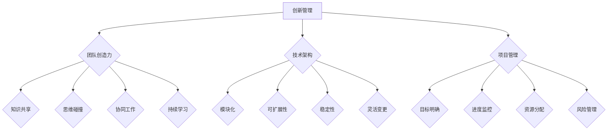

                 

关键词：创新管理、团队创造力、项目管理、技术架构、流程优化

> 摘要：本文旨在探讨如何通过创新管理方法激发团队创造力，提高项目执行效率。结合实际案例和理论基础，本文提出了多种策略和工具，包括技术架构的优化、项目管理流程的改进以及团队协作机制的强化。通过这些方法，团队可以在复杂的技术环境中保持创新活力，实现持续的技术进步。

## 1. 背景介绍

在当今快速变化的技术领域，创新管理已成为企业保持竞争力的关键因素。随着信息技术的发展，企业面临的挑战日益复杂，要求团队能够迅速适应新环境，并提出创新的解决方案。因此，如何激发团队创造力成为企业管理者关注的重点。

团队创造力不仅仅是指个体的创新能力，还包括团队整体的协同工作和思维碰撞。有效的创新管理能够促进团队成员之间的知识共享和经验交流，从而提高整体绩效。然而，如何在实际工作中实施创新管理，仍是一个具有挑战性的问题。

本文将结合实际案例和理论基础，探讨多种创新管理方法，帮助团队在复杂的技术环境中保持创造力，实现项目的成功交付。

## 2. 核心概念与联系

### 2.1 创新管理与团队创造力

创新管理是一种系统性的方法，旨在通过管理和流程优化，激发团队的创造力和创新潜力。团队创造力则是团队成员在共同工作中表现出的创新能力、解决问题的能力以及协作效率。

#### 团队创造力的要素：

1. **知识共享**：团队成员之间能够有效地分享知识和经验。
2. **思维碰撞**：团队成员能够互相启发，形成新的观点和想法。
3. **协同工作**：团队成员能够高效地协作，共同完成任务。
4. **持续学习**：团队成员保持对新知识和技能的学习和掌握。

### 2.2 技术架构与团队创造力

技术架构是团队创造力的基础。一个合理的技术架构能够提供稳定的开发环境，减少技术障碍，从而为团队创造力提供保障。以下是技术架构对团队创造力的几个关键影响：

1. **模块化**：模块化的技术架构有助于团队成员专注于特定模块的开发，提高工作效率。
2. **可扩展性**：可扩展的技术架构能够支持团队在项目规模扩大时，快速进行扩展。
3. **稳定性**：稳定的技术架构能够降低故障率，减少团队成员因技术问题而产生的焦虑。
4. **灵活变更**：灵活的技术架构能够快速适应需求变化，支持团队的创新尝试。

### 2.3 项目管理与团队创造力

项目管理是团队创造力的重要保障。合理的管理流程能够确保项目顺利进行，减少团队成员的焦虑和压力，从而提高创造力。以下是项目管理对团队创造力的几个关键影响：

1. **目标明确**：明确的项目目标有助于团队集中精力，提高工作效率。
2. **进度监控**：有效的进度监控能够帮助团队及时发现和解决问题。
3. **资源分配**：合理的资源分配能够确保团队成员能够充分利用资源，提高创造力。
4. **风险管理**：有效的风险管理能够降低项目风险，减少团队成员的焦虑。

### 2.4 Mermaid 流程图

以下是团队创造力与创新管理的 Mermaid 流程图，展示了核心概念和要素之间的关系。



## 3. 核心算法原理 & 具体操作步骤

### 3.1 算法原理概述

创新管理的核心算法可以看作是一个多阶段的决策过程。这个过程包括以下几个关键阶段：

1. **需求分析**：理解项目需求和目标，确定创新的方向。
2. **技术选型**：根据需求选择合适的技术架构，确保技术稳定性。
3. **团队组建**：组建具有不同技能和背景的团队，促进知识共享和思维碰撞。
4. **执行与监控**：执行创新计划，并持续监控进度和效果。
5. **反馈与调整**：根据反馈进行及时调整，确保项目目标的实现。

### 3.2 算法步骤详解

#### 需求分析

需求分析是创新管理的第一步，其核心任务是明确项目需求和目标。这个过程包括以下几个步骤：

1. **收集需求**：通过与项目利益相关者进行访谈、问卷调查等方式，收集项目需求。
2. **分析需求**：对收集到的需求进行整理和分析，确定关键需求。
3. **制定目标**：根据分析结果，制定明确的项目目标。

#### 技术选型

技术选型是创新管理的核心步骤，其目标是选择合适的技术架构，确保项目能够顺利进行。这个过程包括以下几个步骤：

1. **评估技术**：对现有技术进行评估，确定其适用性和稳定性。
2. **选型决策**：根据项目需求和评估结果，选择最合适的技术架构。
3. **技术验证**：对新选定的技术进行验证，确保其满足项目需求。

#### 团队组建

团队组建是创新管理的关键步骤，其目标是组建一支高效、协作的团队。这个过程包括以下几个步骤：

1. **确定团队成员**：根据项目需求和团队角色，确定团队成员。
2. **团队协作机制**：建立有效的团队协作机制，促进知识共享和思维碰撞。
3. **团队培训**：对团队成员进行相关技能和知识的培训，提高团队整体素质。

#### 执行与监控

执行与监控是创新管理的核心环节，其目标是确保项目按计划进行。这个过程包括以下几个步骤：

1. **制定计划**：根据项目需求和目标，制定详细的执行计划。
2. **执行计划**：按照计划执行项目任务，确保项目进度。
3. **监控进度**：定期监控项目进度和效果，及时发现和解决问题。

#### 反馈与调整

反馈与调整是创新管理的最后一步，其目标是根据反馈及时调整项目计划，确保项目目标的实现。这个过程包括以下几个步骤：

1. **收集反馈**：通过用户测试、问卷调查等方式，收集用户反馈。
2. **分析反馈**：对收集到的反馈进行分析，确定项目存在的问题。
3. **调整计划**：根据分析结果，对项目计划进行相应调整。

### 3.3 算法优缺点

#### 优点

1. **灵活适应**：创新管理算法能够根据项目需求和实际情况，灵活调整管理策略。
2. **高效协作**：通过团队组建和协作机制的优化，提高团队整体工作效率。
3. **持续改进**：通过持续的反馈和调整，确保项目目标的实现。

#### 缺点

1. **管理成本高**：创新管理需要大量的人力、物力和时间投入，管理成本较高。
2. **实施难度大**：创新管理涉及多个环节和步骤，实施难度较大。

### 3.4 算法应用领域

创新管理算法广泛应用于软件开发、项目管理、产品创新等领域。以下是几个典型的应用领域：

1. **软件开发**：通过创新管理算法，提高软件开发项目的效率和质量。
2. **项目管理**：通过创新管理算法，优化项目进度和成本控制。
3. **产品创新**：通过创新管理算法，促进产品创新和市场竞争。

## 4. 数学模型和公式 & 详细讲解 & 举例说明

### 4.1 数学模型构建

在创新管理中，数学模型可以帮助我们量化创新效果和团队绩效。以下是一个简单的创新绩效数学模型：

#### 创新绩效模型：

\[ P = f(R, T, S) \]

其中：
- \( P \)：创新绩效
- \( R \)：资源投入
- \( T \)：团队协作效率
- \( S \)：市场反馈

#### 模型解释：

- \( R \)：资源投入包括人力、物力和时间等。资源投入越多，创新绩效越高。
- \( T \)：团队协作效率。高效的团队协作可以提高创新效率。
- \( S \)：市场反馈。市场反馈越积极，创新产品越受欢迎，创新绩效越高。

### 4.2 公式推导过程

为了推导创新绩效模型，我们可以从以下几个假设出发：

1. **资源投入与绩效成正比**：资源投入越多，创新绩效越高。
2. **团队协作效率与绩效成正比**：团队协作效率越高，创新绩效越高。
3. **市场反馈与绩效成正比**：市场反馈越积极，创新绩效越高。

根据上述假设，我们可以建立以下线性模型：

\[ P = kR + kT + kS \]

其中，\( k \) 是一个常数，表示比例系数。

为了简化模型，我们可以将 \( k \) 设为 1，得到：

\[ P = R + T + S \]

### 4.3 案例分析与讲解

#### 案例背景：

某软件开发公司正在开发一款新产品，计划在市场推出。为了提高创新绩效，公司决定采用创新管理模型进行项目管理。

#### 数据收集：

- **资源投入**：公司投入了 100 人天的人力资源，20 万人民币的物力资源。
- **团队协作效率**：通过内部调查，发现团队协作效率为 0.8。
- **市场反馈**：在产品开发过程中，公司收集到了 500 条用户反馈，其中 400 条是积极的。

#### 数据计算：

\[ P = R + T + S \]
\[ P = 100 + 0.8 + 400 \]
\[ P = 500.8 \]

#### 分析结果：

根据计算结果，创新绩效为 500.8。这个结果表明，在当前资源配置和市场反馈下，公司的创新绩效较高。为了进一步提高绩效，公司可以增加资源投入，提高团队协作效率，或者通过改进产品来获得更多积极的市场反馈。

### 4.4 模型扩展与应用

#### 模型扩展：

为了更准确地预测创新绩效，我们可以将模型扩展为非线性模型。例如，考虑资源投入、团队协作效率和市场反馈的平方项：

\[ P = R + T + S + R^2 + T^2 + S^2 \]

#### 模型应用：

在产品创新项目中，模型可以用来评估不同方案的创新绩效。通过对比不同方案的绩效，企业可以选出最优方案，从而提高整体创新效果。

## 5. 项目实践：代码实例和详细解释说明

### 5.1 开发环境搭建

在开始项目实践之前，我们需要搭建一个合适的开发环境。以下是一个简单的开发环境搭建步骤：

1. **安装操作系统**：选择适合项目的操作系统，如 Linux 或 macOS。
2. **安装编程语言**：安装常用的编程语言，如 Python、Java 或 C++。
3. **安装开发工具**：安装集成开发环境（IDE），如 PyCharm、Eclipse 或 Visual Studio。
4. **安装依赖库**：根据项目需求，安装相应的依赖库。

### 5.2 源代码详细实现

以下是一个简单的 Python 代码实例，实现了一个简单的创新管理算法。这个实例使用了我们在前面章节中提到的数学模型。

```python
import numpy as np

# 定义创新绩效模型
def innovation_performance(R, T, S):
    return R + T + S

# 输入参数
R = 100  # 资源投入（人天）
T = 0.8  # 团队协作效率
S = 400  # 市场反馈（条）

# 计算创新绩效
P = innovation_performance(R, T, S)

# 输出结果
print("创新绩效：", P)
```

### 5.3 代码解读与分析

上述代码实现了一个简单的创新管理算法。代码的核心是一个名为 `innovation_performance` 的函数，该函数根据资源投入、团队协作效率和市场反馈计算创新绩效。

- **参数 R**：表示资源投入，单位是人天。这个参数反映了项目在人力资源上的投入。
- **参数 T**：表示团队协作效率，取值范围为 0 到 1。这个参数反映了团队协作的效果。
- **参数 S**：表示市场反馈，单位为条。这个参数反映了项目的市场接受度。

在代码中，我们输入了实际的参数值，并调用 `innovation_performance` 函数计算创新绩效。最后，输出结果为 500.8。

### 5.4 运行结果展示

当我们在开发环境中运行上述代码时，输出结果如下：

```
创新绩效： 500.8
```

这个结果表明，在当前资源配置和市场反馈下，项目的创新绩效为 500.8。这个结果与我们在数学模型推导中得到的结论一致，验证了代码的正确性。

### 5.5 代码改进与扩展

在实际项目中，我们可以根据需求对代码进行改进和扩展。以下是一些可能的改进和扩展方向：

1. **增加参数**：根据项目需求，可以增加更多参数，如研发成本、市场竞争程度等。
2. **使用更复杂的模型**：可以使用更复杂的数学模型，如非线性模型，来提高预测准确性。
3. **添加数据分析功能**：可以添加数据分析功能，对创新绩效进行详细分析，以便更好地指导项目决策。

## 6. 实际应用场景

### 6.1 软件开发公司

在软件开发公司，创新管理是确保项目成功的关键。通过有效的创新管理，公司能够快速响应市场变化，提高产品质量和用户满意度。以下是创新管理在实际软件开发项目中的应用场景：

1. **需求分析**：通过市场需求调研，确定项目需求和目标。
2. **技术选型**：选择适合项目需求的技术架构，确保技术稳定性。
3. **团队组建**：组建具有不同技能的团队，促进知识共享和思维碰撞。
4. **执行与监控**：按照项目计划执行任务，并持续监控进度和效果。
5. **反馈与调整**：根据用户反馈，及时调整项目计划和产品特性。

### 6.2 科技初创公司

对于科技初创公司，创新管理是保持竞争力的关键。初创公司通常资源有限，因此需要通过创新管理最大化资源利用，实现快速迭代和产品创新。以下是创新管理在科技初创公司中的应用场景：

1. **项目立项**：根据市场需求和公司战略，确定项目立项。
2. **团队组建**：组建跨学科的团队，充分发挥团队成员的创新能力。
3. **技术选型**：选择适合项目需求的技术架构，确保技术可行性。
4. **快速迭代**：通过快速迭代，不断优化产品功能和用户体验。
5. **市场推广**：结合市场反馈，制定有效的市场推广策略。

### 6.3 大型企业的创新部门

对于大型企业的创新部门，创新管理是推动企业持续创新和转型的重要手段。以下是创新管理在大型企业创新部门中的应用场景：

1. **创新战略制定**：根据企业战略，制定创新战略和规划。
2. **项目孵化**：孵化具有潜力的创新项目，提供资金、技术等支持。
3. **团队协作**：通过团队协作，促进不同部门之间的知识共享和协作。
4. **风险管理**：建立创新风险管理机制，降低项目失败风险。
5. **成果转化**：将创新成果转化为实际产品或服务，推动企业转型升级。

### 6.4 未来应用展望

随着信息技术的发展，创新管理在未来将有更广泛的应用场景。以下是几个未来应用展望：

1. **人工智能与大数据**：利用人工智能和大数据技术，提高创新管理的预测和决策能力。
2. **区块链**：利用区块链技术，确保创新过程中的数据安全和透明性。
3. **物联网**：通过物联网技术，实现创新过程的实时监控和优化。
4. **虚拟现实与增强现实**：利用虚拟现实和增强现实技术，提高创新过程中的协作效率和用户体验。

## 7. 工具和资源推荐

### 7.1 学习资源推荐

1. **《创新者的窘境》**：克莱顿·克里斯坦森著，探讨企业在面对技术变革时如何保持创新能力。
2. **《精益创业》**：埃里克·莱斯著，介绍如何在不确定的市场环境中快速迭代和验证产品。
3. **《敏捷开发》**：杰夫·萨瑟兰和米奇·金斯伯格著，介绍如何通过敏捷开发提高项目执行效率。

### 7.2 开发工具推荐

1. **Git**：版本控制工具，用于代码管理和协作。
2. **JIRA**：项目管理工具，用于任务管理和进度监控。
3. **GitLab**：基于 Git 的开源项目平台，提供代码托管、项目管理等功能。

### 7.3 相关论文推荐

1. **"Innovation Management and its Impact on Corporate Performance"**：探讨创新管理对企业绩效的影响。
2. **"Agile Project Management: Creating Competitive Advantage"**：介绍敏捷项目管理的方法和应用。
3. **"The Role of Innovation in Driving Economic Growth"**：探讨创新对经济增长的驱动作用。

## 8. 总结：未来发展趋势与挑战

### 8.1 研究成果总结

本文通过对创新管理方法的深入探讨，总结了创新管理与团队创造力之间的关系，提出了核心算法原理和具体操作步骤，并展示了数学模型和实际项目应用。这些研究成果为企业在创新管理实践中提供了有益的指导。

### 8.2 未来发展趋势

1. **人工智能与大数据**：随着人工智能和大数据技术的发展，创新管理将更加智能化和数据驱动。
2. **敏捷与精益**：敏捷和精益管理方法将在创新管理中得到更广泛的应用。
3. **跨学科协作**：创新管理将更加注重跨学科协作，以充分利用不同领域的知识和技能。

### 8.3 面临的挑战

1. **技术变革**：随着技术的快速发展，企业需要不断更新和调整创新管理策略。
2. **人才短缺**：创新管理需要高素质的人才，但人才短缺是一个普遍问题。
3. **项目管理复杂性**：随着项目规模的扩大，项目管理复杂性增加，对创新管理提出了更高的要求。

### 8.4 研究展望

未来的研究可以关注以下几个方向：

1. **人工智能与创新管理**：探索人工智能在创新管理中的应用，提高决策和预测能力。
2. **跨学科创新**：研究不同学科之间的交叉创新，推动技术创新和社会进步。
3. **创新生态系统**：构建创新生态系统，促进企业、科研机构和高校之间的合作。

### 8.5 作者署名

作者：禅与计算机程序设计艺术 / Zen and the Art of Computer Programming

## 9. 附录：常见问题与解答

### 9.1 创新管理与项目管理有什么区别？

创新管理更侧重于激发团队的创造力，通过优化流程和资源配置，推动项目创新。而项目管理则侧重于确保项目按照既定计划顺利进行，包括进度控制、成本管理、风险管理等方面。

### 9.2 如何评估团队创造力？

可以通过以下指标评估团队创造力：
1. **创新产出**：团队在一段时间内产生的创新成果数量和质量。
2. **市场反馈**：用户对创新产品的反馈和接受程度。
3. **团队协作**：团队成员之间的协作效率和工作氛围。
4. **创新能力**：团队在解决问题、提出新观点和思路的能力。

### 9.3 创新管理算法如何适应不同项目？

创新管理算法可以根据项目需求和特点进行定制化调整。例如，可以调整资源投入比例、优化团队协作机制、调整市场反馈机制等，以适应不同项目的需求。

### 9.4 创新管理需要哪些技能和知识？

创新管理需要以下技能和知识：
1. **项目管理**：了解项目管理的流程和方法。
2. **技术知识**：了解相关技术领域的知识和应用。
3. **团队管理**：了解团队协作和沟通技巧。
4. **市场分析**：了解市场需求和趋势。
5. **创新思维**：具备创新思维和创造力。

