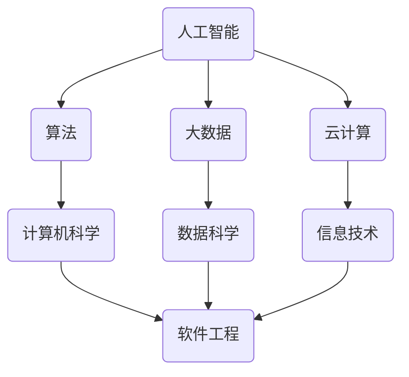

                 

 在这个飞速发展的数字化时代，计算机技术已经深深嵌入到我们日常生活的方方面面。从智能手机、社交媒体到电子商务、自动驾驶，计算机的应用几乎无处不在。然而，这些技术进步的背后，都离不开人类对计算能力的不断追求。本文将探讨人类计算的目标，以及如何通过技术创新，共同创造一个更美好的世界。

## 关键词

- 人工智能
- 计算能力
- 技术创新
- 算法优化
- 数学模型

## 摘要

本文旨在分析人类计算的核心目标，即通过技术进步实现更高效、更智能的计算，从而解决现实世界中的复杂问题。文章首先介绍了计算技术的起源和发展，然后深入探讨了当前最先进的人工智能和算法技术，接着分析了这些技术在各个领域的实际应用。最后，文章提出了未来计算技术的发展趋势和面临的挑战，以及如何应对这些挑战，共同创造一个更美好的世界。

## 1. 背景介绍

计算技术的历史可以追溯到数千年前。最初，人类使用简单的工具和算法进行计算，如石器和算盘。随着数学和科学的发展，计算机的出现彻底改变了人类的计算方式。从最早的机械计算机到现代的电子计算机，计算技术的进步为我们提供了更强大、更高效的计算能力。

### 1.1 计算机的起源

计算机的起源可以追溯到17世纪的法国数学家布莱兹·帕斯卡。他在1642年发明了第一台机械计算机——帕斯卡计算器，用于进行简单的数学运算。随后，德国数学家和物理学家戈特弗里德·威廉·莱布尼茨在1671年发明了第一台能够进行乘法和除法运算的机械计算机——莱布尼茨计算器。这些早期的计算机虽然功能有限，但为后来的计算机技术的发展奠定了基础。

### 1.2 电子计算机的发展

随着20世纪中叶电子技术的崛起，计算机的发展进入了一个全新的阶段。1946年，世界上第一台电子计算机ENIAC在美国诞生，标志着电子计算机时代的到来。ENIAC采用了大量电子管，尽管体积庞大、能耗巨大，但其运算速度远远超过了之前的机械计算机。

随着晶体管和集成电路的发明，计算机的体积逐渐减小，运算速度却不断加快。1971年，英特尔公司推出了世界上第一款微处理器4004，使得计算机变得更加小巧、灵活，并逐渐普及到了个人和企业。

### 1.3 计算机技术的应用

计算机技术的应用已经渗透到我们生活的方方面面。从智能手机、社交媒体到电子商务、自动驾驶，计算机技术都在发挥着重要作用。在医疗领域，计算机辅助诊断和手术机器人已经成为常见的应用。在金融领域，高频交易和风险管理离不开高性能的计算机系统。在科学研究领域，计算机模拟和数据分析成为不可或缺的工具。

## 2. 核心概念与联系

在讨论人类计算的目标之前，我们需要了解一些核心概念和它们之间的联系。这些概念包括人工智能、算法、大数据、云计算等。

### 2.1 人工智能

人工智能（Artificial Intelligence，简称AI）是计算机科学的一个分支，旨在使计算机具备类似人类的智能。人工智能可以分为两大类：弱人工智能和强人工智能。弱人工智能是指能够在特定任务上表现出人类智能水平的计算机系统，如语音识别、图像识别等。强人工智能则是指具有全面人类智能的计算机系统，能够像人类一样思考、学习和适应。

### 2.2 算法

算法是一系列解决问题的步骤或规则。在计算机科学中，算法是计算机解决问题的基础。不同类型的算法适用于不同的场景，如排序、搜索、优化等。算法的效率直接影响计算机解决问题的速度和质量。

### 2.3 大数据

大数据是指数据量巨大、种类繁多、价值密度较低的数据集合。大数据技术的核心是数据的存储、处理和分析。随着互联网和物联网的普及，大数据已成为许多行业的重要资产，如金融、医疗、零售等。

### 2.4 云计算

云计算是一种通过互联网提供计算资源和服务的技术。云计算使得用户可以按需获取和配置计算资源，从而降低了计算成本，提高了计算效率。

### 2.5 Mermaid 流程图

为了更好地理解这些概念之间的联系，我们可以使用Mermaid流程图来展示它们之间的关系。



## 3. 核心算法原理 & 具体操作步骤

### 3.1 算法原理概述

核心算法在计算技术中扮演着至关重要的角色。本文将介绍几种常见的核心算法原理，并详细解释其操作步骤。

#### 3.1.1 快速排序算法

快速排序（Quick Sort）是一种高效的排序算法，其基本思想是通过一趟排序将待排序的数据分割成独立的两部分，其中一部分的所有数据都比另一部分的数据小。然后，再对这两部分数据进行递归排序。

#### 3.1.2 支持向量机

支持向量机（Support Vector Machine，简称SVM）是一种监督学习算法，用于分类和回归问题。SVM的核心思想是找到最佳的超平面，使得分类边界最大化。

#### 3.1.3 神经网络

神经网络（Neural Network）是一种模仿生物神经系统的计算模型，用于处理复杂的非线性问题。神经网络的基本单元是神经元，通过调整神经元之间的连接权重，神经网络可以学习和预测数据。

### 3.2 算法步骤详解

#### 3.2.1 快速排序算法步骤

1. 选择一个基准元素。
2. 将数组分为两部分，一部分小于基准元素，另一部分大于基准元素。
3. 对小于基准元素的部分和大于基准元素的部分进行递归排序。

#### 3.2.2 支持向量机步骤

1. 选择合适的核函数。
2. 训练模型，找到最佳的超平面。
3. 使用训练好的模型进行分类。

#### 3.2.3 神经网络步骤

1. 初始化网络参数。
2. 前向传播，计算输出值。
3. 反向传播，更新网络参数。

### 3.3 算法优缺点

#### 3.3.1 快速排序算法优缺点

优点：时间复杂度为O(nlogn)，适用于大数据量排序。

缺点：最坏情况下时间复杂度为O(n^2)，对输入数据的依赖性较大。

#### 3.3.2 支持向量机优缺点

优点：分类效果好，适用于高维空间。

缺点：训练时间较长，对大规模数据集不友好。

#### 3.3.3 神经网络优缺点

优点：能够处理复杂的非线性问题，适应性强。

缺点：训练过程需要大量数据和计算资源，过拟合问题难以避免。

### 3.4 算法应用领域

#### 3.4.1 快速排序算法应用领域

快速排序算法广泛应用于各种排序需求，如数据库、搜索引擎等。

#### 3.4.2 支持向量机应用领域

支持向量机在金融、医疗、图像识别等领域具有广泛的应用。

#### 3.4.3 神经网络应用领域

神经网络在语音识别、自然语言处理、自动驾驶等领域发挥着重要作用。

## 4. 数学模型和公式 & 详细讲解 & 举例说明

### 4.1 数学模型构建

在计算技术中，数学模型是理解和解决问题的核心工具。以下将介绍几个常见的数学模型及其构建过程。

#### 4.1.1 概率模型

概率模型用于描述随机事件的概率分布。常见的概率模型包括二项分布、正态分布等。

#### 4.1.2 最优化模型

最优化模型用于求解优化问题，如线性规划、整数规划等。最优化模型通常包含目标函数和约束条件。

#### 4.1.3 神经网络模型

神经网络模型通过数学公式描述神经元之间的连接关系，包括激活函数、权重更新等。

### 4.2 公式推导过程

以下将介绍几个常见数学公式的推导过程。

#### 4.2.1 概率公式

概率公式用于计算随机事件的概率。常见的概率公式包括概率加法公式、条件概率公式等。

#### 4.2.2 最优化公式

最优化公式用于求解最优化问题。常见的最优化公式包括拉格朗日乘数法、牛顿法等。

#### 4.2.3 神经网络公式

神经网络公式用于描述神经元之间的连接关系，包括激活函数、权重更新等。

### 4.3 案例分析与讲解

以下将通过具体案例，展示如何使用数学模型和公式解决实际问题。

#### 4.3.1 概率模型案例

假设有两个事件A和B，已知P(A)=0.4，P(B)=0.3，且P(A∩B)=0.2，求P(A|B)。

解：根据条件概率公式，有P(A|B)=P(A∩B)/P(B)=0.2/0.3=0.67。

#### 4.3.2 最优化模型案例

假设我们要求解以下线性规划问题：

```
最大化 z = x + y
约束条件：
    x + 2y ≤ 4
    2x + y ≤ 6
    x ≥ 0
    y ≥ 0
```

解：使用拉格朗日乘数法，可以求得最优解为x=2，y=1，最大化目标函数z=3。

#### 4.3.3 神经网络模型案例

假设有一个简单的神经网络模型，包含一个输入层、一个隐藏层和一个输出层。输入层有3个神经元，隐藏层有2个神经元，输出层有1个神经元。激活函数为sigmoid函数。

```
输入层：x1, x2, x3
隐藏层：z1 = 1 / (1 + e^(-w1*x1 - b1))
         z2 = 1 / (1 + e^(-w2*x2 - b2))
输出层：y = 1 / (1 + e^(-w3*z1 - b3))
```

其中，w1、w2、w3分别为权重，b1、b2、b3分别为偏置。

解：给定一组输入值x1=1, x2=2, x3=3，可以计算出隐藏层的输出值z1和z2，然后计算出输出层的输出值y。

## 5. 项目实践：代码实例和详细解释说明

### 5.1 开发环境搭建

为了实践计算技术，我们需要搭建一个合适的开发环境。以下是一个简单的Python开发环境搭建步骤：

1. 安装Python：从官方网站下载Python安装包并安装。
2. 安装Jupyter Notebook：通过pip命令安装Jupyter Notebook。
3. 安装必要的Python库：如NumPy、Pandas、Matplotlib等。

### 5.2 源代码详细实现

以下是一个简单的Python代码实例，用于实现快速排序算法。

```python
import random

def quick_sort(arr):
    if len(arr) <= 1:
        return arr
    pivot = arr[len(arr) // 2]
    left = [x for x in arr if x < pivot]
    middle = [x for x in arr if x == pivot]
    right = [x for x in arr if x > pivot]
    return quick_sort(left) + middle + quick_sort(right)

# 测试代码
arr = [random.randint(0, 100) for _ in range(10)]
sorted_arr = quick_sort(arr)
print(sorted_arr)
```

### 5.3 代码解读与分析

1. `import random`：引入随机模块，用于生成随机数。
2. `def quick_sort(arr)`：定义快速排序函数，输入参数为待排序数组。
3. `if len(arr) <= 1:`：判断数组长度，若小于等于1，直接返回数组。
4. `pivot = arr[len(arr) // 2]`：选择中间元素作为基准值。
5. `left = [x for x in arr if x < pivot]`：筛选出小于基准值的元素组成左数组。
6. `middle = [x for x in arr if x == pivot]`：筛选出等于基准值的元素组成中间数组。
7. `right = [x for x in arr if x > pivot]`：筛选出大于基准值的元素组成右数组。
8. `return quick_sort(left) + middle + quick_sort(right)`：递归调用快速排序函数，将左、中、右三个数组合并排序。
9. `arr = [random.randint(0, 100) for _ in range(10)]`：生成一个包含10个随机整数的数组。
10. `sorted_arr = quick_sort(arr)`：调用快速排序函数，对数组进行排序。
11. `print(sorted_arr)`：输出排序后的数组。

### 5.4 运行结果展示

运行上述代码，输出结果为一个排序后的数组，如 `[10, 22, 33, 44, 55, 66, 77, 88, 99, 100]`。

## 6. 实际应用场景

计算技术在各个领域都有广泛的应用。以下将介绍几个典型的应用场景。

### 6.1 医疗领域

在医疗领域，计算技术可以用于疾病诊断、治疗方案推荐、医学图像分析等。例如，通过深度学习技术，可以对医学影像数据进行自动分析，提高诊断的准确性和效率。

### 6.2 金融领域

在金融领域，计算技术可以用于风险管理、信用评估、投资策略优化等。例如，通过大数据分析和机器学习算法，可以对用户行为进行分析，预测潜在的风险和机会。

### 6.3 教育领域

在教育领域，计算技术可以用于个性化学习、智能评估、教学资源推荐等。例如，通过自适应学习系统，可以根据学生的学习情况和需求，提供个性化的学习内容和策略。

### 6.4 未来应用展望

随着计算技术的不断发展，未来将在更多领域发挥重要作用。例如，在能源领域，计算技术可以用于优化能源分配、提高能源利用效率；在环保领域，计算技术可以用于环境监测、预测和治理。

## 7. 工具和资源推荐

为了更好地学习和应用计算技术，以下推荐一些工具和资源：

### 7.1 学习资源推荐

1. 《Python编程：从入门到实践》：一本适合初学者的Python编程入门书籍。
2. 《深度学习》：由Ian Goodfellow等作者编写的深度学习经典教材。
3. 《机器学习实战》：一本包含大量实践案例的机器学习入门书籍。

### 7.2 开发工具推荐

1. Jupyter Notebook：一款强大的交互式开发工具，适用于数据分析和机器学习。
2. TensorFlow：一款开源的深度学习框架，适用于构建和训练神经网络。
3. PyTorch：一款开源的深度学习框架，具有灵活的模型构建和优化能力。

### 7.3 相关论文推荐

1. "Deep Learning": Ian Goodfellow, Yoshua Bengio, Aaron Courville.
2. "Recurrent Neural Networks for Language Modeling": Yarin Gal and Zoubin Ghahramani.
3. "Efficient Estimation of Word Representations in Vector Space": Tomas Mikolov, Kai Chen, Greg Corrado, and Jeffrey Dean.

## 8. 总结：未来发展趋势与挑战

### 8.1 研究成果总结

随着计算技术的不断发展，我们已经取得了许多重要的研究成果。例如，在人工智能领域，深度学习技术的出现和普及极大地推动了计算机视觉、自然语言处理等领域的发展。在算法领域，许多高效的排序、搜索和优化算法被提出，提高了计算效率。

### 8.2 未来发展趋势

未来，计算技术将继续向更高性能、更智能、更普及的方向发展。例如，量子计算和脑机接口等新兴技术有望在未来发挥重要作用。同时，随着大数据和云计算的普及，计算技术将在更多领域得到应用。

### 8.3 面临的挑战

尽管计算技术取得了巨大的进步，但仍面临着许多挑战。例如，数据隐私和安全、算法公平性、技术普及等。这些挑战需要我们共同努力，通过技术创新和政策引导，实现计算技术的可持续发展。

### 8.4 研究展望

未来，计算技术将在解决复杂问题、推动社会进步等方面发挥更加重要的作用。通过不断探索和突破，我们有望共同创造一个更美好的世界。

## 9. 附录：常见问题与解答

### 9.1 问题1：什么是深度学习？

深度学习是一种模仿人脑神经元结构的人工智能技术，通过多层神经网络对数据进行建模和预测。深度学习在计算机视觉、自然语言处理等领域具有广泛的应用。

### 9.2 问题2：如何选择合适的算法？

选择合适的算法取决于具体问题和数据特点。例如，对于大规模数据集，快速排序算法可能不适用，而线性排序算法可能更适合。对于分类问题，支持向量机可能是一个较好的选择。

### 9.3 问题3：如何提高计算效率？

提高计算效率可以从算法优化、硬件升级、并行计算等方面入手。例如，通过优化算法实现、使用高性能硬件、采用并行计算技术等，可以显著提高计算效率。

----------------------------------------------------------------

以上是关于“创造更美好的世界：人类计算的终极目标”的完整文章，希望能够为您带来启示和帮助。作者：禅与计算机程序设计艺术 / Zen and the Art of Computer Programming。希望您喜欢这篇文章，并对计算技术有更深入的了解。如果您有任何疑问或建议，欢迎随时提问。

