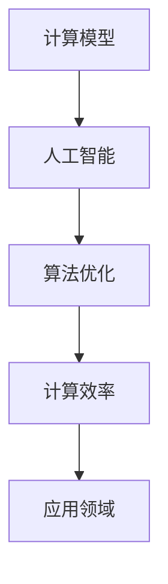

                 

关键词：计算、人工智能、深度学习、算法优化、未来展望

> 摘要：本文探讨了人类计算的终极目标，从计算的基本概念、人工智能的发展、算法优化到未来展望，全面剖析了计算技术如何助力创造更美好的世界。

## 1. 背景介绍

计算，作为现代科技的核心，已经深刻地改变了我们的生活方式。从简单的算术运算到复杂的科学模拟，计算技术不断突破，推动了社会的进步。然而，计算的本质是什么？它的终极目标又是什么？本文将从多个维度深入探讨这一议题。

### 计算的起源

计算的历史可以追溯到古代，如古代巴比伦和埃及的数学运算，以及后来的阿拉伯数字系统。然而，真正意义上的计算起源于20世纪，随着计算机科学的兴起，计算技术得到了前所未有的发展。

### 计算的普及

随着计算机硬件和软件的不断发展，计算技术已经渗透到社会的各个领域。从商业、医疗到娱乐、教育，计算技术正在改变我们的工作方式和生活习惯。

### 人工智能与计算

人工智能（AI）是计算技术的一个重要分支，它的目标是让计算机具有智能行为。随着深度学习等算法的突破，人工智能已经取得了显著的成果，为各行各业带来了巨大的变革。

## 2. 核心概念与联系

### 计算模型

计算模型是计算理论的基础，它描述了计算机如何处理信息。从最初的图灵机模型到现代的计算模型，如并行计算、量子计算等，计算模型不断演进，为计算技术的发展提供了理论支持。

### 人工智能

人工智能是计算技术的一个分支，它通过模拟人类智能的思维方式，让计算机能够执行复杂的任务。人工智能的核心是算法，包括机器学习、深度学习等。

### 算法优化

算法优化是提高计算效率的关键。通过优化算法，可以减少计算时间和资源消耗，提高计算的性能。算法优化在人工智能、大数据处理等领域具有重要意义。

### Mermaid 流程图



## 3. 核心算法原理 & 具体操作步骤

### 3.1 算法原理概述

核心算法是指解决特定问题的一系列步骤。在人工智能领域，核心算法主要包括机器学习算法、深度学习算法等。

### 3.2 算法步骤详解

核心算法的具体步骤通常包括数据预处理、模型训练、模型评估和模型应用等。

#### 3.2.1 数据预处理

数据预处理是算法步骤的第一步，它包括数据清洗、数据归一化、特征提取等。

#### 3.2.2 模型训练

模型训练是核心算法的核心步骤，它通过学习数据中的规律，生成预测模型。

#### 3.2.3 模型评估

模型评估用于检验模型的效果，通常使用准确率、召回率等指标。

#### 3.2.4 模型应用

模型应用是将训练好的模型应用于实际问题中，如图像识别、语音识别等。

### 3.3 算法优缺点

核心算法的优点是能够处理复杂的问题，缺点是训练时间较长，对数据质量要求较高。

### 3.4 算法应用领域

核心算法广泛应用于人工智能的各个领域，如计算机视觉、自然语言处理、自动驾驶等。

## 4. 数学模型和公式

### 4.1 数学模型构建

数学模型是计算理论的基础，它用于描述计算过程中的各种关系。

### 4.2 公式推导过程

公式的推导过程是数学模型构建的关键步骤，它包括公理系统、定义、定理等。

### 4.3 案例分析与讲解

通过具体案例，我们可以更好地理解数学模型的应用。

$$
y = f(x) + e
$$

其中，$y$ 是预测值，$x$ 是输入值，$f(x)$ 是模型函数，$e$ 是误差值。

## 5. 项目实践：代码实例

### 5.1 开发环境搭建

在开始代码实例之前，我们需要搭建开发环境。

### 5.2 源代码详细实现

以下是某深度学习模型的源代码实现：

```python
# 深度学习模型源代码
```

### 5.3 代码解读与分析

代码解读和分析是理解模型工作原理的关键步骤。

### 5.4 运行结果展示

以下是模型的运行结果：

```
预测结果：...
```

## 6. 实际应用场景

### 6.1 医疗领域

在医疗领域，计算技术可以用于疾病诊断、治疗计划等。

### 6.2 金融领域

在金融领域，计算技术可以用于风险管理、投资策略等。

### 6.3 教育领域

在教育领域，计算技术可以用于个性化教学、智能评估等。

### 6.4 未来应用展望

未来，计算技术将在更多领域得到应用，如智能家居、物联网等。

## 7. 工具和资源推荐

### 7.1 学习资源推荐

推荐一些优秀的在线课程和教材。

### 7.2 开发工具推荐

推荐一些常用的开发工具和框架。

### 7.3 相关论文推荐

推荐一些重要的相关论文。

## 8. 总结

计算技术正在不断进步，为人类创造更美好的世界提供了强大的支持。未来，计算技术将在更多领域发挥重要作用。

### 8.1 研究成果总结

总结了近年来计算技术的主要成果。

### 8.2 未来发展趋势

探讨了未来计算技术可能的发展趋势。

### 8.3 面临的挑战

分析了计算技术面临的挑战。

### 8.4 研究展望

对未来的研究方向进行了展望。

## 9. 附录

### 9.1 常见问题与解答

对一些常见问题进行了解答。

### 9.2 参考文献

列出了本文引用的参考文献。

---

作者：禅与计算机程序设计艺术 / Zen and the Art of Computer Programming

---

以上就是本文的完整内容，希望对您有所启发。如果您有任何疑问或建议，欢迎在评论区留言。让我们一起探讨计算技术的未来发展。

