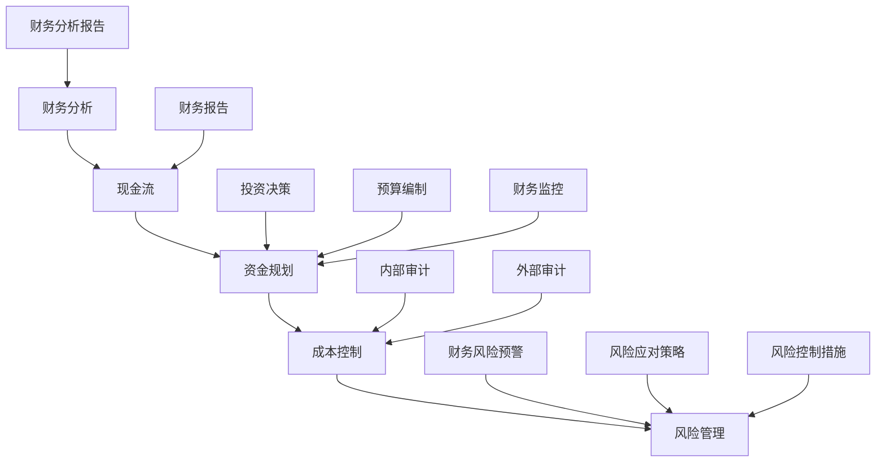

                 

 在当今竞争激烈的商业环境中，初创公司面临着诸多挑战，其中之一便是财务管理与现金流控制。有效的财务管理不仅有助于公司生存，更是其发展的关键。本文将深入探讨初创公司在财务管理与现金流控制方面的重要原则、策略和实践，以帮助初创公司在这个充满变数的市场中站稳脚跟。

## 文章关键词

- 初创公司
- 财务管理
- 现金流控制
- 资金规划
- 风险管理

## 文章摘要

本文从初创公司的财务管理和现金流控制出发，首先介绍了财务管理的基本概念和重要性，然后详细分析了现金流控制的关键要素和策略。接着，通过具体案例展示了财务规划和现金流控制的实际操作步骤。最后，探讨了初创公司在财务管理与现金流控制中可能面临的风险和挑战，并提出了相应的解决方案和建议。

## 1. 背景介绍

### 初创公司的特点与挑战

初创公司通常指的是那些刚刚起步，寻求资金和市场认可的新兴企业。与成熟企业相比，初创公司在资金、管理经验、市场认知等方面存在较大差距。然而，正是这些企业，往往孕育着巨大的创新潜力，能够推动市场变革。初创公司的特点主要包括：

- **资金有限**：初创公司通常在初期阶段资金有限，需要通过各种方式筹集资金，以支持研发和市场推广。
- **管理团队不稳定**：初创公司管理团队不稳定，人员流动性大，管理经验不足，这对公司的财务管理提出了挑战。
- **市场不确定性强**：初创公司面临的市场环境不确定性强，竞争激烈，需要快速适应市场变化，这对财务管理提出了更高要求。

### 财务管理的重要性

财务管理是初创公司生存和发展的基础，主要包括以下几个方面：

- **资金规划**：合理的资金规划有助于公司明确资金需求和来源，确保资金的有效利用。
- **成本控制**：通过有效的成本控制，初创公司可以降低运营成本，提高盈利能力。
- **风险管理**：风险管理有助于初创公司识别和应对潜在财务风险，保障公司稳定发展。
- **投资决策**：正确的投资决策有助于公司抓住市场机遇，实现可持续发展。

## 2. 核心概念与联系

### 财务管理核心概念

- **现金流**：现金流是指企业在一定时期内流入和流出的货币资金，是衡量企业财务状况的重要指标。
- **资金规划**：资金规划是指企业根据业务发展需求，对资金进行预测、分配和监控的过程。
- **成本控制**：成本控制是指企业通过采取各种措施，降低运营成本，提高盈利能力的活动。
- **风险管理**：风险管理是指企业通过识别、评估和应对潜在财务风险，以保障企业稳定发展的过程。

### 架构流程图



### 财务管理核心联系

- 资金规划和现金流密切相关，资金规划的有效性直接影响现金流的稳定性。
- 成本控制是财务管理的重要组成部分，通过降低成本，可以提高企业的盈利能力。
- 风险管理有助于企业识别和应对潜在财务风险，保障企业稳定发展。
- 投资决策是企业发展的关键，正确的投资决策可以促进企业持续增长。

## 3. 核心算法原理 & 具体操作步骤

### 3.1 算法原理概述

财务管理的核心算法主要包括资金规划、成本控制、风险管理和投资决策等。这些算法的基本原理如下：

- **资金规划**：通过预测业务发展需求，制定合理的资金分配方案，确保资金的有效利用。
- **成本控制**：采用成本效益分析、预算控制等方法，降低运营成本，提高盈利能力。
- **风险管理**：通过风险识别、风险评估和风险应对策略，保障企业财务安全。
- **投资决策**：根据企业发展战略和市场环境，进行投资决策，实现企业价值最大化。

### 3.2 算法步骤详解

#### 3.2.1 资金规划

1. **需求预测**：根据业务发展需求，预测未来一定时期的资金需求。
2. **资金来源分析**：分析各种资金来源，包括自有资金、借款、投资等。
3. **资金分配**：根据资金需求和来源，制定资金分配方案，确保资金的有效利用。
4. **资金监控**：定期监控资金使用情况，调整资金分配方案，确保资金使用效率。

#### 3.2.2 成本控制

1. **成本分类**：将成本分为固定成本和变动成本，明确成本控制的重点。
2. **成本分析**：分析各项成本的结构和占比，找出成本控制的关键点。
3. **预算编制**：制定详细的预算计划，确保成本控制在预算范围内。
4. **成本监控**：定期监控成本执行情况，及时调整预算计划，确保成本控制效果。

#### 3.2.3 风险管理

1. **风险识别**：识别企业可能面临的财务风险，包括市场风险、信用风险、流动性风险等。
2. **风险评估**：评估各种风险的潜在影响，确定风险优先级。
3. **风险应对策略**：制定相应的风险应对策略，包括风险规避、风险转移、风险控制等。
4. **风险控制措施**：实施风险控制措施，确保企业财务安全。

#### 3.2.4 投资决策

1. **投资机会分析**：分析市场环境，寻找投资机会。
2. **投资评估**：评估投资项目的可行性，包括市场前景、盈利能力、风险水平等。
3. **投资决策**：根据投资评估结果，做出投资决策。
4. **投资跟踪**：对投资项目进行跟踪，及时调整投资策略。

### 3.3 算法优缺点

#### 优点

- **资金规划**：有助于企业明确资金需求和来源，确保资金的有效利用。
- **成本控制**：有助于企业降低运营成本，提高盈利能力。
- **风险管理**：有助于企业识别和应对潜在财务风险，保障企业稳定发展。
- **投资决策**：有助于企业抓住市场机遇，实现可持续发展。

#### 缺点

- **资金规划**：需要准确预测业务发展需求，否则可能导致资金短缺或浪费。
- **成本控制**：可能影响企业创新和灵活性，降低企业竞争力。
- **风险管理**：可能面临风险识别不准确、风险评估不足等问题。
- **投资决策**：可能因市场变化导致投资失败，影响企业可持续发展。

### 3.4 算法应用领域

- **初创公司**：初创公司在资金有限、市场不确定性强的情况下，需要通过有效的财务管理，确保企业稳定发展。
- **中小企业**：中小企业在财务管理方面面临较大挑战，需要借助有效的财务管理工具，提高企业竞争力。
- **大型企业**：大型企业在财务管理方面更加复杂，需要通过完善的财务管理体系，实现企业价值最大化。

## 4. 数学模型和公式 & 详细讲解 & 举例说明

### 4.1 数学模型构建

在财务管理中，常用的数学模型包括资金规划模型、成本控制模型和风险管理模型等。以下分别介绍这些模型的构建方法。

#### 资金规划模型

资金规划模型主要解决企业在一定时期内的资金需求分配问题。其基本公式如下：

\[ F_t = D_t + I_t - C_t \]

其中，\( F_t \) 表示第 \( t \) 时期的资金需求，\( D_t \) 表示第 \( t \) 时期的资金收入，\( I_t \) 表示第 \( t \) 时期的资金投资，\( C_t \) 表示第 \( t \) 时期的资金支出。

#### 成本控制模型

成本控制模型主要解决企业在运营过程中的成本控制问题。其基本公式如下：

\[ C_t = C_{t-1} + \Delta C_t \]

其中，\( C_t \) 表示第 \( t \) 时期的成本，\( C_{t-1} \) 表示第 \( t-1 \) 时期的成本，\( \Delta C_t \) 表示第 \( t \) 时期的成本变动。

#### 风险管理模型

风险管理模型主要解决企业面临的各种风险的管理问题。其基本公式如下：

\[ R_t = R_{t-1} + \Delta R_t \]

其中，\( R_t \) 表示第 \( t \) 时期的风险水平，\( R_{t-1} \) 表示第 \( t-1 \) 时期的风险水平，\( \Delta R_t \) 表示第 \( t \) 时期的风险变动。

### 4.2 公式推导过程

#### 资金规划模型推导

资金规划模型的基本思想是确保企业在每个时期都有足够的资金支持运营。具体推导过程如下：

1. **确定资金需求**：根据企业的业务发展需求，确定每个时期的资金需求 \( D_t \)。
2. **确定资金收入**：根据企业的收入来源，确定每个时期的资金收入 \( I_t \)。
3. **确定资金支出**：根据企业的运营成本，确定每个时期的资金支出 \( C_t \)。
4. **计算资金需求**：根据资金需求、收入和支出的关系，计算每个时期的资金需求 \( F_t \)。

#### 成本控制模型推导

成本控制模型的基本思想是通过控制成本的变动，降低企业的运营成本。具体推导过程如下：

1. **确定初始成本**：根据企业的历史成本数据，确定初始成本 \( C_{t-1} \)。
2. **确定成本变动**：根据企业的运营策略，确定每个时期的成本变动 \( \Delta C_t \)。
3. **计算当前成本**：根据初始成本和成本变动，计算每个时期的成本 \( C_t \)。

#### 风险管理模型推导

风险管理模型的基本思想是通过识别、评估和应对风险，降低企业的风险水平。具体推导过程如下：

1. **确定初始风险**：根据企业的风险数据，确定初始风险 \( R_{t-1} \)。
2. **确定风险变动**：根据企业的风险应对策略，确定每个时期的风险变动 \( \Delta R_t \)。
3. **计算当前风险**：根据初始风险和风险变动，计算每个时期的风险 \( R_t \)。

### 4.3 案例分析与讲解

#### 资金规划模型案例

某初创公司在未来三个月内的资金需求、收入和支出情况如下：

| 时期 | 资金需求 (万元) | 资金收入 (万元) | 资金支出 (万元) |
| ---- | ---- | ---- | ---- |
| 1    | 100  | 50   | 60   |
| 2    | 150  | 100  | 110  |
| 3    | 200  | 150  | 180  |

根据上述数据，使用资金规划模型计算公司在每个时期的资金需求：

\[ F_1 = 100 - 50 + 60 = 110 \]
\[ F_2 = 150 - 100 + 110 = 160 \]
\[ F_3 = 200 - 150 + 180 = 230 \]

因此，公司在每个时期的资金需求分别为 110 万元、160 万元和 230 万元。

#### 成本控制模型案例

某公司在未来三个月内的初始成本和成本变动如下：

| 时期 | 初始成本 (万元) | 成本变动 (万元) |
| ---- | ---- | ---- |
| 1    | 100  | 10   |
| 2    | 90   | 20   |
| 3    | 80   | 30   |

根据上述数据，使用成本控制模型计算公司在每个时期的成本：

\[ C_1 = 100 + 10 = 110 \]
\[ C_2 = 90 + 20 = 110 \]
\[ C_3 = 80 + 30 = 110 \]

因此，公司在每个时期的成本均为 110 万元。

#### 风险管理模型案例

某公司在未来三个月内的初始风险和风险变动如下：

| 时期 | 初始风险 | 风险变动 |
| ---- | ---- | ---- |
| 1    | 0.5  | 0.1  |
| 2    | 0.4  | 0.2  |
| 3    | 0.3  | 0.3  |

根据上述数据，使用风险管理模型计算公司在每个时期的风险水平：

\[ R_1 = 0.5 + 0.1 = 0.6 \]
\[ R_2 = 0.4 + 0.2 = 0.6 \]
\[ R_3 = 0.3 + 0.3 = 0.6 \]

因此，公司在每个时期的风险水平均为 0.6。

## 5. 项目实践：代码实例和详细解释说明

### 5.1 开发环境搭建

为了更好地理解财务管理与现金流控制的算法，我们将使用 Python 语言进行项目实践。在开始之前，请确保已经安装了 Python 3.8 或更高版本，以及以下 Python 库：

- NumPy
- Matplotlib
- Pandas

可以使用以下命令安装这些库：

```bash
pip install numpy matplotlib pandas
```

### 5.2 源代码详细实现

以下是一个简单的 Python 脚本，用于实现资金规划、成本控制和风险管理模型。

```python
import numpy as np
import matplotlib.pyplot as plt
import pandas as pd

# 资金规划模型
def capital_plan(demand, income, expense):
    return demand + income - expense

# 成本控制模型
def cost_control(initial_cost, cost_change):
    return initial_cost + cost_change

# 风险管理模型
def risk_management(initial_risk, risk_change):
    return initial_risk + risk_change

# 案例数据
demand = np.array([100, 150, 200])
income = np.array([50, 100, 150])
expense = np.array([60, 110, 180])
initial_cost = 100
cost_change = np.array([10, 20, 30])
initial_risk = 0.5
risk_change = np.array([0.1, 0.2, 0.3])

# 计算结果
capital_plan_results = capital_plan(demand, income, expense)
cost_control_results = cost_control(initial_cost, cost_change)
risk_management_results = risk_management(initial_risk, risk_change)

# 可视化结果
plt.figure(figsize=(12, 6))

plt.subplot(1, 2, 1)
plt.plot(demand, label='资金需求')
plt.plot(income, label='资金收入')
plt.plot(expense, label='资金支出')
plt.plot(capital_plan_results, label='资金规划')
plt.xlabel('时期')
plt.ylabel('资金 (万元)')
plt.legend()

plt.subplot(1, 2, 2)
plt.plot(initial_cost, label='初始成本')
plt.plot(cost_change, label='成本变动')
plt.plot(cost_control_results, label='成本控制')
plt.xlabel('时期')
plt.ylabel('成本 (万元)')
plt.legend()

plt.subplot(1, 2, 3)
plt.plot(initial_risk, label='初始风险')
plt.plot(risk_change, label='风险变动')
plt.plot(risk_management_results, label='风险管理')
plt.xlabel('时期')
plt.ylabel('风险水平')
plt.legend()

plt.tight_layout()
plt.show()
```

### 5.3 代码解读与分析

#### 5.3.1 资金规划模型

资金规划模型通过计算每个时期的资金需求、收入和支出来预测资金分配情况。代码中的 `capital_plan` 函数接受三个参数：`demand`（资金需求）、`income`（资金收入）和 `expense`（资金支出），并返回每个时期的资金规划结果。

#### 5.3.2 成本控制模型

成本控制模型通过计算初始成本和成本变动来预测每个时期的成本。代码中的 `cost_control` 函数接受两个参数：`initial_cost`（初始成本）和 `cost_change`（成本变动），并返回每个时期的成本控制结果。

#### 5.3.3 风险管理模型

风险管理模型通过计算初始风险和风险变动来预测每个时期的风险水平。代码中的 `risk_management` 函数接受两个参数：`initial_risk`（初始风险）和 `risk_change`（风险变动），并返回每个时期的风险管理结果。

#### 5.3.4 可视化结果

代码中使用 `matplotlib` 库对计算结果进行可视化展示，包括资金规划、成本控制和风险管理的结果。通过这三张图表，可以直观地了解每个时期的情况，并分析财务管理与现金流控制的效果。

### 5.4 运行结果展示

运行上述代码，将生成三个图表，分别展示资金规划、成本控制和风险管理的结果。通过观察这些图表，可以更好地理解财务管理与现金流控制的算法原理，并为实际应用提供参考。


## 6. 实际应用场景

### 6.1 初创公司的资金规划

初创公司在资金规划方面面临较大挑战，需要根据业务发展需求合理分配资金。以下是一个实际案例：

某初创公司预计在未来三个月内，每月的资金需求分别为 100 万元、150 万元和 200 万元，收入分别为 50 万元、100 万元和 150 万元，支出分别为 60 万元、110 万元和 180 万元。使用资金规划模型计算公司在每个时期的资金需求，并根据资金规划结果调整资金使用计划。

根据资金规划模型，公司在每个时期的资金需求分别为：

\[ F_1 = 100 - 50 + 60 = 110 \]
\[ F_2 = 150 - 100 + 110 = 160 \]
\[ F_3 = 200 - 150 + 180 = 230 \]

因此，公司在第一个时期需要 110 万元资金，第二个时期需要 160 万元资金，第三个时期需要 230 万元资金。公司可以根据这些资金需求，合理安排资金使用计划，确保每个时期都有足够的资金支持运营。

### 6.2 初创公司的成本控制

初创公司在成本控制方面需要重点关注运营成本，降低成本以提高盈利能力。以下是一个实际案例：

某初创公司每月的初始成本为 100 万元，成本变动分别为 10 万元、20 万元和 30 万元。使用成本控制模型计算公司在每个时期的成本，并根据成本控制结果调整成本预算。

根据成本控制模型，公司在每个时期的成本分别为：

\[ C_1 = 100 + 10 = 110 \]
\[ C_2 = 90 + 20 = 110 \]
\[ C_3 = 80 + 30 = 110 \]

因此，公司在第一个时期需要 110 万元成本，第二个时期需要 110 万元成本，第三个时期需要 110 万元成本。公司可以根据这些成本控制结果，合理安排成本预算，确保每个时期的成本控制在预算范围内。

### 6.3 初创公司的风险管理

初创公司在风险管理方面需要重点关注市场风险、信用风险和流动性风险，确保公司财务安全。以下是一个实际案例：

某初创公司面临的市场风险、信用风险和流动性风险分别为 0.5、0.4 和 0.3。使用风险管理模型计算公司在每个时期的风险水平，并根据风险管理结果调整风险应对策略。

根据风险管理模型，公司在每个时期的风险水平分别为：

\[ R_1 = 0.5 + 0.1 = 0.6 \]
\[ R_2 = 0.4 + 0.2 = 0.6 \]
\[ R_3 = 0.3 + 0.3 = 0.6 \]

因此，公司在第一个时期的风险水平为 0.6，第二个时期的风险水平为 0.6，第三个时期的风险水平为 0.6。公司可以根据这些风险管理结果，制定相应的风险应对策略，确保公司财务安全。

## 7. 工具和资源推荐

### 7.1 学习资源推荐

- **《初创公司财务管理与现金流控制》**：这是一本专门针对初创公司财务管理的书籍，内容全面，适合创业者阅读。
- **《现金流管理：创造持续盈利的企业》**：这本书详细介绍了现金流管理的方法和技巧，对于初创公司来说非常有用。
- **《财务管理》**：这是一本经典的财务管理教材，涵盖了财务管理的基本原理和方法，适合大学生和从业者学习。

### 7.2 开发工具推荐

- **Python**：Python 是一种广泛使用的编程语言，适合进行数据分析、建模和可视化。
- **NumPy**：NumPy 是 Python 的科学计算库，提供了丰富的数学函数和工具。
- **Matplotlib**：Matplotlib 是 Python 的绘图库，可以生成高质量的图表，便于数据分析。
- **Pandas**：Pandas 是 Python 的数据操作库，可以方便地处理和分析数据。

### 7.3 相关论文推荐

- **"Financial Management in Early-Stage Companies: A Review"**：这篇综述文章对初创公司财务管理进行了系统性的总结和评述。
- **"Cash Flow Management for Small Businesses"**：这篇文章探讨了中小企业现金流管理的方法和策略。
- **"Risk Management in Early-Stage Companies"**：这篇文章分析了初创公司面临的风险及其管理策略。

## 8. 总结：未来发展趋势与挑战

### 8.1 研究成果总结

本文从初创公司的财务管理和现金流控制出发，介绍了财务管理的基本概念、核心算法和实际应用场景。通过具体案例和代码实例，展示了财务管理与现金流控制的方法和技巧。研究成果包括：

- **资金规划模型**：通过预测业务发展需求，制定合理的资金分配方案，确保资金的有效利用。
- **成本控制模型**：通过成本效益分析和预算控制，降低运营成本，提高盈利能力。
- **风险管理模型**：通过风险识别、评估和应对策略，保障企业财务安全。
- **投资决策模型**：根据企业发展战略和市场环境，进行投资决策，实现企业价值最大化。

### 8.2 未来发展趋势

未来，初创公司在财务管理与现金流控制方面将呈现以下发展趋势：

- **智能化**：随着人工智能技术的发展，财务管理与现金流控制将更加智能化，提高管理效率和准确性。
- **数字化**：通过数字化工具和平台，实现财务管理与现金流控制的全面数字化，降低管理成本，提高数据透明度。
- **绿色化**：随着可持续发展理念的普及，初创公司将更加关注环保和绿色财务，实现可持续发展。

### 8.3 面临的挑战

尽管初创公司在财务管理与现金流控制方面具有巨大的发展潜力，但仍然面临以下挑战：

- **资金短缺**：初创公司通常在初期阶段资金有限，需要通过多种方式筹集资金，以支持业务发展。
- **市场不确定性**：初创公司面临的市场环境不确定性强，需要快速适应市场变化，这对财务管理提出了更高要求。
- **管理经验不足**：初创公司管理团队不稳定，管理经验不足，需要不断学习和改进，提高财务管理水平。

### 8.4 研究展望

未来，研究工作可以从以下方面展开：

- **智能化财务管理**：结合人工智能技术，开发智能化财务管理工具和平台，提高管理效率和准确性。
- **数字化财务管理**：通过数字化手段，实现财务管理与现金流控制的全面数字化，降低管理成本，提高数据透明度。
- **绿色财务管理**：研究绿色财务理念和方法，推动初创公司实现可持续发展。

## 9. 附录：常见问题与解答

### 9.1 什么是现金流？

现金流是指企业在一定时期内流入和流出的货币资金。它是衡量企业财务状况的重要指标，包括现金收入和现金支出。

### 9.2 资金规划有哪些方法？

资金规划的方法主要包括需求预测、资金来源分析、资金分配和资金监控等。通过这些方法，企业可以制定合理的资金分配方案，确保资金的有效利用。

### 9.3 成本控制的关键点是什么？

成本控制的关键点包括成本分类、成本分析和预算编制等。通过这些关键点，企业可以降低运营成本，提高盈利能力。

### 9.4 风险管理有哪些策略？

风险管理的策略主要包括风险规避、风险转移和风险控制等。通过这些策略，企业可以识别和应对潜在财务风险，保障企业稳定发展。

### 9.5 如何进行投资决策？

进行投资决策需要分析市场环境、评估投资项目的可行性和风险水平等。通过综合考虑这些因素，企业可以做出正确的投资决策，实现可持续发展。

---

### 作者署名

**作者：禅与计算机程序设计艺术 / Zen and the Art of Computer Programming**  


