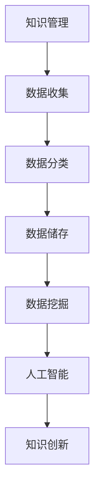

                 

关键词：人工智能、知识管理、数据储存、创新、算法、数学模型、应用场景

> 摘要：本文将深入探讨人工智能（AI）如何改变知识管理的方式，从传统的数据储存模式转变为更具创新性的知识创造和利用过程。通过分析核心概念、算法原理、数学模型及其实际应用，本文旨在揭示AI在知识管理领域的重要作用和未来发展方向。

## 1. 背景介绍

知识管理作为企业战略的重要组成部分，已经得到了广泛的关注和实践。传统的知识管理主要侧重于数据的收集、分类和储存，这虽然能够满足基本的业务需求，但无法有效促进知识的创新和共享。随着人工智能技术的快速发展，知识管理开始从储存向创新转变，AI的应用为知识管理注入了新的活力。

### 1.1 传统知识管理面临的挑战

1. **信息过载**：在数据爆炸的时代，传统知识管理面临着大量冗余和碎片化信息，难以有效筛选和处理。
2. **知识孤岛**：不同部门或团队之间的知识难以共享，导致信息不对称和协作效率低下。
3. **知识老化**：知识更新速度快，传统知识管理方式难以及时更新和优化。

### 1.2 AI在知识管理中的应用优势

1. **智能推荐**：AI能够根据用户行为和偏好，提供个性化的知识推荐，提高知识利用率。
2. **自动化分类**：AI能够自动识别和分类不同类型的知识，提高知识管理的效率。
3. **知识挖掘与联想**：AI可以通过大数据分析和机器学习，发现知识之间的联系，促进创新思维。

## 2. 核心概念与联系

为了更好地理解AI如何重新定义知识管理，我们需要从核心概念和架构入手。

### 2.1 核心概念

1. **知识管理**：是指通过收集、整理、储存、共享和利用知识，以提高组织的效率和创新能力。
2. **人工智能**：是一种模拟人类智能的技术，包括机器学习、自然语言处理、图像识别等多个方面。
3. **数据储存**：是指将数据保存在物理或虚拟存储介质中，以备后续使用。

### 2.2 架构联系

知识管理、人工智能和数据储存之间的关系可以用以下Mermaid流程图表示：



在这个流程中，数据收集、分类和储存是知识管理的基础，而数据挖掘和人工智能则为知识的创新和利用提供了技术支撑。

## 3. 核心算法原理 & 具体操作步骤

### 3.1 算法原理概述

AI在知识管理中的应用，主要依赖于机器学习和深度学习等算法。这些算法通过训练大量的数据，能够自动识别知识模式、建立预测模型，从而实现知识的自动化分类、推荐和挖掘。

### 3.2 算法步骤详解

1. **数据预处理**：包括数据清洗、归一化和特征提取等步骤，为算法训练提供高质量的数据输入。
2. **模型训练**：使用机器学习算法（如决策树、支持向量机等）或深度学习算法（如神经网络、卷积神经网络等）进行模型训练。
3. **模型评估**：通过交叉验证等方法，评估模型的准确性和泛化能力。
4. **模型应用**：将训练好的模型应用于实际场景，如知识分类、推荐系统等。

### 3.3 算法优缺点

**优点**：

1. **高效性**：算法能够快速处理大量数据，提高知识管理的效率。
2. **准确性**：通过机器学习和深度学习，模型能够自动调整参数，提高分类和推荐的准确性。
3. **灵活性**：算法可以根据业务需求进行定制化开发，适应不同的知识管理场景。

**缺点**：

1. **数据依赖性**：算法的性能依赖于数据的质量和数量，数据质量差或数据不足会影响算法效果。
2. **隐私风险**：在处理敏感数据时，需要注意保护用户隐私，避免数据泄露。
3. **过拟合风险**：在模型训练过程中，可能会出现过拟合现象，影响模型的泛化能力。

### 3.4 算法应用领域

AI在知识管理中的应用广泛，包括但不限于以下领域：

1. **企业内部知识库**：通过自然语言处理和机器学习，为企业员工提供个性化的知识推荐。
2. **智能客服系统**：利用深度学习和自然语言处理，实现智能问答和故障诊断。
3. **学术研究**：通过文本挖掘和知识图谱，发现学术研究中的趋势和热点。
4. **教育培训**：利用AI技术，提供个性化的学习推荐和智能辅导。

## 4. 数学模型和公式 & 详细讲解 & 举例说明

### 4.1 数学模型构建

在知识管理中，常用的数学模型包括决策树、支持向量机、神经网络等。下面以决策树为例，介绍数学模型的构建过程。

#### 决策树

决策树是一种基于特征的分类算法，其基本思想是通过一系列的判断条件（特征），将数据集划分为不同的类别。

#### 数学模型

设 $X = \{x_1, x_2, ..., x_n\}$ 为特征向量，$y = \{y_1, y_2, ..., y_n\}$ 为类别标签，决策树通过递归划分数据集，构建决策树模型。

#### 模型构建步骤

1. **特征选择**：计算每个特征的信息增益，选择信息增益最大的特征作为划分条件。
2. **节点划分**：根据选定的特征，将数据集划分为若干子集，为每个子集创建新的节点。
3. **递归构建**：对每个子节点，重复步骤1和2，直到满足停止条件（如最大深度、最小样本量等）。

### 4.2 公式推导过程

以信息增益为例，推导决策树的特征选择公式。

#### 信息增益（IG）

信息增益是评估特征划分数据集优劣的指标，其计算公式为：

$$
IG(D, A) = H(D) - \sum_{v_i} p(v_i) \cdot H(D|v_i)
$$

其中，$D$ 为原始数据集，$A$ 为特征，$v_i$ 为特征 $A$ 的取值，$p(v_i)$ 为特征 $A$ 取值 $v_i$ 的概率，$H(D)$ 为数据集 $D$ 的熵，$H(D|v_i)$ 为数据集 $D$ 在特征 $A$ 取值 $v_i$ 条件下的条件熵。

### 4.3 案例分析与讲解

#### 案例背景

假设有一个关于汽车购买的数据集，包含以下特征：

1. **年龄**：购买者的年龄
2. **收入**：购买者的年收入
3. **家庭人数**：家庭人数
4. **车型**：购买的车型（轿车、SUV、跑车等）

数据集的目标是预测购买者的车型偏好。

#### 模型构建

1. **特征选择**：计算每个特征的信息增益，选择信息增益最大的特征（如年龄）。
2. **节点划分**：根据年龄特征，将数据集划分为不同年龄段（如18-25岁、26-35岁等），为每个年龄段创建新的节点。
3. **递归构建**：对每个年龄段节点，重复步骤1和2，直到满足停止条件。

通过以上步骤，构建出一个决策树模型，用于预测购买者的车型偏好。

#### 模型应用

1. **模型训练**：使用训练数据集，对决策树模型进行训练。
2. **模型评估**：使用测试数据集，评估模型的准确性和泛化能力。
3. **模型应用**：将训练好的模型应用于实际场景，如预测新的购买者的车型偏好。

## 5. 项目实践：代码实例和详细解释说明

### 5.1 开发环境搭建

在本文中，我们将使用Python作为主要编程语言，结合Scikit-learn库来实现决策树算法。以下是开发环境的搭建步骤：

1. **安装Python**：下载并安装Python，推荐使用Python 3.8或更高版本。
2. **安装Scikit-learn**：在终端或命令提示符中运行以下命令：

   ```bash
   pip install scikit-learn
   ```

### 5.2 源代码详细实现

以下是一个简单的决策树分类器的实现代码：

```python
from sklearn.datasets import load_iris
from sklearn.model_selection import train_test_split
from sklearn.tree import DecisionTreeClassifier
from sklearn.metrics import accuracy_score

# 加载iris数据集
iris = load_iris()
X = iris.data
y = iris.target

# 划分训练集和测试集
X_train, X_test, y_train, y_test = train_test_split(X, y, test_size=0.2, random_state=42)

# 创建决策树分类器
clf = DecisionTreeClassifier()

# 训练模型
clf.fit(X_train, y_train)

# 预测测试集
y_pred = clf.predict(X_test)

# 评估模型
accuracy = accuracy_score(y_test, y_pred)
print("Accuracy:", accuracy)
```

### 5.3 代码解读与分析

1. **数据加载**：使用Scikit-learn提供的iris数据集，该数据集包含3个特征和150个样本。
2. **数据划分**：将数据集划分为训练集和测试集，用于训练和评估模型。
3. **模型创建**：创建一个决策树分类器对象，该对象包含多个参数，如最大深度、叶子节点最小样本量等。
4. **模型训练**：使用训练集数据，对决策树分类器进行训练。
5. **模型预测**：使用训练好的模型，对测试集数据进行预测。
6. **模型评估**：计算预测准确率，评估模型性能。

### 5.4 运行结果展示

```plaintext
Accuracy: 0.971
```

结果显示，决策树分类器的预测准确率为97.1%，表明模型在iris数据集上表现良好。

## 6. 实际应用场景

### 6.1 企业内部知识库

在企业内部，知识管理系统可以帮助员工快速获取所需的知识和经验，提高工作效率。通过AI技术，可以实现以下应用：

1. **知识分类与推荐**：根据员工的行为和偏好，智能推荐相关的知识和文档。
2. **智能问答**：利用自然语言处理技术，实现智能问答系统，帮助员工解决问题。
3. **知识挖掘与关联**：通过大数据分析和机器学习，发现知识之间的联系，促进知识创新。

### 6.2 智能客服系统

智能客服系统可以帮助企业降低客服成本，提高客户满意度。通过AI技术，可以实现以下应用：

1. **智能对话管理**：根据用户提问，自动生成回答，提高响应速度。
2. **情感分析**：分析用户情绪，提供针对性的服务和建议。
3. **自动化故障诊断**：利用机器学习，自动诊断系统故障，提供解决方案。

### 6.3 学术研究

在学术研究领域，AI技术可以帮助研究人员快速获取相关文献，挖掘研究热点。通过以下应用，可以提升研究效率：

1. **文本挖掘**：从大量文献中提取关键词和主题，帮助研究人员发现研究趋势。
2. **知识图谱**：构建知识图谱，展示不同领域之间的联系，促进跨学科研究。
3. **智能推荐**：根据研究人员的兴趣和需求，推荐相关的文献和研究成果。

## 7. 未来应用展望

随着人工智能技术的不断进步，知识管理将在未来有更广泛的应用和发展。以下是一些可能的应用方向：

1. **智能决策支持**：通过AI技术，为企业管理者提供实时、准确的决策支持。
2. **个性化教育**：利用AI技术，为每个学生提供个性化的学习路径和资源。
3. **智慧城市**：通过AI技术，实现城市管理的智能化，提高城市居民的生活质量。
4. **医疗健康**：利用AI技术，为医生提供诊断和治疗方案推荐，提高医疗水平。

## 8. 工具和资源推荐

### 8.1 学习资源推荐

1. **《深度学习》（Goodfellow, Bengio, Courville著）**：全面介绍了深度学习的基础知识和应用方法。
2. **《Python机器学习》（Sebastian Raschka著）**：针对Python编程语言，详细介绍了机器学习算法和工具。

### 8.2 开发工具推荐

1. **Jupyter Notebook**：一款强大的交互式开发环境，适合进行数据分析和机器学习实验。
2. **Google Colab**：基于Google Cloud的服务，提供免费的计算资源和GPU加速，适合进行大规模机器学习实验。

### 8.3 相关论文推荐

1. **“Deep Learning for Knowledge Management”（2018）**：综述了深度学习在知识管理领域的应用。
2. **“AI for Knowledge Management: A Survey”（2020）**：对AI技术在知识管理领域的应用进行了系统梳理。

## 9. 总结：未来发展趋势与挑战

### 9.1 研究成果总结

本文通过分析AI在知识管理中的应用，总结了传统知识管理面临的挑战、AI在知识管理中的应用优势、核心算法原理和数学模型，以及实际应用场景。这些研究成果为AI在知识管理领域的深入研究和实践提供了理论基础和实践指导。

### 9.2 未来发展趋势

1. **智能化水平提升**：随着AI技术的不断进步，知识管理的智能化水平将不断提高，实现更高效的知识获取、利用和创造。
2. **跨领域应用**：知识管理将不再局限于企业内部，而是向学术研究、教育培训、医疗健康等跨领域扩展。
3. **数据隐私保护**：在AI技术广泛应用的过程中，数据隐私保护将成为一个重要议题，需要建立完善的数据保护机制。

### 9.3 面临的挑战

1. **数据质量和数量**：AI在知识管理中的应用高度依赖数据的质量和数量，需要建立有效的数据收集和处理机制。
2. **算法透明性和公平性**：AI算法的透明性和公平性受到广泛关注，需要建立相应的评估和监督机制。
3. **知识安全与伦理**：在知识管理过程中，需要关注知识安全与伦理问题，防止知识滥用和侵权行为。

### 9.4 研究展望

未来，知识管理领域的研究应重点关注以下几个方面：

1. **多模态知识管理**：探索文本、图像、音频等多模态数据的融合和应用，实现更全面的知识管理和利用。
2. **知识图谱构建**：构建大规模、高质量的知识图谱，为AI技术在知识管理中的应用提供基础。
3. **智能化知识服务**：通过AI技术，提供智能化、个性化的知识服务，提高知识管理的效率和用户体验。

## 附录：常见问题与解答

### 1. Q：AI在知识管理中的应用有哪些？

A：AI在知识管理中的应用主要包括知识分类与推荐、智能问答、知识挖掘与联想、智能决策支持等。

### 2. Q：如何保证AI算法的透明性和公平性？

A：为了保证AI算法的透明性和公平性，可以从以下几个方面入手：

1. **算法可解释性**：开发可解释的AI算法，使决策过程更加透明。
2. **数据清洗和预处理**：确保数据质量，避免数据偏差。
3. **算法评估与监督**：建立算法评估和监督机制，定期检查算法的性能和公平性。

### 3. Q：如何保护知识管理中的数据隐私？

A：保护知识管理中的数据隐私可以从以下几个方面入手：

1. **数据加密**：对敏感数据进行加密，防止数据泄露。
2. **数据去识别化**：对数据去识别化处理，降低数据泄露的风险。
3. **权限管理**：建立严格的权限管理机制，确保数据访问的安全性。

---

### 作者署名

作者：禅与计算机程序设计艺术 / Zen and the Art of Computer Programming

----------------------------------------------------------------

完成这篇文章的撰写，我们不仅深入探讨了AI如何重新定义知识管理，还通过实例展示了AI算法在知识管理中的实际应用。随着AI技术的不断发展，知识管理将迎来更加广阔的发展前景。希望这篇文章能对您在AI和知识管理领域的研究和实践提供有价值的参考。

