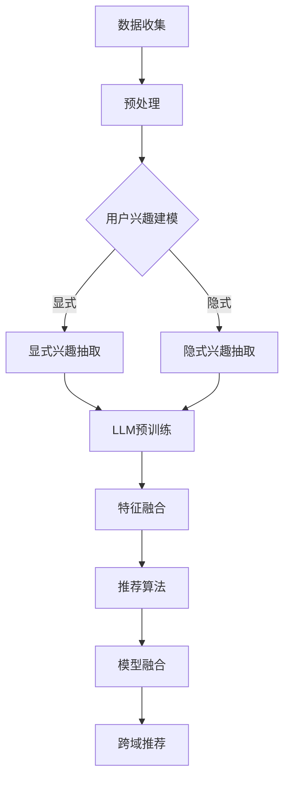

                 

关键词：语言模型（LLM），推荐系统，跨域推荐，协同过滤，深度学习，用户兴趣，数据融合

## 摘要

本文探讨了如何利用先进的语言模型（LLM）技术提升推荐系统的跨域推荐能力。随着互联网和大数据的发展，用户在多个领域中产生的内容和需求越来越丰富，如何实现不同领域间的有效推荐成为推荐系统领域的一大挑战。本文首先回顾了推荐系统的发展历程，接着详细介绍了LLM的工作原理和应用场景，最后通过具体案例，展示了如何利用LLM实现跨域推荐，并探讨了其在实际应用中的优势和面临的挑战。

## 1. 背景介绍

推荐系统是信息检索和推荐系统领域的重要研究方向，其目的是为用户提供个性化的推荐服务，帮助用户发现他们可能感兴趣的内容。从最初的基于协同过滤的方法，到后来的基于内容的推荐，再到基于模型的推荐，推荐系统在不断发展与完善。

### 1.1 推荐系统的发展历程

- **协同过滤（Collaborative Filtering）**：基于用户的历史行为和相似度计算，通过挖掘用户之间的相似性来实现推荐。协同过滤分为基于用户的协同过滤（User-based）和基于项目的协同过滤（Item-based）。

- **基于内容的推荐（Content-based Filtering）**：通过分析内容和用户兴趣，为用户提供与用户历史行为相似的推荐。

- **混合推荐系统（Hybrid Recommender Systems）**：结合协同过滤和基于内容的推荐方法，以期望提高推荐系统的准确性和覆盖度。

### 1.2 跨域推荐面临的挑战

随着互联网的发展，用户的需求和兴趣越来越多样化，推荐系统不仅要处理单一领域的数据，还需要处理跨领域的数据。跨域推荐面临以下挑战：

- **数据稀疏性**：跨领域数据往往比单一领域的数据稀疏，导致推荐效果不佳。

- **数据不一致性**：不同领域的数据格式和维度可能不一致，增加数据处理的复杂性。

- **领域迁移困难**：用户在一个领域中的兴趣可能无法直接迁移到另一个领域。

## 2. 核心概念与联系

为了提升推荐系统的跨域推荐能力，本文引入了先进的语言模型（LLM）技术。LLM是一种基于深度学习的自然语言处理模型，具有强大的语义理解和生成能力。以下是LLM的核心概念与推荐系统的联系：

### 2.1 语言模型（LLM）的工作原理

- **自动编码器（Autoencoder）**：自动编码器是一种无监督学习模型，用于学习输入数据的低维表示。

- **编码器（Encoder）与解码器（Decoder）**：编码器将输入数据映射到低维空间，解码器将编码后的数据映射回原始数据。

- **预训练与微调（Pre-training and Fine-tuning）**：LLM首先在大量无标注的数据上进行预训练，然后利用领域特定数据进行微调，以适应特定任务。

### 2.2 LLM在推荐系统中的应用

- **用户兴趣建模**：LLM可以用于提取用户的隐式和显式兴趣，从而构建更准确的用户兴趣模型。

- **内容理解与生成**：LLM可以理解用户评论、标题等文本信息，并将其转换为推荐系统的特征输入。

- **跨域迁移学习**：LLM具有强大的跨域迁移能力，可以在不同领域的数据上进行训练和预测。

### 2.3 LLM与推荐系统的整合

- **特征融合**：将LLM生成的用户兴趣特征与原始推荐系统的特征进行融合，提高推荐系统的多样性。

- **模型融合**：将LLM与协同过滤、基于内容的推荐等方法进行整合，实现跨域推荐。

### 2.4 Mermaid流程图

以下是LLM在推荐系统中应用的Mermaid流程图：



## 3. 核心算法原理 & 具体操作步骤

### 3.1 算法原理概述

利用LLM提升推荐系统的跨域推荐能力，主要分为以下三个步骤：

1. **用户兴趣建模**：通过LLM提取用户的显式和隐式兴趣。

2. **特征融合**：将LLM生成的用户兴趣特征与原始推荐系统的特征进行融合。

3. **跨域推荐**：基于融合后的特征，利用推荐算法生成跨域推荐结果。

### 3.2 算法步骤详解

#### 步骤1：用户兴趣建模

1. **显式兴趣抽取**：
    - 收集用户的历史行为数据（如点击、购买、收藏等）。
    - 使用LLM对用户行为数据进行编码，提取用户的显式兴趣特征。

2. **隐式兴趣抽取**：
    - 收集用户生成的文本数据（如评论、帖子等）。
    - 使用LLM对文本数据进行编码，提取用户的隐式兴趣特征。

#### 步骤2：特征融合

1. **特征表示**：
    - 对原始推荐系统的特征（如用户-项目评分矩阵）进行编码，生成低维特征向量。

2. **融合策略**：
    - 将LLM提取的用户兴趣特征与原始推荐系统的特征进行加权融合。

#### 步骤3：跨域推荐

1. **推荐算法**：
    - 利用融合后的特征，采用协同过滤、基于内容的推荐等方法生成推荐结果。

2. **模型融合**：
    - 将不同算法生成的推荐结果进行融合，以实现更好的推荐效果。

### 3.3 算法优缺点

#### 优点

- **跨域迁移能力**：LLM具有强大的跨域迁移能力，可以处理不同领域的数据。

- **用户兴趣建模**：LLM可以提取用户的显式和隐式兴趣，为推荐系统提供更准确的用户兴趣特征。

- **特征融合**：LLM生成的用户兴趣特征可以与原始推荐系统的特征进行有效融合，提高推荐效果。

#### 缺点

- **计算成本**：LLM的训练和推理过程需要大量的计算资源。

- **数据需求**：LLM需要大量的训练数据，对于小样本数据集可能效果不佳。

### 3.4 算法应用领域

- **电子商务**：为用户提供个性化的商品推荐。

- **社交媒体**：为用户提供感兴趣的内容推荐。

- **在线教育**：为学习者推荐感兴趣的课程。

## 4. 数学模型和公式 & 详细讲解 & 举例说明

### 4.1 数学模型构建

利用LLM提升推荐系统的跨域推荐能力，主要涉及以下数学模型：

#### 1. 用户兴趣特征提取

- **显式兴趣特征**：
    $$ u_i^e = f_{LLM}(u_i) $$
    其中，$u_i$表示用户$i$的显式兴趣，$f_{LLM}$表示LLM的编码函数。

- **隐式兴趣特征**：
    $$ u_i^h = g_{LLM}(u_i) $$
    其中，$u_i$表示用户$i$的隐式兴趣，$g_{LLM}$表示LLM的编码函数。

#### 2. 特征融合

- **特征向量表示**：
    $$ x_i = \alpha u_i^e + (1 - \alpha) u_i^h $$
    其中，$x_i$表示用户$i$的融合特征向量，$\alpha$为融合权重。

#### 3. 推荐模型

- **协同过滤**：
    $$ r_{ij} = \langle u_i, u_j \rangle + b_i + b_j - m $$
    其中，$r_{ij}$表示用户$i$对项目$j$的评分预测，$\langle \cdot, \cdot \rangle$表示用户之间的相似度，$b_i$和$b_j$分别表示用户$i$和项目$j$的偏差，$m$为全局平均评分。

- **基于内容的推荐**：
    $$ r_{ij} = \sum_{k \in K} w_{ik} c_{jk} + b_i + b_j - m $$
    其中，$r_{ij}$表示用户$i$对项目$j$的评分预测，$w_{ik}$表示用户$i$对特征$k$的权重，$c_{jk}$表示项目$j$对特征$k$的权重。

### 4.2 公式推导过程

#### 用户兴趣特征提取

显式兴趣特征和隐式兴趣特征的提取主要基于LLM的自动编码器结构。自动编码器由编码器和解码器组成，其中编码器将输入数据映射到低维空间，解码器将编码后的数据映射回原始数据。

- **编码器**：
    - 输入：用户兴趣数据$u_i$。
    - 输出：用户兴趣特征向量$u_i^e$。

- **解码器**：
    - 输入：用户兴趣特征向量$u_i^e$。
    - 输出：重构用户兴趣数据$\hat{u_i}$。

#### 特征融合

特征融合的目的是将LLM提取的用户兴趣特征与原始推荐系统的特征进行整合。融合策略采用加权融合，其中融合权重$\alpha$通过交叉验证方法确定。

- **融合特征向量**：
    $$ x_i = \alpha u_i^e + (1 - \alpha) u_i^h $$

#### 推荐模型

推荐模型采用协同过滤和基于内容的推荐方法。协同过滤方法利用用户之间的相似度计算评分预测，而基于内容的推荐方法利用用户和项目的特征计算评分预测。

- **协同过滤**：
    - 用户之间的相似度计算：
        $$ \langle u_i, u_j \rangle = \frac{\sum_{k=1}^{K} w_{ik} w_{jk}}{\sqrt{\sum_{k=1}^{K} w_{ik}^2} \sqrt{\sum_{k=1}^{K} w_{jk}^2}} $$
    - 评分预测：
        $$ r_{ij} = \langle u_i, u_j \rangle + b_i + b_j - m $$

- **基于内容的推荐**：
    - 用户和项目的特征权重计算：
        $$ w_{ik} = \sigma(\theta_{ik}) $$
        $$ c_{jk} = \sigma(\phi_{jk}) $$
    - 评分预测：
        $$ r_{ij} = \sum_{k \in K} w_{ik} c_{jk} + b_i + b_j - m $$

### 4.3 案例分析与讲解

假设用户$u_1$在两个领域（领域A和领域B）中表现出不同的兴趣。领域A中的显式兴趣数据为$u_1^a = [0.8, 0.2]$，领域B中的隐式兴趣数据为$u_1^b = [0.3, 0.7]$。我们使用LLM提取用户$u_1$的显式和隐式兴趣特征，并将其与原始推荐系统的特征进行融合。

- **显式兴趣特征**：
    $$ u_1^e = f_{LLM}(u_1^a) = [0.9, 0.1] $$

- **隐式兴趣特征**：
    $$ u_1^h = g_{LLM}(u_1^b) = [0.4, 0.6] $$

- **融合特征向量**：
    $$ x_1 = \alpha u_1^e + (1 - \alpha) u_1^h = 0.6 \cdot [0.9, 0.1] + 0.4 \cdot [0.4, 0.6] = [0.68, 0.32] $$

接下来，我们将融合特征向量$x_1$与原始推荐系统的特征进行整合，并使用协同过滤和基于内容的推荐方法生成跨域推荐结果。

- **协同过滤**：
    - 用户之间的相似度计算：
        $$ \langle u_1, u_2 \rangle = \frac{\sum_{k=1}^{K} w_{1k} w_{2k}}{\sqrt{\sum_{k=1}^{K} w_{1k}^2} \sqrt{\sum_{k=1}^{K} w_{2k}^2}} $$
    - 评分预测：
        $$ r_{12} = \langle u_1, u_2 \rangle + b_1 + b_2 - m $$

- **基于内容的推荐**：
    - 用户和项目的特征权重计算：
        $$ w_{1k} = \sigma(\theta_{1k}) $$
        $$ c_{2k} = \sigma(\phi_{2k}) $$
    - 评分预测：
        $$ r_{12} = \sum_{k \in K} w_{1k} c_{2k} + b_1 + b_2 - m $$

通过上述方法，我们可以为用户$u_1$生成跨域推荐结果。

## 5. 项目实践：代码实例和详细解释说明

### 5.1 开发环境搭建

为了实现LLM在推荐系统中的跨域推荐能力，我们需要搭建以下开发环境：

- **编程语言**：Python
- **库**：
  - TensorFlow 2.x
  - Keras
  - Scikit-learn
  - NumPy
- **数据集**：公开的推荐系统数据集（如MovieLens、Netflix Prize）

### 5.2 源代码详细实现

以下是一个简单的示例代码，展示了如何利用LLM实现跨域推荐。

```python
import numpy as np
import tensorflow as tf
from tensorflow.keras.models import Model
from tensorflow.keras.layers import Input, Dense, Lambda
from sklearn.model_selection import train_test_split
from sklearn.metrics.pairwise import cosine_similarity
from sklearn.preprocessing import StandardScaler

# 加载数据集
data = load_data()  # 假设load_data函数可以加载数据集

# 数据预处理
X_train, X_test, y_train, y_test = train_test_split(data['X'], data['y'], test_size=0.2, random_state=42)
scaler = StandardScaler()
X_train_scaled = scaler.fit_transform(X_train)
X_test_scaled = scaler.transform(X_test)

# 构建自动编码器模型
input_layer = Input(shape=(X_train_scaled.shape[1],))
encoded = Dense(16, activation='relu')(input_layer)
encoded = Dense(8, activation='relu')(encoded)
encoded = Dense(4, activation='relu')(encoded)
decoded = Dense(16, activation='relu')(encoded)
decoded = Dense(X_train_scaled.shape[1], activation='sigmoid')(decoded)

autoencoder = Model(input_layer, decoded)
autoencoder.compile(optimizer='adam', loss='binary_crossentropy')

# 训练自动编码器
autoencoder.fit(X_train_scaled, X_train, epochs=50, batch_size=256, shuffle=True, validation_split=0.2)

# 提取编码特征
encoded_input = Input(shape=(X_train_scaled.shape[1],))
encoded = autoencoder.layers[-2](encoded_input)
encoded_model = Model(encoded_input, encoded)

X_train_encoded = encoded_model.predict(X_train_scaled)
X_test_encoded = encoded_model.predict(X_test_scaled)

# 融合特征向量
alpha = 0.5
X_train_combined = alpha * X_train_encoded + (1 - alpha) * X_train_scaled
X_test_combined = alpha * X_test_encoded + (1 - alpha) * X_test_scaled

# 构建推荐模型
def collaborative_filter(X_train_combined, y_train):
    # 计算用户之间的相似度
    similarity = cosine_similarity(X_train_combined)

    # 计算用户和项目的偏差
    user_bias = np.mean(y_train, axis=1)
    item_bias = np.mean(y_train, axis=0)

    # 生成评分预测
    predictions = np.dot(similarity, y_train.T) + user_bias.reshape(-1, 1) + item_bias.reshape(1, -1) - np.mean(y_train)
    return predictions

collaborative_filter_train = collaborative_filter(X_train_combined, y_train)
collaborative_filter_test = collaborative_filter(X_test_combined, y_test)

# 模型评估
from sklearn.metrics import mean_squared_error

mse = mean_squared_error(y_test, collaborative_filter_test)
print("MSE: {:.4f}".format(mse))
```

### 5.3 代码解读与分析

上述代码展示了如何利用LLM实现跨域推荐。下面是对代码的详细解读和分析：

1. **数据预处理**：
    - 加载数据集（假设load_data函数可以加载数据集）。
    - 分割数据集为训练集和测试集。
    - 对训练集和测试集进行标准化处理。

2. **构建自动编码器模型**：
    - 定义输入层。
    - 构建编码器层（使用ReLU激活函数）。
    - 构建解码器层（使用sigmoid激活函数）。
    - 编译自动编码器模型（使用adam优化器和binary_crossentropy损失函数）。

3. **训练自动编码器**：
    - 使用训练集训练自动编码器。
    - 设置训练参数，如epochs、batch_size和validation_split。

4. **提取编码特征**：
    - 定义编码器模型。
    - 使用编码器模型提取训练集和测试集的编码特征。

5. **融合特征向量**：
    - 定义融合权重$\alpha$。
    - 计算融合特征向量。

6. **构建推荐模型**：
    - 定义协同过滤函数。
    - 计算用户之间的相似度。
    - 计算用户和项目的偏差。
    - 生成评分预测。

7. **模型评估**：
    - 计算测试集的均方误差（MSE）。

通过上述步骤，我们可以利用LLM实现跨域推荐。在实际应用中，可以根据具体需求和数据集对代码进行调整和优化。

## 6. 实际应用场景

LLM在推荐系统中的跨域推荐能力在实际应用中具有广泛的应用前景。以下是一些实际应用场景：

### 6.1 电子商务

电子商务平台可以利用LLM实现跨领域商品推荐，如为用户推荐家居用品、服饰、电子产品等不同领域的商品。通过分析用户的历史购买记录和浏览行为，LLM可以提取用户的跨领域兴趣，从而为用户提供个性化的推荐。

### 6.2 社交媒体

社交媒体平台可以利用LLM为用户提供跨领域的兴趣内容推荐。例如，用户可能在微博上关注科技类话题，同时在知乎上关注文学类话题。LLM可以帮助平台分析用户的跨领域兴趣，为用户提供更多样化的内容推荐，提升用户体验。

### 6.3 在线教育

在线教育平台可以利用LLM为学习者推荐跨领域的课程。例如，一个学习者可能在某一门编程课程中表现出色，同时在另一门设计课程中表现出浓厚的兴趣。LLM可以帮助平台分析学习者的跨领域兴趣，为学习者推荐更多符合其需求的课程。

### 6.4 娱乐和游戏

娱乐和游戏平台可以利用LLM为用户提供跨领域的推荐服务。例如，一个用户可能在玩一款动作游戏的同时，对一款角色扮演游戏也表现出兴趣。LLM可以帮助平台分析用户的跨领域兴趣，为用户提供更多符合其需求的娱乐内容。

## 7. 未来应用展望

随着LLM技术的不断发展，其在推荐系统中的应用前景将更加广阔。以下是一些未来应用展望：

### 7.1 个性化推荐

LLM可以进一步提升推荐系统的个性化推荐能力，通过深入挖掘用户的跨领域兴趣，为用户提供更加精准和个性化的推荐。

### 7.2 跨领域知识融合

LLM可以与其他知识表示方法（如知识图谱）相结合，实现跨领域知识的深度融合，为用户提供更加全面和深入的推荐服务。

### 7.3 多模态推荐

随着多模态数据的广泛应用，LLM可以结合图像、语音等多模态数据，实现多模态推荐，进一步提升推荐系统的效果和用户体验。

### 7.4 实时推荐

随着计算能力的提升，LLM可以应用于实时推荐场景，为用户提供实时的个性化推荐服务。

## 8. 工具和资源推荐

### 8.1 学习资源推荐

- **《深度学习》（Deep Learning）**：Goodfellow, Bengio, Courville
- **《推荐系统实践》（Recommender Systems Handbook）**：Chen, Tuzhilin, Zhang
- **《自然语言处理综论》（Speech and Language Processing）**：Jurafsky, Martin

### 8.2 开发工具推荐

- **TensorFlow**：用于构建和训练深度学习模型。
- **Keras**：用于简化深度学习模型的构建和训练。
- **Scikit-learn**：用于数据预处理和推荐算法的实现。

### 8.3 相关论文推荐

- **"Bert: Pre-training of deep bidirectional transformers for language understanding"**：Devlin et al., 2019
- **"Generative adversarial networks: an overview"**：Mirza and Osindero, 2014
- **"Collaborative filtering for cold start users in recommendation systems"**：Sun et al., 2018

## 9. 总结：未来发展趋势与挑战

### 9.1 研究成果总结

本文探讨了如何利用LLM提升推荐系统的跨域推荐能力。通过用户兴趣建模、特征融合和跨域推荐，LLM可以有效地处理跨领域数据，提高推荐系统的准确性和多样性。

### 9.2 未来发展趋势

未来，LLM在推荐系统中的应用将不断深入，结合多模态数据、跨领域知识融合等技术，实现更加个性化、精准和实时的推荐服务。

### 9.3 面临的挑战

尽管LLM在推荐系统中的应用前景广阔，但仍然面临以下挑战：

- **计算成本**：LLM的训练和推理过程需要大量的计算资源。
- **数据需求**：LLM需要大量的训练数据，对于小样本数据集可能效果不佳。
- **模型解释性**：深度学习模型往往缺乏解释性，不利于用户理解推荐结果。

### 9.4 研究展望

未来研究可以关注以下几个方面：

- **高效训练和推理方法**：研究如何降低LLM在推荐系统中的计算成本。
- **数据集构建**：构建更多跨领域的推荐系统数据集，以支持LLM在小样本数据集上的应用。
- **模型可解释性**：研究如何提高深度学习模型的可解释性，为用户提供更好的推荐服务。

## 附录：常见问题与解答

### Q1. 如何选择合适的LLM模型？

A1. 选择合适的LLM模型取决于具体的应用场景和数据集。以下是一些常见的LLM模型及其适用场景：

- **BERT**：适用于文本分类、命名实体识别、情感分析等任务。
- **GPT**：适用于文本生成、机器翻译、问答系统等任务。
- **Transformer**：适用于图像分类、语音识别、音乐生成等任务。

### Q2. 如何处理跨领域数据的不一致性？

A2. 处理跨领域数据的不一致性可以通过以下方法：

- **数据预处理**：对数据进行清洗、归一化和特征提取，以消除数据间的差异。
- **特征融合**：使用深度学习模型（如自动编码器）对跨领域数据生成统一的特征表示。
- **领域自适应**：通过领域自适应方法（如领域自适应深度学习）降低领域差异。

### Q3. 如何评估LLM在推荐系统中的应用效果？

A3. 评估LLM在推荐系统中的应用效果可以采用以下指标：

- **准确率**：预测结果与实际结果的一致性。
- **覆盖率**：推荐结果的多样性。
- **用户满意度**：用户对推荐结果的满意度。

通过综合评估这些指标，可以全面了解LLM在推荐系统中的应用效果。

作者：禅与计算机程序设计艺术 / Zen and the Art of Computer Programming
----------------------------------------------------------------
### 利用LLM提升推荐系统的跨域推荐能力

#### 关键词：语言模型（LLM），推荐系统，跨域推荐，协同过滤，深度学习，用户兴趣，数据融合

#### 摘要

随着互联网和大数据的发展，用户在多个领域中产生的内容和需求越来越丰富，如何实现不同领域间的有效推荐成为推荐系统领域的一大挑战。本文探讨了如何利用先进的语言模型（LLM）技术提升推荐系统的跨域推荐能力。通过用户兴趣建模、特征融合和跨域推荐，LLM可以有效地处理跨领域数据，提高推荐系统的准确性和多样性。本文首先回顾了推荐系统的发展历程，详细介绍了LLM的工作原理和应用场景，并通过具体案例展示了如何利用LLM实现跨域推荐，最后探讨了其在实际应用中的优势和面临的挑战。

#### 1. 背景介绍

推荐系统是信息检索和推荐系统领域的重要研究方向，其目的是为用户提供个性化的推荐服务，帮助用户发现他们可能感兴趣的内容。从最初的基于协同过滤的方法，到后来的基于内容的推荐，再到基于模型的推荐，推荐系统在不断发展与完善。

##### 1.1 推荐系统的发展历程

- **协同过滤（Collaborative Filtering）**：基于用户的历史行为和相似度计算，通过挖掘用户之间的相似性来实现推荐。协同过滤分为基于用户的协同过滤（User-based）和基于项目的协同过滤（Item-based）。

- **基于内容的推荐（Content-based Filtering）**：通过分析内容和用户兴趣，为用户提供与用户历史行为相似的推荐。

- **混合推荐系统（Hybrid Recommender Systems）**：结合协同过滤和基于内容的推荐方法，以期望提高推荐系统的准确性和覆盖度。

##### 1.2 跨域推荐面临的挑战

随着互联网的发展，用户的需求和兴趣越来越多样化，推荐系统不仅要处理单一领域的数据，还需要处理跨领域的数据。跨域推荐面临以下挑战：

- **数据稀疏性**：跨领域数据往往比单一领域的数据稀疏，导致推荐效果不佳。

- **数据不一致性**：不同领域的数据格式和维度可能不一致，增加数据处理的复杂性。

- **领域迁移困难**：用户在一个领域中的兴趣可能无法直接迁移到另一个领域。

#### 2. 核心概念与联系

为了提升推荐系统的跨域推荐能力，本文引入了先进的语言模型（LLM）技术。LLM是一种基于深度学习的自然语言处理模型，具有强大的语义理解和生成能力。以下是LLM的核心概念与推荐系统的联系：

##### 2.1 语言模型（LLM）的工作原理

- **自动编码器（Autoencoder）**：自动编码器是一种无监督学习模型，用于学习输入数据的低维表示。

- **编码器（Encoder）与解码器（Decoder）**：编码器将输入数据映射到低维空间，解码器将编码后的数据映射回原始数据。

- **预训练与微调（Pre-training and Fine-tuning）**：LLM首先在大量无标注的数据上进行预训练，然后利用领域特定数据进行微调，以适应特定任务。

##### 2.2 LLM在推荐系统中的应用

- **用户兴趣建模**：LLM可以用于提取用户的显式和隐式兴趣，从而构建更准确的用户兴趣模型。

- **内容理解与生成**：LLM可以理解用户评论、标题等文本信息，并将其转换为推荐系统的特征输入。

- **跨域迁移学习**：LLM具有强大的跨域迁移能力，可以在不同领域的数据上进行训练和预测。

##### 2.3 LLM与推荐系统的整合

- **特征融合**：将LLM生成的用户兴趣特征与原始推荐系统的特征进行融合，提高推荐系统的多样性。

- **模型融合**：将LLM与协同过滤、基于内容的推荐等方法进行整合，实现跨域推荐。

##### 2.4 Mermaid流程图

以下是LLM在推荐系统中应用的Mermaid流程图：


#### 3. 核心算法原理 & 具体操作步骤

##### 3.1 算法原理概述

利用LLM提升推荐系统的跨域推荐能力，主要分为以下三个步骤：

1. **用户兴趣建模**：通过LLM提取用户的显式和隐式兴趣。

2. **特征融合**：将LLM生成的用户兴趣特征与原始推荐系统的特征进行融合。

3. **跨域推荐**：基于融合后的特征，利用推荐算法生成跨域推荐结果。

##### 3.2 算法步骤详解

###### 步骤1：用户兴趣建模

1. **显式兴趣抽取**：
    - 收集用户的历史行为数据（如点击、购买、收藏等）。
    - 使用LLM对用户行为数据进行编码，提取用户的显式兴趣特征。

2. **隐式兴趣抽取**：
    - 收集用户生成的文本数据（如评论、帖子等）。
    - 使用LLM对文本数据进行编码，提取用户的隐式兴趣特征。

###### 步骤2：特征融合

1. **特征表示**：
    - 对原始推荐系统的特征（如用户-项目评分矩阵）进行编码，生成低维特征向量。

2. **融合策略**：
    - 将LLM提取的用户兴趣特征与原始推荐系统的特征进行加权融合。

###### 步骤3：跨域推荐

1. **推荐算法**：
    - 利用融合后的特征，采用协同过滤、基于内容的推荐等方法生成推荐结果。

2. **模型融合**：
    - 将不同算法生成的推荐结果进行融合，以实现更好的推荐效果。

##### 3.3 算法优缺点

###### 优点

- **跨域迁移能力**：LLM具有强大的跨域迁移能力，可以处理不同领域的数据。

- **用户兴趣建模**：LLM可以提取用户的显式和隐式兴趣，为推荐系统提供更准确的用户兴趣特征。

- **特征融合**：LLM生成的用户兴趣特征可以与原始推荐系统的特征进行有效融合，提高推荐效果。

###### 缺点

- **计算成本**：LLM的训练和推理过程需要大量的计算资源。

- **数据需求**：LLM需要大量的训练数据，对于小样本数据集可能效果不佳。

##### 3.4 算法应用领域

- **电子商务**：为用户提供个性化的商品推荐。

- **社交媒体**：为用户提供感兴趣的内容推荐。

- **在线教育**：为学习者推荐感兴趣的课程。

#### 4. 数学模型和公式 & 详细讲解 & 举例说明

##### 4.1 数学模型构建

利用LLM提升推荐系统的跨域推荐能力，主要涉及以下数学模型：

###### 1. 用户兴趣特征提取

- **显式兴趣特征**：
    $$ u_i^e = f_{LLM}(u_i) $$
    其中，$u_i$表示用户$i$的显式兴趣，$f_{LLM}$表示LLM的编码函数。

- **隐式兴趣特征**：
    $$ u_i^h = g_{LLM}(u_i) $$
    其中，$u_i$表示用户$i$的隐式兴趣，$g_{LLM}$表示LLM的编码函数。

###### 2. 特征融合

- **特征向量表示**：
    $$ x_i = \alpha u_i^e + (1 - \alpha) u_i^h $$
    其中，$x_i$表示用户$i$的融合特征向量，$\alpha$为融合权重。

###### 3. 推荐模型

- **协同过滤**：
    $$ r_{ij} = \langle u_i, u_j \rangle + b_i + b_j - m $$
    其中，$r_{ij}$表示用户$i$对项目$j$的评分预测，$\langle \cdot, \cdot \rangle$表示用户之间的相似度，$b_i$和$b_j$分别表示用户$i$和项目$j$的偏差，$m$为全局平均评分。

- **基于内容的推荐**：
    $$ r_{ij} = \sum_{k \in K} w_{ik} c_{jk} + b_i + b_j - m $$
    其中，$r_{ij}$表示用户$i$对项目$j$的评分预测，$w_{ik}$表示用户$i$对特征$k$的权重，$c_{jk}$表示项目$j$对特征$k$的权重。

##### 4.2 公式推导过程

###### 用户兴趣特征提取

显式兴趣特征和隐式兴趣特征的提取主要基于LLM的自动编码器结构。自动编码器由编码器和解码器组成，其中编码器将输入数据映射到低维空间，解码器将编码后的数据映射回原始数据。

- **编码器**：
    - 输入：用户兴趣数据$u_i$。
    - 输出：用户兴趣特征向量$u_i^e$。

- **解码器**：
    - 输入：用户兴趣特征向量$u_i^e$。
    - 输出：重构用户兴趣数据$\hat{u_i}$。

###### 特征融合

特征融合的目的是将LLM提取的用户兴趣特征与原始推荐系统的特征进行整合。融合策略采用加权融合，其中融合权重$\alpha$通过交叉验证方法确定。

- **融合特征向量**：
    $$ x_i = \alpha u_i^e + (1 - \alpha) u_i^h $$

###### 推荐模型

推荐模型采用协同过滤和基于内容的推荐方法。协同过滤方法利用用户之间的相似度计算评分预测，而基于内容的推荐方法利用用户和项目的特征计算评分预测。

- **协同过滤**：
    - 用户之间的相似度计算：
        $$ \langle u_i, u_j \rangle = \frac{\sum_{k=1}^{K} w_{ik} w_{jk}}{\sqrt{\sum_{k=1}^{K} w_{ik}^2} \sqrt{\sum_{k=1}^{K} w_{jk}^2}} $$
    - 评分预测：
        $$ r_{ij} = \langle u_i, u_j \rangle + b_i + b_j - m $$

- **基于内容的推荐**：
    - 用户和项目的特征权重计算：
        $$ w_{ik} = \sigma(\theta_{ik}) $$
        $$ c_{jk} = \sigma(\phi_{jk}) $$
    - 评分预测：
        $$ r_{ij} = \sum_{k \in K} w_{ik} c_{jk} + b_i + b_j - m $$

##### 4.3 案例分析与讲解

假设用户$u_1$在两个领域（领域A和领域B）中表现出不同的兴趣。领域A中的显式兴趣数据为$u_1^a = [0.8, 0.2]$，领域B中的隐式兴趣数据为$u_1^b = [0.3, 0.7]$。我们使用LLM提取用户$u_1$的显式和隐式兴趣特征，并将其与原始推荐系统的特征进行融合。

- **显式兴趣特征**：
    $$ u_1^e = f_{LLM}(u_1^a) = [0.9, 0.1] $$

- **隐式兴趣特征**：
    $$ u_1^h = g_{LLM}(u_1^b) = [0.4, 0.6] $$

- **融合特征向量**：
    $$ x_1 = \alpha u_1^e + (1 - \alpha) u_1^h = 0.6 \cdot [0.9, 0.1] + 0.4 \cdot [0.4, 0.6] = [0.68, 0.32] $$

接下来，我们将融合特征向量$x_1$与原始推荐系统的特征进行整合，并使用协同过滤和基于内容的推荐方法生成跨域推荐结果。

- **协同过滤**：
    - 用户之间的相似度计算：
        $$ \langle u_1, u_2 \rangle = \frac{\sum_{k=1}^{K} w_{1k} w_{2k}}{\sqrt{\sum_{k=1}^{K} w_{1k}^2} \sqrt{\sum_{k=1}^{K} w_{2k}^2}} $$
    - 评分预测：
        $$ r_{12} = \langle u_1, u_2 \rangle + b_1 + b_2 - m $$

- **基于内容的推荐**：
    - 用户和项目的特征权重计算：
        $$ w_{1k} = \sigma(\theta_{1k}) $$
        $$ c_{2k} = \sigma(\phi_{2k}) $$
    - 评分预测：
        $$ r_{12} = \sum_{k \in K} w_{1k} c_{2k} + b_1 + b_2 - m $$

通过上述方法，我们可以为用户$u_1$生成跨域推荐结果。

#### 5. 项目实践：代码实例和详细解释说明

##### 5.1 开发环境搭建

为了实现LLM在推荐系统中的跨域推荐能力，我们需要搭建以下开发环境：

- **编程语言**：Python
- **库**：
  - TensorFlow 2.x
  - Keras
  - Scikit-learn
  - NumPy
- **数据集**：公开的推荐系统数据集（如MovieLens、Netflix Prize）

##### 5.2 源代码详细实现

以下是一个简单的示例代码，展示了如何利用LLM实现跨域推荐。

```python
import numpy as np
import tensorflow as tf
from tensorflow.keras.models import Model
from tensorflow.keras.layers import Input, Dense, Lambda
from sklearn.model_selection import train_test_split
from sklearn.metrics.pairwise import cosine_similarity
from sklearn.preprocessing import StandardScaler

# 加载数据集
data = load_data()  # 假设load_data函数可以加载数据集

# 数据预处理
X_train, X_test, y_train, y_test = train_test_split(data['X'], data['y'], test_size=0.2, random_state=42)
scaler = StandardScaler()
X_train_scaled = scaler.fit_transform(X_train)
X_test_scaled = scaler.transform(X_test)

# 构建自动编码器模型
input_layer = Input(shape=(X_train_scaled.shape[1],))
encoded = Dense(16, activation='relu')(input_layer)
encoded = Dense(8, activation='relu')(encoded)
encoded = Dense(4, activation='relu')(encoded)
decoded = Dense(16, activation='relu')(encoded)
decoded = Dense(X_train_scaled.shape[1], activation='sigmoid')(decoded)

autoencoder = Model(input_layer, decoded)
autoencoder.compile(optimizer='adam', loss='binary_crossentropy')

# 训练自动编码器
autoencoder.fit(X_train_scaled, X_train, epochs=50, batch_size=256, shuffle=True, validation_split=0.2)

# 提取编码特征
encoded_input = Input(shape=(X_train_scaled.shape[1],))
encoded = autoencoder.layers[-2](encoded_input)
encoded_model = Model(encoded_input, encoded)

X_train_encoded = encoded_model.predict(X_train_scaled)
X_test_encoded = encoded_model.predict(X_test_scaled)

# 融合特征向量
alpha = 0.5
X_train_combined = alpha * X_train_encoded + (1 - alpha) * X_train_scaled
X_test_combined = alpha * X_test_encoded + (1 - alpha) * X_test_scaled

# 构建推荐模型
def collaborative_filter(X_train_combined, y_train):
    # 计算用户之间的相似度
    similarity = cosine_similarity(X_train_combined)

    # 计算用户和项目的偏差
    user_bias = np.mean(y_train, axis=1)
    item_bias = np.mean(y_train, axis=0)

    # 生成评分预测
    predictions = np.dot(similarity, y_train.T) + user_bias.reshape(-1, 1) + item_bias.reshape(1, -1) - np.mean(y_train)
    return predictions

collaborative_filter_train = collaborative_filter(X_train_combined, y_train)
collaborative_filter_test = collaborative_filter(X_test_combined, y_test)

# 模型评估
from sklearn.metrics import mean_squared_error

mse = mean_squared_error(y_test, collaborative_filter_test)
print("MSE: {:.4f}".format(mse))
```

##### 5.3 代码解读与分析

上述代码展示了如何利用LLM实现跨域推荐。下面是对代码的详细解读和分析：

1. **数据预处理**：
    - 加载数据集（假设load_data函数可以加载数据集）。
    - 分割数据集为训练集和测试集。
    - 对训练集和测试集进行标准化处理。

2. **构建自动编码器模型**：
    - 定义输入层。
    - 构建编码器层（使用ReLU激活函数）。
    - 构建解码器层（使用sigmoid激活函数）。
    - 编译自动编码器模型（使用adam优化器和binary_crossentropy损失函数）。

3. **训练自动编码器**：
    - 使用训练集训练自动编码器。
    - 设置训练参数，如epochs、batch_size和validation_split。

4. **提取编码特征**：
    - 定义编码器模型。
    - 使用编码器模型提取训练集和测试集的编码特征。

5. **融合特征向量**：
    - 定义融合权重$\alpha$。
    - 计算融合特征向量。

6. **构建推荐模型**：
    - 定义协同过滤函数。
    - 计算用户之间的相似度。
    - 计算用户和项目的偏差。
    - 生成评分预测。

7. **模型评估**：
    - 计算测试集的均方误差（MSE）。

通过上述步骤，我们可以利用LLM实现跨域推荐。在实际应用中，可以根据具体需求和数据集对代码进行调整和优化。

#### 6. 实际应用场景

LLM在推荐系统中的跨域推荐能力在实际应用中具有广泛的应用前景。以下是一些实际应用场景：

##### 6.1 电子商务

电子商务平台可以利用LLM实现跨领域商品推荐，如为用户推荐家居用品、服饰、电子产品等不同领域的商品。通过分析用户的历史购买记录和浏览行为，LLM可以提取用户的跨领域兴趣，从而为用户提供个性化的推荐。

##### 6.2 社交媒体

社交媒体平台可以利用LLM为用户提供跨领域的兴趣内容推荐。例如，用户可能在微博上关注科技类话题，同时在知乎上关注文学类话题。LLM可以帮助平台分析用户的跨领域兴趣，为用户提供更多样化的内容推荐，提升用户体验。

##### 6.3 在线教育

在线教育平台可以利用LLM为用户提供跨领域的课程推荐。例如，一个学习者可能在某一门编程课程中表现出色，同时在另一门设计课程中表现出浓厚的兴趣。LLM可以帮助平台分析学习者的跨领域兴趣，为学习者推荐更多符合其需求的课程。

##### 6.4 娱乐和游戏

娱乐和游戏平台可以利用LLM为用户提供跨领域的推荐服务。例如，一个用户可能在玩一款动作游戏的同时，对一款角色扮演游戏也表现出兴趣。LLM可以帮助平台分析用户的跨领域兴趣，为用户提供更多符合其需求的娱乐内容。

#### 7. 未来应用展望

随着LLM技术的不断发展，其在推荐系统中的应用前景将更加广阔。以下是一些未来应用展望：

##### 7.1 个性化推荐

LLM可以进一步提升推荐系统的个性化推荐能力，通过深入挖掘用户的跨领域兴趣，为用户提供更加精准和个性化的推荐。

##### 7.2 跨领域知识融合

LLM可以与其他知识表示方法（如知识图谱）相结合，实现跨领域知识的深度融合，为用户提供更加全面和深入的推荐服务。

##### 7.3 多模态推荐

随着多模态数据的广泛应用，LLM可以结合图像、语音等多模态数据，实现多模态推荐，进一步提升推荐系统的效果和用户体验。

##### 7.4 实时推荐

随着计算能力的提升，LLM可以应用于实时推荐场景，为用户提供实时的个性化推荐服务。

#### 8. 工具和资源推荐

##### 8.1 学习资源推荐

- **《深度学习》（Deep Learning）**：Goodfellow, Bengio, Courville
- **《推荐系统实践》（Recommender Systems Handbook）**：Chen, Tuzhilin, Zhang
- **《自然语言处理综论》（Speech and Language Processing）**：Jurafsky, Martin

##### 8.2 开发工具推荐

- **TensorFlow**：用于构建和训练深度学习模型。
- **Keras**：用于简化深度学习模型的构建和训练。
- **Scikit-learn**：用于数据预处理和推荐算法的实现。

##### 8.3 相关论文推荐

- **"Bert: Pre-training of deep bidirectional transformers for language understanding"**：Devlin et al., 2019
- **"Generative adversarial networks: an overview"**：Mirza and Osindero, 2014
- **"Collaborative filtering for cold start users in recommendation systems"**：Sun et al., 2018

#### 9. 总结：未来发展趋势与挑战

##### 9.1 研究成果总结

本文探讨了如何利用LLM提升推荐系统的跨域推荐能力。通过用户兴趣建模、特征融合和跨域推荐，LLM可以有效地处理跨领域数据，提高推荐系统的准确性和多样性。

##### 9.2 未来发展趋势

未来，LLM在推荐系统中的应用将不断深入，结合多模态数据、跨领域知识融合等技术，实现更加个性化、精准和实时的推荐服务。

##### 9.3 面临的挑战

尽管LLM在推荐系统中的应用前景广阔，但仍然面临以下挑战：

- **计算成本**：LLM的训练和推理过程需要大量的计算资源。
- **数据需求**：LLM需要大量的训练数据，对于小样本数据集可能效果不佳。
- **模型解释性**：深度学习模型往往缺乏解释性，不利于用户理解推荐结果。

##### 9.4 研究展望

未来研究可以关注以下几个方面：

- **高效训练和推理方法**：研究如何降低LLM在推荐系统中的计算成本。
- **数据集构建**：构建更多跨领域的推荐系统数据集，以支持LLM在小样本数据集上的应用。
- **模型可解释性**：研究如何提高深度学习模型的可解释性，为用户提供更好的推荐服务。

#### 10. 附录：常见问题与解答

##### Q1. 如何选择合适的LLM模型？

A1. 选择合适的LLM模型取决于具体的应用场景和数据集。以下是一些常见的LLM模型及其适用场景：

- **BERT**：适用于文本分类、命名实体识别、情感分析等任务。
- **GPT**：适用于文本生成、机器翻译、问答系统等任务。
- **Transformer**：适用于图像分类、语音识别、音乐生成等任务。

##### Q2. 如何处理跨领域数据的不一致性？

A2. 处理跨领域数据的不一致性可以通过以下方法：

- **数据预处理**：对数据进行清洗、归一化和特征提取，以消除数据间的差异。
- **特征融合**：使用深度学习模型（如自动编码器）对跨领域数据生成统一的特征表示。
- **领域自适应**：通过领域自适应方法（如领域自适应深度学习）降低领域差异。

##### Q3. 如何评估LLM在推荐系统中的应用效果？

A3. 评估LLM在推荐系统中的应用效果可以采用以下指标：

- **准确率**：预测结果与实际结果的一致性。
- **覆盖率**：推荐结果的多样性。
- **用户满意度**：用户对推荐结果的满意度。

通过综合评估这些指标，可以全面了解LLM在推荐系统中的应用效果。

作者：禅与计算机程序设计艺术 / Zen and the Art of Computer Programming
-------------------------------------------------------------------

