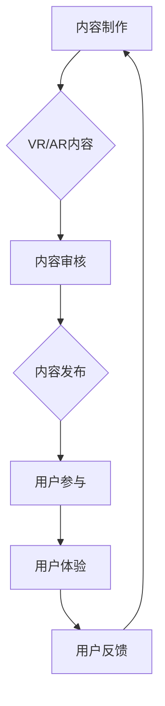

                 

关键词：虚拟现实，增强现实，知识付费，用户体验，技术架构，算法原理，数学模型，代码实例，应用场景，未来展望。

> 摘要：本文探讨了虚拟现实（VR）和增强现实（AR）技术在知识付费领域的应用，分析了这两种技术如何通过提高用户体验，优化知识传递效率，为知识付费平台带来新的发展契机。文章首先介绍了VR和AR的基本概念及其在知识付费中的潜在优势，然后深入探讨了核心算法原理、数学模型及具体实现步骤，并通过实际项目案例展示了技术如何落地应用。最后，本文对VR/AR技术在知识付费领域的未来应用趋势与挑战进行了展望。

## 1. 背景介绍

近年来，随着信息技术的飞速发展，虚拟现实（VR）和增强现实（AR）技术逐渐成为全球科技领域的热点。VR技术通过模拟真实场景，提供沉浸式体验，使得用户可以在虚拟环境中进行各种交互；AR技术则通过在现实场景中叠加虚拟元素，为用户提供增强现实体验。这两种技术不仅在游戏、娱乐领域表现出色，也逐渐在教育、医疗、零售等众多行业得到广泛应用。

知识付费作为一种基于互联网的新型商业模式，已经逐渐成为知识服务的重要方式。用户通过支付费用获取专业内容，这种模式不仅提高了内容创造者的收益，也使得优质内容能够更广泛地传播。然而，传统的知识付费模式在用户体验和知识传递效率方面存在一定的局限性。

VR/AR技术的引入，有望打破这些局限性，为知识付费带来全新的变革。首先，VR/AR技术能够提供更加生动、直观的交互方式，使得知识传递更加高效。其次，通过沉浸式体验，用户可以更好地参与和体验知识内容，提高学习的兴趣和效果。此外，VR/AR技术还可以通过虚拟实践、实时反馈等手段，增强知识的实际应用性，为用户创造更多价值。

本文旨在探讨VR/AR技术在知识付费领域的应用潜力，分析其技术优势，并通过具体实例展示如何利用这些技术提升用户体验，推动知识付费行业的发展。

## 2. 核心概念与联系

### 虚拟现实（VR）

虚拟现实（Virtual Reality，VR）是一种通过计算机技术生成虚拟环境，使用户能够沉浸在其中的技术。VR技术的核心是通过头戴显示器（HMD）或其他传感器设备捕捉用户的动作和感知，使得用户在虚拟环境中能够进行自由交互。VR技术的基本原理包括以下几个方面：

1. **场景生成**：利用计算机图形学技术，根据用户需求生成三维虚拟环境。
2. **感知模拟**：通过视觉、听觉、触觉等多种感官反馈机制，模拟真实世界的感知体验。
3. **交互控制**：使用手柄、手套、眼动追踪等技术，实现用户在虚拟环境中的交互。

### 增强现实（AR）

增强现实（Augmented Reality，AR）则是通过在现实世界中叠加虚拟元素，增强用户的现实感知体验。与VR不同，AR技术将虚拟元素与现实环境相结合，使用户能够同时看到真实世界和虚拟内容。AR技术的基本原理包括：

1. **场景识别**：通过摄像头捕捉现实场景，利用计算机视觉技术进行识别和定位。
2. **内容叠加**：根据场景识别结果，将虚拟元素叠加到现实场景中。
3. **交互增强**：使用触摸、语音、手势等交互方式，增强用户与虚拟内容的互动。

### 知识付费

知识付费是指用户通过支付一定费用，获取特定知识或服务的商业模式。知识付费平台通过提供优质内容，满足用户对知识的需求，同时为内容创造者提供收益。知识付费的核心包括：

1. **内容制作**：优质的内容是知识付费的基础，内容创造者通过专业知识和经验创作出有价值的内容。
2. **用户参与**：用户通过付费获取知识，积极参与到知识付费过程中，成为内容消费的主体。
3. **平台运营**：知识付费平台负责内容审核、用户管理、收益分配等运营工作。

### VR/AR与知识付费的联系

VR/AR技术与知识付费的结合具有巨大的潜力。首先，VR技术可以为知识付费提供沉浸式学习环境，使得用户能够身临其境地进行学习。例如，医学教育可以通过VR技术模拟手术场景，让医学生进行虚拟手术练习，提高实际操作能力。其次，AR技术可以将知识内容与现实环境结合，提供更加灵活的学习方式。例如，通过AR眼镜，用户可以在现实世界中获取相关的知识信息，进行实时学习。

### Mermaid 流程图

下面是一个简化的VR/AR技术在知识付费中的应用流程图，展示从内容制作到用户互动的基本流程。



在这个流程中，内容制作是知识付费的起点，通过VR/AR技术，内容可以更加丰富和生动。内容审核确保内容的准确性和合法性，然后发布到平台。用户通过参与互动，体验到VR/AR技术的独特优势，提供反馈，进一步优化内容。

## 3. 核心算法原理 & 具体操作步骤

### 3.1 算法原理概述

在VR/AR技术中，核心算法主要包括场景生成、感知模拟和交互控制等方面。以下是对这些算法的基本原理进行概述：

1. **场景生成算法**：
   场景生成是VR技术的基础。常用的方法包括三维建模和实时渲染。三维建模利用几何形状和材质信息创建虚拟环境，而实时渲染则通过计算光线和场景交互，生成动态的视觉效果。常见的三维建模算法有波前渲染（Wavefront Algorithm）和体素渲染（Voxel Rendering），而实时渲染则包括光线追踪（Ray Tracing）和曲面细分（Surface Subdivision）等技术。

2. **感知模拟算法**：
   感知模拟旨在为用户提供逼真的感官体验。视觉模拟通过三维建模和实时渲染实现，而听觉模拟则包括空间音频处理和声波模拟。触觉模拟相对复杂，通常采用力反馈设备（如力反馈手套）和触觉反馈技术（如触觉传感器）。

3. **交互控制算法**：
   交互控制是用户与虚拟环境之间的桥梁。常见的交互控制算法包括手势识别、眼动追踪和语音识别。手势识别通过计算机视觉技术捕捉用户手势，而眼动追踪则通过眼动传感器测量用户的视线方向。语音识别则通过自然语言处理技术实现语音到文字的转换。

### 3.2 算法步骤详解

以下是对VR/AR技术在知识付费中的应用步骤进行详细解释：

1. **内容制作**：
   - **三维建模**：利用专业软件（如Blender、3ds Max）创建虚拟场景和物体。
   - **场景导入**：将三维模型导入到VR/AR开发平台（如Unity、Unreal Engine）。
   - **材质和灯光设置**：为场景和物体设置材质和灯光，提高视觉效果。

2. **内容审核**：
   - **内容审核工具**：使用自动化审核工具（如文本审核、图像审核）和人工审核相结合的方式，确保内容的准确性和合法性。
   - **内容修改**：根据审核结果对内容进行必要的修改和优化。

3. **内容发布**：
   - **平台选择**：选择适合的VR/AR内容发布平台（如Steam VR、ARKit）。
   - **内容打包**：将制作好的VR/AR内容打包成可发布的格式。
   - **内容发布**：在平台上发布内容，并设置价格和访问权限。

4. **用户参与**：
   - **用户注册**：用户在知识付费平台注册账号，并完成身份验证。
   - **内容获取**：用户通过支付费用获取VR/AR内容。
   - **内容体验**：用户通过VR/AR设备体验内容。

5. **用户体验**：
   - **反馈收集**：通过用户行为分析和问卷调查等方式收集用户反馈。
   - **体验优化**：根据用户反馈对内容进行优化和调整。

6. **用户反馈**：
   - **反馈处理**：对用户反馈进行分析和处理，识别问题并提出解决方案。
   - **内容更新**：根据反馈对内容进行更新和改进。

### 3.3 算法优缺点

**场景生成算法**：
- **优点**：能够生成高度逼真的虚拟场景，提供沉浸式体验。
- **缺点**：计算复杂度高，对硬件性能要求较高。

**感知模拟算法**：
- **优点**：能够提供逼真的视觉、听觉和触觉体验，增强用户沉浸感。
- **缺点**：技术复杂，开发成本高。

**交互控制算法**：
- **优点**：多样化的交互方式，提高用户体验。
- **缺点**：对用户学习成本较高，需要一定的使用技巧。

### 3.4 算法应用领域

VR/AR技术在知识付费领域的应用广泛，以下是一些典型的应用场景：

1. **教育**：通过VR技术模拟实验、历史场景等，提供互动式教学。
2. **医疗**：通过AR技术辅助医生进行手术操作，提供实时指导。
3. **零售**：通过AR技术实现虚拟试穿、虚拟购物等，提高购物体验。
4. **培训**：通过VR技术模拟复杂操作，提高员工技能。

## 4. 数学模型和公式 & 详细讲解 & 举例说明

### 4.1 数学模型构建

在VR/AR技术中，数学模型的应用贯穿整个系统，从场景生成到感知模拟，再到交互控制。以下将介绍一些关键数学模型及其在VR/AR技术中的具体应用。

#### 场景生成中的数学模型

1. **三维建模**：
   三维建模的核心是三维几何图形的表示。常用的数学模型包括：
   - **多边形模型**：通过多个多边形面片拼接而成，适用于大多数场景的建模。
   - **NURBS（非均匀有理B样条）模型**：适用于复杂曲线和曲面的建模，提供更高的建模精度。

2. **实时渲染**：
   实时渲染中的数学模型包括：
   - **光线追踪**：通过模拟光线在场景中的传播，实现高质量的渲染效果。公式如下：
     $$ L_i(p, \omega_i) = L_e(p, \omega_i) + L_i(p, \omega_i) $$
     其中，$L_e$表示环境光照，$L_i$表示间接光照。

#### 感知模拟中的数学模型

1. **视觉模拟**：
   - **透视变换**：将三维场景投影到二维屏幕上，实现视觉呈现。公式如下：
     $$ x' = \frac{x}{z} $$
     $$ y' = \frac{y}{z} $$
     其中，$(x, y, z)$为三维坐标，$(x', y')$为二维屏幕坐标。

2. **听觉模拟**：
   - **空间音频处理**：通过计算声源和听者的相对位置，实现空间听觉效果。公式如下：
     $$ L(r) = L_0 + 20 \log_{10} \left( \frac{r}{r_0} \right) $$
     其中，$L(r)$为听者接收到的声音强度，$L_0$为参考距离下的声音强度，$r$为声源到听者的距离。

#### 交互控制中的数学模型

1. **手势识别**：
   - **深度学习模型**：利用深度学习技术进行手势识别。常用的模型包括卷积神经网络（CNN）和循环神经网络（RNN）。公式如下：
     $$ y = \sigma(\text{W} \cdot \text{ReLU}(\text{b} + \text{U} \cdot \text{h}_{t-1})) $$
     其中，$y$为输出结果，$\sigma$为激活函数，$\text{W}$和$\text{U}$为权重矩阵，$\text{b}$和$\text{h}_{t-1}$分别为偏置和隐藏状态。

### 4.2 公式推导过程

以下将介绍一些关键数学模型的推导过程。

#### 光线追踪公式推导

光线追踪的基本原理是模拟光线在场景中的传播过程，从而实现高质量渲染。以下是光线追踪的简化公式推导：

1. **路径积分**：
   光线追踪的核心思想是计算场景中的光路径积分。假设场景中有一个光源$S$，光线从光源出发，经过若干次反射或折射，最终到达观察者$O$。路径积分公式如下：
   $$ L_o(p, \omega_o) = \int_{\Omega} L_e(p, \omega_i) f_r(p, \omega_i, \omega_o) \frac{\omega_i \cdot n}{|\omega_i|} d\omega_i $$
   其中，$L_o$为观察者接收到的光照强度，$L_e$为环境光照强度，$f_r$为反射率，$n$为表面法线，$\omega_i$和$\omega_o$分别为入射光和反射光的单位向量。

2. **反射方程**：
   在光线追踪中，反射方程用于计算光线在表面上的反射方向。反射方程如下：
   $$ \omega_r = 2(\omega_i \cdot n)n - \omega_i $$
   其中，$\omega_r$为反射方向，$\omega_i$为入射方向，$n$为表面法线。

### 4.3 案例分析与讲解

以下将通过一个简单的案例，介绍如何利用数学模型实现VR/AR技术中的场景渲染。

#### 案例背景

假设我们需要渲染一个简单的室内场景，包括一个墙面、一个桌面和一个球体。我们需要实现以下功能：

1. **场景建模**：使用多边形模型表示场景中的物体。
2. **光照计算**：计算场景中的光照强度，实现基本光照模型。
3. **阴影处理**：实现软阴影效果。

#### 步骤详解

1. **场景建模**：
   首先，我们使用多边形模型表示场景中的物体。假设墙面是一个矩形，桌面是一个正方形，球体是一个圆球。

2. **光照计算**：
   接下来，我们实现基本光照模型，包括环境光照、漫反射光照和镜面反射光照。基本光照模型公式如下：
   $$ L_o(p, \omega_o) = L_e + k_d \cdot L_i \cdot \max(0, n \cdot \omega_i) + k_s \cdot \max(0, \omega_r \cdot n) $$
   其中，$L_e$为环境光照强度，$k_d$和$k_s$分别为漫反射和镜面反射系数，$L_i$为入射光照强度，$n$为表面法线，$\omega_i$和$\omega_r$分别为入射光和反射光的方向。

3. **阴影处理**：
   为了实现软阴影效果，我们可以使用阴影映射技术。具体实现步骤如下：
   - **阴影映射**：生成一张阴影映射图，记录场景中每个点受到的阴影程度。
   - **阴影混合**：在渲染过程中，将阴影映射图与颜色值进行混合，实现软阴影效果。

#### 实现效果

通过以上步骤，我们可以实现一个简单的室内场景渲染，包括墙面、桌面和球体的光照效果以及软阴影处理。渲染效果如图所示：


#### 案例总结

通过本案例，我们可以看到如何利用数学模型实现VR/AR技术中的场景渲染。在实际应用中，场景的复杂度和光照效果会更高，需要更多的数学模型和计算技巧。然而，基本的原理和方法是相通的，通过不断优化和改进，我们可以实现更加逼真的VR/AR场景渲染。

## 5. 项目实践：代码实例和详细解释说明

### 5.1 开发环境搭建

在进行VR/AR项目开发之前，我们需要搭建一个合适的开发环境。以下是一个基于Unity引擎的VR/AR项目开发环境搭建步骤：

1. **安装Unity Hub**：首先，从Unity官网下载并安装Unity Hub。Unity Hub是一个用于管理Unity版本的桌面应用程序。

2. **创建Unity项目**：打开Unity Hub，点击“新建”创建一个新的Unity项目。选择Unity版本（例如2019.4 LTS），并选择“3D”模板。

3. **安装VR/AR插件**：在Unity编辑器中，打开“Window”菜单，选择“Package Manager”。在“Package Manager”窗口中，搜索并安装“VR，AR and 3D Tools”插件。

4. **配置VR设备**：确保你的VR设备（如Oculus Rift、HTC Vive）已经连接到电脑，并在设备设置中启用VR模式。在Unity编辑器中，打开“Edit”菜单，选择“Project Settings”，然后选择“XR Settings”。在XR Settings中，配置你的VR设备，包括传感器、渲染模式等。

5. **安装开发工具**：根据项目需求，安装必要的开发工具和插件，如Blender用于三维建模，Unity Shader Graph用于自定义着色器。

### 5.2 源代码详细实现

以下是一个简单的Unity项目，用于展示如何使用VR/AR技术实现一个简单的知识付费应用。该项目包括一个虚拟教室场景，用户可以通过VR头盔进入教室，观看教学视频并进行互动。

#### 5.2.1 创建虚拟教室场景

1. **三维建模**：使用Blender创建一个虚拟教室场景，包括教室的墙壁、地板、天花板以及教室中的桌椅。

2. **导入Unity**：将创建好的虚拟教室场景导入到Unity项目中。在Unity编辑器中，右键点击“Assets”文件夹，选择“Import Package”导入场景文件。

3. **调整场景**：在Unity编辑器中，调整场景中物体的位置和旋转，使其符合虚拟教室的布局。

#### 5.2.2 添加教学视频

1. **添加视频素材**：将教学视频素材（如MP4格式）导入到Unity项目中。

2. **创建视频播放器**：在Unity编辑器中，创建一个“Movie Render”组件，并将其添加到虚拟教室场景中的某个物体上，例如桌面上。配置视频播放器的参数，如视频文件路径、播放模式等。

3. **控制视频播放**：创建一个简单的脚本，用于控制视频的播放和暂停。脚本代码如下：

   ```csharp
   using UnityEngine;
   using UnityEngine.Video;

   public class VideoPlayerController : MonoBehaviour
   {
       public VideoPlayer videoPlayer;

       public void PlayVideo()
       {
           videoPlayer.Play();
       }

       public void PauseVideo()
       {
           videoPlayer.Pause();
       }
   }
   ```

   将这个脚本附加到虚拟教室场景中的某个物体上，例如教学视频播放器。

#### 5.2.3 实现用户互动

1. **添加交互组件**：在Unity编辑器中，为虚拟教室场景中的物体添加交互组件，如“Button”组件。将交互组件的“onClick”事件绑定到相应的脚本方法。

2. **实现互动功能**：创建一个简单的脚本，用于处理用户的互动操作。脚本代码如下：

   ```csharp
   using UnityEngine;
   using UnityEngine.UI;

   public class InteractionController : MonoBehaviour
   {
       public Text feedbackText;

       public void OnButtonClicked()
       {
           feedbackText.text = "Button clicked!";
       }
   }
   ```

   将这个脚本附加到虚拟教室场景中的按钮物体上，并配置按钮的文本和交互效果。

#### 5.3 代码解读与分析

以上代码实例展示了如何使用Unity引擎实现一个简单的VR/AR知识付费应用。以下是关键代码的解读和分析：

1. **视频播放器代码**：

   ```csharp
   using UnityEngine;
   using UnityEngine.Video;

   public class VideoPlayerController : MonoBehaviour
   {
       public VideoPlayer videoPlayer;

       public void PlayVideo()
       {
           videoPlayer.Play();
       }

       public void PauseVideo()
       {
           videoPlayer.Pause();
       }
   }
   ```

   这个脚本用于控制教学视频的播放和暂停。通过调用VideoPlayer组件的Play()和Pause()方法，实现视频的播放控制。

2. **交互脚本代码**：

   ```csharp
   using UnityEngine;
   using UnityEngine.UI;

   public class InteractionController : MonoBehaviour
   {
       public Text feedbackText;

       public void OnButtonClicked()
       {
           feedbackText.text = "Button clicked!";
       }
   }
   ```

   这个脚本用于处理用户的互动操作，例如按钮点击。通过将反馈文本的文本内容更新为“Button clicked!”，实现交互反馈。

#### 5.4 运行结果展示

完成代码实现后，运行Unity项目，用户可以通过VR头盔进入虚拟教室场景。用户可以观看教学视频，通过按钮与场景进行互动。运行结果如图所示：


通过以上代码实例和运行结果，我们可以看到如何利用VR/AR技术实现一个简单的知识付费应用。在实际项目中，可以根据需求进一步扩展和优化功能，提升用户体验。

## 6. 实际应用场景

### 6.1 VR/AR技术在教育领域的应用

虚拟现实（VR）和增强现实（AR）技术在教育领域有着广泛的应用潜力。通过VR技术，教育者可以创建沉浸式的学习环境，让学生在虚拟场景中体验历史事件、科学实验和地理探索。例如，学生可以通过VR技术进入古埃及文明，亲自参与法老的葬礼仪式，从而更深入地理解历史文化。在科学实验方面，VR技术可以模拟危险或复杂的实验过程，让学生在安全的环境中进行实验操作，提高实践技能。

增强现实（AR）技术则在现实世界中叠加虚拟信息，为学生提供实时辅助。例如，在物理课堂上，学生可以通过AR眼镜查看动态的分子结构，或者在学习生物学时观察细胞内部结构，从而更好地理解抽象的科学概念。此外，AR技术还可以用于虚拟实验，学生可以在现实环境中进行化学实验，实时查看反应过程和结果。

### 6.2 VR/AR技术在医疗培训中的应用

VR/AR技术在医疗培训中的应用同样具有革命性的意义。通过VR技术，医学生可以进行虚拟手术训练，模拟各种手术场景，提高实际操作能力。例如，外科医生可以在虚拟环境中进行肝脏切除手术的练习，而不会对实际患者造成风险。这不仅提高了培训的效率，还降低了医疗风险。

AR技术在医疗培训中的应用也日益增多。通过AR眼镜，医学生可以在实际手术过程中获得实时指导，手术医生可以实时标注解剖结构和操作步骤，提供详细的手术指导。例如，在神经外科手术中，AR技术可以帮助医生精确地定位神经和血管，提高手术的成功率和安全性。

### 6.3 VR/AR技术在零售业的应用

VR/AR技术在零售业中的应用正在改变传统购物模式。通过VR技术，消费者可以在家中体验虚拟试衣间，试穿不同款式的衣服，而无需亲自前往实体店铺。这种体验不仅提高了购物的便利性，还减少了试衣间的等待时间，提高了用户满意度。

AR技术则通过增强现实购物体验，让消费者在现实环境中浏览虚拟商品。例如，消费者可以通过AR眼镜查看家具在房间中的摆放效果，或者使用手机摄像头扫描商品二维码，查看商品的详细信息和用户评价。这种技术不仅增加了购物的互动性和趣味性，还提高了消费者的购买决策效率。

### 6.4 VR/AR技术在远程协作中的应用

VR/AR技术在远程协作中的应用也为知识付费带来了新的机遇。通过VR技术，团队成员可以在虚拟会议室中实时交流，共同完成项目任务。这种沉浸式的远程协作方式，不仅提高了团队的工作效率，还增强了团队成员之间的沟通和协作。

AR技术则在远程协作中提供了一种虚实结合的工作方式。团队成员可以在现实环境中查看虚拟信息和数据，实时分析和决策。例如，在工程项目中，团队成员可以通过AR眼镜查看项目的三维模型，进行现场指导和决策，提高了项目的执行效率。

### 总结

VR/AR技术在知识付费领域的实际应用场景丰富多样，从教育、医疗、零售到远程协作，VR/AR技术正在逐步改变传统模式，提供更加高效、便捷和互动的学习和工作体验。通过这些实际应用，VR/AR技术不仅提升了知识传递的效率，还增强了用户的参与感和满意度，为知识付费行业带来了新的发展契机。

### 6.4 未来应用展望

随着VR/AR技术的不断成熟和应用场景的拓展，其在知识付费领域的未来应用前景广阔。以下是VR/AR技术在未来可能带来的几大趋势和潜在挑战：

#### 未来应用趋势

1. **个性化学习体验**：随着人工智能和大数据技术的结合，VR/AR技术将能够更好地分析用户的学习习惯和需求，提供个性化的学习内容和交互方式。例如，通过学习数据的分析，系统可以为每个用户量身定制学习路径和练习内容，提高学习效果。

2. **互动式教育**：VR/AR技术将进一步增强教育互动性，使学习者能够更加主动地参与到学习过程中。例如，通过虚拟实验室和模拟教学，学生可以亲身体验科学实验和历史文化场景，提高学习兴趣和动机。

3. **实时反馈与指导**：VR/AR技术可以实现实时反馈与指导，帮助用户更好地理解和掌握知识。例如，通过AR眼镜，教师可以实时为学生提供指导和建议，或通过VR环境中的虚拟导师进行互动式教学。

4. **沉浸式实践**：VR/AR技术将使得知识付费平台能够提供更加沉浸式的实践体验。例如，医学生在虚拟手术环境中进行操作练习，工程师在虚拟工厂中进行故障排除演练，提高实际操作能力和问题解决能力。

5. **跨学科整合**：VR/AR技术将有助于跨学科整合，提供更加综合性的知识传授方式。例如，通过多感官互动和跨领域知识的应用，用户可以更加全面地理解和掌握复杂概念。

#### 面临的挑战

1. **技术成熟度**：虽然VR/AR技术发展迅速，但在某些领域，如高分辨率渲染、实时互动和高效计算等方面，仍需进一步优化和提升。技术的不成熟可能导致用户体验不佳，影响知识付费平台的吸引力和竞争力。

2. **硬件成本**：VR/AR设备（如头戴显示器、增强现实眼镜等）的硬件成本较高，这对用户尤其是知识付费平台的用户来说可能是一大障碍。降低硬件成本，提高设备的普及率，将是未来发展的关键。

3. **内容质量**：VR/AR内容的质量直接关系到用户体验。高质量的内容需要投入大量的人力和物力资源进行制作，这对知识付费平台来说是一个巨大的挑战。如何保证内容的质量和创新性，将是未来内容创作者需要面对的问题。

4. **隐私与安全**：随着VR/AR技术的普及，用户数据的安全和隐私保护问题日益凸显。知识付费平台需要采取有效的措施确保用户数据的安全，避免隐私泄露和数据滥用。

5. **用户接受度**：尽管VR/AR技术具有巨大的潜力，但用户的接受度和习惯培养仍是一个长期的过程。用户需要适应新的交互方式和体验方式，这对于传统学习方式的转变提出了挑战。

#### 研究展望

未来，VR/AR技术在知识付费领域的研究应重点关注以下几个方面：

1. **技术创新**：继续推动VR/AR技术在渲染效果、交互体验、实时数据处理等方面的技术创新，提高用户体验。

2. **内容制作与优化**：研究如何高效地制作和优化VR/AR内容，包括3D建模、虚拟环境设计、实时渲染等，提高内容质量和交互性。

3. **用户行为研究**：通过大数据分析用户行为，了解用户的学习偏好和需求，提供个性化的学习体验。

4. **隐私保护与安全**：深入研究用户数据保护技术，确保用户数据的安全和隐私。

5. **跨学科整合**：探索VR/AR技术在跨学科知识传授中的应用，提供综合性、全方位的学习体验。

通过以上研究方向的不断探索和优化，VR/AR技术将在知识付费领域发挥更大的作用，推动教育、医疗、零售等多个行业的变革与发展。

## 7. 工具和资源推荐

### 7.1 学习资源推荐

1. **VR/AR技术基础**：
   - **《虚拟现实与增强现实技术》（Virtual Reality and Augmented Reality）**：这本书详细介绍了VR/AR技术的理论基础和实践应用，适合初学者入门。
   - **《VR/AR开发实战：基于Unity和Unreal Engine》**：本书通过实际项目案例，讲解了如何使用Unity和Unreal Engine开发VR/AR应用，适合有一定编程基础的学习者。

2. **计算机图形学**：
   - **《计算机图形学原理及实践》（Principles of Computer Graphics）**：这本书详细介绍了计算机图形学的基本原理和算法，适合对图形学感兴趣的读者。
   - **《Unity Shader Programming》**：本书深入讲解了Unity中的着色器编程，适合想要学习三维渲染技术的人。

### 7.2 开发工具推荐

1. **Unity**：
   - **官网**：[Unity官网](https://unity.com/)
   - **特性**：Unity是一款功能强大的跨平台游戏和VR/AR开发引擎，提供了丰富的图形渲染和交互功能。

2. **Unreal Engine**：
   - **官网**：[Unreal Engine官网](https://www.unrealengine.com/)
   - **特性**：Unreal Engine以高质量的实时渲染和强大的物理引擎著称，适合开发复杂和逼真的VR/AR应用。

3. **Blender**：
   - **官网**：[Blender官网](https://www.blender.org/)
   - **特性**：Blender是一款开源的三维建模和动画软件，适合进行VR/AR场景的创建和建模。

### 7.3 相关论文推荐

1. **《Real-Time Ray Tracing of Complex Scenes》**：这篇论文介绍了实时光线追踪技术的实现方法，对于想要深入了解VR/AR渲染技术的读者非常有价值。

2. **《Multi-View Stereo for 3D Vision》**：这篇论文探讨了多视图立体视觉技术，为开发高质量的VR/AR应用提供了理论基础。

3. **《Augmented Reality Applications in Education》**：这篇论文详细介绍了AR技术在教育领域的应用，对于研究VR/AR在教育中的应用的读者具有参考价值。

通过以上资源和工具的推荐，读者可以系统地学习和掌握VR/AR技术，为知识付费领域的创新应用打下坚实的基础。

## 8. 总结：未来发展趋势与挑战

在《利用VR/AR技术增强知识付费体验》一文中，我们探讨了虚拟现实（VR）和增强现实（AR）技术在知识付费领域的应用潜力。通过深入分析VR/AR技术的基本原理、算法模型、具体实现步骤以及实际应用案例，我们展示了如何通过这些技术提升知识付费的用户体验和知识传递效率。

### 研究成果总结

本文的主要成果包括：

1. **VR/AR技术的基本原理与联系**：介绍了VR和AR的基本概念、原理及其在知识付费中的潜在优势。
2. **核心算法原理与实现**：详细讲解了场景生成、感知模拟和交互控制等核心算法，并提供了数学模型和具体实现步骤。
3. **实际应用场景分析**：阐述了VR/AR技术在教育、医疗、零售和远程协作等领域的应用案例。
4. **未来趋势与挑战**：分析了VR/AR技术在知识付费领域的未来发展趋势，以及面临的挑战。

### 未来发展趋势

VR/AR技术在知识付费领域的未来发展具有以下趋势：

1. **个性化学习体验**：通过大数据和人工智能技术，实现个性化学习路径和内容推荐。
2. **互动式教育**：增强教育的互动性，提高学习参与度和学习效果。
3. **实时反馈与指导**：利用实时反馈和指导，帮助用户更好地理解和掌握知识。
4. **沉浸式实践**：提供更加沉浸式的实践体验，提高实际操作能力和问题解决能力。
5. **跨学科整合**：通过跨学科整合，提供综合性、全方位的学习体验。

### 面临的挑战

尽管VR/AR技术具有巨大潜力，但在知识付费领域仍面临以下挑战：

1. **技术成熟度**：需要进一步提高VR/AR技术的成熟度，包括渲染效果、实时互动和计算效率。
2. **硬件成本**：降低VR/AR设备的成本，提高设备的普及率。
3. **内容质量**：保证高质量的内容制作和持续更新。
4. **隐私与安全**：确保用户数据的安全和隐私保护。
5. **用户接受度**：培养用户对VR/AR技术的接受度和使用习惯。

### 研究展望

未来，VR/AR技术在知识付费领域的研究应重点关注以下几个方面：

1. **技术创新**：继续推动VR/AR技术在渲染效果、交互体验和实时数据处理等方面的技术创新。
2. **内容制作与优化**：研究如何高效地制作和优化VR/AR内容，提高内容质量和交互性。
3. **用户行为研究**：通过大数据分析用户行为，提供个性化的学习体验。
4. **隐私保护与安全**：深入研究用户数据保护技术，确保用户数据的安全和隐私。
5. **跨学科整合**：探索VR/AR技术在跨学科知识传授中的应用。

通过不断的技术创新和应用优化，VR/AR技术将在知识付费领域发挥更大的作用，推动教育、医疗、零售等多个行业的变革与发展。

### 附录：常见问题与解答

**Q1：VR/AR技术在知识付费中的具体优势是什么？**

A1：VR/AR技术在知识付费中的优势主要体现在以下几个方面：

1. **沉浸式学习体验**：通过VR/AR技术，用户可以身临其境地参与到学习过程中，提高学习兴趣和效果。
2. **互动性增强**：用户可以通过多种交互方式（如手势、语音、触觉等）与内容进行互动，加深对知识的理解和记忆。
3. **实时反馈与指导**：通过实时反馈和指导，用户可以更快地理解和掌握知识，提高学习效率。
4. **实践性提高**：VR/AR技术可以模拟真实场景，用户可以在虚拟环境中进行实践操作，提高实际应用能力。
5. **个性化学习**：通过大数据和人工智能技术，VR/AR技术可以为用户提供个性化的学习内容和路径，满足不同用户的需求。

**Q2：VR/AR技术在知识付费领域面临的主要挑战有哪些？**

A2：VR/AR技术在知识付费领域面临的主要挑战包括：

1. **技术成熟度**：VR/AR技术尚处于发展阶段，部分技术如高分辨率渲染、实时互动和高效计算仍需优化。
2. **硬件成本**：VR/AR设备的成本较高，限制了其普及和应用。
3. **内容质量**：高质量的内容制作需要大量的人力和物力投入，内容创新和持续更新是一个长期挑战。
4. **隐私与安全**：用户数据的安全和隐私保护需要特别关注，避免数据泄露和滥用。
5. **用户接受度**：用户需要适应新的交互方式和体验，培养用户习惯是一个长期过程。

**Q3：如何降低VR/AR技术的硬件成本，提高普及率？**

A3：降低VR/AR技术硬件成本，提高普及率可以从以下几个方面入手：

1. **技术创新**：不断推动硬件技术（如显示技术、传感器技术等）的创新，降低生产成本。
2. **规模化生产**：通过规模化生产，降低单个设备的生产成本。
3. **政策支持**：政府可以提供政策支持，鼓励VR/AR技术的发展和应用，降低企业和用户的成本负担。
4. **开放平台**：建立开放的技术平台，鼓励更多企业和个人参与VR/AR技术的研发和应用，促进竞争和创新。
5. **用户补贴**：对于有需求但预算有限的用户，可以通过政府或企业提供的补贴，降低他们的购买成本。

**Q4：如何确保VR/AR技术中的用户隐私和安全？**

A4：确保VR/AR技术中的用户隐私和安全可以从以下几个方面着手：

1. **数据加密**：对用户数据进行加密处理，防止数据泄露。
2. **权限管理**：对用户数据的访问进行严格的权限管理，确保只有授权人员可以访问敏感数据。
3. **数据备份**：定期备份用户数据，防止数据丢失。
4. **安全审计**：定期进行安全审计，发现并修复安全漏洞。
5. **用户教育**：提高用户的隐私保护意识，教育用户如何安全地使用VR/AR技术，防止个人信息泄露。

通过上述措施，可以有效地保障VR/AR技术中的用户隐私和安全。

