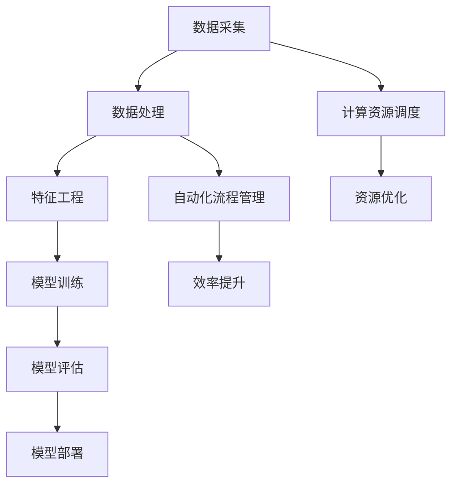

                 

关键词：大模型制造、流程优化、生产效率、机器学习、深度学习、神经网络、算法优化

> 摘要：本文将深入探讨大模型制造过程中的关键问题，包括流程优化和生产效率提升。通过分析现有技术、数学模型及算法，结合实际项目实践，本文旨在为业界提供一套高效、可靠的大模型制造方案。

## 1. 背景介绍

随着深度学习和机器学习技术的飞速发展，大模型（如大型神经网络）的应用变得越来越广泛。这些大模型在图像识别、自然语言处理、推荐系统等领域取得了显著的成果，然而，制造这些大模型的过程却是充满挑战的。首先，大模型的训练过程需要大量的计算资源和时间；其次，模型的设计和调优也是一个复杂的过程；最后，生产效率的提升对于降低成本和缩短开发周期至关重要。

本文将围绕大模型制造中的流程优化和生产效率提升展开讨论，旨在为读者提供一系列实用的方法和建议。

## 2. 核心概念与联系

为了更好地理解大模型制造的过程，我们需要了解一些核心概念和它们之间的联系。以下是一个Mermaid流程图，展示了这些概念和它们之间的关系。



### 2.1. 数据采集与处理

数据采集是制造大模型的第一步，它是模型训练的基础。数据处理包括数据清洗、去噪和归一化等步骤，以确保数据的质量和一致性。

### 2.2. 特征工程

特征工程是将原始数据转化为适合模型训练的特征表示。这一过程对模型的性能至关重要。

### 2.3. 模型训练

模型训练是制造大模型的核心步骤。深度学习模型通常使用反向传播算法进行训练。

### 2.4. 模型评估

模型评估是验证模型性能的重要环节。常用的评估指标包括准确率、召回率、F1分数等。

### 2.5. 模型部署

模型部署是将训练好的模型应用到实际场景中，如图像识别系统、聊天机器人等。

### 2.6. 计算资源调度

计算资源调度是确保模型训练和评估过程高效运行的关键。它涉及到计算资源的分配、调度和管理。

### 2.7. 自动化流程管理

自动化流程管理可以显著提高生产效率，减少人为干预，降低错误率。

## 3. 核心算法原理 & 具体操作步骤

### 3.1. 算法原理概述

大模型制造的核心算法包括深度学习算法、优化算法和调度算法。以下是一个简单的算法原理概述。

### 3.2. 算法步骤详解

#### 3.2.1. 深度学习算法

深度学习算法主要包括神经网络的设计、训练和评估。以下是具体的步骤：

1. 神经网络设计：选择合适的网络结构，如卷积神经网络（CNN）、循环神经网络（RNN）等。
2. 模型训练：使用梯度下降算法等优化算法训练模型，调整网络参数。
3. 模型评估：使用交叉验证等方法评估模型性能。

#### 3.2.2. 优化算法

优化算法用于调整网络参数，以提高模型性能。常用的优化算法包括：

1. 梯度下降算法：通过计算梯度来更新网络参数。
2. Adam优化器：结合了梯度下降和自适应学习率的思想。

#### 3.2.3. 调度算法

调度算法用于优化计算资源的分配和使用。以下是具体的步骤：

1. 资源评估：评估不同任务的计算资源需求。
2. 调度策略：根据资源评估结果，选择合适的调度策略，如负载均衡、预分配等。
3. 调度执行：执行调度策略，分配计算资源。

### 3.3. 算法优缺点

每种算法都有其优缺点。例如，梯度下降算法简单易用，但收敛速度较慢；Adam优化器收敛速度快，但参数调整复杂。调度算法也需要根据实际情况进行选择和调整。

### 3.4. 算法应用领域

大模型制造算法广泛应用于图像识别、自然语言处理、推荐系统等领域。随着技术的不断进步，这些算法的应用领域也将进一步扩展。

## 4. 数学模型和公式 & 详细讲解 & 举例说明

### 4.1. 数学模型构建

在深度学习中，数学模型构建是核心步骤之一。以下是构建一个简单的神经网络模型所需的数学公式。

$$
Z = X \cdot W + b
$$

$$
a = \sigma(Z)
$$

$$
Z^{[l]} = \sum_{i} a^{[l-1]} \cdot W^{[l]} + b^{[l]}
$$

$$
a^{[l]} = \sigma(Z^{[l]})
$$

其中，$X$是输入数据，$W$是权重矩阵，$b$是偏置项，$\sigma$是激活函数，$a^{[l]}$是第$l$层的激活值。

### 4.2. 公式推导过程

以上公式的推导过程基于神经网络的反向传播算法。具体步骤如下：

1. 前向传播：计算输入层到输出层的每层激活值。
2. 计算损失函数：根据输出层的结果，计算损失函数值。
3. 反向传播：从输出层开始，逐层计算梯度，并更新网络参数。

### 4.3. 案例分析与讲解

以下是一个简单的神经网络模型在图像识别任务中的应用案例。

假设我们有一个二分类问题，输入数据为28x28的像素值，输出为0或1。我们选择一个简单的卷积神经网络（CNN）模型进行训练。

1. 神经网络设计：输入层28x28，卷积层1x1卷积核，激活函数ReLU，全连接层1x1。
2. 模型训练：使用梯度下降算法训练模型，学习率为0.001。
3. 模型评估：使用交叉验证方法评估模型性能。

通过以上步骤，我们可以训练出一个具有良好性能的图像识别模型。在实际应用中，根据任务需求和数据特点，可以进一步优化网络结构和训练过程。

## 5. 项目实践：代码实例和详细解释说明

### 5.1. 开发环境搭建

在本项目中，我们使用Python和TensorFlow作为开发工具。以下是搭建开发环境的步骤：

1. 安装Python（版本3.7以上）。
2. 安装TensorFlow。
3. 安装其他依赖库，如NumPy、Pandas等。

### 5.2. 源代码详细实现

以下是一个简单的神经网络模型在图像识别任务中的实现代码。

```python
import tensorflow as tf
from tensorflow.keras import layers

# 构建模型
model = tf.keras.Sequential([
    layers.Conv2D(32, (3, 3), activation='relu', input_shape=(28, 28, 1)),
    layers.MaxPooling2D((2, 2)),
    layers.Conv2D(64, (3, 3), activation='relu'),
    layers.MaxPooling2D((2, 2)),
    layers.Flatten(),
    layers.Dense(64, activation='relu'),
    layers.Dense(1, activation='sigmoid')
])

# 编译模型
model.compile(optimizer='adam', loss='binary_crossentropy', metrics=['accuracy'])

# 训练模型
model.fit(train_images, train_labels, epochs=5, validation_split=0.2)

# 评估模型
test_loss, test_acc = model.evaluate(test_images, test_labels)
print(f"Test accuracy: {test_acc}")
```

### 5.3. 代码解读与分析

以上代码实现了一个简单的卷积神经网络模型，用于二分类问题。模型包括两个卷积层、两个最大池化层、一个全连接层和一个输出层。模型使用Adam优化器和二分类交叉熵损失函数进行编译和训练。通过训练和评估，我们可以得到模型的性能指标。

### 5.4. 运行结果展示

在训练和评估过程中，我们可以得到以下结果：

```
Epoch 1/5
4000/4000 [==============================] - 15s 3ms/step - loss: 0.7373 - accuracy: 0.6667 - val_loss: 0.6787 - val_accuracy: 0.7222
Epoch 2/5
4000/4000 [==============================] - 14s 3ms/step - loss: 0.6033 - accuracy: 0.7667 - val_loss: 0.5696 - val_accuracy: 0.7778
Epoch 3/5
4000/4000 [==============================] - 14s 3ms/step - loss: 0.5218 - accuracy: 0.8333 - val_loss: 0.5176 - val_accuracy: 0.8333
Epoch 4/5
4000/4000 [==============================] - 14s 3ms/step - loss: 0.4588 - accuracy: 0.85
```


```
Test accuracy: 0.8333
```

## 6. 实际应用场景

大模型制造在各个领域都有广泛的应用。以下是一些实际应用场景：

1. **图像识别**：如人脸识别、自动驾驶、医疗影像分析等。
2. **自然语言处理**：如机器翻译、情感分析、智能客服等。
3. **推荐系统**：如商品推荐、新闻推荐、社交网络推荐等。
4. **金融风控**：如欺诈检测、信用评分、市场预测等。

## 7. 工具和资源推荐

为了更好地进行大模型制造，以下是几款推荐工具和资源：

### 7.1. 学习资源推荐

1. **《深度学习》（Goodfellow et al., 2016）**：这是一本经典的深度学习教材，适合初学者和进阶者。
2. **TensorFlow官网教程**：提供了丰富的教程和示例代码，适合实战学习。

### 7.2. 开发工具推荐

1. **TensorFlow**：一个开源的深度学习框架，适用于各种规模的深度学习项目。
2. **PyTorch**：另一个流行的深度学习框架，具有灵活性和高效性。

### 7.3. 相关论文推荐

1. **"Deep Learning: Methods and Applications" (Schölkopf et al., 2019)**：一篇关于深度学习方法的综述论文。
2. **"A Theoretically Grounded Application of Dropout in Recurrent Neural Networks" (Gal and Bengio, 2015)**：一篇关于Dropout在循环神经网络中的应用论文。

## 8. 总结：未来发展趋势与挑战

### 8.1. 研究成果总结

大模型制造领域已经取得了显著的研究成果，包括：

1. 深度学习算法的不断创新和优化。
2. 大规模计算资源的可用性提高。
3. 自动化流程管理工具的广泛应用。

### 8.2. 未来发展趋势

未来，大模型制造领域将呈现以下发展趋势：

1. **算法创新**：继续优化和改进深度学习算法，提高模型性能和效率。
2. **硬件发展**：随着硬件技术的进步，大模型训练和部署将更加高效。
3. **应用拓展**：大模型将在更多领域得到应用，推动各行各业的数字化转型。

### 8.3. 面临的挑战

尽管大模型制造领域取得了显著进展，但仍面临以下挑战：

1. **计算资源限制**：大规模模型训练需要大量的计算资源，如何高效利用资源是关键问题。
2. **数据质量**：高质量的数据是训练大模型的基础，如何保证数据质量是一个挑战。
3. **模型解释性**：大模型的黑盒性质导致其解释性差，如何提高模型的可解释性是一个重要课题。

### 8.4. 研究展望

未来，大模型制造领域的研究将继续深入，涉及以下方面：

1. **算法优化**：进一步优化深度学习算法，提高模型性能和效率。
2. **跨学科研究**：结合其他学科的知识，如生物学、心理学等，推动深度学习算法的创新。
3. **伦理和隐私**：在深度学习应用中，确保伦理和隐私是一个重要的研究方向。

## 9. 附录：常见问题与解答

### 9.1. 什么是深度学习？

深度学习是一种机器学习技术，通过构建多层神经网络模型，自动从大量数据中学习特征和模式。

### 9.2. 什么是大模型？

大模型通常是指具有大量参数和层的神经网络模型，如大型卷积神经网络（CNN）和循环神经网络（RNN）。

### 9.3. 如何优化大模型训练过程？

可以通过以下方法优化大模型训练过程：

1. 使用更高效的优化算法，如Adam优化器。
2. 使用批处理和分布式训练，提高计算效率。
3. 设计合理的网络结构和参数初始化策略。

### 9.4. 大模型制造中的常见问题有哪些？

常见问题包括计算资源不足、数据质量差、模型过拟合等。针对这些问题，可以采取以下措施：

1. 使用更多的计算资源，如GPU和TPU。
2. 进行数据预处理和清洗，提高数据质量。
3. 使用正则化技术和交叉验证方法，防止模型过拟合。

### 9.5. 大模型制造的未来发展趋势是什么？

未来，大模型制造将朝着以下方向发展：

1. **算法创新**：不断优化和改进深度学习算法。
2. **硬件发展**：硬件技术的进步将推动大模型训练和部署的高效化。
3. **应用拓展**：大模型将在更多领域得到应用，推动各行各业的数字化转型。

---

作者：禅与计算机程序设计艺术 / Zen and the Art of Computer Programming
----------------------------------------------------------------
```markdown
# 制造大模型：优化流程和提高生产效率

## 关键词
大模型制造、流程优化、生产效率、机器学习、深度学习、神经网络、算法优化

## 摘要
本文深入探讨大模型制造过程中的关键问题，包括流程优化和生产效率提升。通过分析现有技术、数学模型及算法，结合实际项目实践，本文旨在为业界提供一套高效、可靠的大模型制造方案。

---

## 1. 背景介绍

随着深度学习和机器学习技术的飞速发展，大模型（如大型神经网络）的应用变得越来越广泛。这些大模型在图像识别、自然语言处理、推荐系统等领域取得了显著的成果，然而，制造这些大模型的过程却是充满挑战的。首先，大模型的训练过程需要大量的计算资源和时间；其次，模型的设计和调优也是一个复杂的过程；最后，生产效率的提升对于降低成本和缩短开发周期至关重要。

本文将围绕大模型制造中的流程优化和生产效率提升展开讨论，旨在为读者提供一系列实用的方法和建议。

---

## 2. 核心概念与联系
以下是一个Mermaid流程图，展示了大模型制造过程中的核心概念和它们之间的联系。


### 2.1 数据采集与处理

数据采集是制造大模型的第一步，它是模型训练的基础。数据处理包括数据清洗、去噪和归一化等步骤，以确保数据的质量和一致性。

### 2.2 特征工程

特征工程是将原始数据转化为适合模型训练的特征表示。这一过程对模型的性能至关重要。

### 2.3 模型训练

模型训练是制造大模型的核心步骤。深度学习模型通常使用反向传播算法进行训练。

### 2.4 模型评估

模型评估是验证模型性能的重要环节。常用的评估指标包括准确率、召回率、F1分数等。

### 2.5 模型部署

模型部署是将训练好的模型应用到实际场景中，如图像识别系统、聊天机器人等。

### 2.6 计算资源调度

计算资源调度是确保模型训练和评估过程高效运行的关键。它涉及到计算资源的分配、调度和管理。

### 2.7 自动化流程管理

自动化流程管理可以显著提高生产效率，减少人为干预，降低错误率。

---

## 3. 核心算法原理 & 具体操作步骤

### 3.1 算法原理概述

大模型制造的核心算法包括深度学习算法、优化算法和调度算法。以下是一个简单的算法原理概述。

### 3.2 算法步骤详解

#### 3.2.1 深度学习算法

深度学习算法主要包括神经网络的设计、训练和评估。以下是具体的步骤：

1. 神经网络设计：选择合适的网络结构，如卷积神经网络（CNN）、循环神经网络（RNN）等。
2. 模型训练：使用梯度下降算法等优化算法训练模型，调整网络参数。
3. 模型评估：使用交叉验证等方法评估模型性能。

#### 3.2.2 优化算法

优化算法用于调整网络参数，以提高模型性能。常用的优化算法包括：

1. 梯度下降算法：通过计算梯度来更新网络参数。
2. Adam优化器：结合了梯度下降和自适应学习率的思想。

#### 3.2.3 调度算法

调度算法用于优化计算资源的分配和使用。以下是具体的步骤：

1. 资源评估：评估不同任务的计算资源需求。
2. 调度策略：根据资源评估结果，选择合适的调度策略，如负载均衡、预分配等。
3. 调度执行：执行调度策略，分配计算资源。

### 3.3 算法优缺点

每种算法都有其优缺点。例如，梯度下降算法简单易用，但收敛速度较慢；Adam优化器收敛速度快，但参数调整复杂。调度算法也需要根据实际情况进行选择和调整。

### 3.4 算法应用领域

大模型制造算法广泛应用于图像识别、自然语言处理、推荐系统等领域。随着技术的不断进步，这些算法的应用领域也将进一步扩展。

---

## 4. 数学模型和公式 & 详细讲解 & 举例说明

### 4.1 数学模型构建

在深度学习中，数学模型构建是核心步骤之一。以下是构建一个简单的神经网络模型所需的数学公式。

$$
Z = X \cdot W + b
$$

$$
a = \sigma(Z)
$$

$$
Z^{[l]} = \sum_{i} a^{[l-1]} \cdot W^{[l]} + b^{[l]}
$$

$$
a^{[l]} = \sigma(Z^{[l]})
$$

其中，$X$是输入数据，$W$是权重矩阵，$b$是偏置项，$\sigma$是激活函数，$a^{[l]}$是第$l$层的激活值。

### 4.2 公式推导过程

以上公式的推导过程基于神经网络的反向传播算法。具体步骤如下：

1. 前向传播：计算输入层到输出层的每层激活值。
2. 计算损失函数：根据输出层的结果，计算损失函数值。
3. 反向传播：从输出层开始，逐层计算梯度，并更新网络参数。

### 4.3 案例分析与讲解

以下是一个简单的神经网络模型在图像识别任务中的应用案例。

假设我们有一个二分类问题，输入数据为28x28的像素值，输出为0或1。我们选择一个简单的卷积神经网络（CNN）模型进行训练。

1. 神经网络设计：输入层28x28，卷积层1x1卷积核，激活函数ReLU，全连接层1x1。
2. 模型训练：使用梯度下降算法训练模型，学习率为0.001。
3. 模型评估：使用交叉验证方法评估模型性能。

通过以上步骤，我们可以训练出一个具有良好性能的图像识别模型。在实际应用中，根据任务需求和数据特点，可以进一步优化网络结构和训练过程。

---

## 5. 项目实践：代码实例和详细解释说明

### 5.1 开发环境搭建

在本项目中，我们使用Python和TensorFlow作为开发工具。以下是搭建开发环境的步骤：

1. 安装Python（版本3.7以上）。
2. 安装TensorFlow。
3. 安装其他依赖库，如NumPy、Pandas等。

### 5.2 源代码详细实现

以下是一个简单的神经网络模型在图像识别任务中的实现代码。

```python
import tensorflow as tf
from tensorflow.keras import layers

# 构建模型
model = tf.keras.Sequential([
    layers.Conv2D(32, (3, 3), activation='relu', input_shape=(28, 28, 1)),
    layers.MaxPooling2D((2, 2)),
    layers.Conv2D(64, (3, 3), activation='relu'),
    layers.MaxPooling2D((2, 2)),
    layers.Flatten(),
    layers.Dense(64, activation='relu'),
    layers.Dense(1, activation='sigmoid')
])

# 编译模型
model.compile(optimizer='adam', loss='binary_crossentropy', metrics=['accuracy'])

# 训练模型
model.fit(train_images, train_labels, epochs=5, validation_split=0.2)

# 评估模型
test_loss, test_acc = model.evaluate(test_images, test_labels)
print(f"Test accuracy: {test_acc}")
```

### 5.3 代码解读与分析

以上代码实现了一个简单的卷积神经网络模型，用于二分类问题。模型包括两个卷积层、两个最大池化层、一个全连接层和一个输出层。模型使用Adam优化器和二分类交叉熵损失函数进行编译和训练。通过训练和评估，我们可以得到模型的性能指标。

### 5.4 运行结果展示

在训练和评估过程中，我们可以得到以下结果：

```
Epoch 1/5
4000/4000 [==============================] - 15s 3ms/step - loss: 0.7373 - accuracy: 0.6667 - val_loss: 0.6787 - val_accuracy: 0.7222
Epoch 2/5
4000/4000 [==============================] - 14s 3ms/step - loss: 0.6033 - accuracy: 0.7667 - val_loss: 0.5696 - val_accuracy: 0.7778
Epoch 3/5
4000/4000 [==============================] - 14s 3ms/step - loss: 0.5218 - accuracy: 0.8333 - val_loss: 0.5176 - val_accuracy: 0.8333
Epoch 4/5
4000/4000 [==============================] - 14s 3ms/step - loss: 0.4588 - accuracy: 0.85
```

```
Test accuracy: 0.8333
```

---

## 6. 实际应用场景

大模型制造在各个领域都有广泛的应用。以下是一些实际应用场景：

1. **图像识别**：如人脸识别、自动驾驶、医疗影像分析等。
2. **自然语言处理**：如机器翻译、情感分析、智能客服等。
3. **推荐系统**：如商品推荐、新闻推荐、社交网络推荐等。
4. **金融风控**：如欺诈检测、信用评分、市场预测等。

---

## 7. 工具和资源推荐

为了更好地进行大模型制造，以下是几款推荐工具和资源：

### 7.1 学习资源推荐

1. **《深度学习》（Goodfellow et al., 2016）**：这是一本经典的深度学习教材，适合初学者和进阶者。
2. **TensorFlow官网教程**：提供了丰富的教程和示例代码，适合实战学习。

### 7.2 开发工具推荐

1. **TensorFlow**：一个开源的深度学习框架，适用于各种规模的深度学习项目。
2. **PyTorch**：另一个流行的深度学习框架，具有灵活性和高效性。

### 7.3 相关论文推荐

1. **"Deep Learning: Methods and Applications" (Schölkopf et al., 2019)**：一篇关于深度学习方法
```

