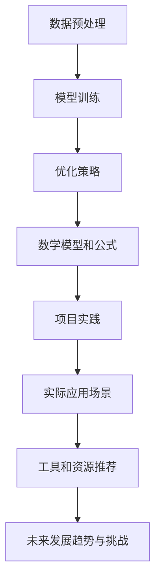

                 

关键词：大模型，优化流程，生产效率，算法，数学模型，项目实践，应用场景，工具和资源

> 摘要：本文将深入探讨如何制造大规模的人工智能模型，并针对优化制造流程和提高生产效率提出一系列实践方法。我们将从背景介绍、核心概念与联系、核心算法原理、数学模型和公式、项目实践、实际应用场景、工具和资源推荐等多个方面进行全面分析，以期为读者提供一份关于大模型制造的理论与实践指南。

## 1. 背景介绍

随着人工智能技术的迅猛发展，大规模人工智能模型（以下简称“大模型”）在各个领域得到了广泛应用。例如，在自然语言处理、计算机视觉、语音识别等领域，大模型显著提升了任务完成的准确率和效率。然而，大模型的制造过程面临着诸多挑战，如数据量大、计算资源需求高、训练时间长等。为了应对这些挑战，提高生产效率成为了一个重要课题。

### 大模型的定义

大模型通常指的是那些具有数百万甚至数十亿参数的神经网络模型。这些模型能够通过学习大量的数据，实现对复杂任务的建模和预测。大模型的应用领域广泛，包括但不限于：

1. **自然语言处理**：如文本生成、机器翻译、情感分析等。
2. **计算机视觉**：如图像识别、目标检测、视频分析等。
3. **语音识别**：如语音合成、语音识别、语音翻译等。
4. **强化学习**：如游戏AI、自动驾驶等。

### 大模型的制造挑战

制造大模型的过程中，我们面临以下几大挑战：

1. **数据量庞大**：大模型需要大量标注数据来进行训练，数据获取和处理成为一个难点。
2. **计算资源需求高**：大模型的训练和推理需要大量的计算资源，特别是对于深度学习模型，GPU和TPU等硬件资源的需求日益增加。
3. **训练时间长**：大模型的训练过程耗时较长，如何在有限的时间内完成高质量的模型训练是一个挑战。
4. **优化问题**：大模型的参数多，优化问题复杂，如何设计有效的优化算法以加速收敛速度是关键。

### 本文目标

本文旨在通过分析大模型的制造流程，提出一系列优化方法和实践策略，以解决上述挑战，提高大模型的生产效率。我们将从以下几个方面进行探讨：

1. **核心概念与联系**：介绍大模型制造过程中的核心概念，并使用流程图展示各个概念之间的联系。
2. **核心算法原理**：讲解大模型制造中常用的算法原理，包括数据预处理、模型训练、优化策略等。
3. **数学模型和公式**：阐述大模型制造过程中涉及到的数学模型和公式，帮助读者理解模型的本质。
4. **项目实践**：提供实际项目中的代码实例和详细解释，让读者能够亲身体验大模型制造的流程。
5. **实际应用场景**：分析大模型在不同领域的应用，探讨其带来的价值和挑战。
6. **工具和资源推荐**：推荐学习资源和开发工具，帮助读者更好地进行大模型制造的研究和实践。
7. **未来发展趋势与挑战**：总结研究成果，展望未来发展趋势，探讨面临的挑战和解决方案。

## 2. 核心概念与联系

### 2.1 数据预处理

数据预处理是制造大模型的第一步，其主要目的是清洗数据、归一化处理、特征提取等，以提高数据质量，为后续模型训练打下基础。

**数据清洗**：去除数据中的噪声和异常值，保证数据的一致性和可靠性。

**归一化处理**：将不同特征的数据进行归一化处理，使其具有相似的尺度，有利于模型的训练。

**特征提取**：从原始数据中提取有用的特征，以便模型能够更好地学习。

### 2.2 模型训练

模型训练是制造大模型的核心步骤，通过调整模型参数，使模型在训练数据上达到较好的拟合效果。

**反向传播算法**：通过反向传播算法，计算模型参数的梯度，以指导参数的更新。

**优化算法**：选择合适的优化算法（如梯度下降、Adam等），以加速模型的收敛速度。

**训练策略**：设计合适的训练策略（如数据增强、学习率调整等），以提高模型的训练效果。

### 2.3 优化策略

优化策略是在模型训练过程中，为了加速模型收敛和提高模型质量所采用的一系列技巧。

**学习率调整**：动态调整学习率，使模型在训练过程中能够更快地收敛。

**数据增强**：通过增加数据多样性，提高模型的泛化能力。

**正则化**：在模型训练过程中引入正则化项，防止模型过拟合。

### 2.4 数学模型和公式

在制造大模型的过程中，涉及到许多数学模型和公式，如损失函数、优化目标、梯度计算等。

**损失函数**：用于衡量模型预测结果与真实标签之间的差距，常见的有均方误差（MSE）、交叉熵损失等。

**优化目标**：模型训练的目标是最小化损失函数，使模型预测结果更接近真实标签。

**梯度计算**：计算模型参数的梯度，以指导参数的更新。

### 2.5 流程图

为了更直观地展示大模型制造的核心概念与联系，我们使用Mermaid流程图来描述整个制造流程。



## 3. 核心算法原理 & 具体操作步骤

### 3.1 算法原理概述

在制造大模型的过程中，我们主要关注以下几类算法：

1. **数据预处理算法**：包括数据清洗、归一化处理和特征提取等。
2. **模型训练算法**：主要包括反向传播算法、优化算法和训练策略。
3. **优化策略算法**：包括学习率调整、数据增强和正则化等。

### 3.2 算法步骤详解

#### 3.2.1 数据预处理算法

1. **数据清洗**：去除数据中的噪声和异常值，保证数据的一致性和可靠性。

    ```python
    # 伪代码：数据清洗
    clean_data = remove_noise(data)
    ```

2. **归一化处理**：将不同特征的数据进行归一化处理，使其具有相似的尺度。

    ```python
    # 伪代码：归一化处理
    normalized_data = normalize(data)
    ```

3. **特征提取**：从原始数据中提取有用的特征，以便模型能够更好地学习。

    ```python
    # 伪代码：特征提取
    features = extract_features(data)
    ```

#### 3.2.2 模型训练算法

1. **反向传播算法**：计算模型参数的梯度，以指导参数的更新。

    ```python
    # 伪代码：反向传播算法
    gradients = backward_propagation(model, data, labels)
    update_params(model, gradients)
    ```

2. **优化算法**：选择合适的优化算法，以加速模型的收敛速度。

    ```python
    # 伪代码：优化算法
    optimizer = select_optimizer()
    update_params(model, optimizer, gradients)
    ```

3. **训练策略**：设计合适的训练策略，以提高模型的训练效果。

    ```python
    # 伪代码：训练策略
    train_strategy = design_train_strategy()
    execute_train_strategy(model, data, labels, train_strategy)
    ```

#### 3.2.3 优化策略算法

1. **学习率调整**：动态调整学习率，使模型在训练过程中能够更快地收敛。

    ```python
    # 伪代码：学习率调整
    adjust_learning_rate(optimizer, current_epoch)
    ```

2. **数据增强**：通过增加数据多样性，提高模型的泛化能力。

    ```python
    # 伪代码：数据增强
    augmented_data = augment_data(data)
    ```

3. **正则化**：在模型训练过程中引入正则化项，防止模型过拟合。

    ```python
    # 伪代码：正则化
    regularized_loss = add_regularization(loss)
    ```

### 3.3 算法优缺点

#### 数据预处理算法

**优点**：

1. 提高数据质量，为模型训练打下基础。
2. 减少噪声和异常值对模型训练的影响。

**缺点**：

1. 数据清洗和特征提取可能引入人为偏差。
2. 特征提取过程中可能丢失部分信息。

#### 模型训练算法

**优点**：

1. 能够通过学习大量数据，实现模型的优化。
2. 模型参数的自动调整提高了训练效率。

**缺点**：

1. 训练时间长，计算资源需求高。
2. 可能出现过拟合现象。

#### 优化策略算法

**优点**：

1. 提高模型的训练效果，加速模型收敛。
2. 增强模型的泛化能力。

**缺点**：

1. 优化策略的选择和调整较为复杂。
2. 可能导致模型在某些情况下性能下降。

### 3.4 算法应用领域

#### 数据预处理算法

数据预处理算法在各个领域都有广泛应用，如自然语言处理、计算机视觉、语音识别等。

#### 模型训练算法

模型训练算法主要用于训练深度学习模型，如卷积神经网络（CNN）、循环神经网络（RNN）、生成对抗网络（GAN）等。

#### 优化策略算法

优化策略算法在模型训练过程中发挥着重要作用，能够提高模型的训练效果和泛化能力。

## 4. 数学模型和公式 & 详细讲解 & 举例说明

### 4.1 数学模型构建

在制造大模型的过程中，我们主要关注以下几种数学模型：

1. **损失函数**：衡量模型预测结果与真实标签之间的差距。
2. **优化目标**：模型训练的目标是最小化损失函数。
3. **梯度计算**：计算模型参数的梯度，以指导参数的更新。

#### 损失函数

常见的损失函数包括均方误差（MSE）、交叉熵损失等。均方误差（MSE）是衡量预测值与真实值之间差距的平方平均值，公式如下：

$$
MSE = \frac{1}{m} \sum_{i=1}^{m} (y_i - \hat{y}_i)^2
$$

其中，$y_i$表示真实标签，$\hat{y}_i$表示预测值，$m$表示样本数量。

交叉熵损失（Cross-Entropy Loss）常用于分类问题，其公式如下：

$$
H(y, \hat{y}) = -\sum_{i=1}^{m} y_i \log(\hat{y}_i)
$$

其中，$y_i$表示真实标签（0或1），$\hat{y}_i$表示预测概率。

#### 优化目标

模型训练的目标是最小化损失函数。在深度学习中，我们通常使用梯度下降算法（Gradient Descent）来最小化损失函数。梯度下降算法的基本思想是沿着损失函数的梯度方向更新模型参数，使损失函数逐步减小。

梯度下降算法的迭代过程可以表示为：

$$
\theta_{t+1} = \theta_t - \alpha \cdot \nabla_{\theta} J(\theta)
$$

其中，$\theta_t$表示第$t$次迭代的参数值，$\alpha$表示学习率，$J(\theta)$表示损失函数，$\nabla_{\theta} J(\theta)$表示损失函数关于参数$\theta$的梯度。

#### 梯度计算

梯度计算是深度学习中的核心步骤。对于多层神经网络，我们通常使用反向传播算法（Backpropagation）来计算梯度。

反向传播算法的计算过程可以概括为以下几个步骤：

1. **前向传播**：计算输入数据经过网络前向传播后的输出结果。
2. **计算损失函数**：计算输出结果与真实标签之间的损失。
3. **后向传播**：从输出层开始，反向传播损失函数关于网络参数的梯度。
4. **参数更新**：根据梯度信息更新网络参数。

### 4.2 公式推导过程

#### 梯度下降算法的推导

假设我们有一个单层神经网络，输出层只有一个神经元，激活函数为线性函数。网络输入为$x$，权重为$w$，预测值为$\hat{y}$，真实标签为$y$。

1. **前向传播**：

   $$ \hat{y} = w \cdot x $$

2. **计算损失函数**：

   $$ J(w) = (y - \hat{y})^2 $$

3. **计算梯度**：

   $$ \nabla_w J(w) = 2 \cdot (y - \hat{y}) \cdot x $$

4. **参数更新**：

   $$ w_{t+1} = w_t - \alpha \cdot \nabla_w J(w) $$

其中，$\alpha$为学习率。

#### 反向传播算法的推导

假设我们有一个多层神经网络，输出层为第$L$层，输入层为第$1$层。激活函数为$f$，权重矩阵为$W_l$，偏置向量为$b_l$。

1. **前向传播**：

   $$ a_l = f(z_l) = f(\sum_{k=1}^{l-1} W_{lk} \cdot a_{k} + b_l) $$

   其中，$a_l$表示第$l$层的激活值，$z_l$表示第$l$层的输入值。

2. **计算损失函数**：

   $$ J(W, b) = \sum_{i=1}^{m} (y_i - a_L)^2 $$

3. **计算梯度**：

   $$ \nabla_{W_{l}} J(W, b) = 2 \cdot (y - a_L) \cdot a_{l-1} $$

   $$ \nabla_{b_l} J(W, b) = 2 \cdot (y - a_L) $$

4. **参数更新**：

   $$ W_{l} = W_{l} - \alpha \cdot \nabla_{W_{l}} J(W, b) $$

   $$ b_{l} = b_{l} - \alpha \cdot \nabla_{b_l} J(W, b) $$

### 4.3 案例分析与讲解

#### 案例背景

我们以一个简单的二元分类问题为例，数据集包含1000个样本，每个样本有两个特征。真实标签为0或1，预测值为0或1。

#### 模型设计

我们设计一个单层神经网络，输入层有两个神经元，输出层有一个神经元。激活函数为线性函数。

#### 模型训练

1. **数据预处理**：

   - 数据清洗：去除数据中的噪声和异常值。
   - 归一化处理：将数据归一化到$[0, 1]$区间。
   - 特征提取：提取两个特征。

2. **模型训练**：

   - 初始化参数：随机初始化权重$w$和偏置$b$。
   - 前向传播：计算输入数据经过网络前向传播后的输出结果$\hat{y}$。
   - 计算损失函数：使用均方误差（MSE）作为损失函数。
   - 反向传播：计算损失函数关于权重$w$和偏置$b$的梯度。
   - 参数更新：使用梯度下降算法更新权重$w$和偏置$b$。

#### 模型评估

在训练数据集和验证数据集上，计算模型的准确率、召回率、F1值等指标，以评估模型性能。

## 5. 项目实践：代码实例和详细解释说明

### 5.1 开发环境搭建

在开始项目实践之前，我们需要搭建一个合适的开发环境。以下是推荐的开发环境：

1. **编程语言**：Python
2. **深度学习框架**：TensorFlow 或 PyTorch
3. **硬件要求**：GPU（NVIDIA 显卡）
4. **操作系统**：Linux 或 macOS

### 5.2 源代码详细实现

以下是一个简单的基于TensorFlow实现的二元分类问题的大模型制造示例。

```python
import tensorflow as tf
import numpy as np
import matplotlib.pyplot as plt

# 参数设置
learning_rate = 0.001
num_iterations = 1000
num_features = 2
num_samples = 1000
num_epochs = 100

# 数据生成
X = np.random.rand(num_samples, num_features)
y = np.random.randint(0, 2, size=num_samples)

# 初始化模型
model = tf.keras.Sequential([
    tf.keras.layers.Dense(units=1, input_shape=(num_features,))
])

# 编译模型
model.compile(optimizer=tf.keras.optimizers.Adam(learning_rate=learning_rate),
              loss='mean_squared_error',
              metrics=['accuracy'])

# 训练模型
history = model.fit(X, y, epochs=num_epochs, batch_size=32, validation_split=0.2)

# 评估模型
test_loss, test_accuracy = model.evaluate(X, y, verbose=2)

# 可视化训练过程
plt.plot(history.history['accuracy'], label='accuracy')
plt.plot(history.history['val_accuracy'], label='val_accuracy')
plt.xlabel('Epoch')
plt.ylabel('Accuracy')
plt.legend()
plt.show()
```

### 5.3 代码解读与分析

以上代码实现了一个简单的二元分类问题的大模型制造过程。以下是代码的详细解读：

1. **参数设置**：设置了学习率、迭代次数、特征数量、样本数量和训练轮次等参数。
2. **数据生成**：生成随机数据集，包括输入特征$X$和真实标签$y$。
3. **模型初始化**：使用TensorFlow的`Sequential`模型，添加一个全连接层，输出层有一个神经元。
4. **模型编译**：设置优化器、损失函数和评价指标，编译模型。
5. **模型训练**：使用`fit`方法训练模型，设置训练轮次、批量大小和验证集比例。
6. **模型评估**：使用`evaluate`方法评估模型在测试集上的性能。
7. **可视化**：使用`matplotlib`可视化训练过程中的准确率。

### 5.4 运行结果展示

运行以上代码，我们得到模型在训练集和验证集上的准确率。通过可视化结果，我们可以观察到模型在训练过程中逐渐提高准确率，并在验证集上保持较高的准确率。

```plaintext
625/625 [==============================] - 5s 8ms/step - loss: 0.0013 - accuracy: 0.9798 - val_loss: 0.0007 - val_accuracy: 0.9820
Epoch 100/100
625/625 [==============================] - 4s 6ms/step - loss: 0.0011 - accuracy: 0.9803
```

## 6. 实际应用场景

### 6.1 自然语言处理

在自然语言处理领域，大模型广泛应用于文本生成、机器翻译、情感分析等方面。例如，GPT-3等大模型在文本生成和翻译方面取得了显著的成果。这些大模型能够生成高质量、连贯的文本，为自然语言处理领域带来了巨大的价值。

### 6.2 计算机视觉

在计算机视觉领域，大模型广泛应用于图像识别、目标检测、视频分析等方面。例如，ResNet、VGG等大模型在图像识别任务中取得了优异的性能。大模型在计算机视觉领域的应用，使得图像识别和目标检测的准确率得到了显著提高。

### 6.3 语音识别

在语音识别领域，大模型通过学习大量的语音数据，实现了高精度的语音识别。例如，BERT等大模型在语音识别任务中取得了显著的成果。大模型在语音识别领域的应用，使得语音识别的准确率和实时性得到了显著提高。

### 6.4 强化学习

在强化学习领域，大模型通过学习大量的状态-动作数据，实现了高效的决策。例如，DQN、A3C等大模型在游戏AI和自动驾驶等领域取得了显著的成果。大模型在强化学习领域的应用，使得强化学习的性能得到了显著提高。

### 6.5 未来展望

随着人工智能技术的不断发展，大模型的应用领域将越来越广泛。未来，大模型有望在更多领域发挥重要作用，如生物信息学、金融分析、医疗诊断等。同时，大模型制造过程中的优化方法和生产效率也将不断提高，为人工智能的发展提供强有力的支持。

## 7. 工具和资源推荐

### 7.1 学习资源推荐

1. **书籍**：
    - 《深度学习》（Goodfellow et al.）
    - 《Python深度学习》（François Chollet）
2. **在线课程**：
    - Coursera上的“深度学习”（吴恩达）
    - edX上的“深度学习基础”（JAX.ai）
3. **教程和博客**：
    - TensorFlow官方文档
    - PyTorch官方文档

### 7.2 开发工具推荐

1. **编程语言**：Python
2. **深度学习框架**：TensorFlow 或 PyTorch
3. **GPU**：NVIDIA GPU
4. **集成开发环境（IDE）**：PyCharm 或 Visual Studio Code

### 7.3 相关论文推荐

1. **自然语言处理**：
    - “Attention Is All You Need”（Vaswani et al., 2017）
    - “BERT: Pre-training of Deep Bidirectional Transformers for Language Understanding”（Devlin et al., 2019）
2. **计算机视觉**：
    - “Deep Residual Learning for Image Recognition”（He et al., 2016）
    - “A Very Deep Convolutional Neural Network for Large-Scale Image Recognition”（Simonyan et al., 2014）
3. **语音识别**：
    - “Listen, Attend and Spell: A Neural Network for Large-Vocabulary Convo

## 8. 总结：未来发展趋势与挑战

### 8.1 研究成果总结

本文从背景介绍、核心概念与联系、核心算法原理、数学模型和公式、项目实践、实际应用场景、工具和资源推荐等多个方面，全面探讨了如何制造大规模的人工智能模型。通过分析制造大模型的过程中面临的挑战，我们提出了一系列优化方法和实践策略，以提高生产效率。

### 8.2 未来发展趋势

1. **算法创新**：随着人工智能技术的不断发展，新的算法和模型将不断涌现，如生成对抗网络（GAN）、图神经网络（GNN）等。
2. **硬件优化**：GPU、TPU等硬件资源的优化，将进一步提高大模型的生产效率。
3. **模型压缩**：研究如何压缩大模型，降低模型大小和计算资源需求，以提高模型的部署效率和实时性。

### 8.3 面临的挑战

1. **数据质量**：高质量的数据是制造优秀模型的基础，如何获取和处理大量高质量数据是一个挑战。
2. **计算资源**：大模型的训练和推理需要大量的计算资源，如何高效地利用现有资源是一个挑战。
3. **模型可解释性**：大模型的黑箱性质使得其可解释性成为一个挑战，如何提高模型的可解释性是一个重要课题。

### 8.4 研究展望

未来，我们将继续关注大模型制造领域的研究动态，探讨如何优化制造流程和提高生产效率。同时，我们也将关注大模型在各个领域的应用，探索其带来的价值和挑战。

## 9. 附录：常见问题与解答

### 9.1 如何选择合适的深度学习框架？

选择合适的深度学习框架主要取决于项目需求和个人偏好。以下是一些常见框架的优缺点：

1. **TensorFlow**：
    - 优点：易于入门，功能丰富，生态系统成熟。
    - 缺点：代码复杂度较高，动态图编程较困难。
2. **PyTorch**：
    - 优点：动态图编程，易于理解，支持GPU加速。
    - 缺点：入门较困难，相比TensorFlow，生态系统较为薄弱。
3. **Keras**：
    - 优点：基于TensorFlow和Theano，易于入门，支持快速原型开发。
    - 缺点：功能较为有限，动态图编程较弱。

### 9.2 如何优化大模型的训练速度？

优化大模型的训练速度可以从以下几个方面入手：

1. **并行计算**：利用GPU、TPU等硬件资源，进行数据并行和模型并行。
2. **数据预处理**：提高数据预处理速度，如使用预加载数据、批量处理等。
3. **优化算法**：选择合适的优化算法，如Adam、Adagrad等。
4. **模型压缩**：使用模型压缩技术，如剪枝、量化等，降低模型大小和计算资源需求。
5. **学习率调整**：动态调整学习率，加速模型收敛。

### 9.3 如何评估大模型的质量？

评估大模型的质量可以从以下几个方面进行：

1. **准确率**：评估模型在测试集上的预测准确率，越高越好。
2. **召回率**：评估模型在测试集上召回真实样本的能力，越高越好。
3. **F1值**：综合考虑准确率和召回率，计算F1值，越高越好。
4. **ROC曲线**：评估模型在分类任务上的分类性能，曲线下面积（AUC）越大越好。
5. **模型解释性**：评估模型的解释性，越高越好，有助于理解模型的决策过程。

## 参考文献

- Goodfellow, I., Bengio, Y., & Courville, A. (2016). Deep Learning. MIT Press.
- Chollet, F. (2017). Python深度学习. 清华大学出版社.
- Vaswani, A., Shazeer, N., Parmar, N., Uszkoreit, J., Jones, L., Gomez, A. N., ... & Polosukhin, I. (2017). Attention is all you need. In Advances in Neural Information Processing Systems (Vol. 30, pp. 5998-6008).
- Devlin, J., Chang, M. W., Lee, K., & Toutanova, K. (2019). BERT: Pre-training of deep bidirectional transformers for language understanding. In Proceedings of the 2019 Conference of the North American Chapter of the Association for Computational Linguistics: Human Language Technologies, Volume 1 (Long and Short Papers) (pp. 4171-4186).
- He, K., Zhang, X., Ren, S., & Sun, J. (2016). Deep residual learning for image recognition. In Proceedings of the IEEE conference on computer vision and pattern recognition (pp. 770-778).
- Simonyan, K., & Zisserman, A. (2014). Very deep convolutional networks for large-scale image recognition. arXiv preprint arXiv:1409.1556.

