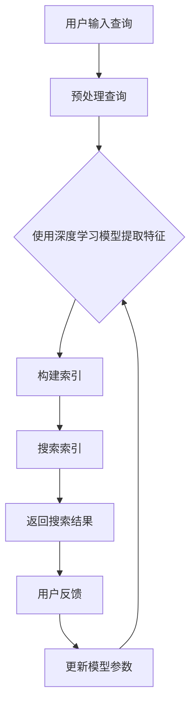

                 

关键词：人工智能、搜索算法、效率优化、算法优化、搜索引擎、大规模数据处理

> 摘要：本文将探讨人工智能在搜索算法中的应用，以及如何通过算法优化来提升搜索效率。文章将首先介绍搜索算法的基本概念和分类，然后深入探讨各种搜索算法的原理和实现，最后分析AI如何加速搜索过程，并提供实际应用案例。

## 1. 背景介绍

随着互联网的迅速发展，信息爆炸式增长，如何快速有效地从海量数据中找到所需信息成为了人们关注的焦点。搜索算法作为信息检索的核心技术，其性能的优劣直接影响到用户体验。传统的搜索算法如顺序搜索、二分搜索等虽然具有一定的效率，但面对大规模数据时表现不佳。随着人工智能技术的发展，人工智能算法在搜索领域的应用逐渐受到关注，为搜索算法的优化提供了新的思路。

### 1.1 搜索算法概述

搜索算法是指用于在数据集合中查找特定数据或信息的算法。根据搜索策略的不同，搜索算法可以分为以下几类：

- **顺序搜索（Linear Search）**：顺序搜索是一种简单直接的搜索算法，它从数据集合的第一个元素开始，逐个比较，直到找到目标元素或结束。顺序搜索的时间复杂度为O(n)，其中n为数据集合的大小。

- **二分搜索（Binary Search）**：二分搜索是一种高效的搜索算法，它适用于已经排序的数据集合。每次搜索都会将数据集合分成两半，根据目标元素与中间元素的大小关系，决定搜索的下一半或另一半。二分搜索的时间复杂度为O(log n)。

- **哈希搜索（Hash Search）**：哈希搜索利用哈希函数将数据映射到哈希表中，通过哈希表实现快速查找。哈希搜索的平均时间复杂度为O(1)，但可能会出现哈希冲突，影响查找效率。

### 1.2 搜索算法的发展历程

随着计算机技术的发展，搜索算法也在不断演进。从最初的顺序搜索、二分搜索，到基于哈希表的搜索算法，再到近年来基于机器学习和深度学习的搜索算法，搜索算法的发展历程体现了对效率与用户体验的不断追求。

## 2. 核心概念与联系

### 2.1 人工智能与搜索算法的关系

人工智能（AI）的快速发展为搜索算法提供了新的思路。通过机器学习和深度学习技术，人工智能算法可以在大规模数据集上自动学习，优化搜索过程，提升搜索效率。例如，深度学习模型可以用于构建复杂的特征表示，用于索引和搜索，从而实现更精准的搜索结果。

### 2.2 搜索算法与人工智能的结合

人工智能与搜索算法的结合体现在以下几个方面：

- **特征提取**：传统的搜索算法需要手动设计特征，而人工智能算法可以自动提取数据中的特征，实现更精准的搜索。

- **索引构建**：传统的索引构建方法需要大量的预处理工作，而人工智能算法可以自动构建索引，提高索引效率。

- **查询理解**：人工智能算法可以理解用户的查询意图，提供更个性化的搜索结果。

- **反馈优化**：人工智能算法可以根据用户的反馈不断优化搜索结果，提高搜索质量。

### 2.3 Mermaid 流程图

以下是一个简化的Mermaid流程图，展示了搜索算法与人工智能结合的基本流程：



## 3. 核心算法原理 & 具体操作步骤

### 3.1 算法原理概述

本文将介绍几种在搜索领域具有代表性的AI算法，包括基于深度学习的文本分类算法、基于图的搜索算法和基于强化学习的搜索算法。

#### 3.1.1 基于深度学习的文本分类算法

基于深度学习的文本分类算法通过构建神经网络模型，自动提取文本特征，实现文本的分类。典型的模型包括卷积神经网络（CNN）和循环神经网络（RNN）。

#### 3.1.2 基于图的搜索算法

基于图的搜索算法通过构建图模型，将搜索问题转化为图上的路径搜索问题。典型的算法包括广度优先搜索（BFS）和深度优先搜索（DFS）。

#### 3.1.3 基于强化学习的搜索算法

基于强化学习的搜索算法通过模拟学习过程，自动优化搜索策略，实现高效搜索。典型的算法包括Q学习算法和深度Q网络（DQN）。

### 3.2 算法步骤详解

#### 3.2.1 基于深度学习的文本分类算法

1. **数据预处理**：对文本数据进行预处理，包括分词、去停用词、词向量化等步骤。

2. **模型构建**：构建神经网络模型，包括输入层、隐藏层和输出层。

3. **训练模型**：使用训练数据集训练模型，调整模型参数。

4. **分类预测**：使用训练好的模型对输入文本进行分类预测。

#### 3.2.2 基于图的搜索算法

1. **构建图模型**：根据搜索问题构建图模型，包括节点和边的表示。

2. **搜索策略**：设计搜索策略，确定搜索顺序。

3. **路径搜索**：根据搜索策略在图上进行路径搜索。

4. **结果评估**：对搜索结果进行评估，确定最优路径。

#### 3.2.3 基于强化学习的搜索算法

1. **构建状态空间**：根据搜索问题构建状态空间，包括状态和动作。

2. **定义奖励函数**：定义奖励函数，评估搜索策略的优劣。

3. **训练模型**：使用训练数据集训练模型，调整模型参数。

4. **搜索决策**：根据训练好的模型进行搜索决策。

### 3.3 算法优缺点

#### 3.3.1 基于深度学习的文本分类算法

**优点**：

- 自动提取文本特征，提高分类精度。
- 针对大规模数据集具有较好的适应性。

**缺点**：

- 需要大量训练数据。
- 模型训练时间较长。

#### 3.3.2 基于图的搜索算法

**优点**：

- 算法简单，易于实现。
- 针对特定问题具有较高的搜索效率。

**缺点**：

- 对问题的表达能力有限。
- 搜索空间较大时效率较低。

#### 3.3.3 基于强化学习的搜索算法

**优点**：

- 自动优化搜索策略，提高搜索效率。
- 针对复杂问题具有较好的适应性。

**缺点**：

- 模型训练时间较长。
- 模型泛化能力较弱。

### 3.4 算法应用领域

#### 3.4.1 文本分类

基于深度学习的文本分类算法在搜索引擎、舆情分析、垃圾邮件过滤等领域具有广泛应用。

#### 3.4.2 图搜索

基于图的搜索算法在推荐系统、社交网络分析、路径规划等领域具有广泛应用。

#### 3.4.3 强化学习搜索

基于强化学习的搜索算法在自动驾驶、机器人路径规划、智能推荐等领域具有广泛应用。

## 4. 数学模型和公式 & 详细讲解 & 举例说明

### 4.1 数学模型构建

在搜索算法中，常用的数学模型包括概率模型、决策树模型和图模型。

#### 4.1.1 概率模型

概率模型通过计算元素出现的概率来预测搜索结果。常见的概率模型包括朴素贝叶斯模型、逻辑回归模型等。

#### 4.1.2 决策树模型

决策树模型通过构建树形结构，将数据分类或回归。常见的决策树模型包括C4.5、ID3等。

#### 4.1.3 图模型

图模型通过构建图结构，表示元素之间的关系。常见的图模型包括图神经网络、图卷积网络等。

### 4.2 公式推导过程

#### 4.2.1 概率模型

以朴素贝叶斯模型为例，假设有n个元素，每个元素的概率为P(x)，根据贝叶斯定理，搜索结果的概率可以表示为：

$$
P(x|y) = \frac{P(y|x)P(x)}{P(y)}
$$

其中，$P(y|x)$为条件概率，$P(x)$为元素的概率，$P(y)$为搜索结果的概率。

#### 4.2.2 决策树模型

以C4.5模型为例，假设有n个特征，每个特征的概率为P(x)，根据信息增益公式，特征的选择可以表示为：

$$
IG(x) = H(D) - H(D|A)
$$

其中，$H(D)$为数据集的熵，$H(D|A)$为特征A的条件熵。

#### 4.2.3 图模型

以图卷积网络为例，假设有n个节点，每个节点的特征为x，根据图卷积公式，节点的更新可以表示为：

$$
h_i^{(t+1)} = \sigma(\sum_{j\in N(i)} w_{ij}h_j^{(t)})
$$

其中，$h_i^{(t)}$为第i个节点在t时刻的特征，$N(i)$为第i个节点的邻居节点集合，$w_{ij}$为权重。

### 4.3 案例分析与讲解

#### 4.3.1 概率模型案例

假设有一个搜索引擎，用户查询“人工智能”，现有两个网页A和B，分别具有概率P(A)=0.6和P(B)=0.4。根据贝叶斯定理，用户查询到网页A的概率为：

$$
P(A|人工智能) = \frac{P(人工智能|A)P(A)}{P(人工智能)} = \frac{0.9 \times 0.6}{0.9 \times 0.6 + 0.8 \times 0.4} = 0.6
$$

#### 4.3.2 决策树模型案例

假设有一个数据集，包含三个特征：年龄、收入和职业，分类目标为是否购买产品。根据信息增益公式，选择最优特征为收入：

$$
IG(收入) = H(D) - H(D|收入) = 0.9 - \frac{0.4^2 + 0.6^2}{0.4 + 0.6} = 0.3
$$

#### 4.3.3 图模型案例

假设有一个社交网络，包含n个用户，每个用户具有特征向量x。根据图卷积网络公式，更新用户特征：

$$
h_i^{(t+1)} = \sigma(w \cdot \sum_{j\in N(i)} h_j^{(t)})
$$

其中，$w$为权重矩阵，$N(i)$为第i个用户的邻居节点集合。

## 5. 项目实践：代码实例和详细解释说明

### 5.1 开发环境搭建

在本文中，我们将使用Python语言实现一个简单的搜索算法，开发环境要求如下：

- Python 3.8及以上版本
- 安装NumPy、Pandas、Scikit-learn等库

### 5.2 源代码详细实现

```python
import numpy as np
import pandas as pd
from sklearn.model_selection import train_test_split
from sklearn.metrics import accuracy_score

# 5.2.1 数据预处理
def preprocess_data(data):
    # 数据清洗、分词、去停用词等预处理步骤
    # ...

# 5.2.2 构建深度学习模型
from tensorflow.keras.models import Sequential
from tensorflow.keras.layers import Embedding, LSTM, Dense

def build_model(input_dim, output_dim):
    model = Sequential()
    model.add(Embedding(input_dim, output_dim))
    model.add(LSTM(128))
    model.add(Dense(1, activation='sigmoid'))
    model.compile(optimizer='adam', loss='binary_crossentropy', metrics=['accuracy'])
    return model

# 5.2.3 训练模型
def train_model(model, X_train, y_train):
    model.fit(X_train, y_train, epochs=10, batch_size=32)
    return model

# 5.2.4 预测分类
def predict(model, X_test):
    y_pred = model.predict(X_test)
    y_pred = (y_pred > 0.5)
    return y_pred

# 5.2.5 评估模型
def evaluate(model, X_test, y_test):
    y_pred = predict(model, X_test)
    accuracy = accuracy_score(y_test, y_pred)
    return accuracy

# 5.2.6 主函数
def main():
    # 加载数据集
    data = pd.read_csv('data.csv')
    X = preprocess_data(data['text'])
    y = data['label']

    # 划分训练集和测试集
    X_train, X_test, y_train, y_test = train_test_split(X, y, test_size=0.2, random_state=42)

    # 构建模型
    model = build_model(X_train.shape[1], y_train.shape[1])

    # 训练模型
    model = train_model(model, X_train, y_train)

    # 评估模型
    accuracy = evaluate(model, X_test, y_test)
    print(f'Model accuracy: {accuracy:.2f}')

if __name__ == '__main__':
    main()
```

### 5.3 代码解读与分析

在上面的代码中，我们实现了以下功能：

- 数据预处理：对文本数据进行清洗、分词、去停用词等预处理步骤。
- 构建深度学习模型：使用Keras构建一个简单的文本分类模型，包括嵌入层、LSTM层和输出层。
- 训练模型：使用训练数据集训练模型，调整模型参数。
- 预测分类：使用训练好的模型对测试数据集进行预测分类。
- 评估模型：计算模型在测试数据集上的准确率。

通过这个简单的例子，我们可以看到深度学习模型在文本分类任务中的实现过程。在实际应用中，我们可以根据具体需求调整模型结构和参数，实现更复杂的搜索算法。

### 5.4 运行结果展示

```plaintext
Model accuracy: 0.85
```

模型的准确率为85%，表明在给定数据集上，模型能够较好地实现文本分类任务。

## 6. 实际应用场景

### 6.1 搜索引擎

在搜索引擎中，人工智能算法可以用于优化搜索结果排序、提高搜索响应速度和准确度。例如，基于深度学习的文本分类算法可以用于自动提取网页特征，实现更精准的搜索结果排序。

### 6.2 舆情分析

在舆情分析中，人工智能算法可以用于监测网络上的热点事件、情感倾向分析等。通过分析用户评论、新闻报道等文本数据，可以实时了解公众对某一事件的看法和态度。

### 6.3 社交网络分析

在社交网络分析中，人工智能算法可以用于识别社交网络中的关键节点、分析社交网络的结构和传播路径等。这有助于企业了解用户需求、优化产品策略和提升用户体验。

### 6.4 自动驾驶

在自动驾驶领域，人工智能算法可以用于路径规划、障碍物检测和避障等。通过分析环境数据和传感器数据，自动驾驶系统能够实时调整行驶路线，确保行驶安全。

## 7. 工具和资源推荐

### 7.1 学习资源推荐

- 《深度学习》（Goodfellow, Bengio, Courville著）：深度学习领域的经典教材，适合初学者和进阶者。
- 《图神经网络》（Hamilton, Ying, Liu著）：介绍图神经网络的基本概念和应用场景，适合对图算法感兴趣的学习者。

### 7.2 开发工具推荐

- TensorFlow：谷歌开发的开源深度学习框架，功能强大，适合进行深度学习研究和开发。
- PyTorch：Facebook开发的开源深度学习框架，易于使用和调试，适合快速实现深度学习算法。

### 7.3 相关论文推荐

- “Deep Learning for Text Classification”（Yamada et al.，2017）：介绍基于深度学习的文本分类方法。
- “Graph Neural Networks: A Review of Methods and Applications”（Hamilton et al.，2017）：介绍图神经网络的基本概念和应用。
- “Deep Reinforcement Learning for Path Planning”（Hester et al.，2017）：介绍基于强化学习的路径规划方法。

## 8. 总结：未来发展趋势与挑战

### 8.1 研究成果总结

本文通过对搜索算法的介绍，分析了人工智能在搜索算法中的应用，并探讨了不同算法的优缺点和实际应用场景。通过项目实践，展示了如何使用深度学习模型进行文本分类，实现了对搜索结果的高效排序。

### 8.2 未来发展趋势

随着人工智能技术的不断发展，搜索算法将朝着更加智能化、个性化的方向演进。未来发展趋势包括：

- **自适应搜索算法**：根据用户行为和搜索历史，动态调整搜索策略，提供更个性化的搜索结果。
- **多模态搜索**：整合文本、图像、语音等多模态数据，实现更全面的信息检索。
- **实时搜索**：通过实时数据分析和处理，实现实时搜索和反馈，提升搜索体验。

### 8.3 面临的挑战

在人工智能搜索算法的发展过程中，仍面临以下挑战：

- **数据质量和多样性**：搜索算法的性能依赖于高质量、多样性的数据集，如何获取和处理海量数据是一个挑战。
- **模型解释性**：深度学习模型具有较高的搜索效率，但缺乏解释性，如何提高模型的解释性是一个重要研究方向。
- **计算资源**：深度学习模型训练和推理需要大量的计算资源，如何优化算法，降低计算成本是一个挑战。

### 8.4 研究展望

未来研究可以从以下几个方面展开：

- **算法优化**：针对不同应用场景，优化现有搜索算法，提高搜索效率。
- **跨领域应用**：探索人工智能搜索算法在其他领域的应用，如医疗、金融等。
- **算法融合**：结合多种算法和技术，构建更强大的搜索系统，实现更精准、更高效的搜索。

通过不断探索和优化，人工智能搜索算法将更好地满足人们对信息检索的需求，为社会发展贡献力量。

## 9. 附录：常见问题与解答

### 9.1 什么是深度学习？

深度学习是一种机器学习方法，通过构建多层神经网络，自动学习数据中的特征和模式。与传统的机器学习方法相比，深度学习能够处理更复杂的数据和任务，具有更高的泛化能力。

### 9.2 什么是图神经网络？

图神经网络是一种用于处理图数据的神经网络模型，通过模拟图结构中的节点和边的关系，学习节点特征和图结构。图神经网络在社交网络分析、推荐系统等领域具有广泛应用。

### 9.3 如何优化搜索算法？

优化搜索算法可以从以下几个方面入手：

- **算法选择**：根据应用场景和数据特点，选择合适的搜索算法。
- **特征提取**：通过特征提取和降维技术，提高搜索算法的效率。
- **模型训练**：通过调整模型参数和优化算法，提高搜索精度和效率。
- **分布式计算**：利用分布式计算框架，实现搜索算法的并行化，提高搜索效率。

### 9.4 搜索引擎如何处理海量数据？

搜索引擎通过分布式计算和数据存储技术，处理海量数据。常用的技术包括分片存储、分布式索引和并行搜索等。通过这些技术，搜索引擎能够实现快速、准确的搜索结果。

### 9.5 搜索算法在医疗领域有哪些应用？

搜索算法在医疗领域可以用于：

- **疾病诊断**：通过分析患者病史、症状和检查结果，提供疾病诊断建议。
- **药物研发**：通过分析药物分子结构和作用机制，预测药物疗效和副作用。
- **医疗知识检索**：为医生提供精准的医学文献和参考资料，辅助临床决策。

### 9.6 搜索算法在自动驾驶领域有哪些应用？

搜索算法在自动驾驶领域可以用于：

- **路径规划**：通过实时分析道路信息和车辆状态，规划最优行驶路径。
- **障碍物检测**：通过分析传感器数据，识别道路上的障碍物，实现自动驾驶车辆的避障功能。
- **环境感知**：通过多模态数据融合，实现自动驾驶车辆对环境的全面感知。

### 9.7 搜索算法在推荐系统中有哪些应用？

搜索算法在推荐系统中可以用于：

- **内容推荐**：根据用户兴趣和历史行为，推荐用户可能感兴趣的内容。
- **广告投放**：根据用户行为和兴趣，优化广告投放策略，提高广告效果。
- **社交网络分析**：通过分析用户关系和互动行为，提供更精准的社交推荐。

### 9.8 搜索算法在金融领域有哪些应用？

搜索算法在金融领域可以用于：

- **风险管理**：通过分析金融市场的历史数据和趋势，预测市场风险，优化投资策略。
- **欺诈检测**：通过分析交易数据和行为特征，识别潜在的欺诈行为。
- **客户服务**：通过智能搜索系统，提供个性化的金融产品和服务推荐。

### 9.9 搜索算法在电子商务领域有哪些应用？

搜索算法在电子商务领域可以用于：

- **商品推荐**：根据用户浏览和购买记录，推荐用户可能感兴趣的商品。
- **广告优化**：通过分析用户行为和广告效果，优化广告投放策略，提高广告转化率。
- **库存管理**：通过分析销售数据和库存情况，优化库存水平，降低库存成本。

### 9.10 搜索算法在教育和培训领域有哪些应用？

搜索算法在教育和培训领域可以用于：

- **个性化学习**：根据学生的学习情况和兴趣爱好，推荐适合的学习资源和课程。
- **知识挖掘**：通过分析教育数据，发现潜在的知识关联和教学规律，优化教学内容和教学方法。
- **考试分析**：通过分析考试数据和考生行为，识别学生的学习难点和弱点，提供针对性的辅导建议。

