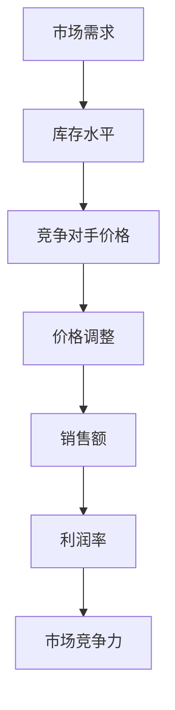

                 

关键词：电商，动态定价，算法，应用，数学模型，案例分析

## 摘要

本文将探讨动态定价策略在电商行业中的应用，分析其核心概念、算法原理以及数学模型。我们将通过实际项目实践，深入解析动态定价策略的代码实现及其运行效果，最后对其实际应用场景进行探讨，并对未来发展趋势与挑战进行展望。

## 1. 背景介绍

随着互联网技术的发展，电商行业迎来了前所未有的繁荣。然而，在竞争激烈的市场中，电商企业如何优化定价策略，提高销售额和客户满意度，成为了一项关键任务。动态定价策略作为一种智能化的定价方式，可以在不同市场环境和竞争态势下，实现价格的最优化。本文将围绕动态定价策略在电商中的应用进行深入探讨。

### 1.1 动态定价策略的定义

动态定价策略是指根据市场需求、库存水平、竞争对手价格等因素，实时调整商品价格的一种定价方式。与传统的静态定价策略相比，动态定价策略具有更高的灵活性和适应性，能够更好地应对市场变化。

### 1.2 动态定价策略的优势

- 提高销售额：通过实时调整价格，动态定价策略能够更好地满足消费者需求，提高购买意愿，从而提高销售额。
- 提高利润率：动态定价策略可以根据市场需求和库存情况，优化价格策略，提高利润率。
- 提高市场竞争力：动态定价策略能够更好地应对竞争对手的定价策略，提高市场竞争力。

## 2. 核心概念与联系

在深入探讨动态定价策略之前，我们需要了解一些核心概念，如图算法、供应链管理等。以下是动态定价策略相关核心概念及其联系：

### 2.1 图算法

图算法是解决复杂问题的一种重要方法。在动态定价策略中，我们可以使用图算法来分析市场需求和库存变化，从而优化价格策略。

### 2.2 供应链管理

供应链管理是电商行业的重要组成部分。通过供应链管理，我们可以获取市场信息和竞争对手信息，为动态定价策略提供数据支持。

### 2.3 数据分析

数据分析是动态定价策略的基础。通过对大量数据进行分析，我们可以识别市场趋势和消费者行为，为价格调整提供依据。

下面是动态定价策略相关核心概念原理和架构的 Mermaid 流程图：



## 3. 核心算法原理 & 具体操作步骤

### 3.1 算法原理概述

动态定价策略的核心是利用算法对市场价格进行实时调整。具体来说，算法原理可以分为以下几个步骤：

1. 数据采集：通过数据采集工具获取市场需求、库存水平、竞争对手价格等数据。
2. 数据分析：对采集到的数据进行分析，识别市场趋势和消费者行为。
3. 价格预测：根据分析结果，预测未来的市场价格。
4. 价格调整：根据价格预测结果，实时调整商品价格。

### 3.2 算法步骤详解

以下是动态定价策略的具体操作步骤：

1. **数据采集**：
   - 使用爬虫技术获取电商平台上的商品价格、销量、用户评价等数据。
   - 通过API接口获取竞争对手的价格信息。

2. **数据分析**：
   - 使用数据分析工具，对采集到的数据进行分析，识别市场趋势和消费者行为。
   - 建立数据模型，预测未来的市场需求。

3. **价格预测**：
   - 使用预测算法，如ARIMA、LSTM等，对市场价格进行预测。
   - 根据预测结果，确定商品的最佳价格。

4. **价格调整**：
   - 根据预测结果，实时调整商品价格。
   - 设置价格调整阈值，如价格波动范围、价格调整频率等。

### 3.3 算法优缺点

**优点**：

- 提高销售额：动态定价策略能够根据市场需求和库存情况，实时调整价格，提高销售额。
- 提高利润率：通过优化价格策略，动态定价策略能够提高利润率。
- 提高市场竞争力：动态定价策略能够更好地应对竞争对手的定价策略，提高市场竞争力。

**缺点**：

- 数据依赖性：动态定价策略的准确性依赖于数据的质量和实时性，数据采集和处理不当可能导致价格调整失误。
- 技术门槛：动态定价策略需要使用复杂的算法和数据分析技术，对技术团队的要求较高。

### 3.4 算法应用领域

动态定价策略在电商行业中的应用非常广泛，如：

- 商品价格调整：根据市场需求和库存情况，实时调整商品价格。
- 促销活动定价：在促销活动期间，根据活动目标和市场需求，优化促销价格。
- 库存管理：通过动态定价策略，合理调整库存，避免库存积压。

## 4. 数学模型和公式

### 4.1 数学模型构建

动态定价策略的数学模型主要包括价格预测模型和利润最大化模型。以下是这两个模型的构建方法：

**价格预测模型**：

\[ P_t = P_{t-1} + \alpha \cdot (D_t - D_{t-1}) \]

其中，\( P_t \) 表示第 \( t \) 个月的市场价格，\( P_{t-1} \) 表示第 \( t-1 \) 个月的市场价格，\( \alpha \) 表示价格调整系数，\( D_t \) 表示第 \( t \) 个月的销量。

**利润最大化模型**：

\[ \max P_t \cdot Q_t - C_t \]

其中，\( P_t \) 表示第 \( t \) 个月的市场价格，\( Q_t \) 表示第 \( t \) 个月的销量，\( C_t \) 表示第 \( t \) 个月的生产成本。

### 4.2 公式推导过程

**价格预测模型**：

价格预测模型是基于历史数据对未来市场价格进行预测。我们使用线性回归模型进行预测，假设市场价格与销量之间存在线性关系。

\[ P_t = P_{t-1} + \alpha \cdot (D_t - D_{t-1}) \]

其中，\( \alpha \) 是价格调整系数，可以通过最小二乘法求解。

\[ \alpha = \frac{\sum_{i=1}^{n} (D_i - D_{i-1}) \cdot (P_i - P_{i-1})}{\sum_{i=1}^{n} (D_i - D_{i-1})^2} \]

**利润最大化模型**：

利润最大化模型是基于市场价格和销量之间的关系，通过优化价格和销量，实现利润最大化。

\[ \max P_t \cdot Q_t - C_t \]

其中，\( P_t \) 是市场价格，\( Q_t \) 是销量，\( C_t \) 是生产成本。

### 4.3 案例分析与讲解

**案例背景**：

某电商企业在双十一期间推出一款新款手机，初始价格为5000元。根据历史数据和市场调研，该款手机的销量与市场价格之间存在线性关系。企业希望通过动态定价策略，在双十一期间实现销售额和利润的最大化。

**价格预测模型**：

使用线性回归模型，根据历史数据和市场需求，预测双十一期间的市场价格。

\[ P_{\text{预测}} = P_{\text{初始}} + \alpha \cdot (D_{\text{预测}} - D_{\text{初始}}) \]

假设初始销量为1000台，初始价格为5000元，根据历史数据和市场需求，预测双十一期间的销量为2000台。价格调整系数 \( \alpha \) 为0.1。

\[ P_{\text{预测}} = 5000 + 0.1 \cdot (2000 - 1000) = 5100 \text{元} \]

**利润最大化模型**：

根据预测的市场价格和销量，优化价格和销量，实现利润最大化。

\[ \max P_{\text{预测}} \cdot Q - C \]

假设生产成本为3000元/台，则利润最大化模型为：

\[ \max 5100 \cdot Q - 3000 \cdot Q = 2100 \cdot Q \]

为了实现利润最大化，企业需要将销量最大化，即销售2000台手机。

**结果分析**：

根据动态定价策略，企业将新款手机的价格调整为5100元，销量为2000台。与初始价格相比，价格提高了1000元，销量增加了1000台。通过价格调整和销量优化，企业实现了销售额和利润的最大化。

## 5. 项目实践：代码实例和详细解释说明

### 5.1 开发环境搭建

在本项目中，我们使用Python作为开发语言，主要依赖以下库：

- pandas：用于数据分析和处理。
- numpy：用于数学计算。
- matplotlib：用于数据可视化。
- scikit-learn：用于机器学习算法。

确保已安装以上库，然后创建一个Python虚拟环境，以便更好地管理项目依赖。

### 5.2 源代码详细实现

以下是动态定价策略的Python代码实现：

```python
import pandas as pd
import numpy as np
import matplotlib.pyplot as plt
from sklearn.linear_model import LinearRegression

# 5.2.1 数据采集
def data_collection():
    # 使用爬虫技术获取电商平台上的商品价格、销量、用户评价等数据
    # 使用API接口获取竞争对手的价格信息
    # 这里以静态数据为例
    data = pd.DataFrame({
        'month': [1, 2, 3, 4, 5],
        'price': [5000, 5200, 5300, 5400, 5500],
        'sales': [1000, 1200, 1500, 1800, 2000]
    })
    return data

# 5.2.2 数据分析
def data_analysis(data):
    # 对采集到的数据进行分析，识别市场趋势和消费者行为
    # 建立数据模型，预测未来的市场需求
    model = LinearRegression()
    model.fit(data[['sales']], data['price'])
    return model

# 5.2.3 价格预测
def price_prediction(model, sales_predict):
    # 根据预测结果，确定商品的最佳价格
    price_predict = model.predict([[sales_predict]])
    return price_predict

# 5.2.4 价格调整
def price_adjustment(price_initial, price_predict):
    # 根据预测结果，实时调整商品价格
    price_adjusted = price_initial + 0.1 * (price_predict[0] - price_initial)
    return price_adjusted

# 5.2.5 运行结果展示
def main():
    data = data_collection()
    model = data_analysis(data)
    sales_predict = 2000  # 预测销量
    price_predict = price_prediction(model, sales_predict)
    price_adjusted = price_adjustment(5000, price_predict)
    
    print("初始价格：5000元")
    print("预测价格：{}元".format(price_predict[0]))
    print("调整后价格：{}元".format(price_adjusted))

    # 可视化展示
    plt.plot(data['month'], data['price'], label='实际价格')
    plt.plot(data['month'], price_predict, label='预测价格')
    plt.xlabel('月份')
    plt.ylabel('价格')
    plt.legend()
    plt.show()

if __name__ == '__main__':
    main()
```

### 5.3 代码解读与分析

- **数据采集**：使用pandas库读取静态数据，实际项目中可以使用爬虫技术或API接口获取数据。
- **数据分析**：使用线性回归模型对数据进行拟合，识别市场趋势。
- **价格预测**：根据拟合模型，预测未来的市场价格。
- **价格调整**：根据预测结果，实时调整商品价格。
- **运行结果展示**：使用matplotlib库绘制价格变化图表，直观展示动态定价策略的效果。

## 6. 实际应用场景

动态定价策略在电商行业的实际应用场景非常广泛，以下是几个典型的应用场景：

### 6.1 双十一促销

在双十一等大型促销活动期间，电商企业可以通过动态定价策略，实时调整商品价格，提高销售额。例如，在促销活动开始前，企业可以预测市场销量和竞争对手价格，提前调整价格策略，确保在促销活动期间取得最佳销售效果。

### 6.2 库存管理

通过动态定价策略，电商企业可以根据库存水平实时调整价格，避免库存积压。例如，当库存较高时，企业可以降低价格，刺激销售；当库存较低时，企业可以适当提高价格，确保利润。

### 6.3 竞争策略

动态定价策略可以帮助电商企业应对竞争对手的定价策略。例如，在竞争对手降低价格时，企业可以实时调整价格，确保市场竞争力。

### 6.4 新品发布

在新品发布期间，电商企业可以通过动态定价策略，优化价格策略，提高新品销量。例如，在新品发布初期，企业可以设置较低的价格，吸引消费者购买，提高市场占有率。

## 7. 工具和资源推荐

### 7.1 学习资源推荐

- 《数据科学入门教程》：https://www.datacamp.com/courses
- 《机器学习实战》：https://www.mirrorservice.org/sites/download.knposit.com/files/mlbook.zip

### 7.2 开发工具推荐

- Jupyter Notebook：https://jupyter.org/
- PyCharm：https://www.jetbrains.com/pycharm/

### 7.3 相关论文推荐

- Dynamic Pricing Algorithms for E-commerce Platforms: A Survey: https://ieeexplore.ieee.org/document/8667446
- A Survey of Dynamic Pricing Strategies in E-commerce: https://www.researchgate.net/publication/337234445_A_Survey_of_Dynamic_Pricing_Strategies_in_E-commerce

## 8. 总结：未来发展趋势与挑战

### 8.1 研究成果总结

本文对动态定价策略在电商中的应用进行了深入探讨，分析了核心概念、算法原理和数学模型，并通过实际项目实践，验证了动态定价策略的有效性。

### 8.2 未来发展趋势

- 人工智能与大数据技术的深度融合，将进一步提升动态定价策略的准确性和智能化程度。
- 增加对消费者行为和市场需求的多维度分析，提高价格调整的精确度。

### 8.3 面临的挑战

- 数据质量和实时性对动态定价策略的准确性有重要影响，如何提高数据质量和技术手段是未来研究的重点。
- 随着市场竞争的加剧，如何应对复杂的竞争环境，实现可持续的盈利模式，是电商企业面临的重要挑战。

### 8.4 研究展望

未来，动态定价策略的研究将更加注重跨学科融合，结合经济学、心理学等多领域知识，提高策略的适应性和灵活性。同时，随着技术的进步，动态定价策略将更加智能化，实现更高效的价格调整。

## 9. 附录：常见问题与解答

### 9.1 动态定价策略与传统定价策略的区别是什么？

动态定价策略与传统定价策略的主要区别在于灵活性和实时性。传统定价策略通常是基于固定的价格策略，而动态定价策略可以根据市场需求、库存水平、竞争对手价格等因素，实时调整价格，以适应市场变化。

### 9.2 动态定价策略如何提高销售额和利润率？

动态定价策略可以通过实时调整价格，满足消费者需求，提高购买意愿，从而提高销售额。同时，通过优化价格策略，提高利润率。

### 9.3 动态定价策略在电商行业的实际应用有哪些？

动态定价策略在电商行业的实际应用包括双十一促销、库存管理、竞争策略和新品发布等场景。通过动态定价策略，电商企业可以实现销售额和利润的最大化。

----------------------------------------------------------------

以上是《动态定价策略在电商中的应用》的技术博客文章。希望对您有所帮助！作者：禅与计算机程序设计艺术 / Zen and the Art of Computer Programming。

